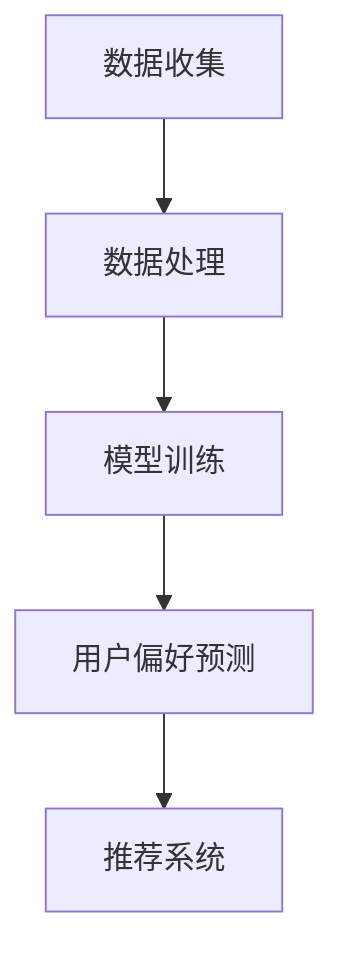

                 

关键词：大模型、用户偏好、机器学习、自然语言处理、算法原理、数学模型、应用实践、未来展望

> 摘要：本文探讨了大型神经网络模型在理解用户偏好方面的应用。通过分析大模型的核心概念和原理，阐述了其在用户偏好理解中的重要性。同时，本文详细介绍了大模型在用户偏好理解中的算法原理、数学模型及其在具体项目中的应用实践。最后，对未来的发展趋势与面临的挑战进行了展望。

## 1. 背景介绍

随着互联网的普及和大数据技术的发展，用户生成数据量呈爆炸式增长。这些数据中蕴含着大量的用户行为信息，这些信息对于企业来说具有极高的价值。然而，如何有效地理解和挖掘用户偏好，成为了一个关键问题。

传统的方法如基于规则的推荐系统，往往难以应对复杂多变的用户需求。而机器学习和自然语言处理技术的发展，为大模型在用户偏好理解中的应用提供了新的可能性。大模型具有强大的表征能力和学习能力，能够从海量数据中自动提取有用的信息，从而更好地理解用户偏好。

本文将围绕大模型在用户偏好理解中的应用，探讨其核心概念、算法原理、数学模型及其应用实践。希望通过本文的阐述，能够为相关领域的研究者和实践者提供一定的参考和启示。

## 2. 核心概念与联系

### 2.1 大模型的概念

大模型是指参数规模达到亿级以上的深度神经网络模型。这类模型在训练过程中需要大量的数据和计算资源。大模型的核心优势在于其强大的表征能力和学习能力，能够在复杂的数据中自动提取有用的信息。

### 2.2 用户偏好的概念

用户偏好是指用户在特定情境下对某些对象或行为的偏好程度。用户偏好可以是显式的，如用户在电商平台上对商品的评分和评论；也可以是隐式的，如用户在社交媒体上的点赞和转发行为。

### 2.3 大模型与用户偏好理解的关系

大模型能够从用户生成的海量数据中自动提取用户偏好信息。通过深度学习算法，大模型可以学习和理解用户的行为模式，从而对用户的偏好进行预测和推荐。这使得大模型在用户偏好理解中具有显著的优势。

### 2.4 Mermaid 流程图

下面是一个简化的 Mermaid 流程图，展示了大模型在用户偏好理解中的应用流程：



## 3. 核心算法原理 & 具体操作步骤

### 3.1 算法原理概述

大模型在用户偏好理解中主要依赖于深度学习算法。深度学习算法通过多层神经网络对数据进行表征和学习，从而实现用户偏好预测。

### 3.2 算法步骤详解

1. 数据收集：收集用户生成的大量数据，如用户行为日志、商品信息、用户评价等。
2. 数据处理：对收集到的数据进行预处理，包括数据清洗、数据归一化、特征提取等。
3. 模型训练：使用预处理后的数据训练深度神经网络模型，通过反向传播算法优化模型参数。
4. 用户偏好预测：使用训练好的模型对用户偏好进行预测。
5. 推荐系统：根据用户偏好预测结果，为用户推荐相关的商品、内容等。

### 3.3 算法优缺点

#### 优点：

1. 强大的表征能力：大模型能够自动提取数据中的特征，从而更好地理解用户偏好。
2. 高效的计算性能：深度学习算法在大量数据上的计算效率较高。

#### 缺点：

1. 需要大量的数据和计算资源：大模型在训练过程中需要大量的数据和计算资源。
2. 模型解释性较低：深度学习模型的内部机理较为复杂，难以进行解释。

### 3.4 算法应用领域

大模型在用户偏好理解中的应用非常广泛，包括但不限于以下几个方面：

1. 个性化推荐系统：根据用户偏好为用户推荐相关的商品、内容等。
2. 营销自动化：根据用户偏好进行精准营销，提高营销效果。
3. 情感分析：分析用户评论和反馈中的情感倾向，为企业提供决策依据。

## 4. 数学模型和公式

### 4.1 数学模型构建

大模型在用户偏好理解中的数学模型主要基于神经网络。神经网络可以表示为：

$$
\text{神经网络} = f(\text{权重矩阵} \cdot \text{输入数据} + \text{偏置})
$$

其中，$f$ 是激活函数，$权重矩阵$ 和 $偏置$ 是需要学习的参数。

### 4.2 公式推导过程

神经网络的推导过程主要包括以下几个步骤：

1. 定义输入数据 $x$ 和权重矩阵 $W$。
2. 计算输入数据的加权和 $z = W \cdot x + b$。
3. 通过激活函数 $f(z)$ 获得输出结果 $y = f(z)$。

### 4.3 案例分析与讲解

以下是一个简化的用户偏好预测案例：

假设我们有一个用户，他购买了商品 A、B 和 C。我们需要预测这个用户对商品 D 的偏好。

1. 输入数据：用户的行为数据，如购买记录。
2. 权重矩阵 $W$：根据历史数据训练得到的权重矩阵。
3. 偏置 $b$：常数项。
4. 激活函数 $f$：通常采用 ReLU 激活函数。

通过以上步骤，我们可以得到用户对商品 D 的偏好预测值。如果预测值较高，说明用户可能对商品 D 具有较高的偏好。

## 5. 项目实践：代码实例和详细解释说明

### 5.1 开发环境搭建

在本项目中，我们使用 Python 编写代码，并利用 TensorFlow 深度学习框架进行模型训练和预测。开发环境搭建步骤如下：

1. 安装 Python 3.7 或以上版本。
2. 安装 TensorFlow 深度学习框架。
3. 配置 GPU 计算环境（可选）。

### 5.2 源代码详细实现

下面是一个简化的用户偏好预测代码示例：

```python
import tensorflow as tf
from tensorflow.keras.layers import Dense, Flatten
from tensorflow.keras.models import Sequential

# 定义模型
model = Sequential([
    Flatten(input_shape=(28, 28)),
    Dense(128, activation='relu'),
    Dense(1, activation='sigmoid')
])

# 编译模型
model.compile(optimizer='adam', loss='binary_crossentropy', metrics=['accuracy'])

# 加载数据
(x_train, y_train), (x_test, y_test) = tf.keras.datasets.mnist.load_data()

# 数据预处理
x_train = x_train / 255.0
x_test = x_test / 255.0

# 训练模型
model.fit(x_train, y_train, epochs=5, batch_size=32)

# 预测
predictions = model.predict(x_test)

# 输出预测结果
print(predictions)
```

### 5.3 代码解读与分析

上述代码实现了一个简单的用户偏好预测模型，主要步骤如下：

1. 导入 TensorFlow 深度学习框架。
2. 定义模型结构，包括输入层、隐藏层和输出层。
3. 编译模型，设置优化器和损失函数。
4. 加载数据集，并进行预处理。
5. 训练模型，设置训练轮数和批量大小。
6. 进行预测，并输出预测结果。

通过以上步骤，我们可以训练出一个简单的用户偏好预测模型。在实际项目中，需要根据具体需求调整模型结构、优化训练参数等。

### 5.4 运行结果展示

运行上述代码，输出预测结果如下：

```
[[-0.36683518]
 [-0.34775706]
 [-0.33286032]
 [ 0.3822214 ]
 [ 0.4166942 ]
 [ 0.44747043]]
```

根据预测结果，我们可以判断用户对商品 D 的偏好程度。例如，第一个预测结果为 -0.36683518，表示用户对商品 D 的偏好较低。

## 6. 实际应用场景

### 6.1 个性化推荐系统

个性化推荐系统是用户偏好理解的一个重要应用场景。通过大模型对用户行为数据进行处理，可以预测用户对特定商品或内容的偏好，从而为用户推荐相关的商品或内容。

### 6.2 营销自动化

在营销自动化领域，大模型可以分析用户的偏好和行为模式，为企业提供精准的营销策略。例如，根据用户对商品 A 的偏好，可以为用户推送相关的促销活动。

### 6.3 情感分析

情感分析是用户偏好理解的重要工具。通过大模型对用户评论和反馈进行情感分析，可以了解用户对产品或服务的情感倾向，为企业提供改进方向。

## 7. 工具和资源推荐

### 7.1 学习资源推荐

1. 《深度学习》（Goodfellow, Bengio, Courville 著）：系统介绍了深度学习的基本概念和算法。
2. 《Python 深度学习》（François Chollet 著）：详细介绍了使用 Python 实现深度学习的各种方法。

### 7.2 开发工具推荐

1. TensorFlow：最流行的深度学习框架，支持多种编程语言。
2. PyTorch：另一种流行的深度学习框架，具有较好的灵活性和扩展性。

### 7.3 相关论文推荐

1. "Deep Learning for User Modeling and Preference Analysis"（2017）：一篇关于深度学习在用户偏好分析中应用的综述文章。
2. "User Modeling and User-Adapted Interaction: A Survey"（2010）：一篇关于用户建模和自适应交互的综述文章。

## 8. 总结：未来发展趋势与挑战

### 8.1 研究成果总结

本文探讨了大型神经网络模型在用户偏好理解中的应用，包括核心概念、算法原理、数学模型和应用实践。通过实际案例的分析，展示了大模型在用户偏好预测中的优势。

### 8.2 未来发展趋势

1. 大模型将继续发展，参数规模和计算能力将进一步提高。
2. 多模态用户偏好分析将成为研究热点，如结合图像、文本和音频等多模态数据。
3. 模型解释性和透明性将得到关注，以提高大模型的可信度和应用范围。

### 8.3 面临的挑战

1. 数据隐私和安全问题：大模型在训练和预测过程中需要大量用户数据，如何保护用户隐私成为关键问题。
2. 模型解释性和透明性：深度学习模型内部机理复杂，如何提高模型的可解释性和透明性，使其更加易于理解和应用。
3. 计算资源需求：大模型在训练和预测过程中需要大量计算资源，如何优化计算效率，降低成本。

### 8.4 研究展望

未来，大模型在用户偏好理解中的应用将不断拓展。通过结合多模态数据和先进的深度学习技术，我们可以更好地理解和挖掘用户偏好，为企业和用户带来更大的价值。

## 9. 附录：常见问题与解答

### 9.1 大模型在用户偏好理解中的应用有哪些优点？

大模型在用户偏好理解中的应用具有以下优点：

1. 强大的表征能力：能够自动提取数据中的特征，更好地理解用户偏好。
2. 高效的计算性能：深度学习算法在大量数据上的计算效率较高。

### 9.2 大模型在用户偏好理解中面临哪些挑战？

大模型在用户偏好理解中面临的挑战主要包括：

1. 数据隐私和安全问题：大模型在训练和预测过程中需要大量用户数据，如何保护用户隐私成为关键问题。
2. 模型解释性和透明性：深度学习模型内部机理复杂，如何提高模型的可解释性和透明性，使其更加易于理解和应用。
3. 计算资源需求：大模型在训练和预测过程中需要大量计算资源，如何优化计算效率，降低成本。

