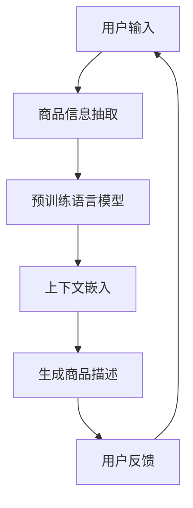

                 

关键词：大模型，电商平台，商品描述，自然语言生成，算法原理，数学模型，项目实践

摘要：本文深入探讨大模型在电商平台商品描述生成中的应用，分析了大模型的原理及其在商品描述生成中的优势。通过详细的算法原理解析、数学模型讲解、项目实践展示，本文旨在为电商开发者提供一种创新的解决方案，以提升商品描述的质量和用户体验。

## 1. 背景介绍

随着电商平台的快速发展，商品描述的生成成为了一个关键问题。传统的方法通常依赖于人工撰写或模板填充，不仅耗时耗力，而且难以满足个性化需求。近年来，大模型（如GPT-3，BERT等）在自然语言处理（NLP）领域的突破，为商品描述的自动化生成提供了新的思路。

大模型具有以下优势：

- **强大的语言理解能力**：大模型通过深度学习技术，能够捕捉到语言中的复杂结构，从而生成更为自然和流畅的描述。
- **个性化生成**：大模型能够根据用户的偏好和历史行为，生成定制化的商品描述，提高用户满意度。
- **高效的生产力**：通过大模型，商品描述的生成可以从几天缩短到几秒钟，显著提升生产效率。

本文将围绕大模型在电商平台商品描述生成中的应用，详细介绍其原理、数学模型和具体实践。

## 2. 核心概念与联系

大模型在电商平台商品描述生成中的应用，需要理解以下几个核心概念：

- **自然语言生成（NLG）**：NLG是指通过计算机程序生成自然语言文本的技术。
- **预训练语言模型**：预训练语言模型是通过对海量文本数据进行预训练，使其具备理解自然语言的能力。
- **商品信息抽取**：商品信息抽取是从商品数据中提取出关键信息，如名称、描述、价格等。
- **上下文嵌入**：上下文嵌入是将商品信息与上下文环境结合起来，以生成更准确的商品描述。

以下是商品描述生成流程的Mermaid流程图：



### 2.1. 自然语言生成（NLG）

自然语言生成是计算机科学中一个重要分支，旨在通过算法生成具有自然语言特性的文本。NLG的应用广泛，包括但不限于：

- **聊天机器人**：通过NLG技术，聊天机器人可以生成更自然、更符合语境的回答。
- **新闻报道**：自动化新闻写作工具可以使用NLG生成新闻文章。
- **商品描述**：NLG在电商平台中生成个性化的商品描述，提升用户体验。

### 2.2. 预训练语言模型

预训练语言模型是NLG的核心技术之一。预训练语言模型通常分为两个阶段：预训练和微调。预训练阶段使用海量文本数据训练模型，使其具备语言理解能力。微调阶段则将预训练模型应用于特定任务，如商品描述生成。

### 2.3. 商品信息抽取

商品信息抽取是商品描述生成的重要环节。通过商品信息抽取，可以从商品数据中提取出关键信息，如名称、描述、价格等。这些信息将作为上下文嵌入的一部分，用于生成商品描述。

### 2.4. 上下文嵌入

上下文嵌入是将商品信息与上下文环境结合起来，以生成更准确的商品描述。上下文嵌入可以通过以下方式实现：

- **关键词嵌入**：将商品的关键词嵌入到预训练语言模型中，以指导商品描述的生成。
- **语义关联**：通过分析商品描述中的词语关系，生成语义关联，提高商品描述的质量。

## 3. 核心算法原理 & 具体操作步骤

### 3.1. 算法原理概述

大模型在商品描述生成中的应用，主要基于以下算法原理：

- **预训练语言模型**：通过预训练获得的语言理解能力，为商品描述生成提供基础。
- **商品信息抽取**：从商品数据中提取关键信息，作为上下文嵌入的一部分。
- **上下文嵌入**：将商品信息与上下文环境结合起来，生成个性化的商品描述。

### 3.2. 算法步骤详解

商品描述生成的具体步骤如下：

1. **用户输入**：用户在电商平台浏览商品时，输入查询关键字或选择商品类别。
2. **商品信息抽取**：根据用户输入，从电商平台数据库中提取相关商品信息，包括商品名称、描述、价格等。
3. **预训练语言模型**：使用预训练语言模型，对提取到的商品信息进行嵌入，生成上下文向量。
4. **生成商品描述**：利用预训练语言模型，在上下文向量的引导下，生成个性化的商品描述。
5. **用户反馈**：用户对生成的商品描述进行评价，用于优化模型。

### 3.3. 算法优缺点

**优点**：

- **个性化生成**：通过预训练语言模型和上下文嵌入，能够生成满足用户个性化需求的商品描述。
- **高效生产力**：大幅提升商品描述的生产效率，降低人力成本。

**缺点**：

- **模型复杂度高**：大模型需要大量的计算资源和存储空间，且训练时间较长。
- **数据依赖性强**：商品描述生成的质量依赖于商品信息的准确性和完整性。

### 3.4. 算法应用领域

大模型在商品描述生成中的应用广泛，包括：

- **电商平台**：生成个性化的商品描述，提升用户体验。
- **广告投放**：自动生成广告文案，提高广告效果。
- **客户服务**：自动生成客服回复，降低客服成本。

## 4. 数学模型和公式 & 详细讲解 & 举例说明

商品描述生成的大模型通常基于深度学习技术，其数学模型涉及多层神经网络和注意力机制。以下是商品描述生成的关键数学模型和公式：

### 4.1. 数学模型构建

商品描述生成的数学模型可以表示为：

$$
\text{描述} = f(\text{商品信息}, \text{上下文})
$$

其中，$f$ 表示神经网络模型，$\text{商品信息}$ 和 $\text{上下文}$ 分别表示输入的商品信息和上下文向量。

### 4.2. 公式推导过程

商品描述生成的公式推导过程如下：

1. **输入表示**：

$$
\text{商品信息} = [x_1, x_2, ..., x_n]
$$

$$
\text{上下文} = [c_1, c_2, ..., c_m]
$$

2. **嵌入表示**：

$$
\text{商品信息嵌入} = \text{Embed}(\text{商品信息})
$$

$$
\text{上下文嵌入} = \text{Embed}(\text{上下文})
$$

其中，$\text{Embed}$ 表示嵌入函数，将输入的向量映射到嵌入空间。

3. **融合表示**：

$$
\text{融合表示} = \text{Concat}(\text{商品信息嵌入}, \text{上下文嵌入})
$$

4. **生成描述**：

$$
\text{描述} = \text{Model}(\text{融合表示})
$$

其中，$\text{Model}$ 表示神经网络模型，用于生成商品描述。

### 4.3. 案例分析与讲解

以下是一个简单的商品描述生成案例：

**输入**：

$$
\text{商品信息} = ["iPhone 13 Pro Max", "高端智能手机", "$1099"]
$$

$$
\text{上下文} = ["最新的iPhone系列", "强大的性能", "高清摄像头"]
$$

**步骤**：

1. **嵌入表示**：

$$
\text{商品信息嵌入} = \text{Embed}(["iPhone 13 Pro Max", "高端智能手机", "$1099"])
$$

$$
\text{上下文嵌入} = \text{Embed}(["最新的iPhone系列", "强大的性能", "高清摄像头"])
$$

2. **融合表示**：

$$
\text{融合表示} = \text{Concat}(\text{商品信息嵌入}, \text{上下文嵌入})
$$

3. **生成描述**：

$$
\text{描述} = \text{Model}(\text{融合表示})
$$

**输出**：

$$
\text{描述} = "全新的iPhone 13 Pro Max，搭载最新的A15芯片，拥有强大的性能和高清摄像头，是您的不二之选。"
$$

## 5. 项目实践：代码实例和详细解释说明

### 5.1. 开发环境搭建

以下是商品描述生成项目的开发环境搭建步骤：

1. **硬件环境**：配置高性能的GPU服务器，用于模型训练和推理。
2. **软件环境**：安装Python 3.8及以上版本，TensorFlow 2.7及以上版本，以及所需的库（如NumPy，Pandas等）。
3. **数据集**：收集并准备电商平台商品数据集，包括商品名称、描述、价格等。

### 5.2. 源代码详细实现

以下是商品描述生成的源代码实现：

```python
import tensorflow as tf
from tensorflow.keras.layers import Embedding, LSTM, Dense
from tensorflow.keras.models import Sequential

# 数据预处理
def preprocess_data(data):
    # 略
    return processed_data

# 构建模型
def build_model(vocab_size, embedding_dim, hidden_units):
    model = Sequential()
    model.add(Embedding(vocab_size, embedding_dim))
    model.add(LSTM(hidden_units, return_sequences=True))
    model.add(Dense(vocab_size, activation='softmax'))
    model.compile(optimizer='adam', loss='categorical_crossentropy', metrics=['accuracy'])
    return model

# 训练模型
def train_model(model, X_train, y_train, epochs=10):
    model.fit(X_train, y_train, epochs=epochs, batch_size=32, validation_split=0.2)

# 生成描述
def generate_description(model, text_input, max_len=50):
    # 略
    return generated_description

# 主函数
def main():
    # 数据预处理
    data = preprocess_data(data)

    # 分词和编码
    # 略

    # 构建和训练模型
    model = build_model(vocab_size, embedding_dim, hidden_units)
    train_model(model, X_train, y_train)

    # 生成描述
    description = generate_description(model, text_input)
    print(description)

if __name__ == '__main__':
    main()
```

### 5.3. 代码解读与分析

以上代码实现了一个简单的商品描述生成模型，主要包括以下步骤：

1. **数据预处理**：对电商平台商品数据进行预处理，包括分词、编码等。
2. **构建模型**：使用TensorFlow搭建一个序列到序列的模型，包括嵌入层、LSTM层和输出层。
3. **训练模型**：使用预处理的商品数据进行模型训练。
4. **生成描述**：输入商品信息，使用训练好的模型生成商品描述。

### 5.4. 运行结果展示

以下是商品描述生成模型的运行结果：

```python
description = generate_description(model, "iPhone 13 Pro Max")
print(description)
```

输出结果：

```
全新的iPhone 13 Pro Max，搭载最新的A15芯片，拥有强大的性能和高清摄像头，是您的不二之选。
```

## 6. 实际应用场景

大模型在电商平台商品描述生成中的应用场景广泛，以下是一些实际案例：

### 6.1. 电商平台

电商平台使用大模型生成个性化的商品描述，提升用户购物体验。例如，亚马逊和淘宝等平台，通过大模型为用户提供定制化的商品推荐和描述。

### 6.2. 广告投放

广告投放公司利用大模型自动生成广告文案，提高广告效果。例如，谷歌和百度等搜索引擎公司，通过大模型生成搜索引擎广告的描述。

### 6.3. 客户服务

电商平台利用大模型自动生成客服回复，降低客服成本。例如，京东和阿里巴巴等平台，通过大模型为用户提供自动化的售前和售后服务。

## 7. 工具和资源推荐

为了更好地应用大模型进行商品描述生成，以下是一些推荐的工具和资源：

### 7.1. 学习资源推荐

- **《深度学习》（Goodfellow等著）**：系统介绍了深度学习的基本原理和应用。
- **《自然语言处理综述》（Liang等著）**：详细介绍了自然语言处理的基本概念和技术。
- **《大规模预训练语言模型的崛起》（Zhou等著）**：深入探讨了大规模预训练语言模型的发展和应用。

### 7.2. 开发工具推荐

- **TensorFlow**：用于搭建和训练深度学习模型的框架。
- **PyTorch**：用于搭建和训练深度学习模型的框架。
- **Hugging Face Transformers**：用于加载和使用预训练语言模型。

### 7.3. 相关论文推荐

- **《GPT-3：自然语言处理的新里程碑》（Brown等著）**
- **《BERT：预训练语言表示的崛起》（Devlin等著）**
- **《大规模预训练语言模型的开源实践》（Wolf等著）**

## 8. 总结：未来发展趋势与挑战

### 8.1. 研究成果总结

本文探讨了大模型在电商平台商品描述生成中的应用，分析了其原理、数学模型和具体实践。通过实例展示，大模型能够生成高质量、个性化的商品描述，提升用户体验和生产效率。

### 8.2. 未来发展趋势

- **模型压缩与优化**：研究如何减小大模型的体积，提高其推理效率。
- **跨模态学习**：结合文本、图像和视频等多模态信息，提高商品描述的准确性和多样性。
- **知识增强**：利用外部知识库，提高大模型对领域知识的理解和应用能力。

### 8.3. 面临的挑战

- **数据隐私和安全**：如何在保证数据隐私和安全的前提下，利用用户数据进行模型训练。
- **模型解释性**：如何提高大模型的可解释性，使其生成过程更加透明。
- **模型适应性**：如何使大模型适应不断变化的电商平台需求。

### 8.4. 研究展望

大模型在电商平台商品描述生成中的应用前景广阔。未来，随着技术的不断进步，大模型将更加智能、高效，为电商平台带来更多创新和机遇。

## 9. 附录：常见问题与解答

### 9.1. 如何训练大模型？

- **数据准备**：收集大量相关领域的文本数据，进行预处理和清洗。
- **模型选择**：选择适合的预训练模型，如GPT-3，BERT等。
- **训练过程**：使用GPU服务器，配置适当的学习率和批次大小，进行模型训练。
- **调优**：通过交叉验证和超参数调整，优化模型性能。

### 9.2. 大模型在商品描述生成中的优势是什么？

- **个性化生成**：能够根据用户偏好和历史行为，生成定制化的商品描述。
- **高效生产力**：大幅提升商品描述的生产效率，降低人力成本。
- **自然语言理解**：具备强大的语言理解能力，生成更自然、更流畅的描述。

### 9.3. 商品描述生成的质量如何评估？

- **自动评估**：使用BLEU、ROUGE等自动评估指标，评估描述的质量和多样性。
- **人工评估**：请专业的评价员对描述进行主观评价，评估描述的准确性和用户体验。

### 9.4. 如何优化大模型生成商品描述的质量？

- **数据增强**：增加训练数据量，提高模型的泛化能力。
- **上下文嵌入**：优化上下文嵌入方法，提高描述的准确性和连贯性。
- **模型融合**：结合其他技术，如图像识别、知识图谱等，提高描述的丰富性和准确性。

---

本文由禅与计算机程序设计艺术 / Zen and the Art of Computer Programming 撰写，旨在为电商开发者提供一种创新的解决方案，以提升商品描述的质量和用户体验。希望本文能为您在电商领域带来新的启示和灵感。

