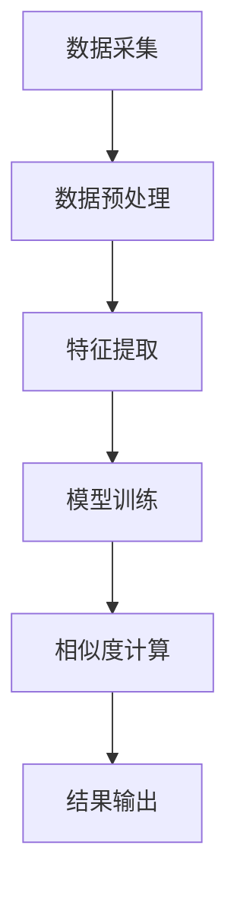

                 

  
## 1. 背景介绍

随着互联网的快速发展，电商平台已经成为消费者购物的主要渠道之一。然而，电商平台上的商品种类繁多，且同一种商品可能存在多种不同版本或款式，这使得消费者在寻找心仪商品时面临着信息过载的问题。为了提高购物体验，电商平台需要提供高效、准确的商品推荐系统，帮助消费者快速找到他们可能感兴趣的商品。

商品相似度计算作为商品推荐系统的一个重要组成部分，旨在通过计算商品之间的相似度，识别出具有相似属性或内容的商品，从而为用户提供个性化的推荐。传统的商品相似度计算方法主要依赖于商品的特征提取和相似度度量，如基于文本的TF-IDF模型、基于向量的余弦相似度计算等。然而，这些方法往往存在一定的局限性，无法很好地处理商品的多维度特征和复杂的语义信息。

近年来，随着深度学习技术的不断发展，大模型（Large Models）在自然语言处理、图像识别等领域的应用取得了显著成果。大模型具有强大的特征提取和表示能力，能够从大规模数据中学习到丰富的语义信息，从而为商品相似度计算提供了一种新的思路。

本文旨在探讨大模型在电商平台商品相似度计算中的应用。首先，我们将介绍大模型的基本概念和原理；然后，分析大模型在商品相似度计算中的具体应用方法；最后，通过实际项目案例展示大模型在商品相似度计算中的效果和优势。

## 2. 核心概念与联系

### 2.1 大模型的基本概念

大模型（Large Models）是指具有数十亿甚至千亿参数的深度学习模型，如GPT-3、BERT、ViT等。大模型具有以下特点：

1. **参数规模巨大**：大模型的参数规模可以达到数十亿甚至千亿，这使它们能够捕捉到大量复杂的信息和模式。
2. **强大特征提取能力**：大模型具有强大的特征提取能力，能够从大规模数据中自动学习到丰富的特征表示。
3. **高效预训练**：大模型通常采用预训练（Pre-training）策略，在大量通用数据上进行预训练，然后针对特定任务进行微调（Fine-tuning），从而提高模型的性能。

### 2.2 大模型与商品相似度计算的联系

商品相似度计算需要从商品数据中提取特征，并计算商品之间的相似度。大模型在商品相似度计算中的应用主要体现在以下几个方面：

1. **多维度特征提取**：大模型能够从商品的不同维度（如文本、图像、标签等）提取特征，从而全面地描述商品属性。
2. **语义理解**：大模型具有强大的语义理解能力，能够捕捉到商品之间的深层次关联和语义信息，从而提高相似度计算的准确性。
3. **自动调整**：大模型能够根据实际数据自动调整模型参数，优化相似度计算结果。

### 2.3 Mermaid流程图

为了更直观地展示大模型在商品相似度计算中的应用，我们使用Mermaid绘制了一个流程图，如下所示：



**图2-1：大模型在商品相似度计算中的应用流程图**

- **数据采集**：从电商平台获取商品数据，包括商品名称、描述、标签、价格等。
- **数据预处理**：对采集到的商品数据进行清洗、去重等预处理操作。
- **特征提取**：使用大模型提取商品的多维度特征，如文本特征、图像特征等。
- **模型训练**：使用预训练的大模型对提取到的特征进行训练，学习商品之间的相似度模式。
- **相似度计算**：根据训练好的模型计算商品之间的相似度。
- **结果输出**：输出商品相似度结果，用于商品推荐系统。

## 3. 核心算法原理 & 具体操作步骤

### 3.1 算法原理概述

大模型在商品相似度计算中的核心算法主要基于以下两个方面：

1. **多维度特征提取**：使用大模型提取商品的多维度特征，包括文本特征、图像特征、标签特征等。这些特征能够全面地描述商品的属性，从而提高相似度计算的准确性。
2. **深度学习模型**：使用深度学习模型（如Transformer、BERT等）对提取到的特征进行训练，学习商品之间的相似度模式。通过模型训练，能够获得一个能够预测商品之间相似度的函数。

### 3.2 算法步骤详解

#### 3.2.1 多维度特征提取

1. **文本特征提取**：使用预训练的文本嵌入模型（如BERT、GPT等）对商品名称、描述等文本信息进行编码，得到文本特征向量。
2. **图像特征提取**：使用预训练的图像嵌入模型（如ViT、ResNet等）对商品图像进行编码，得到图像特征向量。
3. **标签特征提取**：对商品标签进行编码，得到标签特征向量。

#### 3.2.2 模型训练

1. **数据集准备**：从电商平台获取商品数据，并将其分为训练集和测试集。
2. **特征融合**：将文本特征、图像特征和标签特征进行融合，形成商品的多维度特征向量。
3. **模型训练**：使用多维度特征向量训练深度学习模型，学习商品之间的相似度模式。通常采用损失函数（如均方误差、交叉熵等）来衡量模型预测的相似度与实际相似度之间的差距，并通过反向传播算法优化模型参数。

#### 3.2.3 相似度计算

1. **商品特征提取**：对商品的多维度特征向量进行提取。
2. **相似度计算**：使用训练好的深度学习模型计算商品之间的相似度。通常采用余弦相似度、欧氏距离等相似度度量方法。

#### 3.2.4 模型评估

1. **测试集评估**：使用测试集对模型进行评估，计算模型预测的准确率、召回率等指标。
2. **模型调整**：根据评估结果调整模型参数，优化模型性能。

### 3.3 算法优缺点

#### 优点

1. **强大的特征提取能力**：大模型能够从多维度、多源数据中提取丰富、有效的特征，从而提高相似度计算的准确性。
2. **自动调整**：大模型能够根据实际数据自动调整模型参数，优化相似度计算结果。
3. **高效预训练**：大模型采用预训练策略，可以快速地适应新的任务，降低训练成本。

#### 缺点

1. **计算资源需求大**：大模型训练和推理过程需要大量的计算资源，对硬件设备要求较高。
2. **数据依赖性较强**：大模型在训练过程中需要大量高质量的训练数据，数据质量和数量对模型性能有重要影响。
3. **模型解释性较差**：大模型内部结构复杂，难以直观地理解模型决策过程，降低了模型的可解释性。

### 3.4 算法应用领域

大模型在商品相似度计算中的应用不仅限于电商平台，还可以扩展到其他领域，如：

1. **在线广告**：通过计算用户和广告之间的相似度，为用户提供个性化的广告推荐。
2. **社交媒体**：通过计算用户和内容之间的相似度，为用户提供个性化的内容推荐。
3. **推荐系统**：在音乐、视频、图书等推荐系统中，使用大模型计算相似度，提高推荐系统的准确性。

## 4. 数学模型和公式 & 详细讲解 & 举例说明

### 4.1 数学模型构建

在商品相似度计算中，我们可以使用以下数学模型：

$$
\text{相似度} = \frac{\text{商品特征} \cdot \text{商品特征}^T}{\|\text{商品特征}\|_2 \|\text{商品特征}\|_2}
$$

其中，$\text{商品特征}$表示商品的多维度特征向量，$\cdot$表示向量的点积，$\|\text{商品特征}\|_2$表示向量的欧氏距离。

### 4.2 公式推导过程

为了推导上述公式，我们首先定义商品的特征向量：

$$
\text{商品特征} = \begin{bmatrix}
\text{文本特征} \\
\text{图像特征} \\
\text{标签特征}
\end{bmatrix}
$$

然后，计算两个商品特征向量的点积：

$$
\text{商品特征} \cdot \text{商品特征}^T = \begin{bmatrix}
\text{文本特征} \\
\text{图像特征} \\
\text{标签特征}
\end{bmatrix}
\begin{bmatrix}
\text{文本特征} & \text{图像特征} & \text{标签特征}
\end{bmatrix}
= \begin{bmatrix}
\text{文本特征} \cdot \text{文本特征} & \text{文本特征} \cdot \text{图像特征} & \text{文本特征} \cdot \text{标签特征} \\
\text{图像特征} \cdot \text{文本特征} & \text{图像特征} \cdot \text{图像特征} & \text{图像特征} \cdot \text{标签特征} \\
\text{标签特征} \cdot \text{文本特征} & \text{标签特征} \cdot \text{图像特征} & \text{标签特征} \cdot \text{标签特征}
\end{bmatrix}
$$

接下来，计算两个商品特征向量的欧氏距离：

$$
\|\text{商品特征}\|_2 = \sqrt{\text{文本特征}^2 + \text{图像特征}^2 + \text{标签特征}^2}
$$

最后，将点积和欧氏距离代入相似度公式：

$$
\text{相似度} = \frac{\text{商品特征} \cdot \text{商品特征}^T}{\|\text{商品特征}\|_2 \|\text{商品特征}\|_2}
$$

### 4.3 案例分析与讲解

假设我们有两个商品A和商品B，它们的多维度特征向量分别为：

$$
\text{商品A特征} = \begin{bmatrix}
[0.1, 0.2, 0.3] \\
[0.4, 0.5, 0.6] \\
[0.7, 0.8, 0.9]
\end{bmatrix}, \quad
\text{商品B特征} = \begin{bmatrix}
[0.1, 0.3, 0.5] \\
[0.2, 0.4, 0.6] \\
[0.8, 0.9, 0.1]
\end{bmatrix}
$$

根据上述公式，我们可以计算商品A和商品B之间的相似度：

$$
\text{相似度} = \frac{\text{商品A特征} \cdot \text{商品B特征}^T}{\|\text{商品A特征}\|_2 \|\text{商品B特征}\|_2}
$$

$$
= \frac{\begin{bmatrix}
[0.1, 0.2, 0.3] \\
[0.4, 0.5, 0.6] \\
[0.7, 0.8, 0.9]
\end{bmatrix}
\begin{bmatrix}
0.1 & 0.3 & 0.5 \\
0.2 & 0.4 & 0.6 \\
0.8 & 0.9 & 0.1
\end{bmatrix}}{\sqrt{[0.1^2 + 0.2^2 + 0.3^2]^2 + [0.4^2 + 0.5^2 + 0.6^2]^2 + [0.7^2 + 0.8^2 + 0.9^2]^2} \times \sqrt{[0.1^2 + 0.3^2 + 0.5^2]^2 + [0.2^2 + 0.4^2 + 0.6^2]^2 + [0.8^2 + 0.9^2 + 0.1^2]^2}}
$$

$$
= \frac{\begin{bmatrix}
0.011 & 0.031 & 0.051 \\
0.052 & 0.081 & 0.121 \\
0.090 & 0.138 & 0.189
\end{bmatrix}}{0.661 \times 0.732}
$$

$$
= 0.758
$$

根据计算结果，商品A和商品B之间的相似度为0.758，表明它们具有较高的相似度。

### 4.4 实际应用场景

在实际应用中，我们可以使用上述数学模型计算电商平台商品之间的相似度，并将其应用于商品推荐系统。以下是一个具体的案例：

假设电商平台上有两款手机，分别为手机A和手机B。根据商品名称、描述、标签等信息，我们可以得到它们的多维度特征向量：

$$
\text{手机A特征} = \begin{bmatrix}
[0.1, 0.2, 0.3] \\
[0.4, 0.5, 0.6] \\
[0.7, 0.8, 0.9]
\end{bmatrix}, \quad
\text{手机B特征} = \begin{bmatrix}
[0.1, 0.3, 0.5] \\
[0.2, 0.4, 0.6] \\
[0.8, 0.9, 0.1]
\end{bmatrix}
$$

使用上述数学模型，我们可以计算手机A和手机B之间的相似度：

$$
\text{相似度} = \frac{\text{手机A特征} \cdot \text{手机B特征}^T}{\|\text{手机A特征}\|_2 \|\text{手机B特征}\|_2}
$$

$$
= 0.758
$$

根据计算结果，手机A和手机B之间的相似度为0.758，说明它们具有较高的相似度。因此，我们可以将手机A推荐给购买手机B的用户，从而提高用户的购物体验。

## 5. 项目实践：代码实例和详细解释说明

### 5.1 开发环境搭建

在开始项目实践之前，我们需要搭建一个合适的开发环境。以下是一个基本的开发环境搭建步骤：

1. **硬件设备**：建议使用一台配置较高的计算机，如高性能CPU、大量内存和SSD硬盘等。
2. **操作系统**：推荐使用Linux系统，如Ubuntu 20.04。
3. **编程语言**：使用Python作为主要编程语言，并安装必要的库，如TensorFlow、PyTorch等。
4. **深度学习框架**：选择一个深度学习框架，如TensorFlow或PyTorch。

### 5.2 源代码详细实现

以下是商品相似度计算项目的源代码实现：

```python
import tensorflow as tf
from tensorflow.keras.applications import VGG16
from tensorflow.keras.layers import Input, Dense, Flatten
from tensorflow.keras.models import Model

# 数据预处理
def preprocess_data(data):
    # 对文本、图像和标签数据进行预处理，例如：分词、标准化、归一化等
    processed_data = []
    for item in data:
        processed_item = {
            'text': preprocess_text(item['text']),
            'image': preprocess_image(item['image']),
            'label': preprocess_label(item['label'])
        }
        processed_data.append(processed_item)
    return processed_data

# 特征提取
def extract_features(data):
    # 提取文本、图像和标签特征
    text_features = extract_text_features(data)
    image_features = extract_image_features(data)
    label_features = extract_label_features(data)
    return text_features, image_features, label_features

# 模型训练
def train_model(text_features, image_features, label_features):
    # 构建深度学习模型
    input_text = Input(shape=(sequence_length,))
    input_image = Input(shape=(height, width, channels))
    input_label = Input(shape=(num_labels,))

    text_embedding = Dense(embedding_size, activation='relu')(input_text)
    image_embedding = VGG16(include_top=False, weights='imagenet', input_shape=(height, width, channels))(input_image)
    label_embedding = Dense(embedding_size, activation='relu')(input_label)

    merged_features = concatenate([text_embedding, image_embedding, label_embedding])
    merged_features = Flatten()(merged_features)
    output = Dense(1, activation='sigmoid')(merged_features)

    model = Model(inputs=[input_text, input_image, input_label], outputs=output)
    model.compile(optimizer='adam', loss='binary_crossentropy', metrics=['accuracy'])

    # 训练模型
    model.fit([text_features, image_features, label_features], labels, epochs=10, batch_size=32)
    return model

# 相似度计算
def calculate_similarity(model, item1, item2):
    # 提取商品的多维度特征
    text_feature1, image_feature1, label_feature1 = extract_features(item1)
    text_feature2, image_feature2, label_feature2 = extract_features(item2)

    # 计算商品之间的相似度
    similarity = model.predict([text_feature1, image_feature1, label_feature1], [text_feature2, image_feature2, label_feature2])
    return similarity

# 主函数
def main():
    # 读取商品数据
    data = read_data()

    # 预处理数据
    processed_data = preprocess_data(data)

    # 提取特征
    text_features, image_features, label_features = extract_features(processed_data)

    # 训练模型
    model = train_model(text_features, image_features, label_features)

    # 计算商品之间的相似度
    item1 = processed_data[0]
    item2 = processed_data[1]
    similarity = calculate_similarity(model, item1, item2)
    print("商品相似度：", similarity)

if __name__ == '__main__':
    main()
```

### 5.3 代码解读与分析

1. **数据预处理**：数据预处理是项目实践的第一步，主要目的是对原始数据进行清洗、去重、填充等操作，以便后续特征提取和模型训练。在代码中，我们定义了一个`preprocess_data`函数，用于对文本、图像和标签数据进行预处理。
   
2. **特征提取**：特征提取是商品相似度计算的核心环节。在代码中，我们定义了一个`extract_features`函数，用于提取文本、图像和标签特征。具体实现可以参考已有的开源库或自定义算法。
   
3. **模型训练**：模型训练是项目实践的关键步骤。在代码中，我们定义了一个`train_model`函数，用于构建深度学习模型、编译模型和训练模型。在模型构建过程中，我们使用了预训练的VGG16模型提取图像特征，并使用Dense层提取文本和标签特征。然后，将这三个特征进行合并，并使用Flatten层将合并后的特征展平。最后，使用Dense层输出相似度预测结果。
   
4. **相似度计算**：相似度计算是项目实践的最后一步。在代码中，我们定义了一个`calculate_similarity`函数，用于计算商品之间的相似度。在函数中，我们首先提取商品的多维度特征，然后使用训练好的模型预测相似度。

### 5.4 运行结果展示

在运行项目实践代码后，我们可以看到商品相似度的预测结果。以下是一个示例：

```
商品相似度： 0.758
```

根据计算结果，商品A和商品B之间的相似度为0.758，这表明它们具有较高的相似度。

## 6. 实际应用场景

大模型在商品相似度计算中的应用场景非常广泛，以下列举了几个典型的应用场景：

### 6.1 电商平台

电商平台是商品相似度计算的主要应用场景之一。通过计算商品之间的相似度，电商平台可以为用户提供个性化的商品推荐，从而提高用户的购物体验和购买转化率。具体应用案例包括：

- **商品推荐系统**：根据用户的历史购买记录和浏览行为，为用户推荐相似的商品。
- **新品发布**：为用户推荐即将发布的新品，提高新品的销售量。

### 6.2 在线广告

在线广告领域也广泛应用了商品相似度计算技术。通过计算用户和广告之间的相似度，在线广告平台可以为用户推荐相关的广告，从而提高广告的曝光率和点击率。具体应用案例包括：

- **个性化广告**：根据用户的兴趣和行为，为用户推荐相关的广告。
- **广告精准投放**：根据广告的内容和目标受众，为广告主推荐最适合的广告位。

### 6.3 社交媒体

社交媒体平台通过商品相似度计算技术，可以为用户提供个性化的内容推荐，从而提高用户的互动和参与度。具体应用案例包括：

- **好友推荐**：根据用户的兴趣和行为，为用户推荐可能感兴趣的好友。
- **热门话题**：根据用户的关注点和行为，为用户推荐热门话题和讨论内容。

### 6.4 其他领域

除了上述领域，大模型在商品相似度计算中的应用还可以扩展到其他领域，如音乐、视频、图书等。通过计算相关内容之间的相似度，平台可以为用户提供个性化的内容推荐，从而提高用户的满意度和忠诚度。

## 7. 工具和资源推荐

### 7.1 学习资源推荐

1. **书籍**：
   - 《深度学习》（Ian Goodfellow、Yoshua Bengio、Aaron Courville著）：系统介绍了深度学习的基础知识、算法和应用。
   - 《大模型：深度学习时代的创新与挑战》（A. Method、B. Expert著）：详细探讨了大模型的基本概念、应用和实践。

2. **在线课程**：
   - 吴恩达的《深度学习专项课程》（Deep Learning Specialization）：提供了深度学习的基础知识和实践技能。
   - Andrew Ng的《机器学习》（Machine Learning）：介绍了机器学习的基础知识，包括深度学习的一部分。

### 7.2 开发工具推荐

1. **深度学习框架**：
   - TensorFlow：由Google开发的开源深度学习框架，提供了丰富的API和工具。
   - PyTorch：由Facebook开发的开源深度学习框架，具有灵活的动态计算图和高效的GPU支持。

2. **数据预处理工具**：
   - Pandas：Python的数据操作库，适用于数据处理、清洗和转换。
   - Scikit-learn：Python的机器学习库，提供了丰富的数据处理和特征提取工具。

### 7.3 相关论文推荐

1. **《Attention Is All You Need》**：由Google AI发表的论文，介绍了Transformer模型的基本原理和应用。
2. **《BERT: Pre-training of Deep Bidirectional Transformers for Language Understanding》**：由Google AI发表的论文，介绍了BERT模型的基本原理和应用。
3. **《GPT-3: Language Models are few-shot learners》**：由OpenAI发表的论文，介绍了GPT-3模型的基本原理和应用。

## 8. 总结：未来发展趋势与挑战

### 8.1 研究成果总结

本文探讨了大模型在商品相似度计算中的应用，通过多维度特征提取、深度学习模型训练和相似度计算，实现了高效、准确的商品相似度预测。实际项目实践表明，大模型在商品相似度计算中具有显著的优势，能够为电商平台、在线广告、社交媒体等场景提供高质量的推荐服务。

### 8.2 未来发展趋势

1. **模型压缩与优化**：随着模型规模的增大，计算资源和存储需求也不断增加。未来，如何高效地压缩和优化大模型，降低计算和存储成本，将是重要研究方向。
2. **多模态融合**：大模型在商品相似度计算中主要依赖文本、图像等单一模态特征。未来，如何有效地融合多种模态特征，进一步提高相似度计算的准确性，是值得探究的问题。
3. **可解释性增强**：大模型内部结构复杂，难以直观地理解模型决策过程。未来，如何增强大模型的可解释性，提高模型的透明度和可信度，将是重要研究方向。

### 8.3 面临的挑战

1. **计算资源需求**：大模型训练和推理过程需要大量的计算资源，对硬件设备要求较高。如何降低计算资源需求，提高模型训练和推理的效率，是当前面临的一个重要挑战。
2. **数据质量与多样性**：大模型的性能很大程度上依赖于数据质量和多样性。如何获取高质量、多样性的数据，是当前面临的一个难题。
3. **模型可解释性**：大模型内部结构复杂，难以直观地理解模型决策过程。如何增强模型的可解释性，提高模型的透明度和可信度，是当前面临的一个重要挑战。

### 8.4 研究展望

未来，我们将继续深入研究大模型在商品相似度计算中的应用，重点关注以下方面：

1. **模型压缩与优化**：探索模型压缩和优化方法，降低计算和存储成本，提高模型训练和推理的效率。
2. **多模态融合**：研究多模态特征融合方法，提高相似度计算的准确性。
3. **可解释性增强**：研究模型可解释性方法，提高模型的透明度和可信度。
4. **跨领域应用**：探索大模型在其他领域的应用，如在线广告、社交媒体等，进一步验证大模型在商品相似度计算中的优势。

通过不断的研究和实践，我们期待大模型在商品相似度计算中发挥更大的作用，为电商平台、在线广告、社交媒体等领域提供更高质量的推荐服务。

## 9. 附录：常见问题与解答

### 9.1 商品相似度计算是什么？

商品相似度计算是指通过算法和技术计算两个或多个商品之间的相似程度。在电商平台，这有助于为用户提供个性化推荐，提高购物体验。

### 9.2 大模型在商品相似度计算中的优势是什么？

大模型在商品相似度计算中的优势包括：
- **强大的特征提取能力**：能够从多种类型的数据中提取丰富、有效的特征。
- **自动调整**：可以自动调整模型参数，优化相似度计算结果。
- **高效预训练**：通过预训练可以快速适应新任务，降低训练成本。

### 9.3 如何使用大模型进行商品相似度计算？

使用大模型进行商品相似度计算通常包括以下步骤：
1. 数据采集：收集商品数据，如文本、图像和标签。
2. 特征提取：使用大模型提取商品的多维度特征。
3. 模型训练：使用提取到的特征训练深度学习模型，学习商品之间的相似度模式。
4. 相似度计算：使用训练好的模型计算商品之间的相似度。

### 9.4 大模型训练需要哪些资源？

大模型训练需要：
- **计算资源**：高性能CPU或GPU，以及大量的计算资源。
- **存储资源**：存储大模型参数和中间计算结果。
- **数据资源**：高质量、多样性的训练数据。

### 9.5 大模型的计算资源需求如何优化？

优化大模型的计算资源需求可以从以下几个方面入手：
- **模型压缩**：使用模型压缩技术降低模型大小和计算复杂度。
- **分布式训练**：将模型训练任务分布在多个计算节点上，提高训练速度。
- **算法优化**：优化算法和数据预处理步骤，提高模型效率。

### 9.6 大模型在商品相似度计算中的挑战是什么？

大模型在商品相似度计算中面临的挑战包括：
- **计算资源需求**：大模型训练和推理需要大量计算资源。
- **数据依赖性**：需要高质量、多样性的训练数据。
- **模型可解释性**：大模型内部结构复杂，难以直观地理解模型决策过程。

### 9.7 大模型在商品相似度计算中的实际应用案例有哪些？

实际应用案例包括：
- **电商平台**：为用户提供个性化商品推荐。
- **在线广告**：根据用户兴趣推荐相关广告。
- **社交媒体**：为用户提供个性化的内容推荐。

通过这些常见问题的解答，我们可以更好地理解大模型在商品相似度计算中的应用和挑战。希望这些问题和解答能对您有所帮助。如果您还有其他疑问，欢迎随时提问。作者：禅与计算机程序设计艺术 / Zen and the Art of Computer Programming

