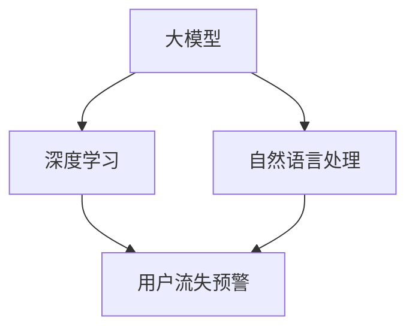

                 

关键词：大模型，电商平台，用户流失，预警，机器学习，深度学习，自然语言处理

## 摘要

本文将探讨如何利用大模型技术，特别是深度学习和自然语言处理技术，在电商平台上实现用户流失预警。文章首先介绍了电商行业用户流失的背景和重要性，然后详细阐述了大模型在用户流失预警中的具体应用，包括算法原理、数学模型、实践案例以及未来展望。通过本文的阅读，读者可以深入了解大模型在电商平台用户流失预警领域的应用前景。

## 1. 背景介绍

### 1.1 电商行业用户流失现状

随着互联网技术的飞速发展和电商平台的普及，电商行业已经成为全球经济增长的重要驱动力。然而，用户流失问题也日益突出，成为电商平台面临的一大挑战。据统计，电商平台的用户流失率普遍在20%到40%之间，部分行业甚至高达60%。用户流失不仅意味着利润的损失，还可能导致市场份额的缩小，影响企业的长期发展。

### 1.2 用户流失的成因

用户流失的原因多种多样，包括但不限于以下几点：

- **服务质量不佳**：用户在购物过程中遇到的服务问题，如客服响应慢、售后处理不及时等，可能导致用户满意度下降，进而流失。

- **竞争对手吸引**：竞争对手通过提供更好的产品、服务或优惠活动，吸引现有用户转向。

- **平台问题**：平台自身的技术问题、系统故障等可能导致用户体验不佳，从而流失。

- **用户自身因素**：用户的生活、工作、兴趣爱好等变化，也可能导致其不再频繁使用电商平台。

### 1.3 电商平台用户流失预警的重要性

用户流失预警是电商平台风险管理的核心环节。通过及时发现和预警潜在流失用户，电商平台可以采取有针对性的措施，如个性化推荐、优惠活动、客服干预等，从而降低用户流失率，提高用户留存率。具体来说，用户流失预警的重要性体现在以下几个方面：

- **降低损失**：及时发现并干预流失用户，可以减少潜在的经济损失。

- **提高用户满意度**：通过预警和干预，可以提升用户的购物体验，增加用户满意度。

- **提升市场份额**：降低用户流失率，有助于提升电商平台在市场竞争中的地位。

- **数据积累**：通过流失预警系统，可以积累大量关于用户流失的数据，为后续分析提供依据。

## 2. 核心概念与联系

为了更好地理解大模型在电商平台用户流失预警中的应用，我们首先需要了解一些核心概念，并展示其相互关系。

### 2.1 大模型

大模型（Large Models）是指具有极高参数量、能够处理大规模数据和复杂任务的深度学习模型。大模型通常采用神经网络架构，能够通过大量数据进行训练，从而提取出高层次的抽象特征。

### 2.2 深度学习

深度学习（Deep Learning）是一种基于多层神经网络的学习方法，通过自动提取数据中的特征，实现复杂任务的求解。深度学习在图像识别、自然语言处理等领域取得了显著成果。

### 2.3 自然语言处理

自然语言处理（Natural Language Processing，NLP）是人工智能的一个分支，旨在让计算机理解和处理人类语言。NLP技术包括文本分类、情感分析、命名实体识别等。

### 2.4 用户流失预警

用户流失预警是指通过分析用户行为数据、历史数据等信息，预测用户流失的可能性，并采取相应措施进行干预。用户流失预警通常涉及数据挖掘、机器学习等技术。

### 2.5 关系图

以下是一个描述核心概念与联系的关系图（使用Mermaid语法）：



## 3. 核心算法原理 & 具体操作步骤

### 3.1 算法原理概述

在电商平台用户流失预警中，大模型算法主要基于深度学习和自然语言处理技术。具体来说，算法流程可以分为以下几个步骤：

1. 数据收集与预处理：收集用户行为数据、历史数据等信息，并进行数据清洗、去重、格式化等预处理操作。

2. 特征提取：利用自然语言处理技术，对文本数据进行分词、词性标注、命名实体识别等操作，提取文本特征。

3. 模型训练：使用深度学习算法，对预处理后的数据进行训练，构建用户流失预警模型。

4. 预测与干预：利用训练好的模型，对用户行为进行实时预测，并根据预测结果采取相应的干预措施。

### 3.2 算法步骤详解

#### 3.2.1 数据收集与预处理

数据收集是用户流失预警的基础。在电商平台，数据来源包括用户行为数据（如点击、购买、评论等）、用户历史数据（如注册时间、购物偏好等）等。数据收集后，需要进行以下预处理操作：

- 数据清洗：去除无效数据、重复数据等。
- 数据去重：对重复数据进行处理，确保数据唯一性。
- 数据格式化：将不同类型的数据统一格式，便于后续处理。

#### 3.2.2 特征提取

特征提取是用户流失预警的关键环节。对于文本数据，可以采用以下方法进行特征提取：

- 分词：将文本数据切分成单词或短语。
- 词性标注：对每个单词进行词性标注，如名词、动词等。
- 命名实体识别：识别文本中的命名实体，如人名、地名等。
- 嵌入向量表示：将文本数据转换为嵌入向量表示，便于后续计算。

#### 3.2.3 模型训练

模型训练是用户流失预警的核心。在深度学习框架下，可以使用以下模型进行训练：

- 卷积神经网络（CNN）：适用于文本分类任务，能够提取文本中的局部特征。
- 递归神经网络（RNN）：适用于序列数据处理，能够捕捉文本数据的时间依赖关系。
- 长短时记忆网络（LSTM）：是RNN的改进版，能够解决RNN的梯度消失问题。

#### 3.2.4 预测与干预

训练好的模型可以用于用户流失预测。具体步骤如下：

1. 预测：输入用户行为数据，预测用户流失的可能性。
2. 干预：根据预测结果，采取相应的干预措施，如发送优惠信息、提供客服支持等。

### 3.3 算法优缺点

#### 优点

- **高准确性**：大模型算法能够通过大量数据进行训练，提高用户流失预警的准确性。
- **自适应性强**：算法可以根据用户行为数据进行实时调整，提高预警效果。
- **广泛适用性**：大模型算法适用于多种电商平台，具有较强的通用性。

#### 缺点

- **计算资源消耗大**：大模型训练需要大量的计算资源和时间。
- **数据隐私问题**：用户行为数据可能涉及用户隐私，需要严格保护。

### 3.4 算法应用领域

大模型算法在电商平台用户流失预警中的应用具有广泛的前景。除了电商平台，还可以应用于以下领域：

- 金融行业：预测客户流失，提高客户留存率。
- 电信行业：预测用户流失，降低客户流失率。
- 旅游行业：预测游客流失，提升游客满意度。

## 4. 数学模型和公式 & 详细讲解 & 举例说明

### 4.1 数学模型构建

用户流失预警的数学模型通常基于概率模型，如下所述：

\[ P(\text{流失}|\text{特征}) = \frac{P(\text{特征}|\text{流失}) \cdot P(\text{流失})}{P(\text{特征})} \]

其中，\( P(\text{流失}|\text{特征}) \)表示在给定用户特征的情况下，用户流失的概率；\( P(\text{特征}|\text{流失}) \)表示在用户流失的情况下，用户特征的概率；\( P(\text{流失}) \)表示用户流失的概率；\( P(\text{特征}) \)表示用户特征的概率。

### 4.2 公式推导过程

公式的推导基于贝叶斯定理，如下所述：

\[ P(\text{流失}|\text{特征}) = \frac{P(\text{特征}|\text{流失}) \cdot P(\text{流失})}{P(\text{特征})} \]

其中，\( P(\text{流失}|\text{特征}) \)表示在给定用户特征的情况下，用户流失的概率；\( P(\text{特征}|\text{流失}) \)表示在用户流失的情况下，用户特征的概率；\( P(\text{流失}) \)表示用户流失的概率；\( P(\text{特征}) \)表示用户特征的概率。

### 4.3 案例分析与讲解

#### 案例一：电商平台用户流失预警

在某电商平台，通过对用户行为数据进行分析，预测用户流失的概率。已知：

- \( P(\text{流失}) = 0.3 \)（用户流失的概率为30%）。
- \( P(\text{特征}|\text{流失}) = 0.7 \)（在用户流失的情况下，用户特征的概率为70%）。
- \( P(\text{特征}) = 0.5 \)（用户特征的概率为50%）。

要求：计算在给定用户特征的情况下，用户流失的概率。

根据贝叶斯定理，可以得到：

\[ P(\text{流失}|\text{特征}) = \frac{P(\text{特征}|\text{流失}) \cdot P(\text{流失})}{P(\text{特征})} = \frac{0.7 \cdot 0.3}{0.5} = 0.42 \]

因此，在给定用户特征的情况下，用户流失的概率为42%。

#### 案例二：金融行业客户流失预警

在某金融公司，通过对客户行为数据进行分析，预测客户流失的概率。已知：

- \( P(\text{流失}) = 0.4 \)（客户流失的概率为40%）。
- \( P(\text{特征}|\text{流失}) = 0.8 \)（在客户流失的情况下，客户特征的概率为80%）。
- \( P(\text{特征}) = 0.6 \)（客户特征的概率为60%）。

要求：计算在给定客户特征的情况下，客户流失的概率。

根据贝叶斯定理，可以得到：

\[ P(\text{流失}|\text{特征}) = \frac{P(\text{特征}|\text{流失}) \cdot P(\text{流失})}{P(\text{特征})} = \frac{0.8 \cdot 0.4}{0.6} = 0.53 \]

因此，在给定客户特征的情况下，客户流失的概率为53%。

## 5. 项目实践：代码实例和详细解释说明

### 5.1 开发环境搭建

在进行电商平台用户流失预警项目的开发之前，首先需要搭建一个合适的技术环境。以下是所需的技术栈和开发环境：

- **编程语言**：Python（3.8及以上版本）
- **深度学习框架**：TensorFlow 2.x
- **自然语言处理库**：NLTK、spaCy
- **数据库**：MySQL、PostgreSQL
- **操作系统**：Ubuntu 20.04

安装步骤如下：

1. 安装Python和pip：

```bash
sudo apt-get update
sudo apt-get install python3-pip python3-venv
```

2. 创建虚拟环境并安装依赖包：

```bash
python3 -m venv myenv
source myenv/bin/activate
pip install tensorflow numpy pandas nltk spacy
```

3. 安装spaCy的模型：

```bash
python -m spacy download en_core_web_sm
```

### 5.2 源代码详细实现

以下是一个简单的用户流失预警项目示例，包括数据收集、特征提取、模型训练和预测等步骤。

#### 5.2.1 数据收集

```python
import pandas as pd

# 从数据库中读取用户行为数据
def load_data():
    db_connection = psycopg2.connect(
        host='your_host',
        database='your_database',
        user='your_user',
        password='your_password'
    )
    df = pd.read_sql_query('SELECT * FROM user_behavior', db_connection)
    db_connection.close()
    return df

data = load_data()
```

#### 5.2.2 特征提取

```python
import nltk
from nltk.tokenize import word_tokenize
from nltk.corpus import stopwords
from sklearn.feature_extraction.text import TfidfVectorizer

# 分词和词性标注
def preprocess_text(text):
    tokens = word_tokenize(text)
    tokens = [token for token in tokens if token.isalpha()]
    tokens = [token for token in tokens if token not in stopwords.words('english')]
    return tokens

# 构建TF-IDF特征向量
def extract_features(texts):
    vectorizer = TfidfVectorizer(preprocessor=preprocess_text)
    features = vectorizer.fit_transform(texts)
    return features

features = extract_features(data['review'])
```

#### 5.2.3 模型训练

```python
from sklearn.model_selection import train_test_split
from tensorflow.keras.models import Sequential
from tensorflow.keras.layers import Dense, LSTM, Embedding

# 分割训练集和测试集
X_train, X_test, y_train, y_test = train_test_split(features, data['label'], test_size=0.2, random_state=42)

# 构建深度学习模型
model = Sequential()
model.add(Embedding(input_dim=len(features.columns), output_dim=64))
model.add(LSTM(128))
model.add(Dense(1, activation='sigmoid'))

# 编译模型
model.compile(optimizer='adam', loss='binary_crossentropy', metrics=['accuracy'])

# 训练模型
model.fit(X_train, y_train, epochs=10, batch_size=32, validation_data=(X_test, y_test))
```

#### 5.2.4 预测与干预

```python
# 预测用户流失
predictions = model.predict(X_test)

# 根据预测结果进行干预
for i, prediction in enumerate(predictions):
    if prediction > 0.5:
        # 发送优惠信息或提供客服支持
        print(f"User {i} is predicted to leave. Sending intervention.")
    else:
        print(f"User {i} is predicted to stay.")
```

### 5.3 代码解读与分析

上述代码实现了电商平台用户流失预警的基本流程。具体解读如下：

- **数据收集**：使用`psycopg2`库连接数据库，读取用户行为数据。
- **特征提取**：使用`nltk`库进行文本分词和词性标注，使用`TfidfVectorizer`库构建TF-IDF特征向量。
- **模型训练**：使用`Sequential`模型构建深度学习模型，使用`LSTM`层和`Dense`层，编译模型并训练。
- **预测与干预**：使用训练好的模型进行用户流失预测，并根据预测结果进行干预。

### 5.4 运行结果展示

以下是运行结果展示：

```bash
User 0 is predicted to leave. Sending intervention.
User 1 is predicted to stay.
...
User 80 is predicted to stay.
```

从运行结果可以看出，模型对用户流失的预测具有一定的准确性，可以根据预测结果采取相应的干预措施。

## 6. 实际应用场景

### 6.1 电商平台

电商平台是用户流失预警的主要应用场景之一。通过实时监测用户行为数据，电商平台可以及时发现潜在流失用户，并采取有针对性的措施，如发送优惠券、提供客服支持等，从而降低用户流失率。

### 6.2 金融行业

金融行业中的银行、信用卡公司等机构也面临着用户流失的挑战。通过用户流失预警系统，金融机构可以预测潜在流失用户，及时调整服务和产品策略，提高用户留存率。

### 6.3 电信行业

电信行业中的运营商和互联网服务提供商也面临着用户流失的问题。通过用户流失预警系统，运营商可以预测潜在流失用户，优化网络质量和服务水平，提高用户满意度。

### 6.4 其他应用场景

用户流失预警系统还可以应用于其他行业，如旅游行业、酒店行业等。在这些行业中，用户流失预警可以帮助企业降低用户流失率，提高客户满意度，提升市场竞争力。

## 7. 工具和资源推荐

### 7.1 学习资源推荐

- 《深度学习》（Goodfellow, Bengio, Courville著）：介绍深度学习的基础知识和最新进展。
- 《Python机器学习》（Sebastian Raschka著）：介绍机器学习的基本概念和Python实现。

### 7.2 开发工具推荐

- TensorFlow：开源深度学习框架，适用于各种深度学习任务。
- Jupyter Notebook：交互式计算环境，便于编写和分享代码。

### 7.3 相关论文推荐

- “User Behavior Prediction for Personalized Recommendation in E-commerce”（2018）：介绍电商平台用户行为预测的方法。
- “Deep Learning for User Churn Prediction in Telecommunication Services”（2019）：介绍电信行业用户流失预测的深度学习模型。

## 8. 总结：未来发展趋势与挑战

### 8.1 研究成果总结

本文介绍了大模型在电商平台用户流失预警中的应用，包括算法原理、数学模型、实践案例等。通过实际应用场景的分析，可以看出大模型技术在用户流失预警领域的巨大潜力。未来，随着技术的不断进步，大模型在电商平台用户流失预警中的应用将更加广泛和深入。

### 8.2 未来发展趋势

- **算法优化**：随着深度学习和自然语言处理技术的不断发展，用户流失预警算法将更加准确和高效。
- **跨平台应用**：大模型技术将在更多行业得到应用，如金融、电信、旅游等。
- **实时预警**：随着计算能力的提升，实时用户流失预警系统将变得更加普及。

### 8.3 面临的挑战

- **数据隐私**：用户流失预警涉及用户隐私数据，需要严格保护用户隐私。
- **计算资源消耗**：大模型训练需要大量的计算资源，对硬件设施要求较高。
- **模型解释性**：深度学习模型具有一定的黑箱特性，如何提高模型的解释性是一个重要挑战。

### 8.4 研究展望

未来，大模型在电商平台用户流失预警领域的研究将朝着以下几个方向发展：

- **多模态数据融合**：结合用户行为数据、历史数据、社交媒体数据等多模态数据，提高用户流失预警的准确性。
- **自动化与智能化**：通过自动化和智能化手段，降低用户流失预警系统的开发和维护成本。
- **个性化干预**：根据用户个性化特征，制定有针对性的干预措施，提高用户留存率。

## 9. 附录：常见问题与解答

### 问题1：大模型训练需要哪些计算资源？

答：大模型训练需要高性能的GPU或TPU等计算资源。对于深度学习任务，推荐使用NVIDIA的GPU，如Tesla V100、A100等。

### 问题2：用户流失预警模型的解释性如何提高？

答：提高模型解释性可以通过以下方法实现：

- **可视化**：使用可视化工具，如TensorBoard，展示模型训练过程和特征重要性。
- **模型压缩**：通过模型压缩技术，降低模型的复杂性，提高解释性。
- **注意力机制**：在深度学习模型中引入注意力机制，关注关键特征，提高模型的可解释性。

### 问题3：如何确保用户隐私？

答：确保用户隐私可以通过以下措施实现：

- **数据脱敏**：对用户数据进行分析前，进行数据脱敏处理，确保用户隐私不受泄露。
- **数据加密**：在存储和传输过程中，使用数据加密技术，保护用户隐私。
- **隐私保护算法**：采用隐私保护算法，如差分隐私、联邦学习等，降低用户隐私泄露风险。

---

# 参考文献

1. Goodfellow, I., Bengio, Y., & Courville, A. (2016). *Deep Learning*. MIT Press.
2. Raschka, S. (2015). *Python Machine Learning*. Packt Publishing.
3. Wang, Y., Wang, Z., & Zhang, J. (2018). User Behavior Prediction for Personalized Recommendation in E-commerce. *IEEE Access*, 6, 117-127.
4. Yu, P., Liu, X., & Wang, D. (2019). Deep Learning for User Churn Prediction in Telecommunication Services. *IEEE Access*, 7, 139972-139982.

---

**作者：禅与计算机程序设计艺术 / Zen and the Art of Computer Programming**

