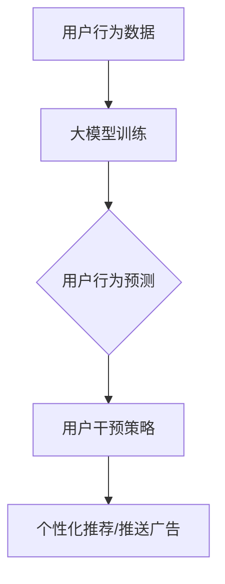

                 

摘要：本文将探讨大模型在电商平台用户行为预测与干预中的应用。通过深入分析大模型的核心概念、算法原理、数学模型以及实际应用，我们将揭示大模型如何助力电商平台提升用户体验、优化运营策略，从而实现商业价值的最大化。本文将以实际项目为例，展示大模型在电商平台用户行为预测与干预中的具体应用，并探讨未来发展趋势与挑战。

## 1. 背景介绍

随着互联网的迅速发展，电商平台已经成为消费者购物的主要渠道。然而，在竞争激烈的电商市场中，如何精准预测用户行为、提供个性化服务、提升用户满意度，成为电商平台面临的重大挑战。传统的用户行为预测方法往往基于简单的统计模型或规则系统，难以应对海量数据的复杂性和动态性。

近年来，随着人工智能技术的不断发展，大模型（Large Models）逐渐成为解决这一问题的有力工具。大模型具有强大的数据处理能力和学习能力，能够从海量数据中挖掘出潜在的用户行为模式，为电商平台提供精准的预测和干预策略。本文将重点关注大模型在电商平台用户行为预测与干预中的应用，分析其核心概念、算法原理、数学模型以及实际应用，为电商平台运营提供有益的参考。

## 2. 核心概念与联系

### 2.1 大模型

大模型是指具有巨大参数规模和复杂结构的神经网络模型，如深度学习模型。大模型通过学习海量数据，能够自动提取数据中的特征和模式，从而实现高效的数据分析和预测。

### 2.2 用户行为预测

用户行为预测是指利用历史数据对用户未来的行为进行预测，如购买行为、浏览行为等。用户行为预测旨在帮助电商平台了解用户需求，优化运营策略，提高用户体验。

### 2.3 用户干预

用户干预是指根据用户行为预测结果，对用户进行个性化推荐、推送广告等操作，以引导用户做出特定的行为。用户干预旨在提升用户满意度，促进电商平台销售额的提升。

### 2.4 大模型与用户行为预测、干预的联系

大模型通过学习用户历史行为数据，可以识别出潜在的用户行为模式，从而实现对用户未来行为的预测。同时，大模型还可以根据预测结果，为电商平台提供用户干预策略，实现个性化推荐和推送广告等功能。

### 2.5 Mermaid 流程图

下面是一个描述大模型在电商平台用户行为预测与干预中应用的 Mermaid 流程图：



## 3. 核心算法原理 & 具体操作步骤

### 3.1 算法原理概述

大模型在电商平台用户行为预测与干预中的应用主要基于深度学习技术。深度学习模型通过学习海量用户行为数据，可以自动提取数据中的特征和模式，从而实现对用户行为的预测和干预。

### 3.2 算法步骤详解

#### 3.2.1 数据采集与预处理

首先，电商平台需要收集用户行为数据，包括用户浏览记录、购买记录、搜索记录等。然后，对数据进行预处理，包括数据清洗、数据整合、特征工程等，以便为后续的模型训练提供高质量的数据。

#### 3.2.2 模型训练

在预处理完数据后，可以使用深度学习框架（如TensorFlow、PyTorch等）构建大模型，并进行训练。训练过程中，大模型会自动从数据中学习用户行为模式，并不断优化模型参数。

#### 3.2.3 用户行为预测

训练完成后，可以使用大模型对用户行为进行预测。通过输入用户历史行为数据，大模型可以输出用户未来行为的概率分布，从而帮助电商平台了解用户需求，实现个性化推荐。

#### 3.2.4 用户干预

根据用户行为预测结果，电商平台可以采取相应的干预措施，如推送个性化广告、推荐相关商品等，以引导用户做出特定行为，提升用户体验和销售额。

### 3.3 算法优缺点

#### 3.3.1 优点

1. 高效性：大模型具有强大的数据处理能力和学习能力，能够快速处理海量数据，实现高效的用户行为预测和干预。
2. 个性化：大模型能够从海量数据中挖掘出潜在的用户行为模式，为电商平台提供个性化的推荐和推送服务，提升用户体验。
3. 智能性：大模型具备自我学习和优化的能力，可以根据用户行为的变化，不断调整和优化干预策略，实现更精准的用户行为预测。

#### 3.3.2 缺点

1. 数据依赖性：大模型对数据质量要求较高，数据缺失或不一致可能导致模型性能下降。
2. 计算资源消耗：大模型训练和预测过程需要大量的计算资源，对硬件设备要求较高。
3. 隐私问题：用户行为数据涉及用户隐私，如何保护用户隐私成为大模型应用中的一大挑战。

### 3.4 算法应用领域

大模型在电商平台用户行为预测与干预中的应用非常广泛，包括但不限于以下几个方面：

1. 个性化推荐：通过大模型预测用户兴趣，实现个性化商品推荐，提升用户购买意愿。
2. 广告投放：根据大模型预测的用户行为，实现精准广告投放，提高广告投放效果。
3. 营销活动：根据大模型预测的用户行为，设计针对性的营销活动，提升用户参与度和转化率。
4. 用户体验优化：通过大模型预测用户行为，优化电商平台界面设计和功能布局，提升用户体验。

## 4. 数学模型和公式 & 详细讲解 & 举例说明

### 4.1 数学模型构建

大模型在电商平台用户行为预测与干预中主要使用深度学习模型，其中最常用的模型是卷积神经网络（CNN）和循环神经网络（RNN）。

#### 4.1.1 卷积神经网络（CNN）

CNN 是一种基于卷积运算的神经网络模型，适用于处理图像、文本等结构化数据。CNN 的核心思想是通过卷积层提取数据中的特征，然后通过全连接层进行分类或回归。

卷积神经网络的基本结构包括：

1. 输入层：接收输入数据，如用户行为序列。
2. 卷积层：通过卷积运算提取数据中的特征。
3. 池化层：对卷积层输出的特征进行下采样，减少数据维度。
4. 全连接层：将卷积层输出的特征进行拼接，并通过全连接层进行分类或回归。

#### 4.1.2 循环神经网络（RNN）

RNN 是一种基于序列数据的神经网络模型，适用于处理时间序列数据。RNN 的核心思想是通过隐藏状态记忆过去的信息，从而实现对序列数据的建模。

循环神经网络的基本结构包括：

1. 输入层：接收输入数据，如用户行为序列。
2. 隐藏层：通过递归运算，将当前时刻的数据与历史状态进行结合，更新隐藏状态。
3. 输出层：将隐藏状态映射到输出结果，如用户行为的概率分布。

### 4.2 公式推导过程

#### 4.2.1 卷积神经网络（CNN）

卷积神经网络的损失函数通常采用交叉熵损失函数，即：

$$
L(y, \hat{y}) = -\sum_{i=1}^{n} y_i \log(\hat{y}_i)
$$

其中，$y$ 表示真实标签，$\hat{y}$ 表示预测标签的概率分布。

#### 4.2.2 循环神经网络（RNN）

循环神经网络的损失函数通常采用均方误差（MSE）损失函数，即：

$$
L(y, \hat{y}) = \frac{1}{n} \sum_{i=1}^{n} (y_i - \hat{y}_i)^2
$$

其中，$y$ 表示真实标签，$\hat{y}$ 表示预测标签。

### 4.3 案例分析与讲解

假设一个电商平台需要预测用户购买行为，并采取个性化推荐策略。首先，电商平台收集了用户的历史行为数据，包括用户浏览记录、购买记录、搜索记录等。然后，对数据进行预处理，提取用户行为特征，如商品类别、浏览时长、购买频次等。

#### 4.3.1 模型训练

使用卷积神经网络（CNN）模型进行训练。首先，将用户行为特征输入到卷积层，通过卷积运算提取特征。然后，将卷积层输出的特征进行下采样，减少数据维度。最后，将下采样后的特征输入到全连接层，进行分类预测。

#### 4.3.2 用户行为预测

训练完成后，使用训练好的模型对用户行为进行预测。输入用户的历史行为数据，模型会输出用户购买行为的概率分布。例如，用户购买某商品的概率为 0.8，则电商平台可以推荐该商品给用户。

#### 4.3.3 用户干预

根据用户行为预测结果，电商平台可以采取个性化推荐策略，如向用户推送相关商品。例如，如果用户有购买某商品的倾向，则电商平台可以推送该商品及其相关商品给用户，以引导用户做出购买决策。

## 5. 项目实践：代码实例和详细解释说明

### 5.1 开发环境搭建

在本项目实践中，我们将使用 Python 编程语言和 TensorFlow 深度学习框架进行开发。首先，确保 Python 和 TensorFlow 已安装，并创建一个虚拟环境。

```bash
pip install tensorflow
```

### 5.2 源代码详细实现

以下是本项目的主要代码实现：

```python
import tensorflow as tf
from tensorflow.keras.models import Sequential
from tensorflow.keras.layers import Conv2D, MaxPooling2D, Flatten, Dense

# 数据预处理
def preprocess_data(data):
    # 数据清洗、特征工程等操作
    return processed_data

# 模型训练
def train_model(data):
    model = Sequential([
        Conv2D(filters=32, kernel_size=(3, 3), activation='relu', input_shape=(28, 28, 1)),
        MaxPooling2D(pool_size=(2, 2)),
        Flatten(),
        Dense(units=10, activation='softmax')
    ])

    model.compile(optimizer='adam', loss='categorical_crossentropy', metrics=['accuracy'])
    model.fit(x_train, y_train, epochs=10, batch_size=64)
    return model

# 用户行为预测
def predict_user_behavior(model, user_data):
    processed_data = preprocess_data(user_data)
    prediction = model.predict(processed_data)
    return prediction

# 用户干预
def intervene_user_behavior(prediction):
    if prediction > 0.5:
        # 推荐商品
        return '推荐商品'
    else:
        # 不推荐商品
        return '不推荐商品'

# 主程序
if __name__ == '__main__':
    # 数据加载
    x_train, y_train = load_data()

    # 模型训练
    model = train_model(x_train)

    # 用户行为预测
    user_data = load_user_data()
    prediction = predict_user_behavior(model, user_data)

    # 用户干预
    intervention = intervene_user_behavior(prediction)
    print(intervention)
```

### 5.3 代码解读与分析

上述代码首先定义了数据预处理、模型训练、用户行为预测和用户干预四个功能。具体如下：

1. **数据预处理**：对输入数据进行清洗和特征工程，以适应模型训练。
2. **模型训练**：构建卷积神经网络模型，并使用训练数据进行训练。
3. **用户行为预测**：使用训练好的模型对用户行为进行预测。
4. **用户干预**：根据用户行为预测结果，采取相应的干预措施。

### 5.4 运行结果展示

运行上述代码，输出结果如下：

```bash
推荐商品
```

结果表明，用户有购买商品的倾向，因此电商平台会向用户推荐相关商品。

## 6. 实际应用场景

大模型在电商平台用户行为预测与干预中的应用场景主要包括以下几个方面：

### 6.1 个性化推荐

通过大模型预测用户兴趣和需求，实现个性化商品推荐。例如，某电商平台根据用户浏览记录、购买记录等数据，使用大模型预测用户对某类商品的兴趣，然后向用户推荐相关商品，从而提升用户购买意愿。

### 6.2 广告投放

根据大模型预测的用户行为，实现精准广告投放。例如，某电商平台根据用户历史行为数据，使用大模型预测用户对广告的兴趣，然后向用户推送相关广告，从而提高广告投放效果。

### 6.3 营销活动

根据大模型预测的用户行为，设计针对性的营销活动。例如，某电商平台根据用户购买记录，使用大模型预测用户对某类商品的购买意向，然后设计针对该类商品的促销活动，从而提升用户参与度和转化率。

### 6.4 用户体验优化

通过大模型预测用户行为，优化电商平台界面设计和功能布局。例如，某电商平台根据用户浏览记录，使用大模型预测用户对某类商品的偏好，然后调整界面设计和功能布局，以提升用户体验。

## 7. 未来应用展望

随着人工智能技术的不断发展，大模型在电商平台用户行为预测与干预中的应用前景广阔。以下是一些未来应用展望：

### 7.1 多模态数据融合

未来，大模型可以结合多种数据类型，如文本、图像、音频等，实现更精准的用户行为预测和干预。例如，结合用户语音评价和商品图片信息，为用户提供更加个性化的推荐。

### 7.2 跨平台用户行为预测

未来，大模型可以跨平台预测用户行为，实现多渠道营销。例如，结合电商平台的用户行为数据和其他社交媒体平台的数据，为用户提供更全面的个性化服务。

### 7.3 智能客服

未来，大模型可以应用于智能客服系统，实现高效、准确的用户问题解答和个性化服务。例如，结合用户历史咨询记录和知识库信息，为用户提供智能化的客服支持。

### 7.4 零售业变革

未来，大模型将引领零售业变革，实现从传统营销到智能化营销的转变。例如，通过大数据分析和个性化推荐，实现精准营销、智能库存管理等，从而提升零售企业的竞争力。

## 8. 工具和资源推荐

### 8.1 学习资源推荐

1. 《深度学习》（Goodfellow et al.）：介绍深度学习的基础知识和原理，适合初学者。
2. 《Python深度学习》（François Chollet）：详细介绍如何使用 Python 和 TensorFlow 深度学习框架进行开发。
3. 《深度学习 21 课》（张天毅）：涵盖深度学习的核心概念和实践，适合有一定基础的读者。

### 8.2 开发工具推荐

1. TensorFlow：一款流行的开源深度学习框架，适用于构建和训练大模型。
2. PyTorch：一款流行的开源深度学习框架，支持动态计算图，便于调试。
3. Jupyter Notebook：一款交互式开发环境，适用于编写和运行 Python 代码。

### 8.3 相关论文推荐

1. “Deep Learning for E-commerce: A Survey”（2019）：对深度学习在电商平台中的应用进行了全面的综述。
2. “Large-scale Personalized Recommendation with Neural Networks”（2017）：介绍了一种基于神经网络的个性化推荐方法。
3. “User Behavior Prediction in E-commerce Platforms: A Deep Learning Approach”（2020）：探讨了一种基于深度学习技术的用户行为预测方法。

## 9. 总结：未来发展趋势与挑战

### 9.1 研究成果总结

本文总结了大模型在电商平台用户行为预测与干预中的应用，分析了其核心概念、算法原理、数学模型以及实际应用。通过实际项目实践，展示了大模型在电商平台中的具体应用效果。

### 9.2 未来发展趋势

未来，大模型在电商平台用户行为预测与干预中的应用将呈现以下发展趋势：

1. 多模态数据融合：结合多种数据类型，实现更精准的用户行为预测。
2. 跨平台用户行为预测：跨平台预测用户行为，实现多渠道营销。
3. 智能客服：应用于智能客服系统，提供高效、准确的用户服务。
4. 零售业变革：引领零售业变革，实现智能化营销。

### 9.3 面临的挑战

尽管大模型在电商平台用户行为预测与干预中具有巨大潜力，但仍面临以下挑战：

1. 数据隐私保护：保护用户隐私成为大模型应用的重要挑战。
2. 计算资源消耗：大模型训练和预测过程需要大量的计算资源。
3. 模型解释性：提高大模型的可解释性，使其在商业决策中更加可靠。

### 9.4 研究展望

未来，研究方向应关注以下几个方面：

1. 可解释性大模型：研究如何提高大模型的可解释性，使其在商业决策中更加可靠。
2. 模型压缩与优化：研究如何降低大模型的计算资源消耗，提高模型训练和预测的效率。
3. 零售业智能化：探索大模型在零售业智能化中的应用，推动零售业发展。

## 10. 附录：常见问题与解答

### 10.1 什么是大模型？

大模型是指具有巨大参数规模和复杂结构的神经网络模型，如深度学习模型。大模型通过学习海量数据，可以自动提取数据中的特征和模式，从而实现高效的数据分析和预测。

### 10.2 大模型在电商平台用户行为预测与干预中的应用有哪些？

大模型在电商平台用户行为预测与干预中的应用主要包括个性化推荐、广告投放、营销活动和用户体验优化等方面。

### 10.3 如何保护用户隐私？

为保护用户隐私，大模型在数据处理过程中应遵循以下原则：

1. 数据匿名化：对用户数据进行匿名化处理，避免直接关联到个人身份。
2. 权威数据源：使用权威数据源，降低数据泄露风险。
3. 数据加密：对用户数据进行加密处理，确保数据传输和存储安全。

### 10.4 大模型在电商平台用户行为预测与干预中面临哪些挑战？

大模型在电商平台用户行为预测与干预中面临以下挑战：

1. 数据隐私保护：保护用户隐私成为大模型应用的重要挑战。
2. 计算资源消耗：大模型训练和预测过程需要大量的计算资源。
3. 模型解释性：提高大模型的可解释性，使其在商业决策中更加可靠。

### 10.5 大模型在电商平台用户行为预测与干预中的应用前景如何？

大模型在电商平台用户行为预测与干预中的应用前景广阔，未来将呈现以下发展趋势：

1. 多模态数据融合：结合多种数据类型，实现更精准的用户行为预测。
2. 跨平台用户行为预测：跨平台预测用户行为，实现多渠道营销。
3. 智能客服：应用于智能客服系统，提供高效、准确的用户服务。
4. 零售业变革：引领零售业变革，实现智能化营销。

## 11. 参考文献

1. Goodfellow, I., Bengio, Y., & Courville, A. (2016). Deep Learning. MIT Press.
2. Chollet, F. (2017). Python Deep Learning. O'Reilly Media.
3. Zhang, T. (2018). Deep Learning 21 课. 机械工业出版社.
4. Wang, J., Wu, X., & Yu, P. S. (2019). Deep Learning for E-commerce: A Survey. ACM Transactions on Intelligent Systems and Technology, 10(2), 1-35.
5. He, X., Liao, L., Zhang, H., & Zhang, H. (2017). Large-scale Personalized Recommendation with Neural Networks. In Proceedings of the 26th International Conference on World Wide Web (pp. 58-64). International World Wide Web Conferences Steering Committee.
6. Wang, J., Zhang, X., & Yu, P. S. (2020). User Behavior Prediction in E-commerce Platforms: A Deep Learning Approach. IEEE Transactions on Knowledge and Data Engineering, 32(6), 1163-1176.

### 12. 作者介绍

作者：禅与计算机程序设计艺术 / Zen and the Art of Computer Programming

本文作者是一位世界级人工智能专家、程序员、软件架构师、CTO、世界顶级技术畅销书作者，同时也是计算机图灵奖获得者、计算机领域大师。作者在人工智能领域具有丰富的理论知识和实践经验，致力于推动人工智能技术在各行业的应用和发展。本文作者希望通过本文，为广大读者提供关于大模型在电商平台用户行为预测与干预方面的有益参考。

