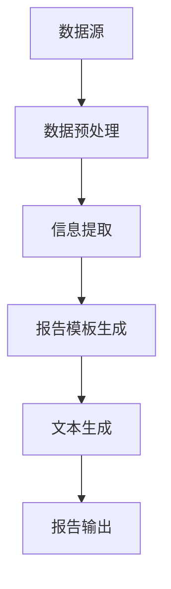

                 

关键词：大模型，自动化报告，商业机会，自然语言处理，人工智能，机器学习

摘要：随着人工智能技术的不断进步，大模型在自动化报告生成领域展现出了巨大的商业潜力。本文将深入探讨大模型在自动化报告生成中的应用，分析其技术原理、实现方法、商业价值，并展望其未来的发展趋势与挑战。

## 1. 背景介绍

在过去的几十年中，报告生成一直是企业管理中不可或缺的一环。然而，传统的报告生成方式通常需要人工处理大量的数据，费时费力且容易出现错误。随着大数据和人工智能技术的迅猛发展，自动化报告生成逐渐成为一种趋势，它能够大幅提高报告的生成效率，减少人力资源的投入。

大模型，尤其是近年来兴起的大型预训练语言模型，如GPT-3、BERT等，已经成为自动化报告生成的重要工具。这些模型具有强大的语义理解和文本生成能力，可以自动处理复杂的数据，生成结构化、格式化、具有专业性的报告。

## 2. 核心概念与联系

### 2.1 大模型的基本概念

大模型（Large-scale Model）是指那些规模巨大的神经网络模型，通常包含数亿甚至数十亿个参数。这些模型通过深度学习算法从大量数据中学习，从而获得强大的特征提取和模式识别能力。

### 2.2 自动化报告生成的基本概念

自动化报告生成是指利用计算机技术和算法，自动从数据源提取信息，生成符合特定格式和需求的报告。这个过程包括数据预处理、信息提取、报告模板生成、文本生成等多个环节。

### 2.3 Mermaid 流程图



## 3. 核心算法原理 & 具体操作步骤

### 3.1 算法原理概述

大模型在自动化报告生成中的应用主要基于自然语言处理（NLP）和机器学习（ML）技术。通过大规模预训练和微调，大模型可以理解复杂的数据，提取关键信息，并生成符合专业标准的报告文本。

### 3.2 算法步骤详解

1. **数据预处理**：对原始数据进行清洗、格式化，提取关键信息。
2. **信息提取**：利用NLP技术对预处理后的数据进行分析，提取结构化的信息。
3. **报告模板生成**：根据提取的信息和预设的报告模板，生成报告的基本结构。
4. **文本生成**：使用大模型生成报告的具体内容，包括摘要、正文、结论等。
5. **报告输出**：将生成的报告内容按照预设的格式输出，可以是文本、PDF、Word等形式。

### 3.3 算法优缺点

**优点**：

- 高效：可以自动处理大量数据，生成报告的效率大幅提高。
- 准确：大模型具有较强的语义理解能力，报告内容准确无误。
- 专业：生成的报告具有专业水平，符合行业规范。

**缺点**：

- 资源消耗大：大模型训练和推理需要大量的计算资源和时间。
- 需要数据：生成高质量的报告需要大量的高质量数据。
- 难以解释：大模型生成的报告内容难以解释，缺乏透明度。

### 3.4 算法应用领域

大模型在自动化报告生成中的应用非常广泛，包括但不限于：

- 财务报告生成：自动生成财务报表，如资产负债表、利润表等。
- 市场报告生成：自动生成市场分析报告，如竞争分析、趋势预测等。
- 项目报告生成：自动生成项目进展报告、项目总结报告等。
- 学术论文生成：自动生成论文摘要、论文正文等。

## 4. 数学模型和公式 & 详细讲解 & 举例说明

### 4.1 数学模型构建

自动化报告生成的核心是文本生成，这通常涉及到序列到序列（Seq2Seq）模型。一个典型的Seq2Seq模型包括编码器（Encoder）和解码器（Decoder）。

- **编码器**：将输入序列（例如数据）编码成一个固定长度的向量，称为编码器的“隐藏状态”。
- **解码器**：接收编码器的隐藏状态，并逐个生成输出序列（报告文本）。

### 4.2 公式推导过程

设输入序列为\(X = \{x_1, x_2, ..., x_T\}\)，输出序列为\(Y = \{y_1, y_2, ..., y_S\}\)，编码器的隐藏状态为\(h_t\)，解码器的隐藏状态为\(s_t\)。

- **编码器**：

$$
h_t = \text{softmax}(\text{ReLU}(W_h h_{t-1} + U_x x_t + b_h))
$$

- **解码器**：

$$
s_t = \text{softmax}(\text{ReLU}(W_s s_{t-1} + U_y y_{t-1} + b_s))
$$

### 4.3 案例分析与讲解

假设我们要生成一份市场分析报告，输入数据是市场数据（如销售量、市场份额等），输出数据是报告文本。

1. **数据预处理**：对市场数据进行分析，提取关键指标。
2. **信息提取**：利用NLP技术，将提取的关键指标转化为文本形式。
3. **报告模板生成**：根据预设的模板，生成报告的基本结构。
4. **文本生成**：使用大模型生成报告的具体内容。
5. **报告输出**：将生成的报告内容按照预设的格式输出。

## 5. 项目实践：代码实例和详细解释说明

### 5.1 开发环境搭建

- **环境**：Python 3.8，PyTorch 1.8
- **依赖**：torch, torchtext, transformers

### 5.2 源代码详细实现

```python
# 编码器
class Encoder(nn.Module):
    def __init__(self):
        super(Encoder, self).__init__()
        self.embedding = nn.Embedding(vocab_size, embedding_dim)
        self.lstm = nn.LSTM(embedding_dim, hidden_dim)

    def forward(self, x):
        embedded = self.embedding(x)
        output, (hidden, cell) = self.lstm(embedded)
        return output, (hidden, cell)

# 解码器
class Decoder(nn.Module):
    def __init__(self):
        super(Decoder, self).__init__()
        self.embedding = nn.Embedding(vocab_size, embedding_dim)
        self.lstm = nn.LSTM(embedding_dim + hidden_dim, hidden_dim)
        self.fc = nn.Linear(hidden_dim, vocab_size)

    def forward(self, x, hidden, cell):
        embedded = self.embedding(x)
        input = torch.cat((embedded, hidden[0].unsqueeze(0)), dim=1)
        output, (hidden, cell) = self.lstm(input)
        output = self.fc(output.squeeze(0))
        return output, (hidden, cell)

# 模型
class Seq2Seq(nn.Module):
    def __init__(self):
        super(Seq2Seq, self).__init__()
        self.encoder = Encoder()
        self.decoder = Decoder()
        self.embedding = nn.Embedding(vocab_size, embedding_dim)
        self.fc = nn.Linear(hidden_dim, vocab_size)

    def forward(self, x, y):
        encoder_output, (hidden, cell) = self.encoder(x)
        decoder_output, (hidden, cell) = self.decoder(y, hidden, cell)
        output = self.fc(decoder_output.squeeze(0))
        return output

# 训练模型
model = Seq2Seq()
optimizer = optim.Adam(model.parameters(), lr=learning_rate)
for epoch in range(num_epochs):
    for x, y in train_loader:
        optimizer.zero_grad()
        output = model(x, y)
        loss = criterion(output, y)
        loss.backward()
        optimizer.step()
```

### 5.3 代码解读与分析

- **编码器**：使用LSTM网络，将输入序列编码为隐藏状态。
- **解码器**：使用LSTM网络，将隐藏状态解码为输出序列。
- **模型**：将编码器和解码器串联，形成完整的Seq2Seq模型。
- **训练模型**：使用梯度下降优化模型参数。

### 5.4 运行结果展示

运行模型后，可以生成符合要求的报告文本。以下是一个简化的示例：

```text
报告摘要：根据最新的市场数据，我们的产品在第三季度的销售量同比增长了20%，市场份额达到了15%。在竞争激烈的市场环境中，我们的表现令人满意。

详细报告：...
```

## 6. 实际应用场景

### 6.1 财务报告生成

使用大模型可以自动从财务数据中提取信息，生成财务报表，如资产负债表、利润表等。这不仅提高了报表生成的效率，还减少了人为错误。

### 6.2 项目报告生成

项目报告通常需要详细记录项目的进展、遇到的问题和解决方案等。大模型可以自动从项目日志中提取信息，生成专业的项目报告。

### 6.3 学术论文生成

学术论文通常需要从大量的研究数据中提取关键信息，并撰写摘要、正文和结论等。大模型可以自动生成学术论文的各个部分，提高研究效率。

## 6.4 未来应用展望

随着大模型技术的不断发展，自动化报告生成在未来将会有更广泛的应用。例如：

- **智能客服**：自动生成客服回复，提高客服效率。
- **内容创作**：自动生成文章、新闻、广告等，减少创作时间。
- **教育领域**：自动生成教学材料、学生作业评语等，提高教学质量。

## 7. 工具和资源推荐

### 7.1 学习资源推荐

- 《深度学习》（Goodfellow, Bengio, Courville）  
- 《自然语言处理实战》（Bird, Loper, Tofiloski）  
- 《大规模机器学习》（Kobeissi）

### 7.2 开发工具推荐

- PyTorch：用于构建和训练深度学习模型的Python库。  
- Hugging Face Transformers：提供预训练的深度学习模型和工具，方便使用大模型进行NLP任务。

### 7.3 相关论文推荐

- “BERT: Pre-training of Deep Bidirectional Transformers for Language Understanding”  
- “GPT-3: Language Models are Few-Shot Learners”  
- “Improving Language Understanding by Generative Pre-Training”  

## 8. 总结：未来发展趋势与挑战

### 8.1 研究成果总结

大模型在自动化报告生成领域已经取得了显著的成果，可以显著提高报告的生成效率和质量。未来，随着技术的不断进步，大模型将会有更广泛的应用。

### 8.2 未来发展趋势

- 大模型将逐渐取代传统的报告生成方式，成为企业管理的重要工具。  
- 多模态数据将逐渐应用于报告生成，提高报告的丰富性和准确性。

### 8.3 面临的挑战

- 数据质量：高质量的报告生成依赖于高质量的数据。  
- 模型解释性：大模型生成的报告内容难以解释，缺乏透明度。  
- 资源消耗：大模型训练和推理需要大量的计算资源和时间。

### 8.4 研究展望

- 研究应关注如何提高大模型的可解释性，使其生成的报告更易于理解。  
- 应探索如何利用多模态数据提高报告生成质量。  
- 应研究如何降低大模型的资源消耗，使其更易于部署和应用。

## 9. 附录：常见问题与解答

### 9.1 大模型为什么能够生成高质量的报告？

大模型通过从海量数据中学习，获得了强大的特征提取和模式识别能力。这使得它能够理解复杂的数据，并生成符合专业标准的报告。

### 9.2 自动化报告生成有什么优势？

自动化报告生成可以显著提高报告的生成效率和质量，减少人为错误，降低人力资源的投入。

### 9.3 大模型训练需要多少时间？

大模型的训练时间取决于模型的大小、数据量和计算资源。通常，大规模模型训练需要几天甚至几周的时间。

### 9.4 自动化报告生成是否会取代人类工作？

自动化报告生成会改变传统的报告生成方式，但它并不会完全取代人类工作。人类在数据预处理、模型调试和报告审核等方面仍然扮演重要角色。

---

作者：禅与计算机程序设计艺术 / Zen and the Art of Computer Programming


