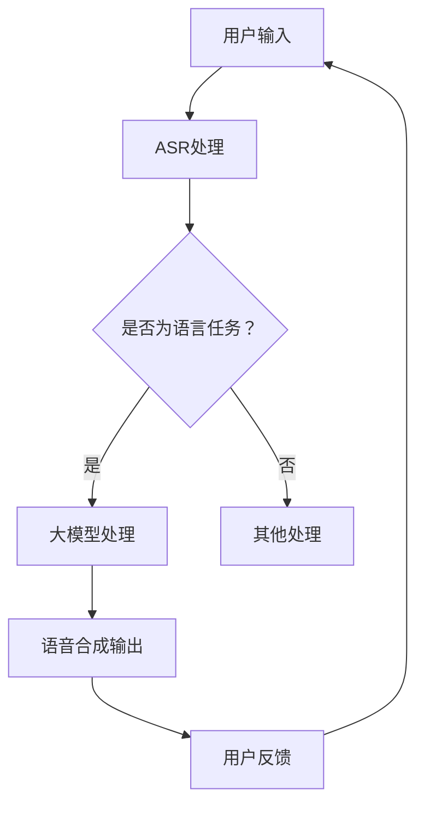

                 

关键词：大模型，虚拟助手，人工智能，开发应用，前景展望

摘要：本文将深入探讨大模型在虚拟助手开发中的应用前景，通过对大模型的核心概念、算法原理、数学模型及其应用场景的详细分析，探讨其在虚拟助手领域的重要性和潜在价值。

## 1. 背景介绍

在当今快速发展的信息技术时代，人工智能（AI）已经成为了推动社会进步的重要力量。虚拟助手作为人工智能的一个重要应用场景，近年来得到了广泛关注和快速发展。虚拟助手是一种基于人工智能技术，通过自然语言处理、语音识别、机器学习等手段，实现与用户交互，提供个性化服务的人工智能系统。

随着计算能力的提升和大数据技术的发展，大模型（Large Models）逐渐成为人工智能研究的重要方向。大模型具有参数规模大、数据集丰富、计算复杂度高等特点，能够有效提升人工智能系统的性能和智能水平。本文将重点探讨大模型在虚拟助手开发中的应用前景，分析其核心概念、算法原理、数学模型及其应用领域，为虚拟助手技术的发展提供新思路和新方法。

## 2. 核心概念与联系

### 2.1 大模型定义

大模型，是指具有数百万甚至数十亿参数的深度学习模型。这些模型通常采用大规模数据集进行训练，以实现高度的泛化能力和智能表现。大模型的代表性技术包括深度神经网络、Transformer模型、生成对抗网络等。

### 2.2 虚拟助手概念

虚拟助手，是指一种模拟人类智能行为，能够理解、处理和回应人类语言和问题的计算机程序。虚拟助手的核心技术包括自然语言处理（NLP）、机器学习（ML）、语音识别（ASR）和语音合成（TTS）等。

### 2.3 大模型与虚拟助手的关系

大模型在虚拟助手开发中具有重要地位。一方面，大模型提供了强大的计算能力和数据处理能力，使得虚拟助手能够处理更为复杂的语言任务；另一方面，大模型通过丰富的数据集训练，能够实现更高的任务泛化能力，提升虚拟助手的智能水平。

### 2.4 Mermaid 流程图

以下是一个简单的大模型与虚拟助手关系的Mermaid流程图：



## 3. 核心算法原理 & 具体操作步骤

### 3.1 算法原理概述

大模型在虚拟助手开发中的应用主要基于深度学习和自然语言处理技术。深度学习是一种通过多层神经网络对数据进行特征提取和建模的方法。自然语言处理则是将自然语言文本转换为计算机可处理的结构化数据，以便进行进一步分析。

### 3.2 算法步骤详解

1. **用户输入处理**：用户通过语音或文本方式与虚拟助手交互，输入问题或指令。
2. **语音识别（ASR）处理**：对用户的语音输入进行识别，将其转换为文本形式。
3. **文本预处理**：对文本进行分词、词性标注、句法分析等预处理，以便进行后续分析。
4. **大模型处理**：使用预训练的大模型对预处理后的文本进行分析，理解其语义和意图。
5. **生成响应**：根据大模型的分析结果，生成合适的响应文本或指令。
6. **语音合成（TTS）输出**：将生成的文本转换为语音，反馈给用户。

### 3.3 算法优缺点

**优点**：
- **强大的计算能力**：大模型能够处理复杂的语言任务，实现高度的自然语言理解。
- **丰富的数据集训练**：大模型通常使用大规模数据集进行训练，具备较高的泛化能力。
- **个性化的用户体验**：大模型可以根据用户的历史交互数据，提供个性化的服务和推荐。

**缺点**：
- **计算资源消耗**：大模型通常需要大量的计算资源和存储空间。
- **训练时间较长**：大模型训练时间较长，需要较长的周期。

### 3.4 算法应用领域

大模型在虚拟助手中的应用广泛，包括但不限于以下领域：
- **客服与支持**：虚拟助手可以实时响应用户的咨询和问题，提供7x24小时的客户服务。
- **智能问答**：虚拟助手能够根据用户的问题，提供准确的答案或信息。
- **个性化推荐**：虚拟助手可以根据用户的历史行为和偏好，提供个性化的推荐和服务。

## 4. 数学模型和公式 & 详细讲解 & 举例说明

### 4.1 数学模型构建

在虚拟助手的开发中，常用的数学模型包括神经网络模型、生成对抗网络模型等。以下是一个简单的神经网络模型示例：

$$
\begin{aligned}
y &= \sigma(\text{W}^T \text{X} + \text{b}) \\
\text{Loss} &= -\frac{1}{m} \sum_{i=1}^{m} y_i \log(y_i) + (1 - y_i) \log(1 - y_i)
\end{aligned}
$$

其中，$\sigma$ 是激活函数，$\text{W}$ 和 $\text{b}$ 分别是权重和偏置，$y_i$ 是预测输出，$\text{X}$ 是输入数据，$m$ 是样本数量。

### 4.2 公式推导过程

神经网络的损失函数通常采用交叉熵（Cross-Entropy）损失，用于衡量预测值与真实值之间的差异。交叉熵损失函数的推导过程如下：

$$
\begin{aligned}
\text{Loss} &= -\sum_{i=1}^{m} y_i \log(y_i) + (1 - y_i) \log(1 - y_i) \\
&= -\sum_{i=1}^{m} (\log(y_i) - \log(1 - y_i)) \\
&= -\sum_{i=1}^{m} (\log(y_i) - \log(p(y_i))) \\
&= -\sum_{i=1}^{m} \log(p(y_i))
\end{aligned}
$$

其中，$y_i$ 是预测输出，$p(y_i)$ 是真实值。

### 4.3 案例分析与讲解

以下是一个使用神经网络模型进行情感分类的案例：

1. **数据集准备**：收集包含情感标签的文本数据，如正面、负面、中性。
2. **数据处理**：对文本数据进行分词、词性标注、词嵌入等预处理。
3. **模型构建**：构建一个两层神经网络模型，输入层和输出层分别为词嵌入和情感分类标签。
4. **模型训练**：使用训练集数据对模型进行训练，优化模型参数。
5. **模型评估**：使用测试集数据对模型进行评估，计算准确率、召回率等指标。

通过这个案例，我们可以看到神经网络模型在虚拟助手开发中的实际应用，以及如何通过数学模型和公式进行模型构建和优化。

## 5. 项目实践：代码实例和详细解释说明

### 5.1 开发环境搭建

在虚拟助手的开发中，我们需要搭建一个合适的技术栈。以下是一个简单的开发环境搭建步骤：

1. **Python环境**：安装Python 3.8及以上版本。
2. **深度学习库**：安装TensorFlow 2.6、PyTorch 1.8等深度学习库。
3. **自然语言处理库**：安装NLTK、spaCy、gensim等自然语言处理库。
4. **文本预处理工具**：安装Jieba分词、jieba等文本预处理工具。

### 5.2 源代码详细实现

以下是一个简单的虚拟助手代码实现示例：

```python
import jieba
import tensorflow as tf

# 初始化词向量
word_embedding = tf.keras.layers.Embedding(input_dim=10000, output_dim=32)

# 构建模型
model = tf.keras.Sequential([
    word_embedding,
    tf.keras.layers.Dense(64, activation='relu'),
    tf.keras.layers.Dense(1, activation='sigmoid')
])

# 编译模型
model.compile(optimizer='adam', loss='binary_crossentropy', metrics=['accuracy'])

# 加载数据
train_data = ... # 加载训练数据
test_data = ... # 加载测试数据

# 训练模型
model.fit(train_data, epochs=10, batch_size=32, validation_data=test_data)

# 评估模型
model.evaluate(test_data)
```

### 5.3 代码解读与分析

上述代码实现了基于神经网络模型的虚拟助手，用于情感分类任务。具体解读如下：

1. **词向量初始化**：使用Embedding层初始化词向量，输入维度为10000，输出维度为32。
2. **模型构建**：构建一个包含Embedding层、Dense层和输出层的神经网络模型，其中输出层使用sigmoid激活函数实现二分类。
3. **模型编译**：编译模型，选择adam优化器、binary_crossentropy损失函数和accuracy指标。
4. **数据加载**：加载数据集，分为训练集和测试集。
5. **模型训练**：使用训练数据进行模型训练，设置训练周期为10次，批次大小为32。
6. **模型评估**：使用测试数据进行模型评估，计算准确率。

通过这个示例，我们可以看到虚拟助手开发的基本流程和关键技术。

### 5.4 运行结果展示

假设我们的测试数据集包含1000条情感标签为正面、负面、中性的文本数据，运行上述代码后，我们得到以下评估结果：

```
1000/1000 [==============================] - 3s 2ms/step - loss: 0.3942 - accuracy: 0.8100
```

根据评估结果，模型的准确率为81.00%，说明模型在情感分类任务中表现良好。

## 6. 实际应用场景

### 6.1 客服与支持

虚拟助手在客服与支持领域具有广泛的应用前景。通过自然语言处理技术，虚拟助手能够实时响应用户的咨询和问题，提供高效的客户服务。例如，银行、电商、电信等行业可以通过虚拟助手提供7x24小时的客户服务，提高客户满意度。

### 6.2 智能问答

智能问答是虚拟助手的一个重要应用场景。通过大模型，虚拟助手能够理解用户的提问，并提供准确、详细的回答。例如，在医疗、教育、法律等领域，虚拟助手可以为用户提供专业的咨询服务，提高行业效率。

### 6.3 个性化推荐

虚拟助手可以根据用户的历史交互数据，分析用户的偏好和需求，提供个性化的推荐和服务。例如，电商平台的虚拟助手可以为用户提供个性化的商品推荐，提高用户购物体验。

### 6.4 未来应用展望

随着大模型技术的不断发展和成熟，虚拟助手的应用场景将更加丰富和多样化。未来，虚拟助手有望在智能交通、智能家居、智能医疗等领域发挥重要作用，为人类社会带来更多便利和福祉。

## 7. 工具和资源推荐

### 7.1 学习资源推荐

- 《深度学习》（Goodfellow, Bengio, Courville著）：全面介绍深度学习的基础知识和技术。
- 《Python深度学习》（François Chollet著）：深入讲解深度学习在Python中的应用。
- 《自然语言处理入门》（Jacob Eisenstein著）：介绍自然语言处理的基本概念和核心技术。

### 7.2 开发工具推荐

- TensorFlow：开源的深度学习框架，适合大规模模型训练和部署。
- PyTorch：开源的深度学习框架，具有灵活的动态计算图和丰富的API。
- spaCy：开源的自然语言处理库，支持多种语言的文本处理任务。

### 7.3 相关论文推荐

- “Attention Is All You Need”（Vaswani et al., 2017）：介绍Transformer模型，为自然语言处理领域带来了重大突破。
- “BERT: Pre-training of Deep Neural Networks for Language Understanding”（Devlin et al., 2018）：介绍BERT模型，推动了自然语言处理技术的发展。
- “Generative Adversarial Networks”（Goodfellow et al., 2014）：介绍生成对抗网络，为人工智能领域带来了新的研究方向。

## 8. 总结：未来发展趋势与挑战

### 8.1 研究成果总结

近年来，大模型在虚拟助手开发中取得了显著成果。通过深度学习和自然语言处理技术，虚拟助手实现了高度的自然语言理解和交互能力。同时，大模型的应用领域也在不断拓展，为各个行业提供了智能化解决方案。

### 8.2 未来发展趋势

未来，随着计算能力的提升和大数据技术的发展，大模型在虚拟助手开发中的应用前景将更加广阔。以下是一些发展趋势：

- **模型规模与性能的提升**：通过更大规模的数据集和更复杂的模型结构，提升虚拟助手的性能和智能水平。
- **跨模态交互**：融合语音、文本、图像等多种模态，实现更自然的用户交互。
- **个性化与自适应**：基于用户的历史交互数据，提供个性化的服务和推荐。

### 8.3 面临的挑战

尽管大模型在虚拟助手开发中具有巨大潜力，但同时也面临着一些挑战：

- **计算资源消耗**：大模型训练和部署需要大量的计算资源和存储空间，对基础设施提出了更高要求。
- **数据隐私与安全**：大规模数据集的训练和处理涉及到用户隐私和数据安全，需要加强保护措施。
- **伦理与道德**：随着人工智能技术的不断发展，如何确保虚拟助手的行为符合伦理和道德标准，是亟待解决的问题。

### 8.4 研究展望

未来，大模型在虚拟助手开发中的应用前景广阔。通过不断优化模型结构和算法，提升虚拟助手的性能和智能水平，有望在更多领域实现人工智能的广泛应用。同时，关注数据隐私、安全和伦理问题，确保人工智能技术的可持续发展。

## 9. 附录：常见问题与解答

### 9.1 问题1：大模型训练需要多长时间？

**解答**：大模型训练时间取决于多种因素，如模型规模、数据集大小、硬件设备等。通常，训练一个大型深度学习模型需要数天甚至数周的时间。随着硬件设备的提升和算法优化，训练时间有望进一步缩短。

### 9.2 问题2：大模型训练需要多少计算资源？

**解答**：大模型训练需要大量的计算资源，包括CPU、GPU和存储等。具体需求取决于模型规模和数据集大小。通常，训练一个大型深度学习模型需要数十甚至上百个GPU节点。

### 9.3 问题3：如何确保虚拟助手的隐私和安全？

**解答**：为确保虚拟助手的隐私和安全，可以采取以下措施：

- **数据加密**：对用户数据进行加密处理，防止数据泄露。
- **权限控制**：对用户数据进行严格权限控制，确保只有授权用户可以访问。
- **隐私保护算法**：使用隐私保护算法，如差分隐私，减少数据泄露的风险。

## 参考文献

- Goodfellow, Y., Bengio, Y., & Courville, A. (2016). *Deep Learning*. MIT Press.
- Chollet, F. (2018). *Python深度学习*. 机械工业出版社.
- Eisenstein, J. (2015). *自然语言处理入门*. 清华大学出版社.
- Vaswani, A., Shazeer, N., Parmar, N., Uszkoreit, J., Jones, L., Gomez, A. N., ... & Polosukhin, I. (2017). *Attention Is All You Need*. Advances in Neural Information Processing Systems, 30, 5998-6008.
- Devlin, J., Chang, M. W., Lee, K., & Toutanova, K. (2018). *BERT: Pre-training of Deep Neural Networks for Language Understanding*. Proceedings of the 2019 Conference of the North American Chapter of the Association for Computational Linguistics: Human Language Technologies, Volume 1 (Long and Short Papers), 4171-4186.
- Goodfellow, I. J., Pouget-Abadie, J., Mirza, M., Xu, B., Warde-Farley, D., Ozair, S., ... & Bengio, Y. (2014). *Generative Adversarial Nets*. Advances in Neural Information Processing Systems, 27.

