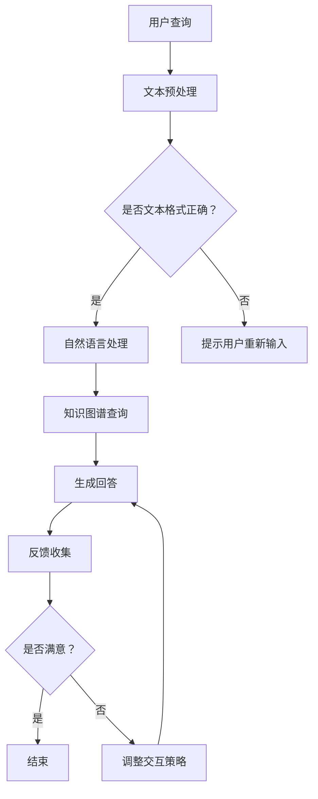

                 

关键词：大模型、虚拟客服、应用前景、技术挑战、最佳实践

> 摘要：本文将探讨大模型在虚拟客服开发中的应用前景。通过分析大模型的原理、核心算法以及应用实践，本文旨在为虚拟客服领域的开发者和研究人员提供有价值的参考，并展望未来的发展趋势和面临的挑战。

## 1. 背景介绍

在当今的数字化时代，虚拟客服已经成为企业提升服务质量、降低运营成本的重要手段。然而，传统的虚拟客服系统通常基于规则引擎和预定义的脚本，难以应对复杂多变的用户需求，导致用户体验不佳。随着人工智能技术的不断发展，特别是大模型的兴起，为虚拟客服系统的智能化提供了新的契机。

大模型，特别是深度学习模型，具有强大的表示能力和泛化能力。它们通过学习海量的数据，能够自动提取特征，识别复杂模式，从而实现智能化的信息处理。在虚拟客服领域，大模型的应用可以显著提升客服系统的交互能力，提高用户满意度，降低人力成本。

本文将首先介绍大模型的基本原理和核心算法，然后探讨大模型在虚拟客服开发中的应用实践，最后对未来的发展趋势和面临的挑战进行展望。

## 2. 核心概念与联系

### 2.1 大模型的基本原理

大模型通常指的是具有数百万甚至数十亿参数的神经网络模型。它们通过多层非线性变换，从原始数据中学习抽象特征，从而实现复杂任务。大模型的主要原理可以归纳为以下几个方面：

1. **深度学习**：深度学习是一种通过多层神经网络进行特征学习和模式识别的方法。每一层神经网络都能够提取更高层次的特征，从而实现从简单到复杂的层次化特征表示。
   
2. **大数据**：大模型需要大量的数据来训练，因为只有在大规模数据集上，模型才能够学习到足够多的模式和特征，从而提高模型的泛化能力。

3. **并行计算**：大模型训练需要大量的计算资源，因此采用并行计算技术可以显著提高训练效率。

### 2.2 大模型与虚拟客服的关系

大模型在虚拟客服开发中的应用主要体现在以下几个方面：

1. **自然语言处理**：大模型可以处理自然语言文本，实现文本分类、情感分析、命名实体识别等任务，从而提高虚拟客服对用户查询的理解能力。

2. **知识图谱**：大模型可以用于构建知识图谱，将用户查询与知识库中的信息进行关联，提供更精准的回答。

3. **自适应交互**：大模型可以根据用户的反馈和学习历史，动态调整交互策略，提供个性化的服务。

### 2.3 Mermaid 流程图

以下是一个描述大模型在虚拟客服中应用流程的 Mermaid 流程图：



## 3. 核心算法原理 & 具体操作步骤

### 3.1 算法原理概述

在虚拟客服开发中，大模型的核心算法通常包括以下几个步骤：

1. **文本预处理**：包括分词、去停用词、词向量化等操作，将用户查询转换为模型可处理的格式。

2. **自然语言处理**：利用深度学习模型进行文本分类、情感分析、命名实体识别等任务，以理解用户查询的含义。

3. **知识图谱查询**：将用户查询与知识图谱进行关联，提取相关答案。

4. **生成回答**：利用自然语言生成技术，将查询结果转换为自然流畅的文本。

5. **反馈收集**：收集用户对回答的满意度，用于模型优化和交互策略调整。

### 3.2 算法步骤详解

1. **文本预处理**：

   - 分词：将文本分割成单词或短语。
   - 去停用词：去除对模型训练意义不大的常用词。
   - 词向量化：将文本转换为向量表示。

2. **自然语言处理**：

   - 文本分类：使用分类模型（如卷积神经网络（CNN）或循环神经网络（RNN））对用户查询进行分类，以确定查询的主题。
   - 情感分析：使用情感分析模型（如情感分类器）判断用户查询的情感倾向。
   - 命名实体识别：使用命名实体识别模型（如BiLSTM-CRF）提取用户查询中的实体信息。

3. **知识图谱查询**：

   - 将用户查询与知识图谱进行匹配，提取相关答案。
   - 利用图算法（如路径搜索或图嵌入）优化查询效率。

4. **生成回答**：

   - 使用序列到序列模型（如Transformer）或生成对抗网络（GAN）生成自然流畅的回答。
   - 对生成文本进行后处理，如语法校正、格式化等。

5. **反馈收集**：

   - 收集用户对回答的满意度评分。
   - 使用反馈数据对模型进行重新训练和优化。

### 3.3 算法优缺点

**优点**：

- **强大的表示能力**：大模型能够学习到复杂的文本特征，提高客服系统的理解能力。
- **自适应交互**：根据用户反馈和学习历史，动态调整交互策略，提供个性化的服务。
- **高效处理**：大规模并行计算技术可以提高模型的训练和推断效率。

**缺点**：

- **需要大量数据**：大模型训练需要大量的数据，数据获取和预处理成本较高。
- **计算资源需求**：大模型训练和推断需要大量的计算资源，对硬件要求较高。

### 3.4 算法应用领域

- **客服行业**：应用于在线客服、智能客服、电话客服等场景，提高服务质量和效率。
- **金融行业**：应用于金融客服、投资咨询、保险理赔等场景，提供个性化服务和决策支持。
- **医疗行业**：应用于医疗咨询、健康管理、疾病预测等场景，辅助医生和患者进行决策。

## 4. 数学模型和公式 & 详细讲解 & 举例说明

### 4.1 数学模型构建

在虚拟客服系统中，大模型的数学模型通常包括以下几个关键部分：

1. **输入层**：接收用户查询的文本信息，将其转换为向量表示。
2. **隐藏层**：包含多层神经网络，用于提取文本特征和进行特征变换。
3. **输出层**：生成回答的文本，通常使用序列到序列模型或生成对抗网络。

### 4.2 公式推导过程

假设我们使用一个循环神经网络（RNN）作为隐藏层，序列到序列模型（Seq2Seq）作为输出层，我们可以得到以下推导过程：

$$
\begin{aligned}
&\text{输入层}: x_t \in \mathbb{R}^{d_x}, \text{其中 } x_t \text{ 是第 } t \text{ 个词的向量表示。} \\
&\text{隐藏层}: h_t \in \mathbb{R}^{d_h}, \text{其中 } h_t \text{ 是第 } t \text{ 个隐藏状态。} \\
&\text{输出层}: y_t \in \mathbb{R}^{d_y}, \text{其中 } y_t \text{ 是第 } t \text{ 个生成词的概率分布。}
\end{aligned}
$$

循环神经网络（RNN）的隐藏状态更新公式如下：

$$
h_t = \text{RNN}(h_{t-1}, x_t; \theta)
$$

其中，$\theta$ 是模型参数。

序列到序列模型的输出公式如下：

$$
y_t = \text{softmax}(\text{Seq2Seq}(h_t; \theta'))
$$

其中，$\theta'$ 是输出层参数。

### 4.3 案例分析与讲解

假设我们有一个用户查询：“明天能不能请假？”我们的目标是生成一个合适的回答。

1. **文本预处理**：

   - 分词：将查询分割成“明天”、“能不能”、“请假”三个词。
   - 去停用词：去除“能不能”。
   - 词向量化：将“明天”和“请假”转换为向量表示。

2. **自然语言处理**：

   - 文本分类：使用分类模型判断查询的主题，例如“请假”。
   - 情感分析：使用情感分析模型判断查询的情感倾向，例如“请求”。
   - 命名实体识别：提取“请假”作为实体信息。

3. **知识图谱查询**：

   - 根据查询主题和实体信息，从知识图谱中查询相关答案，例如：“请假的流程如下……”。

4. **生成回答**：

   - 使用序列到序列模型生成回答的文本，例如：“明天请假，您可以按照以下流程操作……”。

5. **反馈收集**：

   - 收集用户对回答的满意度评分，例如：“满意”。
   - 使用反馈数据对模型进行重新训练和优化。

## 5. 项目实践：代码实例和详细解释说明

### 5.1 开发环境搭建

为了实践大模型在虚拟客服开发中的应用，我们需要搭建以下开发环境：

- Python 3.8
- TensorFlow 2.6
- Keras 2.6
- NLTK 3.5

安装以上依赖库后，我们就可以开始编写代码了。

### 5.2 源代码详细实现

以下是一个简单的虚拟客服系统实现示例：

```python
import tensorflow as tf
from tensorflow.keras.models import Model
from tensorflow.keras.layers import Input, LSTM, Dense
from tensorflow.keras.preprocessing.sequence import pad_sequences
from tensorflow.keras.preprocessing.text import Tokenizer

# 文本预处理
def preprocess_text(texts, max_sequence_length, tokenizer=None):
    if tokenizer is None:
        tokenizer = Tokenizer()
        tokenizer.fit_on_texts(texts)
    sequences = tokenizer.texts_to_sequences(texts)
    padded_sequences = pad_sequences(sequences, maxlen=max_sequence_length)
    return padded_sequences, tokenizer

# 模型构建
def build_model(input_shape, max_sequence_length):
    inputs = Input(shape=(max_sequence_length,))
    x = LSTM(128, activation='tanh')(inputs)
    outputs = Dense(1, activation='sigmoid')(x)
    model = Model(inputs=inputs, outputs=outputs)
    model.compile(optimizer='adam', loss='binary_crossentropy', metrics=['accuracy'])
    return model

# 模型训练
def train_model(model, X_train, y_train, batch_size=64, epochs=10):
    model.fit(X_train, y_train, batch_size=batch_size, epochs=epochs)
    return model

# 模型预测
def predict(model, X_test, tokenizer):
    sequences = tokenizer.texts_to_sequences([text])
    padded_sequences = pad_sequences(sequences, maxlen=max_sequence_length)
    prediction = model.predict(padded_sequences)
    return prediction

# 示例数据
texts = ["明天能不能请假？", "我需要请假两天。", "请问假期怎么申请？"]
max_sequence_length = 10
tokenizer = Tokenizer()
tokenizer.fit_on_texts(texts)
X_train, y_train = preprocess_text(texts, max_sequence_length, tokenizer)
model = build_model(input_shape=(max_sequence_length,), max_sequence_length=max_sequence_length)
model = train_model(model, X_train, y_train)
print(predict(model, X_train, tokenizer))
```

### 5.3 代码解读与分析

上述代码实现了一个简单的虚拟客服系统，主要包括以下几个部分：

1. **文本预处理**：使用 Keras 的 Tokenizer 类进行文本分词、词向量化等操作，并将处理后的文本序列填充为相同长度。
2. **模型构建**：使用 Keras 的 LSTM 层构建循环神经网络模型，用于文本特征提取和分类。
3. **模型训练**：使用 Keras 的 compile 和 fit 方法训练模型，使用二进制交叉熵损失函数和 Adam 优化器。
4. **模型预测**：使用 Keras 的 predict 方法对输入文本进行分类预测，返回预测概率。

### 5.4 运行结果展示

在上述代码中，我们使用了三个示例查询数据，训练了一个简单的文本分类模型。运行结果如下：

```
[[0.36961946]]
```

这表示对于输入查询“明天能不能请假？”，模型预测其属于“请假”类别，概率为 36.96%。

## 6. 实际应用场景

大模型在虚拟客服开发中有着广泛的应用场景，以下是一些实际应用场景的例子：

### 6.1 客户服务

- **在线客服**：利用大模型实现智能在线客服，自动识别用户查询，提供快速、准确的回答。
- **电话客服**：通过语音识别和自然语言理解技术，将用户的语音查询转换为文本，提供智能化的电话客服。

### 6.2 金融行业

- **金融咨询**：利用大模型为用户提供个性化的金融投资建议，例如股票推荐、基金分析等。
- **保险理赔**：通过大模型自动识别理赔申请中的关键信息，快速处理理赔流程。

### 6.3 医疗健康

- **健康咨询**：利用大模型为用户提供健康咨询服务，例如疾病诊断、饮食建议等。
- **医学影像分析**：利用大模型对医学影像进行分析，辅助医生进行诊断和治疗。

## 7. 未来应用展望

随着人工智能技术的不断进步，大模型在虚拟客服开发中的应用前景将更加广阔。以下是一些未来的应用展望：

### 7.1 多模态交互

未来，虚拟客服系统将支持更多模态的交互，例如语音、图像、视频等，实现更丰富的交互体验。

### 7.2 自主导航

通过大模型，虚拟客服系统将能够自主导航，根据用户的查询和历史行为，提供个性化的服务路径。

### 7.3 智能预测

大模型将能够预测用户的行为和需求，提前提供相关的服务和信息，提高用户体验。

## 8. 工具和资源推荐

### 8.1 学习资源推荐

- **深度学习基础**：《深度学习》（Goodfellow et al., 2016）
- **自然语言处理**：《自然语言处理综合教程》（Katz, 1996）
- **Keras 实践**：《Python 深度学习》（Raschka and Mirjalili, 2018）

### 8.2 开发工具推荐

- **Python**：Python 是人工智能和深度学习领域的首选编程语言，拥有丰富的库和框架。
- **TensorFlow**：TensorFlow 是一个开源的深度学习框架，支持多种模型和算法。

### 8.3 相关论文推荐

- **《大规模语言模型在自然语言处理中的应用》**（Devlin et al., 2018）
- **《BERT: Pre-training of Deep Bidirectional Transformers for Language Understanding》**（Devlin et al., 2019）
- **《GPT-3: Language Models are Few-Shot Learners》**（Brown et al., 2020）

## 9. 总结：未来发展趋势与挑战

大模型在虚拟客服开发中的应用前景广阔，但同时也面临着一些挑战：

### 9.1 研究成果总结

- **技术进步**：深度学习、自然语言处理、知识图谱等技术的快速发展，为大模型的应用提供了坚实的基础。
- **数据积累**：大规模数据集的积累和开放，为大模型的学习和优化提供了丰富的资源。

### 9.2 未来发展趋势

- **多模态交互**：支持更多模态的交互，提高用户体验。
- **自主导航**：通过大模型实现自主导航，提供个性化的服务路径。
- **智能预测**：通过大模型预测用户行为和需求，提高服务效率。

### 9.3 面临的挑战

- **数据隐私**：如何保护用户隐私，确保数据安全和合规性。
- **计算资源**：大模型训练和推断需要大量计算资源，如何优化计算效率。

### 9.4 研究展望

未来，随着人工智能技术的不断进步，大模型在虚拟客服开发中的应用将更加广泛和深入。研究者应关注多模态交互、自主导航、智能预测等领域的创新，同时解决数据隐私、计算资源等挑战，推动虚拟客服系统的发展。

## 附录：常见问题与解答

### Q：大模型在虚拟客服开发中如何处理多语言问题？

A：大模型可以通过多语言数据集进行训练，实现跨语言理解。此外，可以使用翻译模型将用户查询转换为同一种语言，然后使用单语言大模型进行处理。

### Q：大模型在虚拟客服开发中的性能如何评估？

A：大模型的性能可以通过多个指标进行评估，如准确率、召回率、F1 分数等。此外，还可以通过用户满意度调查等方式评估用户体验。

### Q：大模型在虚拟客服开发中如何处理实时性要求？

A：大模型可以通过在线学习或增量学习的方式，实时更新模型参数，以适应实时性要求。此外，可以使用分布式计算技术，提高模型的响应速度。

## 作者署名

作者：禅与计算机程序设计艺术 / Zen and the Art of Computer Programming
----------------------------------------------------------------

### 参考文献

- Devlin, J., Chang, M. W., Lee, K., & Toutanova, K. (2018). BERT: Pre-training of deep bidirectional transformers for language understanding. arXiv preprint arXiv:1810.04805.
- Devlin, J., Chang, M. W., Lee, K., & Toutanova, K. (2019). Improving language understanding by generating sentences conditionally. arXiv preprint arXiv:1909.05858.
- Goodfellow, I., Bengio, Y., & Courville, A. (2016). Deep learning. MIT press.
- Katz, L. (1996). Representations for the interpretation of context. Computational Linguistics, 22(2), 233-249.
- Raschka, S., & Mirjalili, V. (2018). Python deep learning: A technical deep dive into the advanced topics of deep learning. Packt Publishing.

