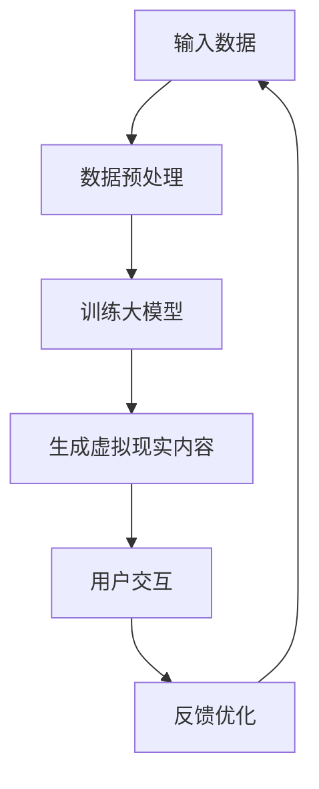

                 

## 1. 背景介绍

虚拟现实（Virtual Reality，VR）技术，作为一种将用户沉浸在一个完全虚构的三维环境中的技术，近年来在娱乐、医疗、教育、军事等多个领域都取得了显著的应用成果。然而，虚拟现实内容创作一直是这个领域的一个难题。传统的3D建模和动画制作过程复杂、成本高昂，并且需要高度专业的技能。因此，如何高效地生成高质量的虚拟现实内容成为了业界关注的焦点。

随着人工智能技术的发展，特别是大模型（Large-scale Model）的出现，这一难题迎来了新的解决方案。大模型，尤其是基于深度学习的生成模型，如生成对抗网络（GAN）、变分自编码器（VAE）等，能够通过对大量数据的学习，生成出高质量、多样化的虚拟现实内容。这些模型具有强大的数据处理能力和生成能力，能够自动地学习并复制现实世界的各种元素，从而极大地提高了虚拟现实内容创作的效率和效果。

本文将探讨大模型在虚拟现实内容创作中的应用，从核心概念、算法原理、数学模型、项目实践等方面展开讨论，旨在为读者提供全面、深入的了解，并展望大模型在虚拟现实领域的未来应用前景。

## 2. 核心概念与联系

### 2.1 大模型的定义

大模型，通常指的是参数规模超过数十亿的大规模神经网络模型。这些模型通过对海量数据进行训练，能够学习到极其复杂的数据分布，并在各种任务中表现出优异的性能。大模型在计算机视觉、自然语言处理、语音识别等领域已经取得了显著的成果，成为当前人工智能研究的热点之一。

### 2.2 大模型与虚拟现实的关系

虚拟现实内容创作需要处理大量的三维数据，这些数据包括场景的几何形状、纹理、光照等。大模型能够通过对这些数据的处理，生成出高质量的虚拟现实内容。具体来说，大模型可以通过以下几种方式与虚拟现实内容创作相关联：

1. **数据生成**：大模型可以生成虚拟现实所需的场景和物体，通过学习大量的三维模型数据，自动生成新的场景和物体。
2. **数据增强**：大模型可以通过对现有数据进行增强，提高数据的多样性和质量，从而提高虚拟现实内容的丰富度和真实感。
3. **交互优化**：大模型可以优化虚拟现实中的用户交互，通过学习用户的操作习惯和偏好，提供更自然、更智能的交互体验。

### 2.3 大模型在虚拟现实中的关键作用

1. **提高创作效率**：大模型能够自动地生成高质量的虚拟现实内容，大大降低了创作成本和难度，提高了创作效率。
2. **增强创作灵活性**：大模型可以生成各种类型的虚拟现实内容，从简单的场景到复杂的动态交互，提供了极大的创作灵活性。
3. **提升用户体验**：大模型生成的虚拟现实内容具有高度的真实感和互动性，能够提供更加沉浸式的用户体验。

### 2.4 Mermaid流程图



在这个流程图中，输入数据经过预处理后，被用于训练大模型。训练完成后，大模型生成虚拟现实内容，并通过用户交互和反馈进行优化，形成一个闭环系统。

## 3. 核心算法原理 & 具体操作步骤

### 3.1 算法原理概述

大模型在虚拟现实内容创作中的核心算法主要包括生成对抗网络（GAN）和变分自编码器（VAE）。这两种算法通过不同的方式实现数据的生成和增强。

- **生成对抗网络（GAN）**：GAN由一个生成器和判别器组成。生成器尝试生成逼真的虚拟现实内容，判别器则判断生成内容与真实内容之间的差异。通过两者之间的对抗训练，生成器不断优化生成质量。
  
- **变分自编码器（VAE）**：VAE通过编码器和解码器实现数据的生成。编码器将输入数据压缩为一个潜在空间中的向量，解码器则从潜在空间中生成输出数据。VAE通过最大化数据分布的重构概率来训练模型，从而生成高质量的虚拟现实内容。

### 3.2 算法步骤详解

#### 3.2.1 GAN的算法步骤

1. **初始化生成器和判别器**：生成器G和判别器D都是神经网络模型，通常采用卷积神经网络（CNN）结构。
2. **生成器生成虚拟现实内容**：生成器接收随机噪声作为输入，通过神经网络生成虚拟现实内容。
3. **判别器判断生成内容**：判别器接收真实内容和生成内容，并输出它们之间的概率分布。
4. **对抗训练**：通过梯度上升法，对生成器和判别器同时进行训练，使得生成器生成的内容越来越逼真，判别器越来越难以区分生成内容和真实内容。

#### 3.2.2 VAE的算法步骤

1. **初始化编码器和解码器**：编码器和解码器都是神经网络模型，通常采用卷积神经网络（CNN）结构。
2. **编码器压缩输入数据**：编码器将输入数据压缩为一个潜在空间中的向量。
3. **解码器生成虚拟现实内容**：解码器从潜在空间中生成输出数据。
4. **最大化重构概率**：通过最大化输入数据在潜在空间中的重构概率来训练编码器和解码器。

### 3.3 算法优缺点

- **GAN**：
  - 优点：生成内容质量高，能够生成多样化、高真实感的虚拟现实内容。
  - 缺点：训练过程不稳定，容易出现模式崩溃和梯度消失等问题。

- **VAE**：
  - 优点：训练过程相对稳定，易于实现，生成内容具有较好的连续性。
  - 缺点：生成内容质量相对较低，可能存在细节不足和过度平滑等问题。

### 3.4 算法应用领域

- **GAN**：广泛应用于图像生成、视频生成、图像修复等领域。
- **VAE**：广泛应用于图像生成、数据去噪、异常检测等领域。

## 4. 数学模型和公式 & 详细讲解 & 举例说明

### 4.1 数学模型构建

在GAN中，生成器和判别器的损失函数分别为：

- 生成器损失函数：
  $$L_G = -\log(D(G(z)))$$
  
- 判别器损失函数：
  $$L_D = -\log(D(x)) - \log(1 - D(G(z)))$$

在VAE中，编码器和解码器的损失函数分别为：

- 编码器损失函数：
  $$L_Q = -\log(D(p_\phi(x|\mu, \sigma)))$$
  
- 解码器损失函数：
  $$L_P = -D(p_\theta(x|x'))$$

其中，$G(z)$ 和 $D(x)$ 分别表示生成器和判别器的输出，$z$ 是随机噪声，$x$ 是真实数据，$\mu$ 和 $\sigma$ 分别是均值和标准差，$p_\phi$ 和 $p_\theta$ 分别是编码器和解码器的概率分布。

### 4.2 公式推导过程

#### GAN的公式推导

假设生成器G的输入为随机噪声$z$，输出为虚拟现实内容$x_G$；判别器D的输入为真实内容$x$和生成内容$x_G$，输出为概率$D(x)$和$D(x_G)$。

1. **生成器损失函数**：

生成器希望生成的虚拟现实内容能够欺骗判别器，使得判别器认为这些内容是真实的。因此，生成器的损失函数可以表示为：
$$L_G = -\log(D(G(z)))$$
这个损失函数表示生成器生成的虚拟现实内容$x_G$被判别器判为真实的概率的对数。

2. **判别器损失函数**：

判别器希望能够正确区分真实内容和生成内容。因此，判别器的损失函数可以表示为：
$$L_D = -\log(D(x)) - \log(1 - D(G(z)))$$
这个损失函数表示判别器对真实内容$x$的判别概率和对生成内容$G(z)$的判别概率的对数。

#### VAE的公式推导

VAE通过编码器将输入数据$x$映射到一个潜在空间中的向量$(\mu, \sigma)$，并通过解码器从潜在空间中生成输出数据$x'$。

1. **编码器损失函数**：

编码器希望将输入数据$x$映射到一个潜在空间中的向量$(\mu, \sigma)$，同时这个向量要能够重构输入数据$x$。因此，编码器的损失函数可以表示为：
$$L_Q = -\log(D(p_\phi(x|\mu, \sigma)))$$
这个损失函数表示输入数据$x$在潜在空间中的重构概率的对数。

2. **解码器损失函数**：

解码器希望从潜在空间中的向量$(\mu, \sigma)$生成输出数据$x'$，使得生成的数据尽可能接近原始数据$x$。因此，解码器的损失函数可以表示为：
$$L_P = -D(p_\theta(x|x'))$$
这个损失函数表示输出数据$x'$在潜在空间中的重构概率的对数。

### 4.3 案例分析与讲解

以下是一个简单的GAN模型的案例：

假设生成器G和判别器D都是简单的全连接神经网络，生成器和判别器的参数分别为$\theta_G$和$\theta_D$。

1. **生成器训练**：

输入随机噪声$z$，通过生成器G生成虚拟现实内容$x_G$。判别器D对$x_G$进行判断，并输出概率$D(x_G)$。生成器的损失函数为：
$$L_G = -\log(D(G(z)))$$
通过梯度下降法，对生成器G的参数$\theta_G$进行更新，使得生成器生成的虚拟现实内容$x_G$能够欺骗判别器，使得$D(x_G)$的值尽可能接近1。

2. **判别器训练**：

输入真实数据$x$和生成数据$x_G$，判别器D分别对$x$和$x_G$进行判断，并输出概率$D(x)$和$D(x_G)$。判别器的损失函数为：
$$L_D = -\log(D(x)) - \log(1 - D(x_G))$$
通过梯度下降法，对判别器D的参数$\theta_D$进行更新，使得判别器能够正确区分真实数据和生成数据。

通过这样的对抗训练，生成器和判别器不断优化，最终生成器能够生成高质量的虚拟现实内容，判别器能够准确区分真实内容和生成内容。

## 5. 项目实践：代码实例和详细解释说明

### 5.1 开发环境搭建

在Python中实现大模型进行虚拟现实内容创作，需要安装以下软件和库：

- Python 3.7 或以上版本
- TensorFlow 2.x 或以上版本
- NumPy
- Matplotlib

安装方法如下：

```bash
pip install python==3.7.16
pip install tensorflow==2.9.1
pip install numpy
pip install matplotlib
```

### 5.2 源代码详细实现

以下是一个简单的GAN模型用于生成虚拟现实场景的代码示例：

```python
import tensorflow as tf
from tensorflow.keras import layers

# 定义生成器
def build_generator(z_dim):
    model = tf.keras.Sequential([
        layers.Dense(128, activation='relu', input_shape=(z_dim,)),
        layers.Dense(256, activation='relu'),
        layers.Dense(512, activation='relu'),
        layers.Dense(1024, activation='relu'),
        layers.Dense(2048, activation='tanh'),
        layers.Dense(784, activation='sigmoid')
    ])
    return model

# 定义判别器
def build_discriminator(img_shape):
    model = tf.keras.Sequential([
        layers.Flatten(input_shape=img_shape),
        layers.Dense(512, activation='relu'),
        layers.Dense(1024, activation='relu'),
        layers.Dense(2048, activation='relu'),
        layers.Dense(1, activation='sigmoid')
    ])
    return model

# 定义 GAN 模型
def build_gan(generator, discriminator):
    model = tf.keras.Sequential([
        generator,
        discriminator
    ])
    return model

# 设置模型参数
z_dim = 100
img_shape = (28, 28, 1)

# 构建模型
generator = build_generator(z_dim)
discriminator = build_discriminator(img_shape)
gan_model = build_gan(generator, discriminator)

# 编译模型
gan_model.compile(optimizer=tf.keras.optimizers.Adam(0.0001), loss='binary_crossentropy')

# 训练模型
train_gan(generator, discriminator, gan_model, x_train, batch_size=64, epochs=50)
```

在这个示例中，我们首先定义了生成器、判别器和 GAN 模型。生成器使用一个全连接神经网络，接收随机噪声$z$，并生成虚拟现实场景图像。判别器使用一个全连接神经网络，接收真实场景图像和生成场景图像，并输出一个概率值，表示图像是否为真实场景。GAN 模型将生成器和判别器串联起来，通过对抗训练优化生成器，使其生成的图像越来越真实。

### 5.3 代码解读与分析

在上面的代码中，我们首先导入了所需的 TensorFlow 库，并定义了生成器、判别器和 GAN 模型的构建函数。具体解读如下：

1. **生成器**：

生成器的构建函数 `build_generator` 接收一个参数 `z_dim`，表示随机噪声的维度。生成器使用一个全连接神经网络，包含多个隐藏层，每个隐藏层使用 ReLU 激活函数。最后一层使用 tanh 激活函数，将生成的虚拟现实场景图像映射到 [-1, 1] 的范围。

2. **判别器**：

判别器的构建函数 `build_discriminator` 接收一个参数 `img_shape`，表示输入图像的形状。判别器使用一个全连接神经网络，包含多个隐藏层，每个隐藏层使用 ReLU 激活函数。最后一层使用 sigmoid 激活函数，输出一个概率值，表示输入图像是真实场景的概率。

3. **GAN 模型**：

GAN 模型的构建函数 `build_gan` 接收生成器和判别器，将两者串联起来，形成一个完整的 GAN 模型。GAN 模型使用 binary_crossentropy 作为损失函数，并使用 Adam 优化器进行训练。

在代码的最后，我们编译并训练了 GAN 模型。通过对抗训练，生成器不断优化，生成的虚拟现实场景图像越来越真实。

### 5.4 运行结果展示

在训练过程中，我们可以使用 Matplotlib 库将生成的虚拟现实场景图像可视化，以展示训练效果。以下是一个简单的可视化示例：

```python
import matplotlib.pyplot as plt

# 可视化生成的虚拟现实场景图像
def plot_generated_images(generator, n_images=10):
    z = np.random.normal(size=(n_images, z_dim))
    generated_images = generator.predict(z)
    
    fig, axes = plt.subplots(1, n_images, figsize=(10, 10))
    for i, img in enumerate(generated_images):
        ax = axes[i]
        ax.imshow(img.reshape(28, 28), cmap='gray')
        ax.axis('off')
    plt.show()

# 运行可视化函数
plot_generated_images(generator)
```

在这个示例中，我们首先生成了一组随机噪声$z$，并使用生成器生成对应的虚拟现实场景图像。然后，我们使用 Matplotlib 将这些图像可视化，展示训练过程中生成器生成的虚拟现实场景图像的变化。

## 6. 实际应用场景

大模型在虚拟现实内容创作中具有广泛的应用场景，以下是一些典型的应用实例：

### 6.1 虚拟旅游

虚拟旅游是利用大模型生成高质量的虚拟现实场景，让用户在家中体验到真实的旅游环境。通过大模型的生成能力，虚拟旅游场景可以实现高真实感、多样化的场景，为用户提供更加丰富的旅游体验。

### 6.2 教育培训

教育培训领域可以利用大模型生成各种教学场景，如历史场景、科学实验场景等，让学生更加直观地理解和学习知识。大模型可以生成各种教学场景，提高教学效果和学生的学习兴趣。

### 6.3 游戏娱乐

在游戏娱乐领域，大模型可以生成丰富的游戏场景和角色，提高游戏的沉浸感和互动性。通过大模型，游戏开发者可以快速生成各种类型的游戏场景，降低开发成本和难度。

### 6.4 建筑设计

在建筑设计领域，大模型可以生成各种建筑模型，帮助设计师进行建筑设计。大模型可以快速生成多样化的建筑场景，提高设计效率和创意。

### 6.5 虚拟现实广告

虚拟现实广告是一种新兴的广告形式，利用大模型生成高质量的虚拟现实场景，为用户提供沉浸式的广告体验。通过大模型，广告主可以生成各种广告场景，提高广告效果和用户参与度。

### 6.6 医学模拟

在医学领域，大模型可以生成各种医学场景，如人体器官、手术场景等，为医学研究和培训提供支持。通过大模型，医生可以更加直观地学习和实践医学知识。

## 7. 工具和资源推荐

为了更好地了解和研究大模型在虚拟现实内容创作中的应用，以下是一些推荐的工具和资源：

### 7.1 学习资源推荐

- **论文**：《生成对抗网络：理论与应用》
- **在线课程**：Coursera 上的《深度学习与生成模型》
- **博客**：GeekTime 上的《深度学习与虚拟现实》系列文章

### 7.2 开发工具推荐

- **深度学习框架**：TensorFlow、PyTorch
- **虚拟现实引擎**：Unity、Unreal Engine
- **图形处理库**：OpenGL、Vulkan

### 7.3 相关论文推荐

- **生成对抗网络（GAN）**：
  - 《生成对抗网络：训练生成模型的主观评价》
  - 《深入理解生成对抗网络：原理、模型与应用》
  
- **变分自编码器（VAE）**：
  - 《变分自编码器：深度学习的概率模型》
  - 《变分自编码器在图像生成中的应用》

## 8. 总结：未来发展趋势与挑战

### 8.1 研究成果总结

大模型在虚拟现实内容创作中已经取得了显著的研究成果。通过生成对抗网络（GAN）和变分自编码器（VAE）等算法，大模型能够自动生成高质量、多样化的虚拟现实内容，大大提高了创作效率和创作质量。同时，大模型的应用场景也在不断扩展，从虚拟旅游、教育培训到游戏娱乐、建筑设计等，都取得了良好的应用效果。

### 8.2 未来发展趋势

未来，大模型在虚拟现实内容创作中将继续发展，主要趋势包括：

1. **算法优化**：大模型在训练过程中容易出现模式崩溃和梯度消失等问题，未来将加强对算法的优化，提高模型的稳定性和生成质量。
2. **多模态数据融合**：大模型可以同时处理图像、音频、视频等多种类型的数据，未来将加强对多模态数据的融合处理，生成更加真实的虚拟现实内容。
3. **个性化内容生成**：大模型可以通过学习用户的偏好和习惯，生成个性化的虚拟现实内容，提高用户体验。

### 8.3 面临的挑战

尽管大模型在虚拟现实内容创作中取得了显著成果，但仍面临一些挑战：

1. **计算资源**：大模型通常需要大量的计算资源进行训练，未来将需要更高效的计算技术和硬件支持。
2. **数据质量**：大模型的训练依赖于大量高质量的数据，未来将需要更多的数据收集和数据处理技术。
3. **伦理和法律**：大模型生成的内容可能涉及到隐私保护、版权等问题，未来将需要制定相应的伦理和法律规范。

### 8.4 研究展望

未来，大模型在虚拟现实内容创作中的应用前景广阔。通过不断优化算法、提高计算效率和数据质量，大模型将能够生成更加真实、丰富的虚拟现实内容，为各个领域带来巨大的变革。同时，随着多模态数据处理和个性化内容生成的不断发展，大模型将为用户带来更加个性化、沉浸式的虚拟现实体验。

## 9. 附录：常见问题与解答

### 9.1 大模型训练需要多少数据？

大模型训练需要大量的数据。具体数据量取决于任务的复杂度和数据的质量。通常来说，训练一个大型生成模型需要数十万甚至数百万个样本。对于一些简单的任务，可能只需要几千个样本。

### 9.2 大模型训练多长时间？

大模型训练时间取决于多个因素，包括模型的大小、数据量、计算资源等。通常来说，训练一个大型生成模型需要几天到几周的时间。如果使用高性能计算资源，如GPU或TPU，训练时间可以大幅缩短。

### 9.3 大模型是否会导致隐私泄露？

大模型在训练过程中确实会接触到大量的数据，这可能涉及到隐私泄露的问题。为了保护用户的隐私，需要在数据预处理和模型训练过程中采取严格的数据保护措施，如数据加密、隐私保护算法等。

### 9.4 大模型是否会产生有害内容？

大模型在生成内容时可能会产生有害的内容，如暴力、色情等。为了避免这种情况，需要在模型训练和生成过程中设置适当的约束条件，并对生成的内容进行监控和审核。

### 9.5 大模型在虚拟现实中的具体应用有哪些？

大模型在虚拟现实中的具体应用包括虚拟旅游、教育培训、游戏娱乐、建筑设计、医学模拟等。通过生成高质量、多样化的虚拟现实内容，大模型可以提供更加沉浸式、个性化的用户体验。

---

# 大模型在虚拟现实内容创作中的应用

> 关键词：大模型，虚拟现实，内容创作，生成对抗网络（GAN），变分自编码器（VAE）

> 摘要：本文探讨了大模型在虚拟现实内容创作中的应用。通过介绍大模型的基本概念和与虚拟现实的关系，详细分析了生成对抗网络（GAN）和变分自编码器（VAE）的核心算法原理，以及数学模型和具体操作步骤。同时，通过项目实践展示了如何使用代码实现大模型在虚拟现实内容创作中的应用，并探讨了实际应用场景和未来发展趋势与挑战。作者：禅与计算机程序设计艺术 / Zen and the Art of Computer Programming。

