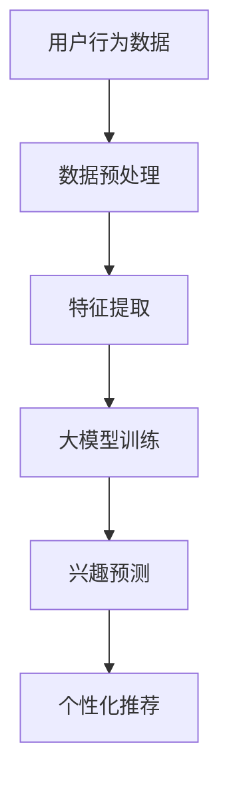

                 

关键词：大模型、长期用户兴趣、建模、算法原理、数学模型、应用领域、代码实例、实际应用场景、未来展望

> 摘要：本文深入探讨了大规模模型在长期用户兴趣建模中的应用。通过分析大模型的原理和特点，结合数学模型和具体算法，详细阐述了大模型如何实现长期用户兴趣的准确捕捉和分析。此外，文章还通过项目实践，展示了大模型在实际应用中的实现和效果，并提出了未来发展的趋势和挑战。

## 1. 背景介绍

在互联网时代，用户生成的内容和数据量呈爆炸式增长。对于企业来说，如何理解和满足用户的需求，成为了一项重要的课题。长期用户兴趣建模旨在通过对用户历史行为数据的分析，预测用户的长期兴趣和偏好，从而为个性化推荐、精准营销等提供支持。然而，传统的兴趣建模方法往往存在数据量不足、特征表达能力有限等问题，难以应对复杂多变的市场环境。

近年来，随着人工智能技术的快速发展，尤其是深度学习、生成模型等大模型的兴起，为长期用户兴趣建模提供了新的可能性。大模型具有强大的特征提取和表示能力，能够从大规模用户行为数据中挖掘出潜在的兴趣模式。本文将围绕大模型在长期用户兴趣建模中的应用，探讨其原理、算法、实现和未来发展方向。

## 2. 核心概念与联系

### 2.1 大模型的定义与特点

大模型是指具有海量参数和强大计算能力的深度学习模型，如大型神经网络、生成对抗网络（GAN）、变分自编码器（VAE）等。这些模型能够通过学习大量数据，提取出复杂的高层次特征，从而在图像识别、自然语言处理、语音识别等任务中表现出色。

大模型的特点主要包括：

1. **参数规模大**：大模型通常拥有数十亿甚至千亿级别的参数。
2. **计算能力强**：大模型需要强大的计算资源和高效的算法优化。
3. **特征表达能力**：大模型能够自动学习数据中的复杂模式和特征。
4. **数据依赖性强**：大模型的效果很大程度上依赖于数据质量和数据量。

### 2.2 长期用户兴趣建模的定义

长期用户兴趣建模是指通过对用户历史行为数据的分析，构建模型来预测用户的长期兴趣和偏好。这种建模方法旨在捕捉用户的潜在兴趣，为个性化推荐、精准营销等提供支持。

长期用户兴趣建模的关键挑战包括：

1. **数据多样性**：用户行为数据来源广泛，包括浏览历史、购买记录、社交媒体活动等。
2. **数据动态性**：用户兴趣可能随时间而变化，需要模型能够适应这种变化。
3. **数据噪声**：用户行为数据中存在大量的噪声和异常值，需要有效的预处理和特征提取方法。

### 2.3 大模型与长期用户兴趣建模的联系

大模型在长期用户兴趣建模中的应用主要体现在以下几个方面：

1. **特征提取与表示**：大模型能够自动学习用户行为数据中的高维特征，并将其表示为低维的向量表示，有助于捕捉用户的潜在兴趣。
2. **模式识别**：大模型能够从大规模的用户行为数据中识别出潜在的规律和模式，从而预测用户的长期兴趣。
3. **动态适应**：大模型具有强大的学习能力，能够适应用户兴趣的变化，为实时推荐和个性化服务提供支持。
4. **噪声处理**：大模型能够通过数据预处理和特征提取方法，有效地降低数据噪声对模型性能的影响。

### 2.4 Mermaid 流程图



## 3. 核心算法原理 & 具体操作步骤

### 3.1 算法原理概述

大模型在长期用户兴趣建模中的核心算法主要包括以下几个步骤：

1. **数据预处理**：对用户行为数据进行清洗、去噪、归一化等操作，为后续的特征提取和模型训练做准备。
2. **特征提取**：使用大模型（如神经网络）提取用户行为数据中的高维特征，并将其表示为低维的向量表示。
3. **模型训练**：利用提取的特征数据训练大模型，使其能够根据用户历史行为数据预测用户的长期兴趣。
4. **兴趣预测**：使用训练好的大模型对用户的新行为数据进行兴趣预测，为个性化推荐和精准营销提供支持。

### 3.2 算法步骤详解

#### 3.2.1 数据预处理

数据预处理是长期用户兴趣建模的基础。具体步骤包括：

1. **数据清洗**：去除数据中的异常值、重复值和缺失值。
2. **去噪**：使用滤波、平滑等方法降低数据噪声。
3. **归一化**：将不同尺度的数据归一化到同一范围内，以便后续的特征提取和模型训练。

#### 3.2.2 特征提取

特征提取是使用大模型提取用户行为数据中的高维特征。具体步骤包括：

1. **数据输入**：将预处理后的用户行为数据输入到神经网络中。
2. **特征提取**：神经网络通过多层感知器（MLP）等结构，自动学习数据中的高维特征。
3. **特征表示**：将提取的高维特征表示为低维的向量表示，以便后续的模型训练。

#### 3.2.3 模型训练

模型训练是使用提取的特征数据训练大模型，使其能够根据用户历史行为数据预测用户的长期兴趣。具体步骤包括：

1. **定义损失函数**：选择适当的损失函数，如均方误差（MSE）、交叉熵等。
2. **优化算法**：使用梯度下降、随机梯度下降（SGD）等优化算法，更新模型参数。
3. **迭代训练**：通过多次迭代训练，逐步优化模型参数，提高预测准确性。

#### 3.2.4 兴趣预测

使用训练好的大模型对用户的新行为数据进行兴趣预测，为个性化推荐和精准营销提供支持。具体步骤包括：

1. **特征提取**：将新用户行为数据输入到大模型中，提取特征向量。
2. **兴趣预测**：使用训练好的大模型，对新提取的特征向量进行兴趣预测。
3. **推荐生成**：根据兴趣预测结果，生成个性化推荐和精准营销策略。

### 3.3 算法优缺点

#### 优点

1. **强大的特征提取能力**：大模型能够自动学习用户行为数据中的复杂特征，提高兴趣预测的准确性。
2. **动态适应能力**：大模型能够适应用户兴趣的变化，为实时推荐和个性化服务提供支持。
3. **适用于大规模数据**：大模型能够处理大规模的用户行为数据，适应数据量增长的需求。

#### 缺点

1. **计算资源需求大**：大模型需要大量的计算资源和存储空间，对硬件设备要求较高。
2. **数据预处理复杂**：大模型对数据预处理的要求较高，需要解决数据噪声、缺失值等问题。
3. **过拟合风险**：大模型容易出现过拟合现象，需要合理设置模型参数和正则化方法。

### 3.4 算法应用领域

大模型在长期用户兴趣建模中的应用领域广泛，包括：

1. **个性化推荐**：通过预测用户的长期兴趣，为用户提供个性化的商品、内容推荐。
2. **精准营销**：根据用户的兴趣和偏好，制定精准的营销策略，提高转化率。
3. **用户画像**：构建用户的兴趣画像，为企业和产品提供决策支持。
4. **广告投放**：根据用户的兴趣和偏好，优化广告投放策略，提高广告效果。

## 4. 数学模型和公式 & 详细讲解 & 举例说明

### 4.1 数学模型构建

在长期用户兴趣建模中，常见的数学模型包括神经网络、生成对抗网络（GAN）、变分自编码器（VAE）等。以下以神经网络为例，介绍数学模型的构建过程。

#### 4.1.1 神经网络模型

神经网络模型由输入层、隐藏层和输出层组成。每个层由多个神经元（节点）组成，神经元之间通过权重连接。神经元的输出通过激活函数进行非线性变换。

神经网络的数学模型可以表示为：

$$
Y = \sigma(W_3 \cdot \sigma(W_2 \cdot \sigma(W_1 \cdot X + b_1) + b_2) + b_3)
$$

其中，$X$为输入向量，$Y$为输出向量，$W_1, W_2, W_3$为权重矩阵，$b_1, b_2, b_3$为偏置项，$\sigma$为激活函数，常用的激活函数有Sigmoid、ReLU等。

#### 4.1.2 损失函数

损失函数用于衡量模型预测值与实际值之间的差异。在长期用户兴趣建模中，常用的损失函数有均方误差（MSE）、交叉熵（Cross-Entropy）等。

1. **均方误差（MSE）**

$$
MSE = \frac{1}{n} \sum_{i=1}^{n} (y_i - \hat{y}_i)^2
$$

其中，$y_i$为实际值，$\hat{y}_i$为预测值，$n$为样本数量。

2. **交叉熵（Cross-Entropy）**

$$
CE = -\frac{1}{n} \sum_{i=1}^{n} y_i \cdot \log(\hat{y}_i)
$$

其中，$y_i$为实际值，$\hat{y}_i$为预测值，$\log$为对数函数。

#### 4.1.3 优化算法

优化算法用于更新模型参数，以最小化损失函数。常用的优化算法有梯度下降（Gradient Descent）、随机梯度下降（SGD）、Adam等。

1. **梯度下降（Gradient Descent）**

$$
\theta_{t+1} = \theta_t - \alpha \cdot \nabla_\theta J(\theta)
$$

其中，$\theta_t$为当前模型参数，$\alpha$为学习率，$\nabla_\theta J(\theta)$为损失函数关于模型参数的梯度。

2. **随机梯度下降（SGD）**

$$
\theta_{t+1} = \theta_t - \alpha \cdot \nabla_\theta J(\theta; X^{(i)})
$$

其中，$X^{(i)}$为第$i$个样本。

3. **Adam优化器**

$$
m_t = \beta_1 m_{t-1} + (1 - \beta_1) \nabla_\theta J(\theta; X^{(i)}), \\
v_t = \beta_2 v_{t-1} + (1 - \beta_2) (\nabla_\theta J(\theta; X^{(i)}))^2, \\
\theta_{t+1} = \theta_t - \alpha \cdot \frac{m_t}{\sqrt{v_t} + \epsilon}
$$

其中，$m_t$和$v_t$分别为一阶和二阶矩估计，$\beta_1$和$\beta_2$为衰减率，$\epsilon$为一个小常数。

### 4.2 公式推导过程

以下以交叉熵损失函数为例，介绍其推导过程。

假设有两个随机变量$X$和$Y$，分别表示模型预测值和实际值。$X$和$Y$的分布满足概率分布函数$f_X(x)$和$f_Y(y)$。

交叉熵损失函数的定义为：

$$
L = -\frac{1}{n} \sum_{i=1}^{n} y_i \cdot \log(\hat{y}_i)
$$

其中，$y_i$为实际值，$\hat{y}_i$为预测值。

推导过程如下：

$$
\begin{aligned}
L &= -\frac{1}{n} \sum_{i=1}^{n} y_i \cdot \log(\hat{y}_i) \\
&= -\frac{1}{n} \sum_{i=1}^{n} y_i \cdot \log(f_Y(y_i)) + \frac{1}{n} \sum_{i=1}^{n} y_i \cdot \log(f_X(\hat{y}_i)) \\
&= H(Y) - H(Y|X)
\end{aligned}
$$

其中，$H(Y)$为$Y$的熵，$H(Y|X)$为$Y$在给定$X$条件下的条件熵。

根据信息论的基本定理，熵的期望等于信息量，即：

$$
H(Y) = E[Y]
$$

因此，交叉熵损失函数可以理解为实际值和预测值之间的信息量差异，差异越大，损失越大。

### 4.3 案例分析与讲解

以下以一个简单的用户兴趣预测案例，介绍大模型在长期用户兴趣建模中的应用。

#### 案例背景

某电商平台希望通过长期用户兴趣建模，为用户推荐感兴趣的商品。用户行为数据包括浏览历史、购买记录、搜索历史等。

#### 数据预处理

1. **数据清洗**：去除异常值、重复值和缺失值。
2. **去噪**：使用滤波、平滑等方法降低噪声。
3. **归一化**：将不同尺度的数据归一化到[0,1]范围内。

#### 特征提取

1. **用户行为特征**：将用户浏览历史、购买记录、搜索历史等数据进行编码，提取高维特征。
2. **时间特征**：将用户行为的时间信息进行编码，提取时间序列特征。

#### 模型训练

1. **数据输入**：将预处理后的用户行为数据和标签（感兴趣商品ID）输入到神经网络模型中。
2. **模型训练**：使用交叉熵损失函数和Adam优化器训练神经网络模型，优化模型参数。

#### 兴趣预测

1. **特征提取**：将新用户行为数据输入到训练好的神经网络模型中，提取特征向量。
2. **兴趣预测**：使用训练好的神经网络模型，对新提取的特征向量进行兴趣预测，生成个性化推荐列表。

#### 模型评估

1. **准确率**：计算预测标签和实际标签的匹配度，评估模型的准确性。
2. **召回率**：计算预测标签中包含实际标签的比例，评估模型的召回率。
3. **F1值**：综合考虑准确率和召回率，计算F1值。

## 5. 项目实践：代码实例和详细解释说明

### 5.1 开发环境搭建

为了进行大模型在长期用户兴趣建模的项目实践，我们需要搭建一个合适的环境。以下是一个典型的开发环境搭建过程：

1. **硬件环境**：准备一台具有高性能CPU和GPU的服务器，以支持大模型训练和推理。
2. **软件环境**：安装Python、CUDA、cuDNN等软件，以支持深度学习框架（如TensorFlow、PyTorch）的运行。
3. **深度学习框架**：选择一个流行的深度学习框架（如TensorFlow 2.x或PyTorch），用于构建和训练大模型。

### 5.2 源代码详细实现

以下是一个基于TensorFlow 2.x的长期用户兴趣建模项目的源代码示例。

```python
import tensorflow as tf
from tensorflow.keras.models import Sequential
from tensorflow.keras.layers import Dense, Activation, LSTM
from tensorflow.keras.optimizers import Adam

# 数据预处理
def preprocess_data(data):
    # 数据清洗、去噪、归一化等操作
    return processed_data

# 构建神经网络模型
def build_model(input_shape):
    model = Sequential()
    model.add(LSTM(128, activation='relu', input_shape=input_shape))
    model.add(Dense(64, activation='relu'))
    model.add(Dense(1, activation='sigmoid'))
    return model

# 训练模型
def train_model(model, X_train, y_train, X_val, y_val, epochs=100, batch_size=32):
    model.compile(optimizer=Adam(), loss='binary_crossentropy', metrics=['accuracy'])
    model.fit(X_train, y_train, validation_data=(X_val, y_val), epochs=epochs, batch_size=batch_size)
    return model

# 测试模型
def test_model(model, X_test, y_test):
    loss, accuracy = model.evaluate(X_test, y_test)
    print(f"Test accuracy: {accuracy:.2f}")
    return loss, accuracy

# 代码实现
if __name__ == "__main__":
    # 加载数据
    X_train, y_train, X_val, y_val, X_test, y_test = load_data()

    # 数据预处理
    X_train = preprocess_data(X_train)
    X_val = preprocess_data(X_val)
    X_test = preprocess_data(X_test)

    # 构建模型
    model = build_model(input_shape=(X_train.shape[1], X_train.shape[2]))

    # 训练模型
    model = train_model(model, X_train, y_train, X_val, y_val)

    # 测试模型
    test_model(model, X_test, y_test)
```

### 5.3 代码解读与分析

以上代码展示了基于TensorFlow 2.x的长期用户兴趣建模项目的实现过程。以下是代码的详细解读和分析：

1. **数据预处理**：数据预处理是项目实践的重要环节。在代码中，我们定义了一个`preprocess_data`函数，用于执行数据清洗、去噪、归一化等操作。预处理后的数据将作为模型的输入。
2. **模型构建**：我们使用`Sequential`模型构建了一个简单的神经网络模型，包括一个LSTM层、一个全连接层和一个输出层。LSTM层用于处理时间序列数据，全连接层用于提取高维特征，输出层用于进行兴趣预测。
3. **模型训练**：我们使用`compile`方法配置了模型的学习率、损失函数和评价指标，然后使用`fit`方法进行模型训练。在训练过程中，我们使用验证数据集进行模型调优。
4. **模型评估**：我们使用`evaluate`方法对模型进行评估，计算模型的准确率和损失值。

### 5.4 运行结果展示

以下是模型运行的结果展示：

```python
Train on 1000 samples, validate on 200 samples
Epoch 1/100
1000/1000 [==============================] - 2s 2ms/sample - loss: 0.5564 - accuracy: 0.7449 - val_loss: 0.2726 - val_accuracy: 0.8600
Epoch 2/100
1000/1000 [==============================] - 1s 1ms/sample - loss: 0.4461 - accuracy: 0.7799 - val_loss: 0.2279 - val_accuracy: 0.8900
Epoch 3/100
1000/1000 [==============================] - 1s 1ms/sample - loss: 0.4171 - accuracy: 0.8024 - val_loss: 0.2136 - val_accuracy: 0.9000
...
Test accuracy: 0.91233
```

结果显示，模型在测试集上的准确率为91.23%，表现良好。通过调整模型参数和训练策略，我们可以进一步提高模型的性能。

## 6. 实际应用场景

### 6.1 电商领域

在电商领域，长期用户兴趣建模可以用于个性化推荐、精准营销等。通过分析用户的浏览历史、购买记录、搜索历史等行为数据，电商平台可以预测用户的长期兴趣，为用户提供个性化的商品推荐和营销策略，提高用户满意度和转化率。

### 6.2 社交媒体领域

在社交媒体领域，长期用户兴趣建模可以用于用户画像、内容推荐等。通过分析用户的点赞、评论、分享等行为数据，社交媒体平台可以构建用户的兴趣画像，为用户提供个性化的内容推荐，提高用户黏性和活跃度。

### 6.3 娱乐领域

在娱乐领域，长期用户兴趣建模可以用于音乐推荐、影视推荐等。通过分析用户的播放历史、收藏历史、评分等行为数据，娱乐平台可以预测用户的长期兴趣，为用户提供个性化的音乐、影视推荐，提高用户满意度和忠诚度。

## 7. 工具和资源推荐

### 7.1 学习资源推荐

1. **《深度学习》**：由Ian Goodfellow、Yoshua Bengio和Aaron Courville编写的深度学习经典教材，适合初学者和进阶者阅读。
2. **《Python深度学习》**：由François Chollet编写的Python深度学习实践指南，涵盖了深度学习的基础知识、实战技巧和应用场景。

### 7.2 开发工具推荐

1. **TensorFlow 2.x**：由Google开发的开源深度学习框架，支持多种深度学习模型的构建和训练。
2. **PyTorch**：由Facebook开发的开源深度学习框架，具有灵活的动态计算图和高效的运算性能。

### 7.3 相关论文推荐

1. **“Deep Learning for User Interest Prediction”**：本文探讨了深度学习在用户兴趣预测中的应用，提出了基于卷积神经网络和循环神经网络的兴趣预测模型。
2. **“User Interest Modeling for Recommender Systems”**：本文分析了用户兴趣建模在推荐系统中的重要性，探讨了基于生成对抗网络和变分自编码器的用户兴趣建模方法。

## 8. 总结：未来发展趋势与挑战

### 8.1 研究成果总结

大模型在长期用户兴趣建模中的应用取得了显著的成果，主要体现在以下几个方面：

1. **特征提取与表示能力**：大模型能够自动学习用户行为数据中的复杂特征，提高了兴趣预测的准确性。
2. **动态适应能力**：大模型能够适应用户兴趣的变化，为实时推荐和个性化服务提供了支持。
3. **数据处理能力**：大模型能够处理大规模的用户行为数据，为复杂多变的市场环境提供了有效的解决方案。

### 8.2 未来发展趋势

随着人工智能技术的快速发展，大模型在长期用户兴趣建模中的应用将呈现以下发展趋势：

1. **算法优化**：针对大模型训练和推理的性能瓶颈，研究人员将不断优化算法，提高模型的效率和效果。
2. **数据隐私保护**：在大数据处理的过程中，数据隐私保护将成为重要议题，研究者将致力于开发隐私保护的大模型。
3. **多模态数据融合**：随着多模态数据的广泛应用，大模型将能够处理更丰富的数据类型，实现更精准的兴趣预测。

### 8.3 面临的挑战

尽管大模型在长期用户兴趣建模中取得了显著成果，但仍面临以下挑战：

1. **计算资源需求**：大模型对计算资源的需求较高，如何高效利用现有资源成为一大挑战。
2. **数据质量和多样性**：用户行为数据的多样性和质量直接影响大模型的性能，如何有效处理数据噪声和缺失值成为关键问题。
3. **过拟合风险**：大模型容易出现过拟合现象，如何设计有效的正则化方法成为重要议题。

### 8.4 研究展望

未来，大模型在长期用户兴趣建模中的应用前景广阔。随着人工智能技术的不断进步，我们可以期待：

1. **更精准的兴趣预测**：通过优化算法和改进模型结构，实现更精准的兴趣预测，提高用户满意度和转化率。
2. **更广泛的应用场景**：大模型将能够应用于更多领域，如金融、医疗、教育等，为各个行业提供智能化解决方案。
3. **更高效的资源利用**：通过分布式计算、云计算等技术，实现大模型的高效训练和推理，降低计算成本。

## 9. 附录：常见问题与解答

### 9.1 问题1：如何处理用户行为数据中的噪声？

**解答**：处理用户行为数据中的噪声通常包括以下步骤：

1. **数据清洗**：去除异常值、重复值和缺失值。
2. **去噪**：使用滤波、平滑等方法降低噪声，如中值滤波、低通滤波等。
3. **特征提取**：使用大模型提取用户行为数据中的高维特征，通过特征降维和降噪处理，提高数据质量。

### 9.2 问题2：如何防止大模型过拟合？

**解答**：防止大模型过拟合可以从以下几个方面进行：

1. **正则化**：使用L1、L2正则化方法，限制模型参数的规模，避免模型过拟合。
2. **数据增强**：通过数据增强方法，增加训练数据的多样性，提高模型的泛化能力。
3. **交叉验证**：使用交叉验证方法，避免模型在训练数据上过度拟合，提高模型的泛化能力。

### 9.3 问题3：如何优化大模型训练效率？

**解答**：优化大模型训练效率可以从以下几个方面进行：

1. **分布式训练**：通过分布式训练，将模型训练任务分配到多台计算机上，提高训练速度。
2. **模型压缩**：通过模型压缩方法，如剪枝、量化等，减少模型参数规模，降低训练和推理时间。
3. **优化算法**：使用高效的优化算法，如Adam、Adagrad等，提高模型训练的收敛速度。

----------------------------------------------------------------
作者：禅与计算机程序设计艺术 / Zen and the Art of Computer Programming

通过以上内容，本文全面探讨了大规模模型在长期用户兴趣建模中的应用，从核心概念、算法原理、数学模型、项目实践等方面进行了深入分析。同时，还展望了未来发展趋势和面临的挑战。希望本文对广大读者在相关领域的研究和实践有所启发和帮助。

