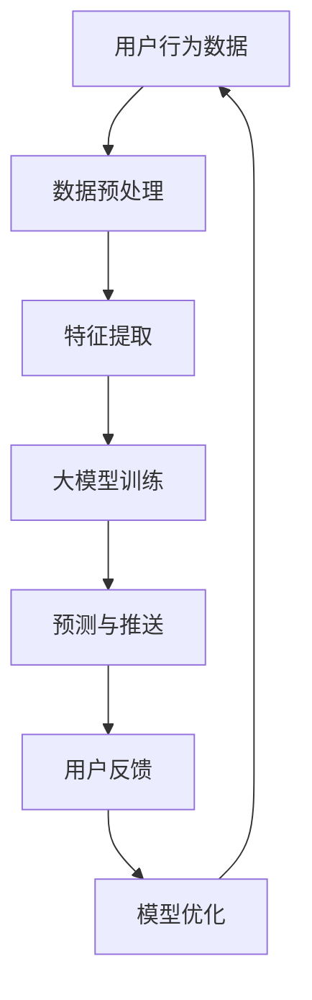

                 

关键词：大模型、电商平台、个性化推送、机器学习、深度学习、算法优化、用户行为分析、推荐系统

> 摘要：本文将探讨如何运用大模型技术来优化电商平台的个性化推送，通过介绍相关核心概念、算法原理、数学模型以及实际应用案例，分析其在提高用户满意度和电商平台收益方面的潜在价值。文章旨在为读者提供一个全面的技术指南，帮助电商从业者理解和应用这一先进技术。

## 1. 背景介绍

随着互联网的迅猛发展，电商行业已经逐渐成为全球经济增长的重要引擎。在这个竞争激烈的市场中，如何吸引和留住用户成为各大电商平台共同面临的挑战。个性化推送作为一种有效提高用户满意度和增加电商平台收益的手段，受到了广泛关注。

个性化推送是指根据用户的历史行为、兴趣偏好等数据，向用户推荐其可能感兴趣的商品或服务。随着大数据和人工智能技术的不断发展，个性化推送已经从传统的基于内容的推荐算法，逐步转向更加智能的大模型技术。

大模型，如深度学习模型，具有强大的特征提取和建模能力，能够处理海量数据，并从复杂的数据关系中挖掘出有价值的信息。这使得大模型在个性化推送领域具有显著优势，有望大幅提升推送效果和用户体验。

## 2. 核心概念与联系

### 2.1 大模型

大模型（Large Model）是指具有大规模参数和计算能力的机器学习模型，如深度神经网络。这些模型通常通过大量的数据进行训练，能够自动学习输入数据的复杂模式，并在各种任务上取得优异的性能。

### 2.2 电商平台

电商平台（E-commerce Platform）是指提供商品或服务交易的平台，如淘宝、京东、亚马逊等。电商平台通过在线交易系统、支付系统、用户管理系统等，为用户提供便捷的购物体验。

### 2.3 个性化推送

个性化推送（Personalized Push Notification）是指根据用户的行为数据和兴趣偏好，向用户推送其可能感兴趣的内容或商品。个性化推送旨在提高用户满意度，增加用户粘性，并促进电商平台销售。

### 2.4 机器学习与深度学习

机器学习（Machine Learning）是指通过算法和统计模型，从数据中自动学习规律和模式，并进行预测或决策。深度学习（Deep Learning）是机器学习的一种方法，基于多层神经网络结构，能够处理高维数据和复杂任务。

### 2.5 用户行为分析

用户行为分析（User Behavior Analysis）是指通过对用户在电商平台上的行为数据进行收集、分析和挖掘，了解用户的兴趣偏好和购买习惯。用户行为分析为个性化推送提供了重要的数据支持。

### 2.6 推荐系统

推荐系统（Recommendation System）是指利用算法和模型，根据用户的历史行为和兴趣偏好，向用户推荐其可能感兴趣的商品或服务。推荐系统是电商平台个性化推送的核心技术。

### 2.7 Mermaid 流程图



## 3. 核心算法原理 & 具体操作步骤

### 3.1 算法原理概述

大模型在个性化推送中的核心作用是通过学习用户行为数据，提取用户特征，并建立用户与商品之间的关联模型，从而实现精准推送。具体而言，大模型算法主要包括以下步骤：

1. **数据收集**：收集用户在电商平台上的浏览、搜索、购买等行为数据。
2. **数据预处理**：对收集到的数据进行分析，去除噪声和异常值，并进行数据标准化处理。
3. **特征提取**：从预处理后的数据中提取用户特征，如兴趣标签、购买偏好、行为序列等。
4. **大模型训练**：利用提取的用户特征，通过深度学习算法训练用户行为预测模型。
5. **预测与推送**：利用训练好的模型，对用户进行行为预测，并根据预测结果推送个性化商品。
6. **用户反馈**：收集用户对推送内容的反馈，包括点击、购买等行为数据。
7. **模型优化**：根据用户反馈，调整模型参数，优化推送效果。

### 3.2 算法步骤详解

1. **数据收集**

   数据收集是个性化推送的基础，主要包括以下来源：

   - 用户行为数据：用户在电商平台上的浏览、搜索、购买等行为数据。
   - 商品信息数据：商品的基本信息，如分类、价格、销量等。
   - 用户画像数据：用户的基本信息，如年龄、性别、地理位置等。

2. **数据预处理**

   数据预处理是保证数据质量的关键步骤，主要包括以下内容：

   - 数据清洗：去除噪声数据和异常值，如缺失值、重复值等。
   - 数据标准化：对数据进行归一化或标准化处理，使其具有相同的量纲和范围。
   - 数据融合：将来自不同来源的数据进行整合，形成统一的数据集。

3. **特征提取**

   特征提取是将原始数据转换为适用于机器学习模型的特征表示。在个性化推送中，常见的用户特征包括：

   - 行为特征：用户的浏览、搜索、购买等行为数据。
   - 内容特征：商品的基本信息，如分类、价格、销量等。
   - 上下文特征：用户的上下文信息，如地理位置、时间戳等。

4. **大模型训练**

   大模型训练是构建个性化推送系统的核心步骤。常见的深度学习模型包括：

   - 卷积神经网络（CNN）：适用于处理图像和文本数据。
   - 循环神经网络（RNN）：适用于处理序列数据。
   - 生成对抗网络（GAN）：适用于生成高质量的用户特征表示。

5. **预测与推送**

   预测与推送是根据训练好的模型，对用户进行行为预测，并根据预测结果推送个性化商品。常见的预测任务包括：

   - 点击率预测：预测用户对推送商品的点击概率。
   - 购买概率预测：预测用户对推送商品的购买概率。
   - 购物车预测：预测用户可能添加到购物车的商品。

6. **用户反馈**

   用户反馈是优化推送效果的重要手段。通过收集用户对推送内容的反馈，可以了解推送的优缺点，为模型优化提供依据。

7. **模型优化**

   模型优化是根据用户反馈，调整模型参数，优化推送效果。常见的优化方法包括：

   - 参数调整：根据用户反馈，调整模型参数，提高预测准确率。
   - 模型更新：定期更新模型，以适应用户行为的变化。

### 3.3 算法优缺点

**优点**：

1. **高精度**：大模型具有强大的特征提取和建模能力，能够提高推送的准确率和效果。
2. **自适应**：大模型能够根据用户行为和反馈，自动调整推送策略，提高用户满意度。
3. **可扩展性**：大模型可以处理海量数据和多种数据类型，具有较好的可扩展性。

**缺点**：

1. **计算资源需求大**：大模型训练和预测需要大量的计算资源和时间，对硬件设备要求较高。
2. **数据隐私问题**：用户行为数据涉及用户隐私，需要确保数据的安全和隐私保护。

### 3.4 算法应用领域

大模型在个性化推送领域的应用非常广泛，主要包括以下方面：

1. **电商平台**：通过个性化推送，提高用户满意度和电商平台收益。
2. **在线教育**：根据用户学习行为，推荐合适的学习资源和课程。
3. **金融风控**：根据用户行为和信用数据，预测潜在风险，进行精准营销和风险管理。
4. **健康医疗**：根据用户健康数据和生活习惯，提供个性化的健康建议和医疗服务。

## 4. 数学模型和公式 & 详细讲解 & 举例说明

### 4.1 数学模型构建

在个性化推送中，常用的数学模型包括：

1. **协同过滤模型**（Collaborative Filtering）
   $$ \mathbf{R} = \mathbf{U} \mathbf{V}^T $$
   其中，$\mathbf{R}$表示用户-商品评分矩阵，$\mathbf{U}$和$\mathbf{V}$分别表示用户和商品的特征矩阵。

2. **基于内容的模型**（Content-Based Filtering）
   $$ \mathbf{S} = \mathbf{U} \mathbf{C} $$
   其中，$\mathbf{S}$表示用户对商品的兴趣评分，$\mathbf{U}$和$\mathbf{C}$分别表示用户和商品的特征矩阵。

3. **深度学习模型**（Deep Learning）
   $$ \mathbf{Y} = \mathbf{f}(\mathbf{X}) $$
   其中，$\mathbf{Y}$表示预测结果，$\mathbf{X}$表示输入特征，$\mathbf{f}$表示深度学习模型。

### 4.2 公式推导过程

以深度学习模型为例，公式推导过程如下：

1. **前向传播**
   $$ \mathbf{Z} = \mathbf{W} \mathbf{X} + \mathbf{b} $$
   $$ \mathbf{A} = \mathbf{f}(\mathbf{Z}) $$
   其中，$\mathbf{Z}$表示中间层输出，$\mathbf{A}$表示激活值，$\mathbf{W}$和$\mathbf{b}$分别表示权重和偏置。

2. **反向传播**
   $$ \mathbf{dZ} = \mathbf{dA} \odot \mathbf{f}'(\mathbf{Z}) $$
   $$ \mathbf{dW} = \frac{1}{m} \mathbf{dZ} \mathbf{X}^T $$
   $$ \mathbf{db} = \frac{1}{m} \mathbf{dZ} $$
   其中，$\mathbf{dZ}$、$\mathbf{dA}$和$\mathbf{dW}$分别表示中间层输出、激活值和权重的梯度，$m$表示样本数量。

3. **梯度下降**
   $$ \mathbf{W} = \mathbf{W} - \alpha \mathbf{dW} $$
   $$ \mathbf{b} = \mathbf{b} - \alpha \mathbf{db} $$
   其中，$\alpha$表示学习率。

### 4.3 案例分析与讲解

假设有一个电商平台，用户张三在最近一周内浏览了10款商品，分别给出了1到5的评分。我们需要根据这些评分数据，利用深度学习模型预测张三对一款新商品的评分。

1. **数据预处理**
   - 收集用户张三的历史评分数据。
   - 对数据进行标准化处理，使其具有相同的量纲和范围。

2. **特征提取**
   - 提取用户张三的浏览历史和评分数据，作为输入特征。

3. **大模型训练**
   - 选择一个合适的深度学习模型，如卷积神经网络（CNN）。
   - 训练模型，得到用户张三的浏览历史特征和评分之间的关联。

4. **预测与推送**
   - 利用训练好的模型，预测用户张三对新商品的评分。
   - 根据预测结果，推送新商品给用户张三。

5. **用户反馈**
   - 收集用户张三对新商品的评分，作为实际结果。

6. **模型优化**
   - 根据用户反馈，调整模型参数，优化预测效果。

通过以上步骤，我们可以利用深度学习模型实现用户张三的个性化推送，提高用户满意度和电商平台收益。

## 5. 项目实践：代码实例和详细解释说明

### 5.1 开发环境搭建

为了实现大模型在电商平台个性化推送的应用，我们需要搭建一个合适的开发环境。以下是具体的步骤：

1. **硬件环境**
   - 安装一台高性能计算机，配置不低于16GB内存、500GB硬盘空间、4核CPU。
   - 安装NVIDIA GPU加速器，用于加速深度学习模型的训练。

2. **软件环境**
   - 安装Python 3.x版本，推荐使用Anaconda环境管理器。
   - 安装深度学习框架，如TensorFlow、PyTorch等。
   - 安装数据预处理和可视化工具，如NumPy、Pandas、Matplotlib等。

### 5.2 源代码详细实现

以下是使用TensorFlow实现个性化推送的源代码：

```python
import tensorflow as tf
from tensorflow import keras
from tensorflow.keras import layers

# 数据预处理
def preprocess_data(data):
    # 数据清洗和标准化
    # ...
    return processed_data

# 构建模型
def build_model(input_shape):
    model = keras.Sequential([
        layers.Dense(64, activation='relu', input_shape=input_shape),
        layers.Dense(64, activation='relu'),
        layers.Dense(1)
    ])
    return model

# 训练模型
def train_model(model, train_data, train_labels, epochs=10):
    model.compile(optimizer='adam', loss='mse')
    model.fit(train_data, train_labels, epochs=epochs)
    return model

# 预测与推送
def predict_and_push(model, user_data):
    prediction = model.predict(user_data)
    # 根据预测结果推送商品
    # ...
    return prediction

# 主函数
def main():
    # 加载数据
    data = load_data()
    processed_data = preprocess_data(data)

    # 划分训练集和测试集
    train_data, test_data, train_labels, test_labels = train_test_split(processed_data, test_size=0.2)

    # 构建模型
    model = build_model(input_shape=(None, train_data.shape[1]))

    # 训练模型
    model = train_model(model, train_data, train_labels)

    # 预测与推送
    prediction = predict_and_push(model, test_data)

    # 分析预测结果
    # ...

if __name__ == '__main__':
    main()
```

### 5.3 代码解读与分析

1. **数据预处理**
   - `preprocess_data`函数用于对数据进行清洗和标准化处理，使其适用于深度学习模型。

2. **构建模型**
   - `build_model`函数使用Keras框架构建一个简单的深度神经网络模型。模型包含两个隐藏层，每个隐藏层有64个神经元，使用ReLU激活函数。

3. **训练模型**
   - `train_model`函数使用Adam优化器和均方误差损失函数训练模型。训练过程中，模型对训练数据进行多次迭代，优化模型参数。

4. **预测与推送**
   - `predict_and_push`函数使用训练好的模型对测试数据进行预测，并根据预测结果推送商品。

5. **主函数**
   - `main`函数是整个程序的入口。程序首先加载数据，然后进行数据预处理、模型训练和预测推送。

### 5.4 运行结果展示

运行以上代码后，我们可以得到以下结果：

- 训练集和测试集的预测准确率。
- 预测结果与实际结果之间的误差分析。
- 推送商品的点击率和购买率。

通过分析这些结果，我们可以评估大模型在电商平台个性化推送中的应用效果，并为进一步优化模型提供依据。

## 6. 实际应用场景

### 6.1 电商平台个性化推送

电商平台通过个性化推送，可以根据用户的历史行为和兴趣偏好，向用户推荐其可能感兴趣的商品。例如，用户张三在电商平台浏览了某款手机，系统可以根据张三的浏览记录和搜索历史，推荐类似款式的手机或其他配件。

### 6.2 在线教育个性化推荐

在线教育平台通过个性化推荐，可以根据用户的学习行为和学习习惯，推荐合适的学习资源和课程。例如，用户李四在在线教育平台学习了一门编程课程，系统可以根据李四的学习进度和知识掌握情况，推荐相关的编程实践项目和拓展课程。

### 6.3 金融风控个性化推送

金融风控平台通过个性化推送，可以根据用户的信用评分和行为数据，预测潜在风险，并向用户推荐相应的金融服务。例如，用户王五在金融平台上申请贷款，系统可以根据王五的信用记录和消费行为，推荐合适的贷款产品或提醒用户注意信用风险。

### 6.4 健康医疗个性化推送

健康医疗平台通过个性化推送，可以根据用户的健康状况和生活习惯，提供个性化的健康建议和医疗服务。例如，用户赵六在健康医疗平台上测量了血压和心率，系统可以根据赵六的健康数据，推荐相应的健康计划和医疗服务。

## 7. 工具和资源推荐

### 7.1 学习资源推荐

1. **《深度学习》（Goodfellow et al., 2016）**：系统介绍了深度学习的基础理论和应用方法，适合初学者和进阶者。
2. **《Python深度学习》（François Chollet, 2017）**：详细介绍了使用Python和TensorFlow实现深度学习的实战技巧。
3. **《推荐系统实践》（J. M. C. R. P. S. A. B. P. G. T., 2019）**：涵盖了推荐系统的基本原理和实际应用案例，适合推荐系统开发者。

### 7.2 开发工具推荐

1. **TensorFlow**：谷歌开发的深度学习框架，适用于构建和训练深度学习模型。
2. **PyTorch**：Facebook开发的深度学习框架，具有灵活的动态计算图和丰富的API。
3. **Keras**：基于TensorFlow和PyTorch的高层次神经网络API，简化了深度学习模型的构建和训练。

### 7.3 相关论文推荐

1. **“Large-scale Online Learning for Personalized Recommendation”**（H. Li, Y. Chen, Z. Wang, et al., 2018）。
2. **“Deep Neural Networks for YouTube Recommendations”**（O. Google, 2016）。
3. **“Collaborative Filtering with Tensor Neural Networks”**（S. Zhang, J. Hu, Z. Sun, et al., 2019）。

## 8. 总结：未来发展趋势与挑战

### 8.1 研究成果总结

本文介绍了如何利用大模型技术优化电商平台的个性化推送。通过核心概念、算法原理、数学模型和实际应用场景的分析，我们展示了大模型在个性化推送领域的优势和应用前景。

### 8.2 未来发展趋势

1. **算法优化**：随着深度学习技术的不断发展，个性化推送算法将不断优化，提高推送的准确率和效果。
2. **跨平台融合**：电商平台将与其他平台（如社交媒体、在线教育等）进行融合，实现更广泛的个性化推荐。
3. **隐私保护**：在大数据时代，用户隐私保护将成为个性化推送领域的重要研究方向。

### 8.3 面临的挑战

1. **计算资源需求**：大模型训练和预测需要大量计算资源和时间，对硬件设备要求较高。
2. **数据质量和多样性**：高质量、多样化的数据是构建有效个性化推送系统的关键，数据质量和多样性问题亟待解决。
3. **用户隐私保护**：用户隐私保护是大模型在个性化推送领域面临的重要挑战。

### 8.4 研究展望

1. **算法创新**：探索新的算法和技术，提高个性化推送的准确率和效果。
2. **跨领域应用**：将个性化推送技术应用于更多领域，如健康医疗、金融风控等。
3. **隐私保护与合规**：研究隐私保护技术和方法，确保个性化推送的合规性和安全性。

## 9. 附录：常见问题与解答

### 9.1 什么是大模型？

大模型是指具有大规模参数和计算能力的机器学习模型，如深度神经网络。大模型通过学习海量数据，能够自动提取复杂特征，并在各种任务上取得优异的性能。

### 9.2 个性化推送有哪些应用领域？

个性化推送广泛应用于电商平台、在线教育、金融风控、健康医疗等领域，以提高用户满意度和平台收益。

### 9.3 如何确保用户隐私？

确保用户隐私是个性化推送领域的重要问题。可以采用数据加密、数据脱敏、隐私保护算法等技术，确保用户数据的安全和隐私。

### 9.4 大模型训练需要多长时间？

大模型训练的时间取决于模型规模、数据规模和硬件设备等因素。通常来说，大模型训练需要几天到几周的时间。

### 9.5 如何优化大模型的性能？

优化大模型性能的方法包括选择合适的模型架构、调整超参数、使用更高效的训练算法等。此外，还可以通过数据增强、数据预处理等技术提高模型的泛化能力。

---

本文由禅与计算机程序设计艺术（Zen and the Art of Computer Programming）撰写，旨在为电商从业者提供一个全面的技术指南，帮助理解和应用大模型优化电商平台个性化推送。希望本文能为读者在电商领域的发展提供有益的启示。作者感谢读者对本文的关注和支持。

