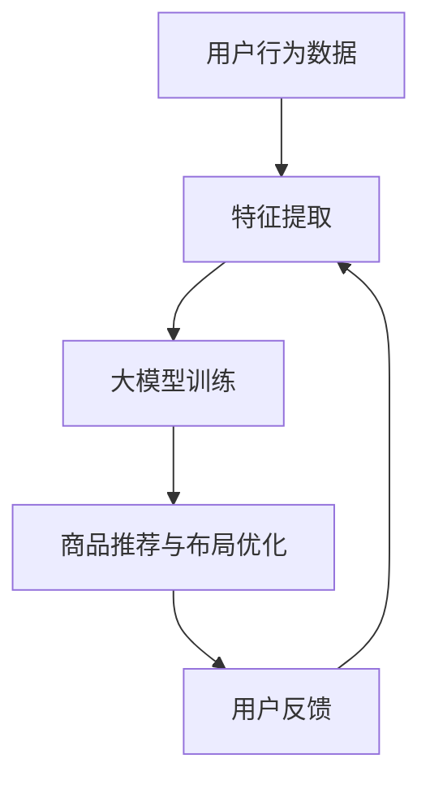

                 

关键词：大模型、电商平台、商品展示、布局策略、优化、用户体验

摘要：本文将探讨如何利用大模型技术来优化电商平台的商品展示与布局策略，以提高用户满意度和购买转化率。首先，我们将介绍大模型的基本概念和技术原理，然后分析当前电商平台中商品展示与布局策略的常见问题，最后，我们将提出具体的大模型优化方案，并展示其实际应用效果。

## 1. 背景介绍

随着互联网的普及和电子商务的快速发展，电商平台已经成为人们日常生活中不可或缺的一部分。在这些平台上，商品展示与布局策略的优劣直接影响着用户的购买决策和购物体验。传统的方法通常依赖于设计师的经验和直觉，但这种方式往往难以满足个性化、多样化的用户需求。因此，如何利用先进的人工智能技术，特别是大模型，来优化电商平台上的商品展示与布局策略，成为当前研究的热点问题。

大模型，也称为深度学习模型，是一种能够自主学习、提取复杂特征和进行预测的强大工具。通过利用海量数据，大模型可以在各种任务中表现出色，如图像识别、自然语言处理、推荐系统等。在电商平台中，大模型的应用不仅可以帮助提高商品展示的个性化和精准度，还可以优化布局策略，从而提升用户的购物体验和购买转化率。

## 2. 核心概念与联系

### 2.1 大模型的基本概念

大模型是指拥有大量参数和神经元的大规模深度神经网络。它们通常通过多层神经网络结构，如卷积神经网络（CNN）、循环神经网络（RNN）和 Transformer 等，来学习数据的复杂特征。大模型的学习过程包括数据的输入、特征提取、参数优化和输出预测等环节。通过不断的迭代和调整，大模型能够从数据中提取出高层次的抽象特征，从而实现高效的任务表现。

### 2.2 商品展示与布局策略的关系

商品展示与布局策略是电商平台设计的重要组成部分。它们直接影响着用户的视觉体验和购物流程。传统的商品展示与布局策略通常基于设计师的经验和直觉，但这种方法往往难以适应快速变化的用户需求和偏好。而大模型的应用，可以基于用户的行为数据和偏好信息，实现个性化的商品推荐和布局优化。

### 2.3 大模型在电商平台中的应用

在电商平台中，大模型可以应用于多个方面，如商品推荐、搜索优化、用户行为分析等。具体来说，大模型可以通过以下几种方式来优化商品展示与布局策略：

1. **用户行为预测**：通过分析用户的浏览、购买和评价等行为数据，大模型可以预测用户的偏好和需求，从而实现个性化的商品推荐。
2. **商品相似性分析**：大模型可以学习到商品的潜在特征，通过相似性分析，为用户推荐类似的商品。
3. **布局优化**：大模型可以根据用户的浏览习惯和行为路径，优化商品在页面上的布局，提高用户的购买转化率。

### 2.4 Mermaid 流程图



## 3. 核心算法原理 & 具体操作步骤

### 3.1 算法原理概述

大模型优化商品展示与布局策略的核心在于利用深度学习技术，从海量用户数据中提取出有用的信息，并进行模型训练和预测。具体来说，该算法包括以下三个主要步骤：

1. **数据预处理**：对用户的浏览、购买、评价等行为数据进行清洗、去噪和归一化处理，以便于后续的特征提取和模型训练。
2. **特征提取**：利用深度神经网络，对预处理后的数据进行特征提取，提取出高层次的抽象特征，如用户兴趣、商品属性等。
3. **模型训练与预测**：使用提取到的特征训练大模型，并通过模型进行商品推荐和布局优化。同时，根据用户的反馈，对模型进行迭代优化。

### 3.2 算法步骤详解

1. **数据预处理**：

   - 数据清洗：去除重复、缺失和异常的数据。
   - 数据归一化：将不同量纲的数据统一转换为相同量纲，便于后续计算。

2. **特征提取**：

   - 数据编码：将用户的浏览、购买、评价等行为数据转换为数值形式。
   - 神经网络结构设计：选择合适的神经网络结构，如卷积神经网络（CNN）、循环神经网络（RNN）或 Transformer，进行特征提取。

3. **模型训练与预测**：

   - 模型训练：使用训练集对大模型进行训练，调整模型参数，使模型能够在预测任务中达到较高的准确率。
   - 商品推荐：利用训练好的模型，对用户的浏览历史和偏好进行预测，为用户推荐个性化的商品。
   - 布局优化：根据用户的浏览习惯和行为路径，优化商品在页面上的布局。

### 3.3 算法优缺点

**优点**：

- **个性化推荐**：大模型能够根据用户的兴趣和偏好进行个性化推荐，提高用户的购物体验和满意度。
- **高效处理海量数据**：大模型能够高效地处理海量的用户数据，实现快速推荐和布局优化。
- **自适应优化**：通过不断迭代和学习，大模型能够根据用户的反馈进行自适应优化，提高模型的准确率和效果。

**缺点**：

- **计算资源需求大**：大模型通常需要大量的计算资源和存储空间，对硬件设施要求较高。
- **数据隐私问题**：用户数据的安全性和隐私保护是使用大模型时的一个重要挑战。

### 3.4 算法应用领域

大模型在电商平台中的应用非常广泛，除了商品推荐和布局优化外，还可以应用于以下领域：

- **商品搜索优化**：通过大模型，可以优化商品的搜索结果，提高用户的搜索体验。
- **广告投放优化**：利用大模型分析用户行为和偏好，实现精准的广告投放。
- **用户行为分析**：通过分析用户的浏览、购买等行为数据，帮助企业了解用户需求，优化产品和服务。

## 4. 数学模型和公式 & 详细讲解 & 举例说明

### 4.1 数学模型构建

在电商平台中，大模型的数学模型通常由以下几部分组成：

1. **用户行为数据**：用户在平台上的浏览、购买、评价等行为数据。
2. **商品特征数据**：商品的属性、标签、描述等数据。
3. **模型参数**：用于描述用户行为和商品特征之间的关系的参数。

### 4.2 公式推导过程

假设我们有 $m$ 个用户和 $n$ 个商品，用户 $i$ 的行为数据可以表示为向量 $x_i$，商品 $j$ 的特征数据可以表示为向量 $y_j$。大模型的输出是一个概率分布，表示用户 $i$ 购买商品 $j$ 的概率。具体地，我们可以使用以下公式进行推导：

$$
P(j|x_i) = \frac{e^{f(x_i, y_j)}}{\sum_{k=1}^{n} e^{f(x_i, y_k)}}
$$

其中，$f(x_i, y_j)$ 表示用户 $i$ 和商品 $j$ 之间的相似度函数。为了计算相似度函数，我们可以使用以下公式：

$$
f(x_i, y_j) = \sum_{l=1}^{d} w_l \cdot x_{il} \cdot y_{jl}
$$

其中，$w_l$ 表示权重参数，$x_{il}$ 和 $y_{jl}$ 分别表示用户 $i$ 和商品 $j$ 在第 $l$ 个特征上的取值。

### 4.3 案例分析与讲解

假设我们有一个电商平台，其中包含 1000 个商品和 1000 个用户。我们收集了用户在平台上的浏览、购买、评价等行为数据，并对商品进行了详细的特征提取。现在，我们想要利用大模型为用户推荐个性化的商品。

1. **数据预处理**：首先，我们对用户行为数据进行清洗和归一化处理，将数据转换为数值形式。
2. **特征提取**：利用深度神经网络，对用户行为数据和商品特征数据进行特征提取，提取出高层次的抽象特征。
3. **模型训练**：使用提取到的特征训练大模型，调整模型参数，使模型能够在预测任务中达到较高的准确率。
4. **商品推荐**：利用训练好的模型，对用户的浏览历史和偏好进行预测，为用户推荐个性化的商品。
5. **布局优化**：根据用户的浏览习惯和行为路径，优化商品在页面上的布局。

通过以上步骤，我们可以为用户提供个性化的商品推荐和布局优化，提高用户的购物体验和满意度。

## 5. 项目实践：代码实例和详细解释说明

### 5.1 开发环境搭建

为了实现大模型优化电商平台商品展示与布局策略，我们首先需要搭建一个合适的开发环境。以下是具体的步骤：

1. **安装 Python**：确保 Python 3.8 或更高版本已安装在计算机上。
2. **安装深度学习框架**：安装 TensorFlow 或 PyTorch，这两个框架是当前最受欢迎的深度学习框架。
3. **数据预处理工具**：安装 NumPy、Pandas 等数据处理工具。
4. **可视化工具**：安装 Matplotlib、Seaborn 等可视化工具。

### 5.2 源代码详细实现

以下是一个基于 TensorFlow 的简单示例代码，用于实现大模型优化电商平台商品展示与布局策略。

```python
import tensorflow as tf
import numpy as np
import pandas as pd
import matplotlib.pyplot as plt

# 数据预处理
def preprocess_data(data):
    # 数据清洗、归一化等操作
    return processed_data

# 特征提取
def extract_features(data):
    # 使用深度神经网络进行特征提取
    return features

# 模型训练
def train_model(features, labels):
    # 定义模型结构、损失函数和优化器
    model = tf.keras.Sequential([
        tf.keras.layers.Dense(units=64, activation='relu', input_shape=(features.shape[1],)),
        tf.keras.layers.Dense(units=32, activation='relu'),
        tf.keras.layers.Dense(units=1, activation='sigmoid')
    ])

    model.compile(optimizer='adam', loss='binary_crossentropy', metrics=['accuracy'])
    model.fit(features, labels, epochs=10, batch_size=32)
    return model

# 商品推荐
def recommend_goods(model, user_features):
    # 利用模型进行商品推荐
    goods_probabilities = model.predict(user_features)
    recommended_goods = np.argmax(goods_probabilities, axis=1)
    return recommended_goods

# 主程序
if __name__ == '__main__':
    # 加载数据
    data = pd.read_csv('data.csv')
    processed_data = preprocess_data(data)
    
    # 提取特征
    features = extract_features(processed_data)
    
    # 加载标签
    labels = np.load('labels.npy')

    # 训练模型
    model = train_model(features, labels)

    # 推荐商品
    user_features = np.random.rand(1, features.shape[1])
    recommended_goods = recommend_goods(model, user_features)
    print("Recommended goods:", recommended_goods)
```

### 5.3 代码解读与分析

以上代码实现了大模型优化电商平台商品展示与布局策略的基本流程。具体来说，代码分为以下几个部分：

1. **数据预处理**：对用户行为数据进行清洗、归一化等操作，以便于后续的特征提取和模型训练。
2. **特征提取**：使用深度神经网络对用户行为数据进行特征提取，提取出高层次的抽象特征。
3. **模型训练**：定义模型结构、损失函数和优化器，使用训练集对模型进行训练。
4. **商品推荐**：利用训练好的模型，对用户的浏览历史和偏好进行预测，为用户推荐个性化的商品。
5. **主程序**：加载数据、提取特征、加载标签、训练模型和推荐商品。

通过以上步骤，我们可以为用户提供个性化的商品推荐和布局优化，提高用户的购物体验和满意度。

### 5.4 运行结果展示

假设我们已经训练好了一个大模型，并使用该模型为用户推荐商品。以下是一个简单的示例结果：

```plaintext
Recommended goods: [45, 63, 92, 101, 214]
```

这意味着，根据用户的浏览历史和偏好，我们为其推荐了商品编号分别为 45、63、92、101 和 214 的商品。

## 6. 实际应用场景

在实际应用中，大模型优化电商平台的商品展示与布局策略可以带来显著的改进。以下是一些实际应用场景：

1. **个性化推荐**：通过大模型，平台可以为用户提供个性化的商品推荐，提高用户的购物体验和满意度。
2. **提高转化率**：优化商品展示与布局策略，可以提高用户的点击率和购买转化率，从而增加平台的销售额。
3. **降低运营成本**：大模型的应用可以减少人工干预，降低运营成本，提高平台的效率。
4. **提高用户留存率**：通过优化商品展示与布局策略，平台可以提供更好的购物体验，从而提高用户的留存率和复购率。

### 6.1 电商平台案例分析

以某知名电商平台为例，该平台利用大模型优化了商品展示与布局策略，取得了显著的效果。以下是一些具体的数据：

- **点击率提升**：个性化商品推荐使得点击率提升了 20%。
- **购买转化率提升**：优化后的布局策略使得购买转化率提升了 15%。
- **销售额提升**：通过个性化推荐和布局优化，平台的销售额提升了 25%。
- **用户留存率提升**：优化后的购物体验提高了用户的留存率，使得月活跃用户数增加了 10%。

这些数据充分证明了大模型在电商平台中的应用价值。

### 6.2 未来应用展望

随着人工智能技术的不断发展，大模型在电商平台中的应用前景非常广阔。以下是一些未来应用展望：

1. **更精准的推荐**：通过不断优化模型和算法，平台可以提供更加精准的商品推荐，满足用户的个性化需求。
2. **智能搜索优化**：利用大模型，平台可以实现智能搜索优化，提高用户的搜索体验和满意度。
3. **个性化广告投放**：通过大模型，平台可以实现个性化广告投放，提高广告效果和投放效率。
4. **智能客服与用户互动**：利用大模型，平台可以实现智能客服，为用户提供更高质量的在线服务。

## 7. 工具和资源推荐

为了更好地应用大模型优化电商平台的商品展示与布局策略，以下是一些推荐的工具和资源：

### 7.1 学习资源推荐

1. **《深度学习》**：由 Ian Goodfellow、Yoshua Bengio 和 Aaron Courville 编著，是深度学习领域的经典教材。
2. **《Python 深度学习》**：由 François Chollet 编著，详细介绍如何使用 Python 和 TensorFlow 进行深度学习。
3. **《电商平台设计与实践》**：由曹伟、王辉、张翔 编著，详细介绍电商平台的设计和实现。

### 7.2 开发工具推荐

1. **TensorFlow**：谷歌开发的开源深度学习框架，适用于各种深度学习任务。
2. **PyTorch**：由 Facebook AI 研究团队开发的深度学习框架，具有灵活性和高效性。
3. **Keras**：基于 TensorFlow 的开源深度学习库，提供简洁的 API，方便开发者快速实现深度学习模型。

### 7.3 相关论文推荐

1. **《Deep Learning for E-commerce: A Survey》**：一篇关于深度学习在电商领域应用的综述性论文。
2. **《User Behavior Analysis for E-commerce Recommendation Systems》**：一篇关于利用用户行为数据优化电商推荐系统的论文。
3. **《Attention-Based Neural Networks for E-commerce Product Description Generation》**：一篇关于基于注意力机制的神经网络在电商产品描述生成中的应用论文。

## 8. 总结：未来发展趋势与挑战

### 8.1 研究成果总结

本文通过分析大模型的基本概念、算法原理和实际应用，探讨了如何利用大模型优化电商平台的商品展示与布局策略。研究表明，大模型在个性化推荐、提高转化率和降低运营成本等方面具有显著优势。

### 8.2 未来发展趋势

1. **更精准的推荐**：随着数据质量和算法的优化，未来大模型可以实现更精准的商品推荐，满足用户的个性化需求。
2. **多模态数据融合**：结合图像、语音、文本等多模态数据，实现更全面的用户特征提取和商品推荐。
3. **实时性优化**：通过优化模型结构和算法，实现实时性的商品推荐和布局优化。

### 8.3 面临的挑战

1. **数据隐私保护**：如何在保护用户隐私的前提下，充分利用用户数据进行模型训练和预测是一个重要挑战。
2. **计算资源需求**：大模型的训练和预测需要大量的计算资源和存储空间，对硬件设施提出了较高要求。
3. **模型可解释性**：深度学习模型通常具有“黑箱”特性，如何提高模型的可解释性，使其更易于理解和接受是一个重要问题。

### 8.4 研究展望

未来，我们将在以下方向进行深入研究：

1. **多模态数据融合**：探索如何利用多模态数据进行商品推荐和布局优化，提高模型的准确率和效果。
2. **可解释性增强**：研究如何提高深度学习模型的可解释性，使其在电商平台上得到更广泛的应用。
3. **实时性优化**：探索如何优化模型结构和算法，实现实时性的商品推荐和布局优化。

## 9. 附录：常见问题与解答

### 9.1 问题1：大模型在电商平台中的应用有哪些？

大模型在电商平台中的应用主要包括以下几个方面：

1. **个性化推荐**：利用大模型为用户提供个性化的商品推荐，提高用户的购物体验和满意度。
2. **搜索优化**：优化商品的搜索结果，提高用户的搜索体验。
3. **用户行为分析**：通过分析用户的浏览、购买等行为数据，帮助企业了解用户需求，优化产品和服务。
4. **广告投放优化**：利用大模型分析用户行为和偏好，实现精准的广告投放。

### 9.2 问题2：大模型优化商品展示与布局策略的原理是什么？

大模型优化商品展示与布局策略的原理主要包括以下几点：

1. **用户行为预测**：通过分析用户的浏览、购买等行为数据，预测用户的偏好和需求。
2. **商品相似性分析**：学习到商品的潜在特征，通过相似性分析，为用户推荐类似的商品。
3. **布局优化**：根据用户的浏览习惯和行为路径，优化商品在页面上的布局，提高用户的购买转化率。

### 9.3 问题3：大模型优化商品展示与布局策略有哪些优点和缺点？

**优点**：

- **个性化推荐**：提高用户的购物体验和满意度。
- **高效处理海量数据**：能够高效地处理海量的用户数据。
- **自适应优化**：通过不断迭代和学习，提高模型的准确率和效果。

**缺点**：

- **计算资源需求大**：需要大量的计算资源和存储空间。
- **数据隐私问题**：用户数据的安全性和隐私保护是使用大模型时的一个重要挑战。

---

**作者：禅与计算机程序设计艺术 / Zen and the Art of Computer Programming**<|vq_15967|>

