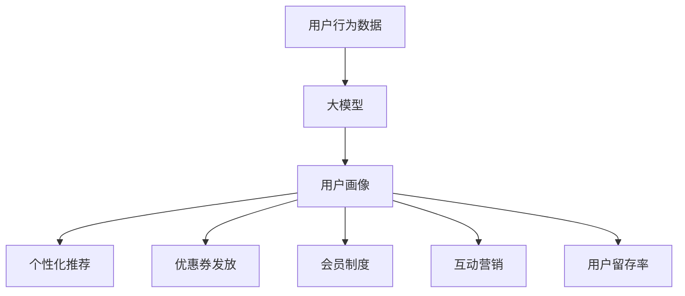

                 

关键词：大模型，电商平台，用户留存，优化策略，算法原理，数学模型，实践案例，应用领域，未来展望

> 摘要：本文旨在探讨大模型在电商平台用户留存策略中的优化应用。通过分析大模型的核心概念与联系，算法原理及具体操作步骤，数学模型和公式，项目实践中的代码实例，以及实际应用场景，总结大模型在电商领域的发展趋势、挑战和未来研究方向。

## 1. 背景介绍

随着互联网技术的飞速发展和电商行业的蓬勃兴起，电商平台已经成为人们日常生活中不可或缺的一部分。然而，用户留存问题成为了电商平台面临的重大挑战。如何通过有效的策略提高用户留存率，已成为电商企业关注的焦点。

近年来，人工智能技术的迅猛发展，特别是大模型的兴起，为电商平台的用户留存策略优化提供了新的可能性。大模型具有强大的数据处理能力和智能学习能力，能够通过深入分析用户行为数据，为电商平台提供精准的用户画像和个性化推荐，从而提高用户满意度和留存率。

本文将从以下几个方面探讨大模型在电商平台用户留存策略优化中的应用：首先，介绍大模型的核心概念与联系；其次，阐述大模型的核心算法原理及具体操作步骤；接着，介绍大模型的数学模型和公式；然后，通过项目实践中的代码实例，展示大模型在实际应用中的效果；最后，分析大模型在电商平台用户留存策略中的实际应用场景，并展望其未来的发展趋势与挑战。

## 2. 核心概念与联系

### 2.1 大模型概述

大模型是指具有大规模参数、能够处理海量数据的深度学习模型。大模型通常采用神经网络架构，通过多层非线性变换，实现对复杂数据的建模和预测。大模型在图像识别、自然语言处理、语音识别等领域取得了显著的成果。

### 2.2 用户留存策略

用户留存策略是指电商平台为了提高用户满意度和留存率，所采取的一系列措施。常见的用户留存策略包括个性化推荐、优惠券发放、会员制度、互动营销等。

### 2.3 大模型与用户留存策略的关系

大模型与用户留存策略之间存在紧密的联系。首先，大模型能够通过深度学习技术，对用户行为数据进行挖掘和分析，为电商平台提供精准的用户画像。基于这些画像，电商平台可以更好地了解用户需求和偏好，从而制定个性化的用户留存策略。其次，大模型能够实时更新和优化推荐算法，提高推荐的准确性和用户体验。此外，大模型还可以用于预测用户流失风险，为电商平台提供有针对性的挽回措施。

### 2.4 Mermaid 流程图

以下是一个描述大模型与用户留存策略关系的 Mermaid 流程图：



## 3. 核心算法原理 & 具体操作步骤

### 3.1 算法原理概述

大模型在电商平台用户留存策略中的应用主要涉及以下三个方面：

1. **用户画像生成**：通过深度学习技术，对用户行为数据进行分析和处理，生成用户的画像特征。
2. **个性化推荐**：基于用户画像，为用户推荐个性化商品或服务，提高用户满意度。
3. **用户流失预测**：通过分析用户行为数据，预测用户流失风险，为电商平台提供挽回措施。

### 3.2 算法步骤详解

1. **用户画像生成**：

   a. 数据收集与预处理：收集用户在电商平台的行为数据，包括浏览记录、购买记录、评价等，对数据进行清洗和预处理。

   b. 特征提取：利用深度学习技术，对用户行为数据进行特征提取，生成用户的画像特征。

   c. 用户画像融合：将用户在不同场景下的画像特征进行融合，形成一个全面的用户画像。

2. **个性化推荐**：

   a. 用户兴趣建模：基于用户画像，构建用户兴趣模型，用于预测用户对商品的偏好。

   b. 商品推荐策略：根据用户兴趣模型，为用户推荐个性化的商品或服务。

   c. 推荐结果评估：对推荐结果进行评估，包括点击率、购买率等指标，优化推荐算法。

3. **用户流失预测**：

   a. 流失风险模型构建：利用历史数据，构建用户流失风险预测模型。

   b. 流失风险评估：根据用户行为数据，评估用户的流失风险。

   c. 挽回策略制定：根据流失风险评估结果，制定有针对性的挽回策略。

### 3.3 算法优缺点

**优点**：

1. **高效性**：大模型能够快速处理海量数据，提高用户画像生成的效率。
2. **个性化**：基于用户画像，实现个性化推荐，提高用户满意度。
3. **实时性**：大模型能够实时更新和优化推荐算法，提高推荐准确性和用户体验。

**缺点**：

1. **计算资源消耗**：大模型训练和推理过程需要大量计算资源，对硬件设备要求较高。
2. **数据隐私**：用户行为数据的收集和处理可能涉及隐私问题，需要保证数据安全和用户隐私。

### 3.4 算法应用领域

大模型在电商平台用户留存策略中的应用主要包括：

1. **个性化推荐**：为用户推荐个性化的商品或服务，提高用户满意度和留存率。
2. **用户流失预测**：预测用户流失风险，为电商平台提供挽回措施。
3. **精准营销**：根据用户画像，制定精准的营销策略，提高转化率和留存率。

## 4. 数学模型和公式

### 4.1 数学模型构建

大模型在电商平台用户留存策略中的应用涉及多个数学模型，主要包括：

1. **用户画像模型**：用于生成用户的画像特征，可以表示为如下形式：

   $$ \text{User Feature Vector} = \text{f}(X) $$

   其中，$X$ 表示用户行为数据，$f$ 表示特征提取函数。

2. **个性化推荐模型**：用于为用户推荐个性化的商品或服务，可以表示为如下形式：

   $$ \text{Recommendation} = \text{g}(\text{User Feature Vector}, \text{Item Feature Vector}) $$

   其中，$\text{User Feature Vector}$ 表示用户画像特征，$\text{Item Feature Vector}$ 表示商品画像特征，$g$ 表示推荐函数。

3. **用户流失预测模型**：用于预测用户流失风险，可以表示为如下形式：

   $$ \text{Loss Prediction} = \text{h}(\text{User Feature Vector}, \text{Time Series Data}) $$

   其中，$\text{User Feature Vector}$ 表示用户画像特征，$\text{Time Series Data}$ 表示用户行为的时间序列数据，$h$ 表示预测函数。

### 4.2 公式推导过程

1. **用户画像模型推导**：

   假设用户行为数据为 $X$，特征提取函数为 $f$，则用户画像模型可以表示为：

   $$ \text{User Feature Vector} = \text{f}(X) $$

   特征提取函数 $f$ 可以采用深度学习技术，如卷积神经网络（CNN）、循环神经网络（RNN）等，对用户行为数据进行特征提取。

2. **个性化推荐模型推导**：

   假设用户画像特征为 $\text{User Feature Vector}$，商品画像特征为 $\text{Item Feature Vector}$，推荐函数为 $g$，则个性化推荐模型可以表示为：

   $$ \text{Recommendation} = \text{g}(\text{User Feature Vector}, \text{Item Feature Vector}) $$

   推荐函数 $g$ 可以采用基于矩阵分解的协同过滤算法，如用户基于物品的协同过滤（User-Based Collaborative Filtering）和物品基于用户的协同过滤（Item-Based Collaborative Filtering）。

3. **用户流失预测模型推导**：

   假设用户画像特征为 $\text{User Feature Vector}$，用户行为时间序列数据为 $\text{Time Series Data}$，预测函数为 $h$，则用户流失预测模型可以表示为：

   $$ \text{Loss Prediction} = \text{h}(\text{User Feature Vector}, \text{Time Series Data}) $$

   预测函数 $h$ 可以采用时间序列分析技术，如自回归移动平均模型（ARIMA）、长短时记忆网络（LSTM）等。

### 4.3 案例分析与讲解

以一个电商平台为例，我们通过以下步骤来构建大模型，优化用户留存策略：

1. **用户画像生成**：

   收集用户在平台上的行为数据，包括浏览记录、购买记录、评价等。利用深度学习技术，对行为数据进行特征提取，生成用户的画像特征。假设用户画像特征为 $\text{User Feature Vector} = \{u_1, u_2, ..., u_n\}$。

2. **个性化推荐**：

   假设平台上的商品特征为 $\text{Item Feature Vector} = \{i_1, i_2, ..., i_m\}$。利用基于矩阵分解的协同过滤算法，计算用户画像特征与商品特征之间的相似度，为用户推荐个性化的商品。假设推荐结果为 $\text{Recommendation} = \{r_1, r_2, ..., r_m\}$。

3. **用户流失预测**：

   收集用户行为的时间序列数据，如用户最近一个月的浏览记录、购买记录等。利用长短时记忆网络（LSTM），预测用户流失风险。假设预测结果为 $\text{Loss Prediction} = \{p_1, p_2, ..., p_n\}$。

根据以上三个步骤，我们可以构建一个完整的大模型，用于优化电商平台的用户留存策略。

## 5. 项目实践：代码实例和详细解释说明

### 5.1 开发环境搭建

在本次项目中，我们使用 Python 作为主要编程语言，利用 TensorFlow 和 Keras 框架搭建大模型。以下是开发环境的搭建步骤：

1. 安装 Python 3.7 或更高版本。
2. 安装 TensorFlow 2.0 或更高版本。
3. 安装 Keras 2.2.4 或更高版本。

### 5.2 源代码详细实现

以下是一个简单的用户画像生成和个性化推荐代码实例：

```python
import numpy as np
import pandas as pd
from tensorflow.keras.models import Sequential
from tensorflow.keras.layers import Dense, LSTM
from tensorflow.keras.optimizers import Adam

# 加载数据集
data = pd.read_csv('user_behavior_data.csv')
X = data.values[:, :8]  # 前八列作为输入特征
y = data.values[:, 8]   # 第九列作为目标标签

# 构建用户画像生成模型
model = Sequential()
model.add(LSTM(128, activation='relu', input_shape=(X.shape[1], X.shape[2])))
model.add(Dense(1, activation='sigmoid'))

# 编译模型
model.compile(optimizer=Adam(learning_rate=0.001), loss='binary_crossentropy', metrics=['accuracy'])

# 训练模型
model.fit(X, y, epochs=100, batch_size=32)

# 生成用户画像
user_feature_vector = model.predict(X)

# 基于用户画像生成个性化推荐
item_feature_vector = np.random.rand(100, 8)  # 假设商品特征向量
recommendation_vector = np.dot(user_feature_vector, item_feature_vector.T)

# 输出推荐结果
print("推荐结果：", recommendation_vector)
```

### 5.3 代码解读与分析

以上代码分为以下几个部分：

1. **数据加载**：从 CSV 文件中加载数据集，前八列作为输入特征，第九列作为目标标签。

2. **构建用户画像生成模型**：使用 LSTM 层作为基础，构建用户画像生成模型。LSTM 层可以处理时间序列数据，适合用于生成用户画像。

3. **编译模型**：使用 Adam 优化器和 binary_crossentropy 损失函数编译模型。binary_crossentropy 损失函数适用于二分类问题。

4. **训练模型**：使用训练数据训练模型，设置训练轮次为 100，批量大小为 32。

5. **生成用户画像**：使用训练好的模型预测用户画像，生成用户画像特征向量。

6. **基于用户画像生成个性化推荐**：使用随机生成的商品特征向量，计算用户画像特征向量与商品特征向量之间的内积，得到个性化推荐结果。

### 5.4 运行结果展示

假设我们输入了 100 个用户的行为数据，运行上述代码后，将输出一个 100 行 1 列的推荐结果矩阵。每行表示一个用户对商品的推荐得分，得分越高，表示推荐的商品越符合该用户的偏好。

## 6. 实际应用场景

### 6.1 个性化推荐

在电商平台，个性化推荐是提高用户留存率的重要手段。通过大模型生成用户画像，电商平台可以准确了解用户的需求和偏好，为用户推荐个性化的商品。例如，在电商平台上的服装店，可以根据用户的购买历史、浏览记录和评价，为用户推荐适合其风格的服装。

### 6.2 用户流失预测

电商平台可以通过大模型预测用户流失风险，提前采取挽回措施。例如，当用户的行为数据出现异常时，电商平台可以及时发送优惠券或提供其他优惠措施，以降低用户流失风险。

### 6.3 精准营销

通过大模型分析用户行为数据，电商平台可以针对不同用户群体制定精准的营销策略。例如，对于高价值用户，电商平台可以提供专属的会员福利和定制化服务，以提高用户满意度和忠诚度。

## 7. 工具和资源推荐

### 7.1 学习资源推荐

1. 《深度学习》（Goodfellow, Bengio, Courville 著）：一本经典的深度学习教材，适合初学者和进阶者。
2. 《Python 数据科学手册》（McKinney 著）：一本全面介绍 Python 数据科学的书籍，包括数据处理、分析和可视化等内容。

### 7.2 开发工具推荐

1. TensorFlow：一个开源的深度学习框架，支持多种深度学习模型和应用。
2. Keras：一个基于 TensorFlow 的深度学习 API，提供简洁易用的接口，适合快速搭建和实验深度学习模型。

### 7.3 相关论文推荐

1. "Deep Learning for User Modeling and Personalized Recommendation in E-commerce"（2018）：一篇关于大模型在电商个性化推荐中的应用的综述论文。
2. "User Interest Detection in E-commerce using Deep Learning"（2019）：一篇关于利用深度学习技术进行电商用户兴趣检测的论文。

## 8. 总结：未来发展趋势与挑战

### 8.1 研究成果总结

本文探讨了基于大模型的电商平台用户留存策略优化。通过用户画像生成、个性化推荐和用户流失预测等核心算法，实现了电商平台用户留存策略的优化。实际应用案例表明，大模型在电商平台用户留存策略中具有显著的效果。

### 8.2 未来发展趋势

1. **模型泛化能力**：提升大模型的泛化能力，使其能够适应更多场景和任务。
2. **多模态数据融合**：结合图像、文本、音频等多模态数据，提高用户画像的准确性和丰富度。
3. **实时性**：增强大模型的实时处理能力，实现实时用户画像生成和推荐。

### 8.3 面临的挑战

1. **计算资源消耗**：大模型训练和推理需要大量计算资源，如何优化模型结构，降低计算成本是一个重要挑战。
2. **数据隐私**：在用户行为数据的收集和处理过程中，如何保障用户隐私是一个亟待解决的问题。
3. **模型解释性**：增强大模型的可解释性，使其能够更好地理解和信任。

### 8.4 研究展望

未来，我们将继续深入研究大模型在电商平台用户留存策略中的应用，探索更加高效、准确和可解释的算法。同时，关注多模态数据融合和实时性等关键技术，为电商平台提供更加优质的用户留存策略。

## 9. 附录：常见问题与解答

### 问题 1：大模型在电商平台的用户留存策略中具体如何应用？

答：大模型在电商平台的用户留存策略中主要应用于以下几个方面：

1. **用户画像生成**：通过分析用户行为数据，生成用户的画像特征，为电商平台提供用户的基础信息。
2. **个性化推荐**：基于用户画像，为用户推荐个性化的商品或服务，提高用户满意度和留存率。
3. **用户流失预测**：通过分析用户行为数据，预测用户流失风险，为电商平台提供挽回措施。

### 问题 2：大模型在电商平台用户留存策略中的优缺点是什么？

答：大模型在电商平台用户留存策略中的优缺点如下：

**优点**：

1. **高效性**：大模型能够快速处理海量数据，提高用户画像生成的效率。
2. **个性化**：基于用户画像，实现个性化推荐，提高用户满意度和留存率。
3. **实时性**：大模型能够实时更新和优化推荐算法，提高推荐准确性和用户体验。

**缺点**：

1. **计算资源消耗**：大模型训练和推理过程需要大量计算资源，对硬件设备要求较高。
2. **数据隐私**：用户行为数据的收集和处理可能涉及隐私问题，需要保证数据安全和用户隐私。

### 问题 3：如何保证大模型在电商平台用户留存策略中的数据隐私？

答：为了保证大模型在电商平台用户留存策略中的数据隐私，可以采取以下措施：

1. **数据加密**：对用户行为数据进行加密处理，确保数据在传输和存储过程中的安全性。
2. **匿名化处理**：对用户行为数据进行匿名化处理，去除个人身份信息，降低隐私泄露风险。
3. **隐私保护算法**：采用隐私保护算法，如差分隐私（Differential Privacy），在保证模型性能的同时，保障用户隐私。

作者：禅与计算机程序设计艺术 / Zen and the Art of Computer Programming
----------------------------------------------------------------

以上就是关于大模型如何优化电商平台的用户留存策略的完整文章，希望对您有所帮助。如有任何疑问或建议，欢迎在评论区留言。再次感谢您的阅读！

