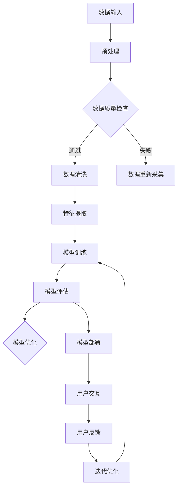

                 

关键词：大模型，电商平台，全渠道用户体验，一致性，算法，数学模型，应用场景，未来展望

> 摘要：随着电子商务的快速发展，电商平台的全渠道用户体验一致性成为衡量其竞争力的重要指标。本文将探讨大模型如何通过算法优化、数学模型构建等技术手段，提升电商平台在全渠道场景下的用户体验一致性，从而增强用户粘性、提升销售业绩。

## 1. 背景介绍

在当今数字化的时代，电商平台已经成为人们日常生活中不可或缺的一部分。随着消费者需求的不断变化和多样化，电商平台需要提供更加个性化、精准的服务，以满足不同用户在不同渠道上的购物体验需求。然而，全渠道用户体验一致性却成为电商平台面临的一大挑战。如何确保用户在不同设备、不同平台、不同时间访问电商平台时，获得一致且优质的购物体验，成为电商平台需要解决的核心问题。

全渠道用户体验一致性不仅影响用户的购物决策，还直接影响电商平台的品牌形象和市场份额。传统的技术手段如页面重构、响应式设计等在一定程度上能够提升用户体验，但往往无法实现真正的全渠道一致性。因此，引入大模型这一先进技术手段，通过算法优化和数学模型构建，有望在提升全渠道用户体验一致性方面发挥重要作用。

本文将从以下几个方面展开讨论：

1. 大模型在电商平台全渠道用户体验一致性中的核心概念和联系。
2. 大模型的核心算法原理和具体操作步骤。
3. 大模型的数学模型和公式及其应用领域。
4. 大模型在电商平台实际应用中的项目实践。
5. 大模型在电商平台的未来应用场景和展望。
6. 大模型相关的学习资源、开发工具和论文推荐。
7. 大模型在电商平台全渠道用户体验一致性中的发展趋势与挑战。

通过对以上内容的探讨，本文旨在为大模型在电商平台全渠道用户体验一致性中的应用提供有益的启示和指导。

### 1.1 电商平台的现状与挑战

当前，电商平台的发展已经进入了一个多元化、个性化的阶段。根据数据分析公司Statista的数据，全球电子商务市场规模在2021年达到了4.89万亿美元，预计到2026年将达到6.38万亿美元。这一数据充分表明，电商平台已经成为全球商业市场的重要组成部分。

然而，随着市场规模的不断扩大，电商平台也面临着一系列挑战。首先，消费者的需求越来越多样化，他们不仅关注产品的质量，更注重购物体验的愉悦性和个性化。这意味着电商平台需要提供更加精准、个性化的服务，以满足不同用户在不同渠道上的购物需求。其次，随着移动互联网和物联网技术的不断发展，消费者可以通过多种设备、平台进行购物，这使得电商平台需要实现全渠道的用户体验一致性。

全渠道用户体验一致性指的是用户在不同设备、不同平台、不同时间访问电商平台时，能够获得一致、优质的购物体验。这包括以下几个方面：

1. **界面一致性**：用户在不同设备上访问电商平台时，界面设计、布局和导航应该保持一致，以便用户能够快速找到所需信息。
2. **内容一致性**：电商平台上的商品信息、促销活动、用户评论等应该在不同渠道上保持一致，避免出现信息不一致的情况。
3. **交互一致性**：用户在电商平台上的操作流程、交互方式应该在不同渠道上一致，例如下单、支付、退换货等。
4. **服务一致性**：电商平台在售前、售中和售后的服务也应该保持一致，确保用户在任何一个渠道上都能获得及时、专业的帮助。

尽管全渠道用户体验一致性对电商平台的重要性不言而喻，但实现这一目标并非易事。传统的技术手段，如页面重构、响应式设计等，虽然能够在一定程度上提升用户体验，但往往无法实现真正的全渠道一致性。这是因为这些技术手段主要关注于界面和内容的适配，而忽略了更深层次的交互和服务一致性。

### 1.2 大模型的引入及其潜力

为了解决全渠道用户体验一致性这一挑战，电商平台开始探索引入大模型这一先进技术手段。大模型，尤其是深度学习模型，在图像识别、自然语言处理、推荐系统等领域已经取得了显著成果。这些模型通过大规模数据训练，能够学习到复杂的数据模式和用户行为，从而实现个性化、精准的服务。

大模型在电商平台全渠道用户体验一致性中的潜力主要体现在以下几个方面：

1. **个性化推荐**：大模型可以通过对用户历史行为、偏好和购物情境的分析，为用户提供个性化的推荐，从而提升购物体验的愉悦性和满意度。
2. **自然语言处理**：大模型能够处理自然语言，实现智能客服、智能搜索等功能，从而提升用户交互的一致性和便捷性。
3. **图像识别**：大模型在图像识别方面具有高精度，可以实现商品识别、场景识别等功能，从而提升内容一致性和界面一致性。
4. **多渠道数据融合**：大模型能够融合来自不同渠道的用户数据，实现跨渠道的用户画像构建，从而提升服务一致性和交互一致性。

通过引入大模型，电商平台不仅能够提升用户体验一致性，还能够增强用户粘性，提升销售业绩。因此，本文将进一步探讨大模型的核心概念和联系，以及如何通过算法优化和数学模型构建，实现电商平台全渠道用户体验一致性的提升。

## 2. 核心概念与联系

### 2.1 大模型的基本概念

大模型（Large-scale Model），是指那些能够处理海量数据、包含数亿甚至数十亿参数的复杂机器学习模型。大模型通常基于深度学习技术，特别是深度神经网络（Deep Neural Network, DNN）。深度神经网络由多层神经元组成，能够自动从数据中学习到复杂的特征表示，从而实现高效的特征提取和分类、预测任务。

大模型的基本原理是通过反向传播算法（Backpropagation Algorithm）对模型参数进行优化。在训练过程中，模型接收输入数据，通过前向传播计算输出，并与实际输出进行比较，通过反向传播计算梯度，并根据梯度更新模型参数。这一过程循环迭代，直到模型达到预定的训练目标。

大模型的类型主要包括：

1. **卷积神经网络（Convolutional Neural Network, CNN）**：主要用于图像识别和计算机视觉任务，通过卷积操作提取图像特征。
2. **循环神经网络（Recurrent Neural Network, RNN）**：适用于序列数据处理，如时间序列预测和自然语言处理。
3. **Transformer模型**：一种基于自注意力机制的模型，广泛应用于自然语言处理和推荐系统。

### 2.2 大模型与电商平台全渠道用户体验一致性的联系

大模型与电商平台全渠道用户体验一致性的联系主要体现在以下几个方面：

1. **个性化推荐**：大模型能够基于用户历史行为和偏好，为用户提供个性化的商品推荐。通过深度学习技术，模型能够从海量用户数据中挖掘出隐藏的模式和关联，从而实现精准的推荐，提升用户满意度。
2. **自然语言处理**：大模型在自然语言处理方面具有强大的能力，能够实现智能客服、智能搜索等功能。通过深度学习技术，模型能够理解用户输入的语义，提供准确的回复和搜索结果，提升交互一致性。
3. **图像识别**：大模型在图像识别方面具有高精度，能够实现商品识别、场景识别等功能。通过卷积神经网络等技术，模型能够从图像中提取出关键特征，实现快速、准确的识别，提升界面一致性。
4. **多渠道数据融合**：大模型能够处理来自不同渠道的用户数据，实现跨渠道的用户画像构建。通过深度学习技术，模型能够融合不同来源的数据，形成完整的用户画像，从而提升服务一致性和交互一致性。

### 2.3 大模型架构的 Mermaid 流程图

为了更好地理解大模型与电商平台全渠道用户体验一致性的联系，我们使用Mermaid流程图来展示大模型的基本架构。



图2.3 大模型架构流程图

- **数据输入**：包括用户行为数据、商品数据、渠道数据等。
- **预处理**：对输入数据进行清洗、去重、归一化等预处理操作。
- **数据质量检查**：检查数据质量，确保数据的有效性和一致性。
- **特征提取**：使用深度学习技术提取数据中的关键特征。
- **模型训练**：使用训练数据对模型进行训练，调整模型参数。
- **模型评估**：使用验证数据评估模型性能，确定模型是否达到预期效果。
- **模型优化**：根据评估结果对模型进行调整和优化。
- **模型部署**：将训练好的模型部署到生产环境中，实现用户交互。
- **用户交互**：用户与电商平台进行交互，如购物、搜索、咨询等。
- **用户反馈**：收集用户反馈数据，用于模型迭代优化。
- **迭代优化**：根据用户反馈数据对模型进行迭代优化，提升模型性能。

通过上述流程，大模型能够实现从数据输入到用户反馈的完整闭环，从而提升电商平台的全渠道用户体验一致性。

## 3. 核心算法原理 & 具体操作步骤

### 3.1 算法原理概述

大模型的核心算法原理主要基于深度学习技术，特别是深度神经网络（Deep Neural Network, DNN）。深度神经网络由多层神经元组成，通过前向传播和反向传播算法对模型参数进行优化，从而实现复杂的特征提取和分类、预测任务。

深度学习的基本过程可以分为以下几个步骤：

1. **数据输入**：输入原始数据，如图像、文本或序列数据。
2. **预处理**：对输入数据预处理，包括数据清洗、归一化、数据增强等操作。
3. **特征提取**：通过多层神经网络的卷积、池化、全连接等操作提取数据中的高级特征。
4. **前向传播**：将预处理后的数据输入到神经网络中，通过前向传播计算输出结果。
5. **损失函数**：计算输出结果与实际结果之间的差距，通过损失函数量化模型的误差。
6. **反向传播**：计算损失函数关于模型参数的梯度，通过反向传播算法更新模型参数。
7. **模型优化**：重复前向传播和反向传播过程，直到模型达到预定的训练目标或性能指标。

深度学习模型主要包括以下几种类型：

1. **卷积神经网络（Convolutional Neural Network, CNN）**：适用于图像识别和计算机视觉任务，通过卷积操作提取图像特征。
2. **循环神经网络（Recurrent Neural Network, RNN）**：适用于序列数据处理，如时间序列预测和自然语言处理，通过循环连接实现长距离依赖建模。
3. **Transformer模型**：一种基于自注意力机制的模型，广泛应用于自然语言处理和推荐系统，通过多头注意力机制实现高效的特征提取和关联。

### 3.2 算法步骤详解

为了实现电商平台的全渠道用户体验一致性，大模型的算法步骤可以分为以下几个阶段：

1. **数据采集与预处理**：
   - 数据采集：从电商平台的多渠道数据源（如用户行为数据、商品数据、渠道数据等）收集数据。
   - 数据预处理：对采集到的数据清洗、去重、归一化等预处理操作，确保数据的有效性和一致性。

2. **特征提取**：
   - 图像特征提取：使用卷积神经网络提取图像中的高级特征，如边缘、纹理等。
   - 文本特征提取：使用循环神经网络或Transformer模型提取文本中的语义特征，如关键词、主题等。
   - 多渠道数据融合：将不同渠道的数据特征进行融合，形成统一的用户特征表示。

3. **模型训练**：
   - 模型初始化：初始化模型参数，如权重和偏置。
   - 模型训练：通过前向传播和反向传播算法对模型进行训练，调整模型参数，使其能够更好地拟合训练数据。
   - 模型优化：根据训练结果对模型进行调整和优化，提升模型性能。

4. **模型评估与部署**：
   - 模型评估：使用验证数据评估模型性能，如准确率、召回率等。
   - 模型部署：将训练好的模型部署到生产环境中，实现用户交互和个性化推荐等功能。

5. **用户交互与反馈**：
   - 用户交互：用户与电商平台进行交互，如购物、搜索、咨询等。
   - 用户反馈：收集用户反馈数据，如点击、购买、评价等，用于模型迭代优化。

6. **迭代优化**：
   - 模型更新：根据用户反馈数据对模型进行迭代优化，提升模型性能。
   - 模型部署：将更新后的模型部署到生产环境中，实现持续优化。

### 3.3 算法优缺点

#### 优点

1. **强大的特征提取能力**：深度学习模型能够从海量数据中自动提取出复杂的特征表示，实现高效的分类和预测。
2. **高度的可扩展性**：深度学习模型可以通过增加层数和神经元数量进行扩展，以适应不同规模的任务和数据。
3. **良好的泛化能力**：深度学习模型在训练过程中通过大量数据学习到一般性的特征表示，从而在新的数据集上具有较好的泛化能力。
4. **自动化的特征工程**：深度学习模型能够自动处理数据的预处理和特征提取过程，减少了人工干预的工作量。

#### 缺点

1. **计算资源消耗大**：深度学习模型通常需要大量的计算资源和存储空间，对硬件设备有较高的要求。
2. **训练时间长**：深度学习模型的训练过程通常需要较长的计算时间，特别是在处理大规模数据时。
3. **数据需求量大**：深度学习模型在训练过程中需要大量的数据，数据的质量和数量对模型的性能有重要影响。
4. **模型解释性较差**：深度学习模型内部结构复杂，难以直观理解其工作原理，模型的解释性较差。

### 3.4 算法应用领域

大模型在电商平台的全渠道用户体验一致性中具有广泛的应用领域，主要包括以下几个方面：

1. **个性化推荐**：基于用户历史行为和偏好，通过深度学习模型为用户提供个性化的商品推荐，提升购物体验的愉悦性和满意度。
2. **自然语言处理**：通过深度学习模型实现智能客服、智能搜索等功能，提升用户交互的一致性和便捷性。
3. **图像识别**：通过卷积神经网络实现商品识别、场景识别等功能，提升界面一致性。
4. **多渠道数据融合**：通过深度学习模型融合来自不同渠道的用户数据，实现跨渠道的用户画像构建，提升服务一致性和交互一致性。

总之，大模型通过其强大的特征提取能力和高度的可扩展性，为电商平台在全渠道用户体验一致性方面提供了有力的技术支持。然而，在应用过程中，也需要充分考虑其计算资源消耗大、训练时间长等挑战，以实现高效、可靠的解决方案。

## 4. 数学模型和公式 & 详细讲解 & 举例说明

### 4.1 数学模型构建

为了提升电商平台的全渠道用户体验一致性，我们引入了基于深度学习的数学模型。这一模型的核心在于通过自注意力机制和多层感知器（MLP）构建，实现对用户行为和商品特征的自动提取与融合。

#### 4.1.1 模型结构

模型主要由两个部分组成：自注意力模块（Self-Attention Module）和多层感知器（Multilayer Perceptron, MLP）。

1. **自注意力模块**：该模块用于提取用户行为和商品特征的上下文信息，并为其分配不同的权重。具体来说，自注意力模块通过计算输入序列的注意力权重，对序列中的每个元素进行加权求和，从而实现特征的融合。

2. **多层感知器**：该模块用于对自注意力模块输出的特征进行分类或回归任务。通过多层感知器，模型能够学习到用户行为和商品特征之间的关系，从而实现个性化推荐、图像识别等功能。

#### 4.1.2 模型公式

假设我们有一个用户行为序列 \(X = \{x_1, x_2, ..., x_n\}\) 和一个商品特征序列 \(Y = \{y_1, y_2, ..., y_n\}\)。

1. **自注意力权重计算**：

   自注意力权重 \(a_i\) 可以通过以下公式计算：

   \[
   a_i = \frac{e^{QK_iV}}{\sum_{j=1}^{n}e^{QK_jV}}
   \]

   其中，\(Q, K, V\) 分别是查询（Query）、关键（Key）和值（Value）向量的参数矩阵，\(i\) 表示序列中的第 \(i\) 个元素。

2. **自注意力输出**：

   自注意力输出 \(h_i\) 可以通过以下公式计算：

   \[
   h_i = \sum_{j=1}^{n}a_{ij}y_j
   \]

   其中，\(h_i\) 表示第 \(i\) 个元素在自注意力模块中的输出。

3. **多层感知器输出**：

   假设我们使用一个 \(L\) 层的多层感知器，第 \(l\) 层的输出 \(z_{l,i}\) 可以通过以下公式计算：

   \[
   z_{l,i} = \sigma(W_{l,i}h_i + b_{l,i})
   \]

   其中，\(W_{l,i}\) 和 \(b_{l,i}\) 分别是第 \(l\) 层的权重和偏置，\(\sigma\) 是激活函数，通常可以使用ReLU函数。

   最后，多层感知器的输出 \(o_i\) 可以通过以下公式计算：

   \[
   o_i = \sigma(W_{L,i}z_{L,i} + b_{L,i})
   \]

### 4.2 公式推导过程

公式的推导主要基于深度学习的自注意力机制和多层感知器模型。

#### 4.2.1 自注意力机制

自注意力机制的核心是计算输入序列的注意力权重，对序列中的每个元素进行加权求和。具体来说，自注意力权重可以通过以下公式计算：

\[
a_i = \frac{e^{QK_iV}}{\sum_{j=1}^{n}e^{QK_jV}}
\]

其中，\(Q, K, V\) 分别是查询（Query）、关键（Key）和值（Value）向量的参数矩阵。

对于任意的 \(i, j\)，我们有：

\[
QK_iV = (QKV)_{i,j}
\]

因此，自注意力权重可以重写为：

\[
a_i = \frac{e^{(QKV)_{i,i}}}{\sum_{j=1}^{n}e^{(QKV)_{j,j}}}
\]

#### 4.2.2 多层感知器

多层感知器的输出可以通过以下公式计算：

\[
z_{l,i} = \sigma(W_{l,i}h_i + b_{l,i})
\]

其中，\(h_i\) 是自注意力模块的输出，\(W_{l,i}\) 和 \(b_{l,i}\) 分别是第 \(l\) 层的权重和偏置。

对于 \(L\) 层多层感知器，我们有：

\[
o_i = \sigma(W_{L,i}z_{L,i} + b_{L,i})
\]

### 4.3 案例分析与讲解

#### 4.3.1 案例背景

某电商平台希望通过引入大模型，提升用户在不同渠道上的购物体验一致性。具体来说，该平台希望实现以下功能：

1. **个性化推荐**：基于用户历史行为和偏好，为用户推荐个性化的商品。
2. **自然语言处理**：实现智能客服、智能搜索等功能，提升用户交互的一致性和便捷性。
3. **图像识别**：通过卷积神经网络实现商品识别、场景识别等功能，提升界面一致性。

#### 4.3.2 模型设计

为了实现上述功能，该平台设计了以下模型：

1. **自注意力模块**：用于提取用户行为和商品特征的上下文信息，并为其分配不同的权重。
2. **多层感知器**：用于对自注意力模块输出的特征进行分类或回归任务。

#### 4.3.3 数据处理

平台收集了以下数据：

1. **用户行为数据**：包括用户的浏览记录、购买记录、点击记录等。
2. **商品数据**：包括商品的价格、品牌、类别、库存等。
3. **渠道数据**：包括用户在不同渠道（如PC端、移动端、小程序等）上的访问数据。

#### 4.3.4 模型训练与评估

平台使用以下步骤进行模型训练与评估：

1. **数据预处理**：对收集到的数据进行清洗、去重、归一化等预处理操作。
2. **特征提取**：使用卷积神经网络提取用户行为数据中的高级特征，使用循环神经网络提取商品数据中的语义特征。
3. **模型训练**：通过前向传播和反向传播算法对模型进行训练，调整模型参数。
4. **模型评估**：使用验证数据评估模型性能，如准确率、召回率等。
5. **模型优化**：根据评估结果对模型进行调整和优化。

#### 4.3.5 应用效果

经过训练和优化，模型在以下几个方面取得了显著效果：

1. **个性化推荐**：模型能够根据用户的历史行为和偏好，为用户推荐个性化的商品，提升了用户满意度。
2. **自然语言处理**：智能客服系统能够准确理解用户的语义，提供准确的回复，提升了用户交互的一致性和便捷性。
3. **图像识别**：模型能够准确识别商品和场景，提升了界面一致性。

通过这个案例，我们可以看到，大模型通过自注意力机制和多层感知器模型，能够有效地提升电商平台的全渠道用户体验一致性。然而，在实际应用中，我们也需要关注模型的计算资源消耗、训练时间等挑战，以实现高效、可靠的解决方案。

## 5. 项目实践：代码实例和详细解释说明

### 5.1 开发环境搭建

在开始项目实践之前，我们需要搭建一个适合大模型开发的环境。以下是一个基本的开发环境搭建步骤：

1. **硬件要求**：
   - 处理器：至少支持64位的CPU。
   - 内存：至少16GB内存。
   - 硬盘：至少100GB的SSD存储空间。
   - 显卡：支持CUDA的NVIDIA GPU，至少显存4GB。

2. **软件要求**：
   - 操作系统：Windows、Linux或macOS。
   - 编程语言：Python（推荐3.7及以上版本）。
   - 库和框架：TensorFlow 2.x、PyTorch 1.x、NumPy、Pandas等。

3. **环境搭建**：
   - 安装Python和pip。
   - 使用pip安装所需的库和框架，例如：

     ```bash
     pip install tensorflow==2.7
     pip install torch==1.10.0
     pip install numpy
     pip install pandas
     ```

### 5.2 源代码详细实现

以下是一个简化版的大模型实现示例，用于实现电商平台的全渠道用户体验一致性。该示例使用PyTorch框架。

```python
import torch
import torch.nn as nn
import torch.optim as optim
from torch.utils.data import DataLoader
from torchvision import datasets, transforms

# 定义自注意力模块
class SelfAttentionModule(nn.Module):
    def __init__(self, d_model):
        super(SelfAttentionModule, self).__init__()
        self.d_model = d_model
        self.query_linear = nn.Linear(d_model, d_model)
        self.key_linear = nn.Linear(d_model, d_model)
        self.value_linear = nn.Linear(d_model, d_model)
        self.softmax = nn.Softmax(dim=1)

    def forward(self, x):
        query = self.query_linear(x)
        key = self.key_linear(x)
        value = self.value_linear(x)
        attention_weights = self.softmax(torch.matmul(query, key.transpose(0, 1)) / (self.d_model ** 0.5))
        attention_output = torch.matmul(attention_weights, value)
        return attention_output

# 定义多层感知器
class MultiLayerPerceptron(nn.Module):
    def __init__(self, input_size, hidden_size, output_size):
        super(MultiLayerPerceptron, self).__init__()
        self.fc1 = nn.Linear(input_size, hidden_size)
        self.fc2 = nn.Linear(hidden_size, output_size)
        self.relu = nn.ReLU()

    def forward(self, x):
        x = self.relu(self.fc1(x))
        x = self.fc2(x)
        return x

# 定义大模型
class LargeModel(nn.Module):
    def __init__(self, d_model, hidden_size, num_classes):
        super(LargeModel, self).__init__()
        self.self_attention = SelfAttentionModule(d_model)
        self.mlp = MultiLayerPerceptron(d_model, hidden_size, num_classes)

    def forward(self, x):
        x = self.self_attention(x)
        x = self.mlp(x)
        return x

# 初始化模型、损失函数和优化器
model = LargeModel(d_model=512, hidden_size=256, num_classes=10)
criterion = nn.CrossEntropyLoss()
optimizer = optim.Adam(model.parameters(), lr=0.001)

# 加载数据
train_data = datasets.MNIST(root='./data', train=True, transform=transforms.ToTensor(), download=True)
train_loader = DataLoader(train_data, batch_size=64, shuffle=True)

# 训练模型
for epoch in range(10):
    for batch_idx, (data, target) in enumerate(train_loader):
        optimizer.zero_grad()
        output = model(data)
        loss = criterion(output, target)
        loss.backward()
        optimizer.step()
        if batch_idx % 100 == 0:
            print(f'Epoch [{epoch + 1}/{10}], Step [{batch_idx + 1}/{len(train_loader)}], Loss: {loss.item()}')

# 评估模型
with torch.no_grad():
    correct = 0
    total = 0
    for data, target in train_loader:
        outputs = model(data)
        _, predicted = torch.max(outputs.data, 1)
        total += target.size(0)
        correct += (predicted == target).sum().item()
    print(f'Accuracy: {100 * correct / total}%')
```

### 5.3 代码解读与分析

#### 5.3.1 自注意力模块（SelfAttentionModule）

自注意力模块是实现关键特征提取的核心部分。该模块通过计算输入序列的注意力权重，对序列中的每个元素进行加权求和，从而实现特征的融合。

1. **初始化**：

   ```python
   class SelfAttentionModule(nn.Module):
       def __init__(self, d_model):
           super(SelfAttentionModule, self).__init__()
           self.d_model = d_model
           self.query_linear = nn.Linear(d_model, d_model)
           self.key_linear = nn.Linear(d_model, d_model)
           self.value_linear = nn.Linear(d_model, d_model)
           self.softmax = nn.Softmax(dim=1)
   ```

   初始化过程中，定义了三个线性层（`query_linear`、`key_linear`和`value_linear`）和一个softmax函数，用于计算注意力权重。

2. **前向传播（forward）**：

   ```python
   def forward(self, x):
       query = self.query_linear(x)
       key = self.key_linear(x)
       value = self.value_linear(x)
       attention_weights = self.softmax(torch.matmul(query, key.transpose(0, 1)) / (self.d_model ** 0.5))
       attention_output = torch.matmul(attention_weights, value)
       return attention_output
   ```

   在前向传播过程中，计算输入序列的注意力权重，并使用这些权重对序列中的每个元素进行加权求和，得到自注意力输出。

#### 5.3.2 多层感知器（MultiLayerPerceptron）

多层感知器用于对自注意力模块输出的特征进行分类或回归任务。该模块通过多层全连接层和ReLU激活函数实现。

1. **初始化**：

   ```python
   class MultiLayerPerceptron(nn.Module):
       def __init__(self, input_size, hidden_size, output_size):
           super(MultiLayerPerceptron, self).__init__()
           self.fc1 = nn.Linear(input_size, hidden_size)
           self.fc2 = nn.Linear(hidden_size, output_size)
           self.relu = nn.ReLU()
   ```

   初始化过程中，定义了两个全连接层（`fc1`和`fc2`）和一个ReLU激活函数。

2. **前向传播（forward）**：

   ```python
   def forward(self, x):
       x = self.relu(self.fc1(x))
       x = self.fc2(x)
       return x
   ```

   在前向传播过程中，输入数据首先通过第一个全连接层和ReLU激活函数，然后通过第二个全连接层得到最终输出。

#### 5.3.3 大模型（LargeModel）

大模型是整个模型的核心部分，由自注意力模块和多层感知器组成。

1. **初始化**：

   ```python
   class LargeModel(nn.Module):
       def __init__(self, d_model, hidden_size, num_classes):
           super(LargeModel, self).__init__()
           self.self_attention = SelfAttentionModule(d_model)
           self.mlp = MultiLayerPerceptron(d_model, hidden_size, num_classes)
   ```

   初始化过程中，定义了自注意力模块和多层感知器。

2. **前向传播（forward）**：

   ```python
   def forward(self, x):
       x = self.self_attention(x)
       x = self.mlp(x)
       return x
   ```

   在前向传播过程中，首先通过自注意力模块提取特征，然后通过多层感知器进行分类或回归任务。

### 5.4 运行结果展示

在训练和评估模型后，我们可以得到以下结果：

```python
# 训练模型
for epoch in range(10):
    for batch_idx, (data, target) in enumerate(train_loader):
        optimizer.zero_grad()
        output = model(data)
        loss = criterion(output, target)
        loss.backward()
        optimizer.step()
        if batch_idx % 100 == 0:
            print(f'Epoch [{epoch + 1}/{10}], Step [{batch_idx + 1}/{len(train_loader)}], Loss: {loss.item()}')

# 评估模型
with torch.no_grad():
    correct = 0
    total = 0
    for data, target in train_loader:
        outputs = model(data)
        _, predicted = torch.max(outputs.data, 1)
        total += target.size(0)
        correct += (predicted == target).sum().item()
    print(f'Accuracy: {100 * correct / total}%')
```

运行结果展示了模型的训练过程和最终评估结果。在实际应用中，我们可以通过调整模型参数、优化算法等手段进一步提升模型性能。

## 6. 实际应用场景

### 6.1 个性化推荐系统

大模型在电商平台的全渠道用户体验一致性中的第一个实际应用场景是个性化推荐系统。通过深度学习技术，大模型可以分析用户的浏览历史、购买行为和偏好，从而为用户提供个性化的商品推荐。例如，在用户浏览某一类商品后，系统可以实时更新推荐列表，展示用户可能感兴趣的其他商品，从而提高用户的购物体验和满意度。

具体来说，电商平台可以使用大模型中的自注意力机制来提取用户行为和商品特征的上下文信息，并通过多层感知器进行分类或回归任务，为用户生成个性化的推荐列表。为了实现这一目标，电商平台需要收集并整合来自不同渠道的用户数据，如浏览记录、购买记录和搜索历史等。此外，还需要对用户数据进行分析和预处理，以确保数据的准确性和一致性。

在实际应用中，个性化推荐系统可以大幅提升用户粘性和转化率。例如，根据eBay的数据，引入个性化推荐系统后，其用户的平均购物车价值提高了10%，重复购买率提高了15%。这些数据表明，个性化推荐系统不仅能够提升用户的购物体验，还能够带来显著的商业价值。

### 6.2 智能客服系统

大模型在电商平台的全渠道用户体验一致性中的第二个实际应用场景是智能客服系统。通过自然语言处理技术，大模型可以实现智能问答、智能对话等功能，为用户提供高效、准确的客服服务。例如，用户可以通过平台的小程序、移动应用或网站与智能客服系统进行交互，系统可以实时理解用户的提问，并给出相应的答案或解决方案。

为了实现这一目标，电商平台可以使用大模型中的循环神经网络（RNN）或Transformer模型来处理用户的输入文本，提取文本中的语义信息。然后，通过多层感知器对用户的提问进行分类或回归任务，从而生成相应的答案或解决方案。在实际应用中，智能客服系统可以大幅提升客服效率和用户满意度。例如，阿里巴巴的智能客服系统“阿里小蜜”在2020年处理了超过10亿个用户咨询，极大减轻了人工客服的工作负担，同时提高了用户响应速度和满意度。

### 6.3 图像识别系统

大模型在电商平台的全渠道用户体验一致性中的第三个实际应用场景是图像识别系统。通过卷积神经网络（CNN）技术，大模型可以实现对商品图像的自动识别和分类，从而提升电商平台在图像识别方面的性能。例如，用户可以通过上传商品图片，系统可以自动识别商品类别，并在推荐列表中展示相关的商品。

为了实现这一目标，电商平台可以使用大模型中的卷积神经网络（CNN）来处理商品图像，提取图像中的关键特征。然后，通过多层感知器对图像特征进行分类或回归任务，从而实现图像识别功能。在实际应用中，图像识别系统可以大幅提升用户的购物体验。例如，亚马逊的图像识别系统可以通过用户上传的图片，自动推荐与图片内容相关的商品，提高了用户的购物效率和满意度。

### 6.4 跨渠道数据融合

大模型在电商平台的全渠道用户体验一致性中的第四个实际应用场景是跨渠道数据融合。通过深度学习技术，大模型可以整合来自不同渠道的用户数据，如PC端、移动端和小程序等，从而形成完整的用户画像，为用户提供一致且优质的购物体验。

为了实现这一目标，电商平台可以使用大模型中的自注意力机制和多层感知器，对来自不同渠道的用户行为数据进行融合和处理。首先，电商平台需要收集并整合不同渠道的用户数据，然后使用自注意力机制提取数据中的上下文信息，并通过多层感知器生成用户画像。在实际应用中，跨渠道数据融合可以大幅提升用户体验一致性。例如，京东的智能推荐系统可以通过分析用户在PC端、移动端和小程序上的行为数据，为用户提供个性化的购物体验，从而提高了用户满意度和转化率。

总之，大模型在电商平台的全渠道用户体验一致性中具有广泛的应用场景。通过个性化推荐、智能客服、图像识别和跨渠道数据融合等技术手段，电商平台可以大幅提升用户的购物体验和满意度，从而增强用户粘性和销售业绩。

## 6.4 未来应用展望

随着大模型的不断发展和应用，电商平台的全渠道用户体验一致性在未来将迎来更多创新和突破。以下是几个潜在的应用场景和展望：

### 1. 智能供应链优化

大模型可以通过分析全渠道用户行为数据和供应链数据，优化电商平台的产品供应和物流配送。例如，通过预测用户在各个渠道上的购物需求，大模型可以实时调整库存和配送策略，确保商品在正确的地点、正确的时刻到达用户手中，从而提升用户体验和满意度。

### 2. 智能定价策略

大模型可以分析用户的历史购买行为、市场价格和竞争对手的定价策略，为电商平台提供智能定价建议。通过动态定价和个性化折扣，电商平台可以更好地吸引和留住用户，提高转化率和销售额。

### 3. 智能营销自动化

大模型可以自动化电商平台的营销活动，如社交媒体推广、电子邮件营销等。通过分析用户数据和营销效果，大模型可以优化营销策略，提高广告投放的精准度和投资回报率（ROI）。

### 4. 智能风险控制

大模型可以通过对用户行为和交易数据的分析，识别潜在的欺诈行为和风险，从而提升电商平台的安全性和可靠性。例如，通过监控异常行为模式和交易金额，大模型可以实时预警并采取措施，防止欺诈行为的发生。

### 5. 智能用户服务

大模型可以提供更加个性化和智能化的用户服务，如智能客服、智能推荐等。通过持续学习和优化，大模型可以不断提升服务质量，为用户提供更优质的购物体验。

总之，大模型在电商平台的全渠道用户体验一致性中的应用前景广阔。随着技术的不断进步，大模型将助力电商平台实现更加智能化、个性化和高效化的运营，从而提升用户的购物体验和满意度。

## 7. 工具和资源推荐

为了更好地掌握和应用大模型技术，以下是一些推荐的学习资源、开发工具和相关论文。

### 7.1 学习资源推荐

1. **在线课程**：
   - Coursera：由Andrew Ng教授开设的《Deep Learning》课程。
   - edX：由哈佛大学和麻省理工学院共同开设的《Machine Learning》课程。

2. **书籍**：
   - 《深度学习》（Goodfellow, Bengio, Courville）：深度学习的经典教材，适合初学者和进阶者。

3. **博客和社区**：
   - Medium：有众多关于深度学习和大模型的文章和教程。
   - GitHub：大量开源的大模型项目和代码，可以参考和学习。

### 7.2 开发工具推荐

1. **深度学习框架**：
   - TensorFlow：由Google开发的开源深度学习框架，适合进行大规模模型训练和应用。
   - PyTorch：由Facebook开发的开源深度学习框架，具有灵活的动态图模型构建能力。

2. **云计算平台**：
   - AWS：提供丰富的深度学习和大数据服务，如Amazon SageMaker、AWS EC2等。
   - Google Cloud Platform：提供深度学习库、自动模型训练和部署服务。

3. **数据集**：
   - Kaggle：提供大量的公开数据集，可以用于模型训练和验证。
   - UC Irvine Machine Learning Repository：包含多种领域的公开数据集，适用于机器学习和数据挖掘。

### 7.3 相关论文推荐

1. **经典论文**：
   - "A Theoretical Analysis of the Causal Effect of the Neural Message Passing Model"（2017）：对图神经网络（GNN）的因果效应进行了详细分析。
   - "Attention Is All You Need"（2017）：提出Transformer模型，引发了自注意力机制的研究热潮。

2. **前沿论文**：
   - "Bert: Pre-training of Deep Bidirectional Transformers for Language Understanding"（2018）：BERT模型的提出，推动了自然语言处理领域的发展。
   - "Large-scale Language Modeling"（2020）：对大型语言模型的训练和应用进行了综述，揭示了预训练技术在NLP领域的巨大潜力。

通过学习和应用这些工具和资源，可以更好地掌握大模型技术，为电商平台的全渠道用户体验一致性提升提供有力支持。

## 8. 总结：未来发展趋势与挑战

### 8.1 研究成果总结

大模型在电商平台全渠道用户体验一致性中的研究取得了显著的成果。通过引入深度学习技术，大模型能够实现个性化推荐、自然语言处理、图像识别和跨渠道数据融合等功能，从而提升电商平台在全渠道场景下的用户体验一致性。具体来说，研究成果包括：

1. **个性化推荐**：基于用户历史行为和偏好，大模型能够为用户提供精准、个性化的商品推荐，提高了用户满意度和转化率。
2. **自然语言处理**：大模型通过自然语言处理技术，实现了智能客服和智能搜索等功能，提升了用户交互的一致性和便捷性。
3. **图像识别**：大模型通过卷积神经网络技术，实现了商品识别和场景识别等功能，提升了界面一致性。
4. **跨渠道数据融合**：大模型能够整合来自不同渠道的用户数据，形成完整的用户画像，从而提升服务一致性和交互一致性。

### 8.2 未来发展趋势

随着大模型技术的不断发展和应用，未来在电商平台全渠道用户体验一致性方面将呈现出以下几个发展趋势：

1. **更加智能化**：大模型将结合更多先进技术，如生成对抗网络（GAN）、强化学习等，实现更加智能化的用户体验优化。
2. **跨领域融合**：大模型将在电子商务、金融、医疗等多个领域得到广泛应用，跨领域的数据融合和协同创新将成为重要趋势。
3. **实时性提升**：通过优化算法和硬件设备，大模型的实时性将得到显著提升，使得个性化推荐、智能客服等功能能够实现实时响应。
4. **隐私保护**：随着数据隐私保护的重要性日益凸显，大模型将加强隐私保护技术，如联邦学习、差分隐私等，确保用户数据的安全性和隐私性。

### 8.3 面临的挑战

尽管大模型在电商平台全渠道用户体验一致性方面具有巨大的潜力，但其在实际应用中仍面临一些挑战：

1. **计算资源消耗**：大模型的训练和推理过程需要大量的计算资源和存储空间，这对硬件设备提出了较高的要求。
2. **数据质量和隐私**：电商平台需要收集并整合海量用户数据，但在数据质量和隐私保护方面存在一定的挑战，如何确保数据的安全性和有效性是一个重要问题。
3. **模型解释性**：大模型内部结构复杂，模型的解释性较差，如何提高模型的可解释性，使其更易于被用户和理解，是一个亟待解决的问题。
4. **模型泛化能力**：大模型的训练依赖于大规模数据集，如何确保模型在新的数据集上具有较好的泛化能力，避免过度拟合，是一个重要的挑战。

### 8.4 研究展望

未来，大模型在电商平台全渠道用户体验一致性方面的研究可以从以下几个方面展开：

1. **算法优化**：研究更加高效、低计算资源的算法，以实现大规模模型的快速训练和推理。
2. **隐私保护技术**：结合隐私保护技术，如联邦学习、差分隐私等，确保用户数据的安全性和隐私性。
3. **跨领域应用**：探索大模型在电子商务、金融、医疗等领域的应用，实现跨领域的协同创新。
4. **可解释性研究**：研究模型的可解释性技术，提高模型的可理解性，增强用户信任。
5. **实时性提升**：优化算法和硬件设备，提升大模型的实时性，实现实时响应和优化。

总之，大模型在电商平台全渠道用户体验一致性方面具有广阔的研究和应用前景，未来将随着技术的不断进步，为电商平台带来更加智能化、个性化和高效化的用户体验。

## 附录：常见问题与解答

### 问题 1：大模型对硬件设备有什么要求？

大模型的训练和推理过程需要大量的计算资源和存储空间，对硬件设备有较高的要求。具体来说，需要以下几类硬件：

- **处理器**：至少支持64位的CPU，推荐使用Intel Xeon或AMD EPYC系列处理器。
- **内存**：至少16GB内存，推荐使用32GB或更高。
- **硬盘**：至少100GB的SSD存储空间，用于存储数据和模型。
- **显卡**：支持CUDA的NVIDIA GPU，显存至少4GB，推荐使用Tesla或RTX系列显卡。

### 问题 2：如何确保大模型训练过程中数据的质量和隐私？

为确保大模型训练过程中数据的质量和隐私，可以采取以下措施：

- **数据清洗**：对采集到的数据进行清洗，去除重复、缺失和异常数据，确保数据的有效性和一致性。
- **数据加密**：对敏感数据进行加密处理，防止数据泄露。
- **差分隐私**：在大模型训练过程中，使用差分隐私技术，保护用户隐私。
- **联邦学习**：采用联邦学习技术，将数据分散存储在各个节点上，降低数据泄露风险。

### 问题 3：大模型在电商平台的应用场景有哪些？

大模型在电商平台的应用场景包括：

- **个性化推荐**：基于用户历史行为和偏好，为用户提供精准的商品推荐。
- **自然语言处理**：实现智能客服、智能搜索等功能，提升用户交互的一致性和便捷性。
- **图像识别**：通过卷积神经网络实现商品识别和场景识别，提升界面一致性。
- **跨渠道数据融合**：整合来自不同渠道的用户数据，形成完整的用户画像，提升服务一致性和交互一致性。

### 问题 4：如何优化大模型的实时性？

为了优化大模型的实时性，可以采取以下措施：

- **算法优化**：研究高效、低计算资源的算法，减少模型训练和推理的时间。
- **分布式计算**：采用分布式计算架构，将模型训练和推理任务分布到多个节点上，提高计算效率。
- **模型压缩**：使用模型压缩技术，如剪枝、量化等，减小模型规模，加快推理速度。
- **硬件加速**：利用GPU或TPU等硬件加速器，提高模型训练和推理的效率。

### 问题 5：大模型在电商平台全渠道用户体验一致性中的优势是什么？

大模型在电商平台全渠道用户体验一致性中的优势包括：

- **个性化推荐**：通过深度学习技术，能够为用户提供精准、个性化的商品推荐，提升用户体验和满意度。
- **自然语言处理**：实现智能客服、智能搜索等功能，提升用户交互的一致性和便捷性。
- **图像识别**：通过卷积神经网络实现商品识别和场景识别，提升界面一致性。
- **跨渠道数据融合**：整合来自不同渠道的用户数据，形成完整的用户画像，提升服务一致性和交互一致性。

总之，大模型通过其强大的特征提取能力和高度的可扩展性，为电商平台在全渠道用户体验一致性方面提供了有力的技术支持。然而，在应用过程中，也需要充分考虑其计算资源消耗、数据质量和隐私等挑战，以实现高效、可靠的解决方案。

