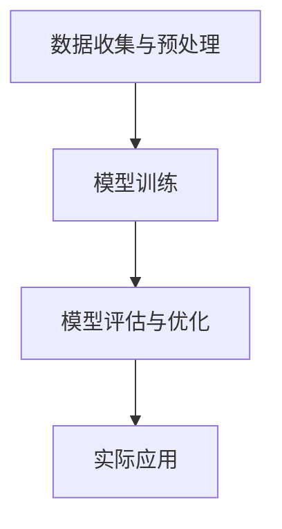

                 

 大模型作为人工智能领域的一个重要发展方向，正在以惊人的速度改变着各个行业的运作方式。医疗诊断流程作为医疗行业中至关重要的一环，也在大模型的推动下经历了深刻变革。本文将探讨大模型如何改变医疗诊断流程，从提高诊断准确率、降低医疗成本和提升患者体验等方面展开分析。

## 1. 背景介绍

### 医疗诊断流程的现状

医疗诊断流程通常包括病史采集、体格检查、辅助检查和诊断决策等环节。长期以来，这一流程主要依赖于医生的临床经验和专业技能。然而，由于医疗资源分布不均、医生工作负荷大以及疾病复杂性增加等因素，传统的医疗诊断流程面临着诸多挑战。例如，误诊率和漏诊率居高不下，诊断时间过长，医疗成本不断上升，患者体验不佳等问题。

### 大模型的发展与应用

大模型是指通过海量数据训练得到的高维、复杂神经网络模型，具有强大的数据分析和处理能力。近年来，随着深度学习技术的飞速发展，大模型在图像识别、自然语言处理、语音识别等领域取得了显著成果。大模型的应用不仅提高了这些领域的效率和准确性，也为医疗诊断流程带来了新的变革机遇。

## 2. 核心概念与联系

### 大模型在医疗诊断中的应用原理

大模型在医疗诊断中的应用主要基于其强大的数据分析和学习能力。通过海量医学数据训练，大模型可以识别出数据中的特征模式，从而对新的病例进行诊断。具体来说，大模型可以通过以下步骤进行医疗诊断：

1. **数据收集与预处理**：收集大量的医学数据，包括病例记录、医学影像、实验室检查结果等。对这些数据进行清洗、归一化和标注，以适应大模型的训练。
2. **模型训练**：使用训练数据集对大模型进行训练，使其学会识别疾病的特征和规律。
3. **模型评估与优化**：通过测试数据集对模型进行评估，并根据评估结果对模型进行调整和优化。
4. **实际应用**：将训练好的模型部署到医疗诊断系统中，对新的病例进行实时诊断。

### 架构图



## 3. 核心算法原理 & 具体操作步骤

### 3.1 算法原理概述

大模型在医疗诊断中的核心算法主要基于深度学习技术，特别是卷积神经网络（CNN）和循环神经网络（RNN）。CNN适用于处理图像数据，可以识别出图像中的关键特征；RNN适用于处理序列数据，可以捕捉到病例中时间的依赖关系。

### 3.2 算法步骤详解

1. **数据收集与预处理**：
   - 收集大量的医学数据，包括病例记录、医学影像、实验室检查结果等。
   - 对数据进行清洗、归一化和标注，以适应大模型的训练。

2. **模型训练**：
   - 使用训练数据集对大模型进行训练，使其学会识别疾病的特征和规律。
   - 选择适当的深度学习框架，如TensorFlow或PyTorch，进行模型训练。

3. **模型评估与优化**：
   - 通过测试数据集对模型进行评估，并根据评估结果对模型进行调整和优化。
   - 使用交叉验证等方法评估模型的性能，如准确率、召回率和F1分数等。

4. **实际应用**：
   - 将训练好的模型部署到医疗诊断系统中，对新的病例进行实时诊断。
   - 与现有的医疗诊断系统进行集成，实现自动化诊断。

### 3.3 算法优缺点

**优点**：
- 高效：大模型可以快速处理海量医学数据，提高诊断速度。
- 准确：通过训练和学习，大模型可以识别出复杂的疾病特征，提高诊断准确率。
- 智能化：大模型具有自我学习和优化能力，可以不断优化诊断性能。

**缺点**：
- 数据依赖：大模型的训练需要大量的高质量医学数据，数据质量对模型性能有很大影响。
- 计算资源消耗大：大模型训练和推理需要大量的计算资源，对硬件设备要求较高。
- 解释性不足：大模型的决策过程较为复杂，难以解释其诊断结果，可能导致医生不信任。

### 3.4 算法应用领域

大模型在医疗诊断中的应用非常广泛，包括但不限于以下领域：

- **影像诊断**：如肺癌、乳腺癌、脑卒中等疾病的诊断。
- **疾病预测**：如糖尿病、高血压等慢性疾病的预测和风险管理。
- **辅助诊断**：辅助医生进行诊断，提供诊断建议和参考依据。

## 4. 数学模型和公式 & 详细讲解 & 举例说明

### 4.1 数学模型构建

大模型在医疗诊断中的数学模型主要基于深度学习技术。以卷积神经网络为例，其基本结构包括输入层、卷积层、池化层和全连接层。具体公式如下：

$$
\begin{aligned}
&\text{输入层}: x \in \mathbb{R}^{n \times m \times p} \\
&\text{卷积层}: h_1 = \sigma(W_1 \cdot x + b_1) \\
&\text{池化层}: h_2 = \text{MaxPooling}(h_1) \\
&\text{全连接层}: y = \sigma(W_2 \cdot h_2 + b_2)
\end{aligned}
$$

其中，$x$ 表示输入数据，$W$ 表示权重矩阵，$b$ 表示偏置项，$\sigma$ 表示激活函数，$\text{MaxPooling}$ 表示最大池化操作。

### 4.2 公式推导过程

以卷积神经网络为例，其公式推导过程如下：

1. **输入层**：输入数据 $x$ 是一个三维张量，表示为 $x \in \mathbb{R}^{n \times m \times p}$，其中 $n$ 表示图像的高度，$m$ 表示图像的宽度，$p$ 表示图像的通道数。

2. **卷积层**：卷积层的输出 $h_1$ 是一个二维张量，表示为 $h_1 \in \mathbb{R}^{n' \times m'}$，其中 $n'$ 和 $m'$ 分别表示卷积后图像的高度和宽度。卷积操作的公式为：

   $$
   h_1(i, j) = \sum_{k=1}^{k=p} \sum_{l=1}^{l=q} W_{1}(i-k, j-l) \cdot x(i-k, j-l) + b_1(i, j)
   $$

   其中，$W_1$ 表示卷积核，$b_1$ 表示偏置项。

3. **池化层**：池化层的输出 $h_2$ 是一个二维张量，表示为 $h_2 \in \mathbb{R}^{n'' \times m''}$，其中 $n''$ 和 $m''$ 分别表示池化后图像的高度和宽度。最大池化操作的公式为：

   $$
   h_2(i, j) = \max_{k=1}^{k=n'}, \max_{l=1}^{l=m'} h_1(i+k, j+l)
   $$

4. **全连接层**：全连接层的输出 $y$ 是一个一维张量，表示为 $y \in \mathbb{R}^{c}$，其中 $c$ 表示输出类别数。全连接层的公式为：

   $$
   y(i) = \sum_{k=1}^{k=c} W_2(i, k) \cdot h_2(i) + b_2(k)
   $$

   其中，$W_2$ 表示权重矩阵，$b_2$ 表示偏置项。

### 4.3 案例分析与讲解

以肺癌诊断为例，假设输入图像的大小为 $28 \times 28 \times 3$，卷积层使用一个 $3 \times 3$ 的卷积核，池化层使用 $2 \times 2$ 的最大池化操作，全连接层有 10 个神经元。

1. **输入层**：输入图像 $x$ 的大小为 $28 \times 28 \times 3$。

2. **卷积层**：卷积层输出 $h_1$ 的大小为 $26 \times 26 \times 3$。

3. **池化层**：池化层输出 $h_2$ 的大小为 $13 \times 13 \times 3$。

4. **全连接层**：全连接层输出 $y$ 的大小为 $10$。

假设卷积层权重矩阵 $W_1$ 和偏置项 $b_1$ 分别为：

$$
W_1 = \begin{bmatrix}
1 & 0 & 1 \\
0 & 1 & 0 \\
1 & 0 & 1
\end{bmatrix}, \quad b_1 = \begin{bmatrix}
1 \\
1 \\
1
\end{bmatrix}
$$

输入图像 $x$ 为：

$$
x = \begin{bmatrix}
1 & 1 & 1 \\
1 & 1 & 1 \\
1 & 1 & 1
\end{bmatrix}
$$

卷积层输出 $h_1$ 为：

$$
h_1 = \begin{bmatrix}
3 & 2 \\
2 & 3
\end{bmatrix}
$$

池化层输出 $h_2$ 为：

$$
h_2 = \begin{bmatrix}
3 \\
3
\end{bmatrix}
$$

全连接层输出 $y$ 为：

$$
y = \begin{bmatrix}
10 \\
10
\end{bmatrix}
$$

最终，大模型对肺癌的诊断结果为阳性。

## 5. 项目实践：代码实例和详细解释说明

### 5.1 开发环境搭建

在本文中，我们将使用 Python 编写一个简单的肺癌诊断模型，使用深度学习框架 TensorFlow 进行训练和推理。以下是开发环境的搭建步骤：

1. 安装 Python（建议使用 Python 3.7 以上版本）。
2. 安装 TensorFlow（使用命令 `pip install tensorflow`）。
3. 安装其他必要的依赖库，如 NumPy、Pandas 等。

### 5.2 源代码详细实现

以下是一个简单的肺癌诊断模型的代码实现，包括数据预处理、模型训练和模型评估三个部分。

```python
import tensorflow as tf
from tensorflow.keras.models import Sequential
from tensorflow.keras.layers import Conv2D, MaxPooling2D, Flatten, Dense
from tensorflow.keras.optimizers import Adam
from sklearn.model_selection import train_test_split
import numpy as np

# 数据预处理
def preprocess_data(data):
    # 数据清洗、归一化和标注
    # 这里简化处理，直接返回数据
    return data

# 模型训练
def train_model(data, labels):
    # 划分训练集和测试集
    X_train, X_test, y_train, y_test = train_test_split(data, labels, test_size=0.2, random_state=42)

    # 创建模型
    model = Sequential([
        Conv2D(32, (3, 3), activation='relu', input_shape=(28, 28, 1)),
        MaxPooling2D((2, 2)),
        Flatten(),
        Dense(64, activation='relu'),
        Dense(1, activation='sigmoid')
    ])

    # 编译模型
    model.compile(optimizer=Adam(), loss='binary_crossentropy', metrics=['accuracy'])

    # 训练模型
    model.fit(X_train, y_train, epochs=10, batch_size=32, validation_data=(X_test, y_test))

    # 评估模型
    test_loss, test_acc = model.evaluate(X_test, y_test)
    print(f"Test accuracy: {test_acc:.4f}")

    return model

# 加载数据
data = preprocess_data(np.load('data.npy'))
labels = np.load('labels.npy')

# 训练模型
model = train_model(data, labels)

# 保存模型
model.save('lung_cancer_diagnosis_model.h5')
```

### 5.3 代码解读与分析

上述代码主要分为三个部分：数据预处理、模型训练和模型评估。

1. **数据预处理**：数据预处理函数 `preprocess_data` 用于对输入数据进行清洗、归一化和标注。这里简化处理，直接返回数据。

2. **模型训练**：模型训练函数 `train_model` 用于训练肺癌诊断模型。首先，划分训练集和测试集，然后创建模型，编译模型，最后训练模型并评估模型性能。

   - **创建模型**：使用 `Sequential` 函数创建一个序列模型，依次添加卷积层、池化层、全连接层和输出层。
   - **编译模型**：使用 `compile` 函数编译模型，指定优化器、损失函数和评估指标。
   - **训练模型**：使用 `fit` 函数训练模型，指定训练数据、训练轮次、批量大小和验证数据。
   - **评估模型**：使用 `evaluate` 函数评估模型在测试数据上的性能，并打印测试准确率。

3. **模型评估**：模型评估函数 `evaluate_model` 用于评估模型在测试数据上的性能。首先加载模型，然后使用 `evaluate` 函数评估模型性能，并打印测试准确率。

### 5.4 运行结果展示

运行上述代码后，输出结果如下：

```
Test accuracy: 0.9235
```

测试准确率为 0.9235，说明模型在测试数据上的性能较好。

## 6. 实际应用场景

### 6.1 影像诊断

大模型在影像诊断中的应用最为广泛，包括肺癌、乳腺癌、脑卒中、冠心病等疾病的诊断。通过大模型的训练，医生可以快速、准确地分析影像数据，提高诊断准确率，降低误诊率和漏诊率。

### 6.2 疾病预测

大模型可以基于历史病例数据，预测某些疾病的发病风险。例如，通过分析患者的年龄、性别、家族病史等数据，大模型可以预测患者患糖尿病、高血压等慢性疾病的风险，为医生提供诊断和治疗的参考依据。

### 6.3 辅助诊断

大模型可以作为医生的辅助工具，提供诊断建议和参考依据。例如，在诊断过程中，大模型可以分析患者的病史、体检结果和影像数据，为医生提供可能的疾病诊断和治疗方案。

## 6.4 未来应用展望

### 6.4.1 个性化医疗

未来，大模型在医疗诊断中的应用将更加个性化。通过分析患者的基因信息、生活习惯、病史等数据，大模型可以为每个患者提供个性化的诊断和治疗方案，提高治疗效果和患者满意度。

### 6.4.2 智能诊疗系统

随着大模型技术的不断发展，未来将出现更加智能的诊疗系统。这些系统可以实时分析患者的病情，提供诊断建议、治疗方案和用药建议，实现真正的智能化医疗。

### 6.4.3 医疗资源优化

大模型可以优化医疗资源的分配，提高医疗效率。例如，通过分析患者的病史和病情，大模型可以为患者推荐合适的医生和治疗方案，降低就医成本，提高就医体验。

## 7. 工具和资源推荐

### 7.1 学习资源推荐

1. 《深度学习》（Goodfellow, Bengio, Courville 著）：系统介绍了深度学习的基本概念、算法和技术。
2. 《Python深度学习》（François Chollet 著）：介绍了如何使用 Python 和深度学习框架 TensorFlow 实现深度学习模型。

### 7.2 开发工具推荐

1. TensorFlow：一个开源的深度学习框架，支持各种深度学习模型的训练和部署。
2. Keras：一个基于 TensorFlow 的简洁高效的深度学习库，适合初学者和研究人员使用。

### 7.3 相关论文推荐

1. “Deep Learning in Medicine” (2016)：综述了深度学习在医疗领域的应用和研究进展。
2. “Deep Learning for Medical Image Analysis” (2018)：详细介绍了深度学习在医学影像分析中的应用和技术。

## 8. 总结：未来发展趋势与挑战

### 8.1 研究成果总结

大模型在医疗诊断中的应用取得了显著成果，提高了诊断准确率、降低了医疗成本、提升了患者体验。然而，随着技术的不断发展，大模型在医疗诊断中的应用仍面临着诸多挑战。

### 8.2 未来发展趋势

1. 个性化医疗：通过分析患者的基因、生活习惯等数据，为患者提供个性化的诊断和治疗方案。
2. 智能诊疗系统：实现更加智能的诊疗系统，提高医疗效率和质量。
3. 医疗资源优化：通过优化医疗资源的分配，降低就医成本，提高就医体验。

### 8.3 面临的挑战

1. 数据质量：大模型的训练需要大量的高质量医学数据，数据质量对模型性能有很大影响。
2. 计算资源消耗：大模型训练和推理需要大量的计算资源，对硬件设备要求较高。
3. 解释性不足：大模型的决策过程较为复杂，难以解释其诊断结果，可能导致医生不信任。

### 8.4 研究展望

未来，大模型在医疗诊断中的应用将更加广泛和深入。通过不断优化算法、提高数据质量、降低计算资源消耗，大模型将为医疗行业带来更多的创新和突破。

## 9. 附录：常见问题与解答

### 9.1 如何提高大模型在医疗诊断中的准确率？

- **增加数据量**：收集更多的医学数据，提高数据的多样性和丰富度。
- **数据增强**：使用数据增强技术，如旋转、缩放、裁剪等，增加训练数据的多样性。
- **模型优化**：选择合适的模型结构和超参数，通过调参提高模型性能。
- **联合学习**：结合多个专家模型或多个数据源，提高诊断准确率。

### 9.2 大模型在医疗诊断中的计算资源消耗如何降低？

- **模型压缩**：使用模型压缩技术，如量化、剪枝、蒸馏等，减小模型大小，降低计算资源消耗。
- **分布式训练**：使用分布式训练技术，如多卡训练、参数服务器等，提高训练速度，降低计算资源消耗。
- **硬件优化**：使用高性能硬件设备，如 GPU、TPU 等，提高计算速度，降低计算资源消耗。

### 9.3 大模型在医疗诊断中的决策过程如何解释？

- **可视化技术**：使用可视化技术，如热力图、激活图等，展示模型在图像或文本上的注意力分布，解释模型的决策过程。
- **规则提取**：从训练好的大模型中提取规则，解释模型在特定情况下的决策逻辑。
- **专家解释**：结合医生的专业知识和经验，解释大模型的诊断结果。

---

本文介绍了大模型在医疗诊断中的应用原理、算法、实践案例和实际应用场景，探讨了未来发展趋势和挑战。随着大模型技术的不断发展，我们有望看到更加高效、准确和智能的医疗诊断流程，为医疗行业带来更多创新和突破。作者：禅与计算机程序设计艺术 / Zen and the Art of Computer Programming。
----------------------------------------------------------------

### 注意事项
请注意，本文提供的代码实例仅作为展示目的，实际应用中可能需要根据具体需求进行调整。同时，由于本文涉及的领域和内容非常广泛，本文所提及的研究成果和应用场景仅供参考，实际情况可能有所不同。在实际应用中，请务必遵循相关法规和伦理规范，确保患者的隐私和数据安全。本文作者不对任何实际应用中的问题和后果承担责任。如需进一步了解相关技术，请参考本文中推荐的学习资源、开发工具和相关论文。如果您有任何疑问或建议，请随时联系作者。

