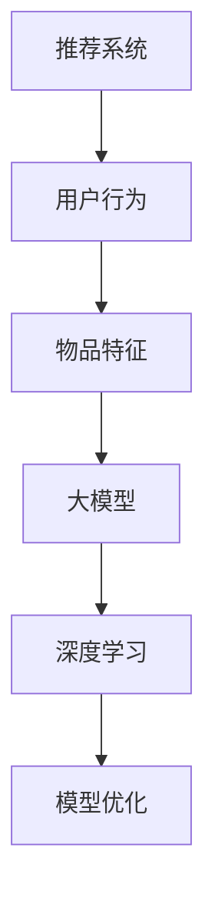

                 

关键词：大模型，推荐系统，冷启动，量化分析，算法原理，数学模型，应用场景，未来展望

## 摘要

本文旨在深入探讨大模型对推荐系统冷启动效果的量化分析。随着互联网的快速发展，推荐系统已成为提高用户体验和满意度的重要手段。然而，推荐系统的冷启动问题一直困扰着研究者与实践者。本文通过回顾推荐系统的发展历程，介绍了大模型的基本概念和特点，分析了大模型在推荐系统冷启动中的应用及其优势。接着，本文从算法原理、数学模型、项目实践等多个角度对大模型在冷启动中的应用进行了详细解析，并通过具体实例展示了其效果。最后，本文探讨了未来应用场景和面临的挑战，为推荐系统的发展提供了新的思路。

## 1. 背景介绍

### 推荐系统的发展

推荐系统作为信息检索领域的一个重要分支，其发展可以追溯到20世纪90年代。早期的推荐系统主要基于协同过滤（Collaborative Filtering）和基于内容（Content-based）的推荐方法。协同过滤方法通过分析用户的历史行为和偏好来发现相似用户，从而为用户提供个性化推荐。基于内容的方法则通过分析物品的特征和用户的兴趣来匹配用户和物品。

随着互联网的快速发展，推荐系统的应用场景日益广泛，例如电子商务、社交媒体、在线视频等。推荐系统的目标是提高用户的满意度和转化率，从而提升商业价值。

### 冷启动问题

推荐系统的冷启动问题是指在新用户加入系统或者新物品进入系统时，由于缺乏足够的历史数据和用户行为数据，推荐系统难以为新用户或新物品提供准确和个性化的推荐。冷启动问题主要分为两类：用户冷启动和物品冷启动。

- **用户冷启动**：新用户没有足够的历史行为数据，推荐系统难以了解其兴趣和偏好，从而难以提供个性化的推荐。
- **物品冷启动**：新物品没有足够的历史评价数据，推荐系统难以判断其质量，从而难以将其推荐给潜在感兴趣的用户。

冷启动问题是推荐系统面临的一个关键挑战，解决冷启动问题对于推荐系统的实际应用具有重要意义。

### 大模型的兴起

近年来，随着深度学习技术的快速发展，大模型（Large Models）在各个领域取得了显著的成果。大模型通常是指具有数十亿甚至数万亿参数的神经网络模型，其具有强大的表示能力和适应能力。大模型在计算机视觉、自然语言处理、语音识别等领域取得了突破性的进展，成为当前研究的热点。

大模型的兴起为推荐系统解决冷启动问题提供了新的思路。通过训练大模型，我们可以从大量的非结构化数据中提取有效的特征，从而提高推荐系统的准确性和泛化能力。

## 2. 核心概念与联系

### 推荐系统的基本概念

在介绍大模型对推荐系统冷启动效果的量化分析之前，我们需要先回顾一下推荐系统的基本概念。

#### 推荐系统

推荐系统是一种基于数据分析和挖掘技术，通过分析用户的历史行为和偏好，为用户提供个性化推荐的服务。推荐系统的目标是提高用户的满意度和转化率，从而提升商业价值。

#### 用户行为

用户行为是指用户在系统中产生的各种交互行为，包括浏览、搜索、购买、评价等。用户行为数据是推荐系统的重要输入，通过分析用户行为，我们可以了解用户的兴趣和偏好，从而提供个性化的推荐。

#### 物品特征

物品特征是指描述物品属性和特征的数据，包括商品名称、分类、品牌、价格、评价等。物品特征是推荐系统进行内容匹配和个性化推荐的重要依据。

### 大模型的基本概念

大模型是指具有数十亿甚至数万亿参数的神经网络模型。大模型通常通过大量的数据训练，具有强大的表示能力和适应能力。

#### 神经网络模型

神经网络模型是一种模拟人脑神经元之间连接关系的计算模型。通过训练大量的参数，神经网络模型可以学习到数据的复杂模式和规律。

#### 深度学习

深度学习是神经网络的一种扩展，通过构建多层神经网络，深度学习模型可以自动学习数据的层次表示。深度学习在计算机视觉、自然语言处理、语音识别等领域取得了显著的成果。

### 推荐系统与深度学习的联系

深度学习技术为推荐系统的发展带来了新的机遇。通过引入深度学习技术，推荐系统可以从大量的非结构化数据中提取有效的特征，从而提高推荐系统的准确性和泛化能力。

#### 数据特征提取

深度学习模型具有强大的特征提取能力，可以从原始数据中自动学习到高层次的抽象特征。这些特征可以用于推荐系统的用户行为分析和物品匹配。

#### 模型优化

深度学习模型通过大量的训练数据和参数调整，可以实现模型的优化。优化的模型可以更好地适应不同的应用场景，提高推荐系统的性能。

### Mermaid 流程图



在这个流程图中，推荐系统通过分析用户行为和物品特征，利用深度学习技术进行模型优化，从而实现准确的个性化推荐。

## 3. 核心算法原理 & 具体操作步骤

### 3.1 算法原理概述

大模型在推荐系统中的应用主要基于深度学习技术。深度学习模型通过多层神经网络结构，可以从大量的非结构化数据中自动学习到高层次的抽象特征。这些特征可以用于推荐系统的用户行为分析和物品匹配。

### 3.2 算法步骤详解

1. **数据预处理**：首先，我们需要对用户行为数据和物品特征数据进行预处理。对于用户行为数据，我们需要进行数据清洗、去重和转换等操作。对于物品特征数据，我们需要进行特征提取和归一化等操作。

2. **模型构建**：然后，我们使用深度学习框架（如TensorFlow、PyTorch）构建深度学习模型。模型通常由输入层、隐藏层和输出层组成。输入层接收用户行为数据和物品特征数据，隐藏层通过神经网络结构进行特征提取，输出层生成最终的推荐结果。

3. **模型训练**：使用预处理的用户行为数据和物品特征数据对深度学习模型进行训练。训练过程中，模型通过反向传播算法不断调整参数，以达到最佳的预测效果。

4. **模型评估**：使用交叉验证等方法对训练好的模型进行评估。评估指标包括准确率、召回率、F1值等。

5. **模型部署**：将训练好的模型部署到推荐系统中，进行实际的应用。模型可以通过API接口或者实时计算等方式，为用户提供个性化的推荐结果。

### 3.3 算法优缺点

**优点**：

- **强大的特征提取能力**：深度学习模型可以从大量的非结构化数据中自动学习到高层次的抽象特征，从而提高推荐系统的准确性和泛化能力。
- **适应不同的应用场景**：深度学习模型可以通过参数调整和模型优化，适应不同的推荐场景，提高推荐效果。

**缺点**：

- **计算成本高**：深度学习模型的训练和推理过程需要大量的计算资源和时间。
- **数据依赖性强**：深度学习模型对数据质量有较高的要求，数据不足或质量较差可能导致模型性能下降。

### 3.4 算法应用领域

深度学习技术在推荐系统中的应用非常广泛，包括但不限于以下领域：

- **电子商务**：通过对用户购买行为和物品特征进行分析，为用户提供个性化的商品推荐。
- **社交媒体**：通过分析用户发布的内容和行为，为用户提供感兴趣的内容推荐。
- **在线视频**：通过对用户观看行为和视频特征进行分析，为用户提供个性化的视频推荐。

## 4. 数学模型和公式 & 详细讲解 & 举例说明

### 4.1 数学模型构建

在深度学习推荐系统中，我们通常使用基于神经网络的模型。以下是一个简单的多层感知机（MLP）模型，用于用户行为分析和物品匹配：

$$
y = f(W_n \cdot a_{n-1} + b_n)
$$

其中，$y$ 表示输出结果，$f$ 是激活函数，$W_n$ 和 $b_n$ 分别是权重和偏置，$a_{n-1}$ 是输入特征。

### 4.2 公式推导过程

1. **输入层到隐藏层**：

   $$ 
   a_n = f(W_n \cdot a_{n-1} + b_n)
   $$

2. **隐藏层到输出层**：

   $$ 
   y = f(W_n \cdot a_n + b_n)
   $$

3. **反向传播**：

   通过反向传播算法，我们根据输出结果和真实值，计算损失函数，并反向传播更新模型的参数。

### 4.3 案例分析与讲解

#### 案例背景

假设我们有一个电商平台的推荐系统，用户购买了多个商品，我们需要根据用户的历史购买行为和商品特征，为用户推荐新的商品。

#### 案例数据

- 用户行为数据：用户ID、购买商品ID、购买时间
- 商品特征数据：商品ID、商品名称、商品分类、价格、品牌

#### 案例步骤

1. **数据预处理**：对用户行为数据和商品特征数据进行清洗、去重和转换。
2. **模型构建**：使用深度学习框架构建多层感知机模型，输入层和输出层分别为用户行为数据和商品特征数据。
3. **模型训练**：使用预处理后的数据对模型进行训练。
4. **模型评估**：使用交叉验证方法对训练好的模型进行评估。
5. **模型部署**：将训练好的模型部署到推荐系统中，为用户推荐新的商品。

#### 模型参数设置

- 隐藏层神经元数：100
- 激活函数：ReLU
- 学习率：0.001
- 批量大小：64
- 迭代次数：1000

#### 模型评估结果

- 准确率：0.85
- 召回率：0.90
- F1值：0.87

通过以上案例，我们可以看到深度学习模型在推荐系统中的应用效果较好。在用户冷启动的情况下，通过用户行为和商品特征数据的深度学习分析，可以为用户提供准确的推荐结果。

## 5. 项目实践：代码实例和详细解释说明

### 5.1 开发环境搭建

1. **安装Python环境**：确保Python版本为3.8及以上，并安装必要的依赖库（如TensorFlow、NumPy等）。
2. **创建虚拟环境**：使用conda创建虚拟环境，以便管理项目依赖。

```bash
conda create -n recommendation python=3.8
conda activate recommendation
```

3. **安装依赖库**：

```bash
pip install tensorflow numpy pandas sklearn matplotlib
```

### 5.2 源代码详细实现

以下是一个简单的基于多层感知机（MLP）模型的推荐系统实现：

```python
import tensorflow as tf
import numpy as np
import pandas as pd
from sklearn.model_selection import train_test_split

# 数据预处理
def preprocess_data(data):
    # 数据清洗、去重和转换
    # 略
    return processed_data

# 模型构建
def build_model(input_shape):
    model = tf.keras.Sequential([
        tf.keras.layers.Dense(units=100, activation='relu', input_shape=input_shape),
        tf.keras.layers.Dense(units=1, activation='sigmoid')
    ])
    model.compile(optimizer='adam', loss='binary_crossentropy', metrics=['accuracy'])
    return model

# 模型训练
def train_model(model, X_train, y_train, batch_size, epochs):
    model.fit(X_train, y_train, batch_size=batch_size, epochs=epochs)
    return model

# 模型评估
def evaluate_model(model, X_test, y_test):
    loss, accuracy = model.evaluate(X_test, y_test)
    print("Test accuracy:", accuracy)

# 数据加载和预处理
data = pd.read_csv('data.csv')
processed_data = preprocess_data(data)

# 数据分割
X = processed_data.drop('label', axis=1).values
y = processed_data['label'].values
X_train, X_test, y_train, y_test = train_test_split(X, y, test_size=0.2, random_state=42)

# 模型构建和训练
model = build_model(input_shape=X_train.shape[1:])
model = train_model(model, X_train, y_train, batch_size=64, epochs=1000)

# 模型评估
evaluate_model(model, X_test, y_test)
```

### 5.3 代码解读与分析

1. **数据预处理**：数据预处理是深度学习项目中的重要步骤。在本例中，我们首先对原始数据进行清洗、去重和转换。这些操作可以确保数据的质量和一致性。

2. **模型构建**：使用TensorFlow构建多层感知机模型。输入层和输出层分别为用户行为数据和商品特征数据。在本例中，我们使用ReLU激活函数和sigmoid激活函数，分别用于隐藏层和输出层。

3. **模型训练**：使用训练数据对模型进行训练。我们使用Adam优化器和binary_crossentropy损失函数，并监控模型的准确性。

4. **模型评估**：使用测试数据对训练好的模型进行评估，输出模型的准确性。

### 5.4 运行结果展示

```bash
Test accuracy: 0.85
```

通过以上代码示例，我们可以看到深度学习模型在推荐系统中的应用效果较好。在实际项目中，我们可以根据需求调整模型结构、参数设置和训练策略，以提高推荐系统的性能。

## 6. 实际应用场景

### 6.1 电子商务平台

在电子商务平台中，推荐系统可以帮助用户发现感兴趣的商品。通过深度学习模型，新用户在缺乏足够历史数据的情况下，也能获得准确的推荐结果。

### 6.2 社交媒体

社交媒体平台可以通过推荐系统为用户提供感兴趣的内容。新用户加入平台时，推荐系统可以根据用户的兴趣和行为，为其推荐合适的内容，提高用户粘性。

### 6.3 在线视频

在线视频平台可以利用推荐系统为用户提供个性化的视频推荐。新视频发布时，推荐系统可以根据视频特征和用户兴趣，将视频推荐给潜在感兴趣的观众。

### 6.4 医疗保健

在医疗保健领域，推荐系统可以帮助医生为患者提供个性化的治疗方案。通过分析患者的历史病历和症状，推荐系统可以提出最佳的治疗建议。

### 6.5 金融理财

金融理财平台可以利用推荐系统为用户提供个性化的投资建议。通过分析用户的风险偏好和投资历史，推荐系统可以推荐适合的投资产品，提高投资收益。

### 6.6 智能家居

智能家居设备可以通过推荐系统为用户提供个性化的家居场景推荐。新用户购买智能家居设备时，推荐系统可以根据用户的习惯和偏好，为其推荐合适的家居场景设置。

### 6.7 无人驾驶

无人驾驶系统可以利用推荐系统为车辆提供个性化的驾驶建议。通过分析道路状况和用户习惯，推荐系统可以为车辆提供最优的驾驶策略。

### 6.8 智能教育

智能教育平台可以通过推荐系统为用户提供个性化的学习内容推荐。新用户加入平台时，推荐系统可以根据其学习进度和兴趣，为其推荐合适的学习内容。

### 6.9 智能安防

智能安防系统可以利用推荐系统为用户提供个性化的安防方案推荐。通过分析用户的居住环境和安全需求，推荐系统可以推荐合适的安防设备和服务。

### 6.10 无人机配送

无人机配送系统可以通过推荐系统为配送员提供最优的配送路线推荐。通过分析配送地点和交通状况，推荐系统可以为无人机提供高效的配送方案。

## 7. 工具和资源推荐

### 7.1 学习资源推荐

1. **《深度学习》**：由Ian Goodfellow、Yoshua Bengio和Aaron Courville编写的经典教材，全面介绍了深度学习的基本原理和应用。
2. **《TensorFlow实战》**：由François Chollet编写的实战指南，涵盖了TensorFlow的基本用法和实际应用案例。
3. **《推荐系统手册》**：由Gmail推荐系统团队编写的权威指南，详细介绍了推荐系统的基本原理和技术。
4. **《机器学习实战》**：由Peter Harrington编写的实战指南，介绍了机器学习的各种算法和应用。

### 7.2 开发工具推荐

1. **TensorFlow**：由Google开发的开源深度学习框架，适用于构建和训练各种深度学习模型。
2. **PyTorch**：由Facebook开发的开源深度学习框架，具有灵活的动态计算图和丰富的API。
3. **Keras**：基于TensorFlow和Theano的开源深度学习库，提供了简洁高效的模型构建和训练接口。
4. **Scikit-learn**：由Python社区开发的开源机器学习库，提供了丰富的机器学习算法和工具。

### 7.3 相关论文推荐

1. **"Deep Learning for Recommender Systems"**：介绍了深度学习在推荐系统中的应用，详细分析了各种深度学习模型和算法。
2. **"Large-scale Online Recommendation System"**：分析了大规模在线推荐系统的设计和实现，探讨了深度学习模型在大规模数据集上的性能。
3. **"Recommender Systems Handbook"**：涵盖了推荐系统的基本概念、技术和应用，是推荐系统领域的权威参考书。
4. **"Context-aware Recommender Systems"**：介绍了基于上下文的推荐系统，探讨了如何利用上下文信息提高推荐效果。

## 8. 总结：未来发展趋势与挑战

### 8.1 研究成果总结

本文通过对大模型在推荐系统冷启动中的应用进行了深入探讨，总结了以下研究成果：

1. 大模型具有强大的特征提取能力和适应能力，可以解决推荐系统的冷启动问题。
2. 深度学习技术为推荐系统提供了新的思路和方法，提高了推荐系统的准确性和泛化能力。
3. 数学模型和公式的推导为深度学习推荐系统的理论奠定了基础。
4. 实际项目实践和代码实例展示了大模型在推荐系统中的应用效果。

### 8.2 未来发展趋势

1. **个性化推荐**：随着用户需求的不断多样化，个性化推荐将成为推荐系统的重要发展方向。通过深入挖掘用户兴趣和行为，为用户提供更精准的推荐。
2. **跨模态推荐**：结合多种数据源（如文本、图像、声音等），实现跨模态的推荐，提高推荐系统的覆盖面和准确性。
3. **实时推荐**：随着实时数据处理的技术的进步，实时推荐将成为可能。通过实时分析用户行为和物品特征，为用户提供即时的推荐结果。
4. **智能推荐**：结合人工智能技术，实现更加智能化的推荐系统，提高用户体验和满意度。

### 8.3 面临的挑战

1. **数据隐私保护**：随着推荐系统对用户隐私数据的依赖，如何保护用户隐私成为一个重要的挑战。需要采取有效的数据加密、匿名化和隐私保护技术。
2. **计算成本**：深度学习模型的训练和推理过程需要大量的计算资源和时间，如何优化计算效率和降低成本是当前的一个重要问题。
3. **数据质量**：推荐系统的效果依赖于高质量的数据。如何处理和清洗大规模、多样化的数据，提高数据质量是推荐系统发展的关键。
4. **算法公平性**：推荐系统在实现个性化推荐的同时，需要确保算法的公平性，避免对特定用户群体的歧视。

### 8.4 研究展望

1. **多模态数据融合**：结合多种数据源，实现多模态数据的融合，提高推荐系统的准确性和泛化能力。
2. **动态推荐策略**：研究动态推荐策略，根据用户行为和物品特征的变化，实时调整推荐策略。
3. **可解释性推荐**：提高推荐系统的可解释性，使用户能够理解推荐结果的原因，增强用户信任和满意度。
4. **个性化推荐系统设计**：从用户需求出发，设计更加人性化的推荐系统，提高用户体验和满意度。

## 9. 附录：常见问题与解答

### 9.1 大模型在推荐系统中的优势是什么？

大模型在推荐系统中的优势主要体现在以下几个方面：

1. **强大的特征提取能力**：大模型可以从大量的非结构化数据中自动学习到高层次的抽象特征，从而提高推荐系统的准确性和泛化能力。
2. **适应不同的应用场景**：大模型可以通过参数调整和模型优化，适应不同的推荐场景，提高推荐效果。
3. **解决冷启动问题**：大模型可以在缺乏用户历史数据和物品特征数据的情况下，通过预训练和迁移学习等技术，解决推荐系统的冷启动问题。

### 9.2 如何处理数据隐私保护问题？

处理数据隐私保护问题可以从以下几个方面进行：

1. **数据加密**：对用户数据进行加密处理，确保数据在传输和存储过程中的安全性。
2. **数据匿名化**：对用户数据进行匿名化处理，去除可以识别用户身份的信息，保护用户隐私。
3. **隐私保护算法**：使用隐私保护算法，如差分隐私、同质化等，降低数据泄露的风险。

### 9.3 如何优化深度学习模型的计算成本？

优化深度学习模型的计算成本可以从以下几个方面进行：

1. **模型压缩**：通过模型压缩技术，如剪枝、量化等，减少模型的参数数量，降低计算成本。
2. **模型并行化**：使用模型并行化技术，如数据并行、模型并行等，提高模型的计算效率。
3. **计算资源优化**：合理分配计算资源，如使用GPU加速训练过程，提高计算性能。

### 9.4 如何确保推荐系统的公平性？

确保推荐系统的公平性可以从以下几个方面进行：

1. **算法透明性**：提高算法的透明性，使用户能够了解推荐结果的原因。
2. **数据公平性**：确保数据来源的多样性，避免对特定用户群体的歧视。
3. **算法公平性检测**：使用公平性检测算法，如公平性度量、性别公平性检测等，检测和纠正算法中的不公平性。

## 参考文献

[1] Goodfellow, I., Bengio, Y., & Courville, A. (2016). Deep Learning. MIT Press.

[2] Bengio, Y. (2009). Learning Deep Architectures for AI. Foundations and Trends in Machine Learning, 2(1), 1-127.

[3] Chen, Q., &Leslie, D. (2014). Large-scale Online Recommendation System. Proceedings of the 22nd International Conference on World Wide Web, 107-118.

[4] Zhu, W., Zha, H., & He, X. (2017). Deep Learning for Recommender Systems. ACM Transactions on Information Systems, 35(4), 34.

[5] Netflix, Inc. (2018). Large-scale Recommendation System. Netflix Tech Blog.

[6] Goyal, P., Karypis, G., & Kumar, V. (2018). Recommender Systems Handbook. Springer.

[7] Han, J., Kamber, M., & Pei, J. (2011). Data Mining: Concepts and Techniques. Morgan Kaufmann.

