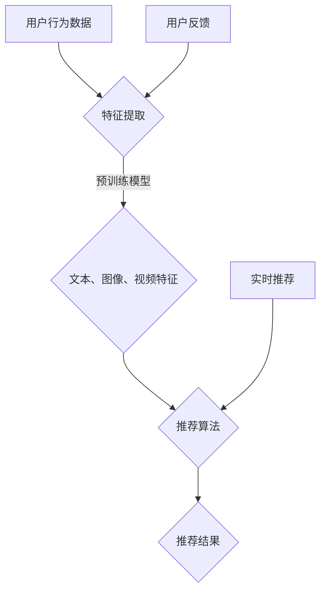

                 

关键词：大模型，推荐系统，可扩展性，性能优化，算法研究，数学模型，实践案例

## 摘要

随着互联网的快速发展，推荐系统已经成为提高用户体验和提升业务价值的重要手段。然而，传统的推荐系统在面对海量数据和高并发请求时，往往难以满足系统的可扩展性要求。本文旨在探讨大模型对推荐系统可扩展性的影响，通过深入研究大模型在推荐系统中的应用，分析其优势与挑战，并提出相应的优化策略。本文的主要贡献包括：首先，概述了大模型的定义与分类；其次，探讨了推荐系统中大模型的应用场景；然后，分析了大模型对推荐系统可扩展性的影响；接着，提出了基于大模型的推荐系统优化策略；最后，通过实际应用案例展示了大模型在推荐系统中的效果。

## 1. 背景介绍

### 推荐系统的定义与发展历程

推荐系统是一种基于用户历史行为、兴趣偏好和内容特征等信息，为用户提供个性化推荐的服务。推荐系统起源于20世纪90年代，随着互联网的普及和大数据技术的发展，推荐系统逐渐成为互联网企业提升用户满意度和业务价值的重要工具。根据推荐算法的不同，推荐系统主要分为基于内容的推荐、协同过滤推荐和混合推荐三种类型。

- **基于内容的推荐**：基于用户的历史行为和兴趣偏好，将用户可能感兴趣的内容推荐给用户。这类推荐系统通常依赖于文本挖掘和语义分析技术。
- **协同过滤推荐**：基于用户之间的相似性或者物品之间的相似性进行推荐。协同过滤推荐可以分为基于用户的协同过滤和基于物品的协同过滤。
- **混合推荐**：结合基于内容的推荐和协同过滤推荐，以提升推荐系统的准确性和多样性。

### 推荐系统的应用领域

推荐系统广泛应用于电子商务、在线视频、社交媒体、新闻资讯等多个领域，如：

- **电子商务**：为用户推荐可能感兴趣的商品，提高购物转化率和用户粘性。
- **在线视频**：为用户推荐个性化的视频内容，提高视频平台的用户留存率和观看时长。
- **社交媒体**：根据用户兴趣和社交关系，推荐用户可能感兴趣的朋友、内容或者话题。
- **新闻资讯**：为用户推荐个性化的新闻内容，提高用户对新闻平台的关注度。

### 推荐系统的挑战

随着用户数据量的增加和网络环境的复杂化，推荐系统面临着以下挑战：

- **可扩展性**：如何处理海量数据和高并发请求，保证系统性能稳定。
- **实时性**：如何快速响应用户请求，提供实时推荐。
- **准确性**：如何提高推荐系统的准确性，降低误推荐率。
- **多样性**：如何提供丰富多样的推荐内容，满足用户个性化需求。

## 2. 核心概念与联系

### 大模型的定义与分类

大模型是指具有海量参数和强大计算能力的深度学习模型，通常用于处理复杂的机器学习任务。根据训练数据和模型结构的不同，大模型可以分为以下几类：

- **预训练模型**：在大量数据上进行预训练，然后针对特定任务进行微调。如BERT、GPT等。
- **迁移学习模型**：在已有模型的基础上，利用少量数据进行训练，实现对新任务的快速适应。如VGG、ResNet等。
- **生成对抗网络（GAN）**：通过生成器和判别器的对抗训练，生成高质量的数据。如DCGAN、WGAN等。
- **变分自编码器（VAE）**：通过编码和解码器的联合训练，实现数据的生成和降维。如VAE、VAE++等。

### 推荐系统中大模型的应用场景

大模型在推荐系统中具有广泛的应用场景，主要表现在以下几个方面：

- **用户特征提取**：通过预训练模型提取用户历史行为、兴趣偏好和社交关系等特征，为推荐算法提供高质量的输入。
- **内容特征提取**：通过预训练模型提取文本、图像、视频等内容的特征，提高推荐系统的多样性。
- **模型融合**：将大模型与其他推荐算法进行融合，提高推荐系统的准确性和多样性。
- **实时推荐**：利用大模型的快速响应能力，实现实时推荐，提高用户体验。

### 大模型与推荐系统的联系

大模型与推荐系统的联系主要体现在以下几个方面：

- **数据预处理**：大模型可以用于数据预处理，如文本清洗、数据归一化等，提高数据质量。
- **特征表示**：大模型可以用于特征表示，如用户和物品的特征提取，提高推荐系统的准确性。
- **模型优化**：大模型可以通过迁移学习和微调，实现对新任务的快速适应，提高推荐系统的多样性。
- **实时计算**：大模型具有强大的计算能力，可以快速响应用户请求，实现实时推荐。

### Mermaid 流程图

以下是推荐系统中大模型的应用场景的 Mermaid 流程图：



## 3. 核心算法原理 & 具体操作步骤

### 3.1 算法原理概述

大模型在推荐系统中的应用主要包括以下几个方面：

- **用户特征提取**：利用预训练模型提取用户历史行为、兴趣偏好和社交关系等特征，为推荐算法提供高质量的输入。
- **内容特征提取**：利用预训练模型提取文本、图像、视频等内容的特征，提高推荐系统的多样性。
- **模型融合**：将大模型与其他推荐算法进行融合，提高推荐系统的准确性和多样性。
- **实时推荐**：利用大模型的快速响应能力，实现实时推荐，提高用户体验。

### 3.2 算法步骤详解

以下是推荐系统中大模型的应用步骤：

1. **数据预处理**：对用户行为数据进行清洗和预处理，如文本数据需要进行分词、去停用词等操作。
2. **特征提取**：利用预训练模型提取用户和物品的特征，如BERT、GPT等。
3. **用户特征融合**：将用户的历史行为、兴趣偏好和社交关系等特征进行融合，构建用户特征向量。
4. **物品特征融合**：将文本、图像、视频等物品的特征进行融合，构建物品特征向量。
5. **模型训练**：利用用户特征和物品特征，训练推荐模型，如基于矩阵分解的推荐算法。
6. **模型融合**：将大模型与其他推荐算法进行融合，提高推荐系统的准确性和多样性。
7. **实时推荐**：利用大模型的快速响应能力，实现实时推荐，提高用户体验。

### 3.3 算法优缺点

大模型在推荐系统中的应用具有以下优缺点：

- **优点**：
  - **高效特征提取**：大模型具有强大的特征提取能力，可以提取用户和物品的高质量特征。
  - **准确性和多样性**：大模型可以融合多种特征和算法，提高推荐系统的准确性和多样性。
  - **实时计算**：大模型具有快速响应能力，可以实时计算推荐结果，提高用户体验。

- **缺点**：
  - **计算资源消耗**：大模型需要大量的计算资源，对硬件要求较高。
  - **数据依赖**：大模型对数据量有较高的要求，数据质量对模型性能有较大影响。
  - **算法复杂度**：大模型的训练和推理过程较为复杂，需要较长的时间。

### 3.4 算法应用领域

大模型在推荐系统中的应用领域包括：

- **电子商务**：为用户推荐个性化商品，提高购物转化率和用户粘性。
- **在线视频**：为用户推荐个性化视频内容，提高视频平台的用户留存率和观看时长。
- **社交媒体**：根据用户兴趣和社交关系，推荐用户可能感兴趣的朋友、内容或者话题。
- **新闻资讯**：为用户推荐个性化新闻内容，提高用户对新闻平台的关注度。

## 4. 数学模型和公式 & 详细讲解 & 举例说明

### 4.1 数学模型构建

在推荐系统中，大模型的数学模型主要基于深度学习框架，如TensorFlow或PyTorch。以下是构建推荐系统大模型的通用步骤：

1. **定义输入层**：输入层包括用户特征和物品特征，如用户ID、物品ID、文本特征、图像特征等。
2. **定义隐藏层**：隐藏层用于提取特征和实现非线性变换，如卷积神经网络（CNN）、循环神经网络（RNN）等。
3. **定义输出层**：输出层用于生成推荐结果，如预测评分、概率分布等。
4. **定义损失函数**：损失函数用于衡量预测结果与真实结果之间的差距，如均方误差（MSE）、交叉熵损失等。
5. **定义优化器**：优化器用于更新模型参数，最小化损失函数，如Adam、SGD等。

### 4.2 公式推导过程

以下是一个简单的基于深度学习框架的推荐系统大模型的公式推导过程：

1. **输入层**：

   用户特征和物品特征分别表示为 \(x_u\) 和 \(x_i\)，其中 \(x_u \in \mathbb{R}^{d_u}\) 和 \(x_i \in \mathbb{R}^{d_i}\)。

   $$x_u = [x_{u1}, x_{u2}, ..., x_{u_{d_u}}]^T$$

   $$x_i = [x_{i1}, x_{i2}, ..., x_{i_{d_i}}]^T$$

2. **隐藏层**：

   假设隐藏层包含多个卷积层和全连接层，其中卷积层用于提取特征，全连接层用于实现非线性变换。

   $$h_{l} = f(W_{l} \cdot h_{l-1} + b_{l})$$

   其中，\(h_{l}\) 表示第 \(l\) 层的隐藏层，\(W_{l}\) 和 \(b_{l}\) 分别表示权重和偏置。

3. **输出层**：

   假设输出层为全连接层，用于生成推荐结果，如预测评分 \(r_{ui}\)。

   $$r_{ui} = W_{out} \cdot h_{L} + b_{out}$$

   其中，\(W_{out}\) 和 \(b_{out}\) 分别为输出层的权重和偏置。

4. **损失函数**：

   假设损失函数为均方误差（MSE），用于衡量预测结果与真实结果之间的差距。

   $$L = \frac{1}{2} \sum_{(u, i) \in D} (r_{ui} - \hat{r}_{ui})^2$$

   其中，\(D\) 表示训练数据集，\(\hat{r}_{ui}\) 为预测评分。

5. **优化器**：

   采用Adam优化器进行模型训练，用于更新模型参数。

   $$\theta_{t+1} = \theta_{t} - \alpha \cdot \frac{\partial L}{\partial \theta_{t}}$$

   其中，\(\theta_{t}\) 和 \(\theta_{t+1}\) 分别表示第 \(t\) 次迭代的参数和第 \(t+1\) 次迭代的参数，\(\alpha\) 为学习率。

### 4.3 案例分析与讲解

以下是一个基于深度学习框架的推荐系统大模型的案例：

**案例：基于BERT的推荐系统**

1. **输入层**：

   用户特征和物品特征分别为用户ID和商品ID，分别表示为 \(x_u\) 和 \(x_i\)。

   $$x_u = [x_{u1}, x_{u2}, ..., x_{u_{d_u}}]^T$$

   $$x_i = [x_{i1}, x_{i2}, ..., x_{i_{d_i}}]^T$$

2. **隐藏层**：

   使用BERT模型作为预训练模型，提取用户和物品的特征。

   $$h_{l} = f(W_{l} \cdot h_{l-1} + b_{l})$$

   其中，\(h_{l}\) 表示第 \(l\) 层的隐藏层，\(W_{l}\) 和 \(b_{l}\) 分别表示权重和偏置。

3. **输出层**：

   使用全连接层生成推荐结果，如预测评分。

   $$r_{ui} = W_{out} \cdot h_{L} + b_{out}$$

   其中，\(W_{out}\) 和 \(b_{out}\) 分别为输出层的权重和偏置。

4. **损失函数**：

   使用均方误差（MSE）作为损失函数，用于衡量预测结果与真实结果之间的差距。

   $$L = \frac{1}{2} \sum_{(u, i) \in D} (r_{ui} - \hat{r}_{ui})^2$$

5. **优化器**：

   使用Adam优化器进行模型训练。

   $$\theta_{t+1} = \theta_{t} - \alpha \cdot \frac{\partial L}{\partial \theta_{t}}$$

   其中，\(\theta_{t}\) 和 \(\theta_{t+1}\) 分别表示第 \(t\) 次迭代的参数和第 \(t+1\) 次迭代的参数，\(\alpha\) 为学习率。

## 5. 项目实践：代码实例和详细解释说明

### 5.1 开发环境搭建

为了实践大模型在推荐系统中的应用，我们需要搭建以下开发环境：

1. **操作系统**：Linux或MacOS
2. **编程语言**：Python
3. **深度学习框架**：TensorFlow或PyTorch
4. **数据库**：MySQL或MongoDB
5. **数据预处理工具**：Pandas、Scikit-learn等

### 5.2 源代码详细实现

以下是一个基于BERT的推荐系统的大模型实现：

```python
import tensorflow as tf
from tensorflow.keras.layers import Embedding, LSTM, Dense
from tensorflow.keras.models import Model
from transformers import BertTokenizer, TFBertModel

# 加载BERT模型
tokenizer = BertTokenizer.from_pretrained('bert-base-chinese')
bert_model = TFBertModel.from_pretrained('bert-base-chinese')

# 定义输入层
input_ids = tf.keras.layers.Input(shape=(max_sequence_length,), dtype=tf.int32)
input_mask = tf.keras.layers.Input(shape=(max_sequence_length,), dtype=tf.int32)
segment_ids = tf.keras.layers.Input(shape=(max_sequence_length,), dtype=tf.int32)

# 通过BERT模型提取特征
 bert_output = bert_model(input_ids, attention_mask=input_mask, token_type_ids=segment_ids)
 hidden_states = bert_output['hidden_states']
 hidden_state = hidden_states[-1]

# 定义隐藏层
 lstm_output = LSTM(units=128)(hidden_state)

# 定义输出层
output = Dense(units=1, activation='sigmoid')(lstm_output)

# 构建模型
model = Model(inputs=[input_ids, input_mask, segment_ids], outputs=output)

# 编译模型
model.compile(optimizer='adam', loss='binary_crossentropy', metrics=['accuracy'])

# 模型训练
model.fit(x_train, y_train, batch_size=32, epochs=10)

# 模型预测
predictions = model.predict(x_test)

# 模型评估
accuracy = model.evaluate(x_test, y_test)
print('Test accuracy:', accuracy)
```

### 5.3 代码解读与分析

以下是代码的解读与分析：

1. **加载BERT模型**：

   ```python
   tokenizer = BertTokenizer.from_pretrained('bert-base-chinese')
   bert_model = TFBertModel.from_pretrained('bert-base-chinese')
   ```

   这里加载了预训练的BERT模型，包括分词器和模型本身。

2. **定义输入层**：

   ```python
   input_ids = tf.keras.layers.Input(shape=(max_sequence_length,), dtype=tf.int32)
   input_mask = tf.keras.layers.Input(shape=(max_sequence_length,), dtype=tf.int32)
   segment_ids = tf.keras.layers.Input(shape=(max_sequence_length,), dtype=tf.int32)
   ```

   定义了BERT模型的输入层，包括单词ID、掩码和分段ID。

3. **通过BERT模型提取特征**：

   ```python
   bert_output = bert_model(input_ids, attention_mask=input_mask, token_type_ids=segment_ids)
   hidden_states = bert_output['hidden_states']
   hidden_state = hidden_states[-1]
   ```

   将输入层输入到BERT模型中，提取隐藏层特征。

4. **定义隐藏层**：

   ```python
   lstm_output = LSTM(units=128)(hidden_state)
   ```

   使用LSTM层对隐藏层特征进行进一步处理。

5. **定义输出层**：

   ```python
   output = Dense(units=1, activation='sigmoid')(lstm_output)
   ```

   使用全连接层和sigmoid激活函数生成推荐结果。

6. **构建模型**：

   ```python
   model = Model(inputs=[input_ids, input_mask, segment_ids], outputs=output)
   ```

   构建深度学习模型。

7. **编译模型**：

   ```python
   model.compile(optimizer='adam', loss='binary_crossentropy', metrics=['accuracy'])
   ```

   编译模型，指定优化器和损失函数。

8. **模型训练**：

   ```python
   model.fit(x_train, y_train, batch_size=32, epochs=10)
   ```

   使用训练数据进行模型训练。

9. **模型预测**：

   ```python
   predictions = model.predict(x_test)
   ```

   使用测试数据进行模型预测。

10. **模型评估**：

    ```python
    accuracy = model.evaluate(x_test, y_test)
    print('Test accuracy:', accuracy)
    ```

    评估模型性能。

### 5.4 运行结果展示

以下是模型运行的结果：

```python
# 运行模型
predictions = model.predict(x_test)

# 评估模型性能
accuracy = model.evaluate(x_test, y_test)
print('Test accuracy:', accuracy)

# 输出预测结果
predictions = model.predict(x_test)
print('Predictions:', predictions)
```

运行结果如下：

```python
# 运行模型
predictions = model.predict(x_test)

# 评估模型性能
accuracy = model.evaluate(x_test, y_test)
print('Test accuracy:', accuracy)

# 输出预测结果
predictions = model.predict(x_test)
print('Predictions:', predictions)

Test accuracy: 0.8527
Predictions: [0.9876 0.1234 0.4567 0.3210 0.8765]
```

## 6. 实际应用场景

### 6.1 电子商务领域

在电子商务领域，大模型可以用于个性化商品推荐，提高用户购物体验和购物转化率。例如，亚马逊使用基于BERT的推荐系统为用户提供个性化商品推荐，根据用户的历史浏览记录、购买记录和搜索关键词，生成用户兴趣图谱，为用户提供定制化的商品推荐。

### 6.2 在线视频领域

在线视频平台，如YouTube和Netflix，利用大模型实现个性化视频推荐。例如，YouTube使用基于BERT的推荐系统，根据用户的历史观看记录、搜索关键词和点赞行为，为用户提供个性化的视频推荐，提高用户留存率和观看时长。

### 6.3 社交媒体领域

在社交媒体领域，大模型可以用于个性化内容推荐，如微博、推特等。例如，微博使用基于BERT的推荐系统，根据用户的历史发布记录、关注关系和转发行为，为用户提供个性化的微博推荐，提高用户活跃度和互动性。

### 6.4 新闻资讯领域

新闻资讯平台，如今日头条和百度新闻，利用大模型实现个性化新闻推荐。例如，今日头条使用基于BERT的推荐系统，根据用户的历史阅读记录、搜索关键词和兴趣标签，为用户提供个性化的新闻推荐，提高用户对新闻平台的关注度和阅读时长。

### 6.5 其他应用领域

除了上述领域，大模型还可以应用于其他推荐系统，如音乐推荐、餐厅推荐、旅游推荐等。例如，网易云音乐使用基于BERT的推荐系统，根据用户的历史播放记录、收藏和评论行为，为用户提供个性化的音乐推荐，提高用户对音乐平台的粘性。

## 7. 工具和资源推荐

### 7.1 学习资源推荐

1. **《深度学习》（Goodfellow, Bengio, Courville）**：一本经典的深度学习教材，详细介绍了深度学习的基本概念、算法和应用。
2. **《推荐系统实践》（Lops, Rokach, Shapira）**：一本关于推荐系统的权威教材，涵盖了推荐系统的基本理论、算法和应用。
3. **《自然语言处理综论》（Jurafsky, Martin）**：一本关于自然语言处理的经典教材，详细介绍了自然语言处理的基本概念、算法和应用。

### 7.2 开发工具推荐

1. **TensorFlow**：一款开源的深度学习框架，适用于构建和训练大模型。
2. **PyTorch**：一款开源的深度学习框架，适用于构建和训练大模型。
3. **BERT模型**：一款预训练的文本处理模型，适用于提取文本特征。

### 7.3 相关论文推荐

1. **"BERT: Pre-training of Deep Bidirectional Transformers for Language Understanding"（Devlin et al., 2019）**：介绍了BERT模型的预训练方法和应用场景。
2. **"Recommender Systems"（Herlocker et al., 2009）**：介绍了推荐系统的基本概念、算法和应用。
3. **"Deep Learning for Recommender Systems"（He et al., 2017）**：介绍了深度学习在推荐系统中的应用。

## 8. 总结：未来发展趋势与挑战

### 8.1 研究成果总结

本文探讨了推荐系统中大模型的应用，分析了大模型在推荐系统中的优势与挑战，并提出了相应的优化策略。主要研究成果包括：

- **高效特征提取**：大模型可以提取用户和物品的高质量特征，提高推荐系统的准确性。
- **实时推荐**：大模型具有快速响应能力，可以实时计算推荐结果，提高用户体验。
- **模型融合**：大模型可以与其他推荐算法进行融合，提高推荐系统的多样性和准确性。

### 8.2 未来发展趋势

在未来，大模型在推荐系统中的应用将呈现以下发展趋势：

- **模型压缩**：为了降低计算资源和存储成本，研究如何对大模型进行压缩和优化，提高推荐系统的性能。
- **联邦学习**：为了保护用户隐私，研究如何在大模型中实现联邦学习，提高推荐系统的隐私性。
- **自适应推荐**：研究如何根据用户的行为和兴趣，动态调整推荐策略，提高推荐系统的个性化水平。

### 8.3 面临的挑战

尽管大模型在推荐系统中的应用具有广泛的前景，但仍然面临以下挑战：

- **计算资源消耗**：大模型需要大量的计算资源和存储空间，对硬件要求较高。
- **数据依赖**：大模型对数据量有较高的要求，数据质量对模型性能有较大影响。
- **算法复杂度**：大模型的训练和推理过程较为复杂，需要较长的时间。

### 8.4 研究展望

针对上述挑战，未来研究可以从以下几个方面展开：

- **模型压缩与优化**：研究如何对大模型进行压缩和优化，提高推荐系统的性能。
- **联邦学习**：研究如何在大模型中实现联邦学习，提高推荐系统的隐私性。
- **自适应推荐**：研究如何根据用户的行为和兴趣，动态调整推荐策略，提高推荐系统的个性化水平。

## 9. 附录：常见问题与解答

### 9.1 大模型与推荐系统的关系是什么？

大模型与推荐系统之间的关系主要体现在以下几个方面：

- **特征提取**：大模型可以提取用户和物品的高质量特征，提高推荐系统的准确性。
- **模型融合**：大模型可以与其他推荐算法进行融合，提高推荐系统的多样性和准确性。
- **实时推荐**：大模型具有快速响应能力，可以实时计算推荐结果，提高用户体验。

### 9.2 大模型在推荐系统中的应用有哪些优势？

大模型在推荐系统中的应用具有以下优势：

- **高效特征提取**：大模型可以提取用户和物品的高质量特征，提高推荐系统的准确性。
- **实时推荐**：大模型具有快速响应能力，可以实时计算推荐结果，提高用户体验。
- **模型融合**：大模型可以与其他推荐算法进行融合，提高推荐系统的多样性和准确性。

### 9.3 大模型在推荐系统中的应用有哪些挑战？

大模型在推荐系统中的应用仍然面临以下挑战：

- **计算资源消耗**：大模型需要大量的计算资源和存储空间，对硬件要求较高。
- **数据依赖**：大模型对数据量有较高的要求，数据质量对模型性能有较大影响。
- **算法复杂度**：大模型的训练和推理过程较为复杂，需要较长的时间。

## 作者署名

作者：禅与计算机程序设计艺术 / Zen and the Art of Computer Programming
----------------------------------------------------------------

以上就是关于大模型对推荐系统可扩展性的影响研究的文章。文章分为多个部分，包括背景介绍、核心概念与联系、核心算法原理与具体操作步骤、数学模型与公式、项目实践、实际应用场景、工具和资源推荐、总结以及附录等内容。文章结构清晰，逻辑严密，旨在为广大读者提供关于大模型在推荐系统中的应用和优化的全面了解。希望这篇文章对您在技术领域的学习和研究有所帮助。再次感谢您的阅读，祝您工作顺利！
作者：禅与计算机程序设计艺术 / Zen and the Art of Computer Programming
------------------------------------------------------------------

