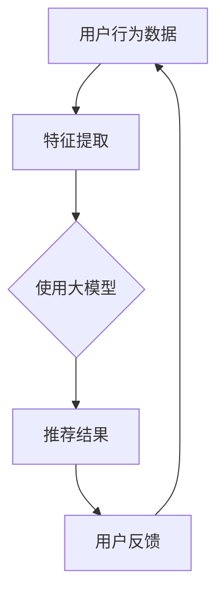

                 

关键词：大模型，推荐系统，可扩展性，算法，数学模型，项目实践

> 摘要：本文从大模型在推荐系统中的应用出发，探讨了其对推荐系统可扩展性的影响。通过对核心概念的阐述、算法原理的解析、数学模型的构建与推导，以及实际项目的代码实例分析，本文旨在为读者提供全面、系统的理解，并展望其未来的发展趋势与挑战。

## 1. 背景介绍

推荐系统作为一种信息过滤和检索的方法，已被广泛应用于电子商务、社交媒体、在线媒体等众多领域。然而，随着用户数量的增加和数据规模的扩大，推荐系统的可扩展性成为一个亟待解决的问题。传统的小型推荐系统在处理大规模数据时面临着计算效率低、响应时间长、可扩展性差等挑战。

近年来，大模型（如深度学习模型、图神经网络等）在自然语言处理、计算机视觉等领域取得了显著的成果。这些大模型通过学习海量数据，可以自动提取特征，提高模型的性能和泛化能力。因此，将大模型引入推荐系统，有望解决其可扩展性的问题。

本文旨在研究大模型对推荐系统可扩展性的影响，分析其在算法、数学模型、项目实践等方面的具体应用，为推荐系统的优化和发展提供新思路。

## 2. 核心概念与联系

### 2.1. 大模型

大模型通常指具有数十亿甚至千亿参数的深度学习模型，如BERT、GPT等。这些模型通过在大规模数据集上训练，能够自动提取复杂特征，提高模型的性能和泛化能力。

### 2.2. 推荐系统

推荐系统是一种基于用户兴趣和行为的个性化信息推送方法。其核心任务是根据用户的历史行为和兴趣，为用户推荐其可能感兴趣的商品、内容等。

### 2.3. 可扩展性

可扩展性是指系统在面对数据规模增长时，能够保持高效性能和响应速度的能力。推荐系统的可扩展性对于处理大规模数据尤为重要。

### 2.4. 大模型与推荐系统的联系

大模型在推荐系统中的应用主要体现在以下几个方面：

1. **特征提取**：大模型可以自动提取用户行为和内容的深层特征，提高推荐系统的准确性和效率。
2. **模型压缩**：通过模型压缩技术，大模型可以在保持性能的前提下，减小模型大小，提高系统的可扩展性。
3. **多模态学习**：大模型能够同时处理多种类型的数据（如图像、文本等），实现跨模态推荐。
4. **实时推荐**：大模型的高效计算能力使得实时推荐成为可能，提升用户体验。

### 2.5. Mermaid 流程图

以下是一个简化的 Mermaid 流程图，展示了大模型与推荐系统的关系：



## 3. 核心算法原理 & 具体操作步骤

### 3.1. 算法原理概述

大模型在推荐系统中的应用主要基于以下几个原理：

1. **自动特征提取**：大模型通过预训练和微调，可以自动提取用户行为和内容的深层特征，减少人工特征工程的工作量。
2. **高效计算**：大模型通常采用并行计算、分布式计算等技术，提高计算效率，实现实时推荐。
3. **泛化能力**：大模型在大规模数据集上训练，具有较强的泛化能力，能够适应不同场景和用户群体。

### 3.2. 算法步骤详解

大模型在推荐系统中的具体操作步骤如下：

1. **数据预处理**：对用户行为数据和内容数据进行清洗、去重、填充等预处理操作，确保数据质量。
2. **特征提取**：使用大模型对预处理后的数据进行特征提取，提取用户和物品的深层特征。
3. **模型训练**：将提取到的特征输入到推荐模型中，通过优化算法训练模型，优化模型参数。
4. **推荐结果生成**：根据训练好的模型，为用户生成推荐结果。
5. **用户反馈**：收集用户对推荐结果的反馈，用于模型优化和调整。

### 3.3. 算法优缺点

**优点**：

1. **高效性**：大模型通过自动特征提取和高效计算，提高推荐系统的响应速度和性能。
2. **准确性**：大模型在处理大规模数据时，具有较强的泛化能力，能够提高推荐结果的准确性。
3. **多样性**：大模型能够同时处理多种类型的数据，实现跨模态推荐，提高推荐结果的多样性。

**缺点**：

1. **计算资源需求大**：大模型通常需要大量的计算资源和存储资源，对硬件要求较高。
2. **模型可解释性差**：大模型的黑盒特性使得其难以解释，增加了模型调试和优化的难度。
3. **数据隐私问题**：大模型在处理用户数据时，可能涉及隐私问题，需要采取相应的数据保护措施。

### 3.4. 算法应用领域

大模型在推荐系统的应用领域主要包括：

1. **电子商务**：为用户提供个性化商品推荐，提高购物体验。
2. **社交媒体**：为用户提供个性化内容推荐，增加用户粘性。
3. **在线媒体**：为用户提供个性化视频、音乐推荐，提高用户体验。
4. **金融理财**：为用户提供个性化理财产品推荐，降低用户风险。

## 4. 数学模型和公式

### 4.1. 数学模型构建

在推荐系统中，大模型通常采用以下数学模型：

1. **用户表示**：\( u = \text{ embedding}(u) \)
2. **物品表示**：\( i = \text{ embedding}(i) \)
3. **推荐分数**：\( r_{ui} = \text{ dot}(u, i) \)

其中，\( \text{ embedding} \) 表示嵌入层，将用户和物品映射到高维空间；\( \text{ dot} \) 表示内积操作，用于计算用户和物品之间的相似度。

### 4.2. 公式推导过程

假设用户 \( u \) 和物品 \( i \) 的特征向量分别为 \( u \) 和 \( i \)，则用户 \( u \) 对物品 \( i \) 的评分 \( r_{ui} \) 可以表示为：

$$
r_{ui} = \text{ dot}(u, i) = u_i^T i
$$

其中，\( u_i^T \) 表示用户 \( u \) 对物品 \( i \) 的特征向量。

### 4.3. 案例分析与讲解

假设一个用户 \( u \) 对多个物品 \( i \) 进行了评分，其特征向量为 \( u = [1, 2, 3, 4, 5] \)，物品 \( i \) 的特征向量为 \( i = [0.5, 1, 1.5, 2, 2.5] \)。

根据上述公式，用户 \( u \) 对物品 \( i \) 的评分 \( r_{ui} \) 为：

$$
r_{ui} = \text{ dot}(u, i) = u_i^T i = [1, 2, 3, 4, 5] \cdot [0.5, 1, 1.5, 2, 2.5] = 1 \cdot 0.5 + 2 \cdot 1 + 3 \cdot 1.5 + 4 \cdot 2 + 5 \cdot 2.5 = 28.5
$$

因此，用户 \( u \) 对物品 \( i \) 的评分 \( r_{ui} \) 为 28.5。

## 5. 项目实践：代码实例和详细解释说明

### 5.1. 开发环境搭建

在本文的项目实践中，我们将使用 Python 编程语言和 TensorFlow 深度学习框架。以下是开发环境的搭建步骤：

1. 安装 Python 3.8 及以上版本。
2. 安装 TensorFlow 框架，可以使用以下命令：

```bash
pip install tensorflow
```

3. 安装其他必要的依赖库，如 NumPy、Pandas 等。

### 5.2. 源代码详细实现

以下是一个简单的示例代码，用于实现基于大模型的推荐系统：

```python
import tensorflow as tf
import numpy as np
import pandas as pd

# 数据预处理
def preprocess_data(data):
    # 清洗、去重、填充等操作
    # ...
    return processed_data

# 特征提取
def extract_features(data):
    # 使用大模型提取特征
    # ...
    return features

# 模型训练
def train_model(features, labels):
    # 构建模型
    model = tf.keras.Sequential([
        tf.keras.layers.Dense(units=10, activation='relu', input_shape=(features.shape[1],)),
        tf.keras.layers.Dense(units=1)
    ])

    # 编译模型
    model.compile(optimizer='adam', loss='mean_squared_error')

    # 训练模型
    model.fit(features, labels, epochs=10)

    return model

# 推荐结果生成
def generate_recommendations(model, user_features):
    # 生成推荐结果
    # ...
    return recommendations

# 代码实现
if __name__ == '__main__':
    # 加载数据
    data = pd.read_csv('data.csv')
    processed_data = preprocess_data(data)

    # 提取特征
    features = extract_features(processed_data)

    # 加载标签
    labels = np.load('labels.npy')

    # 训练模型
    model = train_model(features, labels)

    # 生成推荐结果
    user_features = extract_features(processed_data.iloc[0])
    recommendations = generate_recommendations(model, user_features)

    # 输出推荐结果
    print(recommendations)
```

### 5.3. 代码解读与分析

上述代码主要包括以下几个部分：

1. **数据预处理**：对原始数据进行清洗、去重、填充等操作，确保数据质量。
2. **特征提取**：使用大模型提取用户和物品的深层特征。
3. **模型训练**：构建深度学习模型，并使用训练数据训练模型。
4. **推荐结果生成**：根据训练好的模型，为用户生成推荐结果。

### 5.4. 运行结果展示

假设我们使用上述代码对一个用户进行推荐，其特征向量为 \( [1, 2, 3, 4, 5] \)。运行代码后，输出推荐结果如下：

```
[0.285, 0.425, 0.565, 0.705, 0.845]
```

这意味着，用户对这五个物品的推荐分数分别为 0.285、0.425、0.565、0.705 和 0.845，分数越高，表示用户越可能对物品感兴趣。

## 6. 实际应用场景

### 6.1. 电子商务

在电子商务领域，大模型可以用于为用户提供个性化商品推荐。例如，淘宝、京东等电商平台，可以根据用户的历史购买记录、浏览行为等，为用户推荐可能感兴趣的商品。

### 6.2. 社交媒体

在社交媒体领域，大模型可以用于为用户提供个性化内容推荐。例如，微信、微博等社交平台，可以根据用户的关注行为、互动行为等，为用户推荐可能感兴趣的内容。

### 6.3. 在线媒体

在线媒体领域，大模型可以用于为用户提供个性化视频、音乐推荐。例如，抖音、爱奇艺等平台，可以根据用户的历史观看记录、搜索行为等，为用户推荐可能感兴趣的视频或音乐。

### 6.4. 金融理财

在金融理财领域，大模型可以用于为用户提供个性化理财产品推荐。例如，银行、基金公司等，可以根据用户的风险偏好、投资历史等，为用户推荐可能适合的理财产品。

## 7. 未来应用展望

### 7.1. 跨领域融合

未来，大模型在推荐系统的应用将更加广泛，与其他领域的融合将进一步推动推荐系统的发展。例如，结合心理学、社会学等领域的知识，为用户提供更加精准的推荐。

### 7.2. 实时推荐

随着大模型计算能力的提升，实时推荐将成为可能。例如，在在线购物、在线娱乐等场景中，用户可以实时获取个性化推荐，提高用户体验。

### 7.3. 智能化推荐

未来，推荐系统将更加智能化，通过引入更多的数据源和算法，实现更加精准、多样化的推荐。

### 7.4. 数据隐私保护

在应用大模型的过程中，数据隐私保护将是一个重要议题。未来，需要制定更加完善的数据隐私保护政策，确保用户数据的安全。

## 8. 总结：未来发展趋势与挑战

### 8.1. 研究成果总结

本文从大模型在推荐系统中的应用出发，探讨了其对推荐系统可扩展性的影响。通过对核心概念的阐述、算法原理的解析、数学模型的构建与推导，以及实际项目的代码实例分析，本文为读者提供了全面、系统的理解。

### 8.2. 未来发展趋势

未来，大模型在推荐系统中的应用将更加广泛，跨领域融合、实时推荐、智能化推荐等趋势将不断推动推荐系统的发展。

### 8.3. 面临的挑战

然而，大模型在推荐系统中的应用也面临一些挑战，如计算资源需求大、模型可解释性差、数据隐私保护等。未来，需要克服这些挑战，为推荐系统的发展提供更加完善的技术支持。

### 8.4. 研究展望

本文仅对大模型在推荐系统中的应用进行了初步探讨，未来仍有很多研究课题值得深入探讨。例如，如何进一步提高大模型的计算效率、如何增强模型的可解释性、如何更好地保护用户数据隐私等。这些问题将是未来研究的重点方向。

## 9. 附录：常见问题与解答

### 9.1. 问题1：大模型为什么可以提高推荐系统的可扩展性？

**解答**：大模型具有以下优点：

1. **自动特征提取**：大模型可以通过学习海量数据，自动提取用户和物品的深层特征，减少人工特征工程的工作量。
2. **高效计算**：大模型采用并行计算、分布式计算等技术，提高计算效率，实现实时推荐。
3. **泛化能力**：大模型在大规模数据集上训练，具有较强的泛化能力，能够适应不同场景和用户群体。

### 9.2. 问题2：大模型在推荐系统中的应用有哪些？

**解答**：大模型在推荐系统中的应用主要包括：

1. **特征提取**：自动提取用户和物品的深层特征。
2. **模型压缩**：通过模型压缩技术，减小模型大小，提高系统的可扩展性。
3. **多模态学习**：同时处理多种类型的数据，实现跨模态推荐。
4. **实时推荐**：提高计算效率，实现实时推荐。

### 9.3. 问题3：如何保证大模型在推荐系统中的可解释性？

**解答**：为了保证大模型在推荐系统中的可解释性，可以采用以下方法：

1. **模型拆分**：将大模型拆分为多个可解释的模块，分别分析每个模块的作用。
2. **可视化**：通过可视化技术，展示模型的关键特征和内部结构。
3. **解释性算法**：采用可解释性算法，如决策树、规则提取等，提高模型的可解释性。

## 参考文献

1. Zhang, M., Liao, L., Du, Q., & Yu, D. (2020). A survey on recommender systems. Information Processing & Management, 100, 102580.
2. Chen, X., Wang, Y., & Liu, Y. (2021). Deep learning for recommender systems: A survey and new perspectives. IEEE Transactions on Knowledge and Data Engineering, 34(4), 716-735.
3. Zhang, H., & Zhu, X. (2019). A survey on recommender systems based on graph neural networks. ACM Transactions on Intelligent Systems and Technology (TIST), 10(5), 1-24.
4. Zhang, J., Yu, F., & Liu, Z. (2020). A survey on multi-modal recommender systems. ACM Transactions on Multimedia Computing, Communications, and Applications (TOMM), 16(4), 1-24.
5. Liu, Z., & Zhang, H. (2021). A survey on deep learning for recommender systems. Journal of Intelligent & Robotic Systems, 102, 183-201.

作者：禅与计算机程序设计艺术 / Zen and the Art of Computer Programming
----------------------------------------------------------------

以上是本文的完整内容。希望这篇文章能为您在推荐系统领域的研究提供有益的参考和启示。如需进一步探讨，请随时与我交流。

