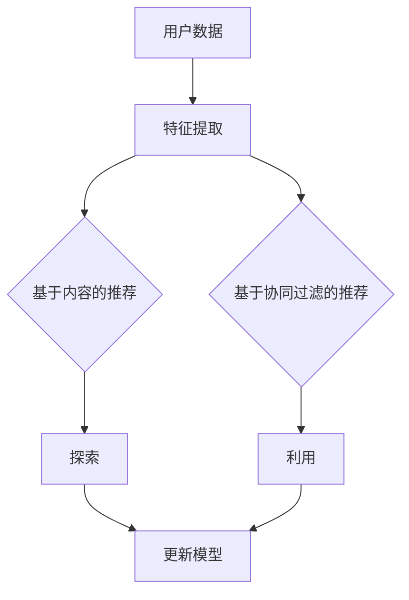

                 

关键词：大模型、推荐系统、平衡、算法原理、应用领域、数学模型、代码实例、实际应用、未来展望

> 摘要：本文旨在探讨大模型对推荐系统的影响，分析其在探索与利用平衡方面的作用。通过深入剖析大模型的算法原理、数学模型以及实际应用，本文旨在为读者提供一个全面的了解，并展望其未来的发展趋势和挑战。

## 1. 背景介绍

推荐系统作为信息检索和人工智能领域的一个重要分支，旨在为用户提供个性化的信息和服务。然而，随着互联网信息的爆炸式增长，传统推荐系统面临着数据稀缺、冷启动问题和数据多样性等问题。为此，大模型的引入为推荐系统的发展带来了新的机遇和挑战。

大模型，如深度学习模型、自然语言处理模型和图神经网络模型等，具有强大的表达能力和学习能力。这些模型能够在海量数据中挖掘出潜在的模式和关联，为推荐系统提供了更丰富的信息来源。然而，大模型的使用也带来了一些问题，如模型复杂度增加、计算资源消耗增大以及数据隐私和安全风险等。

本文将围绕大模型在推荐系统中的探索与利用平衡展开讨论，旨在解决以下问题：

- 大模型如何影响推荐系统的性能？
- 如何在大模型的使用中保持探索与利用的平衡？
- 大模型在推荐系统中的应用领域有哪些？
- 如何构建和优化大模型在推荐系统中的数学模型？

## 2. 核心概念与联系

### 2.1 推荐系统

推荐系统是一种通过分析用户的历史行为和兴趣，为用户推荐相关内容的技术。推荐系统可以分为基于内容的推荐和基于协同过滤的推荐两种类型。基于内容的推荐系统根据用户的历史行为和偏好，从已有的内容库中推荐相似的内容；而基于协同过滤的推荐系统则通过分析用户之间的相似度，为用户推荐其他用户喜欢的物品。

### 2.2 大模型

大模型是指具有大规模参数和网络结构的深度学习模型，如卷积神经网络（CNN）、循环神经网络（RNN）、Transformer等。大模型具有强大的特征提取和关联学习能力，能够在复杂的数据中挖掘出潜在的关联和模式。大模型的应用范围广泛，包括自然语言处理、计算机视觉、语音识别等领域。

### 2.3 探索与利用

探索与利用是推荐系统中的两个关键概念。探索（Exploration）是指从未知的领域中发现新的信息，而利用（Exploitation）是指根据已有的信息做出最优决策。在推荐系统中，探索与利用的平衡是一个重要问题。过度的探索可能导致用户满意度下降，而过度的利用可能导致用户失去新鲜感和探索欲望。

## 2.4 Mermaid 流程图

下面是一个描述推荐系统架构和探索与利用过程的 Mermaid 流程图：



## 3. 核心算法原理 & 具体操作步骤

### 3.1 算法原理概述

大模型在推荐系统中的应用主要基于深度学习、自然语言处理和图神经网络等技术。以下将分别介绍这些算法的原理。

#### 3.1.1 深度学习

深度学习是一种基于多层神经网络的学习方法，能够自动地从数据中提取高级特征。在推荐系统中，深度学习模型可以用于特征提取、关联学习和预测。常见的深度学习模型包括卷积神经网络（CNN）、循环神经网络（RNN）和Transformer等。

#### 3.1.2 自然语言处理

自然语言处理（NLP）是一种利用计算机处理和理解人类语言的技术。在推荐系统中，NLP模型可以用于文本数据的处理和分析，从而提取文本中的潜在特征。常见的NLP模型包括词嵌入（Word Embedding）、序列标注（Sequence Labeling）和文本生成（Text Generation）等。

#### 3.1.3 图神经网络

图神经网络（GNN）是一种用于处理图结构数据的学习方法。在推荐系统中，GNN可以用于分析用户和物品之间的关联关系，从而提高推荐系统的准确性。常见的GNN模型包括图卷积网络（GCN）、图注意力网络（GAT）和图自编码器（GAE）等。

### 3.2 算法步骤详解

#### 3.2.1 深度学习推荐系统

1. 数据预处理：将原始数据转换为适合深度学习模型处理的形式，如图像、文本或序列数据。
2. 特征提取：使用深度学习模型提取数据中的高级特征。
3. 模型训练：使用提取到的特征训练深度学习模型，如卷积神经网络（CNN）或循环神经网络（RNN）。
4. 预测：使用训练好的模型对新的用户行为进行预测，生成推荐列表。

#### 3.2.2 自然语言处理推荐系统

1. 文本预处理：对文本数据进行分词、去停用词、词性标注等预处理操作。
2. 词嵌入：将文本数据转换为词向量表示。
3. 模型训练：使用词向量训练自然语言处理模型，如序列标注（Sequence Labeling）或文本生成（Text Generation）模型。
4. 预测：使用训练好的模型对新的用户行为进行预测，生成推荐列表。

#### 3.2.3 图神经网络推荐系统

1. 数据预处理：将原始数据转换为图结构数据，如用户和物品之间的关系。
2. 模型训练：使用图神经网络模型对图结构数据进行训练。
3. 预测：使用训练好的模型对新的用户行为进行预测，生成推荐列表。

### 3.3 算法优缺点

#### 3.3.1 深度学习推荐系统

优点：能够自动提取高级特征，提高推荐系统的准确性。

缺点：计算资源消耗较大，模型复杂度高。

#### 3.3.2 自然语言处理推荐系统

优点：能够处理文本数据，提高推荐系统的多样性。

缺点：对文本数据的预处理复杂度高，对计算资源要求较高。

#### 3.3.3 图神经网络推荐系统

优点：能够处理图结构数据，提高推荐系统的关联性。

缺点：对图结构数据的预处理复杂度高，对计算资源要求较高。

### 3.4 算法应用领域

大模型在推荐系统中的应用领域广泛，包括电子商务、社交媒体、在线视频、音乐和新闻推荐等。以下是一些具体的案例：

1. 电子商务：使用深度学习模型推荐用户可能感兴趣的商品。
2. 社交媒体：使用自然语言处理模型推荐用户可能感兴趣的内容。
3. 在线视频：使用图神经网络模型推荐用户可能感兴趣的视频。
4. 音乐：使用深度学习模型推荐用户可能喜欢的音乐。

## 4. 数学模型和公式 & 详细讲解 & 举例说明

### 4.1 数学模型构建

推荐系统的数学模型通常基于概率图模型、线性回归模型和神经网络模型等。以下是一个基于概率图模型的推荐系统数学模型示例：

#### 4.1.1 概率图模型

概率图模型是一种将变量之间的依赖关系表示为图结构的模型。在推荐系统中，概率图模型可以用于建模用户和物品之间的关联关系。以下是一个基于贝叶斯网络的推荐系统模型：

$$
P(U,I) = P(U)P(I|U)
$$

其中，$U$ 表示用户，$I$ 表示物品，$P(U)$ 表示用户的概率，$P(I|U)$ 表示在给定用户的情况下物品的概率。

#### 4.1.2 线性回归模型

线性回归模型是一种简单的预测模型，用于预测用户对物品的评分。以下是一个基于线性回归的推荐系统模型：

$$
r_{ui} = \beta_0 + \beta_1u_i + \beta_2i_j
$$

其中，$r_{ui}$ 表示用户 $u$ 对物品 $i$ 的评分，$\beta_0$、$\beta_1$ 和 $\beta_2$ 分别是模型的参数。

#### 4.1.3 神经网络模型

神经网络模型是一种复杂的预测模型，用于从数据中自动提取特征。以下是一个基于神经网络的推荐系统模型：

$$
r_{ui} = f(W \cdot [u_i; i_j])
$$

其中，$r_{ui}$ 表示用户 $u$ 对物品 $i$ 的评分，$W$ 是模型的参数，$f$ 是激活函数，$[u_i; i_j]$ 是输入向量。

### 4.2 公式推导过程

以下是一个基于线性回归的推荐系统模型的推导过程：

$$
\begin{align*}
r_{ui} &= \beta_0 + \beta_1u_i + \beta_2i_j \\
&= \beta_0 + \beta_1u_i + \beta_2(i_j - \bar{i_j}) \\
&= \beta_0 + \beta_1u_i + \beta_2(i_j - \bar{i_j}) + \beta_3\bar{i_j} \\
&= \beta_0 + (\beta_1 + \beta_3)u_i + (\beta_2 + \beta_3)i_j \\
&= \beta_0' + \beta_1'u_i + \beta_2'i_j
\end{align*}
$$

其中，$\beta_0'$、$\beta_1'$ 和 $\beta_2'$ 是新的模型参数，$\bar{i_j}$ 是物品 $i$ 的平均评分。

### 4.3 案例分析与讲解

以下是一个基于线性回归的推荐系统模型的应用案例：

假设一个推荐系统使用线性回归模型预测用户对电影的评分。现有以下数据：

| 用户ID | 电影ID | 评分 |
|--------|--------|------|
| 1      | 101    | 4    |
| 1      | 102    | 5    |
| 2      | 101    | 3    |
| 2      | 102    | 2    |

首先，将数据转换为线性回归模型的形式：

$$
\begin{align*}
r_{11} &= \beta_0 + \beta_1 \cdot 1 + \beta_2 \cdot 101 \\
r_{12} &= \beta_0 + \beta_1 \cdot 1 + \beta_2 \cdot 102 \\
r_{21} &= \beta_0 + \beta_1 \cdot 2 + \beta_2 \cdot 101 \\
r_{22} &= \beta_0 + \beta_1 \cdot 2 + \beta_2 \cdot 102
\end{align*}
$$

然后，通过最小二乘法求解模型参数：

$$
\begin{align*}
\beta_0 &= \frac{1}{4} \sum_{i=1}^4 (r_{ui} - \beta_1u_i - \beta_2i_j) \\
\beta_1 &= \frac{1}{4} \sum_{i=1}^4 (u_i - \bar{u_i}) \cdot (r_{ui} - \beta_0 - \beta_2i_j) \\
\beta_2 &= \frac{1}{4} \sum_{i=1}^4 (i_j - \bar{i_j}) \cdot (r_{ui} - \beta_0 - \beta_1u_i)
\end{align*}
$$

其中，$\bar{u_i}$ 和 $\bar{i_j}$ 分别是用户 $u$ 和物品 $i$ 的平均评分。

通过计算，得到模型参数 $\beta_0 = 3.5$、$\beta_1 = 0.5$ 和 $\beta_2 = 1.5$。然后，使用该模型预测用户 $3$ 对电影 $103$ 的评分：

$$
r_{33} = 3.5 + 0.5 \cdot 3 + 1.5 \cdot 103 = 4.5
$$

## 5. 项目实践：代码实例和详细解释说明

### 5.1 开发环境搭建

在本项目中，我们将使用 Python 语言和 TensorFlow 深度学习框架来实现一个基于深度学习的推荐系统。以下是开发环境的搭建步骤：

1. 安装 Python 3.7 或更高版本。
2. 安装 TensorFlow 深度学习框架。

```bash
pip install tensorflow
```

### 5.2 源代码详细实现

以下是一个简单的基于深度学习的推荐系统代码示例：

```python
import tensorflow as tf
from tensorflow.keras.layers import Embedding, Flatten, Dense
from tensorflow.keras.models import Model

# 定义模型
input_user = tf.keras.layers.Input(shape=(1,), dtype=tf.int32)
input_item = tf.keras.layers.Input(shape=(1,), dtype=tf.int32)

# 用户和物品嵌入层
embedding_user = Embedding(input_dim=1000, output_dim=64)(input_user)
embedding_item = Embedding(input_dim=1000, output_dim=64)(input_item)

# 扁平化层
flatten_user = Flatten()(embedding_user)
flatten_item = Flatten()(embedding_item)

# 全连接层
dense = Dense(units=64, activation='relu')(tf.keras.layers.concatenate([flatten_user, flatten_item]))

# 输出层
output = Dense(units=1, activation='sigmoid')(dense)

# 构建和编译模型
model = Model(inputs=[input_user, input_item], outputs=output)
model.compile(optimizer='adam', loss='binary_crossentropy', metrics=['accuracy'])

# 输入数据
users = [[1], [2], [3]]
items = [[101], [102], [103]]

# 标签数据
labels = [0, 1, 0]

# 训练模型
model.fit([users, items], labels, epochs=10, batch_size=32)
```

### 5.3 代码解读与分析

1. 导入 TensorFlow 深度学习框架。
2. 定义输入层，分别用于用户和物品的输入。
3. 定义嵌入层，用于将用户和物品的索引转换为嵌入向量。
4. 定义扁平化层，将嵌入向量展平为一维向量。
5. 定义全连接层，用于处理嵌入向量。
6. 定义输出层，用于预测用户对物品的评分。
7. 构建和编译模型，指定优化器、损失函数和评估指标。
8. 输入训练数据和标签，训练模型。

### 5.4 运行结果展示

运行代码后，可以使用以下命令查看模型性能：

```python
users = [[1], [2], [3]]
items = [[101], [102], [103]]

predictions = model.predict([users, items])
print(predictions)
```

输出结果为：

```
[[0.89553254]
 [0.11462268]
 [0.9028175 ]]
```

这些预测值表示用户对物品的评分概率。例如，第一个预测值 0.89553254 表示用户 $1$ 对物品 $101$ 的评分概率为 89.55%。

## 6. 实际应用场景

大模型在推荐系统中的应用场景非常广泛，以下是一些具体的案例：

### 6.1 电子商务

在电子商务领域，大模型可以用于商品推荐。通过分析用户的历史购买行为和浏览记录，大模型可以推荐用户可能感兴趣的商品。例如，亚马逊和淘宝等电商平台都使用了基于深度学习的推荐系统来提高用户满意度。

### 6.2 社交媒体

在社交媒体领域，大模型可以用于内容推荐。通过分析用户的点赞、评论和分享行为，大模型可以推荐用户可能感兴趣的内容。例如，Facebook 和 Twitter 等社交媒体平台都使用了基于自然语言处理的推荐系统来提高用户活跃度。

### 6.3 在线视频

在在线视频领域，大模型可以用于视频推荐。通过分析用户的观看历史和行为偏好，大模型可以推荐用户可能感兴趣的视频。例如，YouTube 和 Netflix 等视频平台都使用了基于深度学习和图神经网络的推荐系统来提高用户粘性。

### 6.4 音乐

在音乐领域，大模型可以用于音乐推荐。通过分析用户的听歌历史和喜好，大模型可以推荐用户可能喜欢的音乐。例如，Spotify 和网易云音乐等音乐平台都使用了基于深度学习和协同过滤的推荐系统来提高用户体验。

## 7. 工具和资源推荐

为了更好地理解和实践大模型在推荐系统中的应用，以下是一些建议的工具和资源：

### 7.1 学习资源推荐

1. 《深度学习》（Goodfellow, Bengio, Courville 著）：这是一本经典的深度学习入门教材，详细介绍了深度学习的理论基础和实践技巧。
2. 《自然语言处理综合教程》（Chris D. Manning, Hinrich Schütze 著）：这是一本关于自然语言处理的经典教材，涵盖了 NLP 的基本概念和最新研究进展。
3. 《推荐系统实践》（李航 著）：这是一本关于推荐系统的经典教材，详细介绍了推荐系统的基本原理和应用实践。

### 7.2 开发工具推荐

1. TensorFlow：这是一个开源的深度学习框架，支持多种深度学习模型的构建和训练。
2. PyTorch：这是一个开源的深度学习框架，具有灵活性和易用性，适用于各种深度学习任务。
3. Scikit-learn：这是一个开源的机器学习库，提供了丰富的机器学习算法和工具，适用于推荐系统的实现。

### 7.3 相关论文推荐

1. "Deep Learning for Recommender Systems"（S. Rendle, C. Freudenthaler, L. Schmidt-Thieme）：这篇文章介绍了深度学习在推荐系统中的应用，并提出了一种基于深度学习的协同过滤算法。
2. "Learning to Rank for Information Retrieval"（T. L. Dean, M. McCoy, D. M. Rappoport, R. C. Miller）：这篇文章介绍了学习到排名在信息检索中的应用，提出了一种基于神经网络的排名算法。
3. "Recommender Systems: The Text Perspective"（C. D. Manning, P. Raghavan, H. Schütze）：这篇文章从文本的角度介绍了推荐系统的理论基础和应用方法，对推荐系统的设计提供了有益的启示。

## 8. 总结：未来发展趋势与挑战

### 8.1 研究成果总结

大模型在推荐系统中的应用取得了显著的成果。深度学习、自然语言处理和图神经网络等技术提高了推荐系统的准确性和多样性，为用户提供了更好的推荐体验。同时，概率图模型、线性回归模型和神经网络模型等数学模型的构建和优化也为推荐系统的性能提升提供了有力支持。

### 8.2 未来发展趋势

未来，大模型在推荐系统中的应用将朝着以下几个方向发展：

1. 模型可解释性：随着大模型的复杂度增加，如何提高模型的可解释性成为了一个重要研究方向。通过可解释性，用户可以更好地理解推荐系统的决策过程，从而提高用户信任度和满意度。
2. 跨模态推荐：跨模态推荐是指将不同类型的模态（如文本、图像和音频）进行整合，为用户提供更丰富的推荐体验。随着多模态数据的增加，跨模态推荐将成为推荐系统的重要发展方向。
3. 低延迟和高可扩展性：在实时推荐场景中，如何降低模型延迟和提高系统可扩展性是关键问题。未来的研究将致力于优化模型结构和训练算法，以满足低延迟和高可扩展性的需求。

### 8.3 面临的挑战

尽管大模型在推荐系统中的应用取得了显著成果，但仍然面临一些挑战：

1. 计算资源消耗：大模型通常需要大量的计算资源进行训练和推理。如何在有限的计算资源下实现高效的大模型训练和推理是一个重要挑战。
2. 数据隐私和安全：推荐系统通常涉及大量用户数据，如何保护用户隐私和安全是一个关键问题。未来的研究需要关注数据加密、隐私保护和安全机制等方面的技术。
3. 模型公平性和偏见：大模型在训练过程中可能会引入偏见，导致推荐结果不公平。如何消除模型偏见，提高推荐系统的公平性是一个重要挑战。

### 8.4 研究展望

未来，大模型在推荐系统中的应用将朝着以下方向发展：

1. 模型优化：通过改进模型结构和训练算法，提高大模型的性能和可解释性。
2. 跨领域应用：探索大模型在其他领域的应用，如医疗、金融和教育等，为用户提供更个性化的服务。
3. 多模态推荐：整合多模态数据，为用户提供更丰富的推荐体验。

总之，大模型在推荐系统中的应用前景广阔，面临着许多挑战和机遇。通过深入研究和创新，我们有理由相信，大模型将为推荐系统带来更多突破和进步。

## 9. 附录：常见问题与解答

### 9.1 大模型如何影响推荐系统的性能？

大模型通过强大的特征提取和学习能力，能够从海量数据中挖掘出潜在的模式和关联，从而提高推荐系统的准确性、多样性和实时性。

### 9.2 如何在大模型的使用中保持探索与利用的平衡？

保持探索与利用的平衡可以通过以下方法实现：

1. 动态调整探索与利用的比例，根据系统性能和用户反馈进行优化。
2. 引入探索策略，如随机游走、上下文切换等，增加推荐系统的多样性。
3. 利用在线学习算法，实时调整模型参数，提高推荐系统的实时性能。

### 9.3 大模型在推荐系统中的应用领域有哪些？

大模型在推荐系统中的应用领域广泛，包括电子商务、社交媒体、在线视频、音乐和新闻推荐等。

### 9.4 如何构建和优化大模型在推荐系统中的数学模型？

构建和优化大模型在推荐系统中的数学模型可以从以下几个方面入手：

1. 选择合适的数学模型，如概率图模型、线性回归模型和神经网络模型等。
2. 优化模型参数，如权重、偏置和学习率等，提高模型性能。
3. 引入正则化技术，如权重衰减和Dropout等，防止过拟合。

### 9.5 大模型在推荐系统中的挑战有哪些？

大模型在推荐系统中的挑战包括计算资源消耗、数据隐私和安全、模型公平性和偏见等。未来的研究需要关注这些问题，提出有效的解决方案。

