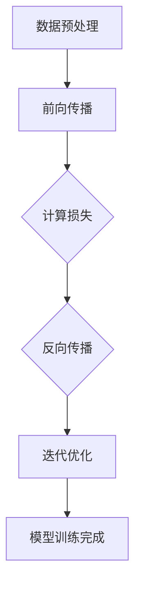

                 

关键词：大模型、行业变革、人工智能、技术进步、案例分析

> 摘要：本文通过深入分析大模型在各个行业的实际应用案例，探讨了其带来的深远影响和技术进步，旨在为读者展示大模型如何改变行业格局，并展望其未来的发展趋势与挑战。

## 1. 背景介绍

大模型（Large Models），又称大型神经网络或深度学习模型，是近年来人工智能领域的重大突破。这些模型具有数十亿甚至千亿个参数，能够通过学习大量数据来模拟复杂的认知任务。从图像识别到自然语言处理，从游戏对战到医疗诊断，大模型在多个领域都展示了其强大的能力。

### 1.1 大模型的发展历程

大模型的发展经历了几个重要阶段：

- **早期探索（1980s-1990s）**：神经网络模型的研究初见成效，但受限于计算能力和数据资源。
- **2006年：深度学习诞生**：Hinton等人提出了深度信念网络，开启了深度学习的新篇章。
- **2012年：ImageNet竞赛**：AlexNet在ImageNet竞赛中大放异彩，深度学习模型开始受到广泛关注。
- **2018年：BERT模型发布**：BERT的出现标志着自然语言处理领域的大模型时代来临。
- **至今：大模型技术不断迭代**：随着计算资源的丰富和算法的改进，大模型的规模和性能不断提升。

### 1.2 大模型的技术特点

- **大规模参数**：大模型通常包含数十亿个参数，能够捕捉数据的复杂特征。
- **深度网络结构**：多层神经网络有助于模型学习和表示更加复杂的函数。
- **端到端学习**：大模型可以直接从原始数据中学习，无需手动设计特征工程。
- **数据驱动的优化**：大模型能够通过大量数据自动调整参数，实现高效学习。

## 2. 核心概念与联系

### 2.1 大模型的基本原理

大模型基于神经网络架构，通过多层感知器进行信息传递和权重调整。其核心概念包括：

- **神经网络**：由神经元组成的网络，通过输入和输出层之间的多层连接进行数据处理。
- **反向传播算法**：一种用于训练神经网络的算法，通过计算误差反向传播更新网络权重。
- **激活函数**：用于引入非线性变换，使得神经网络能够模拟复杂的非线性关系。

### 2.2 大模型的架构

大模型的架构通常包括以下几部分：

- **输入层**：接收外部输入数据，如图像、文本等。
- **隐藏层**：进行特征提取和变换，隐藏层的数量和神经元数量可以根据任务需求调整。
- **输出层**：生成预测结果或分类标签。

### 2.3 大模型的工作流程

大模型的工作流程如下：

1. **数据预处理**：对输入数据进行标准化、归一化等预处理操作。
2. **前向传播**：将预处理后的数据输入神经网络，通过多层神经元进行特征提取。
3. **计算损失**：通过比较预测结果和真实标签计算损失函数。
4. **反向传播**：根据损失函数反向传播误差，更新网络权重。
5. **迭代优化**：重复上述过程，直到模型达到预定的性能指标。

### 2.4 Mermaid 流程图

下面是一个简化的 Mermaid 流程图，展示了大模型的工作流程：



## 3. 核心算法原理 & 具体操作步骤

### 3.1 算法原理概述

大模型的核心算法是基于深度学习的多层神经网络。其原理包括：

- **神经元之间的加权连接**：每个神经元接收多个输入，并计算输入和权重之积。
- **激活函数引入非线性**：通过激活函数（如ReLU、Sigmoid、Tanh）引入非线性，使得神经网络能够模拟复杂的非线性关系。
- **反向传播算法优化**：通过反向传播算法计算误差并更新网络权重，实现模型训练。

### 3.2 算法步骤详解

1. **初始化权重**：随机初始化网络中的权重和偏置。
2. **前向传播**：将输入数据输入网络，通过多层神经元进行特征提取和计算。
3. **计算损失**：通过损失函数（如交叉熵损失、均方误差损失）计算预测结果和真实标签之间的差距。
4. **反向传播**：计算损失函数关于网络参数的梯度，并通过反向传播算法更新网络权重。
5. **迭代优化**：重复前向传播和反向传播过程，直至模型收敛。

### 3.3 算法优缺点

**优点**：

- **强大的学习能力**：能够从大量数据中自动学习复杂特征。
- **端到端训练**：无需手动设计特征工程，简化了模型训练过程。
- **泛化能力**：通过多层非线性变换，提高了模型的泛化能力。

**缺点**：

- **计算资源需求大**：大模型需要大量的计算资源和存储空间。
- **过拟合风险**：在训练过程中容易过拟合，需要大量数据进行训练。
- **解释性差**：深度学习模型难以解释，难以理解其内部机制。

### 3.4 算法应用领域

大模型在多个领域都有广泛应用，包括：

- **图像识别**：如人脸识别、物体检测、图像生成等。
- **自然语言处理**：如机器翻译、文本分类、问答系统等。
- **语音识别**：如语音转文本、语音合成等。
- **医疗诊断**：如疾病预测、医学影像分析等。
- **游戏AI**：如棋类游戏、格斗游戏等。

## 4. 数学模型和公式 & 详细讲解 & 举例说明

### 4.1 数学模型构建

大模型的数学基础主要包括：

- **线性代数**：矩阵运算、向量计算等。
- **概率论与统计**：概率分布、最大似然估计、最小二乘法等。
- **微积分**：导数、梯度、泰勒展开等。

### 4.2 公式推导过程

以多层感知器（MLP）为例，其前向传播过程可以表示为：

$$
Z_l = \sigma(W_l \cdot A_{l-1} + b_l)
$$

其中，$Z_l$ 表示第 $l$ 层的输出，$\sigma$ 表示激活函数，$W_l$ 和 $b_l$ 分别表示第 $l$ 层的权重和偏置，$A_{l-1}$ 表示前一层输入。

### 4.3 案例分析与讲解

假设我们有一个简单的多层感知器模型，用于二分类任务。输入层有2个神经元，隐藏层有3个神经元，输出层有1个神经元。激活函数采用ReLU。

1. **初始化权重**：

$$
W_1 \in \mathbb{R}^{3 \times 2}, b_1 \in \mathbb{R}^{3 \times 1}, W_2 \in \mathbb{R}^{1 \times 3}, b_2 \in \mathbb{R}^{1 \times 1}
$$

2. **前向传播**：

$$
A_1 = X, Z_1 = \max(0, W_1 \cdot A_1 + b_1), Z_2 = W_2 \cdot Z_1 + b_2
$$

3. **计算损失**：

$$
\hat{y} = \sigma(Z_2), \text{其中} \sigma \text{为Sigmoid函数} \\
L = -\frac{1}{m} \sum_{i=1}^{m} y_i \log(\hat{y}_i) + (1 - y_i) \log(1 - \hat{y}_i)
$$

4. **反向传播**：

$$
\frac{\partial L}{\partial Z_2} = \hat{y} - y \\
\frac{\partial L}{\partial Z_1} = \frac{\partial L}{\partial Z_2} \cdot \frac{\partial Z_2}{\partial Z_1} = (\hat{y} - y) \cdot W_2 \\
\frac{\partial L}{\partial A_1} = \frac{\partial L}{\partial Z_1} \cdot \frac{\partial Z_1}{\partial A_1} = \frac{\partial L}{\partial Z_1} \cdot \sigma'(Z_1)
$$

5. **权重更新**：

$$
W_2 = W_2 - \alpha \cdot \frac{\partial L}{\partial Z_2} \cdot Z_1 \\
W_1 = W_1 - \alpha \cdot \frac{\partial L}{\partial Z_1} \cdot A_0
$$

其中，$\alpha$ 表示学习率。

## 5. 项目实践：代码实例和详细解释说明

### 5.1 开发环境搭建

- **硬件**：配备NVIDIA GPU的计算机
- **软件**：Python 3.8、PyTorch 1.8、Jupyter Notebook

### 5.2 源代码详细实现

```python
import torch
import torch.nn as nn
import torch.optim as optim

# 定义网络结构
class MLP(nn.Module):
    def __init__(self):
        super(MLP, self).__init__()
        self.fc1 = nn.Linear(2, 3)
        self.fc2 = nn.Linear(3, 1)
        self.relu = nn.ReLU()

    def forward(self, x):
        x = self.fc1(x)
        x = self.relu(x)
        x = self.fc2(x)
        return x

# 初始化模型、损失函数和优化器
model = MLP()
criterion = nn.BCELoss()
optimizer = optim.Adam(model.parameters(), lr=0.001)

# 加载数据
x = torch.tensor([[1.0, 0.0], [0.0, 1.0], [1.0, 1.0]])
y = torch.tensor([[0.0], [0.0], [1.0]])

# 训练模型
for epoch in range(1000):
    optimizer.zero_grad()
    output = model(x)
    loss = criterion(output, y)
    loss.backward()
    optimizer.step()

    if (epoch + 1) % 100 == 0:
        print(f'Epoch [{epoch + 1}/1000], Loss: {loss.item()}')

# 测试模型
with torch.no_grad():
    test_output = model(x)
    test_loss = criterion(test_output, y)
    print(f'Test Loss: {test_loss.item()}')
```

### 5.3 代码解读与分析

1. **网络结构**：定义了一个简单的多层感知器模型，包含两个全连接层和ReLU激活函数。
2. **损失函数**：使用二元交叉熵损失函数进行二分类任务。
3. **优化器**：使用Adam优化器进行模型训练。
4. **数据加载**：加载了简单的测试数据集。
5. **训练过程**：通过前向传播、计算损失、反向传播和权重更新进行模型训练。
6. **测试过程**：在测试数据集上评估模型性能。

## 6. 实际应用场景

大模型在多个行业都展示了强大的应用潜力：

- **金融**：用于股票市场预测、风险管理、信用评分等。
- **医疗**：用于疾病诊断、药物发现、个性化治疗等。
- **制造业**：用于预测维护、质量检测、生产优化等。
- **交通**：用于自动驾驶、交通流量预测、路径规划等。
- **零售**：用于个性化推荐、库存管理、客户行为分析等。

### 6.4 未来应用展望

随着大模型技术的不断进步，其应用领域将更加广泛，包括：

- **更高效的数据处理**：通过大模型实现更高效的数据分析和处理。
- **更智能的自动化**：利用大模型实现更智能的自动化系统。
- **更精准的预测**：通过大模型实现更精准的预测和决策支持。

## 7. 工具和资源推荐

### 7.1 学习资源推荐

- **书籍**：《深度学习》（Goodfellow et al.）、
- **在线课程**：Udacity的“深度学习纳米学位”、Coursera的“神经网络与深度学习”等。
- **论文**：NeurIPS、ICLR、ACL等顶级会议和期刊的相关论文。

### 7.2 开发工具推荐

- **框架**：TensorFlow、PyTorch、Keras等。
- **库**：NumPy、Pandas、Matplotlib等。
- **硬件**：NVIDIA GPU、Google Colab等。

### 7.3 相关论文推荐

- **GPT-3**：Brown et al., "Language Models are few-shot learners", 2020。
- **BERT**：Devlin et al., "BERT: Pre-training of Deep Bidirectional Transformers for Language Understanding", 2019。
- **ImageNet**：Deng et al., "ImageNet: A Large-Scale Hierarchical Image Database", 2009。

## 8. 总结：未来发展趋势与挑战

### 8.1 研究成果总结

大模型技术在过去几年取得了显著的成果，包括：

- **性能提升**：大模型的性能在多个任务上超越了传统机器学习方法。
- **应用拓展**：大模型在金融、医疗、交通等行业得到广泛应用。
- **开源生态**：大量开源工具和框架为研究人员和开发者提供了便捷的开发环境。

### 8.2 未来发展趋势

未来大模型技术将继续发展，包括：

- **模型压缩**：通过模型压缩技术降低计算资源和存储成本。
- **多模态学习**：结合多种数据模态进行学习，提高模型的泛化能力。
- **迁移学习**：通过迁移学习提高大模型在新任务上的性能。

### 8.3 面临的挑战

大模型技术仍面临一些挑战：

- **计算资源需求**：大模型需要大量的计算资源和存储空间。
- **数据隐私**：大规模数据处理可能涉及隐私问题。
- **伦理和道德**：如何确保大模型的使用符合伦理和道德标准。

### 8.4 研究展望

未来，大模型技术将在以下几个方面得到进一步发展：

- **模型解释性**：提高模型的解释性，使其在复杂任务中的应用更加可靠。
- **安全性**：加强大模型的安全性和鲁棒性，防止恶意攻击。
- **跨领域应用**：探索大模型在不同领域的应用潜力。

## 9. 附录：常见问题与解答

### 9.1 问题1：大模型为什么需要大量的数据？

**解答**：大模型通过学习大量数据来捕捉复杂的特征和模式，从而提高模型的泛化能力。大量的数据有助于模型更好地拟合训练数据，减少过拟合现象。

### 9.2 问题2：大模型是否一定会过拟合？

**解答**：大模型存在过拟合的风险，但通过适当的正则化方法和数据预处理技术（如数据增强、dropout等），可以减少过拟合现象。

### 9.3 问题3：大模型训练时间如何优化？

**解答**：可以通过以下方法优化大模型训练时间：

- **模型压缩**：使用量化、剪枝等模型压缩技术减小模型规模。
- **分布式训练**：利用多GPU或分布式计算资源进行训练。
- **混合精度训练**：使用混合精度训练（FP16 + BF16）提高训练速度。

-----------------------------------------------------------------

## 作者署名

作者：禅与计算机程序设计艺术 / Zen and the Art of Computer Programming

---

本文内容仅代表作者观点，不反映任何机构或组织的立场。文章中的数据和信息仅供参考，如有错误或疏漏，请指正。

