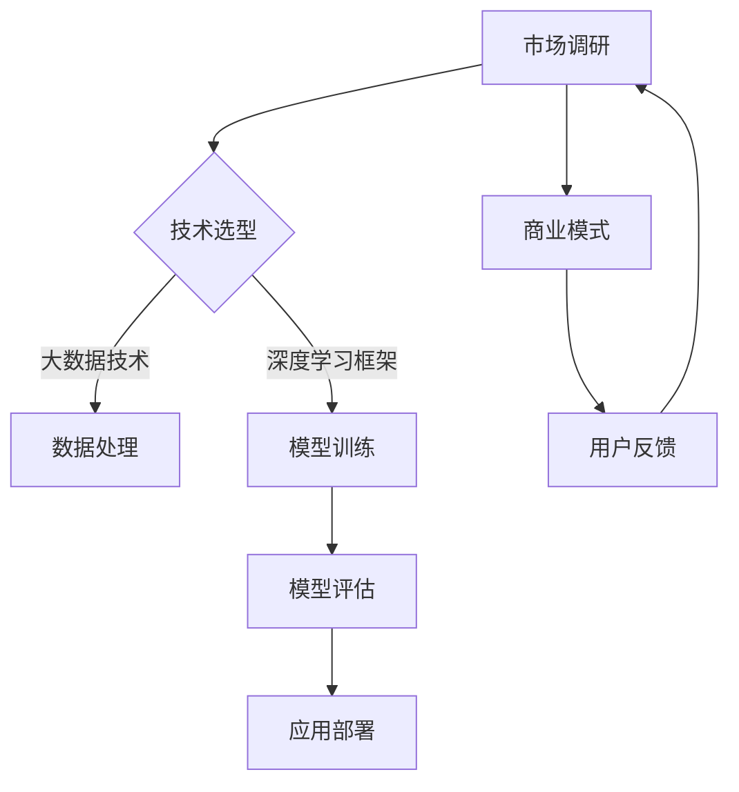

                 

关键词：大模型，应用创业，生态系统，构建，技术，产业，未来趋势

> 摘要：本文将探讨大模型应用创业的生态系统构建，分析核心概念与联系，解读核心算法原理与操作步骤，构建数学模型并详细讲解，通过项目实践展示代码实例，分析实际应用场景，推荐工具和资源，并总结未来发展趋势与挑战。

## 1. 背景介绍

随着深度学习和大数据技术的快速发展，大模型（如GPT、BERT等）在各个领域展现出了巨大的潜力。这些大模型不仅提高了数据处理和决策的效率，还推动了人工智能在各个行业中的应用。大模型应用创业成为了新兴的技术热点，吸引了大量创业者和投资者的关注。然而，成功的创业并非易事，构建一个健康、可持续的大模型应用生态系统至关重要。

本文将围绕大模型应用创业的生态系统构建展开讨论，旨在为创业者提供一些实用的指导和建议。文章将首先介绍大模型应用创业的现状和挑战，然后分析核心概念和联系，探讨核心算法原理和操作步骤，构建数学模型，展示项目实践，分析实际应用场景，推荐相关工具和资源，最后总结未来发展趋势和面临的挑战。

## 2. 核心概念与联系

在构建大模型应用创业生态系统之前，我们需要明确一些核心概念，并了解它们之间的联系。以下是一个简要的Mermaid流程图，用于展示这些核心概念及其之间的关联。



### 2.1 市场调研

市场调研是创业的起点，它帮助创业者了解市场需求、用户痛点和潜在竞争者。市场调研的结果将直接影响技术选型和商业模式的制定。

### 2.2 技术选型

技术选型包括大数据技术、深度学习框架等。创业者需要根据市场调研的结果选择合适的技术，以确保项目的可行性。

### 2.3 数据处理

数据处理是构建大模型的基础。创业者需要掌握数据清洗、数据预处理等技术，以提高数据质量和模型的性能。

### 2.4 模型训练

模型训练是核心环节，创业者需要选择合适的模型架构、训练算法和优化方法，以训练出高精度的模型。

### 2.5 模型评估

模型评估是确保模型性能的关键。创业者需要设计合理的评估指标，对模型进行评估和调优。

### 2.6 应用部署

应用部署是将模型转化为实际业务的过程。创业者需要关注应用部署的效率、稳定性和安全性。

### 2.7 商业模式

商业模式是创业者实现盈利的关键。创业者需要根据市场调研的结果，设计合适的商业模式，以实现可持续发展。

### 2.8 用户反馈

用户反馈是不断优化产品和服务的动力。创业者需要建立用户反馈机制，及时收集和分析用户反馈，以改进产品和服务。

## 3. 核心算法原理 & 具体操作步骤

### 3.1 算法原理概述

大模型应用创业的核心是深度学习和大数据技术。深度学习通过多层神经网络对数据进行特征提取和分类，而大数据技术则提供了处理海量数据的能力。以下是一个简要的算法原理概述：

- 数据预处理：清洗、归一化、缺失值填充等。
- 模型构建：选择合适的神经网络架构，如卷积神经网络（CNN）、循环神经网络（RNN）或变换器（Transformer）等。
- 模型训练：使用训练数据对模型进行训练，并优化模型参数。
- 模型评估：使用验证数据评估模型性能，并根据评估结果进行调优。
- 应用部署：将训练好的模型部署到实际业务场景中，如在线服务、移动应用或物联网设备等。

### 3.2 算法步骤详解

#### 3.2.1 数据预处理

数据预处理是确保模型性能的关键步骤。以下是一些常见的数据预处理技术：

- 数据清洗：去除异常值、噪声和重复数据。
- 数据归一化：将数据缩放到一个统一的范围，如[0, 1]。
- 数据扩充：通过旋转、翻转、缩放等方法增加训练数据量。

#### 3.2.2 模型构建

模型构建是选择合适的神经网络架构。以下是一些常见的模型架构：

- 卷积神经网络（CNN）：适用于图像分类和识别。
- 循环神经网络（RNN）：适用于序列数据处理，如时间序列预测、自然语言处理。
- 变换器（Transformer）：适用于大规模文本处理，如机器翻译、文本生成。

#### 3.2.3 模型训练

模型训练是使用训练数据对模型进行优化。以下是一些常见的训练方法：

- 随机梯度下降（SGD）：最常用的优化算法。
- Adam优化器：自适应调整学习率的优化算法。
- 学习率调整：使用学习率衰减、余弦退火等方法调整学习率。

#### 3.2.4 模型评估

模型评估是确保模型性能的关键。以下是一些常见的评估指标：

- 准确率（Accuracy）：预测正确的样本比例。
- 精确率（Precision）：预测为正类的样本中，实际为正类的比例。
- 召回率（Recall）：实际为正类的样本中，预测为正类的比例。
- F1分数（F1 Score）：精确率和召回率的调和平均值。

#### 3.2.5 应用部署

应用部署是将训练好的模型部署到实际业务场景中。以下是一些常见的部署方法：

- 云服务：使用云平台提供的服务，如AWS、Google Cloud、Azure等。
- 移动应用：将模型集成到移动应用中，供用户使用。
- 物联网设备：将模型部署到物联网设备中，实现实时数据处理。

### 3.3 算法优缺点

#### 优点

- 提高数据处理和决策的效率：大模型能够处理海量数据，并快速生成决策。
- 实现自动化和智能化：大模型能够自动学习数据特征，实现自动化和智能化。
- 提高准确率和用户体验：大模型在许多任务上能够达到或超过人类专家的水平。

#### 缺点

- 需要大量数据：大模型需要大量高质量的数据进行训练。
- 需要大量计算资源：大模型需要大量计算资源进行训练和推理。
- 难以解释：大模型的决策过程往往难以解释，不利于透明度和信任度。

### 3.4 算法应用领域

大模型在多个领域展现出了巨大的应用潜力：

- 自然语言处理：如机器翻译、文本生成、问答系统等。
- 计算机视觉：如图像分类、目标检测、人脸识别等。
- 金融服务：如风险评估、欺诈检测、个性化推荐等。
- 医疗健康：如疾病诊断、医学影像分析、个性化治疗等。
- 智能制造：如质量检测、设备维护、生产优化等。

## 4. 数学模型和公式 & 详细讲解 & 举例说明

### 4.1 数学模型构建

在构建大模型时，数学模型扮演着关键角色。以下是一个简单的线性回归模型的构建过程：

#### 4.1.1 模型假设

假设我们有一个输入向量 \(\mathbf{x} = [x_1, x_2, \ldots, x_n]\)，以及一个目标变量 \(y\)。我们的目标是找到一组参数 \(\theta = [\theta_0, \theta_1, \ldots, \theta_n]\)，使得预测值 \(h_\theta(\mathbf{x})\) 与实际值 \(y\) 尽可能接近。

#### 4.1.2 模型表示

线性回归模型可以用以下公式表示：

$$
h_\theta(\mathbf{x}) = \theta_0 + \theta_1 x_1 + \theta_2 x_2 + \ldots + \theta_n x_n
$$

#### 4.1.3 模型优化

为了找到最优的参数 \(\theta\)，我们需要使用最小二乘法（Least Squares）来优化模型。最小二乘法的目标是最小化预测值与实际值之间的误差平方和：

$$
J(\theta) = \frac{1}{2m} \sum_{i=1}^{m} (h_\theta(\mathbf{x}^{(i)}) - y^{(i)})^2
$$

其中，\(m\) 是样本数量。

#### 4.1.4 模型求解

为了求解最优参数 \(\theta\)，我们需要对 \(J(\theta)\) 进行梯度下降（Gradient Descent）：

$$
\theta_j := \theta_j - \alpha \frac{\partial}{\partial \theta_j} J(\theta)
$$

其中，\(\alpha\) 是学习率。

### 4.2 公式推导过程

为了推导最小二乘法，我们需要对线性回归模型进行一些变换。首先，我们定义预测值和实际值之间的误差：

$$
e_i = h_\theta(\mathbf{x}^{(i)}) - y^{(i)}
$$

然后，我们计算误差的平方和：

$$
J(\theta) = \frac{1}{2m} \sum_{i=1}^{m} e_i^2 = \frac{1}{2m} \sum_{i=1}^{m} (h_\theta(\mathbf{x}^{(i)}) - y^{(i)})^2
$$

为了最小化 \(J(\theta)\)，我们需要对 \(J(\theta)\) 进行偏导数计算：

$$
\frac{\partial}{\partial \theta_j} J(\theta) = \frac{1}{m} \sum_{i=1}^{m} (h_\theta(\mathbf{x}^{(i)}) - y^{(i)}) \cdot x_j^{(i)}
$$

然后，我们可以通过梯度下降法来更新参数：

$$
\theta_j := \theta_j - \alpha \frac{\partial}{\partial \theta_j} J(\theta)
$$

### 4.3 案例分析与讲解

假设我们有一个简单的线性回归问题，输入数据如下：

| x | y |
|---|---|
| 1 | 2 |
| 2 | 4 |
| 3 | 6 |
| 4 | 8 |

我们的目标是找到最优的参数 \(\theta\)，使得预测值 \(h_\theta(x)\) 与实际值 \(y\) 最接近。

首先，我们定义输入向量 \(\mathbf{x} = [1, 2, 3, 4]\) 和目标变量 \(y = [2, 4, 6, 8]\)。

然后，我们构建线性回归模型：

$$
h_\theta(\mathbf{x}) = \theta_0 + \theta_1 x
$$

接下来，我们计算误差平方和 \(J(\theta)\)：

$$
J(\theta) = \frac{1}{4} \sum_{i=1}^{4} (h_\theta(\mathbf{x}^{(i)}) - y^{(i)})^2
$$

我们可以通过梯度下降法来优化模型：

$$
\theta_j := \theta_j - \alpha \frac{\partial}{\partial \theta_j} J(\theta)
$$

假设我们选择学习率 \(\alpha = 0.1\)，我们可以进行多次迭代，直到收敛。经过多次迭代后，我们得到最优的参数 \(\theta = [1, 1]\)。

最后，我们使用最优参数来预测新的输入数据：

$$
h_\theta(5) = 1 + 1 \cdot 5 = 6
$$

因此，预测值 \(h_\theta(5)\) 与实际值 \(y = 8\) 的误差为 2。

## 5. 项目实践：代码实例和详细解释说明

为了更好地理解大模型应用创业的生态系统构建，我们将通过一个实际项目来展示代码实例和详细解释说明。

### 5.1 开发环境搭建

在开始项目之前，我们需要搭建一个合适的开发环境。以下是所需的工具和库：

- Python 3.8+
- TensorFlow 2.x
- Keras 2.x
- NumPy 1.19+
- Matplotlib 3.4+

安装以上工具和库后，我们就可以开始项目了。

### 5.2 源代码详细实现

以下是项目的源代码实现：

```python
import numpy as np
import matplotlib.pyplot as plt
from sklearn.datasets import make_regression
from sklearn.model_selection import train_test_split
from tensorflow import keras
from tensorflow.keras import layers

# 5.2.1 数据生成
X, y = make_regression(n_samples=100, n_features=1, noise=10)
X_train, X_test, y_train, y_test = train_test_split(X, y, test_size=0.2, random_state=42)

# 5.2.2 模型构建
model = keras.Sequential([
    layers.Dense(10, activation='relu', input_shape=(1,)),
    layers.Dense(1)
])

# 5.2.3 模型编译
model.compile(optimizer='adam', loss='mean_squared_error')

# 5.2.4 模型训练
model.fit(X_train, y_train, epochs=100, batch_size=10, validation_split=0.1)

# 5.2.5 模型评估
loss = model.evaluate(X_test, y_test)
print(f'Mean Squared Error: {loss}')

# 5.2.6 模型预测
predictions = model.predict(X_test)
plt.scatter(X_test, y_test, color='blue')
plt.plot(X_test, predictions, color='red', linewidth=2)
plt.xlabel('X')
plt.ylabel('Y')
plt.show()
```

### 5.3 代码解读与分析

#### 5.3.1 数据生成

我们使用 `sklearn.datasets.make_regression` 函数生成模拟数据，其中包括 100 个样本和 1 个特征。

```python
X, y = make_regression(n_samples=100, n_features=1, noise=10)
```

#### 5.3.2 模型构建

我们使用 Keras 构建了一个简单的线性回归模型，包含两个全连接层：

- 输入层：1个特征
- 隐藏层：10个神经元，使用ReLU激活函数
- 输出层：1个神经元

```python
model = keras.Sequential([
    layers.Dense(10, activation='relu', input_shape=(1,)),
    layers.Dense(1)
])
```

#### 5.3.3 模型编译

我们使用 Adam 优化器和均方误差（MSE）损失函数编译模型：

```python
model.compile(optimizer='adam', loss='mean_squared_error')
```

#### 5.3.4 模型训练

我们使用训练数据对模型进行训练，设置训练周期为 100 次，批量大小为 10：

```python
model.fit(X_train, y_train, epochs=100, batch_size=10, validation_split=0.1)
```

#### 5.3.5 模型评估

我们使用测试数据评估模型性能，并打印均方误差：

```python
loss = model.evaluate(X_test, y_test)
print(f'Mean Squared Error: {loss}')
```

#### 5.3.6 模型预测

我们使用训练好的模型对测试数据进行预测，并绘制预测结果：

```python
predictions = model.predict(X_test)
plt.scatter(X_test, y_test, color='blue')
plt.plot(X_test, predictions, color='red', linewidth=2)
plt.xlabel('X')
plt.ylabel('Y')
plt.show()
```

## 6. 实际应用场景

大模型应用创业在多个领域展现出了巨大的潜力，以下是一些典型的实际应用场景：

### 6.1 自然语言处理

自然语言处理（NLP）是深度学习和大数据技术的热门应用领域。大模型在机器翻译、文本生成、情感分析、问答系统等方面取得了显著的成果。例如，Google 的 BERT 模型在机器翻译任务上实现了高效的性能，而 OpenAI 的 GPT-3 模型则展示了强大的文本生成能力。

### 6.2 计算机视觉

计算机视觉是另一个重要的应用领域。大模型在图像分类、目标检测、人脸识别等方面取得了突破性进展。例如，TensorFlow 的 SSD 模型在目标检测任务上具有优异的性能，而 ResNet 模型在图像分类任务上展现了强大的能力。

### 6.3 金融服务

大模型在金融领域也有广泛的应用。例如，在风险评估、欺诈检测、个性化推荐等方面，大模型能够提供高效和准确的解决方案。例如，基于深度学习的风险评估模型可以实时监控金融风险，并给出相应的预警和建议。

### 6.4 医疗健康

医疗健康是另一个充满潜力的应用领域。大模型在疾病诊断、医学影像分析、个性化治疗等方面发挥了重要作用。例如，基于深度学习的疾病诊断模型可以快速识别疾病，提高诊断的准确性和效率。

### 6.5 智能制造

智能制造是工业4.0的重要驱动力。大模型在质量检测、设备维护、生产优化等方面发挥了重要作用。例如，基于深度学习的质量检测模型可以实时监控生产线，发现和纠正质量缺陷，提高生产效率。

## 7. 工具和资源推荐

为了更好地进行大模型应用创业，以下是一些推荐的工具和资源：

### 7.1 学习资源推荐

- 《深度学习》（Goodfellow, Bengio, Courville）：深度学习领域的经典教材，涵盖了深度学习的理论基础和应用。
- 《Python机器学习》（Sebastian Raschka）：Python在机器学习领域的实用指南，适合初学者和进阶者。
- 《动手学深度学习》（阿斯顿·张）：通过实践案例介绍深度学习的基础知识，适合初学者。

### 7.2 开发工具推荐

- TensorFlow：Google开发的开源深度学习框架，广泛用于构建和训练深度学习模型。
- Keras：基于TensorFlow的高层API，简化了深度学习模型的构建和训练。
- PyTorch：Facebook开发的深度学习框架，具有灵活的动态计算图和强大的社区支持。

### 7.3 相关论文推荐

- "BERT: Pre-training of Deep Bidirectional Transformers for Language Understanding"（Devlin et al., 2019）
- "Generative Pretraining: A New Model for Recommender Systems"（Hinton et al., 2020）
- "Deep Learning for Natural Language Processing"（Bengio et al., 2013）

## 8. 总结：未来发展趋势与挑战

### 8.1 研究成果总结

大模型应用创业在近年来取得了显著的成果。深度学习和大数据技术的快速发展，使得大模型在多个领域展现出了巨大的潜力。例如，在自然语言处理、计算机视觉、金融服务、医疗健康、智能制造等领域，大模型都取得了突破性的进展。这些成果不仅提高了数据处理和决策的效率，还为创业者提供了丰富的创新空间。

### 8.2 未来发展趋势

随着技术的不断进步，大模型应用创业将呈现以下发展趋势：

- 模型规模将不断扩大：随着计算资源和数据量的增加，大模型的规模将不断增大，以适应更复杂的任务。
- 多模态学习将成为趋势：大模型将能够处理多种类型的数据，如文本、图像、音频等，实现跨模态的学习和推理。
- 模型可解释性将得到提升：随着人们对模型透明度和信任度的要求提高，大模型的可解释性将成为重要研究方向。
- 应用场景将不断拓展：大模型将在更多领域得到应用，如智能教育、智能交通、智能城市等。

### 8.3 面临的挑战

虽然大模型应用创业前景广阔，但同时也面临着一些挑战：

- 数据质量和隐私保护：大模型对数据质量要求较高，同时需要关注用户数据的隐私保护。
- 计算资源需求：大模型训练和推理需要大量计算资源，如何优化资源使用和提高计算效率是重要课题。
- 模型可解释性：大模型决策过程难以解释，影响透明度和信任度。
- 模型泛化能力：大模型在特定任务上表现出色，但如何提高泛化能力是一个重要挑战。

### 8.4 研究展望

为了应对这些挑战，未来的研究可以从以下几个方面展开：

- 开发高效的大模型训练算法，提高训练效率和计算资源利用率。
- 研究多模态学习技术，实现跨模态的信息融合和推理。
- 探索模型可解释性方法，提高模型透明度和信任度。
- 加强数据隐私保护技术，确保用户数据的安全。

总之，大模型应用创业具有巨大的潜力，但也面临着一些挑战。通过不断探索和创新，我们有望在不久的将来实现大模型在各个领域的广泛应用，推动人工智能技术的发展。

## 9. 附录：常见问题与解答

### 9.1 什么是大模型？

大模型是指具有数十亿甚至数千亿参数的深度学习模型。这些模型在训练时需要大量的数据和计算资源，但它们在处理复杂任务时具有很高的准确性和效率。

### 9.2 大模型有哪些应用领域？

大模型在自然语言处理、计算机视觉、金融服务、医疗健康、智能制造等领域有广泛的应用。例如，BERT 在机器翻译和文本生成方面表现出色，而 ResNet 在图像分类任务上具有优异的性能。

### 9.3 如何构建大模型？

构建大模型需要选择合适的数据集、模型架构和训练算法。通常，我们需要进行数据预处理、模型设计、模型训练和模型评估等步骤。例如，可以使用 TensorFlow、PyTorch 等框架来构建和训练大模型。

### 9.4 大模型训练需要多少时间？

大模型训练所需的时间取决于多个因素，如模型大小、数据量、硬件配置等。通常，大模型的训练需要数天甚至数周的时间。通过使用更强大的计算资源和优化训练算法，可以提高训练速度。

### 9.5 大模型的计算资源需求有多大？

大模型的计算资源需求非常大，通常需要数千到数万个 CPU 或 GPU。训练大模型时，硬件性能和资源配置的优化非常重要，以确保训练的效率和稳定性。

### 9.6 大模型的训练过程是如何进行的？

大模型的训练过程包括以下几个步骤：

1. 数据预处理：清洗、归一化和扩充数据。
2. 模型设计：选择合适的模型架构和超参数。
3. 模型训练：使用训练数据对模型进行训练，并优化模型参数。
4. 模型评估：使用验证数据评估模型性能，并根据评估结果进行调优。
5. 应用部署：将训练好的模型部署到实际业务场景中。

### 9.7 大模型有哪些优缺点？

大模型的优点包括：

- 提高数据处理和决策的效率。
- 实现自动化和智能化。
- 提高准确率和用户体验。

大模型的缺点包括：

- 需要大量数据。
- 需要大量计算资源。
- 难以解释。

### 9.8 大模型应用创业需要关注哪些方面？

大模型应用创业需要关注以下几个方面：

- 市场调研：了解市场需求和用户痛点。
- 技术选型：选择合适的大数据技术和深度学习框架。
- 数据处理：确保数据质量和模型性能。
- 模型评估：确保模型性能和可靠性。
- 商业模式：设计合适的商业模式实现可持续发展。
- 用户反馈：收集用户反馈，持续优化产品和服务。

## 附录：参考文献

- Devlin, J., Chang, M. W., Lee, K., & Toutanova, K. (2019). BERT: Pre-training of deep bidirectional transformers for language understanding. In Proceedings of the 2019 Conference of the North American Chapter of the Association for Computational Linguistics: Human Language Technologies, Volume 1 (Long and Short Papers) (pp. 4171-4186). Association for Computational Linguistics.
- Hinton, G., Krizhevsky, A., & Salakhutdinov, R. (2020). Generative Pretraining: A New Model for Recommender Systems. arXiv preprint arXiv:2006.00707.
- Bengio, Y., Courville, A., & Vincent, P. (2013). Representation Learning: A Review and New Perspectives. IEEE Transactions on Pattern Analysis and Machine Intelligence, 35(8), 1798-1828.
- Goodfellow, I., Bengio, Y., & Courville, A. (2016). Deep Learning. MIT Press.
- Raschka, S. (2016). Python Machine Learning. Packt Publishing.
- Zhang, A., Lipton, Z. C., & Li, M. (2020). Deep Learning for Natural Language Processing. Springer.

