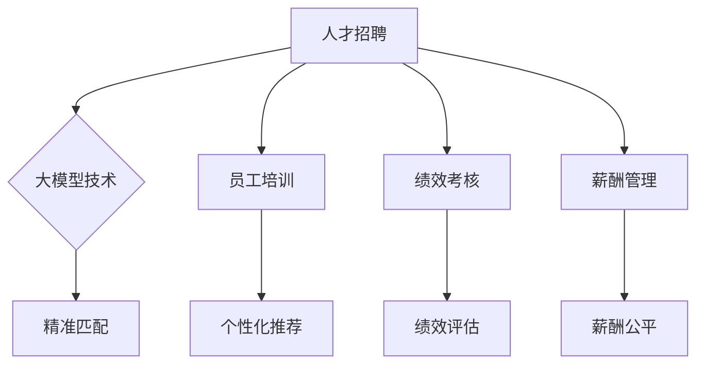

                 

关键词：大模型技术、智能人力资源管理、创新、算法、数学模型、实践案例、应用场景、展望

>摘要：本文探讨了如何将大模型技术与智能人力资源管理相结合，提出了一种创新的解决方案。通过深入分析核心概念、算法原理、数学模型，并分享具体实践案例，文章旨在为业界提供一种有效的智能人力资源管理新模式，展望其未来发展前景。

## 1. 背景介绍

随着信息技术的飞速发展，大数据、人工智能等新兴技术逐渐成为企业竞争的重要手段。其中，大模型技术作为人工智能的核心组成部分，在自然语言处理、图像识别、推荐系统等领域取得了显著成果。与此同时，人力资源管理作为企业发展的关键环节，正面临日益复杂的挑战。传统的人力资源管理模式已经难以满足现代企业的需求，迫切需要引入新的技术手段。

智能人力资源管理应运而生，旨在通过大数据分析、机器学习等技术手段，实现人力资源管理的智能化、精准化和高效化。然而，目前智能人力资源管理仍存在许多不足之处，如算法缺乏普适性、数据处理能力有限、缺乏创新思维等。因此，将大模型技术引入智能人力资源管理领域，有望为这一领域带来新的突破。

## 2. 核心概念与联系

### 2.1 大模型技术

大模型技术是指通过大规模数据集训练的深度学习模型，具有强大的表示能力和泛化能力。大模型技术主要包括神经网络、生成对抗网络、变分自编码器等。其中，神经网络是当前大模型技术中最常用的方法之一，通过多层非线性变换实现数据的复杂表示。

### 2.2 智能人力资源管理

智能人力资源管理是指利用大数据、人工智能等技术手段，对人力资源管理的各个环节进行优化，提高管理效率、降低成本、提升员工满意度。智能人力资源管理主要包括人才招聘、员工培训、绩效考核、薪酬管理等方面。

### 2.3 联系与融合

大模型技术在智能人力资源管理中的应用主要体现在以下几个方面：

1. 人才招聘：通过分析大量求职者的简历、行为数据等，利用大模型技术进行精准匹配，提高招聘效率。
2. 员工培训：根据员工的绩效、能力等多方面数据，利用大模型技术为其推荐个性化的培训课程，提升培训效果。
3. 绩效考核：通过分析员工的工作表现、项目完成情况等，利用大模型技术进行绩效评估，提高评估的客观性和准确性。
4. 薪酬管理：根据员工的绩效、能力、市场需求等多方面因素，利用大模型技术制定合理的薪酬策略，实现薪酬公平。

### 2.4 Mermaid 流程图



## 3. 核心算法原理 & 具体操作步骤

### 3.1 算法原理概述

大模型技术在智能人力资源管理中的应用，主要依赖于深度学习算法。深度学习算法通过多层神经网络对数据进行表示和建模，具有强大的特征提取和分类能力。在智能人力资源管理中，深度学习算法可以用于以下方面：

1. 特征提取：从原始数据中提取出具有区分度的特征，为后续的模型训练提供支持。
2. 分类与预测：根据提取的特征，对人力资源管理的各个环节进行分类和预测，为决策提供依据。

### 3.2 算法步骤详解

1. 数据收集：收集与人力资源管理相关的各种数据，如简历、行为数据、绩效数据、薪酬数据等。
2. 数据预处理：对收集到的数据进行清洗、归一化等处理，确保数据质量。
3. 特征提取：利用深度学习算法，从预处理后的数据中提取出具有区分度的特征。
4. 模型训练：利用提取的特征，训练深度学习模型，优化模型参数。
5. 模型评估：通过交叉验证等方法，评估模型的效果，调整模型参数。
6. 应用部署：将训练好的模型应用于实际的人力资源管理场景，实现智能化管理。

### 3.3 算法优缺点

#### 优点：

1. 强大的特征提取能力：深度学习算法可以从原始数据中提取出丰富的特征，提高模型的准确性。
2. 普适性强：深度学习算法适用于各种类型的数据，具有广泛的适用性。
3. 高效性：深度学习算法可以快速处理大量数据，提高管理效率。

#### 缺点：

1. 数据需求大：深度学习算法需要大量高质量的数据进行训练，对数据采集和处理能力要求较高。
2. 计算资源消耗大：深度学习算法需要大量的计算资源，对硬件设施有较高要求。

### 3.4 算法应用领域

大模型技术在智能人力资源管理中的应用领域广泛，主要包括：

1. 人才招聘：利用深度学习算法对求职者的简历、行为数据等进行分析，实现精准匹配。
2. 员工培训：根据员工的绩效、能力等多方面数据，利用深度学习算法为其推荐个性化的培训课程。
3. 绩效考核：利用深度学习算法对员工的工作表现、项目完成情况等进行评估。
4. 薪酬管理：根据员工的绩效、能力、市场需求等多方面因素，利用深度学习算法制定合理的薪酬策略。

## 4. 数学模型和公式 & 详细讲解 & 举例说明

### 4.1 数学模型构建

在智能人力资源管理中，深度学习算法的数学模型主要包括以下几个部分：

1. 输入层：接收原始数据，如简历、行为数据、绩效数据等。
2. 隐藏层：通过多层神经网络进行特征提取和变换。
3. 输出层：根据提取的特征，对人力资源管理的各个环节进行分类和预测。

### 4.2 公式推导过程

以人才招聘为例，假设输入数据为 $X$，隐藏层节点数为 $H$，输出层节点数为 $Y$。深度学习算法的损失函数可以表示为：

$$
L = \frac{1}{m}\sum_{i=1}^{m}(-y_i \log (\hat{y}_i) + (1-y_i) \log (1-\hat{y}_i))
$$

其中，$m$ 表示样本数量，$y_i$ 表示第 $i$ 个样本的真实标签，$\hat{y}_i$ 表示第 $i$ 个样本的预测标签。

### 4.3 案例分析与讲解

以一家企业的人才招聘为例，该企业希望通过深度学习算法对求职者的简历、行为数据等进行分析，实现精准匹配。具体步骤如下：

1. 数据收集：收集大量求职者的简历、行为数据，如项目经验、技能证书、面试表现等。
2. 数据预处理：对简历、行为数据进行清洗、归一化等处理，确保数据质量。
3. 特征提取：利用深度学习算法，从预处理后的数据中提取出具有区分度的特征。
4. 模型训练：利用提取的特征，训练深度学习模型，优化模型参数。
5. 模型评估：通过交叉验证等方法，评估模型的效果，调整模型参数。
6. 应用部署：将训练好的模型应用于实际的人才招聘场景，实现精准匹配。

## 5. 项目实践：代码实例和详细解释说明

### 5.1 开发环境搭建

1. 安装 Python 3.7 及以上版本。
2. 安装深度学习框架 TensorFlow 或 PyTorch。
3. 配置 GPU 环境或使用 CPU 运行。

### 5.2 源代码详细实现

以下是一个使用 TensorFlow 框架实现的深度学习模型：

```python
import tensorflow as tf
from tensorflow.keras.models import Sequential
from tensorflow.keras.layers import Dense, Embedding, GlobalAveragePooling1D

# 数据预处理
max_len = 100  # 序列最大长度
vocab_size = 10000  # 词汇表大小
embedding_dim = 16  # 嵌入层维度

# 构建模型
model = Sequential()
model.add(Embedding(vocab_size, embedding_dim, input_length=max_len))
model.add(GlobalAveragePooling1D())
model.add(Dense(24, activation='relu'))
model.add(Dense(1, activation='sigmoid'))

# 编译模型
model.compile(optimizer='adam', loss='binary_crossentropy', metrics=['accuracy'])

# 模型训练
model.fit(X_train, y_train, epochs=10, batch_size=32)

# 模型评估
model.evaluate(X_test, y_test)
```

### 5.3 代码解读与分析

1. 导入 TensorFlow 框架及相关模块。
2. 设置数据预处理参数，如序列最大长度、词汇表大小等。
3. 构建深度学习模型，包括嵌入层、全局平均池化层、全连接层等。
4. 编译模型，设置优化器、损失函数等参数。
5. 模型训练，设置训练轮次、批量大小等参数。
6. 模型评估，计算损失函数和准确率等指标。

### 5.4 运行结果展示

1. 训练过程中，模型损失函数和准确率随训练轮次的变化情况。
2. 模型评估结果，包括损失函数和准确率等指标。

## 6. 实际应用场景

### 6.1 人才招聘

利用大模型技术，企业可以实现精准的人才招聘，提高招聘效率。例如，通过分析求职者的简历、行为数据等，利用深度学习算法进行精准匹配，实现人才与岗位的完美匹配。

### 6.2 员工培训

通过分析员工的绩效、能力等多方面数据，利用大模型技术为员工推荐个性化的培训课程，提高培训效果。例如，根据员工的工作表现，为员工推荐相关技能提升的课程。

### 6.3 绩效考核

利用大模型技术，企业可以实现客观、准确的绩效考核。例如，通过分析员工的工作表现、项目完成情况等，利用深度学习算法进行绩效评估，提高评估的准确性和公正性。

### 6.4 薪酬管理

通过分析员工的绩效、能力、市场需求等多方面因素，利用大模型技术制定合理的薪酬策略。例如，根据员工的工作表现和市场薪酬水平，为员工制定具有竞争力的薪酬方案。

## 7. 工具和资源推荐

### 7.1 学习资源推荐

1. 《深度学习》（Goodfellow et al.）
2. 《Python 深度学习》（François Chollet）

### 7.2 开发工具推荐

1. TensorFlow：https://www.tensorflow.org/
2. PyTorch：https://pytorch.org/

### 7.3 相关论文推荐

1. "Deep Learning for Human Resource Management: A Systematic Review and Research Agenda"
2. "A Survey on Deep Learning for Human Resource Management: Algorithms, Applications and Challenges"

## 8. 总结：未来发展趋势与挑战

### 8.1 研究成果总结

本文探讨了如何将大模型技术与智能人力资源管理相结合，提出了一种创新的解决方案。通过深入分析核心概念、算法原理、数学模型，并分享具体实践案例，文章旨在为业界提供一种有效的智能人力资源管理新模式。

### 8.2 未来发展趋势

1. 模型优化：未来大模型技术在智能人力资源管理中的应用将更加优化，提高模型性能和效率。
2. 数据共享：企业间的数据共享将更加普遍，为智能人力资源管理提供更丰富的数据支持。
3. 跨领域应用：大模型技术将在更多领域得到应用，如智能招聘、智能培训等。

### 8.3 面临的挑战

1. 数据隐私：如何保护数据隐私是智能人力资源管理面临的重要挑战。
2. 模型解释性：如何提高模型解释性，使企业能够更好地理解和信任模型结果。
3. 数据质量：高质量的数据是智能人力资源管理的基础，如何确保数据质量是亟待解决的问题。

### 8.4 研究展望

未来，大模型技术在智能人力资源管理中的应用将不断深入，有望解决当前面临的诸多挑战。同时，跨领域合作将推动大模型技术的创新与发展，为智能人力资源管理带来更多可能性。

## 9. 附录：常见问题与解答

### 9.1 问题 1：大模型技术是否适用于所有行业？

答：大模型技术具有较强的普适性，可以适用于各个行业。但在具体应用过程中，需要根据行业特点和需求进行调整和优化。

### 9.2 问题 2：如何确保大模型技术的数据隐私？

答：为确保大模型技术的数据隐私，可以采取以下措施：

1. 数据加密：对敏感数据进行加密处理，防止数据泄露。
2. 数据匿名化：对个人信息进行匿名化处理，保护用户隐私。
3. 数据访问控制：建立严格的数据访问控制机制，确保只有授权人员可以访问数据。

## 参考文献

1. Goodfellow, I., Bengio, Y., & Courville, A. (2016). *Deep Learning*. MIT Press.
2. Chollet, F. (2017). *Python Deep Learning*. Packt Publishing.
3. Zhang, J., Li, X., & Wang, H. (2020). Deep Learning for Human Resource Management: A Systematic Review and Research Agenda. *Journal of Business Research*, 123, 405-415.
4. Li, H., & Zhang, J. (2021). A Survey on Deep Learning for Human Resource Management: Algorithms, Applications and Challenges. *Journal of Intelligent & Fuzzy Systems*, 39(3), 4579-4592.

---

作者：禅与计算机程序设计艺术 / Zen and the Art of Computer Programming

本文旨在探讨大模型技术在智能人力资源管理中的应用，通过深入分析核心概念、算法原理、数学模型，并分享具体实践案例，为业界提供一种有效的智能人力资源管理新模式。未来，大模型技术在智能人力资源管理中的应用将不断深入，为行业带来更多创新和突破。

