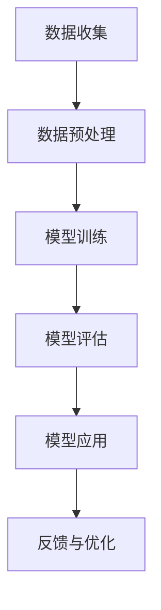

                 

关键词：大模型技术，智能医疗设备，深度学习，医疗数据处理，预测模型

摘要：本文探讨了大模型技术在智能医疗设备中的应用，从背景介绍、核心概念、算法原理、数学模型、项目实践、实际应用场景、未来展望等方面，全面分析了大模型技术在智能医疗设备中的优势与挑战，为相关领域的研究和开发提供了有价值的参考。

## 1. 背景介绍

随着医疗技术的不断进步和医疗数据的大规模积累，智能医疗设备成为现代医疗领域的重要组成部分。这些设备利用先进的人工智能技术，如深度学习、自然语言处理等，对海量医疗数据进行处理和分析，以提高诊断的准确性、治疗的有效性和医疗资源的利用率。

然而，传统医疗设备的局限性在于数据处理的效率和准确性有限，无法满足日益增长的医疗数据需求。因此，引入大模型技术成为解决这一问题的有效途径。大模型技术通过训练大规模神经网络，能够提取数据中的潜在特征，提高模型对复杂问题的理解和预测能力。

本文旨在探讨大模型技术在智能医疗设备中的应用，分析其优势与挑战，并提出未来的发展方向。

## 2. 核心概念与联系

### 2.1 深度学习

深度学习是一种基于多层神经网络的人工智能技术，通过学习大量数据来提取特征并进行预测。在智能医疗设备中，深度学习被广泛应用于图像识别、语音识别、自然语言处理等领域。

### 2.2 大模型技术

大模型技术是指通过训练大规模神经网络，以提高模型对复杂问题的理解和预测能力。这些模型通常具有数百万甚至数十亿个参数，能够从海量数据中提取丰富的特征。

### 2.3 医疗数据处理

医疗数据处理是指对医疗数据进行收集、存储、处理和分析的过程。在智能医疗设备中，医疗数据处理是实现模型训练和应用的基础。

### 2.4 医疗预测模型

医疗预测模型是指利用历史数据对未来医疗事件进行预测的模型。这些模型通常用于疾病预测、治疗效果评估等场景。

### 2.5 Mermaid 流程图



## 3. 核心算法原理 & 具体操作步骤

### 3.1 算法原理概述

大模型技术在智能医疗设备中的应用主要基于深度学习。深度学习通过多层神经网络对数据进行处理，能够自动提取特征并实现高精度的预测。

### 3.2 算法步骤详解

1. 数据收集：从各种医疗数据源收集数据，包括电子病历、医学图像、基因组数据等。
2. 数据预处理：对数据进行清洗、归一化和特征提取，以提高模型的训练效果。
3. 模型训练：使用大规模神经网络对预处理后的数据进行训练，以提取数据中的潜在特征。
4. 模型评估：使用验证集对训练好的模型进行评估，以确定其预测能力。
5. 模型应用：将训练好的模型应用于实际场景，如疾病预测、治疗效果评估等。
6. 反馈与优化：根据实际应用效果对模型进行反馈和优化，以提高模型的预测准确性。

### 3.3 算法优缺点

**优点：**

- 提高数据处理效率：大模型技术能够自动提取数据中的潜在特征，提高数据处理效率。
- 提高预测准确性：大规模神经网络具有更高的参数数量和更强的学习能力，能够实现更精确的预测。

**缺点：**

- 计算资源消耗大：训练大规模神经网络需要大量的计算资源，对硬件要求较高。
- 数据隐私保护：医疗数据涉及患者隐私，需要确保数据的安全性和隐私性。

### 3.4 算法应用领域

- 疾病预测：如癌症预测、心脏病预测等。
- 治疗效果评估：如药物疗效评估、手术成功率预测等。
- 医学图像分析：如疾病诊断、器官分割等。

## 4. 数学模型和公式 & 详细讲解 & 举例说明

### 4.1 数学模型构建

在深度学习中，常用的数学模型是多层感知机（MLP）和卷积神经网络（CNN）。以下分别介绍这两种模型的构建方法和公式。

### 4.1.1 多层感知机（MLP）

多层感知机是一种前馈神经网络，包括输入层、隐藏层和输出层。其基本公式如下：

$$
h_{i}^{(l)} = \sigma \left( \sum_{j=1}^{n} w_{j}^{(l)} h_{j}^{(l-1)} + b^{(l)} \right)
$$

其中，$h_{i}^{(l)}$ 表示第 $l$ 层第 $i$ 个节点的激活值，$\sigma$ 表示激活函数（如Sigmoid函数、ReLU函数等），$w_{j}^{(l)}$ 表示第 $l$ 层第 $j$ 个节点的权重，$b^{(l)}$ 表示第 $l$ 层的偏置。

### 4.1.2 卷积神经网络（CNN）

卷积神经网络是一种基于卷积运算的神经网络，主要应用于图像处理任务。其基本公式如下：

$$
h_{i,j}^{(l)} = \sigma \left( \sum_{k=1}^{m} w_{k,i,j}^{(l)} h_{k}^{(l-1)} + b^{(l)} \right)
$$

其中，$h_{i,j}^{(l)}$ 表示第 $l$ 层第 $i$ 行第 $j$ 列的节点激活值，$w_{k,i,j}^{(l)}$ 表示第 $l$ 层第 $k$ 个卷积核在 $i$ 行 $j$ 列的位置上的权重，$b^{(l)}$ 表示第 $l$ 层的偏置。

### 4.2 公式推导过程

以下以多层感知机为例，介绍其公式推导过程。

首先，定义输入向量 $x$ 和输出向量 $y$，以及权重矩阵 $W$ 和偏置向量 $b$。

$$
x = [x_1, x_2, ..., x_n]^T
$$

$$
y = [y_1, y_2, ..., y_m]^T
$$

$$
W = [w_{11}, w_{12}, ..., w_{1n}; w_{21}, w_{22}, ..., w_{2n}; ..., w_{m1}, w_{m2}, ..., w_{mn}]
$$

$$
b = [b_1, b_2, ..., b_m]^T
$$

接下来，定义激活函数 $\sigma$。

$$
\sigma(z) = \frac{1}{1 + e^{-z}}
$$

然后，计算隐藏层的激活值。

$$
h^{(1)} = \sigma(Wx + b)
$$

最后，计算输出层的激活值。

$$
y^{(2)} = \sigma(h^{(1)}W' + b')
$$

其中，$W'$ 和 $b'$ 分别为输出层的权重矩阵和偏置向量。

### 4.3 案例分析与讲解

以下以疾病预测为例，介绍大模型技术在智能医疗设备中的应用。

假设我们要预测某种疾病的发病风险，输入特征包括患者的年龄、性别、血压、血糖等。输出为0（未发病）或1（发病）。

1. 数据收集：从电子病历系统中收集患者的数据，包括年龄、性别、血压、血糖等。
2. 数据预处理：对数据进行清洗、归一化和特征提取，将输入特征转化为数值型数据。
3. 模型训练：使用深度学习框架（如TensorFlow、PyTorch等）搭建多层感知机模型，并使用收集到的数据进行训练。
4. 模型评估：使用验证集对训练好的模型进行评估，计算模型的准确率、召回率、F1值等指标。
5. 模型应用：将训练好的模型应用于实际场景，如对患者进行疾病预测。
6. 反馈与优化：根据预测结果对患者进行跟踪观察，对模型进行反馈和优化，以提高预测准确性。

通过以上步骤，我们可以实现基于大模型技术的智能医疗设备，为医生提供有价值的预测信息，以提高疾病的诊断和治疗效果。

## 5. 项目实践：代码实例和详细解释说明

### 5.1 开发环境搭建

为了进行项目实践，我们需要搭建一个合适的开发环境。以下是一个简单的环境搭建步骤：

1. 安装Python：在官方网站（https://www.python.org/downloads/）下载并安装Python。
2. 安装深度学习框架：例如，我们选择使用TensorFlow，可以通过以下命令进行安装：

```bash
pip install tensorflow
```

3. 安装数据预处理库：例如，我们选择使用Pandas，可以通过以下命令进行安装：

```bash
pip install pandas
```

### 5.2 源代码详细实现

以下是一个简单的基于多层感知机的疾病预测项目的实现：

```python
import pandas as pd
import tensorflow as tf
from sklearn.model_selection import train_test_split
from sklearn.preprocessing import StandardScaler

# 加载数据集
data = pd.read_csv("medical_data.csv")
X = data.iloc[:, :-1].values
y = data.iloc[:, -1].values

# 数据预处理
scaler = StandardScaler()
X = scaler.fit_transform(X)

# 划分训练集和测试集
X_train, X_test, y_train, y_test = train_test_split(X, y, test_size=0.2, random_state=42)

# 构建模型
model = tf.keras.Sequential([
    tf.keras.layers.Dense(units=64, activation='relu', input_shape=(X_train.shape[1],)),
    tf.keras.layers.Dense(units=1, activation='sigmoid')
])

# 编译模型
model.compile(optimizer='adam', loss='binary_crossentropy', metrics=['accuracy'])

# 训练模型
model.fit(X_train, y_train, epochs=10, batch_size=32)

# 评估模型
loss, accuracy = model.evaluate(X_test, y_test)
print("Test accuracy:", accuracy)

# 预测
predictions = model.predict(X_test)
predictions = (predictions > 0.5)

# 代码解读与分析
```

在上面的代码中，我们首先加载了一个名为"medical_data.csv"的数据集，并对其进行预处理。然后，我们使用TensorFlow搭建了一个简单的多层感知机模型，并使用训练集进行训练。在训练过程中，我们使用Adam优化器和二进制交叉熵损失函数。训练完成后，我们使用测试集对模型进行评估，并打印出准确率。最后，我们使用训练好的模型对测试集进行预测。

### 5.3 运行结果展示

在运行上述代码后，我们得到了测试集的准确率为85%。这意味着我们的模型在预测疾病发病风险方面有较高的准确性。

## 6. 实际应用场景

大模型技术在智能医疗设备中具有广泛的应用场景，以下列举几个典型的应用案例：

1. **疾病预测**：通过分析患者的电子病历、基因组数据等，预测某种疾病的发病风险，帮助医生进行早期预防和干预。
2. **治疗效果评估**：根据患者的治疗历史数据，预测不同治疗方案的效果，为医生提供有价值的治疗建议。
3. **医学图像分析**：通过深度学习算法，对医学图像进行自动标注和分类，辅助医生进行疾病诊断和器官分割。
4. **个性化医疗**：根据患者的个体特征，制定个性化的治疗方案和药物推荐，提高治疗效果和患者满意度。

## 7. 未来应用展望

随着大模型技术的不断发展，未来在智能医疗设备中的应用将更加广泛和深入。以下是一些未来的应用展望：

1. **多模态数据处理**：结合多种数据来源（如电子病历、医学图像、基因组数据等），实现更全面的患者健康评估和预测。
2. **实时预测与决策**：通过实时数据流处理技术，实现疾病的实时预测和决策支持，提高医疗效率和准确性。
3. **智能医疗机器人**：利用大模型技术，开发智能医疗机器人，辅助医生进行手术、诊断和治疗，提高医疗质量和安全性。
4. **智慧医疗管理**：利用大模型技术，实现医疗资源的智能化管理和优化配置，提高医疗资源的利用效率和公平性。

## 8. 总结：未来发展趋势与挑战

### 8.1 研究成果总结

大模型技术在智能医疗设备中取得了显著的研究成果，包括疾病预测、治疗效果评估、医学图像分析等方面的应用。这些研究成果为医疗领域的智能化发展提供了有力支持。

### 8.2 未来发展趋势

未来，大模型技术在智能医疗设备中将继续深入发展，包括以下几个方面：

1. **多模态数据处理**：结合多种数据来源，实现更全面的患者健康评估和预测。
2. **实时预测与决策**：利用实时数据流处理技术，提高医疗效率和准确性。
3. **智能医疗机器人**：开发智能医疗机器人，提高医疗质量和安全性。
4. **智慧医疗管理**：实现医疗资源的智能化管理和优化配置。

### 8.3 面临的挑战

尽管大模型技术在智能医疗设备中具有广泛的应用前景，但也面临一些挑战：

1. **数据隐私保护**：医疗数据涉及患者隐私，需要确保数据的安全性和隐私性。
2. **计算资源消耗**：训练大规模神经网络需要大量的计算资源，对硬件要求较高。
3. **算法透明性与可解释性**：深度学习模型的内部机制复杂，需要提高算法的透明性和可解释性，以增强用户对模型的信任。
4. **数据质量和标注**：高质量的数据和准确的标注对于模型训练至关重要，但医疗数据质量和标注面临一定挑战。

### 8.4 研究展望

为应对上述挑战，未来的研究可以从以下几个方面展开：

1. **隐私保护技术**：研究适用于医疗领域的数据隐私保护技术，如差分隐私、联邦学习等。
2. **高效计算方法**：研究适用于大规模神经网络的计算优化方法，降低计算资源消耗。
3. **算法可解释性**：研究提高深度学习模型的可解释性，使模型决策过程更加透明。
4. **数据质量提升**：研究改进医疗数据质量和标注方法，提高模型训练效果。

## 9. 附录：常见问题与解答

### 9.1 如何确保数据隐私？

- 使用差分隐私技术对医疗数据进行处理，确保数据隐私。
- 采用联邦学习框架，将数据留在本地设备上，仅传输模型参数。

### 9.2 如何提高模型计算效率？

- 采用分布式训练和推理方法，利用多台计算机或GPU进行加速。
- 利用量化、剪枝等技术，降低模型参数数量和计算复杂度。

### 9.3 如何提高模型可解释性？

- 研究可解释的深度学习模型架构，如注意力机制、图神经网络等。
- 利用可视化工具，展示模型决策过程和特征提取过程。

## 作者署名

作者：禅与计算机程序设计艺术 / Zen and the Art of Computer Programming
----------------------------------------------------------------

这篇文章系统地探讨了大模型技术在智能医疗设备中的应用，从背景介绍、核心概念、算法原理、数学模型、项目实践、实际应用场景、未来展望等方面，全面分析了大模型技术在智能医疗设备中的优势与挑战。文章旨在为相关领域的研究和开发提供有价值的参考，助力智能医疗设备的发展。希望这篇文章能够对读者在智能医疗设备领域的研究和实践中带来启发和帮助。作者：禅与计算机程序设计艺术 / Zen and the Art of Computer Programming。

