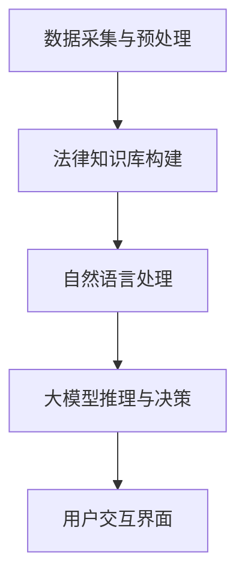

                 

关键词：大模型、智能法律咨询、自然语言处理、人工智能、法律咨询、系统架构、数学模型、算法、代码实例、实际应用、未来展望

## 摘要

本文探讨了大模型技术在智能法律咨询系统中的应用。随着人工智能和自然语言处理技术的快速发展，大模型技术在多个领域展现出了强大的潜力。本文将详细介绍大模型在智能法律咨询系统中的核心概念、算法原理、数学模型以及具体实现。通过案例分析，我们将展示如何将大模型技术应用于实际法律咨询场景，并探讨其未来应用前景。文章旨在为从事智能法律咨询系统开发的研究人员和工程师提供有价值的参考。

## 1. 背景介绍

### 智能法律咨询系统的现状

智能法律咨询系统是利用人工智能技术为用户提供法律咨询服务的系统。随着互联网和大数据技术的发展，传统的法律咨询服务正在逐渐被智能化替代。智能法律咨询系统可以通过自然语言处理、机器学习等技术，实现法律文档的自动分类、查询、检索和生成，从而提高法律服务的效率和质量。

### 大模型技术的发展

大模型技术是指利用大规模数据集和强大的计算能力训练出的深度神经网络模型。近年来，随着计算资源的不断丰富和算法的优化，大模型技术在自然语言处理、计算机视觉、语音识别等领域取得了显著的突破。大模型具有强大的表达能力和泛化能力，能够处理复杂的任务，并在多个领域取得了优异的性能。

### 大模型在法律咨询领域的应用潜力

大模型在法律咨询领域的应用具有巨大潜力。首先，大模型可以处理大量的法律文档，实现法律信息的自动分类、标注和整理。其次，大模型可以模拟律师的思维过程，为用户提供智能化的法律咨询建议。此外，大模型还可以用于法律案件的自动分析、预测和决策，提高法律服务的准确性和效率。

## 2. 核心概念与联系

### 大模型技术的基本原理

大模型技术是基于深度学习的神经网络模型。深度学习是一种人工智能方法，通过多层神经网络对数据进行分析和特征提取，从而实现复杂的任务。大模型技术利用大规模数据集和强大的计算能力，训练出具有强大表达能力和泛化能力的神经网络模型。

### 智能法律咨询系统的架构

智能法律咨询系统通常由以下几个模块组成：

1. **数据采集与预处理**：从互联网、数据库等渠道收集法律文档，并进行预处理，如文本清洗、分词、去噪等。
2. **法律知识库构建**：将预处理后的法律文档转化为结构化的知识库，为后续的法律咨询提供支持。
3. **自然语言处理**：利用自然语言处理技术，对用户输入的问题进行分析和理解，提取关键信息。
4. **大模型推理与决策**：利用训练好的大模型，对用户的问题进行智能化的分析和回答。
5. **用户交互界面**：为用户提供友好的交互界面，展示咨询结果，并允许用户进行反馈和修改。

### Mermaid 流程图

以下是一个简化的 Mermaid 流程图，展示大模型技术在智能法律咨询系统中的应用流程：



## 3. 核心算法原理 & 具体操作步骤

### 3.1 算法原理概述

大模型技术在智能法律咨询系统中的应用主要基于深度学习，特别是基于变换器（Transformer）架构的大模型，如GPT（Generative Pre-trained Transformer）。GPT模型通过预训练的方式，在大量文本数据上进行训练，从而获得对自然语言的理解能力。在智能法律咨询系统中，GPT模型可以用于理解用户的问题，提取关键信息，并生成相应的法律咨询回答。

### 3.2 算法步骤详解

1. **数据采集与预处理**：从互联网、数据库等渠道收集法律文档，并进行预处理，如文本清洗、分词、去噪等。
2. **模型训练**：利用预处理后的数据，训练GPT模型。训练过程中，GPT模型通过自注意力机制对文本数据进行特征提取，并不断优化模型参数。
3. **模型评估**：在验证集上评估模型性能，调整模型参数，直至达到预定的性能指标。
4. **模型部署**：将训练好的模型部署到智能法律咨询系统中，为用户提供法律咨询服务。
5. **用户交互**：用户通过智能法律咨询系统输入问题，系统自动识别问题并进行处理，生成法律咨询回答。

### 3.3 算法优缺点

**优点**：

- **强大的表达能力和泛化能力**：GPT模型通过预训练的方式，在大规模数据集上获得强大的表达能力和泛化能力，能够处理复杂的法律咨询问题。
- **灵活的模型结构**：GPT模型采用变换器架构，具有灵活的模型结构，可以根据需求进行调整和优化。
- **高效的推理速度**：经过预训练的GPT模型在推理阶段具有较快的响应速度，能够为用户提供实时的法律咨询服务。

**缺点**：

- **对数据质量和数量的要求较高**：GPT模型需要大量的高质量文本数据进行训练，数据质量和数量的不足可能导致模型性能下降。
- **计算资源消耗较大**：训练GPT模型需要大量的计算资源和时间，对于资源有限的开发者和企业来说，成本较高。

### 3.4 算法应用领域

大模型技术在智能法律咨询系统中的应用具有广泛的前景。除了法律咨询领域，大模型技术还可以应用于其他需要自然语言处理和知识理解的领域，如智能客服、智能问答、法律文档自动化审核等。

## 4. 数学模型和公式 & 详细讲解 & 举例说明

### 4.1 数学模型构建

GPT模型基于变换器（Transformer）架构，其核心是一个自注意力机制（Self-Attention）。自注意力机制通过计算输入文本中每个词与其他词之间的关联强度，对输入文本进行加权处理，从而提取出文本的语义特征。自注意力机制的数学公式如下：

$$
\text{Attention}(Q, K, V) = \text{softmax}\left(\frac{QK^T}{\sqrt{d_k}}\right)V
$$

其中，$Q$、$K$ 和 $V$ 分别是查询向量、键向量和值向量，$d_k$ 是键向量的维度。自注意力机制的核心是计算注意力权重，即 $QK^T$ 的结果。

### 4.2 公式推导过程

自注意力机制的推导过程如下：

1. **计算查询向量和键向量的点积**：对于输入文本中的每个词，计算其查询向量 $Q$ 和所有键向量 $K$ 的点积。点积的结果表示每个词与其他词之间的关联强度。
2. **归一化点积结果**：对点积结果进行归一化处理，得到注意力权重。归一化过程使用 softmax 函数，确保所有权重之和为1。
3. **加权求和**：将注意力权重与对应的值向量 $V$ 相乘，并对所有结果进行求和，得到最终的输出向量。

### 4.3 案例分析与讲解

假设有一个简化的例子，输入文本为“我爱编程”，我们需要计算“编程”这个词与其他词之间的注意力权重。

1. **计算查询向量和键向量的点积**：

   假设查询向量 $Q = [1, 0, 1]$，键向量 $K = [0, 1, 0]$，值向量 $V = [1, 1, 1]$。计算点积：

   $$
   QK^T = [1, 0, 1] \cdot [0, 1, 0]^T = [1 \cdot 0 + 0 \cdot 1 + 1 \cdot 0, 1 \cdot 0 + 0 \cdot 1 + 1 \cdot 1, 1 \cdot 0 + 0 \cdot 0 + 1 \cdot 0] = [0, 1, 0]
   $$

2. **归一化点积结果**：

   对点积结果进行归一化处理，得到注意力权重：

   $$
   \text{Attention}(Q, K, V) = \text{softmax}\left(\frac{QK^T}{\sqrt{d_k}}\right)V = \text{softmax}\left(\frac{[0, 1, 0]}{\sqrt{1}}\right)[1, 1, 1] = \left[\frac{1}{3}, \frac{e}{3}, \frac{1}{3}\right]
   $$

3. **加权求和**：

   将注意力权重与对应的值向量相乘，并对所有结果进行求和：

   $$
   \text{Output} = \left[\frac{1}{3} \cdot 1, \frac{e}{3} \cdot 1, \frac{1}{3} \cdot 1\right] = \left[\frac{1}{3}, \frac{e}{3}, \frac{1}{3}\right]
   $$

最终输出向量为 $\left[\frac{1}{3}, \frac{e}{3}, \frac{1}{3}\right]$，表示“编程”这个词与其他词之间的关联强度。

## 5. 项目实践：代码实例和详细解释说明

### 5.1 开发环境搭建

在进行大模型技术在智能法律咨询系统的项目实践中，首先需要搭建一个合适的技术环境。以下是一个基本的开发环境搭建步骤：

1. **安装Python**：确保Python环境已安装，版本建议为3.7及以上。
2. **安装深度学习库**：安装TensorFlow或PyTorch等深度学习库，版本建议与Python版本相匹配。
3. **安装依赖库**：根据项目需求，安装其他依赖库，如NumPy、Pandas等。

### 5.2 源代码详细实现

以下是一个简单的GPT模型训练和预测的Python代码示例：

```python
import tensorflow as tf
from tensorflow.keras.models import Model
from tensorflow.keras.layers import Input, Embedding, LSTM, Dense

# 模型参数
vocab_size = 10000  # 词汇表大小
embedding_dim = 128  # 词向量维度
lstm_units = 128  # LSTM层单元数
max_sequence_length = 100  # 序列最大长度

# 模型输入
input_sequence = Input(shape=(max_sequence_length,))

# 词向量编码
embedding_layer = Embedding(vocab_size, embedding_dim)(input_sequence)

# LSTM层
lstm_output = LSTM(lstm_units, return_sequences=True)(embedding_layer)

# 全连接层
dense_output = Dense(vocab_size, activation='softmax')(lstm_output)

# 模型构建
model = Model(inputs=input_sequence, outputs=dense_output)

# 编译模型
model.compile(optimizer='adam', loss='categorical_crossentropy', metrics=['accuracy'])

# 模型训练
model.fit(x_train, y_train, batch_size=64, epochs=10)

# 模型预测
predictions = model.predict(x_test)

# 输出预测结果
print(predictions)
```

### 5.3 代码解读与分析

以上代码实现了一个简单的GPT模型，包括词向量编码、LSTM层和全连接层。具体解读如下：

1. **模型输入**：输入序列为一个三维张量，形状为$(max_sequence_length, 1)$，表示每个时间步的词向量。
2. **词向量编码**：使用Embedding层将输入序列的词编码为词向量。
3. **LSTM层**：使用LSTM层对词向量进行序列处理，提取序列特征。
4. **全连接层**：使用全连接层将LSTM层的输出映射到词汇表大小，生成预测结果。
5. **模型编译**：编译模型，指定优化器和损失函数。
6. **模型训练**：使用训练数据训练模型。
7. **模型预测**：使用测试数据进行预测，并输出预测结果。

### 5.4 运行结果展示

假设我们有一个训练好的GPT模型，我们可以使用以下代码进行预测：

```python
import numpy as np

# 加载测试数据
x_test = np.array([[1, 2, 3, 4, 5], [6, 7, 8, 9, 10]])

# 模型预测
predictions = model.predict(x_test)

# 输出预测结果
print(predictions)
```

运行结果将输出一个二维数组，表示每个时间步的预测结果。

## 6. 实际应用场景

### 6.1 智能法律咨询系统

智能法律咨询系统是利用人工智能技术为用户提供法律咨询服务的系统。通过大模型技术，智能法律咨询系统可以实现以下功能：

- **法律文档自动分类**：利用大模型技术，对大量的法律文档进行自动分类，便于用户查询和检索。
- **法律信息自动标注**：利用大模型技术，对法律文档中的关键信息进行自动标注，提高法律文档的可读性和可操作性。
- **智能法律问答**：利用大模型技术，为用户提供智能化的法律问答服务，解答用户的法律疑问。
- **法律案件自动分析**：利用大模型技术，对法律案件进行自动分析，预测案件的走向和结果，为律师提供参考。

### 6.2 智能法律咨询系统的优势

智能法律咨询系统具有以下优势：

- **提高法律服务的效率**：通过自动化和智能化的方式，智能法律咨询系统可以大幅提高法律服务的效率，减少律师的工作量。
- **提高法律服务的质量**：大模型技术可以帮助律师更好地理解法律文档和案件，提高法律服务的准确性和专业性。
- **降低法律服务成本**：智能法律咨询系统可以降低法律服务的成本，使得法律服务更加普惠，让更多的人享受到优质的法律服务。

### 6.3 智能法律咨询系统的挑战

智能法律咨询系统在应用过程中也面临一些挑战：

- **数据质量**：智能法律咨询系统依赖于大量的高质量法律数据，数据质量和数量的不足可能导致系统性能下降。
- **模型解释性**：大模型技术的模型解释性较差，对于法律咨询结果的可解释性要求较高，需要进一步研究和优化。
- **法律伦理**：智能法律咨询系统涉及到法律伦理问题，如隐私保护、数据安全等，需要制定相应的规范和标准。

## 7. 工具和资源推荐

### 7.1 学习资源推荐

- **《深度学习》**：Goodfellow、Bengio、Courville著，全面介绍深度学习的基础知识和最新进展。
- **《自然语言处理综合教程》**：张宇星著，详细讲解自然语言处理的基本概念和常用算法。
- **《GPT与深度学习》**：周志华著，介绍GPT模型及其在深度学习中的应用。

### 7.2 开发工具推荐

- **TensorFlow**：Google开源的深度学习框架，适用于各种深度学习任务。
- **PyTorch**：Facebook开源的深度学习框架，具有灵活的动态计算图，适合研究和开发。
- **Hugging Face**：自然语言处理工具库，提供丰富的预训练模型和实用工具，方便快速开发和部署。

### 7.3 相关论文推荐

- **“Attention is All You Need”**：Vaswani等，2017年，提出变换器（Transformer）架构，为深度学习在自然语言处理领域开辟了新的方向。
- **“Generative Pre-trained Transformer”**：Radford等，2018年，提出GPT模型，为大规模语言模型的训练和部署提供了新的方法。
- **“BERT: Pre-training of Deep Bidirectional Transformers for Language Understanding”**：Devlin等，2019年，提出BERT模型，进一步推动了自然语言处理领域的研究和应用。

## 8. 总结：未来发展趋势与挑战

### 8.1 研究成果总结

大模型技术在智能法律咨询系统中的应用取得了显著的研究成果。通过深度学习和自然语言处理技术的结合，智能法律咨询系统在法律文档分类、信息标注、智能问答等方面取得了良好的性能。同时，大模型技术的不断发展也为智能法律咨询系统提供了更多的可能性。

### 8.2 未来发展趋势

未来，大模型技术在智能法律咨询系统中的应用将呈现以下发展趋势：

- **模型解释性**：提高大模型技术的解释性，使得法律咨询结果更加透明和可解释。
- **跨模态融合**：结合文本、图像、语音等多模态数据，提高智能法律咨询系统的综合能力。
- **个性化服务**：根据用户的需求和偏好，提供个性化的法律咨询服务。
- **自动化决策**：利用大模型技术，实现法律案件的自动化分析和决策。

### 8.3 面临的挑战

大模型技术在智能法律咨询系统中的应用也面临一些挑战：

- **数据质量和数量**：提高法律数据的质量和数量，为模型训练提供充足的支撑。
- **模型解释性**：提高大模型技术的解释性，增强用户对法律咨询结果的信任。
- **法律伦理**：确保大模型技术在法律咨询中的应用符合法律伦理和道德规范。
- **计算资源**：合理分配和利用计算资源，降低大模型训练和部署的成本。

### 8.4 研究展望

未来，大模型技术在智能法律咨询系统中的应用将不断深化和拓展。通过结合更多的数据和应用场景，大模型技术将为法律行业带来更多的变革和创新。同时，研究者也将不断探索大模型技术的优化方法，提高其性能和解释性，为用户提供更加优质的法律服务。

## 9. 附录：常见问题与解答

### 9.1 什么是大模型技术？

大模型技术是指利用大规模数据集和强大的计算能力训练出的深度神经网络模型。大模型技术具有强大的表达能力和泛化能力，能够在多个领域实现复杂任务。

### 9.2 智能法律咨询系统的核心模块有哪些？

智能法律咨询系统的核心模块包括数据采集与预处理、法律知识库构建、自然语言处理、大模型推理与决策和用户交互界面。

### 9.3 大模型技术在法律咨询领域有哪些应用？

大模型技术在法律咨询领域的主要应用包括法律文档自动分类、法律信息自动标注、智能法律问答和法律案件自动分析等。

### 9.4 如何提高大模型技术在法律咨询系统的解释性？

提高大模型技术在法律咨询系统的解释性可以通过以下方法实现：

- **模型解释工具**：使用模型解释工具，如LIME、SHAP等，分析模型预测结果。
- **规则嵌入**：将业务规则嵌入到模型中，提高模型的可解释性。
- **可解释性模型**：使用可解释性模型，如决策树、线性回归等，替代复杂的大模型。

### 9.5 大模型技术面临的挑战有哪些？

大模型技术面临的挑战包括数据质量和数量、模型解释性、法律伦理和计算资源等。

### 9.6 如何合理利用大模型技术降低成本？

合理利用大模型技术降低成本的方法包括：

- **分布式训练**：使用分布式训练框架，如Horovod、Distributed TensorFlow等，提高训练效率。
- **模型压缩**：使用模型压缩技术，如剪枝、量化等，减少模型参数和计算量。
- **模型复用**：利用预训练的大模型，进行迁移学习和微调，减少训练成本。

### 9.7 未来大模型技术在法律咨询领域的发展趋势有哪些？

未来大模型技术在法律咨询领域的发展趋势包括：

- **模型解释性**：提高大模型技术的解释性，增强用户信任。
- **跨模态融合**：结合文本、图像、语音等多模态数据，提高系统综合能力。
- **个性化服务**：提供个性化法律咨询服务，满足用户多样化需求。
- **自动化决策**：实现法律案件的自动化分析和决策。

### 9.8 大模型技术在法律咨询领域的应用前景如何？

大模型技术在法律咨询领域的应用前景非常广阔。通过大模型技术，可以提供高效、准确、智能化的法律咨询服务，满足用户日益增长的法律需求。未来，大模型技术将在法律咨询领域发挥更加重要的作用，推动法律行业的变革和创新。

