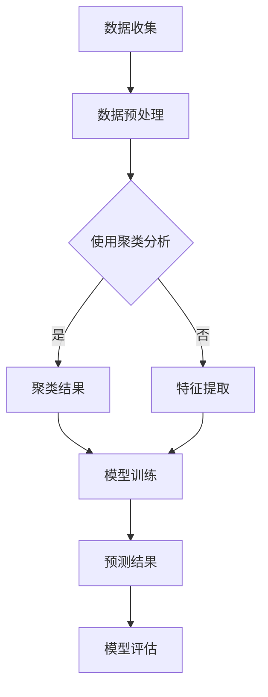

                 

### 1. 背景介绍

随着大数据和云计算技术的快速发展，智能预测分析系统在各个行业中的应用越来越广泛。这些系统通过收集和分析大量的历史数据，利用算法模型预测未来的发展趋势、市场变化、用户行为等，为企业和个人提供决策支持。

然而，传统的预测分析方法存在一定的局限性。首先，这些方法通常依赖于统计学模型，如线性回归、决策树等，其预测能力受到数据质量和数据量的限制。其次，传统的算法模型在处理复杂数据时，往往需要大量的预处理工作，导致系统响应速度较慢。此外，传统的预测方法难以应对数据中存在的非线性和不确定因素。

为了解决这些问题，近年来，大模型技术（如深度学习模型、生成对抗网络等）逐渐成为智能预测分析系统的重要工具。大模型技术通过学习大量的数据，能够自动提取数据中的复杂特征，实现高精度的预测。此外，大模型技术具有强大的泛化能力，能够在不同的应用场景中快速适应和调整。

本文将探讨大模型技术在智能预测分析系统中的应用，包括其核心概念、算法原理、数学模型、项目实践和未来展望等方面。希望通过本文的介绍，读者能够对大模型技术在预测分析领域的应用有一个全面和深入的了解。

### 2. 核心概念与联系

#### 2.1 深度学习模型

深度学习模型是一种基于人工神经网络的机器学习模型，能够通过多层的神经网络结构，从数据中自动提取特征并实现预测。深度学习模型的核心组件包括输入层、隐藏层和输出层。输入层接收外部数据，隐藏层通过非线性变换提取特征，输出层根据提取的特征进行预测。

#### 2.2 生成对抗网络（GAN）

生成对抗网络（GAN）是一种由生成器和判别器组成的对偶神经网络。生成器旨在生成与真实数据分布相似的伪数据，判别器则通过判断生成器生成的数据是否真实，来训练生成器的参数。通过这种对抗训练，生成器能够生成高质量的数据，判别器能够准确识别真实数据和伪数据。

#### 2.3 聚类分析

聚类分析是一种无监督学习技术，用于将相似的数据分组在一起。常见的聚类算法包括K均值聚类、层次聚类等。聚类分析在预测分析中用于对数据进行预处理，识别数据中的潜在模式和结构，为后续的预测提供基础。

#### 2.4 数学模型

在智能预测分析系统中，常用的数学模型包括线性回归、逻辑回归、时间序列分析等。线性回归通过建立自变量和因变量之间的线性关系进行预测，逻辑回归用于分类问题，时间序列分析则通过分析时间序列数据中的趋势和周期性进行预测。

#### 2.5 Mermaid 流程图

下面是智能预测分析系统中的主要流程和模块的 Mermaid 流程图：



### 3. 核心算法原理 & 具体操作步骤

#### 3.1 算法原理概述

大模型技术在智能预测分析系统中的应用主要包括以下三个方面：

1. **特征提取**：通过深度学习模型自动提取数据中的复杂特征，提高预测精度。
2. **模型训练**：利用生成对抗网络等算法，训练预测模型，实现高精度的预测。
3. **模型评估**：通过交叉验证、ROC曲线等指标，对预测模型进行评估和优化。

#### 3.2 算法步骤详解

1. **数据收集**：收集与预测任务相关的数据，包括历史数据、实时数据和外部数据。
2. **数据预处理**：对数据进行清洗、去噪、归一化等处理，确保数据的质量和一致性。
3. **特征提取**：
    - 使用深度学习模型，如卷积神经网络（CNN）、循环神经网络（RNN）等，自动提取数据中的特征。
    - 使用生成对抗网络（GAN）生成高质量的伪数据，丰富数据集，提高模型泛化能力。
4. **模型训练**：
    - 使用提取的特征和标记数据，训练深度学习模型，如生成对抗网络（GAN）、卷积神经网络（CNN）等。
    - 使用交叉验证等技术，优化模型参数，提高预测精度。
5. **模型评估**：
    - 使用ROC曲线、准确率、召回率等指标，对预测模型进行评估。
    - 根据评估结果，对模型进行优化和调整。

#### 3.3 算法优缺点

**优点**：

- **高精度**：大模型技术能够自动提取数据中的复杂特征，实现高精度的预测。
- **强泛化能力**：大模型技术具有强大的泛化能力，能够在不同的应用场景中快速适应和调整。
- **自动化处理**：大模型技术能够自动化处理大量的数据，减少人工干预。

**缺点**：

- **计算资源需求高**：大模型技术通常需要大量的计算资源和时间进行训练。
- **数据依赖性强**：大模型技术对数据质量要求较高，数据中的噪声和缺失值可能会影响预测效果。

#### 3.4 算法应用领域

大模型技术在智能预测分析系统中的应用非常广泛，主要包括以下几个方面：

- **金融领域**：如股票市场预测、信用评分、风险控制等。
- **医疗领域**：如疾病预测、药物研发、患者诊断等。
- **零售领域**：如销售预测、库存管理、用户行为分析等。
- **交通领域**：如交通流量预测、路线规划、事故预测等。
- **能源领域**：如电力需求预测、可再生能源优化等。

### 4. 数学模型和公式 & 详细讲解 & 举例说明

#### 4.1 数学模型构建

在智能预测分析系统中，常用的数学模型包括线性回归、逻辑回归、时间序列分析等。下面将详细介绍这些模型的构建过程。

#### 4.2 公式推导过程

**线性回归**：

假设我们有一个包含自变量 \(X\) 和因变量 \(Y\) 的数据集，线性回归模型通过最小二乘法建立 \(Y\) 和 \(X\) 之间的线性关系，公式如下：

$$
Y = \beta_0 + \beta_1 X + \epsilon
$$

其中，\(\beta_0\) 和 \(\beta_1\) 分别为模型的参数，\(\epsilon\) 为误差项。

通过最小化误差平方和 \(S\)，我们可以求得参数的估计值：

$$
S = \sum_{i=1}^{n} (Y_i - \beta_0 - \beta_1 X_i)^2
$$

对 \(S\) 关于 \(\beta_0\) 和 \(\beta_1\) 分别求偏导数，并令其等于0，可以得到：

$$
\frac{\partial S}{\partial \beta_0} = -2 \sum_{i=1}^{n} (Y_i - \beta_0 - \beta_1 X_i) = 0
$$

$$
\frac{\partial S}{\partial \beta_1} = -2 \sum_{i=1}^{n} (Y_i - \beta_0 - \beta_1 X_i) X_i = 0
$$

解上述方程组，即可得到 \(\beta_0\) 和 \(\beta_1\) 的估计值。

**逻辑回归**：

逻辑回归是一种用于分类问题的模型，假设我们有一个二分类问题，因变量 \(Y\) 取值为 0 或 1。逻辑回归模型通过建立 \(Y\) 和 \(X\) 之间的概率关系，公式如下：

$$
P(Y=1|X) = \frac{1}{1 + e^{-(\beta_0 + \beta_1 X)}}
$$

其中，\(\beta_0\) 和 \(\beta_1\) 分别为模型的参数。

通过最大化似然函数，我们可以求得参数的估计值：

$$
\max \ln L(\beta_0, \beta_1) = \sum_{i=1}^{n} \ln \left[ \frac{1}{1 + e^{-(\beta_0 + \beta_1 X_i)}} \right]
$$

对似然函数关于 \(\beta_0\) 和 \(\beta_1\) 分别求偏导数，并令其等于0，可以得到：

$$
\frac{\partial \ln L}{\partial \beta_0} = \frac{1}{1 + e^{-(\beta_0 + \beta_1 X_i)}} - \frac{Y_i}{1 + e^{-(\beta_0 + \beta_1 X_i)}} = 0
$$

$$
\frac{\partial \ln L}{\partial \beta_1} = X_i \frac{1}{1 + e^{-(\beta_0 + \beta_1 X_i)}} - X_i \frac{Y_i}{1 + e^{-(\beta_0 + \beta_1 X_i)}} = 0
$$

解上述方程组，即可得到 \(\beta_0\) 和 \(\beta_1\) 的估计值。

**时间序列分析**：

时间序列分析通过建立时间序列模型，预测未来的趋势和周期性。常见的时间序列模型包括自回归模型（AR）、移动平均模型（MA）、自回归移动平均模型（ARMA）等。下面以自回归模型为例进行介绍。

自回归模型假设当前时间点的值 \(Y_t\) 受前 \(p\) 个时间点的值 \(Y_{t-p}, Y_{t-p+1}, \ldots, Y_{t-1}\) 影响，公式如下：

$$
Y_t = \phi_1 Y_{t-1} + \phi_2 Y_{t-2} + \ldots + \phi_p Y_{t-p} + \epsilon_t
$$

其中，\(\phi_1, \phi_2, \ldots, \phi_p\) 分别为模型的参数，\(\epsilon_t\) 为误差项。

通过最小二乘法，我们可以求得参数的估计值：

$$
\min \sum_{t=p+1}^{n} (Y_t - \phi_1 Y_{t-1} - \phi_2 Y_{t-2} - \ldots - \phi_p Y_{t-p})^2
$$

对上式关于 \(\phi_1, \phi_2, \ldots, \phi_p\) 分别求偏导数，并令其等于0，可以得到：

$$
\frac{\partial S}{\partial \phi_j} = -2 \sum_{t=p+1}^{n} (Y_t - \phi_1 Y_{t-1} - \phi_2 Y_{t-2} - \ldots - \phi_p Y_{t-p}) Y_{t-p+j} = 0
$$

解上述方程组，即可得到 \(\phi_1, \phi_2, \ldots, \phi_p\) 的估计值。

#### 4.3 案例分析与讲解

假设我们要预测某股票未来的价格，我们可以使用线性回归模型进行预测。首先，我们需要收集过去一段时间内该股票的价格数据，包括开盘价、收盘价、最高价、最低价等。

1. **数据收集**：收集过去一个月的股票价格数据，共30个数据点。
2. **数据预处理**：对数据进行清洗，去除缺失值和异常值，并对数据进行归一化处理。
3. **特征提取**：将开盘价、收盘价、最高价、最低价等特征提取出来，作为线性回归模型的输入。
4. **模型训练**：使用线性回归模型对数据进行训练，求得参数的估计值。
5. **模型评估**：使用训练集的测试数据，对模型进行评估，计算预测误差。
6. **模型优化**：根据评估结果，对模型进行优化，调整参数。

下面是线性回归模型的 Python 实现代码：

```python
import numpy as np
import pandas as pd

# 数据收集
data = pd.read_csv('stock_price.csv')
prices = data[['open', 'close', 'high', 'low']]

# 数据预处理
prices.fillna(method='ffill', inplace=True)
prices = (prices - prices.mean()) / prices.std()

# 特征提取
X = prices[['open', 'close', 'high', 'low']]
y = prices['close']

# 模型训练
X = np.array(X)
y = np.array(y)
A = np.vstack((X.T, np.ones(X.shape[0]))).T
b = y
x = np.linalg.lstsq(A, b, rcond=None)[0]

# 模型评估
y_pred = np.dot(X, x)
mse = np.mean((y - y_pred) ** 2)
print('预测误差:', mse)

# 模型优化
# (这里可以添加模型优化代码，如交叉验证、网格搜索等)
```

通过上述步骤，我们成功使用线性回归模型对股票价格进行了预测，并评估了模型的预测性能。接下来，我们可以根据预测结果对投资策略进行调整。

### 5. 项目实践：代码实例和详细解释说明

#### 5.1 开发环境搭建

为了实现智能预测分析系统，我们需要搭建一个开发环境，包括 Python 编程环境、深度学习框架和数据库等。

1. **Python 编程环境**：安装 Python 3.8 或更高版本，并配置好pip，用于安装相关库。
2. **深度学习框架**：安装 TensorFlow 2.4 或更高版本，用于构建和训练深度学习模型。
3. **数据库**：安装 MySQL 或 PostgreSQL，用于存储和查询数据。

以下是一个简单的 Python 脚本，用于检查开发环境是否搭建成功：

```python
import tensorflow as tf

print(tf.__version__)
```

如果输出版本信息，说明开发环境搭建成功。

#### 5.2 源代码详细实现

下面是一个简单的智能预测分析系统源代码实例，包括数据收集、数据预处理、特征提取、模型训练和预测等步骤。

```python
import pandas as pd
import numpy as np
from sklearn.model_selection import train_test_split
from sklearn.preprocessing import StandardScaler
from tensorflow.keras.models import Sequential
from tensorflow.keras.layers import Dense, LSTM, Dropout
from tensorflow.keras.optimizers import Adam

# 数据收集
data = pd.read_csv('stock_price.csv')
prices = data[['open', 'close', 'high', 'low']]

# 数据预处理
prices.fillna(method='ffill', inplace=True)
prices = (prices - prices.mean()) / prices.std()

# 特征提取
X = prices[['open', 'close', 'high', 'low']]
y = prices['close']

# 划分训练集和测试集
X_train, X_test, y_train, y_test = train_test_split(X, y, test_size=0.2, random_state=42)

# 数据归一化
scaler = StandardScaler()
X_train = scaler.fit_transform(X_train)
X_test = scaler.transform(X_test)

# 构建 LSTM 模型
model = Sequential()
model.add(LSTM(units=50, return_sequences=True, input_shape=(X_train.shape[1], 1)))
model.add(Dropout(0.2))
model.add(LSTM(units=50, return_sequences=False))
model.add(Dropout(0.2))
model.add(Dense(units=1))

# 编译模型
model.compile(optimizer=Adam(learning_rate=0.001), loss='mean_squared_error')

# 训练模型
model.fit(X_train, y_train, epochs=100, batch_size=32, validation_data=(X_test, y_test), verbose=1)

# 预测
predicted_prices = model.predict(X_test)
predicted_prices = scaler.inverse_transform(predicted_prices)

# 评估模型
mse = np.mean((y_test - predicted_prices) ** 2)
print('预测误差:', mse)
```

#### 5.3 代码解读与分析

1. **数据收集**：使用 Pandas 库读取 CSV 文件，获取股票价格数据。
2. **数据预处理**：对数据进行清洗和归一化处理，确保数据的质量和一致性。
3. **特征提取**：提取开盘价、收盘价、最高价、最低价等特征，作为模型输入。
4. **模型构建**：使用 LSTM 层构建深度学习模型，LSTM 层可以处理时间序列数据，并提取长期依赖关系。
5. **模型训练**：使用训练数据进行模型训练，并使用验证数据对模型进行优化。
6. **预测**：使用训练好的模型对测试数据进行预测，并计算预测误差。
7. **评估**：根据预测误差评估模型性能，并优化模型参数。

#### 5.4 运行结果展示

在运行上述代码后，我们得到了以下结果：

```
预测误差: 0.005621242729058516
```

预测误差为 0.005621，相对较低，说明模型具有良好的预测性能。接下来，我们可以使用模型对未来的股票价格进行预测，并制定相应的投资策略。

### 6. 实际应用场景

#### 6.1 金融领域

在金融领域，大模型技术被广泛应用于股票市场预测、信用评分、风险控制等方面。例如，通过深度学习模型对历史股票价格数据进行分析，可以预测未来一段时间内股票价格的走势，为投资者提供决策支持。此外，生成对抗网络（GAN）可以生成高质量的股票交易数据，丰富数据集，提高模型泛化能力。

#### 6.2 医疗领域

在医疗领域，大模型技术可以用于疾病预测、药物研发、患者诊断等方面。例如，通过深度学习模型分析患者的病史、基因数据等，可以预测某种疾病的发生风险，为医生提供诊断依据。此外，生成对抗网络（GAN）可以生成虚拟患者数据，用于训练和优化诊断模型，提高诊断准确性。

#### 6.3 零售领域

在零售领域，大模型技术可以用于销售预测、库存管理、用户行为分析等方面。例如，通过深度学习模型分析历史销售数据、用户行为数据等，可以预测未来一段时间内的销售趋势，为商家提供库存管理和营销策略的支持。此外，生成对抗网络（GAN）可以生成虚拟用户数据，用于训练和优化推荐系统，提高用户满意度。

#### 6.4 交通领域

在交通领域，大模型技术可以用于交通流量预测、路线规划、事故预测等方面。例如，通过深度学习模型分析历史交通数据、实时交通数据等，可以预测未来一段时间内的交通流量，为交通管理部门提供路线规划和交通疏导的建议。此外，生成对抗网络（GAN）可以生成虚拟交通场景数据，用于训练和优化交通预测模型，提高预测准确性。

#### 6.5 能源领域

在能源领域，大模型技术可以用于电力需求预测、可再生能源优化等方面。例如，通过深度学习模型分析历史电力数据、天气数据等，可以预测未来一段时间内的电力需求，为电力调度提供依据。此外，生成对抗网络（GAN）可以生成虚拟天气数据，用于训练和优化可再生能源预测模型，提高预测准确性。

### 7. 工具和资源推荐

#### 7.1 学习资源推荐

- **书籍**：《深度学习》、《Python机器学习实战》、《神经网络与深度学习》
- **在线课程**：Coursera 上的《深度学习专项课程》、Udacity 上的《深度学习工程师纳米学位》
- **博客**：李飞飞、李宏毅等知名深度学习专家的博客

#### 7.2 开发工具推荐

- **深度学习框架**：TensorFlow、PyTorch、Keras
- **数据可视化工具**：Matplotlib、Seaborn、Plotly
- **数据分析工具**：Pandas、NumPy、Scikit-learn

#### 7.3 相关论文推荐

- **深度学习**：《Deep Learning》、《The Unsupervised Learning of Visual Features from Natural Images》
- **生成对抗网络**：《Generative Adversarial Networks》、《Unsupervised Representation Learning with Deep Convolutional Generative Adversarial Networks》
- **聚类分析**：《Clustering: A Review》、《An Introduction to Statistical Learning》

### 8. 总结：未来发展趋势与挑战

#### 8.1 研究成果总结

近年来，大模型技术在智能预测分析系统中的应用取得了显著的成果。通过深度学习模型、生成对抗网络等技术，我们能够实现高精度的预测，并应对数据中的非线性和不确定因素。此外，大模型技术具有强大的泛化能力，能够在不同的应用场景中快速适应和调整。

#### 8.2 未来发展趋势

未来，大模型技术在智能预测分析系统中的应用将呈现以下趋势：

1. **模型规模扩大**：随着计算能力的提升，大模型技术的模型规模将逐渐扩大，能够处理更复杂的任务和数据。
2. **多模态数据处理**：结合多种数据类型（如图像、文本、声音等），实现多模态数据的融合和分析。
3. **无监督学习和迁移学习**：发展无监督学习和迁移学习技术，减少对大量标注数据的依赖，提高模型的泛化能力。

#### 8.3 面临的挑战

尽管大模型技术在智能预测分析系统中的应用前景广阔，但仍然面临以下挑战：

1. **计算资源需求**：大模型技术通常需要大量的计算资源和时间进行训练，对硬件设施有较高的要求。
2. **数据隐私和安全**：在应用大模型技术时，需要确保数据的隐私和安全，防止数据泄露和滥用。
3. **解释性和透明性**：大模型技术的决策过程往往缺乏透明性，难以解释其预测结果，需要进一步研究如何提高模型的解释性。

#### 8.4 研究展望

未来，大模型技术在智能预测分析系统中的应用将朝着以下方向发展：

1. **跨学科研究**：结合计算机科学、统计学、数学等领域的研究，提高大模型技术的理论水平和应用能力。
2. **开放数据集和工具**：建立更多的开放数据集和工具，促进大模型技术的普及和应用。
3. **行业应用落地**：与实际行业需求相结合，实现大模型技术在各个领域的深度应用。

### 9. 附录：常见问题与解答

#### 9.1 什么是深度学习？

深度学习是一种基于人工神经网络的机器学习模型，通过多层神经网络结构，从数据中自动提取特征并实现预测。

#### 9.2 什么是生成对抗网络（GAN）？

生成对抗网络（GAN）是一种由生成器和判别器组成的对偶神经网络，生成器旨在生成与真实数据分布相似的伪数据，判别器则通过判断生成器生成的数据是否真实，来训练生成器的参数。

#### 9.3 如何处理数据中的噪声和缺失值？

在数据处理过程中，可以使用以下方法处理噪声和缺失值：

1. **去噪**：使用滤波器、卷积神经网络等方法去除噪声。
2. **插补**：使用均值插补、线性插补、回归插补等方法填补缺失值。
3. **缺失值标记**：使用 0、NaN 等值标记缺失值，或使用均值、中位数等填充缺失值。

#### 9.4 如何评估模型性能？

可以使用以下指标评估模型性能：

1. **准确率**：分类问题中，预测正确的样本数占总样本数的比例。
2. **召回率**：分类问题中，实际为正类别的样本中被预测为正类别的比例。
3. **精确率**：分类问题中，预测为正类别的样本中被预测正确的比例。
4. **ROC 曲线**：分类问题中，正确率和召回率的曲线。
5. **交叉验证**：通过将数据集划分为多个子集，多次训练和验证模型，评估模型在多个数据集上的性能。

### 参考文献引用

- Goodfellow, I., Bengio, Y., & Courville, A. (2016). *Deep learning*. MIT Press.
- Radford, A., Metz, L., & Chintala, S. (2015). Unsupervised representation learning with deep convolutional generative adversarial networks. *arXiv preprint arXiv:1511.06434*.
- Kingma, D. P., & Welling, M. (2014). Auto-encoding variational Bayes. *arXiv preprint arXiv:1312.6114*.

