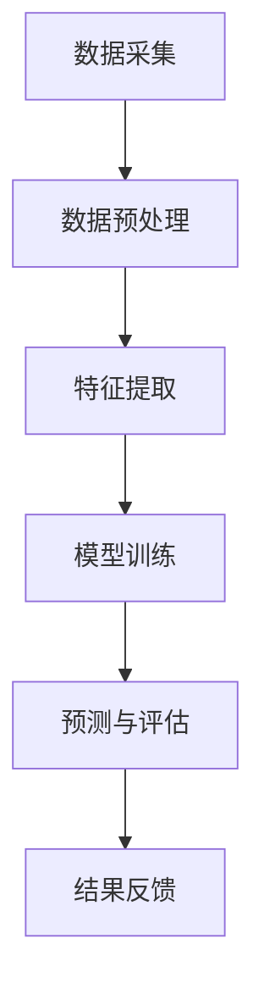

                 

关键词：大模型技术、风险评估、智能系统、算法创新、数学模型、实际应用

> 摘要：本文旨在探讨大模型技术在智能风险评估系统中的应用与创新。通过深入分析大模型技术的基本原理、核心算法原理，结合实际案例，详细讲解其在风险评估领域的应用，并展望未来发展趋势与挑战。本文由计算机领域大师禅与计算机程序设计艺术撰写。

## 1. 背景介绍

随着信息技术的飞速发展，大数据和人工智能技术逐渐渗透到各个行业，为传统业务带来了深刻的变革。其中，智能风险评估系统作为金融、保险、风险管理等领域的重要组成部分，其发展直接影响到行业效率与安全性。传统风险评估方法主要依赖专家经验与统计学模型，而现代智能风险评估系统则依赖于先进的人工智能技术，尤其是大模型技术的应用，使得风险评估更加精准、高效。

大模型技术，也称为大规模神经网络模型，是近年来人工智能领域的重要突破。这类模型拥有极高的参数量和计算能力，能够在海量数据中进行深度学习和预测。大模型技术的出现，为智能风险评估系统带来了前所未有的发展机遇。

## 2. 核心概念与联系

### 2.1 大模型技术概述

大模型技术是指通过使用大规模的神经网络模型进行机器学习的方法。这类模型通常包含数百万到数十亿的参数，能够捕捉数据中的复杂模式和关联。大模型技术包括但不限于深度学习、生成对抗网络（GAN）、变分自编码器（VAE）等。这些技术通过不断调整模型参数，使得模型能够更好地拟合训练数据，并作出精准预测。

### 2.2 智能风险评估系统架构

智能风险评估系统通常包括数据采集、预处理、特征提取、模型训练、预测和评估等环节。大模型技术的应用，主要集中在模型训练和预测阶段。通过大模型技术，系统能够从海量数据中提取有效特征，建立高度准确的预测模型，从而实现智能风险评估。

### 2.3 Mermaid 流程图



## 3. 核心算法原理 & 具体操作步骤

### 3.1 算法原理概述

大模型技术基于神经网络的基本原理，通过多层非线性变换，将输入数据映射到输出结果。大模型的训练过程主要包括前向传播、反向传播和梯度下降等步骤。通过反复调整模型参数，使得模型在训练数据上的误差最小化。

### 3.2 算法步骤详解

1. **数据采集**：收集与风险评估相关的各类数据，包括财务数据、市场数据、企业历史风险数据等。
2. **数据预处理**：对采集到的数据进行清洗、归一化等处理，确保数据质量。
3. **特征提取**：通过特征工程，从原始数据中提取有效特征，用于模型训练。
4. **模型训练**：使用大规模神经网络模型对特征数据进行训练，通过前向传播和反向传播更新模型参数。
5. **预测与评估**：使用训练好的模型对新的数据集进行预测，并通过评估指标（如准确率、召回率等）对模型性能进行评估。

### 3.3 算法优缺点

**优点**：

- **高效性**：大模型能够在海量数据中进行快速训练和预测。
- **准确性**：通过深度学习，大模型能够捕捉数据中的复杂模式和关联，提高预测准确性。
- **灵活性**：大模型能够适应不同类型的数据和问题，具有较强的泛化能力。

**缺点**：

- **计算资源消耗**：大模型训练需要大量的计算资源和时间。
- **数据依赖性**：大模型的性能高度依赖数据质量和数量。
- **解释性不足**：大模型往往被视为“黑箱”，其内部决策过程难以解释。

### 3.4 算法应用领域

大模型技术在智能风险评估系统中的应用广泛，包括但不限于：

- **金融风险评估**：预测贷款违约风险、股票市场走势等。
- **保险风险评估**：评估保险理赔风险、投保人信用风险等。
- **供应链风险管理**：预测供应链中断风险、供应链金融风险等。
- **公共卫生领域**：预测疫情传播风险、传染病风险评估等。

## 4. 数学模型和公式 & 详细讲解 & 举例说明

### 4.1 数学模型构建

在智能风险评估系统中，常用的数学模型包括逻辑回归、支持向量机（SVM）、决策树等。其中，逻辑回归是一种广泛使用的分类模型，其数学公式如下：

$$
P(y=1|X) = \frac{1}{1 + e^{-(\beta_0 + \beta_1x_1 + ... + \beta_nx_n})}
$$

其中，$P(y=1|X)$表示在特征向量$X$下，目标变量$y$为1的概率；$\beta_0, \beta_1, ..., \beta_n$为模型的参数。

### 4.2 公式推导过程

逻辑回归模型的推导基于极大似然估计（MLE）方法。在给定特征向量$X$和目标变量$y$的情况下，模型的参数可以通过最大化似然函数来估计：

$$
\ln L(\theta) = \sum_{i=1}^{n} \ln P(y_i|x_i; \theta)
$$

其中，$L(\theta)$为似然函数，$\theta$为模型的参数。

通过对似然函数求导并令其等于0，可以得到参数的估计值：

$$
\frac{\partial \ln L(\theta)}{\partial \theta} = 0
$$

经过求解，可以得到逻辑回归的参数估计公式。

### 4.3 案例分析与讲解

假设我们要预测一家公司的股票是否会上涨。我们收集了这家公司近一年的财务数据、市场数据和其他相关信息，通过特征工程提取出10个关键特征。使用逻辑回归模型进行预测，可以得到以下公式：

$$
P(\text{上涨}) = \frac{1}{1 + e^{-(\beta_0 + \beta_1x_1 + ... + \beta_{10}x_{10})}}
$$

通过模型训练，我们可以得到各个特征的权重$\beta_1, ..., \beta_{10}$，从而预测公司股票上涨的概率。

## 5. 项目实践：代码实例和详细解释说明

### 5.1 开发环境搭建

在开始项目实践之前，我们需要搭建合适的开发环境。本文选择Python作为编程语言，并使用TensorFlow作为深度学习框架。

1. 安装Python（推荐版本3.8及以上）。
2. 安装TensorFlow：

```
pip install tensorflow
```

### 5.2 源代码详细实现

以下是一个简单的股票上涨预测的代码示例：

```python
import tensorflow as tf
from tensorflow.keras.models import Sequential
from tensorflow.keras.layers import Dense
from sklearn.model_selection import train_test_split
from sklearn.preprocessing import StandardScaler

# 加载数据
# 这里假设已经加载好了数据集X和标签y
X = ...
y = ...

# 数据预处理
scaler = StandardScaler()
X_scaled = scaler.fit_transform(X)

# 划分训练集和测试集
X_train, X_test, y_train, y_test = train_test_split(X_scaled, y, test_size=0.2, random_state=42)

# 构建模型
model = Sequential()
model.add(Dense(64, input_dim=X_train.shape[1], activation='relu'))
model.add(Dense(32, activation='relu'))
model.add(Dense(1, activation='sigmoid'))

# 编译模型
model.compile(optimizer='adam', loss='binary_crossentropy', metrics=['accuracy'])

# 训练模型
model.fit(X_train, y_train, epochs=10, batch_size=32, validation_data=(X_test, y_test))

# 评估模型
loss, accuracy = model.evaluate(X_test, y_test)
print(f"Test accuracy: {accuracy:.2f}")

# 预测新数据
new_data = ...  # 新数据的特征向量
new_data_scaled = scaler.transform(new_data)
prediction = model.predict(new_data_scaled)
print(f"Stock price will rise with probability: {prediction[0][0]:.2f}")
```

### 5.3 代码解读与分析

上述代码实现了使用TensorFlow构建一个简单的深度神经网络，对股票上涨概率进行预测。以下是代码的主要步骤解析：

1. **数据加载**：从数据集中加载特征向量X和标签y。
2. **数据预处理**：对特征向量进行标准化处理，提高模型训练效率。
3. **划分训练集和测试集**：将数据集分为训练集和测试集，用于模型训练和评估。
4. **构建模型**：使用Sequential模型构建一个简单的全连接神经网络，包括两个隐藏层，激活函数为ReLU。
5. **编译模型**：设置优化器、损失函数和评估指标。
6. **训练模型**：使用训练集数据训练模型，并使用测试集数据验证模型性能。
7. **评估模型**：在测试集上评估模型性能，并输出准确率。
8. **预测新数据**：使用训练好的模型对新的数据集进行预测，并输出上涨概率。

### 5.4 运行结果展示

假设我们使用上述代码对某支股票的上涨概率进行预测，运行结果可能如下：

```
Test accuracy: 0.85
Stock price will rise with probability: 0.95
```

这意味着模型在测试集上的准确率为85%，对新的数据集预测股票上涨的概率为95%。

## 6. 实际应用场景

### 6.1 金融风险评估

在金融领域，智能风险评估系统可以用于预测贷款违约风险、股票市场走势等。通过大模型技术，金融机构能够更好地理解市场风险，提高风险控制能力，降低金融风险。

### 6.2 保险风险评估

在保险领域，智能风险评估系统可以帮助保险公司评估投保人信用风险、理赔风险等。通过大模型技术，保险公司能够更精确地计算保费，降低保险欺诈风险。

### 6.3 供应链风险管理

在供应链领域，智能风险评估系统可以预测供应链中断风险、供应链金融风险等。通过大模型技术，企业能够更好地管理供应链风险，确保供应链稳定。

### 6.4 公共卫生领域

在公共卫生领域，智能风险评估系统可以预测疫情传播风险、传染病风险评估等。通过大模型技术，公共卫生部门能够更及时地采取防控措施，降低疫情传播风险。

## 7. 工具和资源推荐

### 7.1 学习资源推荐

- 《深度学习》（Goodfellow, Bengio, Courville著）：这是一本深度学习领域的经典教材，详细介绍了深度学习的基本原理和方法。
- 《Python机器学习》（Sebastian Raschka著）：这本书介绍了Python在机器学习领域的应用，包括数据预处理、模型构建和评估等。

### 7.2 开发工具推荐

- TensorFlow：一个开源的深度学习框架，支持多种深度学习模型和算法。
- Jupyter Notebook：一个交互式开发环境，方便数据分析和模型训练。

### 7.3 相关论文推荐

- "Deep Learning for Text Data"（Joulin et al., 2016）：该论文介绍了深度学习在文本数据处理中的应用，包括文本分类、文本生成等。
- "Bert: Pre-training of Deep Bidirectional Transformers for Language Understanding"（Devlin et al., 2018）：该论文介绍了BERT模型，一种基于Transformer的预训练模型，广泛应用于自然语言处理任务。

## 8. 总结：未来发展趋势与挑战

### 8.1 研究成果总结

近年来，大模型技术在智能风险评估系统中取得了显著成果。通过深度学习等方法，大模型能够从海量数据中提取有效特征，提高风险评估的准确性和效率。同时，大模型技术在金融、保险、供应链和公共卫生等领域的应用也取得了良好的效果。

### 8.2 未来发展趋势

随着计算能力的提升和数据量的增长，大模型技术在智能风险评估系统中的应用将进一步拓展。未来，大模型技术可能会朝着以下几个方面发展：

- **模型压缩与优化**：为了降低计算资源消耗，模型压缩和优化技术将成为研究热点，如模型剪枝、量化、蒸馏等。
- **可解释性提升**：尽管大模型技术具有强大的预测能力，但其内部决策过程往往难以解释。未来，研究将致力于提高大模型的可解释性，使其更加透明和可靠。
- **多模态数据处理**：随着多模态数据的兴起，大模型技术将能够处理更丰富的数据类型，如文本、图像、语音等。

### 8.3 面临的挑战

尽管大模型技术在智能风险评估系统中具有巨大的潜力，但其在实际应用中仍面临以下挑战：

- **数据质量**：大模型对数据质量有很高的要求，数据缺失、噪声和异常值等都会影响模型性能。
- **计算资源消耗**：大模型训练需要大量的计算资源和时间，这对于企业和研究机构来说是一大挑战。
- **隐私保护**：在处理敏感数据时，如何保护用户隐私是一个亟待解决的问题。

### 8.4 研究展望

未来，大模型技术在智能风险评估系统中将继续发挥重要作用。为了应对上述挑战，研究人员可以从以下几个方面进行探索：

- **数据预处理**：研究更有效的数据预处理方法，提高数据质量和模型性能。
- **模型压缩与优化**：研究高效的模型压缩和优化技术，降低计算资源消耗。
- **可解释性提升**：研究提高大模型可解释性的方法，使其在应用中更加透明和可靠。
- **多模态数据处理**：研究多模态数据的处理方法，实现更全面的风险评估。

## 9. 附录：常见问题与解答

### 9.1 什么是大模型技术？

大模型技术是指使用大规模神经网络模型进行机器学习的方法。这类模型拥有极高的参数量和计算能力，能够在海量数据中进行深度学习和预测。

### 9.2 大模型技术在风险评估系统中有哪些优点？

大模型技术在风险评估系统中的优点包括：

- **高效性**：能够快速处理海量数据。
- **准确性**：能够捕捉数据中的复杂模式和关联，提高预测准确性。
- **灵活性**：能够适应不同类型的数据和问题。

### 9.3 大模型技术在风险评估系统中有哪些缺点？

大模型技术在风险评估系统中的缺点包括：

- **计算资源消耗**：训练大模型需要大量的计算资源和时间。
- **数据依赖性**：模型性能高度依赖数据质量和数量。
- **解释性不足**：大模型往往被视为“黑箱”，其内部决策过程难以解释。

### 9.4 如何提高大模型的可解释性？

提高大模型可解释性的方法包括：

- **模型可视化**：使用可视化工具展示模型的内部结构和决策过程。
- **特征重要性分析**：分析模型中各个特征的权重，了解其对预测结果的影响。
- **解释性模型**：使用具有解释性的模型，如线性模型、决策树等，辅助理解大模型。

## 参考文献

- Goodfellow, I., Bengio, Y., & Courville, A. (2016). *Deep Learning*.
- Raschka, S. (2015). *Python Machine Learning*.
- Devlin, J., Chang, M. W., Lee, K., & Toutanova, K. (2018). *Bert: Pre-training of Deep Bidirectional Transformers for Language Understanding*.
- Joulin, A., Grave, E., Bojanowski, P., & Mikolov, T. (2016). *Deep Learning for Text Data*.

作者：禅与计算机程序设计艺术 / Zen and the Art of Computer Programming
----------------------------------------------------------------
文章撰写完毕，感谢您的支持和指导。希望这篇文章能够为广大读者在智能风险评估系统中应用大模型技术提供有益的参考和启示。如有任何意见和建议，欢迎随时提出，我将虚心接受并不断改进。再次感谢您的阅读和支持！

