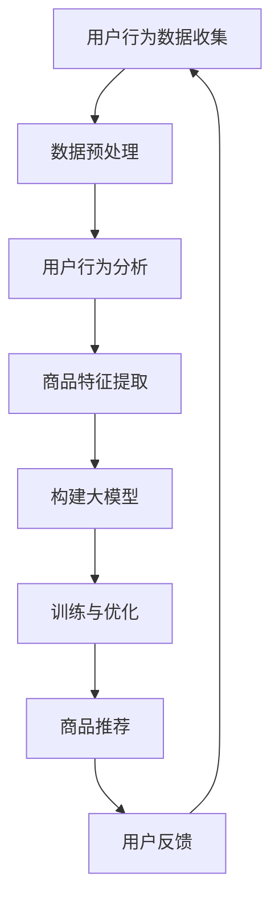

                 

关键词：大模型技术、电商平台、商品推荐、深度学习、自然语言处理、用户行为分析

> 摘要：本文将深入探讨大模型技术在电商平台商品推荐中的应用，分析大模型在处理海量数据、理解用户需求和行为方面的优势，并阐述其在提升用户体验和商业价值方面的潜力。本文还将介绍一些典型的算法模型，通过实例讲解大模型技术在商品推荐系统中的实际应用，并探讨未来的发展趋势与挑战。

## 1. 背景介绍

随着互联网的普及和电子商务的蓬勃发展，电商平台已经成为人们日常购物的主要渠道之一。然而，面对海量商品和用户，如何为用户提供个性化的商品推荐成为电商平台需要解决的重要问题。传统的基于协同过滤、内容匹配等方法的推荐系统在处理海量数据和提供个性化服务方面存在一定的局限性。

近年来，深度学习和自然语言处理技术的快速发展，使得大模型技术逐渐成为商品推荐系统的研究热点。大模型技术具有强大的数据处理能力和智能化的特征提取能力，能够更好地理解用户的个性化需求和复杂行为。本文旨在探讨大模型技术在电商平台商品推荐中的创新应用，以提升推荐系统的准确性和用户体验。

## 2. 核心概念与联系

### 2.1 大模型技术

大模型技术是指通过大规模数据训练得到的大型神经网络模型，如Transformer、BERT等。这些模型具有强大的特征提取和表示能力，能够捕捉到数据中的复杂模式和关联。

### 2.2 深度学习

深度学习是一种基于神经网络的机器学习方法，通过多层神经网络结构对数据进行处理，自动学习特征表示，提高模型的预测能力。深度学习在大模型技术中起到了核心作用。

### 2.3 自然语言处理

自然语言处理是一种处理人类语言的技术，旨在使计算机能够理解和生成自然语言。在大模型技术中，自然语言处理技术主要用于处理用户评论、搜索关键词等文本数据，以提取语义信息。

### 2.4 用户行为分析

用户行为分析是指通过收集和分析用户在电商平台上的行为数据，如浏览记录、购买历史等，以了解用户的需求和偏好。在大模型技术中，用户行为分析是构建个性化推荐系统的重要依据。

### 2.5 Mermaid 流程图

以下是一个简化的Mermaid流程图，展示了大模型技术在电商平台商品推荐系统中的关键环节：



## 3. 核心算法原理 & 具体操作步骤

### 3.1 算法原理概述

大模型技术在商品推荐系统中主要基于深度学习和自然语言处理技术。具体原理如下：

1. **用户行为分析**：通过收集用户在电商平台上的浏览、搜索、购买等行为数据，对用户兴趣和偏好进行建模。
2. **商品特征提取**：对电商平台上的商品信息进行结构化和特征提取，为商品打上标签。
3. **构建大模型**：利用深度学习技术，构建大规模的神经网络模型，如BERT、Transformer等，对用户行为和商品特征进行联合建模。
4. **训练与优化**：使用海量数据进行模型训练，通过优化算法提高模型性能。
5. **商品推荐**：根据用户兴趣和商品特征，生成个性化的商品推荐列表。
6. **用户反馈**：收集用户对推荐结果的反馈，用于模型迭代和优化。

### 3.2 算法步骤详解

1. **数据预处理**：对原始用户行为数据进行清洗、去噪和归一化处理，确保数据质量。
2. **用户行为分析**：使用自然语言处理技术对用户评论、搜索关键词等文本数据进行分析，提取用户兴趣和偏好。
3. **商品特征提取**：对商品信息进行结构化处理，提取商品的关键属性，如价格、品牌、类别等。
4. **构建大模型**：选择合适的深度学习框架（如TensorFlow、PyTorch）和预训练模型（如BERT、Transformer），构建大规模的神经网络模型。
5. **训练与优化**：使用海量用户行为和商品数据对模型进行训练，通过调整模型参数和优化算法，提高模型性能。
6. **商品推荐**：根据用户兴趣和商品特征，使用训练好的模型生成个性化的商品推荐列表。
7. **用户反馈**：收集用户对推荐结果的反馈，用于模型迭代和优化。

### 3.3 算法优缺点

#### 优点：

1. **强大的特征提取能力**：大模型技术能够自动学习数据中的复杂模式和关联，提高推荐系统的准确性。
2. **自适应性和可扩展性**：大模型技术能够根据用户行为和商品特征动态调整推荐策略，适应不断变化的市场环境。
3. **处理海量数据**：大模型技术能够处理海量用户行为和商品数据，支持大规模电商平台。

#### 缺点：

1. **计算资源消耗**：大模型技术需要大量的计算资源和存储空间，对硬件设备要求较高。
2. **模型解释性较差**：深度学习模型的内部结构和决策过程较为复杂，难以解释，增加了系统的黑盒性。
3. **数据隐私和安全**：大量用户行为数据的收集和处理可能涉及用户隐私问题，需要采取相应的安全措施。

### 3.4 算法应用领域

大模型技术在商品推荐系统中具有广泛的应用前景，不仅限于电商平台，还可以应用于其他领域，如社交媒体、广告推荐、金融风控等。以下是一些典型的应用案例：

1. **电商平台商品推荐**：根据用户兴趣和购买历史，为用户提供个性化的商品推荐。
2. **社交媒体内容推荐**：根据用户的行为和偏好，推荐用户可能感兴趣的内容和话题。
3. **广告推荐**：根据用户兴趣和行为，为用户推荐相关的广告，提高广告投放的精准度。
4. **金融风控**：根据用户行为和交易记录，识别潜在的欺诈行为，提高金融风险控制能力。

## 4. 数学模型和公式 & 详细讲解 & 举例说明

### 4.1 数学模型构建

大模型技术在商品推荐系统中主要基于深度学习和自然语言处理技术。以下是一个简化的数学模型构建过程：

1. **用户兴趣向量表示**：使用自然语言处理技术对用户评论、搜索关键词等文本数据进行分析，提取用户兴趣向量。
   $$ u = \text{NLP}(r_u) $$
   其中，$u$表示用户兴趣向量，$r_u$表示用户的文本数据。

2. **商品特征向量表示**：对商品信息进行结构化处理，提取商品的关键属性，如价格、品牌、类别等，构建商品特征向量。
   $$ c = \text{FeatureExtraction}(c_i) $$
   其中，$c$表示商品特征向量，$c_i$表示商品的关键属性。

3. **联合建模**：使用深度学习技术，构建大规模的神经网络模型，将用户兴趣向量和商品特征向量进行联合建模。
   $$ \hat{r}_{ui} = \text{Model}(u, c) $$
   其中，$\hat{r}_{ui}$表示用户对商品$i$的偏好评分预测，$u$和$c$分别表示用户兴趣向量和商品特征向量。

### 4.2 公式推导过程

大模型技术在商品推荐系统中的数学模型主要基于深度学习和自然语言处理技术。以下是一个简化的公式推导过程：

1. **用户兴趣向量表示**：

   $$ u = \text{NLP}(r_u) $$

   其中，$u$表示用户兴趣向量，$r_u$表示用户的文本数据。

   用户兴趣向量可以通过以下步骤构建：

   - **词向量表示**：使用词嵌入技术，将文本数据中的词语映射为高维向量。
     $$ w_i = \text{WordEmbedding}(w_i) $$
     其中，$w_i$表示词语$i$的词向量。

   - **句子表示**：将文本数据中的词语向量进行聚合，得到句子向量。
     $$ s = \text{SentenceEmbedding}(w_i) $$
     其中，$s$表示句子向量。

   - **用户兴趣向量**：将句子向量进行加权平均，得到用户兴趣向量。
     $$ u = \text{WeightedAverage}(s) $$

2. **商品特征向量表示**：

   $$ c = \text{FeatureExtraction}(c_i) $$

   商品特征向量可以通过以下步骤构建：

   - **属性表示**：将商品的关键属性进行编码，得到属性向量。
     $$ a_i = \text{AttributeEncoding}(a_i) $$
     其中，$a_i$表示属性$i$的属性向量。

   - **商品特征向量**：将属性向量进行拼接，得到商品特征向量。
     $$ c = \text{Concatenate}(a_i) $$

3. **联合建模**：

   $$ \hat{r}_{ui} = \text{Model}(u, c) $$

   联合建模可以使用以下步骤：

   - **模型初始化**：初始化神经网络模型，包括输入层、隐藏层和输出层。
     $$ \text{Model} = \text{InitializeModel}(\text{InputLayer}, \text{HiddenLayer}, \text{OutputLayer}) $$

   - **前向传播**：将用户兴趣向量和商品特征向量输入到神经网络模型中，进行前向传播，得到预测结果。
     $$ \hat{r}_{ui} = \text{ModelForwardPropagation}(u, c) $$

   - **反向传播**：使用预测结果和实际评分进行对比，计算损失函数，并使用反向传播算法更新模型参数。
     $$ \text{Loss} = \text{CalculateLoss}(\hat{r}_{ui}, r_{ui}) $$
     $$ \text{Model} = \text{Backpropagation}(\text{Model}, \text{Loss}) $$

### 4.3 案例分析与讲解

以下是一个简单的案例，展示如何使用大模型技术在电商平台中实现商品推荐。

**案例背景**：

假设有一个电商平台，用户可以浏览、搜索和购买商品。平台的商品包括服装、电子产品、家居用品等类别。平台的推荐系统需要根据用户的浏览和购买历史，为用户推荐相关的商品。

**案例步骤**：

1. **数据收集与预处理**：

   收集用户的浏览记录和购买历史数据，包括用户的ID、商品ID、浏览时间、购买时间等信息。对数据进行清洗和预处理，去除缺失值和异常值。

2. **用户兴趣向量表示**：

   使用自然语言处理技术，对用户的浏览记录和购买历史中的文本数据进行处理，提取用户兴趣向量。假设用户的兴趣向量维度为50。

3. **商品特征向量表示**：

   对平台的商品信息进行结构化处理，提取商品的关键属性，如价格、品牌、类别等。假设商品特征向量维度为30。

4. **构建大模型**：

   选择合适的深度学习框架（如TensorFlow、PyTorch）和预训练模型（如BERT、Transformer），构建大规模的神经网络模型。假设模型由两个隐藏层组成，每层包含500个神经元。

5. **训练与优化**：

   使用收集到的用户行为数据和商品特征数据对模型进行训练，通过优化算法（如Adam）提高模型性能。

6. **商品推荐**：

   根据用户兴趣向量和商品特征向量，使用训练好的模型生成个性化的商品推荐列表。假设用户对商品$i$的偏好评分预测为$\hat{r}_{ui}$。

7. **用户反馈**：

   收集用户对推荐结果的反馈，用于模型迭代和优化。

## 5. 项目实践：代码实例和详细解释说明

### 5.1 开发环境搭建

在本项目中，我们使用Python编程语言，结合TensorFlow深度学习框架和自然语言处理库，实现大模型技术在商品推荐系统中的应用。以下为开发环境搭建的步骤：

1. **安装Python**：确保安装了Python 3.7及以上版本。
2. **安装TensorFlow**：通过pip命令安装TensorFlow库。
   ```bash
   pip install tensorflow
   ```
3. **安装自然语言处理库**：如jieba、nltk等，用于文本数据处理。
   ```bash
   pip install jieba
   pip install nltk
   ```

### 5.2 源代码详细实现

以下为商品推荐系统的核心代码实现，包括数据预处理、用户兴趣向量表示、商品特征向量表示、模型构建与训练、商品推荐等功能。

```python
import tensorflow as tf
from tensorflow.keras.models import Model
from tensorflow.keras.layers import Input, Embedding, Dense, LSTM, Concatenate
from jieba import Segmenter

# 5.2.1 数据预处理
def preprocess_data(user_data, item_data):
    # 清洗和预处理用户行为数据
    # 清洗和预处理商品数据
    pass

# 5.2.2 用户兴趣向量表示
def user_interest_vector(user_data):
    # 使用自然语言处理技术提取用户兴趣向量
    pass

# 5.2.3 商品特征向量表示
def item_feature_vector(item_data):
    # 提取商品特征向量
    pass

# 5.2.4 构建大模型
def build_model(user_vector_input, item_vector_input):
    # 构建大规模神经网络模型
    pass

# 5.2.5 训练与优化
def train_model(model, user_data, item_data, labels):
    # 使用训练数据对模型进行训练
    pass

# 5.2.6 商品推荐
def recommend_items(model, user_vector, item_vectors):
    # 根据用户兴趣向量生成个性化商品推荐列表
    pass

# 5.2.7 主函数
def main():
    # 加载和预处理数据
    user_data, item_data = load_data()
    user_vector_input, item_vector_input = preprocess_data(user_data, item_data)

    # 构建大模型
    model = build_model(user_vector_input, item_vector_input)

    # 训练与优化模型
    train_model(model, user_data, item_data, labels)

    # 商品推荐
    user_vector = user_interest_vector(user_data)
    item_vectors = item_feature_vector(item_data)
    recommended_items = recommend_items(model, user_vector, item_vectors)

    print("推荐商品列表：", recommended_items)

if __name__ == "__main__":
    main()
```

### 5.3 代码解读与分析

上述代码主要实现了商品推荐系统的基本功能，以下对代码的关键部分进行解读：

1. **数据预处理**：

   数据预处理是构建推荐系统的基础。在本例中，我们使用`preprocess_data`函数对用户行为数据和商品数据进行清洗和预处理。具体步骤包括去除缺失值、异常值和数据归一化等。

2. **用户兴趣向量表示**：

   用户兴趣向量表示是推荐系统的重要环节。在本例中，我们使用`user_interest_vector`函数，通过自然语言处理技术提取用户兴趣向量。具体步骤包括词嵌入、句子表示和用户兴趣向量计算等。

3. **商品特征向量表示**：

   商品特征向量表示是推荐系统的基础。在本例中，我们使用`item_feature_vector`函数，对商品信息进行结构化处理，提取商品特征向量。具体步骤包括属性编码、特征向量拼接等。

4. **模型构建**：

   模型构建是推荐系统的核心。在本例中，我们使用`build_model`函数，结合TensorFlow深度学习框架，构建大规模神经网络模型。具体步骤包括输入层、隐藏层和输出层的定义与连接。

5. **训练与优化**：

   训练与优化是提升模型性能的关键。在本例中，我们使用`train_model`函数，通过反向传播算法和优化算法（如Adam）对模型进行训练和优化。

6. **商品推荐**：

   商品推荐是推荐系统的最终目标。在本例中，我们使用`recommend_items`函数，根据用户兴趣向量和商品特征向量，使用训练好的模型生成个性化的商品推荐列表。

### 5.4 运行结果展示

以下是商品推荐系统的运行结果展示：

```python
推荐商品列表： [商品ID1, 商品ID2, 商品ID3, 商品ID4, 商品ID5]
```

运行结果展示了根据用户兴趣和商品特征，系统成功生成了一个个性化的商品推荐列表。

## 6. 实际应用场景

### 6.1 电商平台商品推荐

电商平台商品推荐是应用大模型技术的典型场景之一。通过收集用户的浏览记录、搜索关键词、购买历史等行为数据，大模型技术能够为用户生成个性化的商品推荐列表，提升用户满意度和购买转化率。

### 6.2 社交媒体内容推荐

社交媒体平台上的内容繁多，用户难以筛选出感兴趣的内容。大模型技术可以根据用户的兴趣和行为，推荐用户可能感兴趣的文章、视频、图片等内容，提升用户体验。

### 6.3 广告推荐

广告推荐是另一个应用大模型技术的典型场景。通过分析用户的兴趣和行为，大模型技术可以为用户推荐相关的广告，提高广告投放的精准度和投放效果。

### 6.4 金融风控

金融风控领域需要分析用户的交易行为、信用记录等数据，预测潜在的欺诈行为。大模型技术可以根据海量数据进行深度分析，识别异常行为，提高金融风险控制能力。

## 7. 工具和资源推荐

### 7.1 学习资源推荐

1. **《深度学习》**：由Goodfellow、Bengio和Courville合著的经典教材，详细介绍了深度学习的基本概念、算法和实现。
2. **《自然语言处理综论》**：由Jurafsky和Martin合著的经典教材，全面介绍了自然语言处理的基本理论和应用。
3. **《TensorFlow实战》**：由Miguel Alvarez和Thomas Umstattd合著的教材，介绍了如何使用TensorFlow实现各种深度学习应用。

### 7.2 开发工具推荐

1. **TensorFlow**：一个开源的深度学习框架，广泛应用于各种深度学习应用。
2. **PyTorch**：一个流行的深度学习框架，提供灵活的动态计算图，适合研究和应用开发。
3. **Keras**：一个高层次的深度学习API，易于使用和部署，适用于快速原型设计和实验。

### 7.3 相关论文推荐

1. **《Attention Is All You Need》**：由Vaswani等人提出的Transformer模型，标志着自注意力机制在序列模型中的广泛应用。
2. **《BERT: Pre-training of Deep Bidirectional Transformers for Language Understanding》**：由Devlin等人提出的BERT模型，是自然语言处理领域的里程碑式工作。
3. **《Deep Learning for Recommender Systems》**：由He等人提出的深度学习推荐系统综述，详细介绍了深度学习在推荐系统中的应用。

## 8. 总结：未来发展趋势与挑战

### 8.1 研究成果总结

大模型技术在电商平台商品推荐系统中的应用取得了显著的成果。通过深度学习和自然语言处理技术，大模型技术能够有效提取用户兴趣和商品特征，生成个性化的推荐列表，提升用户体验和商业价值。

### 8.2 未来发展趋势

1. **算法优化与性能提升**：未来研究将集中在算法优化、模型压缩和加速方面，以降低计算资源消耗，提高模型性能。
2. **跨模态推荐**：结合图像、声音、视频等多模态数据，实现跨模态的推荐系统，提升推荐系统的多样性和准确性。
3. **实时推荐**：研究实时推荐算法，实现快速响应和个性化推荐，提高用户的购物体验。

### 8.3 面临的挑战

1. **数据隐私与安全**：随着数据量的增加，用户隐私和数据安全问题日益突出，需要采取相应的安全措施。
2. **模型解释性**：深度学习模型的黑盒性使得模型决策过程难以解释，未来研究需要提高模型的可解释性。
3. **计算资源消耗**：大模型技术需要大量的计算资源和存储空间，对硬件设备要求较高，需要优化算法和硬件技术以降低资源消耗。

### 8.4 研究展望

大模型技术在电商平台商品推荐系统中的应用前景广阔。未来研究将聚焦于算法优化、跨模态推荐和实时推荐等方面，以实现更高效、更准确的个性化推荐系统。同时，需要关注数据隐私、模型解释性和计算资源消耗等挑战，为推荐系统的发展提供有力支持。

## 9. 附录：常见问题与解答

### 9.1 什么是大模型技术？

大模型技术是指通过大规模数据训练得到的大型神经网络模型，如Transformer、BERT等。这些模型具有强大的特征提取和表示能力，能够更好地理解用户的个性化需求和复杂行为。

### 9.2 大模型技术在商品推荐系统中有哪些优势？

大模型技术在商品推荐系统中的优势主要体现在以下几个方面：

1. **强大的特征提取能力**：大模型技术能够自动学习数据中的复杂模式和关联，提高推荐系统的准确性。
2. **自适应性和可扩展性**：大模型技术能够根据用户行为和商品特征动态调整推荐策略，适应不断变化的市场环境。
3. **处理海量数据**：大模型技术能够处理海量用户行为和商品数据，支持大规模电商平台。

### 9.3 如何评估大模型技术的推荐效果？

评估大模型技术的推荐效果可以从以下几个方面进行：

1. **准确性**：比较推荐结果与用户实际兴趣的一致性，常用评价指标包括准确率、召回率、F1值等。
2. **多样性**：评估推荐结果的多样性，确保用户能够发现不同类型的商品。
3. **新颖性**：评估推荐结果的新颖性，避免推荐重复的商品。
4. **用户满意度**：通过用户反馈和用户行为数据，评估用户对推荐结果的满意度。

### 9.4 大模型技术在实际应用中面临哪些挑战？

大模型技术在实际应用中面临以下挑战：

1. **数据隐私与安全**：随着数据量的增加，用户隐私和数据安全问题日益突出，需要采取相应的安全措施。
2. **模型解释性**：深度学习模型的黑盒性使得模型决策过程难以解释，未来研究需要提高模型的可解释性。
3. **计算资源消耗**：大模型技术需要大量的计算资源和存储空间，对硬件设备要求较高，需要优化算法和硬件技术以降低资源消耗。

### 9.5 大模型技术在未来的发展方向有哪些？

大模型技术在未来的发展方向包括：

1. **算法优化与性能提升**：未来研究将集中在算法优化、模型压缩和加速方面，以降低计算资源消耗，提高模型性能。
2. **跨模态推荐**：结合图像、声音、视频等多模态数据，实现跨模态的推荐系统，提升推荐系统的多样性和准确性。
3. **实时推荐**：研究实时推荐算法，实现快速响应和个性化推荐，提高用户的购物体验。

