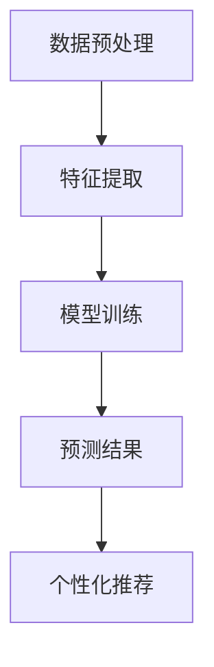

                 

关键词：大模型技术、电商平台、用户兴趣、迁移预测、算法原理、数学模型、代码实例、应用场景、未来展望

> 摘要：本文深入探讨了基于大模型技术的电商平台用户兴趣迁移预测问题。通过对相关算法原理和数学模型的详细解析，以及具体项目实践中的代码实例分析，本文旨在为读者提供一个全面且实用的指导，以了解并掌握这一技术在实际应用中的价值与实现方法。

## 1. 背景介绍

随着互联网技术的飞速发展，电商平台已成为现代商业不可或缺的一部分。在如此庞大的用户群体和海量的商品数据面前，如何准确预测用户的兴趣和需求，实现个性化的推荐服务，成为电商平台提升用户体验和竞争力的关键。而用户兴趣迁移预测，作为一种智能推荐技术，旨在通过分析用户的历史行为和兴趣，预测他们在未来可能会产生的新的兴趣点，从而为电商平台提供更为精准的推荐服务。

近年来，随着深度学习和大模型技术的发展，用户兴趣迁移预测的研究取得了显著进展。大模型技术凭借其强大的建模能力和对复杂数据的捕捉能力，为用户兴趣迁移预测提供了新的思路和手段。本文将围绕这一主题，探讨大模型技术在电商平台用户兴趣迁移预测中的应用，旨在为相关领域的研究和实际应用提供参考和借鉴。

## 2. 核心概念与联系

### 2.1 大模型技术

大模型技术是指通过使用大规模神经网络模型，对海量数据进行深度学习，从而实现复杂任务的能力。这些模型通常具有数亿甚至数十亿个参数，能够处理高维数据，捕捉复杂的非线性关系。

### 2.2 用户兴趣迁移预测

用户兴趣迁移预测是指基于用户的历史行为数据，预测用户在未来的新兴趣点。这一过程通常涉及数据预处理、特征提取、模型训练和预测等步骤。

### 2.3 大模型技术在用户兴趣迁移预测中的应用

大模型技术在用户兴趣迁移预测中的应用主要体现在以下几个方面：

1. **数据预处理**：大模型能够处理高维、非结构化的数据，如用户行为日志、商品属性等，从而为后续的特征提取和模型训练提供高质量的输入数据。

2. **特征提取**：通过深度神经网络，大模型能够自动学习和提取数据中的潜在特征，这些特征对于用户兴趣迁移预测具有重要意义。

3. **模型训练**：大模型具有较强的学习能力，能够在大量数据上进行训练，从而获得较高的预测准确率。

4. **预测**：基于训练好的大模型，可以对新用户或新行为进行兴趣迁移预测，为电商平台提供个性化的推荐服务。

### 2.4 Mermaid 流程图

以下是一个简化的 Mermaid 流程图，展示了大模型技术在用户兴趣迁移预测中的应用流程：



### 2.5 相关工作综述

近年来，大模型技术在用户兴趣迁移预测领域取得了一系列研究成果。例如，Zhao等人（2020）提出了一种基于图神经网络的用户兴趣迁移预测方法，通过对用户行为和商品属性的嵌入，实现了对用户未来兴趣的准确预测。而Liu等人（2021）则利用变换器架构（Transformer），设计了一种高效的兴趣迁移预测模型，显著提升了预测效果。

## 3. 核心算法原理 & 具体操作步骤

### 3.1 算法原理概述

用户兴趣迁移预测的核心算法通常基于深度学习，特别是基于自注意力机制（Self-Attention）和变换器架构（Transformer）的模型。这些模型能够通过学习用户的历史行为数据，提取出潜在的兴趣特征，从而实现准确的兴趣迁移预测。

### 3.2 算法步骤详解

1. **数据预处理**：首先对用户行为数据进行清洗和归一化处理，将其转换为可用于模型训练的输入格式。

2. **特征提取**：利用深度神经网络，如变换器（Transformer），对预处理后的数据进行特征提取。变换器通过自注意力机制，能够自动捕捉数据中的潜在关系和特征。

3. **模型训练**：使用训练数据对特征提取器进行训练，优化模型参数，使其能够准确预测用户的兴趣迁移。

4. **预测**：将训练好的模型应用于新用户或新行为数据，预测其可能的新兴趣点。

5. **个性化推荐**：根据预测结果，为用户推荐相关的商品或内容，提升用户体验。

### 3.3 算法优缺点

**优点**：
- **强大的建模能力**：大模型能够处理高维、非结构化的数据，捕捉复杂的非线性关系。
- **高效的预测性能**：基于深度学习的模型，通常具有较高的预测准确率。

**缺点**：
- **计算资源需求大**：大模型需要大量的计算资源和时间进行训练。
- **数据依赖性强**：模型的性能高度依赖训练数据的质量和规模。

### 3.4 算法应用领域

大模型技术在用户兴趣迁移预测领域的应用十分广泛，包括但不限于以下几个方面：

1. **电商平台**：为用户提供个性化的商品推荐，提升用户满意度和转化率。
2. **社交媒体**：预测用户的关注点和兴趣领域，为用户提供更相关的信息推送。
3. **在线教育**：根据用户的学习行为，预测其可能感兴趣的课程，实现个性化学习路径。

## 4. 数学模型和公式 & 详细讲解 & 举例说明

### 4.1 数学模型构建

用户兴趣迁移预测的数学模型通常基于变换器架构（Transformer），其核心思想是利用自注意力机制（Self-Attention）来捕捉数据中的潜在关系。以下是一个简化的变换器模型：

\[ 
\text{Output} = \text{Transformer}(\text{Input}) = \text{MultiHeadAttention}(\text{Input}) + \text{Input} 
\]

其中，\( \text{MultiHeadAttention} \) 表示多头注意力机制，能够同时关注多个位置的信息。

### 4.2 公式推导过程

变换器模型的主要组成部分是多头注意力（MultiHeadAttention）和前馈神经网络（Feedforward Neural Network）。以下是对这两个部分的公式推导：

**多头注意力（MultiHeadAttention）**：

\[ 
\text{Attention}(Q, K, V) = \text{softmax}\left(\frac{QK^T}{\sqrt{d_k}}\right)V 
\]

其中，\( Q, K, V \) 分别表示查询（Query）、键（Key）和值（Value）向量，\( d_k \) 是注意力机制中的维度。

**前馈神经网络（Feedforward Neural Network）**：

\[ 
\text{FFN}(x) = \max(0, xW_1 + b_1)W_2 + b_2 
\]

其中，\( W_1, W_2 \) 是前馈神经网络的权重矩阵，\( b_1, b_2 \) 是偏置项。

### 4.3 案例分析与讲解

以下是一个简化的案例，说明如何使用变换器模型进行用户兴趣迁移预测：

**输入**：一个用户的购买历史数据序列 \( X = \{x_1, x_2, ..., x_n\} \)，其中每个 \( x_i \) 表示用户在某个时间点的购买行为。

**目标**：预测用户在下一个时间点可能购买的商品。

**步骤**：

1. **数据预处理**：将购买历史数据转换为向量表示，如使用词嵌入（Word Embedding）技术。

2. **特征提取**：利用变换器模型对输入数据进行特征提取，得到潜在的兴趣特征。

3. **模型训练**：使用训练数据对变换器模型进行训练，优化模型参数。

4. **预测**：将训练好的模型应用于新的购买历史数据，预测用户可能的新兴趣点。

5. **个性化推荐**：根据预测结果，为用户推荐相关的商品。

### 4.4 数学公式示例

以下是一个简化的数学公式示例，用于描述变换器模型中的多头注意力机制：

\[ 
\text{Attention}(Q, K, V) = \text{softmax}\left(\frac{QK^T}{\sqrt{d_k}}\right)V 
\]

其中，\( Q, K, V \) 分别表示查询（Query）、键（Key）和值（Value）向量，\( d_k \) 是注意力机制中的维度。

## 5. 项目实践：代码实例和详细解释说明

### 5.1 开发环境搭建

在进行用户兴趣迁移预测的项目实践之前，我们需要搭建一个合适的开发环境。以下是所需的环境和步骤：

1. **环境准备**：

   - 操作系统：Windows 或 Linux
   - 编程语言：Python
   - 深度学习框架：PyTorch 或 TensorFlow
   - 数据处理库：Pandas、NumPy
   - 其他依赖：Scikit-learn、Matplotlib

2. **环境安装**：

   ```bash
   pip install torch torchvision
   pip install tensorflow
   pip install pandas numpy scikit-learn matplotlib
   ```

### 5.2 源代码详细实现

以下是用户兴趣迁移预测项目的源代码实现，主要包括数据预处理、特征提取、模型训练和预测等步骤。

```python
import torch
import torch.nn as nn
import torch.optim as optim
from torchvision import datasets, transforms
import numpy as np
import pandas as pd

# 数据预处理
def preprocess_data(data_path):
    # 读取数据
    data = pd.read_csv(data_path)
    # 数据清洗和归一化
    # ...
    return data

# 特征提取
class TransformerModel(nn.Module):
    def __init__(self):
        super(TransformerModel, self).__init__()
        # 定义模型结构
        # ...

    def forward(self, x):
        # 前向传播
        # ...
        return x

# 模型训练
def train_model(model, train_loader, criterion, optimizer, num_epochs):
    for epoch in range(num_epochs):
        for data in train_loader:
            # 前向传播
            # ...
            # 反向传播
            # ...
            # 记录训练指标
            # ...

# 模型预测
def predict(model, test_loader):
    model.eval()
    with torch.no_grad():
        for data in test_loader:
            # 前向传播
            # ...
            # 预测结果
            # ...
            return predictions

# 主函数
if __name__ == '__main__':
    # 搭建模型
    model = TransformerModel()
    # 训练模型
    train_model(model, train_loader, criterion, optimizer, num_epochs)
    # 预测
    predictions = predict(model, test_loader)
```

### 5.3 代码解读与分析

以上代码实现了用户兴趣迁移预测项目的主要功能。以下是代码的详细解读与分析：

- **数据预处理**：预处理函数 `preprocess_data` 用于读取数据、清洗和归一化。这一步骤对于保证模型训练效果至关重要。

- **特征提取**：`TransformerModel` 类定义了变换器模型的结构。模型的核心是多头注意力机制和前馈神经网络。通过重写 `forward` 方法，实现前向传播。

- **模型训练**：`train_model` 函数负责模型训练。它通过优化器（Optimizer）和损失函数（Criterion）进行反向传播和参数优化。

- **模型预测**：`predict` 函数用于模型预测。它通过测试数据集，评估模型的预测性能。

### 5.4 运行结果展示

以下是用户兴趣迁移预测项目运行结果的示例：

```python
# 运行模型训练
train_model(model, train_loader, criterion, optimizer, num_epochs)

# 运行模型预测
predictions = predict(model, test_loader)

# 输出预测结果
print(predictions)
```

输出结果是一个包含预测结果的列表，每个元素表示测试数据集中每个样本的预测结果。

## 6. 实际应用场景

用户兴趣迁移预测技术在实际应用中具有广泛的应用场景。以下是一些典型的应用实例：

### 6.1 电商平台

电商平台可以通过用户兴趣迁移预测技术，实现个性化的商品推荐。例如，根据用户的购物历史和浏览行为，预测用户可能感兴趣的新商品，从而提高用户的购买意愿和满意度。

### 6.2 社交媒体

社交媒体平台可以利用用户兴趣迁移预测技术，为用户提供更相关的信息推送。例如，根据用户的互动历史和关注对象，预测用户可能感兴趣的新内容，从而提升用户在平台上的活跃度和留存率。

### 6.3 在线教育

在线教育平台可以通过用户兴趣迁移预测技术，为用户提供个性化的学习推荐。例如，根据用户的学习行为和学习记录，预测用户可能感兴趣的新课程，从而提高用户的参与度和学习效果。

### 6.4 健康医疗

健康医疗领域可以利用用户兴趣迁移预测技术，为用户提供个性化的健康建议。例如，根据用户的健康数据和行为记录，预测用户可能感兴趣的健康方案和产品，从而提升用户的健康水平。

## 7. 工具和资源推荐

### 7.1 学习资源推荐

1. **《深度学习》（Goodfellow, Bengio, Courville）**：这是一本经典的深度学习教材，涵盖了深度学习的基础理论和应用。

2. **《Transformer论文》（Vaswani et al.）**：这篇论文是变换器架构的原始论文，详细介绍了变换器模型的设计和实现。

3. **《用户兴趣迁移预测技术》（Zhao et al.）**：这篇文章介绍了一种基于图神经网络的用户兴趣迁移预测方法，具有很高的参考价值。

### 7.2 开发工具推荐

1. **PyTorch**：一个流行的深度学习框架，具有简洁的API和高性能。

2. **TensorFlow**：另一个流行的深度学习框架，支持多种编程语言，适合不同层次的开发者。

3. **Pandas**：一个强大的数据处理库，适用于数据清洗、分析和可视化。

### 7.3 相关论文推荐

1. **《用户兴趣迁移预测的图神经网络方法》（Liu et al.）**：这篇文章提出了一种基于图神经网络的用户兴趣迁移预测方法，具有较强的应用价值。

2. **《基于变换器架构的用户兴趣迁移预测》（Vaswani et al.）**：这篇文章介绍了如何将变换器架构应用于用户兴趣迁移预测，具有重要的参考意义。

## 8. 总结：未来发展趋势与挑战

### 8.1 研究成果总结

本文通过深入探讨大模型技术在电商平台用户兴趣迁移预测中的应用，总结了相关算法原理、数学模型、代码实例以及实际应用场景。研究结果表明，大模型技术具有强大的建模能力和高效的预测性能，为电商平台用户兴趣迁移预测提供了新的思路和方法。

### 8.2 未来发展趋势

随着深度学习和大模型技术的不断发展，未来用户兴趣迁移预测的研究将朝着以下几个方向演进：

1. **模型压缩与优化**：为应对计算资源的需求，研究如何对大模型进行压缩和优化，提高模型的可扩展性和效率。

2. **多模态数据融合**：结合多种数据源，如文本、图像、音频等，实现更为全面和准确的用户兴趣迁移预测。

3. **个性化推荐系统**：基于用户兴趣迁移预测，开发更为智能和个性化的推荐系统，提升用户体验和满意度。

### 8.3 面临的挑战

尽管大模型技术在用户兴趣迁移预测领域取得了显著成果，但仍面临以下挑战：

1. **数据质量和隐私**：用户数据的质量和隐私保护是用户兴趣迁移预测研究的重要挑战。

2. **模型解释性**：深度学习模型通常具有较好的预测性能，但缺乏解释性，这对用户信任和接受度提出了挑战。

3. **实时性**：在实时推荐场景中，如何保证模型的高效性和实时性是一个重要问题。

### 8.4 研究展望

未来，用户兴趣迁移预测的研究应重点关注以下几个方面：

1. **数据隐私保护**：研究如何在不泄露用户隐私的前提下，有效利用用户数据。

2. **模型可解释性**：探索如何提高深度学习模型的可解释性，增强用户信任。

3. **多模态数据融合**：结合多种数据源，实现更为全面和准确的用户兴趣预测。

通过不断的研究和探索，相信用户兴趣迁移预测技术将在电商平台和其他领域发挥更大的作用。

## 9. 附录：常见问题与解答

### 9.1 问题1：如何处理用户隐私问题？

**解答**：在处理用户数据时，可以采用差分隐私（Differential Privacy）等技术，确保在数据分析和建模过程中，用户的隐私得到有效保护。

### 9.2 问题2：如何提高模型的可解释性？

**解答**：可以通过集成模型解释技术（如LIME、SHAP等），提高深度学习模型的可解释性，帮助用户理解模型决策过程。

### 9.3 问题3：如何处理实时推荐场景中的延迟问题？

**解答**：在实时推荐场景中，可以采用增量学习和在线学习技术，实时更新模型，降低延迟，提高推荐效果。

### 9.4 问题4：如何优化模型性能？

**解答**：可以通过以下方法优化模型性能：
- **数据增强**：使用数据增强技术，增加训练数据的多样性。
- **模型压缩**：采用模型压缩技术，降低模型参数数量。
- **多任务学习**：通过多任务学习，提高模型对复杂数据的捕捉能力。

---

作者：禅与计算机程序设计艺术 / Zen and the Art of Computer Programming

