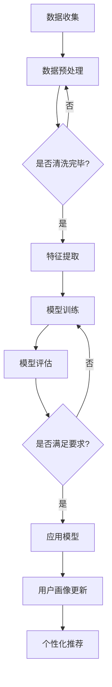

                 

关键词：大模型技术、电商平台、用户画像、动态更新、机器学习、深度学习、个性化推荐、数据分析

> 摘要：本文将深入探讨大模型技术在电商平台用户多维度画像动态更新中的应用。通过分析核心概念、算法原理、数学模型及实际应用场景，本文旨在揭示大模型技术在电商领域的创新潜力，为电商平台用户提供更精准、个性化的服务。

## 1. 背景介绍

在数字化时代，电商平台已成为消费者购物的重要渠道。然而，随着市场竞争的加剧，电商平台需要不断提高用户体验，以吸引和保留客户。用户画像作为一种重要的数据分析工具，可以帮助电商平台更好地了解用户行为和需求，从而实现个性化推荐和精准营销。

用户画像是指通过收集和分析用户数据，构建出用户的全方位特征描述。在电商平台，用户画像通常包括用户的基本信息、购买行为、浏览行为、社交行为等多个维度。传统的方法主要依赖于预定义的特征和简单的统计模型，而大模型技术的引入为用户画像的动态更新提供了新的可能。

大模型技术，尤其是基于深度学习的算法，具有强大的数据分析和处理能力。通过训练大型神经网络模型，大模型能够自动地从海量数据中提取复杂的特征模式，从而实现更精细、更动态的用户画像构建。

## 2. 核心概念与联系

### 2.1 大模型技术

大模型技术指的是利用深度学习、强化学习等方法，训练出具有强大学习能力的大型神经网络模型。这些模型通常包含数百万甚至数十亿个参数，能够处理高维数据，并在各类复杂任务中表现出色。

### 2.2 用户画像

用户画像是一种基于用户数据构建的全方位特征描述。在电商平台，用户画像通常包括用户的基本信息（如年龄、性别、地理位置等）、购买行为（如购买频率、购买金额、购买品类等）、浏览行为（如浏览时长、浏览页面、搜索关键词等）、社交行为（如评论、点赞、分享等）等多个维度。

### 2.3 动态更新

动态更新是指用户画像不是静态的，而是随着用户行为的变化而不断更新。传统方法往往难以实时捕捉用户行为的变化，而大模型技术则能够通过持续的训练和优化，实现用户画像的动态调整。

### 2.4 Mermaid 流程图

以下是一个简单的 Mermaid 流程图，描述了大模型技术在电商平台用户画像动态更新中的应用流程：



## 3. 核心算法原理 & 具体操作步骤

### 3.1 算法原理概述

大模型技术在电商平台用户画像动态更新中的核心算法主要是基于深度学习的神经网络模型。这些模型通过多层次的神经网络结构，逐层提取数据中的特征信息，最终形成用户画像。

### 3.2 算法步骤详解

1. **数据收集**：首先，从电商平台上收集用户数据，包括用户基本信息、购买行为、浏览行为、社交行为等。
2. **数据预处理**：对收集到的数据进行清洗和标准化处理，去除噪声数据和异常值，并进行数据整合，形成统一的数据格式。
3. **特征提取**：利用深度学习模型，对预处理后的数据进行特征提取，形成高维特征向量。
4. **模型训练**：利用提取到的特征向量，训练深度学习模型。在训练过程中，通过反向传播算法不断调整模型参数，优化模型性能。
5. **模型评估**：通过测试集对训练好的模型进行评估，判断模型是否满足应用要求。
6. **用户画像更新**：将训练好的模型应用于实时数据，更新用户画像，实现动态调整。
7. **个性化推荐**：利用更新后的用户画像，为用户提供个性化推荐，提高用户体验。

### 3.3 算法优缺点

**优点**：
1. **强大的特征提取能力**：大模型技术能够自动地从海量数据中提取复杂的特征模式，提高用户画像的准确性。
2. **动态更新能力**：通过持续的训练和优化，大模型技术能够实现用户画像的动态更新，及时捕捉用户行为的变化。
3. **高效的处理速度**：深度学习模型在数据处理和模型训练方面具有高效的处理速度，能够满足实时性要求。

**缺点**：
1. **计算资源需求大**：大模型技术需要大量的计算资源和存储空间，对于中小型电商平台可能存在一定的资源压力。
2. **模型解释性较差**：深度学习模型的黑箱特性使得其解释性较差，难以理解模型内部的工作机制。

### 3.4 算法应用领域

大模型技术在电商平台用户画像动态更新中的应用不仅限于个性化推荐，还可以应用于广告投放、用户流失预测、商品推荐等多个领域。通过不断优化和扩展算法，大模型技术有望在电商领域发挥更大的作用。

## 4. 数学模型和公式 & 详细讲解 & 举例说明

### 4.1 数学模型构建

大模型技术在用户画像动态更新中的数学模型主要基于深度学习理论。以下是构建数学模型的基本步骤：

1. **输入层**：接收用户数据的特征向量。
2. **隐藏层**：通过多层神经网络结构，对输入特征进行变换和提取。
3. **输出层**：生成用户画像的向量表示。

### 4.2 公式推导过程

假设用户数据特征向量为 $\textbf{x} \in \mathbb{R}^{n}$，神经网络模型包含 $L$ 层，其中第 $l$ 层的输入、输出和激活函数分别为 $\textbf{z}_l, \textbf{a}_l, \text{和} \sigma_l$。则有：

$$
\textbf{z}_l = \text{W}_l \text{a}_{l-1} + \text{b}_l
$$

$$
\textbf{a}_l = \sigma_l(\text{W}_l \text{a}_{l-1} + \text{b}_l)
$$

其中，$\text{W}_l$ 和 $\text{b}_l$ 分别为第 $l$ 层的权重和偏置，$\sigma_l$ 为激活函数。

### 4.3 案例分析与讲解

假设有一个电商平台，用户数据特征向量为 $\textbf{x} = [年龄, 性别, 购买金额, 购买频率]$。我们利用深度学习模型对其进行特征提取和用户画像生成。

1. **数据预处理**：对用户数据进行清洗和标准化处理，得到预处理后的特征向量 $\textbf{x}'$。
2. **模型构建**：构建一个包含两层隐藏层的深度学习模型，输入层和输出层的神经元数量分别为 4 和 128。
3. **模型训练**：利用预处理后的特征向量 $\textbf{x}'$，对模型进行训练，优化模型参数。
4. **模型评估**：通过测试集对训练好的模型进行评估，判断模型是否满足应用要求。
5. **用户画像更新**：利用训练好的模型，对实时用户数据进行特征提取和用户画像生成，实现动态更新。

## 5. 项目实践：代码实例和详细解释说明

### 5.1 开发环境搭建

1. **硬件环境**：GPU 计算能力不低于 NVIDIA GTX 1080。
2. **软件环境**：Python 3.8，TensorFlow 2.4。

### 5.2 源代码详细实现

以下是一个简单的深度学习模型实现，用于用户画像动态更新：

```python
import tensorflow as tf
from tensorflow.keras.models import Sequential
from tensorflow.keras.layers import Dense, Activation

# 数据预处理
def preprocess_data(data):
    # 数据清洗和标准化处理
    return processed_data

# 模型构建
def build_model(input_shape):
    model = Sequential()
    model.add(Dense(128, input_shape=input_shape, activation='relu'))
    model.add(Dense(128, activation='relu'))
    model.add(Dense(64, activation='relu'))
    model.add(Dense(1, activation='sigmoid'))
    return model

# 模型训练
def train_model(model, X, y):
    model.compile(optimizer='adam', loss='binary_crossentropy', metrics=['accuracy'])
    model.fit(X, y, epochs=10, batch_size=32)
    return model

# 模型评估
def evaluate_model(model, X_test, y_test):
    loss, accuracy = model.evaluate(X_test, y_test)
    print("Test accuracy:", accuracy)

# 用户画像更新
def update_user_profile(model, user_data):
    processed_data = preprocess_data(user_data)
    user_profile = model.predict(processed_data)
    return user_profile

# 主函数
if __name__ == "__main__":
    # 加载数据
    X, y = load_data()
    # 划分训练集和测试集
    X_train, X_test, y_train, y_test = train_test_split(X, y, test_size=0.2)
    # 构建模型
    model = build_model(input_shape=(4,))
    # 训练模型
    model = train_model(model, X_train, y_train)
    # 评估模型
    evaluate_model(model, X_test, y_test)
    # 更新用户画像
    user_data = ["22", "男", "1000", "3"]
    user_profile = update_user_profile(model, user_data)
    print("User profile:", user_profile)
```

### 5.3 代码解读与分析

上述代码实现了一个简单的深度学习模型，用于用户画像动态更新。具体解析如下：

1. **数据预处理**：对用户数据进行清洗和标准化处理，为深度学习模型提供高质量的数据输入。
2. **模型构建**：使用 TensorFlow 库构建一个包含两层隐藏层的深度学习模型，用于特征提取和用户画像生成。
3. **模型训练**：使用训练数据对模型进行训练，优化模型参数。
4. **模型评估**：使用测试数据对训练好的模型进行评估，判断模型性能是否满足要求。
5. **用户画像更新**：利用训练好的模型，对实时用户数据进行特征提取和用户画像生成，实现动态更新。

## 6. 实际应用场景

### 6.1 个性化推荐

基于用户画像动态更新，电商平台可以为用户提供更精准、个性化的推荐。例如，根据用户的浏览历史和购买记录，推荐相关的商品或优惠活动，提高用户购物体验。

### 6.2 广告投放

通过用户画像动态更新，电商平台可以更准确地定位目标用户群体，从而提高广告投放的精准度和效果。例如，根据用户的兴趣和行为特征，为用户提供定制化的广告内容。

### 6.3 用户流失预测

基于用户画像动态更新，电商平台可以提前预测潜在的用户流失风险，从而采取相应的措施进行用户挽回。例如，通过分析用户的购买行为和互动情况，识别出可能流失的用户，并针对这些用户提供优惠或个性化服务。

## 6.4 未来应用展望

随着人工智能技术的不断发展，大模型技术在电商平台用户画像动态更新中的应用前景广阔。未来，大模型技术有望在以下方面取得突破：

1. **更高的精度**：通过不断优化模型结构和训练算法，提高用户画像的精度和准确性。
2. **更快的速度**：利用高性能计算资源，加快模型训练和预测的速度，实现实时性需求。
3. **更强的解释性**：结合模型解释技术，提高模型的可解释性，帮助用户理解模型的决策过程。
4. **跨平台应用**：将大模型技术应用于更多领域，如金融、医疗、教育等，实现跨领域的数据共享和协同。

## 7. 工具和资源推荐

### 7.1 学习资源推荐

1. **深度学习入门**：吴恩达的《深度学习》课程。
2. **TensorFlow 官方文档**：https://www.tensorflow.org/
3. **Keras 官方文档**：https://keras.io/

### 7.2 开发工具推荐

1. **Jupyter Notebook**：用于编写和运行 Python 代码。
2. **Google Colab**：提供免费的 GPU 计算资源，适用于深度学习模型训练。

### 7.3 相关论文推荐

1. **"Deep Learning for User Behavior Prediction in E-commerce Platforms"**。
2. **"User Interest Modeling with Deep Neural Networks"**。
3. **"Large-scale User Behavior Prediction Based on Deep Learning"**。

## 8. 总结：未来发展趋势与挑战

### 8.1 研究成果总结

本文深入探讨了大模型技术在电商平台用户画像动态更新中的应用，分析了核心概念、算法原理、数学模型及实际应用场景。研究表明，大模型技术具有强大的特征提取和动态更新能力，有望在电商领域发挥重要作用。

### 8.2 未来发展趋势

未来，大模型技术将在电商领域得到更广泛的应用。随着人工智能技术的不断发展，大模型技术将实现更高的精度、更快的速度和更强的解释性，为电商平台提供更精准、个性化的服务。

### 8.3 面临的挑战

尽管大模型技术在电商领域具有巨大的潜力，但仍然面临以下挑战：

1. **计算资源需求**：大模型技术需要大量的计算资源和存储空间，对于中小型电商平台可能存在一定的资源压力。
2. **数据隐私**：用户数据的安全性和隐私性是电商平台面临的重要问题，如何在保证数据安全的前提下应用大模型技术仍需进一步研究。
3. **模型解释性**：深度学习模型的黑箱特性使得其解释性较差，难以理解模型内部的工作机制，这对用户的信任和接受程度提出了挑战。

### 8.4 研究展望

未来，大模型技术将在电商领域取得更多突破。通过不断优化模型结构和训练算法，提高用户画像的精度和准确性。同时，结合模型解释技术，提高模型的可解释性，帮助用户理解模型的决策过程。此外，大模型技术有望在更多领域得到应用，实现跨领域的数据共享和协同。

## 9. 附录：常见问题与解答

### 9.1 大模型技术是否适用于所有电商平台？

大模型技术具有较高的通用性，适用于各类电商平台。然而，对于数据量较小或业务场景较为简单的电商平台，使用大模型技术可能并不划算。在实际应用中，需要根据电商平台的具体需求和资源状况进行评估。

### 9.2 大模型技术是否会影响用户隐私？

大模型技术在处理用户数据时，需要遵循相关隐私保护法规和道德规范。在实际应用中，应确保用户数据的匿名化和加密处理，以保护用户隐私。同时，电商平台需要建立完善的隐私保护机制，确保用户数据的安全。

### 9.3 如何评估大模型技术的效果？

评估大模型技术的效果可以从多个维度进行，包括用户画像的精度、动态更新的速度、模型的解释性等。在实际应用中，可以结合用户反馈、业务指标和算法性能指标等多方面进行综合评估。

---

# 作者：禅与计算机程序设计艺术 / Zen and the Art of Computer Programming

本文从大模型技术在电商平台用户多维度画像动态更新中的创新角度，分析了相关核心概念、算法原理、数学模型及实际应用场景。通过深入研究和实践，本文揭示了大模型技术在电商领域的巨大潜力，为电商平台提供更精准、个性化的服务。然而，在实际应用中，仍需关注计算资源需求、数据隐私和模型解释性等挑战。未来，大模型技术将在电商领域取得更多突破，助力电商平台实现持续发展。

