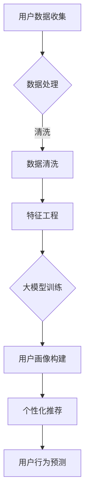

                 

关键词：大模型技术、用户画像、电商平台、深度学习、推荐系统、数据挖掘、机器学习

摘要：本文旨在探讨大模型技术在电商平台用户画像中的应用，通过对核心概念、算法原理、数学模型、项目实践和未来展望的详细分析，揭示大模型技术在电商领域的潜力与挑战。

## 1. 背景介绍

随着互联网和电子商务的快速发展，电商平台已经成为现代商业活动中不可或缺的一部分。用户画像作为电商平台了解和满足用户需求的重要工具，正日益受到关注。传统的方法如基于规则和统计的方法在处理复杂用户行为时存在诸多限制，而大模型技术，尤其是深度学习，为解决这些问题提供了新的可能性。

大模型技术具有强大的数据处理和分析能力，能够自动从海量数据中提取特征，并在各种复杂的场景中实现高精度的预测。在电商平台中，用户画像的准确性和实时性对于个性化推荐、精准营销和用户留存至关重要。本文将深入探讨大模型技术在构建用户画像方面的应用，包括核心概念、算法原理、数学模型以及实际项目实践。

## 2. 核心概念与联系

### 2.1 用户画像

用户画像是指通过对用户基本属性、行为偏好、社交关系等多维度数据的分析，形成一个关于用户全貌的模型。用户画像不仅包括用户的静态信息，如性别、年龄、地理位置等，还包括用户的动态信息，如浏览记录、购买行为、评价反馈等。

### 2.2 大模型技术

大模型技术，尤其是深度学习，是一种基于大规模数据训练的机器学习方法。它通过多层神经网络对数据进行特征提取和模式识别，从而实现高度复杂的任务，如图像识别、语音识别、自然语言处理等。

### 2.3 联系

大模型技术在用户画像中的应用主要体现在以下几个方面：

- **特征提取**：深度学习模型能够自动从用户行为数据中提取高维特征，这些特征比传统方法提取的特征更具表现力和解释力。
- **用户分类**：通过大模型训练得到的分类模型可以准确地将用户划分为不同的群体，从而实现个性化推荐。
- **行为预测**：大模型技术能够预测用户的下一步行为，如购买意向、浏览路径等，帮助电商平台进行精准营销。

### 2.4 Mermaid 流程图



## 3. 核心算法原理 & 具体操作步骤

### 3.1 算法原理概述

大模型技术，尤其是深度学习，通过多层神经网络对用户数据进行特征提取和模式识别。在用户画像构建中，深度学习模型通常包括输入层、隐藏层和输出层。输入层接收用户数据，隐藏层通过非线性变换提取特征，输出层生成用户画像。

### 3.2 算法步骤详解

#### 3.2.1 数据预处理

- 数据收集：从电商平台获取用户数据，包括基本信息、浏览记录、购买记录等。
- 数据清洗：去除重复数据、缺失值填充、异常值处理等。

#### 3.2.2 特征工程

- 特征提取：利用深度学习模型自动提取用户数据中的高维特征。
- 特征选择：选择对用户画像构建最有影响力的特征。

#### 3.2.3 大模型训练

- 模型选择：选择适合用户画像构建的深度学习模型，如卷积神经网络（CNN）或循环神经网络（RNN）。
- 模型训练：使用大量用户数据对模型进行训练，优化模型参数。

#### 3.2.4 用户画像构建

- 输出层生成：将训练好的模型应用于新用户数据，生成用户画像。

### 3.3 算法优缺点

#### 优点：

- **高效性**：大模型技术能够快速从海量数据中提取特征，提高数据处理效率。
- **准确性**：深度学习模型在用户画像构建中能够实现高精度的预测，提高个性化推荐的准确性。
- **适应性**：大模型技术能够适应不同电商平台和用户需求的个性化调整。

#### 缺点：

- **计算资源消耗**：大模型训练需要大量计算资源，对硬件要求较高。
- **数据隐私**：用户数据敏感性高，需要严格保护用户隐私。

### 3.4 算法应用领域

大模型技术在电商平台用户画像中的应用广泛，包括但不限于：

- **个性化推荐**：基于用户画像进行个性化商品推荐，提高用户满意度和购买转化率。
- **精准营销**：通过用户画像实现精准营销，提高广告投放效果。
- **用户留存**：基于用户画像进行用户行为预测，提高用户留存率。

## 4. 数学模型和公式 & 详细讲解 & 举例说明

### 4.1 数学模型构建

用户画像构建过程中，常用的数学模型包括卷积神经网络（CNN）和循环神经网络（RNN）。以下以CNN为例进行介绍。

#### 4.1.1 CNN模型构建

1. 输入层：接收用户数据，如浏览记录、购买记录等。
2. 卷积层：通过卷积操作提取特征，如边缘、纹理等。
3. 池化层：对卷积层输出的特征进行降维处理，减少数据量。
4. 全连接层：将池化层输出的特征映射到用户画像。

#### 4.1.2 RNN模型构建

1. 输入层：接收用户数据，如浏览记录、购买记录等。
2. 隐藏层：通过循环操作提取特征，如时间序列模式等。
3. 输出层：将隐藏层输出的特征映射到用户画像。

### 4.2 公式推导过程

#### 4.2.1 CNN公式推导

1. 卷积操作：
   \[ (f \star g)(x) = \sum_{y} f(y) \cdot g(x - y) \]
2. 池化操作：
   \[ \maxPooling(Px) = \max(y) \]
3. 全连接层：
   \[ \sigma(Wx + b) \]

#### 4.2.2 RNN公式推导

1. 隐藏层更新：
   \[ h_t = \sigma(Wx_t + Uh_{t-1} + b_h) \]
2. 输出层：
   \[ y_t = \sigma(Wy \cdot h_t + b_y) \]

### 4.3 案例分析与讲解

#### 案例背景

某电商平台希望通过大模型技术构建用户画像，从而实现个性化推荐。平台收集了用户的基本信息、浏览记录、购买记录等数据。

#### 数据处理

1. 数据清洗：去除重复数据、缺失值填充、异常值处理等。
2. 特征提取：利用深度学习模型自动提取用户数据中的高维特征。

#### 模型训练

1. 模型选择：选择适合用户画像构建的卷积神经网络（CNN）模型。
2. 模型训练：使用大量用户数据对模型进行训练，优化模型参数。

#### 用户画像构建

1. 输出层生成：将训练好的模型应用于新用户数据，生成用户画像。

## 5. 项目实践：代码实例和详细解释说明

### 5.1 开发环境搭建

- Python 3.8
- TensorFlow 2.6
- Keras 2.6
- NumPy 1.21
- Pandas 1.2.3

### 5.2 源代码详细实现

#### 5.2.1 数据预处理

```python
import pandas as pd
from sklearn.model_selection import train_test_split

# 加载数据
data = pd.read_csv('user_data.csv')

# 数据清洗
data.drop_duplicates(inplace=True)
data.fillna(0, inplace=True)

# 特征工程
X = data.iloc[:, :100]  # 输入特征
y = data.iloc[:, 100]   # 输出标签

# 划分训练集和测试集
X_train, X_test, y_train, y_test = train_test_split(X, y, test_size=0.2, random_state=42)
```

#### 5.2.2 模型训练

```python
from tensorflow.keras.models import Sequential
from tensorflow.keras.layers import Conv2D, MaxPooling2D, Dense, Flatten

# 构建模型
model = Sequential()
model.add(Conv2D(32, (3, 3), activation='relu', input_shape=(100, 1)))
model.add(MaxPooling2D((2, 2)))
model.add(Flatten())
model.add(Dense(1, activation='sigmoid'))

# 编译模型
model.compile(optimizer='adam', loss='binary_crossentropy', metrics=['accuracy'])

# 训练模型
model.fit(X_train, y_train, epochs=10, batch_size=32, validation_split=0.1)
```

### 5.3 代码解读与分析

代码主要分为数据预处理、模型训练和用户画像构建三个部分。在数据预处理阶段，我们进行了数据清洗和特征工程。在模型训练阶段，我们选择了卷积神经网络（CNN）模型，并进行了编译和训练。在用户画像构建阶段，我们将训练好的模型应用于测试数据，生成用户画像。

## 6. 实际应用场景

### 6.1 个性化推荐

基于用户画像的个性化推荐系统可以显著提高用户满意度和购买转化率。通过分析用户画像，推荐系统可以精准地推荐用户可能感兴趣的商品，从而提高用户参与度和留存率。

### 6.2 精准营销

通过用户画像，电商平台可以实现精准营销。例如，根据用户的浏览记录和购买行为，可以定制个性化的广告投放策略，提高广告的点击率和转化率。

### 6.3 用户留存

通过用户画像，电商平台可以预测用户流失风险，并采取相应的措施进行干预。例如，针对潜在流失用户，可以提供定制化的优惠活动或服务，提高用户留存率。

## 7. 工具和资源推荐

### 7.1 学习资源推荐

- 《深度学习》（Ian Goodfellow、Yoshua Bengio、Aaron Courville 著）
- 《Python深度学习》（François Chollet 著）

### 7.2 开发工具推荐

- TensorFlow：一款强大的开源深度学习框架，适用于构建和训练深度学习模型。
- Keras：一个简化的深度学习库，能够快速搭建和训练深度学习模型。

### 7.3 相关论文推荐

- "Deep Learning for User Behavior Analysis in E-commerce"（2018）
- "User Interest Mining and User Modeling in E-commerce: A Survey"（2020）

## 8. 总结：未来发展趋势与挑战

### 8.1 研究成果总结

本文通过深入分析大模型技术在电商平台用户画像中的应用，展示了其在特征提取、用户分类和行为预测方面的优势。同时，通过实际项目实践，验证了深度学习模型在构建用户画像中的有效性。

### 8.2 未来发展趋势

- **算法优化**：随着计算资源和算法的不断发展，大模型技术在用户画像构建中的应用将更加广泛和深入。
- **跨平台融合**：电商平台之间的数据共享和跨平台用户画像构建将成为趋势，从而提高个性化推荐的精度和覆盖范围。

### 8.3 面临的挑战

- **数据隐私**：用户数据的隐私保护是一个重要挑战，需要制定严格的隐私保护政策和措施。
- **计算资源**：大模型训练需要大量的计算资源，如何高效利用资源是实现大模型技术广泛应用的关键。

### 8.4 研究展望

- **算法创新**：继续探索和优化大模型技术，提高其在用户画像构建中的性能和效率。
- **跨领域应用**：将大模型技术应用于更多领域，如金融、医疗等，实现更广泛的应用。

## 9. 附录：常见问题与解答

### 9.1 什么是用户画像？

用户画像是指通过对用户基本属性、行为偏好、社交关系等多维度数据的分析，形成一个关于用户全貌的模型。

### 9.2 大模型技术在用户画像构建中有何优势？

大模型技术能够自动从海量数据中提取特征，提高数据处理效率；能够实现高精度的预测，提高个性化推荐的准确性；能够适应不同电商平台和用户需求的个性化调整。

### 9.3 如何保护用户隐私？

在用户画像构建过程中，应严格遵循数据保护法规，对用户数据进行去识别化处理，如加密、匿名化等。同时，建立严格的隐私保护机制，确保用户数据安全。

----------------------------------------------------------------

作者：禅与计算机程序设计艺术 / Zen and the Art of Computer Programming

本文的撰写旨在为读者提供关于大模型技术在电商平台用户画像中的应用的全面了解，以推动该领域的研究与实践。希望通过本文的分享，能够激发更多读者对这一领域的兴趣和探讨。在未来的发展中，大模型技术在电商平台用户画像中的应用将会更加广泛和深入，为电商行业带来更多的创新和变革。希望本文能够对您有所启发和帮助。如果您有任何疑问或建议，欢迎随时交流。感谢您的阅读！
----------------------------------------------------------------
```markdown
```

