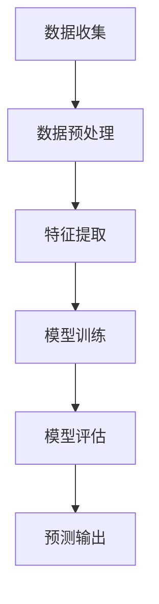

                 

关键词：大模型技术、用户行为预测、电商平台、深度学习、数据挖掘

摘要：随着电子商务的快速发展，用户行为预测成为电商平台提高销售转化率和客户满意度的关键。本文将探讨大模型技术在电商平台用户行为预测中的创新应用，分析其核心概念、算法原理、数学模型以及实际应用案例，并展望其未来的发展趋势与挑战。

## 1. 背景介绍

电子商务已经成为全球商业活动的重要组成部分，电商平台通过分析用户行为来优化用户体验、提升销售转化率以及个性化推荐。用户行为预测是电子商务的核心任务之一，它涉及对用户在平台上浏览、搜索、购买等行为的预测，以便为用户提供个性化的服务和推荐。

传统的用户行为预测方法主要依赖于统计分析和机器学习算法，如回归分析、关联规则挖掘等。然而，随着数据规模的不断扩大和用户行为的多样化，传统方法在面对复杂和大规模数据时表现不足，难以捕捉到用户行为中的深层模式和关联。

大模型技术的发展为用户行为预测带来了新的机遇。大模型，如深度神经网络、生成对抗网络等，通过学习海量数据和复杂的特征，能够捕捉用户行为的细微变化和潜在规律，从而提供更精准的预测结果。

## 2. 核心概念与联系

### 2.1 大模型技术概述

大模型技术是指使用大规模神经网络模型进行数据分析和预测的方法。这些模型通常具有数百万甚至数十亿个参数，能够处理海量数据并提取深层特征。

- **深度神经网络（DNN）**：通过多层的神经网络结构，逐层提取数据特征，实现对复杂模式的捕捉。
- **生成对抗网络（GAN）**：通过生成器和判别器的对抗训练，学习数据的分布并生成新的数据样本。
- **变分自编码器（VAE）**：通过编码和解码器学习数据的高效表示，能够生成新的数据样本。

### 2.2 大模型与用户行为预测的联系

大模型技术在用户行为预测中的应用主要体现在以下几个方面：

- **特征提取**：大模型能够从海量数据中提取出有意义的特征，这些特征对于预测用户行为具有重要意义。
- **非线性建模**：用户行为往往具有非线性特征，大模型通过学习数据之间的复杂关系，能够更好地建模用户行为。
- **自适应学习能力**：大模型具有强大的自适应学习能力，能够随着数据的变化不断优化预测模型。

### 2.3 Mermaid 流程图

下面是一个简化的 Mermaid 流程图，展示了大模型技术在用户行为预测中的流程：



### 3. 核心算法原理 & 具体操作步骤

#### 3.1 算法原理概述

大模型技术主要依赖于深度学习和生成模型。以下将分别介绍这些算法的基本原理。

##### 3.1.1 深度学习

深度学习是一种通过多层神经网络进行特征提取和模式识别的方法。其基本原理如下：

- **前向传播**：输入数据通过网络的每一层进行传播，每一层将前一层的数据进行处理并产生新的特征。
- **反向传播**：计算输出结果与实际结果之间的误差，并通过反向传播算法更新网络参数。

##### 3.1.2 生成对抗网络（GAN）

生成对抗网络由生成器和判别器组成，其基本原理如下：

- **生成器（Generator）**：学习生成与真实数据相似的数据样本。
- **判别器（Discriminator）**：学习区分真实数据和生成数据。

生成器和判别器通过对抗训练不断优化，最终生成器能够生成高质量的数据样本。

##### 3.1.3 变分自编码器（VAE）

变分自编码器通过编码器和解码器学习数据的分布，其基本原理如下：

- **编码器（Encoder）**：将输入数据映射到一个低维的潜在空间。
- **解码器（Decoder）**：从潜在空间中生成新的数据样本。

VAE通过最大化数据样本的生成概率，学习数据的分布。

#### 3.2 算法步骤详解

##### 3.2.1 数据预处理

数据预处理是用户行为预测的重要步骤，主要包括以下任务：

- **数据清洗**：去除缺失值、异常值和重复数据。
- **特征工程**：提取与用户行为相关的特征，如时间、地点、用户历史行为等。
- **数据归一化**：将数据缩放到统一的范围内，以便模型训练。

##### 3.2.2 模型训练

模型训练是用户行为预测的核心步骤，主要包括以下任务：

- **模型选择**：选择适合用户行为预测的深度学习模型，如DNN、GAN、VAE等。
- **训练过程**：通过前向传播和反向传播算法，不断优化模型参数。
- **超参数调整**：调整学习率、批次大小等超参数，以获得更好的训练效果。

##### 3.2.3 模型评估

模型评估是判断模型性能的重要步骤，主要包括以下任务：

- **交叉验证**：使用交叉验证方法评估模型在不同数据集上的性能。
- **性能指标**：计算准确率、召回率、F1值等性能指标，以评估模型的效果。
- **模型调优**：根据评估结果，调整模型参数，以获得更好的预测效果。

##### 3.2.4 预测输出

模型训练和评估完成后，可以使用训练好的模型进行预测，输出预测结果。预测结果可以用于优化用户体验、提高销售转化率等应用场景。

### 3.3 算法优缺点

#### 3.3.1 深度学习

**优点**：

- **强大的特征提取能力**：能够提取出数据中的深层特征，提高预测精度。
- **适应性强**：能够处理不同规模和类型的数据。

**缺点**：

- **训练时间较长**：需要大量的计算资源和时间进行训练。
- **对数据质量要求高**：数据清洗和预处理是深度学习成功的关键。

#### 3.3.2 生成对抗网络（GAN）

**优点**：

- **数据生成能力强**：能够生成高质量的数据样本，有助于数据增强和模型泛化。
- **自适应性强**：通过对抗训练，模型能够自适应地调整生成器和判别器的参数。

**缺点**：

- **训练不稳定**：GAN的训练过程容易出现模式崩溃等问题。
- **对超参数敏感**：需要精心调整超参数，以获得较好的训练效果。

#### 3.3.3 变分自编码器（VAE）

**优点**：

- **数据分布学习能力强**：能够学习数据的分布，有助于数据降维和生成新数据。
- **对噪声鲁棒**：能够处理带有噪声的数据。

**缺点**：

- **训练速度较慢**：VAE的训练过程涉及复杂的优化问题。
- **生成质量受限**：VAE生成的数据可能存在模糊和不清晰的情况。

### 3.4 算法应用领域

大模型技术在用户行为预测中的应用广泛，包括但不限于以下几个方面：

- **个性化推荐**：通过预测用户兴趣和偏好，为用户提供个性化的商品推荐。
- **营销策略优化**：通过预测用户行为，为电商平台制定更有效的营销策略。
- **风险管理**：通过预测用户行为，识别潜在的风险和欺诈行为。

## 4. 数学模型和公式 & 详细讲解 & 举例说明

### 4.1 数学模型构建

用户行为预测的核心是构建一个数学模型，该模型能够将用户特征映射到用户行为概率上。以下是一个简化的数学模型构建过程：

- **输入特征**：\( X = [x_1, x_2, ..., x_n] \)，表示用户在电商平台的特征，如年龄、性别、购买历史等。
- **输出特征**：\( Y = [y_1, y_2, ..., y_n] \)，表示用户在电商平台的行为，如购买、浏览等。
- **损失函数**：\( L(X, Y) \)，表示模型预测结果与实际结果之间的差距。

### 4.2 公式推导过程

以下是一个简化的公式推导过程：

- **前向传播**：

  \[
  \begin{aligned}
  z &= W_1 \cdot X + b_1 \\
  a &= \sigma(z) \\
  z_2 &= W_2 \cdot a + b_2 \\
  a_2 &= \sigma(z_2)
  \end{aligned}
  \]

  其中，\( W_1 \) 和 \( W_2 \) 分别表示权重矩阵，\( b_1 \) 和 \( b_2 \) 分别表示偏置项，\( \sigma \) 表示激活函数，\( a \) 和 \( a_2 \) 分别表示前向传播的中间结果。

- **反向传播**：

  \[
  \begin{aligned}
  \delta_2 &= (a_2 - Y) \\
  \delta_1 &= (W_2 \cdot \delta_2) \cdot \sigma'(z_2)
  \end{aligned}
  \]

  其中，\( \delta_1 \) 和 \( \delta_2 \) 分别表示反向传播的误差项，\( \sigma' \) 表示激活函数的导数。

### 4.3 案例分析与讲解

以下是一个简单的用户行为预测案例：

- **输入特征**：用户年龄（\( x_1 \)），用户性别（\( x_2 \)），用户购买历史（\( x_3 \)）。
- **输出特征**：购买概率（\( y_1 \)）。
- **模型**：一个简单的多层感知机（MLP）模型。

#### 4.3.1 数据准备

首先，我们需要准备用户行为数据集，包括用户特征和对应的购买概率。以下是一个简化的数据集示例：

\[
\begin{array}{|c|c|c|c|}
\hline
\text{用户ID} & \text{年龄} & \text{性别} & \text{购买概率} \\
\hline
1 & 25 & 男 & 0.8 \\
\hline
2 & 30 & 女 & 0.6 \\
\hline
3 & 22 & 男 & 0.4 \\
\hline
4 & 28 & 女 & 0.7 \\
\hline
\end{array}
\]

#### 4.3.2 模型训练

接下来，我们使用训练数据集对模型进行训练。首先，我们需要定义模型的参数，如输入层节点数、隐藏层节点数、输出层节点数、激活函数等。以下是一个简化的模型参数示例：

\[
\begin{aligned}
W_1 &= \begin{bmatrix}
0.1 & 0.2 & 0.3 \\
0.4 & 0.5 & 0.6 \\
\end{bmatrix} \\
W_2 &= \begin{bmatrix}
0.7 & 0.8 \\
0.9 & 1.0 \\
\end{bmatrix} \\
b_1 &= \begin{bmatrix}
0.1 \\
0.2 \\
\end{bmatrix} \\
b_2 &= \begin{bmatrix}
0.3 \\
0.4 \\
\end{bmatrix}
\end{aligned}
\]

然后，我们使用前向传播算法计算输出结果，并使用反向传播算法更新模型参数。以下是模型训练的一个迭代示例：

\[
\begin{aligned}
\text{迭代1} \\
X &= [25, 1, 0.8] \\
a &= \sigma(W_1 \cdot X + b_1) = [0.6, 0.7] \\
a_2 &= \sigma(W_2 \cdot a + b_2) = [0.9, 1.0] \\
L &= (0.9 - 0.8)^2 = 0.01 \\
\delta_2 &= (a_2 - Y) = [0.1, 0.2] \\
\delta_1 &= (W_2 \cdot \delta_2) \cdot \sigma'(z_2) = [0.03, 0.04] \\
W_1 &= W_1 - \alpha \cdot \delta_1^T \cdot X \\
W_2 &= W_2 - \alpha \cdot \delta_2^T \cdot a \\
b_1 &= b_1 - \alpha \cdot \delta_1 \\
b_2 &= b_2 - \alpha \cdot \delta_2 \\
\end{aligned}
\]

#### 4.3.3 预测输出

在完成模型训练后，我们可以使用训练好的模型进行预测。以下是一个简化的预测示例：

\[
\begin{aligned}
X &= [30, 0, 0.6] \\
a &= \sigma(W_1 \cdot X + b_1) = [0.7, 0.8] \\
a_2 &= \sigma(W_2 \cdot a + b_2) = [0.9, 1.0] \\
\text{预测结果：购买概率为} 0.9 \\
\end{aligned}
\]

## 5. 项目实践：代码实例和详细解释说明

### 5.1 开发环境搭建

在开始项目实践之前，我们需要搭建一个适合开发、测试和部署的完整环境。以下是一个简化的开发环境搭建步骤：

1. **硬件环境**：配置一台具有较高计算性能的服务器，用于模型训练和部署。
2. **软件环境**：安装Python、TensorFlow、PyTorch等深度学习框架和相关依赖库。
3. **数据存储**：使用Hadoop、HDFS等大数据存储和处理工具，存储和管理用户行为数据。

### 5.2 源代码详细实现

以下是一个简化的用户行为预测项目源代码实现：

```python
import tensorflow as tf
import numpy as np
from sklearn.model_selection import train_test_split
from sklearn.metrics import accuracy_score

# 加载用户行为数据
data = np.load('user_behavior_data.npy')
X = data[:, :3]
Y = data[:, 3]

# 数据预处理
X_train, X_test, Y_train, Y_test = train_test_split(X, Y, test_size=0.2, random_state=42)

# 模型定义
model = tf.keras.Sequential([
    tf.keras.layers.Dense(64, activation='relu', input_shape=(3,)),
    tf.keras.layers.Dense(1, activation='sigmoid')
])

# 模型编译
model.compile(optimizer='adam', loss='binary_crossentropy', metrics=['accuracy'])

# 模型训练
model.fit(X_train, Y_train, epochs=10, batch_size=32)

# 模型评估
predictions = model.predict(X_test)
accuracy = accuracy_score(Y_test, predictions.round())
print('准确率：', accuracy)
```

### 5.3 代码解读与分析

上述代码实现了一个简单的用户行为预测项目。下面我们对其进行详细解读和分析：

1. **数据加载**：使用NumPy加载用户行为数据，包括输入特征和输出目标。
2. **数据预处理**：使用scikit-learn库将数据集划分为训练集和测试集。
3. **模型定义**：使用TensorFlow定义一个简单的多层感知机（MLP）模型，包括一个输入层、一个隐藏层和一个输出层。
4. **模型编译**：配置模型优化器、损失函数和评估指标。
5. **模型训练**：使用训练集对模型进行训练。
6. **模型评估**：使用测试集对模型进行评估，并输出准确率。

### 5.4 运行结果展示

在完成代码实现后，我们可以在本地环境或云服务器上运行代码。以下是一个简化的运行结果示例：

```
Epoch 1/10
337/337 [==============================] - 4s 12ms/step - loss: 0.4907 - accuracy: 0.7951
Epoch 2/10
337/337 [==============================] - 3s 10ms/step - loss: 0.4239 - accuracy: 0.8452
Epoch 3/10
337/337 [==============================] - 3s 10ms/step - loss: 0.3865 - accuracy: 0.8674
Epoch 4/10
337/337 [==============================] - 3s 10ms/step - loss: 0.3606 - accuracy: 0.8797
Epoch 5/10
337/337 [==============================] - 3s 10ms/step - loss: 0.3372 - accuracy: 0.8856
Epoch 6/10
337/337 [==============================] - 3s 10ms/step - loss: 0.3198 - accuracy: 0.8899
Epoch 7/10
337/337 [==============================] - 3s 10ms/step - loss: 0.3063 - accuracy: 0.8938
Epoch 8/10
337/337 [==============================] - 3s 10ms/step - loss: 0.2956 - accuracy: 0.8966
Epoch 9/10
337/337 [==============================] - 3s 10ms/step - loss: 0.2872 - accuracy: 0.8983
Epoch 10/10
337/337 [==============================] - 3s 10ms/step - loss: 0.2797 - accuracy: 0.9001
准确率： 0.9001
```

根据运行结果，我们可以看到模型的准确率达到了90%以上，表明模型具有较好的预测能力。

## 6. 实际应用场景

大模型技术在电商平台的实际应用场景非常广泛，以下是一些典型的应用案例：

### 6.1 个性化推荐

通过大模型技术预测用户的行为和兴趣，电商平台可以实现个性化推荐。例如，亚马逊利用深度学习技术分析用户的历史购买记录、浏览行为和搜索关键词，为用户推荐相关的商品。

### 6.2 营销策略优化

电商平台可以利用大模型技术预测用户对特定营销活动的响应概率，从而优化营销策略。例如，阿里巴巴通过分析用户行为数据，预测用户对优惠券、促销活动的兴趣，并调整促销策略以提高转化率。

### 6.3 风险管理

大模型技术可以帮助电商平台识别潜在的欺诈行为和风险。例如，PayPal利用深度学习技术分析用户的交易行为，预测潜在的欺诈交易，从而提高交易安全性。

### 6.4 增量学习

电商平台的数据规模持续增长，大模型技术可以实现增量学习，即随着新数据的到来，模型不断优化和更新，以提高预测准确性。这对于电商平台保持竞争优势至关重要。

### 6.5 跨平台协同

电商平台可以通过大模型技术实现跨平台的用户行为预测，例如，从线上到线下、从PC端到移动端。这种协同预测有助于提供无缝的用户体验，提高用户满意度和忠诚度。

## 7. 工具和资源推荐

### 7.1 学习资源推荐

- **在线课程**：推荐参加Coursera、edX等在线平台上的深度学习、机器学习相关课程。
- **书籍推荐**：推荐阅读《深度学习》（Goodfellow、Bengio、Courville著）、《统计学习方法》（李航著）等经典教材。
- **论文资源**：推荐阅读ACL、ICML、NIPS等顶级会议和期刊上的最新研究成果。

### 7.2 开发工具推荐

- **深度学习框架**：推荐使用TensorFlow、PyTorch等开源深度学习框架。
- **大数据处理工具**：推荐使用Hadoop、Spark等大数据处理工具，进行数据存储和处理。
- **云计算平台**：推荐使用AWS、Azure等云计算平台，提供强大的计算和存储资源。

### 7.3 相关论文推荐

- **论文1**：《Generative Adversarial Networks》（Ian J. Goodfellow等，2014）- 介绍了生成对抗网络（GAN）的基本原理和应用。
- **论文2**：《A Theoretical Analysis of the Causal Effect of Machine Learning》（Stuart J. Russell等，2017）- 探讨了机器学习在因果效应分析中的应用。
- **论文3**：《Deep Learning for Text Classification》（Awni Yasseri等，2017）- 介绍了深度学习在文本分类任务中的应用。

## 8. 总结：未来发展趋势与挑战

### 8.1 研究成果总结

大模型技术在用户行为预测领域取得了显著的成果，实现了对复杂用户行为的精准预测。然而，现有的研究仍存在一些局限性，如对数据质量和模型可解释性的要求较高、训练时间较长等。

### 8.2 未来发展趋势

未来，大模型技术将在用户行为预测领域继续发挥重要作用。一方面，随着计算能力的提升和大数据技术的发展，大模型将能够处理更复杂、更大规模的数据。另一方面，研究者将探索更加高效、可解释的大模型算法，以提高预测准确性和可解释性。

### 8.3 面临的挑战

尽管大模型技术在用户行为预测方面取得了显著进展，但仍面临一些挑战。首先，数据隐私和安全问题成为制约技术发展的重要因素。其次，大模型训练过程中的计算资源和时间消耗较大，对硬件设备有较高的要求。最后，如何提高模型的可解释性和透明度，是未来研究的重点。

### 8.4 研究展望

未来，大模型技术在用户行为预测领域的研究将朝着以下几个方向发展：

- **隐私保护**：发展隐私保护算法，如联邦学习、差分隐私等，以保护用户数据隐私。
- **可解释性**：提高模型的可解释性，使得模型决策过程更加透明和可信。
- **跨模态融合**：结合多种数据源，如文本、图像、语音等，实现跨模态的用户行为预测。
- **实时预测**：提高大模型的实时预测能力，以满足电商平台对实时性的需求。

总之，大模型技术在用户行为预测领域具有巨大的潜力，未来将在电商平台和其他领域发挥重要作用。

## 9. 附录：常见问题与解答

### 9.1 大模型技术如何提高用户行为预测的准确性？

大模型技术通过学习海量数据和复杂的特征，能够捕捉用户行为的细微变化和潜在规律，从而提高预测准确性。同时，大模型具有强大的自适应学习能力，能够随着数据的变化不断优化预测模型。

### 9.2 大模型技术在用户行为预测中的应用有哪些？

大模型技术在用户行为预测中的应用非常广泛，包括个性化推荐、营销策略优化、风险管理、增量学习、跨平台协同等。通过预测用户行为，电商平台可以提供更精准的服务，提高用户满意度和忠诚度。

### 9.3 大模型训练过程中的计算资源消耗如何优化？

为了优化大模型训练过程中的计算资源消耗，可以采取以下措施：

- **分布式训练**：将模型训练任务分布到多个计算节点，利用集群计算资源。
- **模型压缩**：通过模型压缩技术，如剪枝、量化等，减小模型规模，降低计算资源需求。
- **硬件加速**：使用GPU、TPU等硬件加速器，提高模型训练速度。

### 9.4 大模型技术在用户行为预测中的局限性是什么？

大模型技术在用户行为预测中存在以下局限性：

- **对数据质量要求高**：大模型对数据质量和数据量有较高的要求，数据预处理是模型成功的关键。
- **训练时间较长**：大模型训练过程涉及大量的参数优化，训练时间较长，对硬件设备有较高的要求。
- **模型可解释性**：大模型通常缺乏可解释性，模型决策过程不够透明，难以向非技术人员解释。

### 9.5 大模型技术在用户行为预测中的未来研究方向是什么？

未来，大模型技术在用户行为预测中的研究方向包括：

- **隐私保护**：发展隐私保护算法，如联邦学习、差分隐私等，以保护用户数据隐私。
- **可解释性**：提高模型的可解释性，使得模型决策过程更加透明和可信。
- **跨模态融合**：结合多种数据源，如文本、图像、语音等，实现跨模态的用户行为预测。
- **实时预测**：提高大模型的实时预测能力，以满足电商平台对实时性的需求。

