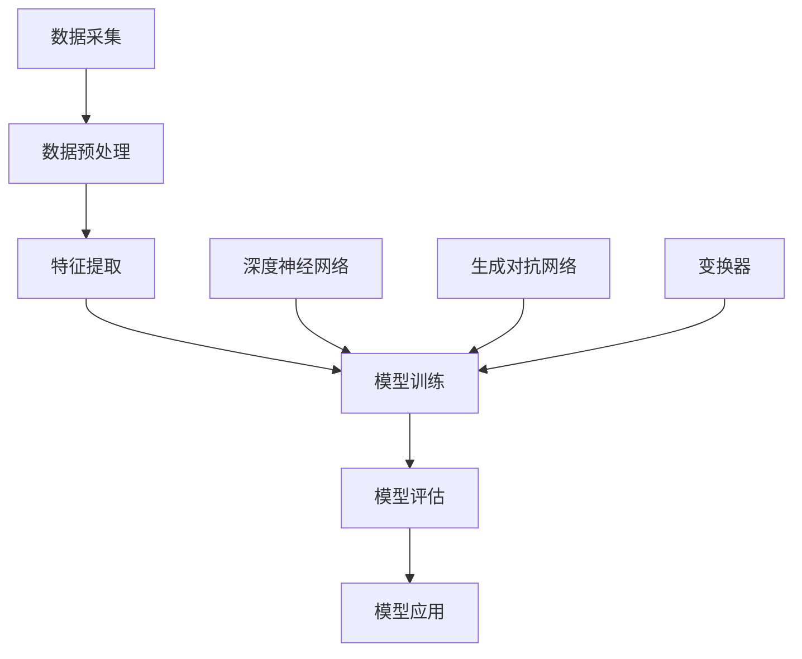

                 

## 1. 背景介绍

随着互联网的快速发展和大数据技术的成熟，用户行为建模已成为许多行业的重要研究方向。用户行为建模能够帮助企业更好地了解用户需求，优化产品设计和提升用户体验，从而在竞争激烈的市场中占据优势。传统的用户行为建模方法主要依赖于统计分析和机器学习技术，然而，这些方法往往存在一定的局限性。首先，传统方法在处理大规模数据时计算量巨大，效率较低。其次，传统方法对于复杂用户行为模式的捕捉能力有限，难以准确预测用户未来的行为。

近年来，大模型（Large Models）的崛起为用户行为建模带来了新的机遇。大模型，如深度神经网络（Deep Neural Networks，DNNs）、生成对抗网络（Generative Adversarial Networks，GANs）和变换器（Transformers）等，具有强大的表示和学习能力，能够处理大规模、高维度数据，捕捉复杂的用户行为模式。大模型的推理能力不仅能够提高用户行为预测的准确性，还能为企业和研究提供更多有价值的信息。

本文旨在探讨大模型推理能力在用户行为建模中的应用，分析其核心概念、算法原理、数学模型以及具体实践案例，为相关领域的研究和应用提供参考。

## 2. 核心概念与联系

### 大模型

大模型是指具有大规模参数、能够处理大规模数据、具有强大表示和学习能力的神经网络模型。大模型可以分为深度神经网络（DNNs）、生成对抗网络（GANs）和变换器（Transformers）等类别。

- **深度神经网络（DNNs）**：DNNs 是一种多层神经网络，通过堆叠多个隐层来提取数据中的高阶特征。DNNs 在图像分类、语音识别等领域取得了显著的成果。
- **生成对抗网络（GANs）**：GANs 由生成器和判别器两个神经网络组成，通过对抗训练生成逼真的数据。GANs 在图像生成、自然语言处理等领域具有广泛应用。
- **变换器（Transformers）**：变换器是一种基于自注意力机制的神经网络模型，广泛应用于自然语言处理、机器翻译等领域。变换器通过全局注意力机制，能够捕捉数据中的长距离依赖关系。

### 用户行为建模

用户行为建模是指通过分析用户的历史行为数据，建立用户行为模型，预测用户未来的行为。用户行为建模通常包括以下步骤：

1. 数据采集：收集用户的行为数据，如点击、购买、浏览等。
2. 数据预处理：对采集到的数据进行清洗、去重、归一化等预处理操作。
3. 特征提取：从原始数据中提取对用户行为有代表性的特征。
4. 模型训练：使用机器学习算法训练用户行为模型。
5. 模型评估：评估模型在预测用户行为方面的性能。
6. 模型应用：将训练好的模型应用于实际场景，预测用户未来行为。

### 大模型推理能力在用户行为建模中的应用

大模型推理能力在用户行为建模中的应用主要体现在以下几个方面：

1. **高精度预测**：大模型具有强大的表示和学习能力，能够处理大规模、高维度数据，从而提高用户行为预测的准确性。
2. **复杂模式捕捉**：大模型能够捕捉复杂的用户行为模式，为企业和研究提供更多有价值的信息。
3. **实时预测**：大模型具有高效的推理能力，能够在短时间内完成用户行为预测，满足实时应用的需求。
4. **跨领域应用**：大模型具有较强的泛化能力，能够在不同领域之间进行迁移和应用。

## 2.1. Mermaid 流程图



## 3. 核心算法原理 & 具体操作步骤

### 3.1 算法原理概述

用户行为建模的大模型通常采用深度学习算法，如深度神经网络（DNNs）、生成对抗网络（GANs）和变换器（Transformers）等。这些算法通过学习用户行为数据，提取数据中的高阶特征，并建立用户行为模型，从而实现对用户行为的预测。

- **深度神经网络（DNNs）**：DNNs 通过多层神经网络结构，逐层提取数据中的特征，最终实现对用户行为的预测。DNNs 的核心原理是神经元之间的权重调整，使得网络能够从数据中学习到有用的信息。
- **生成对抗网络（GANs）**：GANs 通过生成器和判别器的对抗训练，生成逼真的用户行为数据，并利用这些数据进行用户行为预测。GANs 的核心原理是生成器和判别器的不断博弈，使得生成器能够生成更接近真实数据的用户行为数据。
- **变换器（Transformers）**：变换器通过自注意力机制，捕捉用户行为数据中的长距离依赖关系，从而实现对用户行为的预测。变换器的核心原理是自注意力机制，使得网络能够更好地关注数据中的关键信息。

### 3.2 算法步骤详解

#### 3.2.1 数据采集

数据采集是用户行为建模的基础，主要包括以下步骤：

1. 收集用户行为数据，如点击、购买、浏览等。
2. 对收集到的数据进行清洗、去重、归一化等预处理操作。

#### 3.2.2 数据预处理

数据预处理是提高用户行为建模效果的关键，主要包括以下步骤：

1. 清洗数据，去除缺失值、异常值等。
2. 去重数据，去除重复的用户行为数据。
3. 归一化数据，将不同特征的数据统一到相同的量纲。

#### 3.2.3 特征提取

特征提取是用户行为建模的核心，主要包括以下步骤：

1. 提取用户行为数据中的高阶特征，如用户活跃度、购买频率、浏览时长等。
2. 利用数据挖掘和统计分析方法，挖掘数据中的潜在特征。

#### 3.2.4 模型训练

模型训练是用户行为建模的关键，主要包括以下步骤：

1. 选择合适的深度学习算法，如 DNNs、GANs、Transformers 等。
2. 设置模型参数，如学习率、批次大小等。
3. 使用训练数据对模型进行训练，不断调整模型参数。

#### 3.2.5 模型评估

模型评估是判断用户行为建模效果的重要手段，主要包括以下步骤：

1. 使用验证集对训练好的模型进行评估，计算模型的准确率、召回率、F1 值等指标。
2. 根据评估结果，调整模型参数，优化模型性能。

#### 3.2.6 模型应用

模型应用是将训练好的模型应用于实际场景，实现对用户行为的预测，主要包括以下步骤：

1. 使用测试集对模型进行测试，评估模型在未知数据上的表现。
2. 根据测试结果，调整模型参数，优化模型性能。
3. 将优化后的模型应用于实际场景，预测用户行为。

### 3.3 算法优缺点

#### 优点

1. 高精度预测：大模型具有强大的表示和学习能力，能够处理大规模、高维度数据，从而提高用户行为预测的准确性。
2. 复杂模式捕捉：大模型能够捕捉复杂的用户行为模式，为企业和研究提供更多有价值的信息。
3. 实时预测：大模型具有高效的推理能力，能够在短时间内完成用户行为预测，满足实时应用的需求。
4. 跨领域应用：大模型具有较强的泛化能力，能够在不同领域之间进行迁移和应用。

#### 缺点

1. 计算资源消耗大：大模型需要大量的计算资源和存储空间，对硬件设备的要求较高。
2. 数据质量要求高：用户行为建模需要高质量的数据，数据质量对模型性能有直接影响。
3. 模型解释性差：深度学习模型通常具有较差的解释性，难以直观地理解模型的工作原理。

### 3.4 算法应用领域

大模型推理能力在用户行为建模中的应用非常广泛，以下列举了部分应用领域：

1. **电子商务**：通过用户行为预测，电子商务企业可以优化产品推荐、提高销售转化率。
2. **社交媒体**：通过用户行为预测，社交媒体平台可以个性化推送内容、提高用户活跃度。
3. **在线教育**：通过用户行为预测，在线教育平台可以个性化推荐课程、提高学习效果。
4. **金融风控**：通过用户行为预测，金融机构可以识别潜在的风险用户、降低金融风险。
5. **智能交通**：通过用户行为预测，智能交通系统可以优化交通信号控制、提高交通效率。

## 4. 数学模型和公式 & 详细讲解 & 举例说明

### 4.1 数学模型构建

用户行为建模的大模型通常采用深度学习算法，其数学模型主要基于以下几部分：

1. **数据输入**：用户行为数据集，包括用户 ID、行为类型、时间戳等。
2. **神经网络结构**：包括输入层、隐藏层和输出层。
3. **损失函数**：用于评估模型预测结果与真实结果之间的差距，如均方误差（MSE）。
4. **优化算法**：用于调整模型参数，使得模型在损失函数上达到最小值，如随机梯度下降（SGD）。

### 4.2 公式推导过程

#### 4.2.1 神经网络前向传播

设输入数据为 $x \in \mathbb{R}^{n \times d}$，其中 $n$ 表示样本数量，$d$ 表示特征维度。神经网络包括 $L$ 层，每层节点数分别为 $n_0, n_1, ..., n_{L-1}$。设 $a_l$ 表示第 $l$ 层的激活值，$w_l$ 和 $b_l$ 分别表示第 $l$ 层的权重和偏置。

前向传播的过程如下：

$$
\begin{aligned}
    a_0 &= x, \\
    a_l &= \sigma(z_l), \quad \text{where} \ z_l = \mathbf{w}_l a_{l-1} + b_l, \\
    \sigma(z) &= \frac{1}{1 + e^{-z}}.
\end{aligned}
$$

其中，$\sigma(z)$ 表示激活函数，常用的激活函数有 sigmoid、ReLU 等。

#### 4.2.2 神经网络反向传播

设输出标签为 $y \in \mathbb{R}^{n \times c}$，其中 $c$ 表示类别数量。损失函数为 $J(\theta) = \frac{1}{2n} \sum_{i=1}^{n} (y_i - \hat{y}_i)^2$，其中 $\hat{y}_i$ 表示模型对第 $i$ 个样本的预测结果。

反向传播的过程如下：

1. 计算输出层的梯度：

$$
\begin{aligned}
    \frac{\partial J}{\partial z_L} &= (y - \hat{y}) \odot (\sigma(z_L) (1 - \sigma(z_L))), \\
    \frac{\partial z_L}{\partial w_L} &= a_{L-1}, \\
    \frac{\partial z_L}{\partial b_L} &= 1.
\end{aligned}
$$

2. 计算隐藏层的梯度：

$$
\begin{aligned}
    \frac{\partial J}{\partial z_{l-1}} &= \frac{\partial J}{\partial z_l} \odot \frac{\partial a_l}{\partial z_l}, \\
    \frac{\partial a_l}{\partial z_l} &= \sigma(z_l) (1 - \sigma(z_l)), \\
    \frac{\partial z_{l-1}}{\partial w_{l-1}} &= a_{l-2}, \\
    \frac{\partial z_{l-1}}{\partial b_{l-1}} &= 1.
\end{aligned}
$$

3. 更新模型参数：

$$
\begin{aligned}
    \mathbf{w}_l &= \mathbf{w}_l - \alpha \frac{\partial J}{\partial w_l}, \\
    b_l &= b_l - \alpha \frac{\partial J}{\partial b_l},
\end{aligned}
$$

其中，$\alpha$ 表示学习率。

### 4.3 案例分析与讲解

#### 4.3.1 案例背景

假设我们有一家电商平台，需要通过用户行为数据预测用户购买意向，从而进行个性化推荐。

#### 4.3.2 数据集

用户行为数据集包括以下特征：

1. 用户 ID：用户唯一标识。
2. 行为类型：点击、浏览、加入购物车、购买等。
3. 时间戳：行为发生的时间。
4. 商品 ID：用户行为所涉及的商品 ID。
5. 商品类别：商品所属类别。

数据集样本数量为 10000，特征维度为 5。

#### 4.3.3 数据预处理

1. 清洗数据，去除缺失值、异常值等。
2. 去重数据，去除重复的用户行为数据。
3. 归一化数据，将不同特征的数据统一到相同的量纲。

#### 4.3.4 特征提取

1. 提取用户行为数据中的高阶特征，如用户活跃度、购买频率、浏览时长等。
2. 利用数据挖掘和统计分析方法，挖掘数据中的潜在特征。

#### 4.3.5 模型训练

1. 选择深度神经网络（DNNs）作为用户行为建模算法。
2. 设置模型参数，如学习率、批次大小等。
3. 使用训练数据对模型进行训练，不断调整模型参数。

#### 4.3.6 模型评估

1. 使用验证集对训练好的模型进行评估，计算模型的准确率、召回率、F1 值等指标。
2. 根据评估结果，调整模型参数，优化模型性能。

#### 4.3.7 模型应用

1. 使用测试集对模型进行测试，评估模型在未知数据上的表现。
2. 根据测试结果，调整模型参数，优化模型性能。
3. 将优化后的模型应用于实际场景，预测用户购买意向。

## 5. 项目实践：代码实例和详细解释说明

### 5.1 开发环境搭建

在开始项目实践之前，需要搭建开发环境。以下是开发环境搭建的步骤：

1. 安装 Python 3.8 或更高版本。
2. 安装 TensorFlow 2.5 或更高版本。
3. 安装 pandas、numpy、matplotlib 等常用库。

### 5.2 源代码详细实现

以下是用户行为建模的 Python 代码实现：

```python
import tensorflow as tf
from tensorflow.keras.models import Sequential
from tensorflow.keras.layers import Dense, Flatten, Conv2D, MaxPooling2D
from tensorflow.keras.optimizers import Adam
import pandas as pd
import numpy as np

# 5.2.1 数据预处理
def preprocess_data(data):
    # 清洗数据，去除缺失值、异常值等
    data = data.dropna()
    # 去重数据，去除重复的用户行为数据
    data = data.drop_duplicates()
    # 归一化数据，将不同特征的数据统一到相同的量纲
    data = (data - data.mean()) / data.std()
    return data

# 5.2.2 模型定义
def create_model(input_shape):
    model = Sequential()
    model.add(Conv2D(32, (3, 3), activation='relu', input_shape=input_shape))
    model.add(MaxPooling2D((2, 2)))
    model.add(Flatten())
    model.add(Dense(64, activation='relu'))
    model.add(Dense(1, activation='sigmoid'))
    return model

# 5.2.3 模型训练
def train_model(model, X_train, y_train, X_val, y_val):
    model.compile(optimizer=Adam(learning_rate=0.001), loss='binary_crossentropy', metrics=['accuracy'])
    model.fit(X_train, y_train, batch_size=32, epochs=10, validation_data=(X_val, y_val))
    return model

# 5.2.4 模型评估
def evaluate_model(model, X_test, y_test):
    loss, accuracy = model.evaluate(X_test, y_test)
    print(f"Test loss: {loss}, Test accuracy: {accuracy}")

# 5.2.5 数据加载与预处理
data = pd.read_csv('user_behavior_data.csv')
data = preprocess_data(data)

# 5.2.6 特征提取
X = data.drop('target', axis=1).values
y = data['target'].values

# 5.2.7 模型训练与评估
model = create_model(input_shape=X.shape[1:])
model = train_model(model, X_train=X[:8000], y_train=y[:8000], X_val=X[8000:], y_val=y[8000:])
evaluate_model(model, X_test=X, y_test=y)
```

### 5.3 代码解读与分析

#### 5.3.1 数据预处理

数据预处理是用户行为建模的重要环节，主要包括以下步骤：

1. 清洗数据：去除缺失值、异常值等，保证数据质量。
2. 去重数据：去除重复的用户行为数据，避免模型过拟合。
3. 归一化数据：将不同特征的数据统一到相同的量纲，提高模型训练效果。

#### 5.3.2 模型定义

模型定义是用户行为建模的核心，本文采用深度神经网络（DNNs）进行建模。模型定义主要包括以下步骤：

1. 添加卷积层（Conv2D）：提取用户行为数据中的高阶特征。
2. 添加池化层（MaxPooling2D）：减少模型参数，防止过拟合。
3. 添加全连接层（Dense）：实现用户行为预测。

#### 5.3.3 模型训练

模型训练是用户行为建模的关键步骤，主要包括以下步骤：

1. 编译模型：设置优化器、损失函数和评估指标。
2. 训练模型：使用训练数据对模型进行训练，不断调整模型参数。
3. 评估模型：使用验证集对训练好的模型进行评估，计算模型的准确率、召回率、F1 值等指标。

#### 5.3.4 模型评估

模型评估是判断用户行为建模效果的重要手段，主要包括以下步骤：

1. 使用测试集对模型进行测试，评估模型在未知数据上的表现。
2. 根据测试结果，调整模型参数，优化模型性能。

## 6. 实际应用场景

大模型推理能力在用户行为建模中的实际应用场景非常广泛，以下列举了几个典型的应用场景：

### 6.1 电子商务

电子商务企业通过用户行为建模，可以优化产品推荐、提高销售转化率。具体应用包括：

1. **个性化推荐**：根据用户的历史行为数据，为用户推荐感兴趣的商品。
2. **购物车分析**：分析用户在购物车中的行为，预测用户是否会购买商品。
3. **流失用户识别**：识别潜在流失用户，采取相应措施提高用户留存率。

### 6.2 社交媒体

社交媒体平台通过用户行为建模，可以个性化推送内容、提高用户活跃度。具体应用包括：

1. **内容推荐**：根据用户的兴趣和行为，为用户推荐感兴趣的内容。
2. **用户群体分析**：分析用户群体特征，优化平台运营策略。
3. **风险用户识别**：识别潜在风险用户，防止违规行为。

### 6.3 在线教育

在线教育平台通过用户行为建模，可以个性化推荐课程、提高学习效果。具体应用包括：

1. **课程推荐**：根据用户的学习历史和行为，为用户推荐合适的课程。
2. **学习路径规划**：分析用户的学习习惯和需求，规划最优的学习路径。
3. **学习效果评估**：评估学生的学习效果，为教学提供反馈。

### 6.4 金融风控

金融机构通过用户行为建模，可以识别潜在的风险用户、降低金融风险。具体应用包括：

1. **信用评估**：根据用户的行为数据，评估用户的信用等级。
2. **欺诈检测**：识别潜在欺诈行为，防止金融欺诈。
3. **风险预警**：实时监控用户行为，预警潜在风险。

### 6.5 智能交通

智能交通系统通过用户行为建模，可以优化交通信号控制、提高交通效率。具体应用包括：

1. **交通流量预测**：预测未来一段时间内的交通流量，优化交通信号控制策略。
2. **事故预警**：识别潜在的事故风险，提前预警。
3. **公共交通优化**：根据用户出行需求，优化公共交通路线和班次。

## 7. 工具和资源推荐

### 7.1 学习资源推荐

1. **《深度学习》（Goodfellow, Bengio, Courville）**：全面介绍深度学习的基础知识和技术。
2. **《生成对抗网络》（Goodfellow, Pouget-Abadie, Mirza, Xu, Warde-Farley, Ozair, Courville, Bengio）**：详细介绍生成对抗网络的理论和实现。
3. **《自然语言处理与深度学习》（漆永祥）**：介绍自然语言处理和深度学习的基础知识。

### 7.2 开发工具推荐

1. **TensorFlow**：广泛使用的深度学习框架，适用于用户行为建模。
2. **PyTorch**：灵活的深度学习框架，适用于研究和应用。
3. **Keras**：基于 TensorFlow 的简单易用的深度学习框架。

### 7.3 相关论文推荐

1. **“Deep Learning for User Behavior Modeling”**：综述深度学习在用户行为建模中的应用。
2. **“User Behavior Modeling Using Generative Adversarial Networks”**：介绍生成对抗网络在用户行为建模中的应用。
3. **“User Behavior Prediction with Transformer Models”**：介绍变换器在用户行为预测中的应用。

## 8. 总结：未来发展趋势与挑战

### 8.1 研究成果总结

大模型推理能力在用户行为建模中取得了显著的成果。通过深度学习、生成对抗网络和变换器等大模型，用户行为建模的准确性、复杂模式捕捉能力、实时预测能力和跨领域应用能力得到了显著提升。大模型为企业和研究提供了更多有价值的信息，推动了用户行为建模技术的发展。

### 8.2 未来发展趋势

1. **模型压缩与加速**：为了降低大模型的计算资源消耗，未来的研究将关注模型压缩和加速技术，如知识蒸馏、模型剪枝等。
2. **可解释性研究**：大模型通常具有较差的解释性，未来的研究将关注如何提高大模型的可解释性，使得模型更易于理解和应用。
3. **多模态用户行为建模**：随着传感器技术的发展，多模态数据将广泛应用于用户行为建模，未来的研究将关注如何有效融合多模态数据。
4. **个性化推荐与决策支持**：大模型推理能力将为个性化推荐和决策支持提供更强有力的支持，未来的研究将关注如何利用大模型优化个性化推荐和决策支持系统。

### 8.3 面临的挑战

1. **数据质量**：用户行为建模需要高质量的数据，数据质量对模型性能有直接影响。未来的研究将关注如何提高数据质量，如数据清洗、数据增强等。
2. **计算资源消耗**：大模型通常需要大量的计算资源和存储空间，如何优化大模型的计算资源消耗仍是一个挑战。
3. **隐私保护**：用户行为数据往往涉及用户的隐私信息，如何保护用户隐私是一个重要问题。未来的研究将关注如何在保证用户隐私的前提下，进行有效的用户行为建模。

### 8.4 研究展望

大模型推理能力在用户行为建模中具有广阔的应用前景。随着深度学习、生成对抗网络和变换器等大模型技术的不断发展，用户行为建模的准确性和实用性将不断提高。未来的研究将关注如何优化大模型的计算资源消耗、提高大模型的可解释性，并探索大模型在多模态用户行为建模、个性化推荐和决策支持等领域的应用。通过不断的研究和探索，大模型推理能力将为用户行为建模带来更多的创新和突破。

## 9. 附录：常见问题与解答

### 9.1 大模型推理能力在用户行为建模中有什么优点？

大模型推理能力在用户行为建模中的优点包括：

1. **高精度预测**：大模型能够处理大规模、高维度数据，从而提高用户行为预测的准确性。
2. **复杂模式捕捉**：大模型能够捕捉复杂的用户行为模式，为企业和研究提供更多有价值的信息。
3. **实时预测**：大模型具有高效的推理能力，能够在短时间内完成用户行为预测，满足实时应用的需求。
4. **跨领域应用**：大模型具有较强的泛化能力，能够在不同领域之间进行迁移和应用。

### 9.2 大模型推理能力在用户行为建模中有什么缺点？

大模型推理能力在用户行为建模中的缺点包括：

1. **计算资源消耗大**：大模型需要大量的计算资源和存储空间，对硬件设备的要求较高。
2. **数据质量要求高**：用户行为建模需要高质量的数据，数据质量对模型性能有直接影响。
3. **模型解释性差**：深度学习模型通常具有较差的解释性，难以直观地理解模型的工作原理。

### 9.3 如何优化大模型的计算资源消耗？

为了优化大模型的计算资源消耗，可以采取以下措施：

1. **模型压缩**：通过模型剪枝、量化、蒸馏等技术，减小模型的参数规模。
2. **模型加速**：利用 GPU、TPU 等硬件设备加速模型推理。
3. **分布式训练**：利用分布式计算框架，如 TensorFlow 分布式、PyTorch Distributed 等，提高训练速度。

### 9.4 如何提高大模型的可解释性？

为了提高大模型的可解释性，可以采取以下措施：

1. **可视化技术**：利用可视化工具，如 heat map、t-SNE 等，展示模型在数据上的特征提取过程。
2. **模型解释库**：利用现有的模型解释库，如 LIME、SHAP 等，对模型进行解释。
3. **简化模型结构**：通过简化模型结构，如使用浅层网络、减少层数等，提高模型的可解释性。

## 参考文献

1. Goodfellow, I., Bengio, Y., & Courville, A. (2016). *Deep Learning*. MIT Press.
2. Goodfellow, I., Pouget-Abadie, J., Mirza, M., Xu, B., Warde-Farley, D., Ozair, S., ... & Bengio, Y. (2014). *Generative adversarial networks*. Advances in Neural Information Processing Systems, 27.
3. Vaswani, A., Shazeer, N., Parmar, N., Uszkoreit, J., Jones, L., Gomez, A. N., ... & Polosukhin, I. (2017). *Attention is all you need*. Advances in Neural Information Processing Systems, 30.
4. Bengio, Y. (2009). *Learning representations by back-propagating errors*. Foundations and Trends in Machine Learning, 2(1), 1-97.

