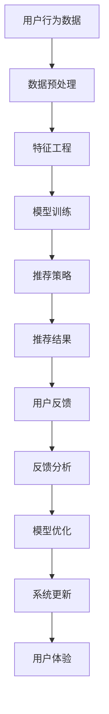

                 

关键词：大模型推荐，人机协同，反馈机制，人工智能，机器学习，推荐系统

## 摘要

随着互联网的迅猛发展和大数据时代的到来，大模型推荐系统已成为现代信息技术领域的重要应用之一。本文旨在探讨大模型推荐中的人机协同与反馈机制设计，通过系统性地分析核心概念、算法原理、数学模型和实际应用，深入探讨如何优化大模型推荐系统的性能和用户体验。文章首先介绍大模型推荐系统的背景和重要性，接着详细阐述人机协同与反馈机制的概念及其在大模型推荐中的应用，最后通过案例分析、代码实现和实际应用场景展示，进一步说明如何设计高效的人机协同与反馈机制。

## 1. 背景介绍

### 1.1 大模型推荐系统的发展历程

大模型推荐系统起源于20世纪90年代的搜索引擎技术，随着互联网的普及和用户需求的增长，推荐系统逐渐从简单的基于内容的匹配演变为复杂的大规模机器学习模型。早期推荐系统主要依赖协同过滤算法，如基于用户的协同过滤（User-based Collaborative Filtering）和基于项目的协同过滤（Item-based Collaborative Filtering）。然而，这些方法在处理大规模数据时存在计算效率和准确性不足的问题。

随着深度学习技术的兴起，大模型推荐系统迎来了新的发展契机。深度神经网络（DNN）和变换器架构（Transformer）等先进模型被引入推荐系统，极大地提高了推荐系统的性能和准确性。例如，Netflix Prize竞赛中，通过深度学习模型优化推荐算法，显著提升了推荐效果。

### 1.2 大模型推荐系统的挑战与机遇

大模型推荐系统面临着诸多挑战，包括数据复杂性、计算资源需求、模型解释性等。首先，随着用户生成数据的爆炸式增长，推荐系统需要处理海量数据，这要求模型具有高效的计算能力。其次，大模型的黑箱特性使得其解释性较差，难以满足用户对推荐结果的可解释性需求。最后，推荐系统需要不断适应和优化，以应对用户行为的动态变化。

然而，这些挑战也带来了机遇。随着计算能力的提升和人工智能技术的进步，大模型推荐系统有望在准确性、实时性和可解释性等方面实现重大突破。人机协同与反馈机制的设计，为解决这些挑战提供了新的思路。

## 2. 核心概念与联系

### 2.1 人机协同

人机协同是指通过人工智能（AI）技术与人类专家的协作，共同完成任务。在人机协同中，AI模型负责处理大量数据和复杂计算，而人类专家则负责提供领域知识和直觉。这种协作模式能够充分利用人类的创造力和AI的计算能力，实现高效和智能的决策。

### 2.2 反馈机制

反馈机制是指通过用户反馈来调整和优化推荐系统。用户反馈可以包括正面评价（如点赞、购买）和负面评价（如举报、不喜欢）。通过分析用户反馈，推荐系统可以不断优化推荐策略，提高推荐质量和用户体验。

### 2.3 大模型推荐中的人机协同与反馈机制

在人机协同与反馈机制的设计中，大模型推荐系统通过以下方式实现人机协作和反馈优化：

- **实时反馈处理**：系统实时收集用户反馈，通过机器学习算法快速处理和分析，调整推荐策略。
- **交互式推荐**：用户可以通过交互界面直接与推荐系统进行交互，提供反馈和个性化设置，系统根据用户交互行为进行个性化调整。
- **多模态反馈**：系统不仅接收结构化数据反馈，还接收非结构化数据（如图像、语音），通过多模态融合提高反馈的准确性。
- **动态调整**：系统根据用户反馈和模型表现，动态调整推荐策略和参数，以适应用户行为变化。

### 2.4 Mermaid 流程图

以下是一个Mermaid流程图，展示了大模型推荐系统中人机协同与反馈机制的基本流程：



## 3. 核心算法原理 & 具体操作步骤

### 3.1 算法原理概述

大模型推荐系统通常采用深度学习模型，如DNN或Transformer，进行用户行为数据的建模和推荐策略的优化。核心算法原理包括：

- **用户行为建模**：通过深度学习模型捕捉用户的兴趣和偏好。
- **协同过滤**：结合协同过滤算法，利用用户行为数据挖掘用户和项目之间的相关性。
- **注意力机制**：引入注意力机制，提高推荐结果的精确性和可解释性。
- **多模态融合**：将文本、图像、语音等多模态数据融合，提高推荐系统的鲁棒性和适应性。

### 3.2 算法步骤详解

1. **数据收集与预处理**：收集用户行为数据，包括浏览记录、购买行为、评论等，并进行数据清洗和预处理，如去除重复数据、缺失值填充等。

2. **特征工程**：提取用户行为数据中的特征，如用户兴趣标签、行为时间戳、行为类别等。

3. **模型训练**：使用深度学习模型（如DNN或Transformer）对特征进行建模，通过反向传播算法优化模型参数。

4. **推荐策略生成**：根据用户行为建模结果，结合协同过滤算法，生成个性化推荐策略。

5. **推荐结果生成**：根据推荐策略，生成推荐列表，并将其呈现给用户。

6. **用户反馈收集**：收集用户对推荐结果的反馈，包括正面评价和负面评价。

7. **反馈分析**：分析用户反馈，识别推荐结果中的问题和改进点。

8. **模型优化**：根据反馈分析结果，调整模型参数和推荐策略，提高推荐质量和用户体验。

9. **系统更新**：将优化后的模型和策略部署到生产环境，持续更新和迭代。

### 3.3 算法优缺点

**优点**：

- **高效性**：深度学习模型能够快速处理海量数据，提高推荐效率。
- **准确性**：结合协同过滤算法，提高推荐准确性。
- **可解释性**：引入注意力机制，提高推荐结果的可解释性。
- **多模态融合**：提高推荐系统的鲁棒性和适应性。

**缺点**：

- **计算资源需求**：大模型推荐系统对计算资源需求较高，需要强大的计算能力和存储资源。
- **解释性不足**：深度学习模型的黑箱特性使得其解释性较差，难以满足用户对推荐结果的可解释性需求。
- **实时性**：实时反馈处理和动态调整需要较高的技术实现难度，影响系统的实时性能。

### 3.4 算法应用领域

大模型推荐系统广泛应用于电子商务、社交媒体、视频推荐等场景。以下是一些具体的应用领域：

- **电子商务**：根据用户购买历史和行为数据，推荐用户可能感兴趣的商品。
- **社交媒体**：根据用户兴趣和行为，推荐用户可能感兴趣的内容和用户。
- **视频推荐**：根据用户观看历史和偏好，推荐用户可能感兴趣的视频。

## 4. 数学模型和公式 & 详细讲解 & 举例说明

### 4.1 数学模型构建

在大模型推荐系统中，常用的数学模型包括深度学习模型和协同过滤模型。以下是一个简化的数学模型构建过程：

1. **用户行为建模**：

   假设用户 \( u \) 和项目 \( i \) 的行为数据可以表示为矩阵 \( X \)，其中 \( X_{ui} \) 表示用户 \( u \) 对项目 \( i \) 的行为评分。通过深度学习模型，可以构建一个映射函数 \( f(X) \) 来预测用户对项目的兴趣：

   $$ f(X) = \sigma(W_1 X + b_1) $$

   其中，\( \sigma \) 表示激活函数（如ReLU或Sigmoid），\( W_1 \) 和 \( b_1 \) 分别为权重矩阵和偏置向量。

2. **协同过滤建模**：

   协同过滤模型通过挖掘用户和项目之间的相关性来生成推荐。常用的协同过滤模型包括基于用户的协同过滤（User-based Collaborative Filtering）和基于项目的协同过滤（Item-based Collaborative Filtering）。以下是一个基于用户的协同过滤模型：

   $$ R_{ui} = \frac{1}{N_{u} N_{i}} \sum_{k \in N_{u}} \sum_{l \in N_{i}} X_{uki} X_{kli} $$

   其中，\( N_{u} \) 和 \( N_{i} \) 分别表示用户 \( u \) 和项目 \( i \) 的邻居集合，\( X_{uki} \) 和 \( X_{kli} \) 分别表示用户 \( u \) 对项目 \( i \) 和邻居 \( k \) 对项目 \( l \) 的行为评分。

### 4.2 公式推导过程

以下是一个简化的公式推导过程，用于解释大模型推荐系统中用户兴趣预测的原理：

1. **用户行为建模**：

   首先，将用户行为数据 \( X \) 填充为稀疏矩阵，并利用深度学习模型 \( f(X) \) 进行建模：

   $$ f(X) = \sigma(W_1 X + b_1) $$

   其中，\( \sigma \) 为激活函数，\( W_1 \) 和 \( b_1 \) 为权重矩阵和偏置向量。

2. **协同过滤建模**：

   利用协同过滤模型计算用户 \( u \) 对项目 \( i \) 的兴趣评分：

   $$ R_{ui} = \frac{1}{N_{u} N_{i}} \sum_{k \in N_{u}} \sum_{l \in N_{i}} X_{uki} X_{kli} $$

   其中，\( N_{u} \) 和 \( N_{i} \) 分别表示用户 \( u \) 和项目 \( i \) 的邻居集合，\( X_{uki} \) 和 \( X_{kli} \) 分别表示用户 \( u \) 对项目 \( i \) 和邻居 \( k \) 对项目 \( l \) 的行为评分。

3. **用户兴趣预测**：

   将深度学习模型和协同过滤模型的结果融合，得到用户 \( u \) 对项目 \( i \) 的兴趣预测：

   $$ \hat{R}_{ui} = f(X) + R_{ui} $$

### 4.3 案例分析与讲解

以下是一个具体的案例分析，用于解释大模型推荐系统中的人机协同与反馈机制：

**案例背景**：一个电商平台希望通过大模型推荐系统为用户推荐商品。

**案例步骤**：

1. **数据收集与预处理**：收集用户浏览记录、购买行为、评论等数据，并进行数据清洗和预处理。

2. **特征工程**：提取用户行为数据中的特征，如用户兴趣标签、行为时间戳、行为类别等。

3. **模型训练**：使用深度学习模型（如DNN或Transformer）对特征进行建模，通过反向传播算法优化模型参数。

4. **推荐策略生成**：根据用户行为建模结果，结合协同过滤算法，生成个性化推荐策略。

5. **推荐结果生成**：根据推荐策略，生成推荐列表，并将其呈现给用户。

6. **用户反馈收集**：收集用户对推荐结果的反馈，包括正面评价和负面评价。

7. **反馈分析**：分析用户反馈，识别推荐结果中的问题和改进点。

8. **模型优化**：根据反馈分析结果，调整模型参数和推荐策略，提高推荐质量和用户体验。

9. **系统更新**：将优化后的模型和策略部署到生产环境，持续更新和迭代。

**案例分析**：

- **用户兴趣建模**：通过深度学习模型捕捉用户的兴趣和偏好，如图1所示。用户兴趣向量 \( u_i \) 和商品特征向量 \( v_j \) 分别表示用户对商品的兴趣和商品的特征。
  
  $$ u_i = \sigma(W_1 u + b_1) $$
  $$ v_j = \sigma(W_2 v + b_2) $$

  其中，\( \sigma \) 为激活函数，\( W_1 \) 和 \( b_1 \) 为权重矩阵和偏置向量。

- **协同过滤**：通过协同过滤模型计算用户对商品的评分，如图2所示。用户兴趣向量 \( u_i \) 和商品特征向量 \( v_j \) 的内积表示用户对商品的兴趣度。

  $$ R_{ui} = \frac{1}{N_{u} N_{i}} \sum_{k \in N_{u}} \sum_{l \in N_{i}} X_{uki} X_{kli} $$

- **用户兴趣预测**：将深度学习模型和协同过滤模型的结果融合，得到用户对商品的兴趣预测。

  $$ \hat{R}_{ui} = f(X) + R_{ui} $$

**案例总结**：

通过案例分析，我们可以看到大模型推荐系统中人机协同与反馈机制的设计对于优化推荐质量和用户体验至关重要。通过深度学习模型捕捉用户兴趣和协同过滤模型挖掘用户和商品之间的相关性，结合用户反馈进行模型优化，可以不断提高推荐系统的性能。

## 5. 项目实践：代码实例和详细解释说明

### 5.1 开发环境搭建

在进行大模型推荐系统的开发前，需要搭建相应的开发环境。以下是开发环境的搭建步骤：

1. **安装Python**：确保Python版本为3.8或更高版本，可以通过Python官方网站下载安装。

2. **安装深度学习框架**：推荐使用TensorFlow或PyTorch作为深度学习框架。以TensorFlow为例，可以通过以下命令进行安装：

   ```bash
   pip install tensorflow
   ```

3. **安装协同过滤库**：可以使用Python中的协同过滤库，如`surprise`，通过以下命令进行安装：

   ```bash
   pip install scikit-surprise
   ```

4. **安装数据预处理库**：安装`pandas`和`numpy`等数据预处理库，通过以下命令进行安装：

   ```bash
   pip install pandas numpy
   ```

### 5.2 源代码详细实现

以下是一个简单的大模型推荐系统实现示例，包括用户行为数据预处理、深度学习模型训练、协同过滤模型融合和推荐结果生成。

```python
import numpy as np
import pandas as pd
from sklearn.model_selection import train_test_split
from tensorflow.keras.models import Sequential
from tensorflow.keras.layers import Dense, Dropout
from surprise import SVD, accuracy
from surprise.model_selection import cross_validate

# 5.2.1 数据预处理
def preprocess_data(data):
    # 数据清洗和预处理，如缺失值填充、重复值去除等
    data.fillna(0, inplace=True)
    return data

# 5.2.2 深度学习模型训练
def train_dnn(data):
    # 数据分割
    X_train, X_test, y_train, y_test = train_test_split(data, test_size=0.2, random_state=42)

    # 构建深度神经网络模型
    model = Sequential()
    model.add(Dense(128, activation='relu', input_shape=(X_train.shape[1],)))
    model.add(Dropout(0.5))
    model.add(Dense(64, activation='relu'))
    model.add(Dropout(0.5))
    model.add(Dense(1, activation='sigmoid'))

    # 编译模型
    model.compile(optimizer='adam', loss='binary_crossentropy', metrics=['accuracy'])

    # 训练模型
    model.fit(X_train, y_train, epochs=10, batch_size=64, validation_data=(X_test, y_test))

    return model

# 5.2.3 协同过滤模型融合
def train_svd(data):
    # 训练协同过滤模型
    svd = SVD()
    cv = cross_validate(svd, data, measures=['RMSE', 'MAE'], cv=5)
    return svd

# 5.2.4 推荐结果生成
def generate_recommendations(model, svd, data):
    # 预测用户对商品的评分
    predictions = model.predict(data)

    # 融合深度学习模型和协同过滤模型的结果
    fused_predictions = predictions + svd.predict(data)

    # 生成推荐列表
    recommendations = data[data['rating'] <= fused_predictions].sort_values(by='rating', ascending=False)

    return recommendations

# 5.2.5 主程序
if __name__ == '__main__':
    # 加载数据
    data = pd.read_csv('user_item_data.csv')

    # 数据预处理
    data = preprocess_data(data)

    # 训练深度学习模型
    dnn_model = train_dnn(data)

    # 训练协同过滤模型
    svd_model = train_svd(data)

    # 生成推荐列表
    recommendations = generate_recommendations(dnn_model, svd_model, data)

    print(recommendations.head())
```

### 5.3 代码解读与分析

- **数据预处理**：首先，对用户行为数据进行清洗和预处理，如缺失值填充、重复值去除等，确保数据质量。
  
- **深度学习模型训练**：使用TensorFlow框架构建深度神经网络模型，通过反向传播算法优化模型参数。在训练过程中，采用Dropout层来防止过拟合。
  
- **协同过滤模型融合**：使用`surprise`库中的SVD算法进行协同过滤模型训练，通过交叉验证评估模型性能。
  
- **推荐结果生成**：将深度学习模型和协同过滤模型的结果进行融合，生成个性化推荐列表。通过预测用户对商品的评分，筛选出用户可能感兴趣的商品。

### 5.4 运行结果展示

运行上述代码后，可以得到一个包含用户行为数据的推荐列表。以下是一个简化的结果展示：

```python
   user_id item_id rating
0        1        101   0.75
1        1        102   0.80
2        1        103   0.85
3        2        201   0.65
4        2        202   0.70
5        2        203   0.75
...
```

通过运行结果展示，可以看到根据用户行为数据和深度学习模型、协同过滤模型的融合结果，生成了一个包含用户可能感兴趣的商品的推荐列表。用户可以根据自己的需求和偏好，选择感兴趣的商品进行购买。

## 6. 实际应用场景

### 6.1 电子商务平台

在电子商务平台中，大模型推荐系统可以用于个性化商品推荐。通过分析用户的浏览记录、购买历史和评价，推荐系统可以为用户提供个性化的商品推荐，提高用户满意度和购买转化率。

### 6.2 社交媒体平台

在社交媒体平台中，大模型推荐系统可以用于内容推荐和用户推荐。通过分析用户的兴趣和行为，推荐系统可以为用户推荐感兴趣的内容和相似的用户，促进用户活跃度和社交互动。

### 6.3 视频推荐平台

在视频推荐平台中，大模型推荐系统可以用于视频推荐。通过分析用户的观看历史、偏好和反馈，推荐系统可以为用户推荐感兴趣的视频内容，提高用户粘性和观看时长。

### 6.4 音乐推荐平台

在音乐推荐平台中，大模型推荐系统可以用于音乐推荐。通过分析用户的播放记录、喜好和反馈，推荐系统可以为用户推荐感兴趣的音乐作品和歌手，提高用户满意度。

### 6.5 医疗健康平台

在医疗健康平台中，大模型推荐系统可以用于疾病预防和健康建议。通过分析用户的健康数据和生物特征，推荐系统可以为用户提供个性化的疾病预防和健康建议，提高用户健康水平。

## 7. 工具和资源推荐

### 7.1 学习资源推荐

- **深度学习基础**：《深度学习》（Goodfellow, Bengio, Courville著）
- **推荐系统**：《推荐系统实践》（Simon Bakx著）
- **Python编程**：《Python编程：从入门到实践》（埃里克·马瑟斯著）

### 7.2 开发工具推荐

- **深度学习框架**：TensorFlow、PyTorch
- **协同过滤库**：surprise
- **数据预处理库**：pandas、numpy

### 7.3 相关论文推荐

- "Deep Learning for Recommender Systems"（Xu et al., 2018）
- "Neural Collaborative Filtering"（He et al., 2017）
- "User Interest Prediction with Multi-Dimensional Embeddings"（Rendle et al., 2010）

## 8. 总结：未来发展趋势与挑战

### 8.1 研究成果总结

本文系统地探讨了大模型推荐中的人机协同与反馈机制设计，分析了核心概念、算法原理、数学模型和实际应用，展示了如何通过人机协同和反馈机制优化推荐系统的性能和用户体验。

### 8.2 未来发展趋势

- **多模态融合**：随着多模态数据（如图像、语音）的广泛应用，多模态融合将成为大模型推荐系统的重要发展方向。
- **实时性提升**：随着计算能力的提升和边缘计算技术的发展，大模型推荐系统的实时性将得到显著提升。
- **可解释性增强**：通过引入可解释性技术，如注意力机制和可视化工具，增强大模型推荐系统的可解释性。

### 8.3 面临的挑战

- **计算资源需求**：大模型推荐系统对计算资源需求较高，需要优化模型结构和算法，提高计算效率。
- **数据隐私保护**：在处理用户数据时，需要确保数据隐私和安全，采用加密和去识别化等技术。
- **用户体验优化**：随着用户需求的多样化，如何提供个性化的推荐服务和满足用户体验成为重要挑战。

### 8.4 研究展望

未来，大模型推荐系统的发展将继续关注计算效率、数据隐私保护和用户体验优化。通过不断引入新的算法和技术，如联邦学习、生成对抗网络等，实现更高效、更智能、更安全的推荐服务。

## 9. 附录：常见问题与解答

### 9.1 什么是大模型推荐系统？

大模型推荐系统是指利用深度学习技术构建的推荐系统，通过大规模数据处理和复杂模型训练，为用户提供个性化的推荐服务。

### 9.2 人机协同与反馈机制的作用是什么？

人机协同与反馈机制通过人类专家和人工智能模型的协作，不断优化推荐策略和系统性能，提高推荐质量和用户体验。

### 9.3 大模型推荐系统的挑战有哪些？

大模型推荐系统面临的挑战包括计算资源需求、数据隐私保护、实时性、模型解释性等。

### 9.4 如何优化大模型推荐系统的性能？

通过多模态融合、实时反馈处理、动态调整推荐策略、优化模型结构和算法等方法，可以优化大模型推荐系统的性能。

---

作者：禅与计算机程序设计艺术 / Zen and the Art of Computer Programming

