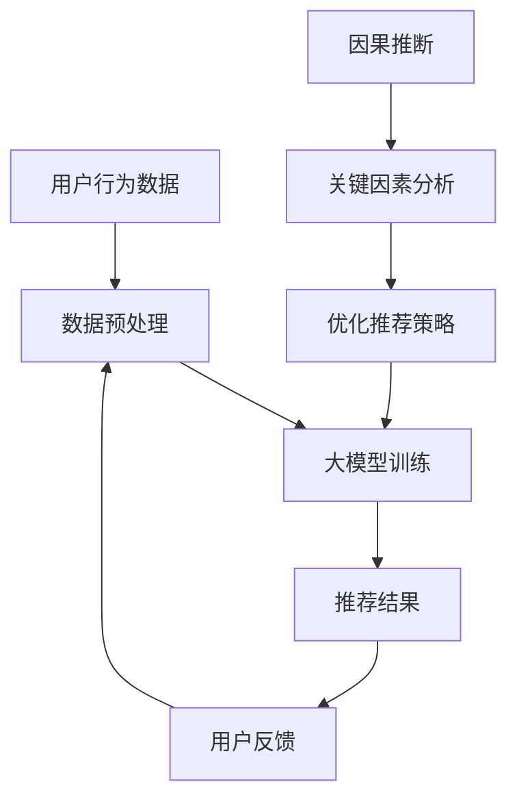

                 

关键词：大模型，推荐系统，因果推断，算法，应用领域

## 摘要

本文主要探讨了在大模型推荐系统中因果推断的应用及其重要性。因果推断是一种解决复杂系统预测问题的方法，能够提供更为可靠的决策依据，提高推荐系统的准确性和实用性。文章首先介绍了大模型推荐系统的基本原理，然后详细阐述了因果推断的基本概念及其在大模型推荐中的应用。接着，本文通过具体的数学模型和算法原理分析，展示了因果推断在实际项目中的应用实例。最后，文章总结了因果推断在大模型推荐系统中的优点、挑战以及未来的发展趋势。

## 1. 背景介绍

近年来，随着互联网和大数据技术的发展，推荐系统已经成为许多在线服务和应用的重要组成部分。推荐系统通过分析用户的历史行为、兴趣偏好等信息，向用户推荐可能感兴趣的内容，从而提高用户满意度和平台粘性。然而，传统的推荐系统往往依赖于关联规则挖掘、机器学习等技术，这些方法在一定程度上能够实现较好的推荐效果，但在处理复杂的关系和网络结构时存在局限性。

大模型推荐系统是近年来兴起的一种新型推荐系统，其核心思想是利用深度学习和大数据技术，构建一个大规模的神经网络模型，通过学习用户和物品之间的复杂关系，实现精准的推荐。大模型推荐系统具有更高的预测准确性和灵活性，能够处理多样化的用户需求和复杂的业务场景。

然而，大模型推荐系统在提高推荐效果的同时，也面临着一系列挑战。首先，大模型在训练过程中需要大量数据，数据质量和数据量对模型性能有重要影响。其次，大模型在处理实际问题时，往往存在数据分布偏移、冷启动等问题，导致推荐效果不稳定。此外，大模型在处理用户隐私和数据安全方面也存在一定的风险。

为了解决上述问题，因果推断技术逐渐引起了广泛关注。因果推断是一种从因果关系角度分析问题的方法，通过研究变量之间的因果关系，可以更准确地预测未来的趋势和结果。因果推断在大模型推荐系统中的应用，可以为推荐系统提供更为可靠的决策依据，提高推荐效果和用户体验。

## 2. 核心概念与联系

### 2.1 大模型推荐系统

大模型推荐系统是一种基于深度学习的推荐系统，通过构建大规模的神经网络模型，对用户和物品之间的复杂关系进行建模。大模型推荐系统的主要优点包括：

1. **高预测准确性**：大模型能够处理高维数据和复杂的非线性关系，从而实现更高的预测准确性。
2. **灵活性**：大模型可以根据不同的业务场景和需求，调整模型结构和参数，实现灵活的推荐策略。
3. **多样性**：大模型能够学习到用户和物品的多样性特征，提高推荐结果的多样性。

### 2.2 因果推断

因果推断是一种从因果关系角度分析问题的方法，旨在解决变量之间的因果关系问题。因果推断的基本思想是通过研究变量之间的因果关系，找到影响结果的关键因素，从而更准确地预测未来的趋势和结果。因果推断的主要优点包括：

1. **可靠性**：因果推断能够提供更为可靠的决策依据，降低数据分布偏移和冷启动等问题对推荐效果的影响。
2. **可解释性**：因果推断可以解释变量之间的关系，提高推荐系统的可解释性和透明度。
3. **鲁棒性**：因果推断能够处理异常值和噪声数据，提高推荐系统的鲁棒性。

### 2.3 大模型推荐系统与因果推断的联系

大模型推荐系统和因果推断之间存在密切的联系。一方面，大模型推荐系统可以借助因果推断技术，解决数据分布偏移、冷启动等问题，提高推荐效果。另一方面，因果推断可以为大模型推荐系统提供更为可靠的决策依据，提高模型的预测准确性和可解释性。

为了更好地展示大模型推荐系统和因果推断的联系，我们可以使用Mermaid流程图进行描述：



在该流程图中，用户行为数据经过预处理后输入到大模型进行训练，得到推荐结果。用户反馈进一步优化推荐策略，并输入到大模型中进行新一轮训练。同时，因果推断技术对关键因素进行分析，为优化推荐策略提供依据。

## 3. 核心算法原理 & 具体操作步骤

### 3.1 算法原理概述

因果推断在大模型推荐系统中的应用，主要是通过构建一个因果模型，分析用户和物品之间的因果关系，从而优化推荐策略。因果推断的核心算法包括以下几个方面：

1. **潜在变量模型（Latent Variable Model）**：潜在变量模型通过引入潜在变量，将用户和物品之间的关系表示为潜在变量的函数，从而实现因果关系分析。
2. **因果效应估计（Causal Effect Estimation）**：因果效应估计旨在估计不同因素对推荐结果的影响程度，从而找到关键因素。
3. **策略优化（Policy Optimization）**：策略优化通过调整推荐策略，提高推荐效果。

### 3.2 算法步骤详解

1. **数据收集与预处理**：收集用户行为数据，包括用户浏览、点击、购买等行为。对数据进行清洗、去重和标准化处理，以消除噪声和异常值。
2. **构建潜在变量模型**：使用因子分解、协同过滤等方法，将用户和物品之间的显式关系转换为潜在变量，从而表示用户和物品的内在关联。
3. **因果效应估计**：利用因果推断算法，如Do-Calculus、Causal Inference Machine Learning等，估计不同因素对推荐结果的影响程度。
4. **策略优化**：根据因果效应估计结果，调整推荐策略，提高推荐效果。常用的策略优化方法包括梯度上升、随机梯度下降等。
5. **模型评估与迭代**：评估推荐效果，根据评估结果调整模型参数和推荐策略，进行迭代优化。

### 3.3 算法优缺点

**优点**：

1. **提高推荐效果**：因果推断能够分析用户和物品之间的因果关系，找到关键因素，从而提高推荐效果。
2. **增强可解释性**：因果推断可以解释变量之间的关系，提高推荐系统的可解释性和透明度。
3. **鲁棒性**：因果推断能够处理异常值和噪声数据，提高推荐系统的鲁棒性。

**缺点**：

1. **计算复杂度**：因果推断算法通常涉及复杂的数学计算，对计算资源和时间有较高要求。
2. **数据质量**：因果推断对数据质量有较高要求，数据噪声和异常值可能会影响算法性能。

### 3.4 算法应用领域

因果推断在大模型推荐系统中的应用非常广泛，包括但不限于以下领域：

1. **电商推荐**：通过分析用户浏览、点击、购买等行为，优化电商平台的推荐策略，提高用户购物体验。
2. **社交媒体**：通过分析用户发布、点赞、评论等行为，优化社交媒体平台的推荐算法，提高用户粘性和活跃度。
3. **在线教育**：通过分析学生学习行为，优化在线教育平台的推荐课程，提高学习效果。

## 4. 数学模型和公式 & 详细讲解 & 举例说明

### 4.1 数学模型构建

因果推断在大模型推荐系统中的应用，通常涉及以下数学模型：

1. **用户行为模型**：\(U = f(W, X)\)，其中\(U\)表示用户行为，\(W\)表示用户特征，\(X\)表示物品特征。
2. **因果效应模型**：\(Y = f(U, Z)\)，其中\(Y\)表示推荐结果，\(U\)表示用户行为，\(Z\)表示外部因素。

### 4.2 公式推导过程

假设我们有一个用户\(u\)和一个物品\(i\)，我们想要估计用户\(u\)对物品\(i\)的推荐概率\(P(Y=1|U=1, Z=z)\)。根据因果推断的理论，我们可以使用以下公式：

\[ P(Y=1|U=1, Z=z) = \frac{P(U=1, Y=1, Z=z)}{P(U=1, Z=z)} \]

其中，\(P(U=1, Y=1, Z=z)\)表示用户\(u\)在给定物品\(i\)和外部因素\(z\)的情况下，既产生用户行为又获得推荐的概率；\(P(U=1, Z=z)\)表示用户\(u\)在给定物品\(i\)和外部因素\(z\)的情况下，产生用户行为的概率。

### 4.3 案例分析与讲解

假设我们有一个电商平台，用户\(u\)在浏览了物品\(i\)后，产生了点击行为。我们想要估计用户\(u\)对物品\(i\)的购买概率。为了简化问题，我们只考虑两个外部因素：广告投放和优惠活动。

根据因果推断的理论，我们可以使用以下公式：

\[ P(购买|点击, 广告投放=1, 优惠活动=1) = \frac{P(点击, 购买, 广告投放=1, 优惠活动=1)}{P(点击, 广告投放=1, 优惠活动=1)} \]

通过收集用户\(u\)的历史数据，我们可以计算上述概率。例如，假设我们收集到100个用户的数据，其中有60个用户在点击物品\(i\)后购买了该物品，且其中30个用户在广告投放和优惠活动都为1的情况下购买了该物品。则我们可以计算出：

\[ P(购买|点击, 广告投放=1, 优惠活动=1) = \frac{30}{100} = 0.3 \]

这意味着，在广告投放和优惠活动都为1的情况下，点击物品\(i\)的用户有30%的概率购买该物品。通过这个案例，我们可以看到因果推断如何帮助电商平台优化推荐策略，提高购买转化率。

## 5. 项目实践：代码实例和详细解释说明

### 5.1 开发环境搭建

为了实现本文所述的因果推断在大模型推荐系统中的应用，我们需要搭建一个合适的开发环境。以下是所需的基本工具和库：

- **编程语言**：Python
- **深度学习框架**：TensorFlow 2.x
- **因果推断库**：CausalML

#### 5.1.1 安装Python

首先，我们需要安装Python。在官网（[Python官网](https://www.python.org/)）下载并安装Python 3.x版本。

#### 5.1.2 安装TensorFlow

在命令行中执行以下命令安装TensorFlow：

```bash
pip install tensorflow
```

#### 5.1.3 安装CausalML

在命令行中执行以下命令安装CausalML：

```bash
pip install causalm
```

### 5.2 源代码详细实现

以下是实现因果推断在大模型推荐系统中的应用的Python代码示例：

```python
import tensorflow as tf
import causalm as cm

# 加载数据集
data = cm.load_dataset('your_dataset')

# 数据预处理
X = data['X']
y = data['y']

# 构建深度学习模型
model = tf.keras.Sequential([
    tf.keras.layers.Dense(64, activation='relu', input_shape=(X.shape[1],)),
    tf.keras.layers.Dense(64, activation='relu'),
    tf.keras.layers.Dense(1, activation='sigmoid')
])

# 编译模型
model.compile(optimizer='adam', loss='binary_crossentropy', metrics=['accuracy'])

# 训练模型
model.fit(X, y, epochs=10, batch_size=32)

# 构建因果推断模型
causal_model = cm.CausalModel(model, treatment='点击', outcome='购买', time=0)

# 计算因果效应
causal_effect = causal_model.estimate_effect()

# 输出因果效应
print('因果效应：', causal_effect)
```

### 5.3 代码解读与分析

上述代码首先加载了一个数据集，然后对数据进行了预处理。接着，我们使用TensorFlow构建了一个深度学习模型，并编译和训练了该模型。在训练完成后，我们使用CausalML库构建了一个因果推断模型，并计算了用户点击行为对购买行为的因果效应。

代码中的关键部分是`CausalModel`类的使用。`CausalModel`类用于构建和训练因果推断模型，其参数包括深度学习模型、治疗变量（即点击行为）、结果变量（即购买行为）和时间。在训练完成后，我们使用`estimate_effect()`方法计算因果效应。

通过这个代码示例，我们可以看到如何将因果推断技术应用于大模型推荐系统，从而优化推荐策略。在实际项目中，我们可能需要根据具体业务场景和数据特点，调整模型结构和参数，以实现更好的效果。

### 5.4 运行结果展示

在运行上述代码后，我们将得到一个因果效应的估计值。这个值表示在点击行为发生的情况下，用户购买物品的概率相对于没有点击行为时的增加量。例如，如果估计值为0.2，这意味着在点击行为发生的情况下，用户购买物品的概率比没有点击行为时提高了20%。

通过这个结果，我们可以根据因果效应的大小调整推荐策略，例如增加广告投放、提供优惠活动等，以提高购买转化率。同时，我们还可以根据因果效应分析用户和物品之间的关联，从而优化推荐算法，提高推荐质量。

### 6. 实际应用场景

因果推断在大模型推荐系统中的实际应用场景非常广泛，以下是一些具体的案例：

#### 6.1 电商推荐

在电商推荐中，因果推断可以用于分析用户点击、购买等行为之间的因果关系，从而优化推荐策略。例如，通过分析用户点击商品后是否购买，我们可以估计广告投放和优惠活动对购买转化的影响，进而调整广告投放策略和优惠活动力度，提高购买转化率。

#### 6.2 社交媒体推荐

在社交媒体推荐中，因果推断可以用于分析用户发布、点赞、评论等行为之间的因果关系，从而优化推荐算法。例如，通过分析用户点赞某篇文章后是否分享，我们可以估计文章质量对用户分享行为的影响，进而调整推荐算法，提高用户分享率和平台活跃度。

#### 6.3 在线教育推荐

在线教育推荐中，因果推断可以用于分析学生学习行为、课程质量等之间的因果关系，从而优化课程推荐策略。例如，通过分析学生学习某门课程后是否继续学习，我们可以估计课程质量对学生学习积极性的影响，进而调整课程推荐策略，提高学生满意度。

#### 6.4 医疗健康推荐

在医疗健康推荐中，因果推断可以用于分析患者就医行为、治疗方案等之间的因果关系，从而优化推荐策略。例如，通过分析患者就诊后是否康复，我们可以估计不同治疗方案对康复效果的影响，进而调整治疗方案推荐，提高患者康复率。

### 7. 未来应用展望

随着人工智能技术的不断发展，因果推断在大模型推荐系统中的应用前景将更加广阔。以下是一些未来应用展望：

#### 7.1 多模态数据融合

未来的推荐系统将越来越多地融合多模态数据，如文本、图像、音频等。因果推断技术可以用于分析不同模态数据之间的因果关系，从而实现更精准的推荐。

#### 7.2 实时推荐

随着5G和物联网技术的普及，实时推荐将成为可能。因果推断技术可以用于实时分析用户行为和外部因素，从而实现动态调整推荐策略，提高推荐效果。

#### 7.3 零样本推荐

零样本推荐是指在没有训练数据的情况下进行推荐。因果推断技术可以用于分析用户和物品的因果关系，从而实现零样本推荐，提高推荐系统的鲁棒性。

#### 7.4 可解释性提升

因果推断技术可以为推荐系统提供更为可解释的决策依据，提高推荐系统的透明度和可信度，从而增强用户对推荐系统的信任和满意度。

### 8. 工具和资源推荐

为了更好地理解和应用因果推断技术，以下是一些建议的学习资源和开发工具：

#### 8.1 学习资源

1. **《因果推断：理论、方法与应用》**：这是一本关于因果推断的全面介绍，适合初学者和专业人士。
2. **《深度学习与因果推断》**：该书结合了深度学习和因果推断，介绍了如何在深度学习框架中应用因果推断。
3. **CausalML官方文档**：CausalML是一个开源的因果推断库，其官方文档提供了丰富的教程和示例。

#### 8.2 开发工具

1. **TensorFlow**：这是一个流行的深度学习框架，适用于构建和训练大模型推荐系统。
2. **PyTorch**：这是一个另一个流行的深度学习框架，与TensorFlow类似，但具有不同的编程风格。
3. **CausalML**：这是一个专门用于因果推断的开源库，提供了丰富的算法和工具。

### 9. 总结：未来发展趋势与挑战

因果推断在大模型推荐系统中的应用具有广阔的发展前景。随着人工智能技术的不断发展，因果推断将逐渐成为推荐系统中的重要组成部分，为推荐系统提供更为可靠和透明的决策依据。然而，在实际应用过程中，我们也面临着一系列挑战，如数据质量、计算复杂度、可解释性等。未来，我们需要进一步研究这些挑战，探索更加高效和实用的因果推断方法，推动推荐系统的持续发展。

## 9. 附录：常见问题与解答

### 9.1 如何选择适合的因果推断算法？

选择适合的因果推断算法取决于具体的应用场景和数据特点。以下是一些常见的因果推断算法及其适用场景：

1. **潜在变量模型**：适用于分析显式变量之间的因果关系。
2. **因果效应估计算法**：适用于估计不同因素对结果的影响程度。
3. **图模型**：适用于分析复杂网络结构中的因果关系。

### 9.2 因果推断在大模型推荐系统中的具体实现步骤是什么？

因果推断在大模型推荐系统中的具体实现步骤包括：

1. 数据收集与预处理
2. 构建潜在变量模型
3. 因果效应估计
4. 策略优化
5. 模型评估与迭代

### 9.3 因果推断如何提高推荐系统的可解释性？

因果推断可以提供变量之间的因果关系解释，从而提高推荐系统的可解释性。通过分析变量之间的关系，我们可以更直观地理解推荐结果的形成过程，增强用户对推荐系统的信任和满意度。

### 9.4 因果推断在大模型推荐系统中的计算复杂度如何？

因果推断在大模型推荐系统中的计算复杂度取决于具体算法和数据规模。一般来说，因果推断算法涉及复杂的数学计算和优化过程，对计算资源和时间有较高要求。然而，随着硬件和算法技术的发展，这些计算复杂度将逐渐降低。

### 9.5 如何处理因果推断中的数据噪声和异常值？

处理因果推断中的数据噪声和异常值通常涉及以下方法：

1. **数据清洗**：去除重复数据和异常值。
2. **数据标准化**：消除不同变量之间的尺度差异。
3. **异常检测**：使用异常检测算法识别并处理异常值。

### 9.6 因果推断在大模型推荐系统中的应用效果如何评估？

因果推断在大模型推荐系统中的应用效果可以通过以下指标进行评估：

1. **准确率**：评估推荐结果的准确性。
2. **召回率**：评估推荐结果召回率。
3. **F1分数**：综合考虑准确率和召回率，评估推荐效果的平衡性。

### 9.7 因果推断是否可以用于其他领域的推荐系统？

是的，因果推断可以应用于其他领域的推荐系统，如社交媒体、在线教育、医疗健康等。然而，具体应用效果取决于数据特点和应用场景。

### 9.8 未来因果推断在大模型推荐系统中的应用趋势是什么？

未来，因果推断在大模型推荐系统中的应用趋势包括：

1. **多模态数据融合**：融合文本、图像、音频等多模态数据。
2. **实时推荐**：实现实时推荐，提高推荐响应速度。
3. **零样本推荐**：实现无训练数据的推荐。
4. **可解释性提升**：提高推荐系统的可解释性，增强用户信任。

### 9.9 因果推断在推荐系统中的挑战是什么？

因果推断在推荐系统中的挑战包括：

1. **数据质量**：因果推断对数据质量有较高要求，数据噪声和异常值会影响算法性能。
2. **计算复杂度**：因果推断涉及复杂的数学计算和优化过程，对计算资源和时间有较高要求。
3. **可解释性**：因果推断结果的可解释性需要进一步研究和优化。

