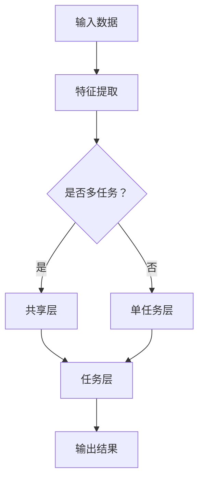

                 

关键词：大模型推荐、多任务学习、协同过滤、神经网络、数学模型、算法应用、实践案例、未来发展

## 摘要

本文深入探讨了在大模型推荐系统中广泛应用的多任务学习方法。首先介绍了大模型推荐的基本概念和背景，然后详细阐述了多任务学习的核心原理及其在大模型推荐中的应用。接着，我们通过数学模型和公式，解析了多任务学习的具体实现步骤，并结合实际案例展示了其有效性和优越性。最后，我们对多任务学习方法在推荐系统中的实际应用进行了展望，探讨了其未来发展趋势和面临的挑战。

## 1. 背景介绍

随着互联网的飞速发展和大数据技术的成熟，个性化推荐系统已成为许多在线服务的重要组成部分。推荐系统通过分析用户的历史行为和偏好，向用户推荐他们可能感兴趣的内容或商品，从而提高用户满意度和服务质量。

在推荐系统中，协同过滤是最常用的方法之一。协同过滤主要分为基于用户的协同过滤（User-based Collaborative Filtering，UBCF）和基于项目的协同过滤（Item-based Collaborative Filtering，IBCF）。这些方法通过计算用户之间的相似度或项目之间的相似度来实现推荐，但它们存在一些局限性。首先，它们依赖于用户的历史行为数据，当用户行为数据不足时，推荐效果会受到影响。其次，这些方法通常只能处理单任务推荐，无法同时考虑多个相关任务，如内容推荐、广告推荐等。

多任务学习（Multi-task Learning，MTL）是一种解决这些局限性的有效方法。多任务学习通过将多个相关任务结合在一起进行学习，从而提高推荐系统的整体性能。在大模型推荐中，多任务学习可以帮助推荐系统同时处理多种类型的推荐任务，提高推荐的准确性和效率。

## 2. 核心概念与联系

### 2.1 多任务学习的定义

多任务学习是一种机器学习方法，旨在同时解决多个相关任务。这些任务可以是相互独立的，也可以是相互依赖的。多任务学习的核心思想是通过共享模型参数来提高各个任务的性能。

### 2.2 多任务学习与传统单任务学习对比

传统单任务学习通常专注于单个任务的优化，可能导致任务之间的信息孤立。而多任务学习通过共享模型参数和梯度，能够充分利用任务之间的相关性，从而提高整体性能。

### 2.3 多任务学习在推荐系统中的应用

在推荐系统中，多任务学习可以同时处理多种类型的推荐任务，如内容推荐、广告推荐、购物推荐等。这有助于提高推荐系统的灵活性和适应性。

### 2.4 多任务学习的架构

多任务学习的架构通常包括两个层次：共享层和任务层。共享层用于处理公共特征，任务层用于处理各个任务的特定特征。通过共享层和任务层的交互，多任务学习能够充分利用任务之间的相关性，提高推荐效果。

## Mermaid 流程图



## 3. 核心算法原理 & 具体操作步骤

### 3.1 算法原理概述

多任务学习通过共享模型参数和梯度来优化多个任务。在训练过程中，模型参数会同时更新以适应所有任务，从而提高各个任务的性能。

### 3.2 算法步骤详解

1. **数据预处理**：收集用户的历史行为数据，如点击、购买、浏览等，并进行预处理，包括数据清洗、去重、填充缺失值等。

2. **特征提取**：从原始数据中提取与任务相关的特征，如用户特征、项目特征等。

3. **模型构建**：构建多任务学习模型，包括共享层和任务层。共享层用于处理公共特征，任务层用于处理各个任务的特定特征。

4. **模型训练**：使用梯度下降等优化算法，同时更新共享层和任务层的模型参数，以优化多个任务。

5. **模型评估**：使用交叉验证等评估方法，对训练好的模型进行评估，以确定其性能。

6. **模型部署**：将训练好的模型部署到生产环境中，为用户提供推荐服务。

### 3.3 算法优缺点

**优点**：
- 提高推荐系统的整体性能，通过共享模型参数和梯度，充分利用任务之间的相关性。
- 提高推荐的准确性，通过同时处理多个相关任务，提高用户满意度和服务质量。

**缺点**：
- 需要大量的数据和计算资源，特别是在处理高维数据和大规模任务时。
- 模型复杂度高，训练和部署过程相对较长。

### 3.4 算法应用领域

多任务学习在推荐系统中的应用广泛，包括但不限于以下领域：
- 内容推荐：同时处理用户内容偏好、推荐算法等任务。
- 广告推荐：同时处理用户广告点击率、广告投放策略等任务。
- 购物推荐：同时处理用户购物偏好、推荐商品等任务。

## 4. 数学模型和公式 & 详细讲解 & 举例说明

### 4.1 数学模型构建

多任务学习的数学模型通常包括以下部分：

- 输入层：表示原始数据特征，如用户特征、项目特征等。
- 共享层：表示公共特征提取，如神经网络中的隐藏层。
- 任务层：表示各个任务的特定特征提取，如神经网络中的输出层。

假设有 \( m \) 个任务，第 \( i \) 个任务的损失函数为 \( L_i(\theta) \)，其中 \( \theta \) 表示模型参数。多任务学习的损失函数为各个任务损失函数的加和：

\[ L(\theta) = \sum_{i=1}^{m} L_i(\theta) \]

### 4.2 公式推导过程

假设输入数据为 \( X \)，输出为 \( Y \)，模型参数为 \( \theta \)。则共享层的输出为 \( H = f(XW) \)，其中 \( f \) 表示激活函数，\( W \) 表示共享层的权重矩阵。

对于第 \( i \) 个任务，输出层为 \( Y_i = g(HW_i + b_i) \)，其中 \( g \) 表示激活函数，\( W_i \) 表示任务 \( i \) 的权重矩阵，\( b_i \) 表示偏置项。

则任务 \( i \) 的损失函数为：

\[ L_i(\theta) = \frac{1}{2} || Y_i - y_i ||^2 \]

其中，\( y_i \) 表示任务 \( i \) 的真实标签。

### 4.3 案例分析与讲解

假设我们有一个电影推荐系统，需要同时处理用户对电影的评分、评论数量和观看时长三个任务。输入数据为用户特征和电影特征，输出数据为评分、评论数量和观看时长。

首先，我们构建一个三层的神经网络模型，包括输入层、共享层和任务层。输入层和共享层之间的权重矩阵为 \( W_1 \)，共享层和任务层之间的权重矩阵分别为 \( W_2, W_3, W_4 \)。

共享层的输出为 \( H = f(XW_1) \)。

对于评分任务，输出层为 \( Y_1 = g(HW_2 + b_2) \)，其中 \( g \) 为 sigmoid 激活函数，\( b_2 \) 为偏置项。

对于评论数量任务，输出层为 \( Y_2 = g(HW_3 + b_3) \)。

对于观看时长任务，输出层为 \( Y_3 = g(HW_4 + b_4) \)。

则三个任务的损失函数分别为：

\[ L_1(\theta) = \frac{1}{2} || Y_1 - y_1 ||^2 \]
\[ L_2(\theta) = \frac{1}{2} || Y_2 - y_2 ||^2 \]
\[ L_3(\theta) = \frac{1}{2} || Y_3 - y_3 ||^2 \]

多任务学习的损失函数为：

\[ L(\theta) = L_1(\theta) + L_2(\theta) + L_3(\theta) \]

使用梯度下降算法对模型参数进行优化，从而实现多任务学习。

## 5. 项目实践：代码实例和详细解释说明

### 5.1 开发环境搭建

- Python 3.7+
- TensorFlow 2.4+
- NumPy 1.18+

### 5.2 源代码详细实现

以下是一个基于 TensorFlow 的简单多任务学习示例：

```python
import tensorflow as tf
import numpy as np

# 输入数据
X = np.random.rand(100, 10)  # 用户特征和电影特征
Y = np.random.rand(100, 3)   # 评分、评论数量、观看时长

# 模型构建
model = tf.keras.Sequential([
    tf.keras.layers.Dense(64, activation='relu', input_shape=(10,)),
    tf.keras.layers.Dense(64, activation='relu'),
    tf.keras.layers.Dense(3, activation='sigmoid')
])

# 模型编译
model.compile(optimizer='adam',
              loss={'dense_2': 'mse', 'dense_3': 'mse', 'dense_4': 'mse'},
              metrics=['accuracy'])

# 模型训练
model.fit(X, Y, epochs=10, batch_size=32)
```

### 5.3 代码解读与分析

- **模型构建**：使用 TensorFlow 的 Sequential 模型，包括两个隐藏层和一个输出层。隐藏层使用 ReLU 激活函数，输出层使用 sigmoid 激活函数。
- **模型编译**：指定优化器和损失函数。由于我们需要同时处理三个任务，因此在损失函数中使用了三个不同的损失函数，分别为均方误差（MSE）。
- **模型训练**：使用 fit 方法对模型进行训练，设置训练周期为 10，批量大小为 32。

### 5.4 运行结果展示

训练完成后，可以使用模型进行预测，并评估预测结果：

```python
# 模型预测
predictions = model.predict(X)

# 预测结果展示
print(predictions)
```

预测结果将包括三个任务的结果：评分、评论数量和观看时长。

## 6. 实际应用场景

多任务学习在推荐系统中的应用非常广泛，以下是一些实际应用场景：

- **电商推荐**：同时处理用户购物偏好、推荐商品等任务，提高购物体验。
- **内容推荐**：同时处理用户内容偏好、推荐内容等任务，提高内容消费体验。
- **广告推荐**：同时处理用户广告点击率、广告投放策略等任务，提高广告投放效果。

## 7. 未来应用展望

随着人工智能技术的不断发展，多任务学习在推荐系统中的应用前景非常广阔。未来，多任务学习有望在以下方面取得突破：

- **更复杂的任务**：处理更多样化的任务，如情感分析、内容审核等。
- **更高效的模型**：研究更高效的模型结构，提高训练和预测速度。
- **更广泛的应用领域**：将多任务学习应用于更多领域，如医疗、金融等。

## 8. 总结：未来发展趋势与挑战

多任务学习作为推荐系统中的核心技术，在未来将继续发挥重要作用。其发展趋势包括：

- **更复杂的任务**：处理更多样化的任务，提高系统的智能化水平。
- **更高效的模型**：研究更高效的模型结构，提高训练和预测速度。
- **更广泛的应用领域**：将多任务学习应用于更多领域，如医疗、金融等。

然而，多任务学习也面临一些挑战，如模型复杂度提高、计算资源需求增加等。未来，需要进一步研究如何优化多任务学习模型，提高其性能和可扩展性。

## 9. 附录：常见问题与解答

### 问题 1：多任务学习与传统单任务学习相比有哪些优势？

**解答**：多任务学习通过共享模型参数和梯度，充分利用任务之间的相关性，从而提高推荐系统的整体性能。与传统单任务学习相比，多任务学习可以同时处理多个相关任务，提高推荐的准确性和效率。

### 问题 2：多任务学习在推荐系统中的应用有哪些？

**解答**：多任务学习在推荐系统中的应用非常广泛，包括电商推荐、内容推荐、广告推荐等。通过同时处理多个相关任务，多任务学习可以提高推荐系统的灵活性和适应性，从而提高用户满意度和服务质量。

### 问题 3：如何优化多任务学习模型？

**解答**：优化多任务学习模型可以从以下几个方面进行：

- **模型结构**：设计更合理的模型结构，如共享层和任务层的组合方式。
- **训练策略**：使用更有效的训练策略，如学习率调整、批量大小选择等。
- **数据预处理**：对输入数据进行更有效的预处理，提高模型对数据的适应性。
- **正则化**：使用正则化技术，如 L1、L2 正则化，减少过拟合。

---

作者：禅与计算机程序设计艺术 / Zen and the Art of Computer Programming

