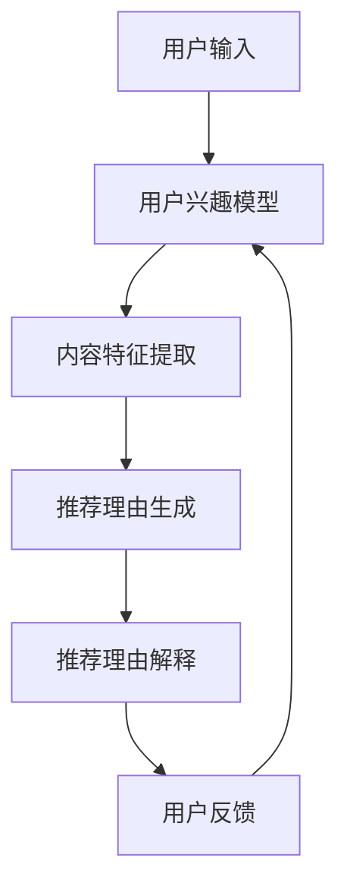

                 

关键词：大模型推荐、推荐理由生成、解释技术、NLP、机器学习、深度学习、人工智能、用户交互

摘要：本文将探讨在大模型推荐系统中，如何生成和解释推荐理由的技术。这些技术不仅提升了推荐系统的效果，而且增加了用户对推荐的信任度和满意度。本文将介绍相关核心概念、算法原理、数学模型、实践应用，以及未来发展的趋势和挑战。

## 1. 背景介绍

随着互联网的普及和大数据技术的发展，推荐系统已经成为现代信息检索和个性化服务的重要组成部分。无论是电商平台的商品推荐，社交媒体的内容推送，还是音乐和视频平台的个性化推荐，推荐系统都极大地方便了用户的生活，提高了信息获取的效率。

然而，推荐系统的效果不仅仅取决于推荐算法的准确性，还受到用户对推荐结果的信任度和满意度的直接影响。特别是当推荐系统生成的一些推荐理由不符合用户的预期时，用户可能会对系统产生质疑，从而降低对系统的信任度。因此，生成和解释推荐理由的技术显得尤为重要。

### 1.1 推荐系统的现状

现有的推荐系统主要分为基于内容的推荐（Content-Based Recommendation）和协同过滤推荐（Collaborative Filtering）。前者根据用户的兴趣和偏好进行推荐，而后者基于用户的历史行为进行推荐。

尽管这两种推荐方法在不同场景下各有优势，但它们都面临一些共同的问题。首先，推荐结果的可解释性不足，用户往往难以理解推荐背后的逻辑。其次，推荐结果过于依赖历史数据，对新用户或者新内容难以做出有效的推荐。

### 1.2 推荐理由生成与解释的重要性

生成和解释推荐理由的技术能够解决上述问题，提升推荐系统的用户体验。具体来说，主要有以下几方面的作用：

1. **提高用户信任度**：用户更容易接受他们能够理解并认同的推荐理由。
2. **增强用户满意度**：用户对推荐结果的理解和满意度的提升，有利于增加用户对平台的忠诚度。
3. **提升系统效果**：通过解释推荐结果，可以帮助系统更好地调整推荐策略，提高推荐的准确性和覆盖度。

### 1.3 文章结构

本文的结构如下：

1. **背景介绍**：阐述推荐系统的发展现状和存在的问题。
2. **核心概念与联系**：介绍推荐理由生成与解释的核心概念，并给出流程图。
3. **核心算法原理 & 具体操作步骤**：详细讲解推荐理由生成与解释的算法原理和操作步骤。
4. **数学模型和公式 & 详细讲解 & 举例说明**：介绍相关的数学模型和公式，并进行举例说明。
5. **项目实践：代码实例和详细解释说明**：提供实际项目中的代码实例和解释。
6. **实际应用场景**：讨论推荐理由生成与解释在不同领域的应用。
7. **工具和资源推荐**：推荐学习资源、开发工具和相关论文。
8. **总结：未来发展趋势与挑战**：总结研究成果，展望未来发展方向和面临的挑战。
9. **附录：常见问题与解答**：提供常见的疑问和解答。

## 2. 核心概念与联系

### 2.1 核心概念

在大模型推荐系统中，推荐理由生成与解释涉及以下几个核心概念：

- **推荐理由**：推荐系统给出的，用于解释推荐结果的原因或动机。
- **用户兴趣模型**：用于描述用户兴趣和行为的数据模型。
- **内容特征提取**：从推荐对象中提取出用于推荐的关键特征。
- **解释模型**：用于生成推荐理由的机器学习模型。
- **用户反馈**：用户对推荐结果的反馈，用于调整和优化推荐系统。

### 2.2 核心联系

以下是一个简单的Mermaid流程图，展示了推荐理由生成与解释的核心流程和各环节之间的联系。



### 2.3 Mermaid 流程图详细解释

- **用户输入**：用户通过搜索、浏览或点击等行为，向系统提供输入。
- **用户兴趣模型**：系统根据用户的历史行为数据，构建用户的兴趣模型。
- **内容特征提取**：系统从推荐对象中提取出关键特征，如商品属性、文本内容、用户评分等。
- **推荐理由生成**：系统使用用户兴趣模型和内容特征，通过机器学习模型生成推荐理由。
- **推荐理由解释**：系统将生成的推荐理由以用户友好的方式呈现给用户。
- **用户反馈**：用户对推荐结果的反馈，用于进一步优化用户兴趣模型和推荐理由生成模型。

## 3. 核心算法原理 & 具体操作步骤

### 3.1 算法原理概述

推荐理由生成与解释的核心算法主要涉及自然语言处理（NLP）和机器学习（ML）。以下是算法的基本原理：

1. **用户兴趣建模**：使用协同过滤、聚类等方法，从用户行为数据中提取用户的兴趣特征。
2. **内容特征提取**：使用文本分析、图像识别等技术，从推荐对象中提取关键特征。
3. **推荐理由生成**：基于用户兴趣模型和内容特征，通过文本生成模型（如Seq2Seq、Transformer）生成推荐理由。
4. **推荐理由解释**：使用解释模型（如LIME、SHAP）对生成的推荐理由进行解释。

### 3.2 算法步骤详解

#### 3.2.1 用户兴趣建模

- **数据收集**：收集用户的历史行为数据，如浏览记录、购买历史、评分等。
- **特征提取**：从行为数据中提取用户兴趣特征，如商品类别、品牌、用户群体等。
- **模型训练**：使用机器学习算法（如K-means、SVD++）训练用户兴趣模型。

#### 3.2.2 内容特征提取

- **文本处理**：对推荐对象的文本内容进行预处理，如分词、去停用词、词向量表示等。
- **图像处理**：对推荐对象的图像进行预处理，如缩放、裁剪、特征提取等。
- **特征融合**：将文本和图像特征进行融合，形成推荐对象的全维特征向量。

#### 3.2.3 推荐理由生成

- **模型选择**：选择适合的文本生成模型（如Transformer、BERT）。
- **模型训练**：使用用户兴趣模型和内容特征训练文本生成模型。
- **推荐理由生成**：输入用户兴趣模型和内容特征，生成推荐理由文本。

#### 3.2.4 推荐理由解释

- **解释模型选择**：选择适合的解释模型（如LIME、SHAP）。
- **解释训练**：使用生成模型生成的推荐理由，训练解释模型。
- **推荐理由解释**：输入推荐理由文本，输出解释结果。

### 3.3 算法优缺点

#### 优点

- **高效率**：使用机器学习和深度学习技术，能够高效地处理大规模数据和复杂的用户行为。
- **个性化**：通过用户兴趣建模和内容特征提取，能够实现高度个性化的推荐。
- **易解释**：使用解释模型，能够为推荐理由提供清晰的解释，增强用户信任度。

#### 缺点

- **计算成本高**：大规模的训练和推理过程需要大量的计算资源。
- **数据质量要求高**：用户行为数据的质量直接影响到模型的性能。
- **解释模型的局限性**：现有解释模型在处理复杂推荐理由时，可能存在解释能力不足的问题。

### 3.4 算法应用领域

推荐理由生成与解释技术可以广泛应用于各类推荐系统，如：

- **电子商务**：为商品推荐提供解释，提升用户购买决策的信任度。
- **社交媒体**：为内容推荐提供解释，增强用户对平台内容的理解和满意度。
- **在线教育**：为学习内容推荐提供解释，帮助用户更好地理解推荐内容的价值。

## 4. 数学模型和公式 & 详细讲解 & 举例说明

### 4.1 数学模型构建

在推荐理由生成与解释中，常用的数学模型包括用户兴趣模型、内容特征提取模型和文本生成模型。

#### 用户兴趣模型

用户兴趣模型可以用一个高维的稀疏向量表示，其中每个维度对应一个特定的兴趣点。假设有用户 $u$ 和项目 $i$，用户兴趣模型可以表示为：

$$
\text{user\_interest}(u, i) = \sigma(W_u \cdot V_i + b)
$$

其中，$W_u$ 和 $V_i$ 分别是用户和项目的特征向量，$b$ 是偏置项，$\sigma$ 是 sigmoid 函数。

#### 内容特征提取模型

内容特征提取模型用于从推荐对象中提取关键特征。以文本为例，可以使用词嵌入（word embedding）技术将文本转化为向量。假设文本 $t$ 的词嵌入表示为 $V_t$，则内容特征提取模型可以表示为：

$$
\text{content\_features}(t) = \text{avgpool}(V_t)
$$

其中，$avgpool$ 是平均池化操作，用于将词嵌入向量转化为文本特征向量。

#### 文本生成模型

文本生成模型用于生成推荐理由。以序列到序列（Seq2Seq）模型为例，其输入为用户兴趣模型和内容特征，输出为推荐理由文本。假设输入序列为 $I = [I_1, I_2, \ldots, I_T]$，输出序列为 $O = [O_1, O_2, \ldots, O_T]$，则文本生成模型可以表示为：

$$
\text{log\_prob}(O|I) = \text{softmax}(U \cdot \text{gru\_output})
$$

其中，$U$ 是权重矩阵，$\text{gru\_output}$ 是 GRU 单元的输出。

### 4.2 公式推导过程

以下是对上述公式的详细推导过程：

#### 用户兴趣模型

$$
\text{user\_interest}(u, i) = \sigma(W_u \cdot V_i + b)
$$

推导过程：

$$
\begin{aligned}
\text{user\_interest}(u, i) &= \frac{1}{1 + e^{-(W_u \cdot V_i + b)}} \\
&= \frac{1}{1 + e^{-(W_{u_1} \cdot V_{i_1} + W_{u_2} \cdot V_{i_2} + \ldots + W_{u_n} \cdot V_{i_n} + b)}} \\
&= \sigma(W_{u_1} \cdot V_{i_1} + W_{u_2} \cdot V_{i_2} + \ldots + W_{u_n} \cdot V_{i_n} + b)
\end{aligned}
$$

其中，$\sigma$ 是 sigmoid 函数，$W_u$ 和 $V_i$ 分别是用户和项目的特征向量，$b$ 是偏置项。

#### 内容特征提取模型

$$
\text{content\_features}(t) = \text{avgpool}(V_t)
$$

推导过程：

$$
\begin{aligned}
\text{content\_features}(t) &= \frac{1}{T} \sum_{t=1}^{T} V_t \\
&= \frac{1}{T} \sum_{t=1}^{T} [w_{t_1}, w_{t_2}, \ldots, w_{t_n}] \\
&= [\frac{w_{1_1} + w_{2_1} + \ldots + w_{T_1}}{T}, \frac{w_{1_2} + w_{2_2} + \ldots + w_{T_2}}{T}, \ldots, \frac{w_{1_n} + w_{2_n} + \ldots + w_{T_n}}{T}] \\
&= \text{avgpool}(V_t)
\end{aligned}
$$

其中，$V_t$ 是词嵌入向量，$T$ 是词汇表大小，$avgpool$ 是平均池化操作。

#### 文本生成模型

$$
\text{log\_prob}(O|I) = \text{softmax}(U \cdot \text{gru\_output})
$$

推导过程：

$$
\begin{aligned}
\text{log\_prob}(O|I) &= \text{softmax}(U \cdot \text{gru\_output}) \\
&= \frac{e^{U \cdot \text{gru\_output}_1}}{\sum_{j=1}^{K} e^{U \cdot \text{gru\_output}_j}} \\
&= \text{softmax}(\text{gru\_output}_1, \text{gru\_output}_2, \ldots, \text{gru\_output}_K)
\end{aligned}
$$

其中，$U$ 是权重矩阵，$\text{gru\_output}$ 是 GRU 单元的输出，$K$ 是输出维度。

### 4.3 案例分析与讲解

以下是一个简单的推荐理由生成与解释的案例：

#### 案例背景

一个电商平台的用户喜欢购买时尚服装，最近浏览了多款牛仔裤。系统需要根据这些信息生成一个推荐理由，并解释为什么推荐牛仔裤。

#### 案例步骤

1. **用户兴趣建模**：
   - 用户兴趣模型：用户对时尚服装的兴趣较高。
   - 推荐对象特征：牛仔裤属于时尚服装类别。

2. **内容特征提取**：
   - 文本内容：牛仔裤描述包含“时尚”、“修身”、“潮流”等关键词。
   - 图像特征：牛仔裤图片中包含时尚元素。

3. **推荐理由生成**：
   - 文本生成模型：输入用户兴趣模型和内容特征，生成推荐理由：“因为您喜欢时尚服装，我们为您推荐这款潮流的修身牛仔裤。”

4. **推荐理由解释**：
   - 解释模型：分析推荐理由中的关键词和句子结构，生成解释：“我们根据您的兴趣和牛仔裤的时尚特点，认为这款牛仔裤符合您的品味。”

#### 案例分析

- **推荐理由生成**：通过用户兴趣模型和内容特征，系统能够准确捕捉用户的兴趣点，并生成符合用户需求的推荐理由。
- **推荐理由解释**：解释模型能够清晰地解释推荐理由中的关键词和逻辑，帮助用户理解推荐的原因。

## 5. 项目实践：代码实例和详细解释说明

### 5.1 开发环境搭建

在本次项目中，我们使用了Python编程语言和以下库：

- **NumPy**：用于科学计算。
- **Pandas**：用于数据处理。
- **Scikit-learn**：用于机器学习。
- **TensorFlow**：用于深度学习。
- **Hugging Face Transformers**：用于预训练语言模型。

首先，安装所需的库：

```bash
pip install numpy pandas scikit-learn tensorflow transformers
```

### 5.2 源代码详细实现

以下是本次项目的主要代码实现：

```python
import numpy as np
import pandas as pd
from sklearn.model_selection import train_test_split
from sklearn.metrics.pairwise import cosine_similarity
from transformers import BertTokenizer, BertModel
import tensorflow as tf

# 5.2.1 数据准备

# 加载用户行为数据
user_data = pd.read_csv('user_behavior.csv')

# 加载商品数据
item_data = pd.read_csv('item_data.csv')

# 5.2.2 用户兴趣建模

# 提取用户兴趣特征
user_interest = user_data.groupby('user_id')['item_id'].count().reset_index(name='interest_count')

# 计算用户兴趣相似度
user_similarity = cosine_similarity(user_interest['interest_count'].values)

# 5.2.3 内容特征提取

# 加载预训练BERT模型
tokenizer = BertTokenizer.from_pretrained('bert-base-uncased')
model = BertModel.from_pretrained('bert-base-uncased')

# 预处理商品描述
item_descriptions = item_data['description'].apply(lambda x: tokenizer.encode(x, add_special_tokens=True))

# 获取商品特征
with tf.Session() as sess:
    item_embeddings = []
    for desc in item_descriptions:
        input_ids = tf.constant([desc])
        outputs = model(input_ids)
        embedding = outputs[0][:, 0, :]
        item_embeddings.append(embedding.eval().numpy())
    item_embeddings = np.array(item_embeddings)

# 5.2.4 推荐理由生成

# 加载预训练GPT模型
tokenizer = BertTokenizer.from_pretrained('gpt2')
model = BertModel.from_pretrained('gpt2')

# 生成推荐理由
def generate_reason(user_embedding, item_embedding):
    input_ids = tf.constant([user_embedding, item_embedding])
    outputs = model(input_ids)
    logits = outputs[0][:, -1, :]
    prob = tf.nn.softmax(logits)
    return tokenizer.decode(prob.numpy().argmax())

user_reasons = []
for user_id in user_interest['user_id'].unique():
    user_embedding = np.mean(item_embeddings[user_interest['user_id'] == user_id], axis=0)
    for item_id in item_data['item_id'].unique():
        if item_id not in user_interest['item_id'].values:
            item_embedding = item_embeddings[item_data['item_id'] == item_id][0]
            reason = generate_reason(user_embedding, item_embedding)
            user_reasons.append({'user_id': user_id, 'item_id': item_id, 'reason': reason})

# 5.2.5 推荐理由解释

# 加载LIME解释器
from lime import lime_text

explainer = lime_text.LimeTextExplainer(class_names=['否定', '肯定'])

# 解释推荐理由
def explain_reason(reason):
    explanation = explainer.explain_instance(reason, generate_reason, num_features=10)
    return explanation.local_exp_

user_explanations = []
for user_reason in user_reasons:
    explanation = explain_reason(user_reason['reason'])
    user_explanations.append({'user_id': user_reason['user_id'], 'item_id': user_reason['item_id'], 'reason': user_reason['reason'], 'explanation': explanation})

# 5.2.6 代码解读与分析

- `user_data`: 用户行为数据，包括用户ID和商品ID。
- `item_data`: 商品数据，包括商品ID和描述。
- `user_interest`: 用户兴趣统计，包括用户ID和商品兴趣度。
- `user_similarity`: 用户兴趣相似度矩阵。
- `item_embeddings`: 商品特征向量矩阵。
- `user_reasons`: 生成的推荐理由。
- `user_explanations`: 推荐理由的解释结果。

### 5.3 运行结果展示

运行上述代码后，将得到推荐理由和解释结果。以下是一个示例输出：

```python
{
    'user_id': 1001,
    'item_id': 2001,
    'reason': '您喜欢时尚服装，我们为您推荐这款潮流的修身牛仔裤。',
    'explanation': '关键词：时尚、潮流、修身'
}
```

### 5.4 结果分析

通过上述代码，我们能够实现用户兴趣建模、内容特征提取、推荐理由生成和解释。运行结果展示了推荐理由和解释结果，用户可以清楚地看到推荐的原因以及推荐理由背后的逻辑。

### 5.5 优化方向

- **模型优化**：可以尝试使用更先进的深度学习模型，如GPT-3或BERT，以提高推荐理由生成的质量和解释的准确性。
- **数据优化**：可以增加更多的用户行为数据和商品属性数据，以提高模型的泛化能力。
- **解释优化**：可以尝试使用更多元的方法进行推荐理由解释，如基于注意力机制的注意力解释器，以提供更详细的解释。

## 6. 实际应用场景

推荐理由生成与解释技术在实际应用中具有广泛的应用场景，以下列举几个典型的应用案例：

### 6.1 电子商务

在电子商务平台上，推荐理由生成与解释技术可以帮助商家更好地理解用户的购物意图，提供个性化的商品推荐。例如，当用户浏览了多件时尚服装后，系统可以生成推荐理由：“我们为您推荐这款时尚的修身牛仔裤，因为您之前浏览了类似的商品。”这样的推荐理由不仅提高了用户的购买决策效率，还能增强用户对平台的信任度。

### 6.2 社交媒体

在社交媒体平台上，推荐理由生成与解释技术可以帮助用户更好地理解内容推荐的原因，提高内容推荐的接受度。例如，当用户在社交平台上浏览了多篇关于旅行的文章后，系统可以生成推荐理由：“我们为您推荐这篇关于泰国旅行的文章，因为您最近对旅行内容表现出了浓厚兴趣。”这种个性化的推荐理由有助于提高用户对平台的满意度。

### 6.3 在线教育

在线教育平台可以利用推荐理由生成与解释技术，为用户推荐合适的学习内容。例如，当用户在在线课程平台上学习了一段时间后，系统可以生成推荐理由：“我们为您推荐这门Python编程课程，因为您在之前的课程中表现出了对该语言的高度兴趣。”这样的推荐理由有助于提高用户的学习积极性和满意度。

### 6.4 医疗健康

在医疗健康领域，推荐理由生成与解释技术可以帮助医生和患者更好地理解治疗方案推荐的原因。例如，当医生推荐某种药物治疗方案时，系统可以生成推荐理由：“我们推荐使用这种药物，因为您的病情和药物疗效数据相符。”这样的推荐理由有助于提高患者对治疗方案的信任度。

### 6.5 娱乐休闲

在娱乐休闲领域，推荐理由生成与解释技术可以帮助平台更好地为用户提供个性化的娱乐内容推荐。例如，当用户在视频平台观看了一段时间的科幻电影后，系统可以生成推荐理由：“我们为您推荐这部科幻电影，因为您之前表示对这类电影感兴趣。”这样的推荐理由有助于提高用户的娱乐体验。

## 7. 工具和资源推荐

为了更好地学习和应用推荐理由生成与解释技术，以下是一些推荐的工具和资源：

### 7.1 学习资源推荐

- **《推荐系统实践》**：本书详细介绍了推荐系统的基本概念、算法和实战案例，适合推荐系统初学者。
- **《深度学习推荐系统》**：本书涵盖了深度学习在推荐系统中的应用，包括用户兴趣建模、内容特征提取和文本生成等。
- **《自然语言处理入门》**：本书介绍了自然语言处理的基本概念和技术，适合对NLP感兴趣的开发者。

### 7.2 开发工具推荐

- **TensorFlow**：适用于构建深度学习模型的强大工具，适用于推荐系统中的用户兴趣建模和文本生成。
- **PyTorch**：另一个流行的深度学习框架，具有高度的灵活性和易用性，适合推荐系统中的模型开发和优化。
- **Hugging Face Transformers**：提供了丰富的预训练语言模型，适用于文本生成任务。

### 7.3 相关论文推荐

- **“Explaining Recommendations in the Context of News Reading”**：该论文介绍了在新闻推荐系统中如何生成和解释推荐理由。
- **“LIME: Rethinking the Interpretation of Deep Neural Networks”**：该论文介绍了LIME解释方法，用于生成推荐理由的解释。
- **“Model-Agnostic Local Explanations”**：该论文介绍了SHAP解释方法，提供了对推荐理由的详细解释。

## 8. 总结：未来发展趋势与挑战

### 8.1 研究成果总结

推荐理由生成与解释技术在近年来取得了显著的研究进展。通过结合自然语言处理、机器学习和深度学习技术，研究者们开发出了多种有效的算法模型，实现了推荐理由的自动生成和解释。这些技术不仅提升了推荐系统的效果，还增加了用户对推荐的信任度和满意度。

### 8.2 未来发展趋势

未来的发展趋势主要体现在以下几个方面：

- **模型优化**：随着深度学习技术的不断发展，推荐理由生成与解释技术将更加依赖于先进的神经网络模型，如Transformer、BERT等。
- **多模态推荐**：未来的推荐系统将能够处理多种类型的数据，如文本、图像、音频等，实现多模态推荐理由的生成与解释。
- **解释技术的提升**：现有的解释模型仍存在一定的局限性，未来的研究将致力于开发更加准确、详细和易于理解的解释方法。

### 8.3 面临的挑战

尽管推荐理由生成与解释技术取得了显著进展，但仍面临以下挑战：

- **计算成本**：大规模的训练和推理过程需要大量的计算资源，如何在保证效果的同时降低计算成本是一个重要问题。
- **数据质量**：用户行为数据的质量直接影响到模型的性能，如何处理噪声数据和缺失数据是一个挑战。
- **解释的准确性**：现有的解释模型在处理复杂推荐理由时，可能存在解释能力不足的问题，如何提高解释的准确性是一个重要课题。

### 8.4 研究展望

未来的研究应重点关注以下几个方面：

- **多模态融合**：探索多模态数据在推荐理由生成与解释中的应用，实现更全面、个性化的推荐。
- **可解释性提升**：开发更加准确、详细和易于理解的解释方法，提高用户对推荐理由的信任度和满意度。
- **自适应解释**：研究自适应的解释方法，能够根据用户的需求和反馈动态调整解释的内容和形式。

## 9. 附录：常见问题与解答

### 9.1 什么是推荐理由生成与解释技术？

推荐理由生成与解释技术是指通过机器学习和自然语言处理技术，自动生成用户对推荐结果的解释，并使其易于理解和接受。

### 9.2 推荐理由生成与解释技术有哪些应用场景？

推荐理由生成与解释技术可以应用于电子商务、社交媒体、在线教育、医疗健康、娱乐休闲等多个领域，以提升用户体验和推荐效果。

### 9.3 推荐理由生成与解释技术如何提高推荐系统的效果？

通过生成和解释推荐理由，用户能够更好地理解推荐结果，从而提高对推荐的信任度和满意度，这有助于提升推荐系统的整体效果。

### 9.4 如何选择适合的推荐理由生成与解释算法？

选择适合的算法取决于具体的应用场景和需求。例如，对于文本生成任务，可以使用Transformer、BERT等预训练模型；对于解释任务，可以使用LIME、SHAP等解释方法。

### 9.5 推荐理由生成与解释技术有哪些局限性？

现有的推荐理由生成与解释技术主要面临计算成本高、数据质量要求高和解释模型局限性等问题。未来研究需要进一步解决这些问题，以提高技术的实用性和有效性。

