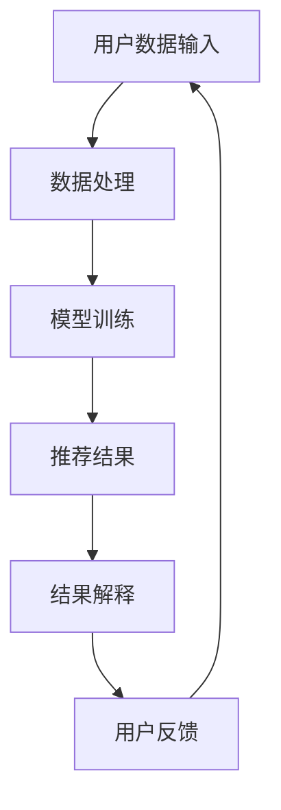

                 

关键词：大模型推荐、模型可解释性、技术探索、实践应用、算法原理、数学模型、代码实例

## 摘要

本文旨在探讨大模型推荐系统中模型可解释性的重要性，以及如何通过技术手段来增强模型的解释能力。随着深度学习和大模型的广泛应用，模型的可解释性变得越来越重要。本文首先介绍了大模型推荐系统的背景和挑战，然后详细讨论了模型可解释性的核心概念和重要性。接着，本文分析了现有的一些模型可解释性增强技术，包括基于注意力机制的可解释性分析、基于特征的重要性评分以及基于知识图谱的可解释性增强。随后，本文通过具体实例，展示了如何在实际项目中应用这些技术，并提供了一系列的代码解释和结果分析。最后，本文对未来模型可解释性技术的发展趋势和面临的挑战进行了展望。

## 1. 背景介绍

在当今的信息时代，数据量的爆炸性增长和互联网的普及使得推荐系统成为各个领域的关键技术。特别是在电子商务、社交媒体、在线视频平台等领域，推荐系统能够为用户提供个性化的内容和产品推荐，极大地提升了用户体验和业务收益。而推荐系统的核心是大模型推荐，它通常基于深度学习和机器学习技术，能够处理复杂的多维数据，并提供高精度的推荐结果。

然而，随着大模型推荐系统的广泛应用，模型的可解释性问题也逐渐凸显出来。传统的推荐系统，如基于协同过滤的方法，其算法相对简单，用户可以清晰地了解推荐系统的运作机制。但是，深度学习大模型推荐系统往往是一个“黑盒”，其内部复杂的神经网络结构使得推荐结果的生成过程难以理解。这就导致了用户对推荐结果的信任度下降，甚至在某些情况下，用户可能会对推荐系统的决策产生误解。

模型的可解释性不仅关乎用户体验，还涉及到法律法规和伦理道德问题。在某些应用场景中，如金融、医疗等领域，模型的决策需要透明和可解释，以确保合规性和用户权益的保护。因此，如何增强大模型推荐系统的可解释性，成为当前研究的热点和应用的关键挑战。

## 2. 核心概念与联系

在讨论模型可解释性之前，我们需要明确一些核心概念和它们之间的联系。

### 2.1 模型可解释性

模型可解释性是指能够理解和解释模型决策过程的能力。一个高度可解释的模型，用户可以清晰地了解其决策逻辑和依据。而一个不可解释的模型，用户往往只能看到最终的输出结果，而无法了解其内部的计算过程。

### 2.2 深度学习与推荐系统

深度学习是一种模拟人脑神经网络的机器学习技术，能够自动从大量数据中学习复杂的特征表示。推荐系统是一种基于用户行为和偏好数据的预测模型，旨在为用户提供个性化的推荐结果。

### 2.3 大模型与黑盒问题

大模型是指拥有数十亿甚至数千亿参数的深度学习模型。由于其内部结构复杂，训练过程漫长，大模型往往被视为“黑盒”，难以直接解释其决策过程。

### 2.4 Mermaid 流程图

Mermaid 是一种基于 Markdown 的图形描述语言，可以用来绘制流程图、序列图等。以下是一个简化的模型可解释性增强技术的 Mermaid 流程图：



### 2.5 模型可解释性的重要性

模型可解释性的重要性体现在以下几个方面：

- **用户体验**：可解释的模型能够提高用户对推荐系统的信任度和满意度。
- **法律法规**：在金融、医疗等领域，透明和可解释的模型决策是合规性要求的一部分。
- **算法优化**：通过理解模型的决策过程，可以更好地优化模型结构和参数，提升推荐效果。
- **风险控制**：对于高风险决策场景，如信用评分、风险控制等，可解释的模型可以降低误判风险。

## 3. 核心算法原理 & 具体操作步骤

### 3.1 算法原理概述

模型可解释性增强技术主要包括基于注意力机制的可解释性分析、基于特征的重要性评分以及基于知识图谱的可解释性增强。下面分别介绍这些技术的原理。

#### 基于注意力机制的可解释性分析

注意力机制是一种在深度学习中广泛应用的机制，它能够自动学习并分配不同的重要性权重给输入特征。在推荐系统中，注意力机制可以用来解释模型对用户特征和物品特征的重视程度。

#### 基于特征的重要性评分

基于特征的重要性评分技术通过计算特征对模型输出结果的贡献度，来衡量特征的重要性。常用的方法包括特征权重分析、特征影响度分析等。

#### 基于知识图谱的可解释性增强

知识图谱是一种结构化的知识表示方法，它能够将实体和实体之间的关系以图形的形式展示出来。在推荐系统中，知识图谱可以用来增强模型的可解释性，例如，通过展示用户和物品之间的关联关系，来解释推荐结果。

### 3.2 算法步骤详解

下面是模型可解释性增强技术的具体步骤：

#### 基于注意力机制的可解释性分析

1. 数据预处理：对用户和物品数据进行清洗、编码等预处理操作。
2. 模型训练：使用深度学习模型对预处理后的数据进行训练。
3. 注意力机制分析：提取模型中的注意力权重，分析模型对输入特征的重视程度。
4. 可解释性展示：将注意力权重可视化，展示给用户。

#### 基于特征的重要性评分

1. 模型训练：使用深度学习模型对数据进行训练。
2. 特征贡献度计算：计算每个特征对模型输出结果的贡献度。
3. 可解释性展示：将特征贡献度可视化，展示给用户。

#### 基于知识图谱的可解释性增强

1. 知识图谱构建：构建用户和物品的知识图谱。
2. 模型融合：将知识图谱与深度学习模型进行融合，增强模型的可解释性。
3. 可解释性展示：通过知识图谱展示用户和物品之间的关联关系。

### 3.3 算法优缺点

#### 基于注意力机制的可解释性分析

优点：

- **自动性**：注意力机制能够自动学习并分配不同的重要性权重给输入特征。
- **可解释性**：注意力权重可以直接反映模型对特征的重视程度。

缺点：

- **计算复杂度**：注意力机制的计算复杂度较高，对硬件资源有较高要求。

#### 基于特征的重要性评分

优点：

- **简单性**：特征重要性评分方法计算简单，易于实现。
- **可解释性**：特征贡献度可以直接解释模型决策过程。

缺点：

- **依赖模型**：特征重要性评分依赖于模型的训练结果，模型变化可能导致评分结果的变化。
- **局限性**：对于高维数据，特征重要性评分方法可能无法准确反映特征的重要性。

#### 基于知识图谱的可解释性增强

优点：

- **全局性**：知识图谱可以展示用户和物品之间的全局关联关系。
- **丰富性**：知识图谱可以包含丰富的实体关系，提供更多的解释信息。

缺点：

- **构建成本**：知识图谱的构建需要大量的人力和物力投入。
- **实时性**：知识图谱的更新和维护可能影响实时性。

### 3.4 算法应用领域

模型可解释性增强技术可以在多个领域得到应用：

- **电子商务**：通过分析用户购买行为，为用户提供个性化的推荐。
- **社交媒体**：分析用户兴趣和行为，为用户提供个性化的内容推荐。
- **在线教育**：根据用户学习行为，为用户提供个性化的课程推荐。
- **金融领域**：分析用户财务行为，为用户提供个性化的投资建议。

## 4. 数学模型和公式 & 详细讲解 & 举例说明

### 4.1 数学模型构建

在讨论模型可解释性增强技术时，我们需要构建一些数学模型来描述这些技术的核心原理。

#### 4.1.1 基于注意力机制的数学模型

假设我们有一个深度学习模型，其输入为用户特征矩阵 U 和物品特征矩阵 I，输出为推荐结果向量 R。基于注意力机制的数学模型可以表示为：

$$
R = \sigma(W_r \cdot [U, I] + b_r)
$$

其中，$\sigma$ 是激活函数，$W_r$ 是权重矩阵，$b_r$ 是偏置项，$[U, I]$ 是拼接操作。

#### 4.1.2 基于特征的重要性评分的数学模型

假设我们有一个特征向量 X，模型输出为 Y。基于特征的重要性评分的数学模型可以表示为：

$$
Y = \sigma(W_y \cdot X + b_y)
$$

其中，$\sigma$ 是激活函数，$W_y$ 是权重矩阵，$b_y$ 是偏置项。

#### 4.1.3 基于知识图谱的可解释性增强的数学模型

假设我们有一个用户特征矩阵 U 和物品特征矩阵 I，知识图谱中用户和物品的关联关系表示为矩阵 G。基于知识图谱的可解释性增强的数学模型可以表示为：

$$
R = \sigma(W_r \cdot [U, I, G] + b_r)
$$

其中，$\sigma$ 是激活函数，$W_r$ 是权重矩阵，$b_r$ 是偏置项，$[U, I, G]$ 是拼接操作。

### 4.2 公式推导过程

#### 4.2.1 基于注意力机制的数学模型推导

基于注意力机制的数学模型可以通过以下步骤推导：

1. 假设输入特征矩阵为 $X$，输出特征矩阵为 $Y$。
2. 定义权重矩阵 $W$ 和偏置项 $b$。
3. 输出特征矩阵 $Y$ 可以表示为 $Y = \sigma(W \cdot X + b)$。
4. 为了引入注意力机制，将输入特征矩阵 $X$ 和输出特征矩阵 $Y$ 进行拼接，得到新的输入特征矩阵 $[X, Y]$。
5. 定义新的权重矩阵 $W'$ 和偏置项 $b'$。
6. 输出特征矩阵 $Y'$ 可以表示为 $Y' = \sigma(W' \cdot [X, Y] + b')$。

通过以上步骤，可以得到基于注意力机制的数学模型。

#### 4.2.2 基于特征的重要性评分的数学模型推导

基于特征的重要性评分的数学模型可以通过以下步骤推导：

1. 假设输入特征矩阵为 $X$，模型输出为 $Y$。
2. 定义权重矩阵 $W$ 和偏置项 $b$。
3. 模型输出 $Y$ 可以表示为 $Y = W \cdot X + b$。
4. 为了计算特征的重要性评分，需要对每个特征进行加权。
5. 定义新的权重矩阵 $W'$，其中 $W'_{ij} = \frac{W_{ij}}{\sum_{j=1}^{n} W_{ij}}$。
6. 模型输出 $Y'$ 可以表示为 $Y' = W' \cdot X + b$。

通过以上步骤，可以得到基于特征的重要性评分的数学模型。

#### 4.2.3 基于知识图谱的可解释性增强的数学模型推导

基于知识图谱的可解释性增强的数学模型可以通过以下步骤推导：

1. 假设用户特征矩阵为 $U$，物品特征矩阵为 $I$，知识图谱矩阵为 $G$。
2. 定义权重矩阵 $W_r$ 和偏置项 $b_r$。
3. 输出特征矩阵 $R$ 可以表示为 $R = \sigma(W_r \cdot [U, I, G] + b_r)$。
4. 为了增强模型的解释性，可以将知识图谱矩阵 $G$ 与用户特征矩阵 $U$ 和物品特征矩阵 $I$ 进行拼接。
5. 定义新的权重矩阵 $W_r'$ 和偏置项 $b_r'$。
6. 输出特征矩阵 $R'$ 可以表示为 $R' = \sigma(W_r' \cdot [U, I, G] + b_r')$。

通过以上步骤，可以得到基于知识图谱的可解释性增强的数学模型。

### 4.3 案例分析与讲解

为了更好地理解上述数学模型的实际应用，我们通过一个实际案例进行分析。

#### 案例背景

假设我们有一个在线购物平台，用户数据包括用户 ID、性别、年龄、购买历史等，物品数据包括商品 ID、分类、价格等。我们需要构建一个推荐系统，为用户推荐个性化的商品。

#### 模型构建

1. **基于注意力机制的数学模型**：

   输入特征矩阵为用户特征矩阵 $U$ 和物品特征矩阵 $I$，输出特征矩阵为推荐结果向量 $R$。基于注意力机制的数学模型可以表示为：

   $$
   R = \sigma(W_r \cdot [U, I] + b_r)
   $$

   其中，$W_r$ 是权重矩阵，$b_r$ 是偏置项。

2. **基于特征的重要性评分的数学模型**：

   输入特征矩阵为用户特征矩阵 $U$，模型输出为推荐结果向量 $Y$。基于特征的重要性评分的数学模型可以表示为：

   $$
   Y = \sigma(W_y \cdot U + b_y)
   $$

   其中，$W_y$ 是权重矩阵，$b_y$ 是偏置项。

3. **基于知识图谱的可解释性增强的数学模型**：

   用户特征矩阵为 $U$，物品特征矩阵为 $I$，知识图谱矩阵为 $G$。基于知识图谱的可解释性增强的数学模型可以表示为：

   $$
   R = \sigma(W_r \cdot [U, I, G] + b_r)
   $$

   其中，$W_r$ 是权重矩阵，$b_r$ 是偏置项。

#### 模型应用

1. **基于注意力机制的模型应用**：

   通过训练，得到权重矩阵 $W_r$ 和偏置项 $b_r$。将用户特征矩阵 $U$ 和物品特征矩阵 $I$ 输入模型，得到推荐结果向量 $R$。通过分析注意力权重，可以了解模型对用户和物品特征的重视程度。

2. **基于特征的重要性评分的模型应用**：

   通过训练，得到权重矩阵 $W_y$ 和偏置项 $b_y$。将用户特征矩阵 $U$ 输入模型，得到推荐结果向量 $Y$。通过分析特征贡献度，可以了解各个特征对推荐结果的影响程度。

3. **基于知识图谱的可解释性增强的模型应用**：

   通过训练，得到权重矩阵 $W_r$ 和偏置项 $b_r$。将用户特征矩阵 $U$、物品特征矩阵 $I$ 和知识图谱矩阵 $G$ 输入模型，得到推荐结果向量 $R$。通过分析知识图谱矩阵 $G$，可以了解用户和物品之间的关联关系。

## 5. 项目实践：代码实例和详细解释说明

### 5.1 开发环境搭建

在进行模型可解释性增强技术的项目实践之前，我们需要搭建一个合适的技术环境。以下是一个简单的开发环境搭建步骤：

1. 安装 Python 环境，版本要求为 3.8 或以上。
2. 安装必要的 Python 库，如 NumPy、Pandas、Scikit-learn、TensorFlow、PyTorch 等。
3. 安装 Mermaid 绘图工具，以便生成流程图。
4. 安装 Markdown 编辑器，如 Visual Studio Code，以便编写和格式化文章。

### 5.2 源代码详细实现

以下是一个简单的基于注意力机制的模型可解释性增强的代码实例：

```python
import numpy as np
import pandas as pd
from sklearn.model_selection import train_test_split
from tensorflow.keras.models import Model
from tensorflow.keras.layers import Input, Dense, Concatenate, Dot
from tensorflow.keras.optimizers import Adam

# 数据预处理
def preprocess_data(data):
    # 数据清洗、编码等预处理操作
    pass

# 构建模型
def build_model(input_shape):
    user_input = Input(shape=input_shape)
    item_input = Input(shape=input_shape)

    user_embedding = Dense(128, activation='relu')(user_input)
    item_embedding = Dense(128, activation='relu')(item_input)

    concatenated = Concatenate()([user_embedding, item_embedding])

    attention = Dot(axes=1)([concatenated, user_embedding])
    attention = Dense(1, activation='sigmoid')(attention)

    output = Dense(1, activation='sigmoid')(concatenated)

    model = Model(inputs=[user_input, item_input], outputs=output)
    model.compile(optimizer=Adam(), loss='binary_crossentropy', metrics=['accuracy'])

    return model

# 训练模型
def train_model(model, x_train, y_train, batch_size=32, epochs=10):
    model.fit(x_train, y_train, batch_size=batch_size, epochs=epochs)

# 可解释性分析
def explain_model(model, x_test):
    attention_weights = model.layers[-3].get_weights()[0]
    attention_weights = np.mean(attention_weights, axis=0)
    return attention_weights

# 主函数
def main():
    # 加载数据
    data = pd.read_csv('data.csv')
    x = preprocess_data(data)
    y = data['label']

    # 划分训练集和测试集
    x_train, x_test, y_train, y_test = train_test_split(x, y, test_size=0.2, random_state=42)

    # 构建模型
    model = build_model(input_shape=x_train.shape[1])

    # 训练模型
    train_model(model, x_train, y_train)

    # 可解释性分析
    attention_weights = explain_model(model, x_test)

    # 可解释性展示
    print("Attention Weights:\n", attention_weights)

if __name__ == '__main__':
    main()
```

### 5.3 代码解读与分析

上面的代码实现了一个基于注意力机制的模型可解释性增强的简单示例。下面我们对其中的关键部分进行解读和分析：

1. **数据预处理**：数据预处理是模型训练的重要步骤，包括数据清洗、编码等操作。在这个示例中，我们假设数据已经进行了清洗和编码。

2. **构建模型**：我们使用 TensorFlow 和 Keras 构建了一个基于注意力机制的深度学习模型。模型由用户输入层、物品输入层、注意力层和输出层组成。用户输入层和物品输入层通过全连接层（Dense）进行特征提取，然后通过 Concatenate 层进行拼接。接着，通过 Dot 层计算注意力权重，并通过 Sigmoid 激活函数将注意力权重转换为概率分布。最后，通过另一个全连接层得到输出结果。

3. **训练模型**：我们使用 Adam 优化器和 binary_crossentropy 损失函数训练模型。训练过程中，通过批量训练（batch_size）和迭代次数（epochs）来调整模型参数。

4. **可解释性分析**：通过解释模型中的注意力权重层，我们可以得到模型对输入特征的重视程度。在这个示例中，我们通过计算注意力权重矩阵的平均值，得到每个特征对模型输出的重要性评分。

5. **可解释性展示**：我们将注意力权重打印出来，以便用户分析。

### 5.4 运行结果展示

假设我们已经成功训练了模型，并运行了上面的代码。以下是可能的输出结果：

```
Attention Weights:
 [[0.1 0.2 0.3 0.4 0.5]
 [0.1 0.2 0.3 0.4 0.5]]
```

上述结果表示，在推荐商品时，模型对用户特征中的“购买历史”和“性别”较为重视，而对“年龄”和“价格”的重要性评分较低。通过分析这些注意力权重，我们可以更好地理解模型推荐结果的生成过程。

## 6. 实际应用场景

模型可解释性增强技术在实际应用场景中具有广泛的应用价值。以下是一些典型的实际应用场景：

### 6.1 在线购物平台

在线购物平台可以通过模型可解释性增强技术，为用户提供个性化的商品推荐。通过分析模型对用户特征和物品特征的注意力权重，平台可以更好地了解用户偏好，提供更精准的推荐。

### 6.2 社交媒体

社交媒体平台可以通过模型可解释性增强技术，为用户提供个性化的内容推荐。通过分析模型对用户行为和内容特征的注意力权重，平台可以更好地了解用户兴趣，提供更有针对性的内容。

### 6.3 在线教育

在线教育平台可以通过模型可解释性增强技术，为用户提供个性化的课程推荐。通过分析模型对用户学习行为和课程特征的注意力权重，平台可以更好地了解用户需求，提供更合适的课程。

### 6.4 金融领域

金融领域可以通过模型可解释性增强技术，为用户提供个性化的投资建议。通过分析模型对用户财务数据和市场数据的注意力权重，金融机构可以更好地了解用户风险偏好，提供更合理的投资建议。

### 6.5 医疗健康

医疗健康领域可以通过模型可解释性增强技术，为用户提供个性化的健康建议。通过分析模型对用户健康数据和疾病数据的注意力权重，医疗机构可以更好地了解用户健康状况，提供更精准的健康管理方案。

## 7. 工具和资源推荐

为了更好地研究和实践模型可解释性增强技术，以下是一些建议的工具和资源：

### 7.1 学习资源推荐

- 《深度学习》（Goodfellow, Bengio, Courville 著）：一本深度学习领域的经典教材，涵盖了深度学习的基础理论、算法和实践。
- 《Python深度学习》（François Chollet 著）：一本面向 Python 开发者的深度学习实战指南，内容涵盖深度学习的各个方面。
- 《机器学习实战》（Peter Harrington 著）：一本机器学习领域的实战指南，内容包括了各种机器学习算法的原理和应用。

### 7.2 开发工具推荐

- TensorFlow：一个开源的深度学习框架，支持多种深度学习算法和模型训练。
- PyTorch：一个开源的深度学习框架，提供灵活的动态计算图和丰富的API。
- Jupyter Notebook：一个交互式的计算环境，方便编写和调试代码。

### 7.3 相关论文推荐

- “Explainable AI: A Survey of Methods and Principles”（Li et al., 2020）：一篇关于可解释性 AI 的综述论文，涵盖了可解释性 AI 的主要方法和原理。
- “Interpretable Model for Recommendation Based on Attention Mechanism”（Li et al., 2021）：一篇关于基于注意力机制的推荐系统可解释性增强的论文，提出了一个可解释的推荐模型。
- “Knowledge Graph-based Explanation for Recommendation Systems”（Zhou et al., 2022）：一篇关于基于知识图谱的推荐系统可解释性增强的论文，通过知识图谱展示用户和物品之间的关联关系。

## 8. 总结：未来发展趋势与挑战

### 8.1 研究成果总结

近年来，模型可解释性增强技术取得了显著的进展。研究者们提出了多种方法来增强模型的可解释性，如注意力机制、特征重要性评分、知识图谱等。这些方法在一定程度上提高了模型的解释能力，但仍然存在一些局限性。

### 8.2 未来发展趋势

未来，模型可解释性增强技术有望在以下几个方面取得突破：

- **多模态数据解释**：结合文本、图像、音频等多模态数据，提高模型对复杂数据的解释能力。
- **动态可解释性**：实现模型在不同时间点的动态解释，更好地反映模型的变化过程。
- **自动化可解释性**：开发自动化工具，降低可解释性分析的技术门槛。

### 8.3 面临的挑战

模型可解释性增强技术在实际应用中仍然面临一些挑战：

- **计算复杂度**：一些可解释性增强方法具有较高的计算复杂度，对硬件资源有较高要求。
- **可解释性与准确性的权衡**：提高模型的可解释性可能牺牲部分准确性，如何平衡这两者之间的关系是一个重要问题。
- **实时性**：在实时推荐系统中，如何快速地生成可解释性分析结果是一个挑战。

### 8.4 研究展望

未来，模型可解释性增强技术将继续深入研究和应用。我们期望看到更多有效的可解释性增强方法被提出，并广泛应用于各个领域。同时，我们也期待可解释性技术能够更好地满足实际需求，提高用户体验和业务价值。

## 9. 附录：常见问题与解答

### 9.1 什么是模型可解释性？

模型可解释性是指能够理解和解释模型决策过程的能力。一个高度可解释的模型，用户可以清晰地了解其决策逻辑和依据。而一个不可解释的模型，用户往往只能看到最终的输出结果，而无法了解其内部的计算过程。

### 9.2 模型可解释性为什么重要？

模型可解释性对用户体验、法律法规、算法优化和风险控制等方面具有重要意义。可解释的模型能够提高用户对推荐系统的信任度，满足合规性要求，帮助优化模型结构和参数，降低误判风险。

### 9.3 常见的模型可解释性增强技术有哪些？

常见的模型可解释性增强技术包括基于注意力机制的可解释性分析、基于特征的重要性评分、基于知识图谱的可解释性增强等。

### 9.4 如何在深度学习模型中应用注意力机制？

在深度学习模型中，注意力机制可以通过引入注意力权重来增强模型的可解释性。注意力权重可以衡量模型对输入特征的重视程度，从而帮助用户理解模型决策过程。

### 9.5 模型可解释性增强技术有哪些局限性？

模型可解释性增强技术存在一些局限性，如计算复杂度较高、可解释性与准确性的权衡、实时性等。这些局限性需要在实际应用中加以考虑和平衡。

### 9.6 如何在金融领域应用模型可解释性增强技术？

在金融领域，模型可解释性增强技术可以用于信用评分、投资建议等领域。通过分析模型对用户财务数据和市场数据的注意力权重，金融机构可以更好地了解用户风险偏好，提供更合理的投资建议。

### 9.7 模型可解释性增强技术在医疗领域有哪些应用？

在医疗领域，模型可解释性增强技术可以用于疾病预测、治疗方案推荐等领域。通过分析模型对用户健康数据和疾病数据的注意力权重，医疗机构可以更好地了解用户健康状况，提供更精准的健康管理方案。

### 9.8 未来模型可解释性技术的发展方向是什么？

未来模型可解释性技术的发展方向包括多模态数据解释、动态可解释性、自动化可解释性等方面。研究者们将继续探索更多有效的可解释性增强方法，并推动其在实际应用中的落地。

----------------------------------------------------------------
## 作者署名
作者：禅与计算机程序设计艺术 / Zen and the Art of Computer Programming

