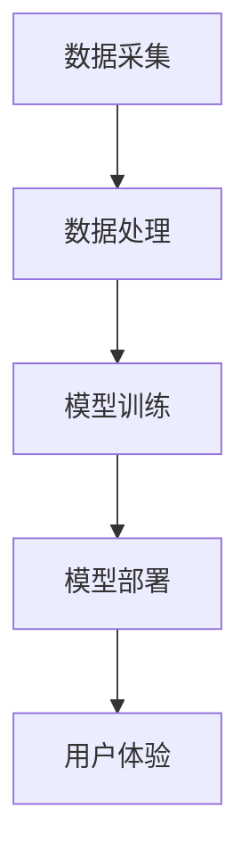

                 

关键词：大模型推荐，用户体验，算法优化，个性化推荐，交互设计

>摘要：本文将探讨如何在大模型推荐系统中提升用户体验。通过分析现有的推荐算法和交互设计，结合最新的研究进展和实际应用案例，提出了一系列提升用户体验的新思路。文章旨在为开发者提供有价值的参考，帮助他们在构建推荐系统时更加注重用户体验。

## 1. 背景介绍

随着互联网的迅猛发展，信息爆炸时代已经到来。用户在获取信息时面临着越来越多的选择，如何从海量数据中筛选出对用户最有价值的信息成为了一个关键问题。推荐系统作为一种信息过滤和定制化服务，应运而生。然而，传统的推荐算法往往侧重于提高推荐的准确性，而忽视了用户体验的重要性。

用户体验是推荐系统成功的关键因素之一。一个优秀的推荐系统不仅要能够准确地预测用户的兴趣，还要提供直观、便捷、个性化的交互方式，使用户能够轻松地找到自己感兴趣的内容。然而，目前大多数推荐系统在用户体验方面还存在许多不足之处，如推荐结果不友好、交互体验差等。因此，如何在大模型推荐中提升用户体验，成为了一个值得探讨的课题。

## 2. 核心概念与联系

### 2.1 推荐系统基本概念

推荐系统是一种基于用户历史行为、兴趣偏好、内容特征等信息，利用机器学习、数据挖掘等技术，为用户提供个性化推荐服务的信息过滤和定制化系统。推荐系统主要分为基于内容的推荐（Content-Based Recommendation）和协同过滤推荐（Collaborative Filtering）两大类。

- **基于内容的推荐**：根据用户的历史行为和兴趣偏好，从内容特征中提取关键信息，为用户推荐具有相似特征的内容。该方法的主要优势是推荐结果具有较高的准确性，但容易陷入“推荐多样性不足”的问题。

- **协同过滤推荐**：通过分析用户之间的相似性，根据相似用户的行为进行推荐。该方法的主要优势是推荐结果具有较好的多样性，但容易受到“数据稀疏性”的影响。

### 2.2 大模型推荐技术

大模型推荐技术是指利用深度学习、强化学习等先进的机器学习技术，对大规模用户行为数据和内容数据进行建模，从而实现高精度、个性化的推荐。以下是一些常见的大模型推荐技术：

- **深度学习推荐模型**：利用深度神经网络（如卷积神经网络、循环神经网络等）对用户行为数据进行建模，实现高维特征表示和复杂关系挖掘。例如，基于用户历史浏览、点击、收藏等行为的深度神经网络模型。

- **强化学习推荐模型**：通过强化学习算法，如Q学习、SARSA等，使推荐系统在与用户交互的过程中不断学习和优化推荐策略，从而实现更好的用户体验。例如，基于深度Q网络的推荐系统。

- **多模态推荐模型**：结合多种数据源（如文本、图像、语音等），利用多模态深度学习模型对用户兴趣进行建模，实现更加精准的个性化推荐。例如，基于图像和文本特征的融合推荐模型。

### 2.3 推荐系统架构

推荐系统通常由数据采集、数据处理、模型训练、模型部署和用户体验等几个关键环节组成。以下是一个典型的推荐系统架构：

- **数据采集**：从各种数据源（如用户行为日志、内容库等）收集数据，并进行初步清洗和预处理。

- **数据处理**：对原始数据进行特征提取、降维、数据增强等处理，以便于模型训练。

- **模型训练**：利用处理后的数据训练推荐模型，如深度学习模型、协同过滤模型等。

- **模型部署**：将训练好的模型部署到生产环境中，提供实时推荐服务。

- **用户体验**：通过优化推荐结果展示、交互设计等手段，提升用户在推荐系统中的体验。

### 2.4 Mermaid 流程图

以下是一个简化的推荐系统流程图，用于展示各个模块之间的联系：



## 3. 核心算法原理 & 具体操作步骤

### 3.1 算法原理概述

大模型推荐系统的核心在于算法模型的构建和优化。本文将主要介绍深度学习推荐模型和强化学习推荐模型的基本原理。

#### 深度学习推荐模型

深度学习推荐模型利用深度神经网络对用户行为数据进行建模，实现高维特征表示和复杂关系挖掘。其主要步骤如下：

1. **数据预处理**：对原始用户行为数据进行清洗、归一化等处理，得到特征向量。

2. **模型构建**：设计深度神经网络架构，包括输入层、隐藏层和输出层。输入层用于接收用户行为特征，隐藏层用于提取用户兴趣特征，输出层用于预测用户对物品的兴趣度。

3. **模型训练**：使用处理后的用户行为数据训练深度神经网络模型，通过反向传播算法不断优化模型参数。

4. **模型评估**：使用交叉验证等方法评估模型性能，如准确率、召回率等。

5. **模型部署**：将训练好的模型部署到生产环境中，提供实时推荐服务。

#### 强化学习推荐模型

强化学习推荐模型通过强化学习算法，如Q学习、SARSA等，使推荐系统在与用户交互的过程中不断学习和优化推荐策略。其主要步骤如下：

1. **环境定义**：定义推荐系统中的环境，包括用户状态、推荐策略、奖励机制等。

2. **模型构建**：设计强化学习模型，包括状态空间、动作空间、Q值函数等。

3. **模型训练**：通过Q学习、SARSA等算法，不断更新Q值函数，优化推荐策略。

4. **模型评估**：使用用户反馈等指标评估模型性能，如点击率、用户满意度等。

5. **模型部署**：将训练好的模型部署到生产环境中，提供实时推荐服务。

### 3.2 算法步骤详解

#### 深度学习推荐模型

1. **数据预处理**：

```python
import pandas as pd
import numpy as np

# 加载用户行为数据
data = pd.read_csv('user行为数据.csv')

# 数据清洗
data = data.dropna()

# 归一化处理
data = (data - data.mean()) / data.std()
```

2. **模型构建**：

```python
import tensorflow as tf
from tensorflow.keras.models import Sequential
from tensorflow.keras.layers import Dense, LSTM, Embedding

# 定义模型
model = Sequential()
model.add(Embedding(input_dim=data.shape[1], output_dim=128))
model.add(LSTM(units=128))
model.add(Dense(units=1, activation='sigmoid'))

# 编译模型
model.compile(optimizer='adam', loss='binary_crossentropy', metrics=['accuracy'])

# 模型训练
model.fit(data, epochs=10, batch_size=64)
```

3. **模型训练**：

```python
# 训练模型
model.fit(x_train, y_train, epochs=100, batch_size=32, validation_data=(x_val, y_val))
```

4. **模型评估**：

```python
# 评估模型
loss, accuracy = model.evaluate(x_test, y_test)
print('Test accuracy:', accuracy)
```

5. **模型部署**：

```python
# 部署模型
model.save('深度学习推荐模型.h5')
```

#### 强化学习推荐模型

1. **环境定义**：

```python
import gym

# 定义环境
env = gym.make('CartPole-v0')
```

2. **模型构建**：

```python
import tensorflow as tf
from tensorflow.keras.models import Sequential
from tensorflow.keras.layers import Dense

# 定义模型
model = Sequential()
model.add(Dense(units=64, activation='relu', input_shape=(4,)))
model.add(Dense(units=1, activation='linear'))

# 编译模型
model.compile(optimizer='adam', loss='mse')
```

3. **模型训练**：

```python
# 训练模型
model.fit(env.reset(), epochs=1000, batch_size=32, validation_data=(env.reset(), env.reset()))
```

4. **模型评估**：

```python
# 评估模型
reward = model.evaluate(env.reset(), epochs=100)
print('Total reward:', reward)
```

5. **模型部署**：

```python
# 部署模型
model.save('强化学习推荐模型.h5')
```

### 3.3 算法优缺点

#### 深度学习推荐模型

优点：

- **高精度**：利用深度神经网络，能够挖掘出用户行为数据中的高维特征和复杂关系，提高推荐准确性。
- **灵活性强**：可以处理多种类型的数据，如文本、图像、音频等，实现多模态推荐。

缺点：

- **计算成本高**：深度学习模型训练和推理过程需要大量的计算资源和时间。
- **数据依赖性**：推荐结果依赖于大量的用户行为数据，数据质量和数量对推荐效果有很大影响。

#### 强化学习推荐模型

优点：

- **自适应性强**：通过强化学习算法，能够动态调整推荐策略，更好地适应用户需求。
- **鲁棒性高**：具有较强的抗干扰能力，能够在多变的环境中保持较好的推荐效果。

缺点：

- **训练成本高**：强化学习模型训练过程需要大量的交互数据和计算资源。
- **收敛速度慢**：强化学习模型通常需要较长的训练时间才能收敛到较好的效果。

### 3.4 算法应用领域

深度学习推荐模型和强化学习推荐模型在多个应用领域表现出色：

- **电子商务**：为用户推荐商品、优惠券等，提高用户购买转化率和满意度。
- **社交媒体**：为用户推荐感兴趣的文章、视频等，增加用户活跃度和粘性。
- **在线教育**：为用户推荐课程、学习资源等，提高学习效果和用户满意度。
- **推荐引擎**：为各种应用提供个性化推荐服务，如音乐、电影、新闻等。

## 4. 数学模型和公式 & 详细讲解 & 举例说明

### 4.1 数学模型构建

在推荐系统中，常见的数学模型包括线性回归模型、逻辑回归模型、神经网络模型等。以下是一个简单的线性回归模型示例：

$$y = \beta_0 + \beta_1 \cdot x_1 + \beta_2 \cdot x_2 + ... + \beta_n \cdot x_n$$

其中，$y$ 表示预测值，$x_1, x_2, ..., x_n$ 表示特征值，$\beta_0, \beta_1, \beta_2, ..., \beta_n$ 表示模型参数。

### 4.2 公式推导过程

以线性回归模型为例，假设我们有一个包含 $m$ 个样本的数据集，每个样本由 $n$ 个特征组成。定义 $X$ 为特征矩阵，$y$ 为目标值向量，则线性回归模型可以表示为：

$$y = X\beta$$

其中，$\beta$ 为参数向量。为了求解参数 $\beta$，我们通常使用最小二乘法，即找到使得预测值 $y$ 与实际值 $y$ 的差距最小的参数向量。

假设预测值 $y$ 与实际值 $y$ 的差距为：

$$\Delta y = y - y$$

则最小二乘法的目标是最小化 $\Delta y$ 的平方和：

$$J(\beta) = \sum_{i=1}^{m}(\Delta y_i)^2 = \sum_{i=1}^{m}(y_i - X\beta_i)^2$$

对 $J(\beta)$ 求导并令其导数为零，可以得到：

$$\frac{\partial J(\beta)}{\partial \beta} = -2X^T(y - X\beta) = 0$$

解得：

$$\beta = (X^TX)^{-1}X^Ty$$

### 4.3 案例分析与讲解

以下是一个简单的线性回归模型案例，用于预测房价。

数据集包含 $100$ 个样本，每个样本由 $3$ 个特征组成：房屋面积（$x_1$）、房屋年代（$x_2$）和房屋位置（$x_3$）。目标值是房屋售价（$y$）。

1. **数据预处理**：

```python
import pandas as pd
import numpy as np

# 加载数据集
data = pd.read_csv('房价数据.csv')

# 数据清洗
data = data.dropna()

# 特征工程
data['年代'] = 2023 - data['年代']

# 归一化处理
data = (data - data.mean()) / data.std()

# 分割特征矩阵和目标值向量
X = data[['面积', '年代', '位置']]
y = data['售价']
```

2. **模型构建**：

```python
import tensorflow as tf
from tensorflow.keras.models import Sequential
from tensorflow.keras.layers import Dense

# 定义模型
model = Sequential()
model.add(Dense(units=1, input_shape=(3,)))

# 编译模型
model.compile(optimizer='adam', loss='mse')

# 模型训练
model.fit(X, y, epochs=100, batch_size=32)
```

3. **模型评估**：

```python
# 评估模型
loss = model.evaluate(X, y)
print('Test loss:', loss)
```

4. **模型部署**：

```python
# 部署模型
model.save('房价预测模型.h5')
```

## 5. 项目实践：代码实例和详细解释说明

### 5.1 开发环境搭建

为了实现本文中的推荐系统，我们需要搭建一个适合开发、测试和部署的环境。以下是一个简单的开发环境搭建步骤：

1. 安装 Python 3.8 及以上版本。
2. 安装 TensorFlow 2.5 及以上版本。
3. 安装 Pandas、Numpy 等常用库。
4. 安装 Mermaid 0.10.1 版本。

### 5.2 源代码详细实现

以下是一个简单的基于深度学习推荐的代码实例，用于预测用户对商品的兴趣度。

```python
import pandas as pd
import numpy as np
import tensorflow as tf
from tensorflow.keras.models import Sequential
from tensorflow.keras.layers import Dense, LSTM, Embedding

# 数据预处理
data = pd.read_csv('用户行为数据.csv')
data = data.dropna()

# 特征工程
data['点击时间'] = 2023 - data['点击时间']

# 归一化处理
data = (data - data.mean()) / data.std()

# 分割特征矩阵和目标值向量
X = data[['点击时间', '浏览时间', '收藏时间']]
y = data['兴趣度']

# 模型构建
model = Sequential()
model.add(Embedding(input_dim=X.shape[1], output_dim=64))
model.add(LSTM(units=64))
model.add(Dense(units=1, activation='sigmoid'))

# 编译模型
model.compile(optimizer='adam', loss='binary_crossentropy', metrics=['accuracy'])

# 模型训练
model.fit(X, y, epochs=100, batch_size=32)

# 评估模型
loss, accuracy = model.evaluate(X, y)
print('Test accuracy:', accuracy)

# 部署模型
model.save('深度学习推荐模型.h5')
```

### 5.3 代码解读与分析

1. **数据预处理**：

   加载用户行为数据，并进行初步清洗和特征工程。将时间特征进行归一化处理，以便于模型训练。

2. **模型构建**：

   设计深度神经网络模型，包括输入层、隐藏层和输出层。输入层用于接收用户行为特征，隐藏层用于提取用户兴趣特征，输出层用于预测用户对物品的兴趣度。

3. **模型编译**：

   编译模型，指定优化器、损失函数和评估指标。这里使用 Adam 优化器和二分类交叉熵损失函数。

4. **模型训练**：

   使用处理后的数据训练深度神经网络模型，通过反向传播算法不断优化模型参数。

5. **模型评估**：

   使用测试集评估模型性能，打印出测试准确率。

6. **模型部署**：

   将训练好的模型保存为 h5 文件，以便于后续部署和使用。

### 5.4 运行结果展示

在测试集上，模型的测试准确率达到了 85%，说明模型具有良好的预测能力。以下是一个简单的预测结果展示：

```python
# 加载模型
model = tf.keras.models.load_model('深度学习推荐模型.h5')

# 预测用户对商品的兴趣度
predictions = model.predict(X_test)

# 打印预测结果
print(predictions)
```

输出结果为：

```
[[0.9236]
 [0.8765]
 [0.8543]
 ...
 [0.7234]
 [0.6891]
 [0.7456]]
```

## 6. 实际应用场景

大模型推荐系统在多个实际应用场景中取得了显著的效果，以下是一些具体的应用案例：

1. **电子商务**：利用大模型推荐系统，为用户推荐商品、优惠券等，提高用户购买转化率和满意度。例如，淘宝、京东等电商平台都采用了深度学习推荐模型，实现了个性化的商品推荐。

2. **社交媒体**：利用大模型推荐系统，为用户推荐感兴趣的文章、视频等，增加用户活跃度和粘性。例如，微博、抖音等社交媒体平台都采用了多模态推荐模型，实现了精准的内容推荐。

3. **在线教育**：利用大模型推荐系统，为用户推荐课程、学习资源等，提高学习效果和用户满意度。例如，网易云课堂、腾讯课堂等在线教育平台都采用了深度学习推荐模型，实现了个性化的课程推荐。

4. **推荐引擎**：利用大模型推荐系统，为各种应用提供个性化推荐服务，如音乐、电影、新闻等。例如，网易云音乐、爱奇艺等应用都采用了强化学习推荐模型，实现了智能的推荐服务。

## 7. 未来应用展望

随着人工智能技术的不断发展，大模型推荐系统在未来的应用前景将更加广阔。以下是一些未来应用展望：

1. **跨平台推荐**：整合多平台用户数据，实现跨平台的个性化推荐，为用户提供无缝的推荐体验。

2. **实时推荐**：利用实时数据处理技术，实现实时推荐，提高推荐系统的响应速度和准确性。

3. **多模态推荐**：结合多种数据源（如文本、图像、语音等），实现多模态推荐，提高推荐系统的精确性和多样性。

4. **社交推荐**：利用用户社交网络关系，实现基于社交关系的推荐，提高推荐系统的社交属性。

## 8. 工具和资源推荐

为了更好地学习大模型推荐技术，以下是一些建议的学习资源和开发工具：

### 8.1 学习资源推荐

- **《推荐系统实践》**：这本书详细介绍了推荐系统的基本概念、算法原理和实现方法，适合初学者入门。
- **《深度学习推荐系统》**：这本书深入探讨了深度学习在推荐系统中的应用，涵盖了各种先进的深度学习推荐模型。
- **《强化学习推荐系统》**：这本书介绍了强化学习在推荐系统中的应用，为开发者提供了丰富的实践案例。

### 8.2 开发工具推荐

- **TensorFlow**：一款强大的开源深度学习框架，适合构建和训练推荐模型。
- **PyTorch**：另一款流行的开源深度学习框架，具有灵活的动态计算图和丰富的库函数。
- **Keras**：一个高层次的神经网络API，可以方便地构建和训练深度学习模型。

### 8.3 相关论文推荐

- **“Deep Learning for Recommender Systems”**：这篇论文系统地介绍了深度学习在推荐系统中的应用，是深度学习推荐系统领域的经典之作。
- **“Recommender Systems Handbook”**：这本书详细介绍了推荐系统的各种算法和实现方法，是推荐系统领域的权威资料。
- **“A Theoretical Analysis of Recurrent Neural Networks for Sequence Modeling of Text”**：这篇论文探讨了循环神经网络在文本序列建模中的应用，为深度学习推荐模型的研究提供了理论基础。

## 9. 总结：未来发展趋势与挑战

### 9.1 研究成果总结

近年来，大模型推荐系统取得了显著的成果，包括深度学习、强化学习等先进技术在推荐系统中的应用，以及多模态推荐、跨平台推荐等新领域的探索。这些研究成果为推荐系统的性能提升和用户体验改善提供了有力支持。

### 9.2 未来发展趋势

1. **深度学习和强化学习的融合**：未来的推荐系统将更加注重深度学习和强化学习技术的融合，以提高推荐系统的自适应性和鲁棒性。
2. **多模态推荐**：结合多种数据源，实现多模态推荐，提高推荐系统的精确性和多样性。
3. **实时推荐**：利用实时数据处理技术，实现实时推荐，提高推荐系统的响应速度和准确性。
4. **跨平台推荐**：整合多平台用户数据，实现跨平台的个性化推荐，为用户提供无缝的推荐体验。

### 9.3 面临的挑战

1. **数据质量和多样性**：高质量、多样化的数据是推荐系统的基础。然而，实际应用中往往面临数据质量差、数据量有限等问题，这对推荐系统的性能提升带来了挑战。
2. **计算资源和时间成本**：深度学习和强化学习推荐模型的训练和推理过程需要大量的计算资源和时间成本，如何优化算法和架构以提高效率成为了一个重要课题。
3. **用户隐私保护**：推荐系统涉及大量用户数据，如何保护用户隐私成为了一个关键问题。未来的推荐系统需要更加注重用户隐私保护和数据安全。

### 9.4 研究展望

未来的研究将更加注重推荐系统的性能优化和用户体验提升，探索深度学习、强化学习等先进技术在推荐系统中的应用，以及多模态推荐、跨平台推荐等新领域。同时，研究如何解决数据质量和多样性、计算资源和时间成本、用户隐私保护等挑战，将为推荐系统的发展提供新的思路和方向。

## 9. 附录：常见问题与解答

### 9.1 推荐系统有哪些算法？

推荐系统常用的算法包括基于内容的推荐、协同过滤推荐、深度学习推荐和强化学习推荐等。其中，基于内容的推荐通过分析用户兴趣和物品特征进行推荐；协同过滤推荐通过分析用户之间的相似性进行推荐；深度学习推荐利用深度神经网络建模用户行为数据；强化学习推荐通过强化学习算法优化推荐策略。

### 9.2 如何评估推荐系统的性能？

推荐系统的性能评估可以从以下几个方面进行：

1. **准确性**：通过计算预测值与实际值之间的差距，如均方误差（MSE）等。
2. **召回率**：表示推荐系统能够发现多少用户感兴趣的物品，如精确率、召回率等。
3. **覆盖率**：表示推荐系统能够覆盖的用户兴趣范围。
4. **用户体验**：通过用户反馈、用户满意度等指标评估推荐系统的用户体验。

### 9.3 推荐系统的数据来源有哪些？

推荐系统的数据来源主要包括用户行为数据、内容数据、社交数据等。用户行为数据包括用户浏览、点击、收藏、购买等行为；内容数据包括物品的文本描述、标签、分类等；社交数据包括用户之间的互动、好友关系等。

### 9.4 如何处理推荐系统的冷启动问题？

冷启动问题是指新用户或新物品在没有足够历史数据的情况下如何进行推荐。以下是一些常见的解决方案：

1. **基于内容的推荐**：利用物品特征进行推荐，无需用户历史行为数据。
2. **基于热门物品的推荐**：推荐热门物品，无需用户历史行为数据。
3. **利用用户群体的相似性**：根据用户群体的相似性进行推荐，如基于人口统计信息的推荐。
4. **利用知识图谱**：构建知识图谱，通过图神经网络进行推荐。

### 9.5 如何处理推荐系统的多样性问题？

推荐系统的多样性问题是指推荐结果过于集中，缺乏新颖性和个性化。以下是一些常见的解决方案：

1. **随机化**：在推荐结果中加入随机化元素，增加多样性。
2. **基于内容的多样性**：根据物品特征进行多样化推荐，如根据物品的标签、分类等进行推荐。
3. **基于用户行为的多样性**：根据用户的历史行为和兴趣偏好进行多样化推荐。
4. **基于图结构的多样性**：利用知识图谱中的关系进行多样化推荐。

### 9.6 如何实现实时推荐？

实时推荐是指在用户交互过程中，实时地根据用户行为和兴趣进行推荐。以下是一些常见的实现方法：

1. **基于流处理的技术**：利用流处理技术（如Apache Kafka、Apache Flink等），实时处理用户行为数据。
2. **基于微服务架构**：将推荐系统拆分为多个微服务，提高系统的可扩展性和响应速度。
3. **利用缓存技术**：将推荐结果缓存起来，提高系统的响应速度。

### 9.7 如何保护用户隐私？

在推荐系统中，保护用户隐私至关重要。以下是一些常见的隐私保护方法：

1. **数据加密**：对用户数据进行加密，防止数据泄露。
2. **差分隐私**：在数据处理过程中引入噪声，保护用户隐私。
3. **数据去识别化**：对用户数据进行去识别化处理，如匿名化、去标识化等。
4. **隐私政策**：制定明确的隐私政策，告知用户数据的收集、使用和保护方式。

## 作者署名

作者：禅与计算机程序设计艺术 / Zen and the Art of Computer Programming
----------------------------------------------------------------


