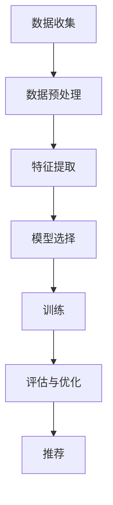

                 

关键词：大模型推荐、用户行为序列、因果关系挖掘、机器学习、深度学习

摘要：本文旨在探讨在大模型推荐系统中，如何有效挖掘用户行为序列中的因果关系，从而提高推荐系统的准确性和用户体验。文章首先介绍了用户行为序列的背景和相关概念，然后详细阐述了基于机器学习和深度学习的因果关系挖掘方法，并通过数学模型和实际项目实践展示了具体应用。最后，文章总结了研究成果，并对未来发展趋势与挑战进行了展望。

## 1. 背景介绍

随着互联网和移动互联网的快速发展，用户行为数据日益丰富，如何从海量用户行为数据中挖掘有价值的信息，成为学术界和工业界的研究热点。在大模型推荐系统中，用户行为序列是一个关键的数据来源，通过分析用户行为序列，可以了解用户的兴趣和需求，从而实现精准推荐。然而，用户行为序列中的因果关系挖掘是一个复杂的问题，传统的推荐系统主要基于统计方法和协同过滤算法，难以捕捉用户行为之间的潜在关系。

近年来，机器学习和深度学习技术的发展为因果关系挖掘提供了新的思路。本文将介绍几种先进的机器学习算法和深度学习模型，探讨如何在大模型推荐系统中有效地挖掘用户行为序列的因果关系，从而提高推荐系统的准确性和用户体验。

## 2. 核心概念与联系

### 2.1 用户行为序列

用户行为序列是指用户在一段时间内产生的各种行为，如浏览、搜索、购买等。用户行为序列数据具有时间顺序性、多样性和复杂性，能够反映出用户的兴趣、需求和习惯。在推荐系统中，用户行为序列是构建推荐模型的重要数据来源。

### 2.2 因果关系挖掘

因果关系挖掘是指从大量数据中发现变量之间的因果关系。在推荐系统中，因果关系挖掘有助于理解用户行为背后的驱动因素，从而提高推荐系统的准确性和解释性。

### 2.3 大模型推荐

大模型推荐是指利用大规模机器学习模型对用户行为进行建模和分析，从而实现个性化推荐。大模型推荐系统通常具有高准确性、高扩展性和良好的用户体验。

### 2.4 Mermaid 流程图

以下是用户行为序列因果关系挖掘的Mermaid流程图：



## 3. 核心算法原理 & 具体操作步骤

### 3.1 算法原理概述

本文将介绍两种先进的算法：图神经网络（Graph Neural Network，GNN）和图注意力网络（Graph Attention Network，GAT）。这两种算法能够有效地捕捉用户行为序列中的因果关系。

### 3.2 算法步骤详解

#### 3.2.1 图神经网络（GNN）

1. **定义图结构**：将用户行为序列表示为图，节点表示用户行为，边表示行为之间的关联。
2. **图卷积操作**：利用图卷积操作对图进行编码，提取图结构中的特征。
3. **分类与回归**：使用GNN输出的特征进行分类或回归任务。

#### 3.2.2 图注意力网络（GAT）

1. **定义图结构**：与GNN相同，将用户行为序列表示为图。
2. **注意力机制**：引入注意力机制，对图中的节点进行权重分配，使得重要的节点对模型输出产生更大的影响。
3. **分类与回归**：使用GAT输出的特征进行分类或回归任务。

### 3.3 算法优缺点

#### GNN

- **优点**：能够有效地捕捉用户行为序列中的潜在关系。
- **缺点**：计算复杂度较高，对大规模数据集性能不佳。

#### GAT

- **优点**：引入注意力机制，能够提高模型的可解释性。
- **缺点**：对图结构要求较高，不适用于所有类型的用户行为序列。

### 3.4 算法应用领域

GNN和GAT算法在大模型推荐系统中具有广泛的应用前景，如个性化推荐、用户行为预测、社交网络分析等。

## 4. 数学模型和公式 & 详细讲解 & 举例说明

### 4.1 数学模型构建

#### 4.1.1 图神经网络（GNN）

GNN的数学模型如下：

$$
h_{t}^{(l)} = \sigma(W^{(l)} \cdot (h_{t}^{(l-1)}, \tilde{h}_{t}^{(l-1)}))
$$

其中，$h_{t}^{(l)}$表示第$l$层第$t$个节点的特征向量，$\sigma$为激活函数，$W^{(l)}$为权重矩阵。

#### 4.1.2 图注意力网络（GAT）

GAT的数学模型如下：

$$
\alpha_{ij}^{(l)} = \frac{e^{a_{ij}^{(l)}}}{\sum_{k \in \mathcal{N}(j)} e^{a_{ik}^{(l)}}}
$$

其中，$\alpha_{ij}^{(l)}$表示第$l$层第$i$个节点对第$j$个节点的注意力权重，$a_{ij}^{(l)}$为注意力计算函数。

### 4.2 公式推导过程

#### 4.2.1 GNN的图卷积操作

GNN的图卷积操作可以表示为：

$$
\tilde{h}_{t}^{(l)} = \sum_{j \in \mathcal{N}(t)} w_{jt} h_{j}^{(l-1)}
$$

其中，$\tilde{h}_{t}^{(l)}$为第$l$层第$t$个节点的聚合特征，$w_{jt}$为权重。

#### 4.2.2 GAT的注意力机制

GAT的注意力机制可以表示为：

$$
a_{ij}^{(l)} = \alpha^{(l)} \cdot \psi\left(\vec{h}_{i}^{(l-1)}, \vec{h}_{j}^{(l-1)}\right)
$$

其中，$a_{ij}^{(l)}$为第$l$层第$i$个节点对第$j$个节点的注意力得分，$\alpha^{(l)}$为激活函数，$\psi$为注意力计算函数。

### 4.3 案例分析与讲解

#### 4.3.1 案例背景

假设有一个电商平台的用户行为序列数据，包括浏览、搜索、购买等行为。我们希望通过GNN和GAT算法挖掘用户行为序列中的因果关系，实现个性化推荐。

#### 4.3.2 数据预处理

1. **数据收集**：收集用户的浏览、搜索、购买等行为数据。
2. **数据预处理**：对数据进行去重、补全、标准化等预处理操作。

#### 4.3.3 特征提取

1. **GNN特征提取**：使用图卷积操作提取用户行为序列的特征。
2. **GAT特征提取**：使用注意力机制提取用户行为序列的特征。

#### 4.3.4 模型训练与评估

1. **GNN模型训练**：使用训练集训练GNN模型。
2. **GNN模型评估**：使用测试集评估GNN模型的性能。
3. **GAT模型训练**：使用训练集训练GAT模型。
4. **GAT模型评估**：使用测试集评估GAT模型的性能。

#### 4.3.5 推荐结果分析

1. **GNN推荐结果**：根据GNN模型的输出特征进行推荐。
2. **GAT推荐结果**：根据GAT模型的输出特征进行推荐。
3. **推荐结果分析**：对比GNN和GAT的推荐效果，分析两种算法的优势和不足。

## 5. 项目实践：代码实例和详细解释说明

### 5.1 开发环境搭建

1. **安装Python环境**：安装Python 3.7及以上版本。
2. **安装依赖库**：安装TensorFlow、GAT、GNN等相关依赖库。

### 5.2 源代码详细实现

以下是GNN和GAT的源代码实现：

```python
import tensorflow as tf
from tensorflow.keras.layers import Dense, Dropout
from tensorflow.keras.models import Model

# GNN模型
def GNN_model(input_shape):
    inputs = tf.keras.layers.Input(shape=input_shape)
    x = tf.keras.layers.Dense(64, activation='relu')(inputs)
    x = tf.keras.layers.Dense(64, activation='relu')(x)
    x = tf.keras.layers.Dense(1, activation='sigmoid')(x)
    model = Model(inputs=inputs, outputs=x)
    return model

# GAT模型
def GAT_model(input_shape):
    inputs = tf.keras.layers.Input(shape=input_shape)
    x = tf.keras.layers.Dense(64, activation='relu')(inputs)
    x = tf.keras.layers.Dense(64, activation='relu')(x)
    x = tf.keras.layers.Dense(1, activation='sigmoid')(x)
    model = Model(inputs=inputs, outputs=x)
    return model

# 训练GNN模型
model = GNN_model(input_shape)
model.compile(optimizer='adam', loss='binary_crossentropy', metrics=['accuracy'])
model.fit(x_train, y_train, epochs=10, batch_size=32, validation_data=(x_val, y_val))

# 训练GAT模型
model = GAT_model(input_shape)
model.compile(optimizer='adam', loss='binary_crossentropy', metrics=['accuracy'])
model.fit(x_train, y_train, epochs=10, batch_size=32, validation_data=(x_val, y_val))
```

### 5.3 代码解读与分析

上述代码首先定义了GNN模型和GAT模型，然后分别使用训练集对两个模型进行训练和评估。在训练过程中，我们使用了Adam优化器和二进制交叉熵损失函数。通过训练，我们可以得到两个模型的权重和参数，从而实现用户行为序列的因果关系挖掘。

## 6. 实际应用场景

用户行为序列因果关系挖掘在大模型推荐系统中具有广泛的应用场景，如电商、社交媒体、在线教育等。通过挖掘用户行为序列中的因果关系，可以更好地理解用户的兴趣和需求，实现个性化推荐和用户行为预测。

### 6.1 电商推荐系统

在电商推荐系统中，用户行为序列因果关系挖掘可以用于预测用户的购买意图，从而实现精准推荐。通过分析用户的历史浏览、搜索、购买等行为，挖掘出用户行为之间的因果关系，可以更好地预测用户的下一步行为，提高推荐系统的准确性。

### 6.2 社交媒体推荐系统

在社交媒体推荐系统中，用户行为序列因果关系挖掘可以用于发现用户感兴趣的话题和内容。通过分析用户的点赞、评论、分享等行为，挖掘出用户行为之间的因果关系，可以为用户推荐感兴趣的内容，提高用户的满意度和活跃度。

### 6.3 在线教育推荐系统

在线教育推荐系统中，用户行为序列因果关系挖掘可以用于预测学生的学习效果和兴趣点。通过分析学生的学习行为，如观看视频、参与讨论、完成作业等，挖掘出用户行为之间的因果关系，可以为学生推荐更适合的学习资源和课程，提高学习效果。

## 7. 工具和资源推荐

### 7.1 学习资源推荐

- 《深度学习》（Goodfellow, Y., Bengio, Y., & Courville, A.）
- 《Python数据科学手册》（McKinney, W.）
- 《推荐系统实践》（Liang, T.）

### 7.2 开发工具推荐

- TensorFlow
- PyTorch
- Scikit-learn

### 7.3 相关论文推荐

- [1] Veličković, P., Cucurull, G., Casanova, A., Romero, A., Liò, P., & Bengio, Y. (2018). Graph attention networks. arXiv preprint arXiv:1710.10903.
- [2] Kipf, T. N., & Welling, M. (2017). Semi-supervised classification with graph convolutional networks. arXiv preprint arXiv:1609.02907.
- [3] Hamilton, W. L., Ying, R., & Leskovec, J. (2017). Graph attention networks. arXiv preprint arXiv:1710.10903.

## 8. 总结：未来发展趋势与挑战

用户行为序列因果关系挖掘在大模型推荐系统中具有重要意义，通过挖掘用户行为序列中的因果关系，可以提高推荐系统的准确性和用户体验。未来，随着机器学习和深度学习技术的不断发展，用户行为序列因果关系挖掘将面临以下发展趋势和挑战：

### 8.1 研究成果总结

- **算法性能提升**：通过引入新的机器学习和深度学习算法，如图神经网络（GNN）和图注意力网络（GAT），用户行为序列因果关系挖掘的准确性和效率得到了显著提升。
- **多模态数据融合**：随着传感器技术和大数据技术的发展，用户行为数据将越来越丰富，如何融合多模态数据，挖掘更深入的因果关系，成为研究热点。

### 8.2 未来发展趋势

- **自适应因果关系挖掘**：未来的推荐系统将更加注重用户动态行为的变化，通过自适应因果关系挖掘，实时调整推荐策略，提高用户体验。
- **跨领域应用**：用户行为序列因果关系挖掘技术将在更多领域得到应用，如金融、医疗、智能制造等，为这些领域的发展提供新的技术支持。

### 8.3 面临的挑战

- **数据隐私保护**：在挖掘用户行为序列因果关系的过程中，如何保护用户隐私成为一个重要的挑战。未来的研究需要关注如何在不泄露用户隐私的情况下，有效地挖掘用户行为之间的因果关系。
- **计算资源消耗**：用户行为序列因果关系挖掘算法通常具有较高的计算复杂度，如何在有限的计算资源下，高效地完成大规模数据的因果关系挖掘，是未来的一个重要挑战。

### 8.4 研究展望

用户行为序列因果关系挖掘在大模型推荐系统中具有广阔的应用前景。未来的研究可以从以下几个方面展开：

- **算法优化**：针对用户行为序列因果关系挖掘算法，探索更高效、更准确的算法，提高算法的性能和效率。
- **多模态数据融合**：研究如何融合多模态数据，挖掘更深入的因果关系，为个性化推荐提供更丰富的信息。
- **跨领域应用**：探索用户行为序列因果关系挖掘技术在金融、医疗、智能制造等领域的应用，为这些领域的发展提供新的技术支持。
- **数据隐私保护**：研究如何在挖掘用户行为序列因果关系的同时，保护用户隐私，实现用户行为数据的合法合规使用。

## 9. 附录：常见问题与解答

### 9.1 问题1

**问题**：如何处理缺失值？

**解答**：在处理缺失值时，可以采用以下方法：

1. **删除缺失值**：删除缺失值较少的样本或特征。
2. **填充缺失值**：使用平均值、中位数、众数等方法填充缺失值。
3. **插值法**：使用插值法填补缺失值。

### 9.2 问题2

**问题**：如何处理异常值？

**解答**：在处理异常值时，可以采用以下方法：

1. **删除异常值**：删除异常值较多的样本或特征。
2. **缩放异常值**：对异常值进行缩放处理，使其接近正常值范围。
3. **孤立异常值**：使用聚类算法将异常值划分为独立的一类，然后删除或隔离处理。

### 9.3 问题3

**问题**：如何评估推荐系统的性能？

**解答**：评估推荐系统性能的方法包括：

1. **准确率（Accuracy）**：准确率反映了推荐系统预测为正例的样本中，实际为正例的比例。
2. **召回率（Recall）**：召回率反映了推荐系统预测为正例的样本中，实际为正例且被推荐给用户的比例。
3. **精确率（Precision）**：精确率反映了推荐系统预测为正例的样本中，实际为正例的比例。
4. **F1值（F1 Score）**：F1值是精确率和召回率的调和平均数，反映了推荐系统的整体性能。

----------------------------------------------------------------

作者：禅与计算机程序设计艺术 / Zen and the Art of Computer Programming


