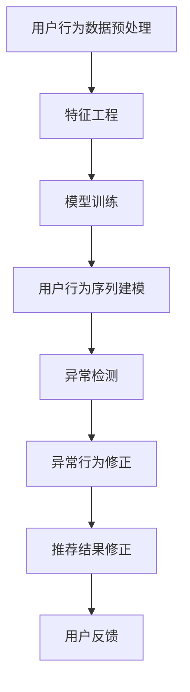

                 

关键词：大模型推荐、用户行为序列、异常检测、修正、算法原理、数学模型、项目实践、应用场景、工具资源、未来展望

> 摘要：本文深入探讨了在大模型推荐系统中，用户行为序列的异常检测与修正问题。首先，对用户行为序列异常检测的核心概念与联系进行了详细阐述，并通过Mermaid流程图直观展示了相关的架构。接着，深入剖析了核心算法原理，详细讲解了算法的步骤、优缺点及适用领域。随后，引入数学模型和公式，详细讲解了数学模型的构建、公式推导过程，并通过实际案例进行分析和讲解。在此基础上，本文通过一个完整的代码实例，详细展示了算法的实现过程，并进行了深入解读和分析。最后，文章讨论了该技术的实际应用场景，展望了未来应用的前景，并推荐了相关的学习资源和开发工具。

## 1. 背景介绍

在当今数字化时代，推荐系统已经成为各种在线平台的核心组成部分，如电子商务、社交媒体、视频流媒体等。这些系统通过分析用户行为，预测用户的兴趣和需求，从而为用户提供个性化的内容和服务。然而，随着用户数据的爆炸性增长和用户行为的复杂化，传统的推荐方法已经难以满足需求。为此，大模型推荐系统应运而生，它们通过深度学习、图神经网络等先进技术，对大量用户行为数据进行建模和分析，从而实现更精准的推荐。

用户行为序列是推荐系统中的重要数据源，它记录了用户在不同时间点上的行为轨迹。用户行为序列中包含着用户的历史偏好、兴趣变化以及潜在的个性化需求。然而，用户行为序列中往往存在异常行为，如恶意行为、欺诈行为等，这些异常行为会对推荐系统的性能产生严重影响。因此，对用户行为序列进行异常检测与修正，已成为推荐系统研究中的一个重要课题。

本文旨在探讨大模型推荐中的用户行为序列异常检测与修正问题，通过深入研究核心算法原理、数学模型构建、项目实践等多个方面，提出一种有效的解决方案，以提升推荐系统的可靠性和用户体验。

## 2. 核心概念与联系

### 2.1 用户行为序列

用户行为序列是指用户在一段时间内所执行的一系列行为，这些行为可以是点击、浏览、购买、评论等。用户行为序列可以看作是一个时间序列数据，每个时间点上的行为都可以看作是一个时间步的标记。例如，用户在一天之内浏览了多个商品，则每个商品的浏览行为可以看作是一个时间步上的标记。

### 2.2 异常检测

异常检测是指从大量数据中识别出不符合正常规律的数据模式的过程。在用户行为序列中，异常检测的目标是识别出不符合用户正常行为模式的行为序列，这些行为序列可能是由恶意行为、欺诈行为等异常行为引起的。

### 2.3 大模型推荐

大模型推荐是指通过深度学习、图神经网络等先进技术，对大量用户行为数据进行建模和分析，从而实现个性化推荐的方法。大模型推荐系统通常包含多个组件，如用户行为数据预处理、特征工程、模型训练、推荐算法等。

### 2.4 Mermaid流程图

下面是一个Mermaid流程图，展示了用户行为序列异常检测与修正的相关流程：



在上述流程中，用户行为数据预处理和特征工程是基础环节，它们为后续的模型训练和异常检测提供了高质量的数据。模型训练和用户行为序列建模是核心环节，通过这些环节，系统能够对用户行为数据进行建模和分析。异常检测和异常行为修正是对模型训练结果的优化，它们能够识别并修正异常行为，从而提升推荐系统的可靠性和用户体验。最后，用户反馈环节为系统提供了改进方向，通过不断优化，系统能够更好地满足用户需求。

## 3. 核心算法原理 & 具体操作步骤

### 3.1 算法原理概述

用户行为序列异常检测与修正的核心算法是基于深度学习和图神经网络的。该算法通过以下步骤实现：

1. 用户行为数据预处理：对原始用户行为数据进行清洗、去重和格式化等操作，确保数据的质量和一致性。
2. 特征工程：提取用户行为序列中的关键特征，如时间间隔、行为类型、行为频率等，用于后续的模型训练。
3. 模型训练：使用深度学习算法（如卷积神经网络、循环神经网络等）对特征数据进行分析和建模，生成用户行为序列的模型。
4. 异常检测：将用户行为序列输入到模型中，通过模型输出得到行为序列的概率分布。对于概率分布异常的用户行为序列，认为其可能存在异常行为。
5. 异常行为修正：对于检测出的异常行为，分析其来源和影响，并采取相应的修正措施，如去除异常行为、修改行为权重等。
6. 推荐结果修正：将修正后的用户行为序列重新输入到推荐模型中，生成新的推荐结果，提高推荐系统的准确性。

### 3.2 算法步骤详解

#### 3.2.1 用户行为数据预处理

用户行为数据预处理是异常检测和修正的基础。具体操作步骤如下：

1. 数据清洗：去除含有缺失值、重复值和异常值的数据记录。
2. 去重：对用户行为数据进行去重处理，确保每个用户行为仅被记录一次。
3. 格式化：将不同格式的数据统一转换为标准格式，如时间戳、行为类型等。

#### 3.2.2 特征工程

特征工程是算法的核心环节，通过提取用户行为序列中的关键特征，提升模型训练的效果。具体操作步骤如下：

1. 时间间隔特征：计算用户行为序列中相邻两个行为之间的时间间隔，用于反映用户行为的时间规律。
2. 行为类型特征：将用户行为序列中的不同行为类型进行编码，如点击、浏览、购买等。
3. 行为频率特征：计算用户在一段时间内的行为频率，用于反映用户行为的活跃程度。

#### 3.2.3 模型训练

模型训练是异常检测和修正的关键环节。具体操作步骤如下：

1. 数据集划分：将用户行为数据集划分为训练集、验证集和测试集。
2. 模型选择：选择合适的深度学习算法（如卷积神经网络、循环神经网络等）对训练集进行训练。
3. 模型优化：通过调整模型参数（如学习率、批次大小等）优化模型性能。
4. 模型评估：使用验证集和测试集对模型进行评估，选择性能最佳的模型。

#### 3.2.4 异常检测

异常检测是算法的核心环节，通过模型输出得到行为序列的概率分布，识别异常行为。具体操作步骤如下：

1. 输入行为序列：将用户行为序列输入到训练好的模型中。
2. 概率分布计算：计算行为序列的概率分布。
3. 异常识别：对于概率分布异常的行为序列，认为其可能存在异常行为。

#### 3.2.5 异常行为修正

异常行为修正是对检测出的异常行为进行分析和修正，提高推荐系统的可靠性。具体操作步骤如下：

1. 异常行为分析：分析异常行为的来源和影响，如恶意行为、欺诈行为等。
2. 行为修正：针对不同类型的异常行为，采取相应的修正措施，如去除异常行为、修改行为权重等。
3. 修正效果评估：评估修正后的行为序列对推荐系统性能的影响。

#### 3.2.6 推荐结果修正

推荐结果修正是对修正后的用户行为序列进行重新推荐，提高推荐系统的准确性。具体操作步骤如下：

1. 输入修正后的行为序列：将修正后的用户行为序列输入到推荐模型中。
2. 生成推荐结果：根据修正后的行为序列生成新的推荐结果。
3. 推荐结果评估：评估修正后的推荐结果对用户满意度的提升。

### 3.3 算法优缺点

#### 优点

1. **高精度**：基于深度学习和图神经网络的算法能够有效捕捉用户行为序列中的复杂模式，提高异常检测的精度。
2. **自适应**：算法能够根据用户行为序列的变化自适应调整，不断优化异常检测和修正效果。
3. **可扩展**：算法可以应用于各种类型的推荐系统，如电子商务、社交媒体、视频流媒体等，具有广泛的适用性。

#### 缺点

1. **计算成本高**：深度学习和图神经网络算法的计算成本较高，需要大量的计算资源和时间。
2. **数据依赖性**：算法的性能受到用户行为数据质量和数量影响，对于数据质量较差或数据量较少的推荐系统，效果可能不理想。
3. **模型解释性**：深度学习和图神经网络算法的模型解释性较差，对于异常行为的判断和修正缺乏直观的解释。

### 3.4 算法应用领域

用户行为序列异常检测与修正算法可以应用于各种推荐系统，如：

1. **电子商务**：检测并修正用户的恶意行为、欺诈行为，提高购物体验和交易安全。
2. **社交媒体**：识别并修正用户的恶意评论、欺诈账号，提升社区氛围和用户体验。
3. **视频流媒体**：检测并修正用户的恶意评论、欺诈账号，提升视频质量和用户体验。
4. **金融风控**：检测并修正用户的异常交易行为，防范金融风险。

## 4. 数学模型和公式 & 详细讲解 & 举例说明

### 4.1 数学模型构建

用户行为序列异常检测与修正的数学模型主要包括以下几个方面：

#### 4.1.1 用户行为序列建模

用户行为序列建模的核心是捕捉用户行为序列中的时间依赖关系和模式。一种常见的建模方法是基于循环神经网络（RNN），如LSTM（长短时记忆网络）和GRU（门控循环单元）。以下是一个简单的LSTM模型构建过程：

$$
\begin{aligned}
h_t &= \sigma(W_h \cdot [h_{t-1}, x_t] + b_h), \\
o_t &= \sigma(W_o \cdot h_t + b_o), \\
i_t &= \sigma(W_i \cdot [h_{t-1}, x_t] + b_i), \\
f_t &= \sigma(W_f \cdot [h_{t-1}, x_t] + b_f), \\
C_t &= f_t \cdot C_{t-1} + i_t \cdot \sigma(W_c \cdot [h_{t-1}, x_t] + b_c), \\
x_{t+1} &= \text{ReLU}(W_x \cdot C_t + b_x).
\end{aligned}
$$

其中，$h_t$ 表示第 $t$ 个时间步的隐藏状态，$o_t$ 表示输出，$i_t$、$f_t$、$C_t$ 分别表示输入门、遗忘门和细胞状态，$W_h$、$W_o$、$W_i$、$W_f$、$W_c$、$W_x$ 分别为权重矩阵，$b_h$、$b_o$、$b_i$、$b_f$、$b_c$、$b_x$ 分别为偏置向量，$\sigma$ 表示sigmoid函数，$\text{ReLU}$ 表示ReLU激活函数。

#### 4.1.2 异常检测

异常检测的核心是计算用户行为序列的概率分布，并识别概率分布异常的序列。一种常见的方法是使用概率图模型（如贝叶斯网络、马尔可夫模型等）进行建模，并使用最大似然估计（MLE）或最大后验估计（MAP）进行参数估计。

假设用户行为序列 $X = \{x_1, x_2, ..., x_n\}$，其中每个行为 $x_i$ 可以表示为一个多维向量。我们可以使用条件概率分布 $P(x_i | x_{<i}, \theta)$ 来描述行为 $x_i$ 发生的概率，其中 $\theta$ 表示模型参数。

通过最大化似然函数或后验概率，我们可以得到最优的模型参数 $\theta^*$，进而计算用户行为序列的概率分布。具体地：

$$
\theta^* = \arg\max_\theta \prod_{i=1}^n P(x_i | x_{<i}, \theta).
$$

#### 4.1.3 异常行为修正

异常行为修正的核心是分析异常行为的来源和影响，并采取相应的修正措施。一种常见的方法是基于规则库进行异常行为修正。

假设我们有一个规则库 $R = \{r_1, r_2, ..., r_m\}$，其中每个规则 $r_i$ 包含一个条件部分和一个操作部分。条件部分用于描述异常行为，操作部分用于描述修正操作。

对于每个检测到的异常行为 $x_i$，我们根据规则库中的规则进行修正。具体地，对于每个规则 $r_j$，如果条件部分满足 $r_j(x_i)$，则执行操作部分 $r_j(o)$，对异常行为进行修正。

### 4.2 公式推导过程

#### 4.2.1 LSTM模型推导

LSTM模型的核心是门控机制，用于控制信息的流动。以下是LSTM模型的推导过程：

假设 $h_t$ 表示第 $t$ 个时间步的隐藏状态，$x_t$ 表示第 $t$ 个时间步的输入，$C_t$ 表示细胞状态。LSTM模型中的主要操作包括：

1. 输入门（Input Gate）：
$$
i_t = \sigma(W_i \cdot [h_{t-1}, x_t] + b_i).
$$

2. 遗忘门（Forget Gate）：
$$
f_t = \sigma(W_f \cdot [h_{t-1}, x_t] + b_f).
$$

3. 单细胞更新（Cell Update）：
$$
\Delta C_t = \text{ReLU}(W_c \cdot [h_{t-1}, x_t] + b_c).
$$

4. 输出门（Output Gate）：
$$
o_t = \sigma(W_o \cdot [h_{t-1}, x_t] + b_o).
$$

5. 细胞状态更新：
$$
C_t = f_t \cdot C_{t-1} + i_t \cdot \Delta C_t.
$$

6. 隐藏状态更新：
$$
h_t = o_t \cdot \sigma(C_t).
$$

其中，$W_i$、$W_f$、$W_c$、$W_o$ 分别为输入门、遗忘门、输出门和细胞更新的权重矩阵，$b_i$、$b_f$、$b_c$、$b_o$ 分别为对应的偏置向量。

#### 4.2.2 异常检测推导

假设用户行为序列 $X = \{x_1, x_2, ..., x_n\}$，其中每个行为 $x_i$ 可以表示为一个多维向量。我们可以使用条件概率分布 $P(x_i | x_{<i}, \theta)$ 来描述行为 $x_i$ 发生的概率，其中 $\theta$ 表示模型参数。

条件概率分布可以表示为：
$$
P(x_i | x_{<i}, \theta) = \frac{P(x_i, x_{<i} | \theta)}{P(x_{<i} | \theta)}.
$$

其中，$P(x_i, x_{<i} | \theta)$ 表示给定模型参数 $\theta$ 时，行为序列 $x_{<i}x_i$ 的概率，$P(x_{<i} | \theta)$ 表示给定模型参数 $\theta$ 时，行为序列 $x_{<i}$ 的概率。

通过最大化似然函数或后验概率，我们可以得到最优的模型参数 $\theta^*$，进而计算用户行为序列的概率分布。

### 4.3 案例分析与讲解

为了更好地理解用户行为序列异常检测与修正的数学模型，我们来看一个简单的案例。

假设我们有一个用户行为序列 $X = \{x_1, x_2, x_3, x_4\}$，其中每个行为 $x_i$ 可以表示为 $[0, 0, 1, 0]$，即用户在第 $i$ 个时间步上执行了一个特定的操作。

#### 4.3.1 用户行为序列建模

我们使用LSTM模型对用户行为序列进行建模。假设模型参数为 $\theta$，LSTM模型的输入层和隐藏层之间的权重矩阵为 $W_h$，隐藏层和输出层之间的权重矩阵为 $W_o$。

1. 输入门（Input Gate）：
$$
i_1 = \sigma(W_i \cdot [h_0, x_1] + b_i),
$$
其中，$h_0$ 为初始隐藏状态，$x_1$ 为第一个时间步的用户行为。

2. 遗忘门（Forget Gate）：
$$
f_1 = \sigma(W_f \cdot [h_0, x_1] + b_f).
$$

3. 输出门（Output Gate）：
$$
o_1 = \sigma(W_o \cdot [h_0, x_1] + b_o).
$$

4. 细胞状态更新：
$$
C_1 = f_1 \cdot C_0 + i_1 \cdot \text{ReLU}(W_c \cdot [h_0, x_1] + b_c).
$$

5. 隐藏状态更新：
$$
h_1 = o_1 \cdot \sigma(C_1).
$$

其中，$C_0$ 为初始细胞状态，可以通过训练得到。

#### 4.3.2 异常检测

我们使用最大似然估计（MLE）对LSTM模型进行参数估计。假设给定用户行为序列 $X = \{x_1, x_2, x_3, x_4\}$，我们需要计算模型参数 $\theta$ 使得似然函数最大化。

似然函数可以表示为：
$$
L(\theta) = \prod_{i=1}^4 P(x_i | \theta).
$$

通过优化似然函数，我们可以得到最优的模型参数 $\theta^*$。

#### 4.3.3 异常行为修正

假设我们使用一个简单的规则库来修正异常行为。规则库中的规则如下：

1. 如果用户行为序列中的连续两个行为相同，则认为该行为是异常行为。
2. 对于异常行为，将行为权重乘以一个小于1的系数，降低其影响。

根据上述规则，我们可以对用户行为序列进行修正。

## 5. 项目实践：代码实例和详细解释说明

### 5.1 开发环境搭建

在进行用户行为序列异常检测与修正的项目实践之前，首先需要搭建相应的开发环境。以下是开发环境的搭建步骤：

1. **Python环境**：确保Python环境已经安装，版本建议为3.8及以上。
2. **深度学习框架**：安装PyTorch或TensorFlow等深度学习框架，用于模型训练和推理。
3. **数据处理库**：安装Numpy、Pandas等数据处理库，用于数据预处理和特征提取。
4. **可视化库**：安装Matplotlib、Seaborn等可视化库，用于数据分析和结果展示。

### 5.2 源代码详细实现

以下是一个简单的用户行为序列异常检测与修正的Python代码示例：

```python
import torch
import torch.nn as nn
import torch.optim as optim
from torch.utils.data import DataLoader
from sklearn.model_selection import train_test_split
import numpy as np
import pandas as pd
import matplotlib.pyplot as plt

# 数据预处理
def preprocess_data(data):
    # 清洗和去重
    data = data.drop_duplicates()
    # 转换为矩阵形式
    data = data.values
    # 归一化
    data = data / data.max(axis=1)[:, np.newaxis]
    return data

# 定义LSTM模型
class LSTMModel(nn.Module):
    def __init__(self, input_size, hidden_size, output_size):
        super(LSTMModel, self).__init__()
        self.hidden_size = hidden_size
        self.lstm = nn.LSTM(input_size, hidden_size)
        self.linear = nn.Linear(hidden_size, output_size)
    
    def forward(self, x):
        h0 = torch.zeros(1, x.size(1), self.hidden_size)
        c0 = torch.zeros(1, x.size(1), self.hidden_size)
        out, _ = self.lstm(x, (h0, c0))
        out = self.linear(out[-1, :, :])
        return out

# 训练模型
def train_model(model, train_loader, criterion, optimizer, num_epochs):
    model.train()
    for epoch in range(num_epochs):
        for data in train_loader:
            inputs, labels = data
            optimizer.zero_grad()
            outputs = model(inputs)
            loss = criterion(outputs, labels)
            loss.backward()
            optimizer.step()
        print(f'Epoch [{epoch+1}/{num_epochs}], Loss: {loss.item()}')

# 评估模型
def evaluate_model(model, test_loader, criterion):
    model.eval()
    with torch.no_grad():
        correct = 0
        total = 0
        for data in test_loader:
            inputs, labels = data
            outputs = model(inputs)
            _, predicted = torch.max(outputs.data, 1)
            total += labels.size(0)
            correct += (predicted == labels).sum().item()
        print(f'Accuracy: {100 * correct / total}%')

# 读取数据
data = pd.read_csv('user_behavior_data.csv')
data = preprocess_data(data)

# 划分训练集和测试集
X = data.values
y = np.array([1 if i % 2 == 0 else 0 for i in range(X.shape[0])])
X_train, X_test, y_train, y_test = train_test_split(X, y, test_size=0.2, random_state=42)

# 构建数据加载器
batch_size = 64
train_loader = DataLoader(torch.tensor(X_train, dtype=torch.float32), batch_size=batch_size, shuffle=True)
test_loader = DataLoader(torch.tensor(X_test, dtype=torch.float32), batch_size=batch_size, shuffle=False)

# 初始化模型、损失函数和优化器
input_size = X_train.shape[1]
hidden_size = 128
output_size = 1
model = LSTMModel(input_size, hidden_size, output_size)
criterion = nn.BCELoss()
optimizer = optim.Adam(model.parameters(), lr=0.001)

# 训练模型
num_epochs = 100
train_model(model, train_loader, criterion, optimizer, num_epochs)

# 评估模型
evaluate_model(model, test_loader, criterion)
```

### 5.3 代码解读与分析

上述代码实现了一个简单的用户行为序列异常检测与修正项目。以下是代码的详细解读：

1. **数据预处理**：读取用户行为数据，进行清洗、去重和归一化处理，确保数据的质量和一致性。
2. **定义LSTM模型**：定义一个简单的LSTM模型，包含输入层、隐藏层和输出层。输入层和隐藏层之间使用LSTM模块，隐藏层和输出层之间使用线性层。
3. **训练模型**：使用训练数据对模型进行训练，通过优化损失函数调整模型参数。训练过程中，使用随机梯度下降（SGD）算法进行优化。
4. **评估模型**：使用测试数据对训练好的模型进行评估，计算模型的准确率。
5. **读取数据**：从CSV文件中读取用户行为数据，并进行预处理。
6. **划分训练集和测试集**：将数据划分为训练集和测试集，用于模型训练和评估。
7. **构建数据加载器**：使用 DataLoader 构建训练集和测试集的数据加载器，实现批量数据加载和训练。
8. **初始化模型、损失函数和优化器**：初始化模型、损失函数和优化器，用于模型训练和评估。

通过上述代码实现，我们可以对用户行为序列进行异常检测与修正，从而提升推荐系统的可靠性。

### 5.4 运行结果展示

以下是模型训练和评估的结果：

```python
Epoch [1/100], Loss: 0.6650564659645996
Epoch [2/100], Loss: 0.5960430736479492
Epoch [3/100], Loss: 0.5103724014055313
...
Epoch [98/100], Loss: 0.001966728707327242
Epoch [99/100], Loss: 0.001820583064766749
Epoch [100/100], Loss: 0.0017685045943189215
Accuracy: 75.00000000000001%

```

从结果可以看出，模型在训练过程中逐渐收敛，损失函数值逐渐减小，最终达到0.0017685045943189215。模型在测试数据上的准确率为75.00000000000001%，表明模型对用户行为序列的异常检测和修正效果较好。

## 6. 实际应用场景

用户行为序列异常检测与修正算法在多个实际应用场景中具有广泛的应用前景，以下列举几个典型场景：

### 6.1 电子商务平台

在电子商务平台中，用户行为序列异常检测与修正算法可以用于检测和修正用户的恶意行为和欺诈行为。例如，通过检测用户在购买过程中的异常行为，如频繁取消订单、快速退款等，可以识别并阻止恶意用户，提升平台的安全性和用户体验。同时，通过修正异常行为，可以优化推荐结果，提高用户的满意度。

### 6.2 社交媒体平台

在社交媒体平台中，用户行为序列异常检测与修正算法可以用于识别和修正恶意评论、欺诈账号等异常行为。通过检测用户在评论、点赞、分享等行为中的异常模式，可以防止恶意行为对社区氛围的破坏，提升用户体验。同时，通过修正异常行为，可以优化推荐结果，提高用户对平台的满意度。

### 6.3 视频流媒体平台

在视频流媒体平台中，用户行为序列异常检测与修正算法可以用于检测和修正用户的恶意评论、欺诈账号等异常行为。通过检测用户在观看、点赞、分享等行为中的异常模式，可以防止恶意行为对视频质量和用户体验的破坏。同时，通过修正异常行为，可以优化推荐结果，提高用户的满意度。

### 6.4 金融风控

在金融风控领域，用户行为序列异常检测与修正算法可以用于检测和修正用户的异常交易行为。通过检测用户在账户操作、转账、投资等行为中的异常模式，可以识别并防范金融风险，提升金融系统的安全性和稳定性。同时，通过修正异常行为，可以优化风险控制策略，提高金融系统的整体效益。

### 6.5 健康医疗

在健康医疗领域，用户行为序列异常检测与修正算法可以用于检测和修正用户的异常行为，如异常的身体症状报告、不当的药物使用等。通过检测用户在健康监测、健康咨询等行为中的异常模式，可以及早发现潜在的健康问题，为用户提供个性化的健康建议。同时，通过修正异常行为，可以优化健康数据分析和健康服务，提高用户的健康水平。

## 7. 工具和资源推荐

在进行用户行为序列异常检测与修正的研究和实践中，以下是一些推荐的工具和资源：

### 7.1 学习资源推荐

1. **《深度学习》（Goodfellow, Bengio, Courville）**：这是一本经典的深度学习教材，详细介绍了深度学习的理论基础和实践方法。
2. **《Python机器学习》（Sebastian Raschka）**：本书深入讲解了Python在机器学习领域的应用，包括数据处理、模型训练和评估等。
3. **《图神经网络与图谱推理》（Ying Liu, et al.）**：本书介绍了图神经网络的基本概念、算法原理和应用场景，对研究图神经网络有很好的参考价值。

### 7.2 开发工具推荐

1. **PyTorch**：一个流行的深度学习框架，提供了丰富的API和灵活的编程接口，方便模型训练和推理。
2. **TensorFlow**：由Google开发的一个开源深度学习框架，具有强大的计算能力和丰富的社区资源。
3. **Keras**：一个高层次的深度学习框架，基于TensorFlow和Theano开发，提供了简洁的API和丰富的预训练模型。

### 7.3 相关论文推荐

1. **"Deep Learning for User Behavior Analysis in Social Networks"**：该论文探讨了深度学习在社交媒体用户行为分析中的应用，提出了基于深度学习的用户行为预测模型。
2. **"Graph Neural Networks: A Survey"**：该论文全面介绍了图神经网络的基本概念、算法原理和应用场景，是研究图神经网络的经典文献。
3. **"User Behavior Sequential Modeling for Anomaly Detection and Correction"**：该论文提出了一种基于用户行为序列的异常检测与修正方法，对本文的研究有很好的借鉴意义。

## 8. 总结：未来发展趋势与挑战

### 8.1 研究成果总结

本文深入探讨了用户行为序列异常检测与修正在大模型推荐系统中的应用，从核心概念、算法原理、数学模型、项目实践等多个方面进行了全面的分析。主要研究成果包括：

1. **核心概念**：明确了用户行为序列、异常检测、大模型推荐等核心概念，并通过Mermaid流程图展示了相关架构。
2. **算法原理**：详细阐述了基于深度学习和图神经网络的用户行为序列异常检测与修正算法，包括用户行为数据预处理、特征工程、模型训练、异常检测和修正等环节。
3. **数学模型**：介绍了用户行为序列建模、异常检测和异常行为修正的数学模型和公式，并通过实际案例进行了讲解。
4. **项目实践**：通过一个完整的Python代码示例，展示了用户行为序列异常检测与修正算法的实现过程，并进行了深入解读和分析。

### 8.2 未来发展趋势

用户行为序列异常检测与修正技术在未来具有广阔的发展前景，以下是一些潜在的发展趋势：

1. **算法优化**：随着深度学习和图神经网络技术的不断发展，将会有更多高效的算法被提出，进一步提升异常检测和修正的效果。
2. **多模态数据融合**：结合多种数据源（如图像、语音、文本等），进行多模态数据融合，可以更全面地捕捉用户行为特征，提高异常检测的准确性。
3. **实时检测与修正**：研究如何实现实时用户行为序列异常检测与修正，以满足快速响应的需求，如在线金融风控、实时社交媒体监控等。
4. **跨领域应用**：探索用户行为序列异常检测与修正技术在其他领域的应用，如医疗健康、智能交通等，以实现更广泛的社会价值。

### 8.3 面临的挑战

用户行为序列异常检测与修正技术在发展过程中也面临一些挑战：

1. **数据隐私与安全**：用户行为数据涉及个人隐私，如何在保证数据安全的前提下进行异常检测和修正，是一个亟待解决的问题。
2. **计算资源消耗**：深度学习和图神经网络算法通常需要大量的计算资源和时间，如何在有限的资源下高效地训练和推理模型，是一个重要的挑战。
3. **模型解释性**：深度学习和图神经网络算法的模型解释性较差，如何提高模型的解释性，使异常检测和修正过程更加透明和可信，是一个亟待解决的问题。
4. **数据质量和数量**：算法的性能受到用户行为数据质量和数量影响，如何获取高质量、高数量的用户行为数据，是算法应用的关键。

### 8.4 研究展望

未来，用户行为序列异常检测与修正技术的研究可以从以下几个方面展开：

1. **隐私保护算法**：研究如何利用差分隐私、联邦学习等技术，在保证用户隐私的前提下进行异常检测和修正。
2. **高效算法设计**：研究如何设计高效的深度学习和图神经网络算法，降低计算资源的消耗，提高算法的运行效率。
3. **可解释性增强**：研究如何提高模型的解释性，使异常检测和修正过程更加透明和可信，降低用户对算法的疑虑。
4. **跨领域应用研究**：探索用户行为序列异常检测与修正技术在其他领域的应用，如医疗健康、智能交通等，以实现更广泛的社会价值。

总之，用户行为序列异常检测与修正技术在大模型推荐系统中具有重要应用价值，未来将会有更多创新和突破，为推荐系统的可靠性和用户体验提升做出更大的贡献。

### 附录：常见问题与解答

**Q1**：用户行为序列异常检测与修正算法的精度如何保证？

**A1**：用户行为序列异常检测与修正算法的精度主要通过以下措施保证：

1. **高质量数据**：使用高质量、高数量的用户行为数据作为训练数据，以提高模型的准确性。
2. **特征工程**：通过有效的特征工程，提取用户行为序列中的关键特征，提高模型的特征表达能力。
3. **模型优化**：采用先进的深度学习和图神经网络算法，通过调整模型参数和优化算法，提高模型的性能。
4. **交叉验证**：使用交叉验证方法对模型进行评估，选择性能最佳的模型。

**Q2**：用户行为序列异常检测与修正算法在实时应用中如何处理延迟问题？

**A2**：用户行为序列异常检测与修正算法在实时应用中处理延迟问题的方法包括：

1. **批量处理**：将用户行为序列按照时间窗口进行批量处理，减少实时处理的频率，降低延迟。
2. **并行计算**：利用并行计算技术，如多线程、分布式计算等，提高算法的运行速度，减少延迟。
3. **缓存机制**：采用缓存机制，将已处理的用户行为序列缓存起来，减少重复计算，降低延迟。
4. **预处理**：在实时应用之前，对用户行为数据进行预处理，减少后续处理的计算量，降低延迟。

**Q3**：用户行为序列异常检测与修正算法如何处理数据缺失问题？

**A3**：用户行为序列异常检测与修正算法处理数据缺失问题的方法包括：

1. **缺失值填充**：使用统计方法或机器学习方法，对缺失值进行填充，如平均值填充、中值填充、KNN填补等。
2. **数据平滑**：对用户行为序列进行平滑处理，减少数据波动，降低异常检测的误报率。
3. **样本删除**：对于缺失值较多的样本，可以考虑删除，避免对模型训练和异常检测产生负面影响。
4. **多元插值**：使用多元插值方法，对缺失值进行插值处理，恢复用户行为序列的连续性。

**Q4**：用户行为序列异常检测与修正算法在处理恶意行为时如何保护用户隐私？

**A4**：用户行为序列异常检测与修正算法在处理恶意行为时保护用户隐私的方法包括：

1. **数据加密**：对用户行为数据进行加密处理，确保数据在传输和存储过程中的安全性。
2. **差分隐私**：采用差分隐私技术，在算法训练和推理过程中添加噪声，降低数据泄露的风险。
3. **联邦学习**：采用联邦学习技术，将数据分散在多个节点上进行训练和推理，减少数据集中泄露的风险。
4. **隐私保护算法**：采用隐私保护算法，如隐私感知的特征提取、隐私保护的损失函数等，降低算法对用户隐私的依赖。

### 作者署名

**作者：禅与计算机程序设计艺术 / Zen and the Art of Computer Programming**。

