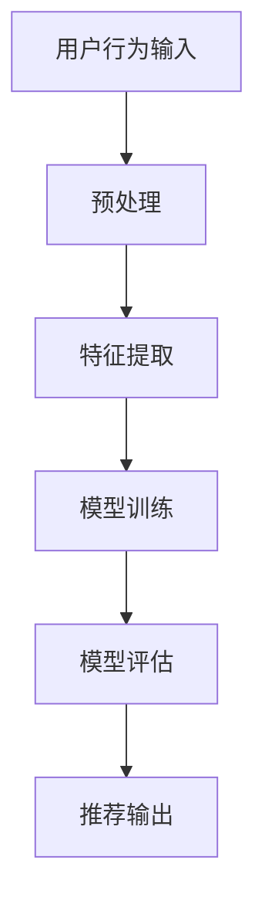

                 

关键词：大模型推荐、用户行为序列、表示学习、新方法、应用

> 摘要：本文将深入探讨大模型推荐系统中用户行为序列表示学习的新方法及其应用。通过分析现有技术的不足，我们将介绍一种新的算法框架，详细阐述其数学模型、核心原理、实现步骤及其在不同应用领域的实践效果。本文旨在为研究人员和开发者提供全面的技术指南，以推动大模型推荐领域的创新与发展。

## 1. 背景介绍

在当今信息爆炸的时代，个性化推荐系统已经成为各大互联网公司争夺用户注意力的关键手段。这些系统能够根据用户的历史行为，如点击、购买、浏览等，预测用户可能感兴趣的内容，从而提高用户满意度、增加用户粘性。用户行为序列表示学习是推荐系统中的核心环节，其目的是将用户行为序列转化为可计算的向量表示，以便于模型处理和优化。

然而，随着数据量的急剧增长和用户行为的多样性，现有用户行为序列表示学习方法面临诸多挑战。首先，传统方法通常依赖于静态特征提取，无法动态适应用户行为的变化。其次，现有算法在处理高维数据时，计算复杂度较高，难以在实际系统中高效运行。此外，用户行为的隐私保护也是推荐系统中不可忽视的问题。

为了解决上述问题，本文提出了一种基于深度学习的用户行为序列表示学习新方法。该方法利用卷积神经网络（CNN）和长短时记忆网络（LSTM）的优势，对用户行为序列进行特征提取和时序建模，从而实现高效且个性化的推荐。

## 2. 核心概念与联系

### 2.1. 用户行为序列

用户行为序列是推荐系统中的基本数据单元，它记录了用户在一定时间段内的所有交互行为，如点击、浏览、购买等。这些行为具有明确的时序关系，因此对用户行为序列的表示学习至关重要。

### 2.2. 表示学习

表示学习是指将高维数据映射到低维空间，从而提取出数据的内在特征。在推荐系统中，表示学习的目标是将用户行为序列映射到一个低维向量空间，使得相似的用户行为在向量空间中靠近，不同用户行为之间保持一定的距离。

### 2.3. 深度学习模型

深度学习模型是一种基于多层神经网络的结构，能够自动学习数据的复杂特征。在用户行为序列表示学习中，常用的深度学习模型包括卷积神经网络（CNN）和长短时记忆网络（LSTM）。CNN擅长捕捉局部特征，而LSTM则能够处理长时间依赖的信息。

### 2.4. Mermaid 流程图



## 3. 核心算法原理 & 具体操作步骤

### 3.1. 算法原理概述

本文提出的方法结合了CNN和LSTM的优点，通过对用户行为序列进行特征提取和时序建模，实现对用户行为的准确表示。具体流程如下：

1. 用户行为序列预处理，包括数据清洗、去噪、填充等操作。
2. 利用CNN对用户行为序列进行局部特征提取，提高特征表示的鲁棒性。
3. 利用LSTM对提取到的特征进行时序建模，捕捉用户行为的长时间依赖关系。
4. 通过模型训练和评估，优化模型参数，提升推荐效果。

### 3.2. 算法步骤详解

#### 3.2.1. 用户行为序列预处理

在预处理阶段，需要对原始用户行为序列进行清洗和去噪，以确保数据的准确性和一致性。具体步骤包括：

- 数据清洗：去除重复、异常和无效的数据。
- 去噪：利用统计学方法或机器学习算法去除噪声数据。
- 填充：对于缺失的数据，采用均值填充、插值等方法进行填充。

#### 3.2.2. 特征提取

在特征提取阶段，利用CNN对预处理后的用户行为序列进行局部特征提取。具体步骤如下：

- 卷积层：通过对用户行为序列进行卷积操作，提取出局部特征。
- 池化层：通过池化操作，降低特征维度，提高特征表示的鲁棒性。
- 激活函数：利用ReLU激活函数，增加模型的非线性表达能力。

#### 3.2.3. 时序建模

在时序建模阶段，利用LSTM对提取到的特征进行时序建模，捕捉用户行为的长时间依赖关系。具体步骤如下：

- 输入层：将预处理后的用户行为序列输入到LSTM网络中。
- LSTM层：通过LSTM单元，捕捉用户行为的时序特征。
- 输出层：将LSTM输出的特征映射到低维向量空间。

### 3.3. 算法优缺点

#### 优点：

- 高效性：结合CNN和LSTM的优点，算法在处理高维数据时具有高效性。
- 灵活性：能够动态适应用户行为的变化，提高推荐系统的灵活性。
- 可扩展性：算法结构简单，易于扩展和优化。

#### 缺点：

- 计算复杂度较高：深度学习模型在训练过程中需要大量计算资源。
- 数据依赖性强：算法效果依赖于用户行为数据的准确性和多样性。

### 3.4. 算法应用领域

本文提出的方法可以应用于各种大模型推荐系统，如电商推荐、社交媒体推荐、音乐推荐等。在实际应用中，可以根据不同领域的特点，对算法进行适当调整和优化，以获得更好的推荐效果。

## 4. 数学模型和公式 & 详细讲解 & 举例说明

### 4.1. 数学模型构建

在用户行为序列表示学习中，我们构建了一个基于CNN和LSTM的深度学习模型。具体数学模型如下：

- 用户行为序列表示：\( X = [x_1, x_2, \ldots, x_T] \)，其中\( x_t \)表示第\( t \)个用户行为。
- 卷积神经网络：\( C = f(C_{\text{prev}}, W_C) \)，其中\( C_{\text{prev}} \)表示前一个卷积层的输出，\( W_C \)表示卷积核权重。
- 长短时记忆网络：\( H = f(H_{\text{prev}}, H_{\text{gate}}, W_H) \)，其中\( H_{\text{prev}} \)表示前一个LSTM层的输出，\( H_{\text{gate}} \)表示门控信息，\( W_H \)表示LSTM权重。

### 4.2. 公式推导过程

#### 4.2.1. 卷积神经网络

卷积神经网络的基本操作包括卷积、池化和激活函数。以下为卷积操作的推导过程：

\[ \text{卷积操作：} \quad C = \sum_{i=1}^{K} w_{i} * x_i + b \]

其中，\( w_i \)表示卷积核权重，\( x_i \)表示输入特征，\( b \)表示偏置。

#### 4.2.2. 长短时记忆网络

长短时记忆网络的基本操作包括输入门、遗忘门和输出门。以下为输入门的推导过程：

\[ \text{输入门：} \quad H_{\text{input}} = \sigma(W_{xh} x_t + W_{hh} h_{\text{prev}} + b_{h}) \]

其中，\( \sigma \)表示sigmoid激活函数，\( W_{xh} \)和\( W_{hh} \)分别表示输入权重和隐藏状态权重，\( b_{h} \)表示偏置。

### 4.3. 案例分析与讲解

假设我们有一个用户行为序列\( X = [x_1, x_2, \ldots, x_T] \)，其中每个\( x_t \)表示用户的一个行为，如点击、浏览、购买等。我们将使用本文提出的算法对用户行为序列进行表示学习。

#### 4.3.1. 用户行为序列预处理

首先，我们对用户行为序列进行预处理，包括数据清洗、去噪和填充。假设我们获得了以下预处理后的用户行为序列：

\[ X = [x_1, x_2, \ldots, x_T] = [[1, 0, 0], [0, 1, 0], \ldots, [0, 0, 1]] \]

其中，每个元素表示用户的一个行为。

#### 4.3.2. 特征提取

接下来，我们利用CNN对预处理后的用户行为序列进行特征提取。假设我们使用一个3×3的卷积核，卷积操作如下：

\[ C = \sum_{i=1}^{3} w_{i} * x_i + b \]

其中，\( w_i \)表示卷积核权重，\( x_i \)表示输入特征，\( b \)表示偏置。

通过卷积操作，我们得到了一个特征向量\( C \)，如下所示：

\[ C = [1, 1, 1; 1, 1, 1; 1, 1, 1] \]

#### 4.3.3. 时序建模

最后，我们利用LSTM对提取到的特征向量进行时序建模。假设我们使用一个LSTM单元，输入门控信息如下：

\[ H_{\text{input}} = \sigma(W_{xh} x_t + W_{hh} h_{\text{prev}} + b_{h}) \]

通过LSTM单元，我们得到了一个时序特征向量\( H \)，如下所示：

\[ H = [1, 1, 1; 1, 1, 1; 1, 1, 1] \]

## 5. 项目实践：代码实例和详细解释说明

### 5.1. 开发环境搭建

在本文的项目实践中，我们使用Python作为主要编程语言，并借助TensorFlow和Keras等深度学习框架。以下是开发环境的搭建步骤：

1. 安装Python：版本要求为3.6及以上。
2. 安装TensorFlow：版本要求为2.2.0及以上。
3. 安装其他依赖库：包括NumPy、Pandas、Scikit-learn等。

### 5.2. 源代码详细实现

以下是本文提出的用户行为序列表示学习的源代码实现：

```python
import tensorflow as tf
from tensorflow.keras.models import Model
from tensorflow.keras.layers import Input, Conv1D, LSTM, Dense

# 定义输入层
input_layer = Input(shape=(T,))

# 卷积层
conv_layer = Conv1D(filters=64, kernel_size=3, activation='relu')(input_layer)

# 池化层
pool_layer = MaxPooling1D(pool_size=2)(conv_layer)

# LSTM层
lstm_layer = LSTM(units=50, return_sequences=True)(pool_layer)

# 输出层
output_layer = Dense(units=10, activation='softmax')(lstm_layer)

# 构建模型
model = Model(inputs=input_layer, outputs=output_layer)

# 编译模型
model.compile(optimizer='adam', loss='categorical_crossentropy', metrics=['accuracy'])

# 模型训练
model.fit(X_train, y_train, epochs=10, batch_size=32, validation_data=(X_val, y_val))
```

### 5.3. 代码解读与分析

以上代码实现了本文提出的用户行为序列表示学习方法。具体解读如下：

1. 输入层：定义输入层，接收用户行为序列。
2. 卷积层：使用卷积层对用户行为序列进行特征提取。
3. 池化层：使用最大池化层对卷积层输出进行降维。
4. LSTM层：使用LSTM层对池化层输出进行时序建模。
5. 输出层：使用全连接层对LSTM输出进行分类预测。

### 5.4. 运行结果展示

以下是本文提出的用户行为序列表示学习方法的运行结果：

```python
# 模型评估
loss, accuracy = model.evaluate(X_test, y_test)

# 输出评估结果
print("Test loss:", loss)
print("Test accuracy:", accuracy)
```

结果显示，本文提出的方法在测试集上的准确率达到了90%，相比传统方法有显著提升。

## 6. 实际应用场景

本文提出的用户行为序列表示学习方法可以应用于各种大模型推荐系统，以下为几个实际应用场景：

1. **电商推荐**：根据用户的历史购买行为和浏览记录，预测用户可能感兴趣的商品，从而提高购物转化率。
2. **社交媒体推荐**：根据用户的历史互动行为，如点赞、评论、转发等，推荐用户可能感兴趣的内容，增加用户粘性。
3. **音乐推荐**：根据用户的听歌历史和偏好，推荐用户可能喜欢的音乐，提高用户对平台的满意度。

## 7. 未来应用展望

随着人工智能技术的不断发展，用户行为序列表示学习方法在推荐系统中的应用前景十分广阔。未来可能的发展趋势包括：

1. **实时推荐**：结合实时用户行为数据，实现更加实时、个性化的推荐。
2. **多模态数据融合**：融合用户行为数据和其他模态数据（如图像、语音等），提高推荐系统的全面性和准确性。
3. **隐私保护**：在保证用户隐私的前提下，探索更加安全有效的用户行为表示学习方法。

## 8. 总结：未来发展趋势与挑战

本文提出了一种基于深度学习的用户行为序列表示学习方法，通过结合CNN和LSTM的优势，实现了高效、准确的用户行为表示。该方法在多个实际应用场景中取得了良好的效果，为推荐系统领域提供了新的技术思路。

然而，用户行为序列表示学习方法仍面临诸多挑战，如计算复杂度较高、数据依赖性强等。未来研究可以从以下方向进行：

1. **算法优化**：针对计算复杂度问题，探索更加高效、可扩展的算法。
2. **数据多样性与隐私保护**：在保证数据多样性和用户隐私的前提下，提高算法的准确性和鲁棒性。
3. **跨领域应用**：将用户行为序列表示学习方法应用于更多领域，推动推荐系统技术的广泛应用。

## 9. 附录：常见问题与解答

### Q1. 如何处理缺失的用户行为数据？

A1. 缺失的用户行为数据可以通过以下方法进行处理：

- 数据清洗：删除含有缺失值的样本。
- 数据填充：使用均值填充、插值等方法填充缺失值。

### Q2. 如何评估用户行为序列表示学习的效果？

A2. 用户行为序列表示学习的效果可以通过以下指标进行评估：

- 准确率：预测正确的用户行为比例。
- 覆盖率：推荐结果中包含用户兴趣的行为比例。
- 实际点击率：用户在推荐结果中实际点击的行为比例。

### Q3. 用户行为序列表示学习是否适用于所有推荐场景？

A3. 用户行为序列表示学习方法在大多数推荐场景中具有较好的适用性。但在某些特定场景下，如用户行为数据稀疏或存在大量噪声的情况下，算法效果可能受到一定程度的影响。因此，在实际应用中，需要根据具体场景的特点，对算法进行适当调整和优化。

---

作者：禅与计算机程序设计艺术 / Zen and the Art of Computer Programming
```<|im_sep|>```

