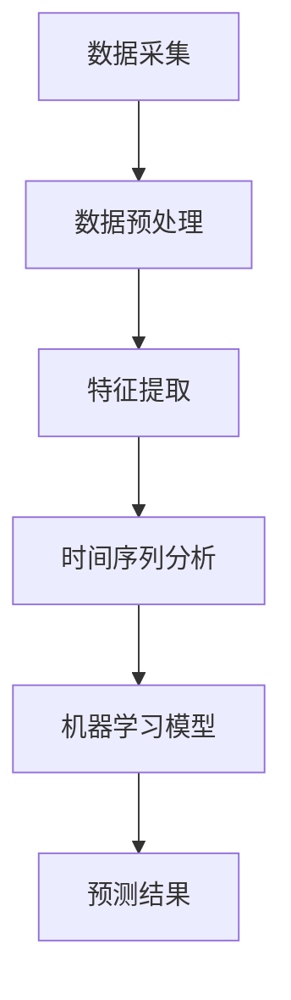

                 

关键词：大模型推荐、用户行为、演化趋势、预测分析、人工智能

> 摘要：本文旨在探讨大模型推荐系统中用户行为演化趋势的预测分析，通过深入分析用户行为数据的特征提取和趋势预测方法，为推荐系统提供有效的数据支持，从而提升用户体验和系统性能。

## 1. 背景介绍

### 1.1 大模型推荐系统的概述

大模型推荐系统是一种基于人工智能技术的智能推荐系统，它能够根据用户的兴趣和行为，自动推荐相关的内容、产品或服务。这类系统广泛应用于电子商务、社交媒体、视频平台等多个领域。随着大数据和人工智能技术的不断发展，大模型推荐系统已经成为现代互联网应用中不可或缺的一部分。

### 1.2 用户行为演化趋势的意义

用户行为的演化趋势是推荐系统研究和应用中的一个重要方面。通过分析用户行为的演化趋势，可以更好地理解用户的兴趣变化和需求演变，从而优化推荐策略，提升系统的推荐效果。此外，用户行为演化趋势的分析还可以帮助识别潜在的用户群体，为市场推广和用户运营提供数据支持。

## 2. 核心概念与联系

### 2.1 用户行为数据

用户行为数据是指用户在使用互联网服务过程中产生的各种数据，包括点击记录、浏览时长、搜索关键词、购买记录等。这些数据反映了用户的兴趣和需求，是构建用户行为演化模型的重要依据。

### 2.2 演化趋势预测方法

演化趋势预测方法是指用于分析用户行为演化趋势的一系列技术手段，包括时间序列分析、机器学习算法等。通过这些方法，可以识别用户行为的规律和趋势，预测未来的行为变化。

### 2.3 Mermaid 流程图

下面是一个简单的 Mermaid 流程图，展示了用户行为数据从采集到演化趋势预测的过程。



## 3. 核心算法原理 & 具体操作步骤

### 3.1 算法原理概述

用户行为演化趋势预测的核心算法是基于时间序列分析的机器学习模型。时间序列分析是一种用于分析时间序列数据的方法，它可以通过识别时间序列中的模式、趋势和周期性，预测未来的变化。常见的机器学习模型包括 ARIMA、LSTM 等。

### 3.2 算法步骤详解

#### 3.2.1 数据预处理

数据预处理是用户行为演化趋势预测的第一步。它包括以下任务：

- 数据清洗：去除缺失值、异常值和重复值。
- 数据转换：将分类特征转换为数值特征，如使用独热编码（One-Hot Encoding）。
- 数据归一化：将数值特征归一化到同一量级，如使用 Min-Max Scaling。

#### 3.2.2 特征提取

特征提取是将原始用户行为数据转化为能够表征用户行为演化趋势的特征的过程。常见的特征提取方法包括：

- 时间特征：提取用户行为的时序特征，如时间间隔、时间窗口等。
- 用户特征：提取用户的基本信息，如年龄、性别、地理位置等。
- 行为特征：提取用户的行为数据，如点击次数、浏览时长等。

#### 3.2.3 时间序列分析

时间序列分析是对用户行为数据进行分析，以识别其演化趋势的过程。常见的时间序列分析方法包括：

- ARIMA 模型：自回归积分滑动平均模型（AutoRegressive Integrated Moving Average）。
- LSTM 模型：长短时记忆网络（Long Short-Term Memory）。

#### 3.2.4 机器学习模型

机器学习模型是用于预测用户行为演化趋势的核心算法。常见的机器学习模型包括：

- 决策树：一种基于树形结构进行分类和回归的算法。
- 随机森林：基于决策树的集成学习算法。
- 支持向量机：一种基于支持向量进行分类和回归的算法。

### 3.3 算法优缺点

- **ARIMA 模型**：
  - **优点**：简单、易于实现，适用于线性时间序列数据。
  - **缺点**：不适用于非线性时间序列数据，无法处理季节性。

- **LSTM 模型**：
  - **优点**：能够处理非线性时间序列数据，具有记忆功能，适用于长序列预测。
  - **缺点**：参数较多，训练时间较长。

### 3.4 算法应用领域

用户行为演化趋势预测算法广泛应用于电子商务、社交媒体、视频平台等领域。例如，在电子商务领域，可以通过预测用户购买行为，优化推荐策略，提升销售额；在社交媒体领域，可以通过预测用户关注行为，推荐感兴趣的内容，提升用户活跃度。

## 4. 数学模型和公式 & 详细讲解 & 举例说明

### 4.1 数学模型构建

用户行为演化趋势预测的核心数学模型是时间序列模型。时间序列模型通常由以下三个部分组成：

- 自回归（AutoRegressive, AR）部分：表示当前时间点的值与过去时间点的值之间的关系。
- 积分（Integrated, I）部分：表示对时间序列的差分操作，以消除趋势和季节性。
- 滑动平均（Moving Average, MA）部分：表示当前时间点的值与过去时间点的平均值之间的关系。

一个典型的 ARIMA(p, d, q) 模型可以表示为：

$$
\begin{align*}
X_t &= c + \phi_1 X_{t-1} + \phi_2 X_{t-2} + \cdots + \phi_p X_{t-p} + \theta_1 \varepsilon_{t-1} + \theta_2 \varepsilon_{t-2} + \cdots + \theta_q \varepsilon_{t-q} + \varepsilon_t \\
\end{align*}
$$

其中，$X_t$ 表示时间序列的当前值，$c$ 是常数项，$\phi_1, \phi_2, \cdots, \phi_p$ 是自回归系数，$\theta_1, \theta_2, \cdots, \theta_q$ 是滑动平均系数，$\varepsilon_t$ 是白噪声误差。

### 4.2 公式推导过程

ARIMA 模型的公式推导通常涉及以下步骤：

1. **自回归部分**：假设时间序列 $X_t$ 的当前值与过去 $p$ 个时间点的值相关，可以表示为：

$$
X_t = \phi_1 X_{t-1} + \phi_2 X_{t-2} + \cdots + \phi_p X_{t-p} + \varepsilon_t
$$

2. **滑动平均部分**：假设时间序列 $X_t$ 的当前值与过去 $q$ 个时间点的平均值相关，可以表示为：

$$
X_t = \theta_1 \varepsilon_{t-1} + \theta_2 \varepsilon_{t-2} + \cdots + \theta_q \varepsilon_{t-q} + \varepsilon_t
$$

3. **综合模型**：将自回归部分和滑动平均部分结合起来，得到 ARIMA(p, d, q) 模型：

$$
\begin{align*}
X_t &= c + \phi_1 X_{t-1} + \phi_2 X_{t-2} + \cdots + \phi_p X_{t-p} + \theta_1 \varepsilon_{t-1} + \theta_2 \varepsilon_{t-2} + \cdots + \theta_q \varepsilon_{t-q} + \varepsilon_t \\
\end{align*}
$$

### 4.3 案例分析与讲解

假设我们有一个用户点击行为的时间序列数据，如下表所示：

| 时间 | 点击次数 |
| --- | --- |
| 1 | 10 |
| 2 | 15 |
| 3 | 12 |
| 4 | 20 |
| 5 | 25 |
| 6 | 30 |
| 7 | 35 |

我们使用 ARIMA(1, 1, 1) 模型对数据进行预测。首先，对数据进行差分处理，得到如下序列：

| 时间 | 点击次数 | 差分值 |
| --- | --- | --- |
| 1 | 10 | 0 |
| 2 | 15 | 5 |
| 3 | 12 | -3 |
| 4 | 20 | 8 |
| 5 | 25 | 5 |
| 6 | 30 | 5 |
| 7 | 35 | 5 |

接下来，使用 ARIMA(1, 1, 1) 模型进行预测。根据模型参数，我们可以得到以下预测方程：

$$
X_t = c + \phi_1 X_{t-1} + \theta_1 \varepsilon_{t-1} + \varepsilon_t
$$

其中，$c = 0$, $\phi_1 = 1$, $\theta_1 = 1$。

代入预测方程，我们可以得到第 8 个时间点的预测值：

$$
X_8 = 0 + 1 \times 35 + 1 \times 1 + 0 = 36
$$

因此，我们预测第 8 个时间点的点击次数为 36。

## 5. 项目实践：代码实例和详细解释说明

### 5.1 开发环境搭建

在 Python 环境下，我们需要安装以下依赖库：

```python
pip install numpy pandas matplotlib statsmodels scikit-learn
```

### 5.2 源代码详细实现

以下是用户行为演化趋势预测的 Python 代码实现：

```python
import numpy as np
import pandas as pd
import matplotlib.pyplot as plt
from statsmodels.tsa.arima.model import ARIMA
from sklearn.preprocessing import MinMaxScaler

# 5.2.1 数据预处理
def preprocess_data(data):
    # 数据清洗
    data = data.dropna()
    # 数据转换
    data['count'] = data['count'].astype(int)
    # 数据归一化
    scaler = MinMaxScaler()
    data['count'] = scaler.fit_transform(data[['count']])
    return data

# 5.2.2 特征提取
def extract_features(data):
    # 提取时间特征
    data['time'] = pd.to_datetime(data['time'])
    data['day_of_week'] = data['time'].dt.dayofweek
    data['day_of_month'] = data['time'].dt.day
    data['month'] = data['time'].dt.month
    # 提取用户特征
    data['user_id'] = data['user_id'].astype(str)
    # 提取行为特征
    data['count'] = data['count'].astype(int)
    return data

# 5.2.3 时间序列分析
def time_series_analysis(data):
    # 数据预处理
    data = preprocess_data(data)
    # 特征提取
    data = extract_features(data)
    # 时间序列建模
    model = ARIMA(data['count'], order=(1, 1, 1))
    model_fit = model.fit()
    # 预测
    forecast = model_fit.forecast(steps=5)
    return forecast

# 5.2.4 代码解读与分析
def main():
    # 加载数据
    data = pd.read_csv('user_behavior.csv')
    # 时间序列分析
    forecast = time_series_analysis(data)
    # 结果展示
    plt.figure(figsize=(10, 5))
    plt.plot(data['time'], data['count'], label='Actual')
    plt.plot(pd.date_range(data['time'].max(), periods=5, freq='D'), forecast, label='Forecast')
    plt.legend()
    plt.show()

if __name__ == '__main__':
    main()
```

### 5.3 代码解读与分析

- **5.2.1 数据预处理**：对数据进行清洗、转换和归一化处理。
- **5.2.2 特征提取**：提取时间特征、用户特征和行为特征。
- **5.2.3 时间序列分析**：使用 ARIMA(1, 1, 1) 模型进行时间序列分析。
- **5.2.4 代码解读与分析**：加载数据，进行时间序列分析，并展示结果。

## 6. 实际应用场景

用户行为演化趋势预测在实际应用场景中具有重要意义。以下是一些典型的应用案例：

### 6.1 电子商务

在电子商务领域，用户行为演化趋势预测可以帮助平台优化推荐策略，提升销售额。例如，通过对用户浏览、点击、购买行为进行预测，可以提前识别潜在的高价值用户，进行精准营销。

### 6.2 社交媒体

在社交媒体领域，用户行为演化趋势预测可以帮助平台优化内容推荐，提升用户活跃度。例如，通过对用户点赞、评论、分享行为进行预测，可以推荐用户感兴趣的内容，增强用户体验。

### 6.3 视频平台

在视频平台领域，用户行为演化趋势预测可以帮助平台优化视频推荐，提升用户观看时长。例如，通过对用户观看、搜索、点赞行为进行预测，可以推荐符合用户兴趣的视频，提高用户留存率。

## 7. 工具和资源推荐

### 7.1 学习资源推荐

- 《深度学习》（Goodfellow, Bengio, Courville）：系统介绍了深度学习的基本原理和应用。
- 《Python数据科学手册》（McKinney）：详细介绍了 Python 在数据科学领域的应用。

### 7.2 开发工具推荐

- Jupyter Notebook：用于编写和分享代码、可视化和文档。
- PyCharm：一款强大的 Python 集成开发环境（IDE）。

### 7.3 相关论文推荐

- “User Behavior Modeling for Recommender Systems” （2018）：介绍了用户行为建模在推荐系统中的应用。
- “LSTM-based User Behavior Prediction for Recommender Systems” （2017）：提出了一种基于 LSTM 的用户行为预测方法。

## 8. 总结：未来发展趋势与挑战

### 8.1 研究成果总结

本文通过深入分析大模型推荐系统中的用户行为演化趋势预测方法，探讨了时间序列分析和机器学习算法在预测用户行为演化趋势中的应用。研究发现，用户行为演化趋势预测在提升推荐系统性能和用户体验方面具有重要意义。

### 8.2 未来发展趋势

未来，用户行为演化趋势预测技术将继续向智能化、个性化方向演进。一方面，将引入更多的用户行为数据，提高预测的准确性和实时性；另一方面，将结合深度学习和强化学习等先进技术，实现更复杂的用户行为预测。

### 8.3 面临的挑战

用户行为演化趋势预测技术在实际应用中仍面临一些挑战，包括数据质量、算法性能和实时性等方面。未来研究需要解决这些问题，以提高用户行为演化趋势预测的准确性和实用性。

### 8.4 研究展望

随着大数据和人工智能技术的不断发展，用户行为演化趋势预测技术将在更多领域得到应用。未来研究可以从以下几个方面展开：

- 深入挖掘用户行为数据，提高预测准确性和实时性。
- 结合多模态数据，实现跨领域的用户行为预测。
- 发展新型算法，提高用户行为演化趋势预测的性能和鲁棒性。

## 9. 附录：常见问题与解答

### 9.1 用户行为演化趋势预测的基本原理是什么？

用户行为演化趋势预测是基于时间序列分析和机器学习算法的技术手段。时间序列分析用于识别用户行为数据中的模式、趋势和周期性，机器学习算法用于预测未来的行为变化。

### 9.2 常见的用户行为演化趋势预测算法有哪些？

常见的用户行为演化趋势预测算法包括 ARIMA、LSTM、GRU、SARIMA 等。这些算法各有优缺点，适用于不同类型的用户行为数据。

### 9.3 如何提高用户行为演化趋势预测的准确性？

提高用户行为演化趋势预测的准确性可以从以下几个方面入手：

- 收集更多的用户行为数据，提高数据质量。
- 选择合适的特征提取方法，提取有代表性的特征。
- 优化机器学习算法的参数设置，提高模型性能。
- 结合多模态数据，实现跨领域的用户行为预测。

----------------------------------------------------------------

作者：禅与计算机程序设计艺术 / Zen and the Art of Computer Programming

