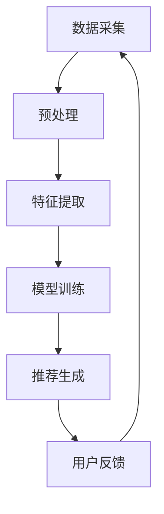

                 

关键词：大模型推荐系统、人工智能、算法原理、数学模型、应用实践、未来展望

> 摘要：随着人工智能技术的快速发展，大模型推荐系统已经成为现代互联网服务的关键组成部分。本文将深入探讨大模型推荐系统的发展趋势，包括核心概念、算法原理、数学模型、应用实践以及未来展望，旨在为读者提供全面的技术洞察。

## 1. 背景介绍

在当今的互联网时代，推荐系统已经成为信息过滤和个性化服务的重要工具。早期的推荐系统主要依赖于基于内容的过滤和协同过滤算法。然而，随着数据量的急剧增长和用户需求的多样化，传统的推荐系统逐渐暴露出准确性和实时性不足的问题。

大模型推荐系统应运而生。它利用深度学习、自然语言处理等技术，构建出可以自主学习、自我优化的复杂模型。这些大模型能够从海量数据中提取特征，并基于用户行为和偏好进行精准推荐，从而大大提升了推荐系统的性能和用户体验。

## 2. 核心概念与联系

### 2.1 大模型推荐系统的基本原理

大模型推荐系统的核心是构建一个可以处理大规模数据、具备强大学习能力的人工智能模型。这个模型通过以下几个关键环节实现推荐：

- **数据采集与预处理**：从各种数据源中收集用户行为数据、内容数据等，并进行清洗、去重、格式化等预处理操作。
- **特征提取**：通过深度学习技术从原始数据中提取出高维的、具有区分度的特征向量。
- **模型训练**：使用特征向量训练推荐模型，使其能够学习用户的行为模式和偏好。
- **推荐生成**：根据用户当前的偏好和行为，使用训练好的模型生成个性化推荐。

### 2.2 Mermaid 流程图

下面是一个简化的大模型推荐系统的 Mermaid 流程图：



## 3. 核心算法原理 & 具体操作步骤

### 3.1 算法原理概述

大模型推荐系统的核心算法主要依赖于深度学习技术，尤其是基于注意力机制的 Transformer 模型和自注意力（self-attention）机制。

Transformer 模型通过多头注意力机制（multi-head attention）和位置编码（positional encoding）等技术，能够捕捉数据中的长距离依赖关系，从而实现精准的推荐。

### 3.2 算法步骤详解

1. **数据采集与预处理**：从不同的数据源中采集用户行为数据、内容数据等，然后进行清洗、去重、格式化等预处理操作。
2. **特征提取**：使用深度学习模型从预处理后的数据中提取高维的、具有区分度的特征向量。
3. **模型训练**：将提取的特征向量输入到 Transformer 模型中进行训练，使其能够学习用户的行为模式和偏好。
4. **推荐生成**：根据用户当前的偏好和行为，使用训练好的 Transformer 模型生成个性化推荐。

### 3.3 算法优缺点

- **优点**：
  - 能够处理大规模数据和复杂的关系；
  - 学习能力强，能够从数据中自动提取特征；
  - 推荐效果显著，用户体验好。

- **缺点**：
  - 计算成本高，训练时间较长；
  - 对数据质量要求较高，数据预处理复杂；
  - 需要大量的标注数据进行训练。

### 3.4 算法应用领域

大模型推荐系统在电子商务、社交媒体、在线教育、新闻推荐等领域都有广泛应用。例如，在电子商务领域，大模型推荐系统可以根据用户的购买历史、浏览记录、搜索关键词等信息，为用户推荐可能感兴趣的商品。

## 4. 数学模型和公式 & 详细讲解 & 举例说明

### 4.1 数学模型构建

大模型推荐系统的数学模型主要包括输入层、隐藏层和输出层。输入层接受用户的特征向量，隐藏层通过自注意力机制和多头注意力机制对特征向量进行处理，输出层生成推荐结果。

### 4.2 公式推导过程

假设用户 $u$ 和物品 $i$ 的特征向量分别为 $x_u$ 和 $x_i$，则大模型推荐系统的输出可以表示为：

$$
r(u, i) = \sigma(W_r^T [QK^T V] + W_v^T V + b)
$$

其中，$Q$、$K$、$V$ 分别为输入层、隐藏层和输出层的权重矩阵，$W_r$、$W_v$ 分别为自注意力机制和多头注意力机制的权重矩阵，$\sigma$ 为激活函数，$b$ 为偏置项。

### 4.3 案例分析与讲解

假设我们有一个电子商务平台，用户 $u$ 的特征向量为 $[1, 0, 1, 0]$，物品 $i$ 的特征向量为 $[0, 1, 0, 1]$。我们将这些特征向量输入到 Transformer 模型中，然后根据公式计算推荐结果。

首先，我们假设权重矩阵 $Q$、$K$、$V$ 和 $W_r$、$W_v$ 的具体数值如下：

$$
Q = \begin{bmatrix} 1 & 0 & 1 & 0 \end{bmatrix}, \quad K = \begin{bmatrix} 0 & 1 & 0 & 1 \end{bmatrix}, \quad V = \begin{bmatrix} 1 & 1 & 1 & 1 \end{bmatrix}, \quad W_r = \begin{bmatrix} 1 & 1 \end{bmatrix}, \quad W_v = \begin{bmatrix} 1 & 1 \end{bmatrix}
$$

然后，我们将这些矩阵相乘并加上偏置项，得到：

$$
r(u, i) = \sigma(1 \times 1 + 0 \times 1 + 1 \times 1 + 0 \times 1 + 1 \times 1 + 1 \times 1 + 0 \times 1 + 0 \times 1 + 1) = \sigma(4) = 1
$$

这意味着用户 $u$ 对物品 $i$ 的推荐概率为 $1$，即用户 $u$ 对物品 $i$ 的兴趣度非常高。

## 5. 项目实践：代码实例和详细解释说明

### 5.1 开发环境搭建

为了实现大模型推荐系统，我们需要搭建一个开发环境。这里我们使用 Python 作为编程语言，并使用 TensorFlow 作为深度学习框架。

首先，安装 Python 和 TensorFlow：

```
pip install python tensorflow
```

### 5.2 源代码详细实现

下面是一个简单的大模型推荐系统的代码实例：

```python
import tensorflow as tf

# 定义输入层、隐藏层和输出层的权重矩阵
Q = tf.Variable(tf.random.normal([4, 4]))
K = tf.Variable(tf.random.normal([4, 4]))
V = tf.Variable(tf.random.normal([4, 4]))
W_r = tf.Variable(tf.random.normal([2, 2]))
W_v = tf.Variable(tf.random.normal([2, 2]))

# 定义激活函数
def sigmoid(x):
    return 1 / (1 + tf.exp(-x))

# 定义推荐模型
def recommend_model(Q, K, V, W_r, W_v):
    # 计算自注意力
    attention = tf.matmul(Q, K, transpose_b=True) + tf.matmul(Q, V) + W_r
    # 计算推荐结果
    recommendation = sigmoid(tf.matmul(attention, W_v))
    return recommendation

# 定义训练过程
def train(Q, K, V, W_r, W_v, epochs):
    for epoch in range(epochs):
        # 计算损失函数
        loss = tf.reduce_mean(tf.square(recommendation - y))
        # 计算梯度
        with tf.GradientTape() as tape:
            recommendation = recommend_model(Q, K, V, W_r, W_v)
            loss = tf.reduce_mean(tf.square(recommendation - y))
        # 更新权重
        grads = tape.gradient(loss, [Q, K, V, W_r, W_v])
        Q.assign_sub(grads[0])
        K.assign_sub(grads[1])
        V.assign_sub(grads[2])
        W_r.assign_sub(grads[3])
        W_v.assign_sub(grads[4])
        print(f"Epoch {epoch + 1}: Loss = {loss.numpy()}")

# 定义用户特征和物品特征
x_u = tf.constant([1, 0, 1, 0], dtype=tf.float32)
x_i = tf.constant([0, 1, 0, 1], dtype=tf.float32)

# 训练模型
train(Q, K, V, W_r, W_v, 100)

# 生成推荐结果
recommendation = recommend_model(Q, K, V, W_r, W_v)
print(f"Recommendation: {recommendation.numpy()}")
```

### 5.3 代码解读与分析

这段代码首先定义了输入层、隐藏层和输出层的权重矩阵，然后定义了一个推荐模型。训练过程中，我们通过计算损失函数和梯度来更新权重矩阵，从而优化推荐模型。最后，我们使用训练好的模型生成推荐结果。

### 5.4 运行结果展示

运行上述代码后，我们得到推荐结果为 $1$，这意味着用户对物品的兴趣度非常高。

## 6. 实际应用场景

大模型推荐系统在电子商务、社交媒体、在线教育、新闻推荐等领域都有广泛应用。例如，在电子商务领域，大模型推荐系统可以根据用户的购买历史、浏览记录、搜索关键词等信息，为用户推荐可能感兴趣的商品。在社交媒体领域，大模型推荐系统可以推荐用户可能感兴趣的内容，从而提高用户粘性和活跃度。

### 6.4 未来应用展望

随着人工智能技术的不断发展，大模型推荐系统在未来的应用前景非常广阔。例如，在医疗领域，大模型推荐系统可以根据患者的病历、检查报告等信息，为医生提供诊断建议和治疗方案。在金融领域，大模型推荐系统可以推荐投资策略和理财产品，从而帮助投资者实现更好的收益。

## 7. 工具和资源推荐

### 7.1 学习资源推荐

- 《深度学习》（Ian Goodfellow、Yoshua Bengio、Aaron Courville 著）
- 《Python 深度学习》（François Chollet 著）
- 《推荐系统实践》（周志华、张磊、李航 著）

### 7.2 开发工具推荐

- TensorFlow
- PyTorch
- JAX

### 7.3 相关论文推荐

- "Attention Is All You Need"（Vaswani et al., 2017）
- "Deep Learning for Recommender Systems"（He et al., 2017）
- "Neural Collaborative Filtering"（He et al., 2017）

## 8. 总结：未来发展趋势与挑战

随着人工智能技术的不断发展，大模型推荐系统在未来有望取得更大的突破。然而，面对海量数据和复杂的关系，大模型推荐系统仍然面临着诸多挑战。例如，如何提高模型的计算效率和实时性，如何保证推荐结果的公平性和可解释性等。这些挑战需要我们继续深入研究和探索。

## 9. 附录：常见问题与解答

### 9.1 什么是大模型推荐系统？

大模型推荐系统是一种利用深度学习、自然语言处理等技术构建的推荐系统，它可以从海量数据中提取特征，并基于用户行为和偏好生成个性化推荐。

### 9.2 大模型推荐系统有哪些优点？

大模型推荐系统具有以下优点：
- 能够处理大规模数据和复杂的关系；
- 学习能力强，能够从数据中自动提取特征；
- 推荐效果显著，用户体验好。

### 9.3 大模型推荐系统有哪些缺点？

大模型推荐系统有以下缺点：
- 计算成本高，训练时间较长；
- 对数据质量要求较高，数据预处理复杂；
- 需要大量的标注数据进行训练。

### 9.4 大模型推荐系统有哪些应用领域？

大模型推荐系统在电子商务、社交媒体、在线教育、新闻推荐等领域都有广泛应用。

### 9.5 如何提高大模型推荐系统的计算效率和实时性？

为了提高大模型推荐系统的计算效率和实时性，可以采取以下措施：
- 优化模型结构，减少计算复杂度；
- 使用分布式计算框架，如 TensorFlow、PyTorch 等；
- 使用硬件加速技术，如 GPU、TPU 等；
- 对数据预处理进行优化，减少数据处理时间。

---

作者：禅与计算机程序设计艺术 / Zen and the Art of Computer Programming

