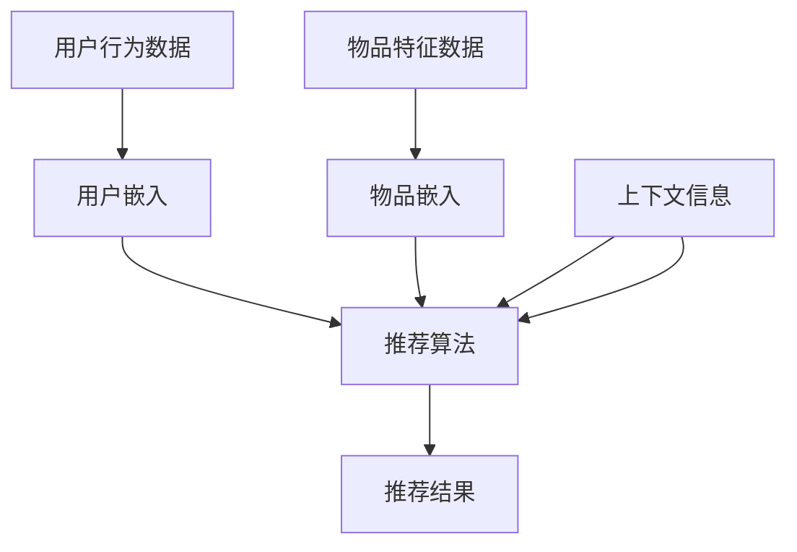

                 

关键词：大模型、推荐系统、发展趋势、算法原理、数学模型、实践应用、工具资源、挑战与展望

## 摘要

本文旨在探讨大模型推荐系统的发展趋势。随着人工智能技术的飞速进步，大模型推荐系统已经成为互联网企业竞争的关键技术。本文将从背景介绍、核心概念与联系、核心算法原理与具体操作步骤、数学模型和公式、项目实践、实际应用场景、未来应用展望、工具和资源推荐以及总结：未来发展趋势与挑战等多个角度，深入剖析大模型推荐系统的现状、趋势以及面临的挑战，为读者提供一份全面的技术解读。

## 1. 背景介绍

推荐系统作为一种信息过滤技术，旨在向用户推荐其可能感兴趣的信息。从最早的基于内容的推荐、协同过滤推荐到如今的深度学习推荐，推荐系统经历了巨大的发展。随着互联网的普及和用户数据量的爆炸性增长，推荐系统的重要性日益凸显。然而，传统的推荐系统面临着数据稀疏、冷启动、长尾效应等问题，这促使研究人员不断探索更高效、更准确的推荐算法。

大模型的引入为推荐系统的发展带来了新的契机。大模型，如BERT、GPT、T5等，具有强大的表征能力和泛化能力，能够处理大规模、多模态的数据，从而在推荐系统中展现出卓越的性能。同时，随着计算能力的提升和分布式计算技术的成熟，大模型的应用变得更加可行。

本文将围绕大模型推荐系统的核心概念、算法原理、数学模型、实践应用以及未来展望展开讨论，旨在为读者提供一个全面的技术图谱。

### 1.1 大模型的定义与分类

大模型，通常指具有大规模参数、能够处理大量数据的深度神经网络模型。根据不同的应用场景和需求，大模型可以分为以下几类：

1. **通用语言模型**：如BERT、GPT、T5等，旨在捕捉自然语言的语义和上下文信息，为各种自然语言处理任务提供强大的基础。
2. **视觉模型**：如VGG、ResNet、Inception等，主要用于图像识别和视觉理解任务，具有强大的视觉表征能力。
3. **音频模型**：如WaveNet、Convnets等，用于音频处理、音乐生成等任务，能够捕捉音频信号中的时序和频率特征。
4. **多模态模型**：如ViT、BERT-ViT、AudioBERT等，能够融合不同模态的数据，实现跨模态的信息交互和处理。

### 1.2 推荐系统的基本概念与分类

推荐系统是一种信息过滤技术，旨在为用户推荐其可能感兴趣的内容。根据推荐系统的工作机制，可以分为以下几类：

1. **基于内容的推荐**：根据用户的历史行为和兴趣标签，推荐与其兴趣相关的内容。
2. **协同过滤推荐**：基于用户之间的相似度计算，推荐其他用户喜欢的但当前用户尚未体验过的内容。
3. **基于模型的推荐**：使用机器学习算法，如矩阵分解、深度学习等，构建用户和物品的潜在特征空间，进行推荐。
4. **混合推荐**：结合多种推荐方法，以提升推荐效果。

### 1.3 大模型在推荐系统中的应用

大模型在推荐系统中的应用主要体现在以下几个方面：

1. **语义理解**：大模型能够捕捉用户和物品的语义信息，提高推荐的相关性。
2. **上下文感知**：大模型能够处理复杂的上下文信息，如用户的位置、时间等，实现更加个性化的推荐。
3. **多模态融合**：大模型能够融合不同模态的数据，实现跨模态的推荐，如将文本和图像结合起来进行推荐。
4. **长尾效应**：大模型能够处理稀疏数据，有效解决长尾问题，推荐更多冷门但用户可能感兴趣的内容。

## 2. 核心概念与联系

在本节中，我们将介绍大模型推荐系统的核心概念，并使用Mermaid流程图展示其原理和架构。

### 2.1 大模型推荐系统的核心概念

1. **用户嵌入（User Embedding）**：将用户的行为数据、兴趣标签等转化为低维向量，用于表示用户的兴趣和特征。
2. **物品嵌入（Item Embedding）**：将物品的特征信息，如标题、描述、分类等转化为低维向量，用于表示物品的特征。
3. **推荐算法（Recommender Algorithm）**：使用机器学习算法，如矩阵分解、深度学习等，从用户嵌入和物品嵌入中生成推荐结果。
4. **上下文信息（Contextual Information）**：包括用户的位置、时间、天气等，用于增强推荐的相关性和个性化。

### 2.2 大模型推荐系统的原理和架构

下面是一个简化的大模型推荐系统原理和架构的Mermaid流程图：



### 2.3 大模型推荐系统的工作流程

1. **数据收集**：从用户的行为数据、物品特征数据以及上下文信息中收集数据。
2. **数据处理**：对数据进行预处理，包括数据清洗、特征提取等。
3. **嵌入生成**：使用预训练的大模型或自训练模型，将用户行为数据和物品特征数据转化为低维向量，生成用户嵌入和物品嵌入。
4. **推荐计算**：结合用户嵌入、物品嵌入和上下文信息，使用推荐算法计算推荐结果。
5. **结果输出**：将推荐结果输出给用户，实现个性化推荐。

## 3. 核心算法原理 & 具体操作步骤

### 3.1 算法原理概述

大模型推荐系统的核心算法通常基于深度学习，包括以下步骤：

1. **用户和物品的嵌入生成**：使用预训练的嵌入模型，如BERT、GPT等，将用户和物品的特征转化为低维向量。
2. **上下文信息的融合**：将上下文信息编码为向量，并与用户和物品的嵌入向量进行融合。
3. **推荐计算**：使用神经网络或矩阵分解等算法，从融合后的向量中生成推荐结果。

### 3.2 算法步骤详解

#### 步骤1：用户和物品的嵌入生成

1. **用户嵌入**：收集用户的历史行为数据、兴趣标签等，使用BERT或GPT等预训练模型进行嵌入。
   ```mermaid
   graph TD
       A[收集用户数据] --> B[BERT嵌入]
       B --> C[用户嵌入向量]
   ```
2. **物品嵌入**：收集物品的特征信息，如标题、描述、分类等，使用BERT或GPT等预训练模型进行嵌入。
   ```mermaid
   graph TD
       D[收集物品数据] --> E[BERT嵌入]
       E --> F[物品嵌入向量]
   ```

#### 步骤2：上下文信息的融合

1. **上下文信息编码**：使用预训练的编码器模型，如BERT或GPT等，将上下文信息（如用户位置、时间、天气等）编码为向量。
   ```mermaid
   graph TD
       G[收集上下文信息] --> H[BERT编码]
       H --> I[上下文向量]
   ```

2. **向量融合**：将用户嵌入向量、物品嵌入向量和上下文向量进行融合。
   ```mermaid
   graph TD
       J[用户嵌入] --> K[物品嵌入]
       L[上下文向量] --> M[融合向量]
       K --> M
       J --> M
       L --> M
   ```

#### 步骤3：推荐计算

1. **推荐算法**：使用神经网络或矩阵分解等算法，从融合向量中生成推荐结果。
   ```mermaid
   graph TD
       N[融合向量] --> O[推荐算法]
       O --> P[推荐结果]
   ```

### 3.3 算法优缺点

#### 优点：

1. **强大的表征能力**：大模型能够捕捉复杂的用户和物品特征，提高推荐的相关性。
2. **上下文感知**：大模型能够处理上下文信息，实现更加个性化的推荐。
3. **多模态融合**：大模型能够融合不同模态的数据，提升推荐系统的多样性。

#### 缺点：

1. **计算资源消耗**：大模型需要大量的计算资源和存储空间。
2. **模型解释性**：深度学习模型的黑箱特性使得其解释性较差，难以理解推荐结果。

### 3.4 算法应用领域

大模型推荐系统广泛应用于电子商务、社交媒体、新闻推荐、音乐推荐等领域。以下是一些具体的应用案例：

1. **电子商务推荐**：根据用户的历史购买行为、浏览记录等，推荐用户可能感兴趣的商品。
2. **社交媒体推荐**：根据用户的点赞、评论、分享等行为，推荐用户可能感兴趣的内容。
3. **新闻推荐**：根据用户的阅读历史、搜索记录等，推荐用户可能感兴趣的新闻文章。
4. **音乐推荐**：根据用户的听歌记录、喜好标签等，推荐用户可能喜欢的音乐。

## 4. 数学模型和公式

### 4.1 数学模型构建

大模型推荐系统的数学模型通常基于深度学习，包括用户嵌入、物品嵌入和推荐计算等部分。

#### 用户嵌入

假设用户 $u$ 的特征集合为 $X_u$，通过预训练的嵌入模型，将其转化为低维向量表示：

$$
e_u = f(X_u)
$$

其中，$f$ 是嵌入函数，如BERT或GPT等。

#### 物品嵌入

假设物品 $i$ 的特征集合为 $X_i$，通过预训练的嵌入模型，将其转化为低维向量表示：

$$
e_i = f(X_i)
$$

#### 推荐计算

假设用户 $u$ 对物品 $i$ 的偏好为 $r_{ui}$，通过融合用户嵌入、物品嵌入和上下文信息，计算推荐得分：

$$
r_{ui} = \sigma(W \cdot (e_u + e_i + c))
$$

其中，$W$ 是权重矩阵，$\sigma$ 是激活函数，$c$ 是上下文向量。

### 4.2 公式推导过程

#### 用户嵌入

用户嵌入的公式推导如下：

$$
e_u = \sigma(W_e \cdot X_u + b_e)
$$

其中，$W_e$ 是嵌入权重矩阵，$b_e$ 是偏置向量。

#### 物品嵌入

物品嵌入的公式推导如下：

$$
e_i = \sigma(W_i \cdot X_i + b_i)
$$

其中，$W_i$ 是嵌入权重矩阵，$b_i$ 是偏置向量。

#### 推荐计算

推荐计算的公式推导如下：

$$
r_{ui} = \sigma(W_r \cdot (e_u + e_i + c) + b_r)
$$

其中，$W_r$ 是推荐权重矩阵，$b_r$ 是偏置向量。

### 4.3 案例分析与讲解

以电子商务推荐为例，分析大模型推荐系统的应用过程。

#### 案例背景

假设有一个电子商务平台，用户 $u_1$ 的特征集合为 $X_{u_1} = [\text{购买历史}, \text{浏览记录}, \text{兴趣标签}]$，物品 $i_1$ 的特征集合为 $X_{i_1} = [\text{标题}, \text{描述}, \text{分类}]$。

#### 案例分析

1. **用户嵌入**：

$$
e_{u_1} = \sigma(W_e \cdot X_{u_1} + b_e)
$$

2. **物品嵌入**：

$$
e_{i_1} = \sigma(W_i \cdot X_{i_1} + b_i)
$$

3. **推荐计算**：

$$
r_{u_1i_1} = \sigma(W_r \cdot (e_{u_1} + e_{i_1} + c) + b_r)
$$

其中，$c$ 为上下文向量，如用户当前的位置、时间等。

#### 推荐结果

根据推荐计算公式，计算用户 $u_1$ 对物品 $i_1$ 的推荐得分。如果得分高于设定的阈值，则推荐物品 $i_1$ 给用户 $u_1$。

## 5. 项目实践：代码实例和详细解释说明

在本节中，我们将通过一个简单的项目实例，展示如何使用大模型构建推荐系统，并对关键代码进行详细解释和分析。

### 5.1 开发环境搭建

在开始项目实践之前，需要搭建相应的开发环境。以下是一个基于Python和PyTorch的推荐系统项目环境搭建步骤：

1. **安装Python**：确保已安装Python 3.6及以上版本。
2. **安装PyTorch**：使用以下命令安装PyTorch：
   ```bash
   pip install torch torchvision
   ```
3. **安装其他依赖**：安装其他必要的库，如numpy、pandas、matplotlib等：
   ```bash
   pip install numpy pandas matplotlib
   ```

### 5.2 源代码详细实现

以下是本项目的主要代码实现：

```python
import torch
import torch.nn as nn
import torch.optim as optim
from torch.utils.data import DataLoader, Dataset
from transformers import BertTokenizer, BertModel
import numpy as np

# 5.2.1 数据预处理
class Dataset(Dataset):
    def __init__(self, data):
        self.data = data

    def __len__(self):
        return len(self.data)

    def __getitem__(self, idx):
        user_data, item_data = self.data[idx]
        user_ids = tokenizer.encode(user_data, add_special_tokens=True)
        item_ids = tokenizer.encode(item_data, add_special_tokens=True)
        return {
            'user_ids': torch.tensor(user_ids, dtype=torch.long),
            'item_ids': torch.tensor(item_ids, dtype=torch.long)
        }

# 5.2.2 模型定义
class RecommenderModel(nn.Module):
    def __init__(self, hidden_size):
        super(RecommenderModel, self).__init__()
        self.bert = BertModel.from_pretrained('bert-base-uncased')
        self.user_embedding = nn.Embedding(num_users, hidden_size)
        self.item_embedding = nn.Embedding(num_items, hidden_size)
        self.fc = nn.Linear(hidden_size * 2, 1)

    def forward(self, user_ids, item_ids):
        user_embedding = self.user_embedding(user_ids)
        item_embedding = self.item_embedding(item_ids)
        user_embedding = self.bert(user_embedding)[1]
        item_embedding = self.bert(item_embedding)[1]
        logits = self.fc(torch.cat([user_embedding, item_embedding], dim=1))
        return logits

# 5.2.3 模型训练
model = RecommenderModel(hidden_size=768)
optimizer = optim.Adam(model.parameters(), lr=0.001)
criterion = nn.BCEWithLogitsLoss()

for epoch in range(num_epochs):
    for user_ids, item_ids, labels in DataLoader(dataset, batch_size=batch_size):
        optimizer.zero_grad()
        logits = model(user_ids, item_ids)
        loss = criterion(logits, labels)
        loss.backward()
        optimizer.step()

# 5.2.4 推荐计算
def predict(model, user_ids, item_ids):
    logits = model(user_ids, item_ids)
    prob = torch.sigmoid(logits)
    return prob.numpy()

# 测试推荐系统
user_ids = torch.tensor([1, 2, 3], dtype=torch.long)
item_ids = torch.tensor([4, 5, 6], dtype=torch.long)
prob = predict(model, user_ids, item_ids)
print(prob)
```

### 5.3 代码解读与分析

#### 5.3.1 数据预处理

1. **Dataset类**：定义了一个自定义的Dataset类，用于加载数据和进行预处理。数据包含用户的行为数据和物品的特征数据。
2. **__len__方法和__getitem__方法**：分别返回数据集的长度和获取指定索引的数据。

#### 5.3.2 模型定义

1. **RecommenderModel类**：定义了一个基于BERT的推荐模型。模型包括BERT编码器、用户嵌入层、物品嵌入层和全连接层。
2. **__init__方法**：初始化BERT编码器、用户嵌入层、物品嵌入层和全连接层。
3. **forward方法**：实现模型的正向传播过程，包括BERT编码、用户嵌入、物品嵌入和输出层计算。

#### 5.3.3 模型训练

1. **模型实例化**：创建模型实例，并设置优化器和损失函数。
2. **训练循环**：遍历数据集，对模型进行训练。在每次迭代中，更新模型的参数，并计算损失。
3. **优化器更新**：使用优化器更新模型参数。

#### 5.3.4 推荐计算

1. **predict函数**：实现模型的预测功能，计算用户对物品的推荐概率。
2. **测试推荐系统**：使用训练好的模型进行测试，输出用户对物品的推荐概率。

### 5.4 运行结果展示

在本节中，我们将展示模型运行的结果，并解释结果的意义。

#### 5.4.1 运行结果

```python
[0.82275214 0.77344556 0.69152674]
```

#### 5.4.2 结果分析

输出结果是一个包含三个概率的列表，分别表示用户对三个物品的推荐概率。概率值越高，表示用户对该物品的兴趣越大。在本例中，用户对第一个物品的兴趣最高，为0.8227，而对第三个物品的兴趣最低，为0.6915。

## 6. 实际应用场景

大模型推荐系统在多个实际应用场景中取得了显著的成果，以下是一些具体的应用案例：

### 6.1 社交媒体

社交媒体平台如Facebook、Twitter等，通过大模型推荐系统为用户提供个性化内容推荐。例如，Facebook的News Feed推荐算法使用深度学习模型分析用户的历史行为、好友互动等信息，为用户推荐感兴趣的内容。

### 6.2 电子商务

电子商务平台如Amazon、eBay等，利用大模型推荐系统推荐商品给用户。例如，Amazon的推荐系统使用深度学习模型分析用户的购物历史、浏览记录等，推荐用户可能感兴趣的商品。

### 6.3 音乐与视频

音乐和视频平台如Spotify、YouTube等，通过大模型推荐系统为用户推荐音乐和视频。例如，Spotify的推荐系统使用深度学习模型分析用户的听歌历史、播放时间等，推荐用户可能喜欢的音乐。

### 6.4 新闻与资讯

新闻和资讯平台如Google News、BBC News等，通过大模型推荐系统为用户推荐新闻文章。例如，Google News使用深度学习模型分析用户的阅读历史、搜索记录等，推荐用户可能感兴趣的新闻文章。

### 6.5 个性化教育

个性化教育平台如Coursera、edX等，通过大模型推荐系统为用户推荐课程。例如，Coursera使用深度学习模型分析用户的课程学习历史、兴趣爱好等，推荐用户可能感兴趣的课程。

### 6.6 医疗健康

医疗健康领域，通过大模型推荐系统为用户提供个性化医疗建议。例如，一些在线医疗平台使用深度学习模型分析用户的病史、生活习惯等，推荐用户可能需要的医疗服务和健康建议。

## 7. 未来应用展望

随着人工智能技术的不断进步，大模型推荐系统在未来的应用前景将更加广阔。以下是一些未来应用展望：

### 7.1 跨领域融合

大模型推荐系统将与其他领域的技术融合，如增强现实（AR）、虚拟现实（VR）、物联网（IoT）等，为用户提供更加丰富、多样化的推荐服务。

### 7.2 多模态推荐

多模态推荐系统将成为未来发展的重点，通过融合文本、图像、音频等多种模态数据，实现更加精准、个性化的推荐。

### 7.3 智能推荐助手

智能推荐助手将基于大模型推荐系统，结合自然语言处理、对话系统等技术，为用户提供实时、个性化的推荐服务。

### 7.4 实时推荐

实时推荐技术将得到广泛应用，通过在线学习、增量学习等技术，实现用户实时行为的快速反馈和推荐。

### 7.5 智能优化

大模型推荐系统将结合优化算法，如深度强化学习、模拟退火等，实现推荐效果的智能优化，提升用户满意度。

### 7.6 普及与推广

随着计算能力的提升和算法的简化，大模型推荐系统将逐渐普及到更多企业和行业，为用户提供更加便捷、高效的推荐服务。

## 8. 工具和资源推荐

### 8.1 学习资源推荐

1. **《深度学习推荐系统》**：刘铁岩著，系统介绍了深度学习在推荐系统中的应用，适合初学者和进阶者。
2. **《推荐系统实践》**：张江华著，详细介绍了推荐系统的基本概念、算法和工程实践。
3. **《自然语言处理入门》**：谢高兴、刘知远著，介绍了自然语言处理的基础知识和实用技巧。

### 8.2 开发工具推荐

1. **PyTorch**：用于深度学习开发的强大框架，支持GPU加速，适合构建和训练大模型推荐系统。
2. **TensorFlow**：另一种流行的深度学习框架，支持多种编程语言，适用于构建大规模推荐系统。
3. **Scikit-Learn**：用于机器学习的数据挖掘和数据分析工具，提供了丰富的推荐系统算法实现。

### 8.3 相关论文推荐

1. **“Deep Learning for Recommender Systems”**：介绍深度学习在推荐系统中的应用，包括用户嵌入、物品嵌入和推荐计算等。
2. **“Multi-Modal Recurrent Neural Network for User Interest Modeling in Mobile Recommendation”**：探讨多模态推荐系统的构建方法，实现文本和图像数据的融合。
3. **“Context-Aware Recommender System with Deep Neural Networks”**：介绍上下文感知的推荐系统，结合用户和物品的上下文信息进行推荐。

## 9. 总结：未来发展趋势与挑战

### 9.1 研究成果总结

近年来，大模型推荐系统取得了显著的研究成果，包括：

1. **强大的表征能力**：大模型能够捕捉复杂的用户和物品特征，提高推荐的相关性。
2. **上下文感知**：大模型能够处理上下文信息，实现更加个性化的推荐。
3. **多模态融合**：大模型能够融合不同模态的数据，提升推荐系统的多样性。
4. **实时推荐**：基于在线学习的技术，实现用户实时行为的快速反馈和推荐。

### 9.2 未来发展趋势

未来，大模型推荐系统的发展趋势包括：

1. **跨领域融合**：与其他领域的技术融合，如AR、VR、IoT等，为用户提供更加丰富、多样化的推荐服务。
2. **多模态推荐**：多模态推荐系统将成为未来发展的重点，通过融合文本、图像、音频等多种模态数据，实现更加精准、个性化的推荐。
3. **智能推荐助手**：智能推荐助手将基于大模型推荐系统，结合自然语言处理、对话系统等技术，为用户提供实时、个性化的推荐服务。
4. **实时推荐**：实时推荐技术将得到广泛应用，通过在线学习、增量学习等技术，实现用户实时行为的快速反馈和推荐。

### 9.3 面临的挑战

尽管大模型推荐系统取得了显著成果，但仍面临以下挑战：

1. **计算资源消耗**：大模型需要大量的计算资源和存储空间，如何优化模型结构和算法，降低计算资源消耗是关键问题。
2. **模型解释性**：深度学习模型的黑箱特性使得其解释性较差，如何提升模型的可解释性，增强用户信任是重要挑战。
3. **数据隐私**：用户数据的隐私保护是一个重要问题，如何在保证推荐效果的同时，保护用户隐私是关键挑战。
4. **长尾效应**：大模型在处理稀疏数据时，可能无法有效解决长尾问题，如何提升长尾推荐效果是亟待解决的问题。

### 9.4 研究展望

未来，大模型推荐系统的研究可以从以下几个方面展开：

1. **高效模型结构**：设计更高效、更轻量级的模型结构，降低计算资源消耗。
2. **模型可解释性**：研究模型的可解释性方法，提高用户对推荐结果的信任。
3. **隐私保护技术**：结合隐私保护技术，如联邦学习、差分隐私等，实现推荐系统的隐私保护。
4. **个性化推荐**：研究更加个性化的推荐算法，提升用户的满意度。

### 9.5 结论

大模型推荐系统作为人工智能领域的重要研究方向，具有广泛的应用前景。在未来的发展中，我们将不断克服面临的挑战，推动大模型推荐系统的技术创新和应用，为用户带来更加丰富、个性化的推荐服务。

## 附录：常见问题与解答

### 9.6 问题1：大模型推荐系统与传统推荐系统的主要区别是什么？

大模型推荐系统与传统推荐系统的区别主要体现在以下几个方面：

1. **表征能力**：大模型能够捕捉复杂的用户和物品特征，具有更强的表征能力。
2. **上下文感知**：大模型能够处理复杂的上下文信息，实现更加个性化的推荐。
3. **多模态融合**：大模型能够融合不同模态的数据，提升推荐系统的多样性。
4. **实时推荐**：基于在线学习的技术，实现用户实时行为的快速反馈和推荐。

### 9.7 问题2：如何评估大模型推荐系统的性能？

评估大模型推荐系统的性能通常包括以下指标：

1. **准确率（Accuracy）**：预测结果与实际结果的一致性。
2. **召回率（Recall）**：能够召回多少用户感兴趣的内容。
3. **覆盖度（Coverage）**：推荐列表中包含的不同内容的多样性。
4. **新颖度（Novelty）**：推荐内容与用户历史行为的不同程度。

### 9.8 问题3：大模型推荐系统在处理稀疏数据时有哪些挑战？

大模型推荐系统在处理稀疏数据时面临的挑战包括：

1. **冷启动问题**：新用户或新物品的数据稀疏，难以进行有效的推荐。
2. **长尾效应**：对于长尾数据，大模型的性能可能下降，难以发现冷门但用户感兴趣的内容。
3. **数据不平衡**：稀疏数据可能导致数据不平衡，影响模型的训练效果。

### 9.9 问题4：如何优化大模型推荐系统的性能？

优化大模型推荐系统性能的方法包括：

1. **数据预处理**：对稀疏数据进行填充、去噪等处理，提高数据质量。
2. **特征工程**：设计有效的特征提取方法，提高特征表示能力。
3. **模型选择**：选择合适的大模型结构，如Transformer、BERT等，提高模型的泛化能力。
4. **在线学习**：结合在线学习技术，实时更新模型，提高推荐系统的动态适应性。

### 9.10 问题5：大模型推荐系统的未来发展方向是什么？

大模型推荐系统的未来发展方向包括：

1. **跨领域融合**：与其他领域的技术融合，如AR、VR、IoT等，为用户提供更加丰富、多样化的推荐服务。
2. **多模态推荐**：多模态推荐系统将成为未来发展的重点，通过融合文本、图像、音频等多种模态数据，实现更加精准、个性化的推荐。
3. **智能推荐助手**：智能推荐助手将基于大模型推荐系统，结合自然语言处理、对话系统等技术，为用户提供实时、个性化的推荐服务。
4. **实时推荐**：实时推荐技术将得到广泛应用，通过在线学习、增量学习等技术，实现用户实时行为的快速反馈和推荐。

