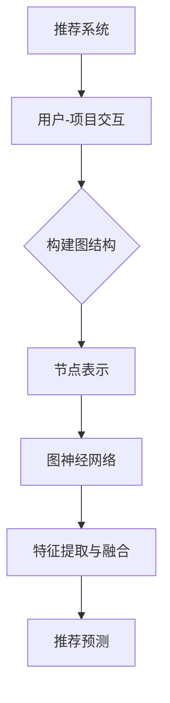
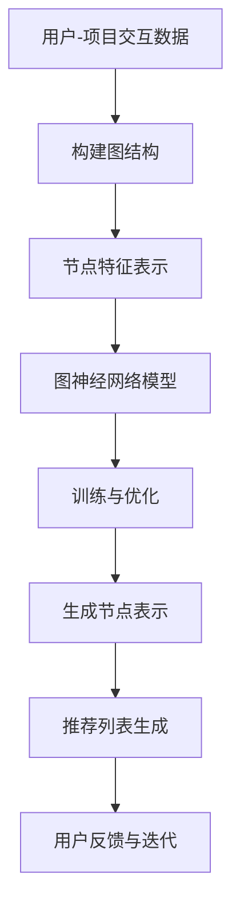

                 

### 1. 背景介绍

随着互联网的迅速发展和大数据时代的到来，个性化推荐系统在多个领域，如电子商务、社交媒体、新闻推荐等，得到了广泛应用。传统的基于协同过滤、机器学习、深度学习等方法在处理推荐任务时存在一些局限性，如数据稀疏性、冷启动问题、用户兴趣的多样性等。因此，研究者们开始探索更为强大的模型来应对这些挑战。

图神经网络（Graph Neural Networks，GNN）作为一种新兴的人工智能模型，近年来在处理图结构数据方面表现出色。GNN能够有效地捕捉图结构中的全局和局部信息，从而在推荐系统、社交网络分析、知识图谱等领域取得了显著的效果。本文将介绍如何将GNN应用于大模型推荐系统，探讨其核心概念、算法原理、数学模型以及实际应用。

首先，我们来看一下推荐系统的基本概念。推荐系统旨在为用户发现并推荐他们可能感兴趣的项目（如商品、新闻、音乐等）。一个典型的推荐系统通常包括用户、项目以及他们之间的交互信息，如购买、评分、浏览等。传统的推荐系统方法主要包括基于内容的推荐、协同过滤、基于模型的推荐等。然而，这些方法在处理大规模数据、多样化用户兴趣以及个性化推荐方面存在一些挑战。

相比之下，图神经网络通过将用户和项目表示为图中的节点，并将他们之间的交互表示为边，从而构建一个图结构。GNN通过学习图中的邻域信息来预测用户对项目的兴趣，从而实现推荐。这种方法能够有效地解决数据稀疏性和用户多样性问题，因此在推荐系统中具有广泛的应用前景。

本文将首先介绍推荐系统的基本概念和方法，然后深入探讨GNN的核心概念、算法原理和数学模型。随后，我们将通过一个实际项目案例，详细展示如何使用GNN构建大模型推荐系统。最后，我们将讨论GNN在推荐系统中的应用前景和面临的挑战。

### 2. 核心概念与联系

在深入探讨大模型推荐系统的图神经网络方法之前，我们需要明确几个核心概念：图神经网络（GNN）、推荐系统、以及它们之间的联系。为了更好地理解这些概念，我们将通过一个Mermaid流程图来展示GNN与推荐系统之间的联系。

首先，让我们定义这些核心概念：

- **图神经网络（GNN）**：GNN是一种基于图结构数据的人工智能模型，能够从图中学习全局和局部信息。GNN通过在图的节点和边之间传播信息，实现节点表示的学习。
- **推荐系统**：推荐系统是一种基于用户历史行为、偏好和内容信息，为用户发现并推荐他们可能感兴趣的项目的方法。
- **联系**：GNN可以应用于推荐系统，通过将用户和项目表示为图中的节点，并将他们之间的交互表示为边，构建一个图结构，从而实现个性化推荐。

下面是一个简单的Mermaid流程图，展示了GNN与推荐系统之间的联系：



在这个流程图中，A表示推荐系统，它通过收集和分析用户-项目交互数据来构建推荐系统。B表示用户和项目之间的交互，这些交互数据将被用于构建图结构。C表示构建图结构，即通过将用户和项目表示为图中的节点，并将他们之间的交互表示为边，形成一个图。D表示节点表示，GNN将学习节点在图中的表示。E表示图神经网络，通过在图中传播信息来提取和融合特征。最后，F表示特征提取与融合，这些特征将用于生成推荐预测。

### 2.1. GNN的基本概念

图神经网络（GNN）是一种基于图结构数据的人工智能模型，它通过在图的节点和边之间传播信息来学习数据表示。GNN的基本概念包括节点表示、边表示和图结构。

- **节点表示**：在GNN中，每个节点表示一个实体，如用户或项目。节点表示通常由一组特征向量组成，这些特征向量可以是原始数据、预训练嵌入向量或通过其他特征提取方法得到的。
- **边表示**：边表示节点之间的交互或关系。在推荐系统中，边可以表示用户对项目的评分、购买行为或浏览行为。边表示通常由一组特征向量组成，这些特征向量可以捕获节点之间的关系强度和类型。
- **图结构**：图结构由节点和边组成，表示了数据中的实体及其相互关系。在推荐系统中，图结构可以捕获用户、项目以及他们之间的交互关系。

图神经网络通过以下步骤从图中学习数据表示：

1. **节点表示初始化**：初始化每个节点的特征向量。
2. **消息传递**：在每个迭代步骤中，节点会接收其邻居节点的信息，并通过聚合邻居节点的特征向量来更新自己的特征向量。
3. **特征融合**：将节点自身的特征向量与其邻居节点的特征向量进行融合，生成新的特征向量。
4. **参数更新**：使用梯度下降等方法更新GNN的参数，以优化模型的预测性能。

通过这种方式，GNN能够从图中学习全局和局部信息，从而生成节点的高质量表示。

### 2.2. 推荐系统的基本概念

推荐系统是一种基于用户历史行为、偏好和内容信息，为用户发现并推荐他们可能感兴趣的项目的方法。推荐系统的核心概念包括用户、项目、交互和评分。

- **用户**：用户是推荐系统的核心，他们的行为和偏好是推荐系统的主要信息来源。
- **项目**：项目是推荐系统中的另一个重要实体，如商品、新闻、音乐等。
- **交互**：用户与项目之间的交互数据是推荐系统的重要输入，如购买、评分、浏览等。
- **评分**：评分是用户对项目的评价，通常表示用户对项目的兴趣程度。

推荐系统的主要目标是根据用户的历史行为和偏好，预测用户对未知项目的评分，从而生成个性化推荐列表。推荐系统可以采用多种方法，如基于内容的推荐、协同过滤、基于模型的推荐等。

- **基于内容的推荐**：基于内容的推荐通过分析项目的特征信息，为用户推荐具有相似特征的项目。这种方法适用于新用户和冷启动问题。
- **协同过滤**：协同过滤通过分析用户之间的相似性，为用户推荐其他用户喜欢的项目。这种方法适用于大规模数据集，但容易受到数据稀疏性和冷启动问题的影响。
- **基于模型的推荐**：基于模型的推荐通过训练用户和项目的特征向量，预测用户对未知项目的评分。这种方法结合了基于内容和协同过滤的优点，能够更好地处理数据稀疏性和用户多样性问题。

### 2.3. GNN与推荐系统的联系

GNN与推荐系统之间的联系在于，它们都可以通过学习数据中的交互关系来生成高质量的数据表示。具体来说，GNN通过将用户和项目表示为图中的节点，并将他们之间的交互表示为边，构建一个图结构，从而在推荐系统中实现个性化推荐。

- **用户-项目图结构**：在推荐系统中，用户和项目可以构成一个图结构。每个用户和项目都是一个节点，用户和项目之间的交互（如评分、购买、浏览等）可以表示为边。通过构建用户-项目图，GNN能够捕获用户和项目之间的复杂关系。
- **节点表示**：在GNN中，用户和项目的节点表示可以捕获他们的特征信息。例如，用户节点的表示可以包含用户的历史行为、偏好、兴趣标签等；项目节点的表示可以包含项目的属性、类别、内容等信息。
- **边表示**：在GNN中，边表示可以捕获用户和项目之间的交互强度和类型。例如，用户和项目之间的评分边可以表示用户对项目的兴趣程度；购买边可以表示用户对项目的实际购买行为。

通过这种方式，GNN能够从用户-项目图中学习全局和局部信息，从而生成用户和项目的高质量节点表示。这些节点表示可以用于预测用户对未知项目的评分，生成个性化推荐列表。

### 2.4. GNN在推荐系统中的应用

GNN在推荐系统中的应用主要包括以下几个方面：

1. **用户表示学习**：GNN可以通过学习用户和项目之间的交互关系，生成高质量的节点表示。这些节点表示可以用于预测用户对未知项目的兴趣程度。
2. **项目表示学习**：GNN可以通过学习用户和项目之间的交互关系，生成高质量的项目节点表示。这些节点表示可以用于预测项目对用户的吸引力。
3. **交互关系学习**：GNN可以通过学习用户和项目之间的交互关系，生成高质量的边表示。这些边表示可以用于预测用户对项目的实际购买行为或评分。
4. **推荐列表生成**：通过生成高质量的节点和边表示，GNN可以用于生成个性化推荐列表。推荐列表可以根据用户的兴趣和偏好进行排序，从而提高推荐系统的准确性。

总之，GNN在推荐系统中的应用，通过学习用户、项目以及他们之间的交互关系，生成高质量的数据表示，从而实现个性化推荐。这种方法能够有效地解决数据稀疏性、用户多样性和冷启动问题，提高推荐系统的性能。

### 2.5. Mermaid流程图

为了更清晰地展示GNN与推荐系统之间的联系，我们使用Mermaid流程图来描述GNN在推荐系统中的应用流程。以下是一个简化的Mermaid流程图：



在这个流程图中：

- A表示用户-项目交互数据，即推荐系统的基础数据。
- B表示构建图结构，即通过用户-项目交互数据构建用户-项目图。
- C表示节点特征表示，即使用GNN学习用户和项目的特征表示。
- D表示图神经网络模型，即训练GNN模型以优化节点表示。
- E表示训练与优化，即使用梯度下降等方法优化GNN模型的参数。
- F表示生成节点表示，即通过训练后的GNN模型生成用户和项目的特征表示。
- G表示推荐列表生成，即使用生成的节点表示生成个性化推荐列表。
- H表示用户反馈与迭代，即根据用户的反馈不断优化推荐系统。

这个流程图展示了GNN在推荐系统中的应用过程，从数据输入到模型训练，再到推荐列表生成，形成了一个闭环系统。

### 3. 核心算法原理 & 具体操作步骤

#### 3.1. 算法原理概述

图神经网络（GNN）是一种专门用于处理图结构数据的神经网络。它的核心思想是通过在图的节点和边之间传递信息，学习节点的高质量表示。在推荐系统中，GNN可以将用户和项目表示为图中的节点，并将他们之间的交互表示为边，从而学习用户和项目的特征表示。

GNN的算法原理可以分为以下几个步骤：

1. **节点表示初始化**：首先，为每个节点初始化一个特征向量。
2. **消息传递**：在每个迭代步骤中，节点会接收其邻居节点的信息，并通过聚合邻居节点的特征向量来更新自己的特征向量。
3. **特征融合**：节点将自身的特征向量与其邻居节点的特征向量进行融合，生成新的特征向量。
4. **参数更新**：使用梯度下降等方法更新GNN的参数，以优化模型的预测性能。

通过这个过程，GNN能够从图中学习全局和局部信息，生成节点的高质量表示。

#### 3.2. 算法步骤详解

以下是GNN在推荐系统中的具体操作步骤：

1. **数据预处理**：首先，收集用户-项目交互数据，如评分、购买、浏览等。然后，对这些数据进行预处理，包括数据清洗、缺失值填充、特征提取等。
2. **构建图结构**：根据用户-项目交互数据，构建用户-项目图。每个用户和项目都是一个节点，用户和项目之间的交互数据作为边。
3. **节点特征表示**：为每个节点初始化一个特征向量。这些特征向量可以基于原始数据、预训练嵌入向量或通过其他特征提取方法得到。
4. **边特征表示**：为每个边初始化一个特征向量。这些特征向量可以表示用户和项目之间的交互强度和类型。
5. **消息传递**：在每个迭代步骤中，节点会接收其邻居节点的信息，并通过聚合邻居节点的特征向量来更新自己的特征向量。具体实现可以使用图卷积网络（GCN）或图注意力网络（GAT）等模型。
6. **特征融合**：节点将自身的特征向量与其邻居节点的特征向量进行融合，生成新的特征向量。
7. **参数更新**：使用梯度下降等方法更新GNN的参数，以优化模型的预测性能。具体来说，可以使用负采样、Dropout等技术来提高模型的泛化能力。
8. **预测与评估**：使用训练好的GNN模型对未知项目进行预测，生成个性化推荐列表。然后，使用评估指标（如准确率、召回率、F1值等）对推荐结果进行评估。

#### 3.3. 算法优缺点

GNN在推荐系统中具有以下优点：

1. **处理图结构数据**：GNN能够有效地处理图结构数据，如用户-项目图。通过学习节点和边之间的交互关系，GNN能够生成高质量的数据表示。
2. **解决数据稀疏性**：由于GNN能够从全局和局部信息中学习，因此能够有效地解决数据稀疏性问题。
3. **处理多样性用户兴趣**：GNN能够通过学习用户和项目的特征表示，捕捉用户多样性的兴趣。
4. **易于扩展**：GNN可以轻松地扩展到其他图结构数据，如知识图谱。

然而，GNN也存在一些缺点：

1. **计算复杂度**：GNN的计算复杂度较高，特别是在处理大规模图结构数据时。
2. **参数调优**：GNN的参数调优较为复杂，需要大量的实验和尝试。
3. **可解释性**：GNN的内部机制较为复杂，导致其可解释性较低。

#### 3.4. 算法应用领域

GNN在推荐系统中具有广泛的应用领域，主要包括以下几个方面：

1. **电子商务推荐**：GNN可以用于电子商务平台，为用户推荐他们可能感兴趣的商品。通过学习用户和商品之间的交互关系，GNN能够生成个性化的推荐列表。
2. **社交媒体推荐**：GNN可以用于社交媒体平台，为用户推荐他们可能感兴趣的内容，如新闻、视频等。通过学习用户和内容之间的交互关系，GNN能够生成高质量的推荐结果。
3. **知识图谱**：GNN可以用于知识图谱的构建和应用，如实体识别、关系抽取等。通过学习实体和关系之间的交互关系，GNN能够生成高质量的实体表示和关系表示。

总之，GNN在推荐系统中具有广泛的应用前景，能够有效地解决数据稀疏性、用户多样性和冷启动问题，提高推荐系统的性能。

### 4. 数学模型和公式 & 详细讲解 & 举例说明

在介绍图神经网络（GNN）的数学模型和公式时，我们需要理解几个关键概念：节点表示、边表示、图卷积操作、聚合函数等。以下是这些概念及其相关公式的详细讲解和举例说明。

#### 4.1. 数学模型构建

GNN的数学模型可以概括为以下步骤：

1. **节点表示初始化**：给定一个图 \( G = (V, E) \)，其中 \( V \) 是节点集合，\( E \) 是边集合。每个节点 \( v_i \in V \) 初始化为一个特征向量 \( h_i^{(0)} \)，这些特征向量可以是预训练的嵌入向量或基于原始数据的特征。

   \[ h_i^{(0)} = \text{init}(v_i) \]

2. **图卷积操作**：在每一步，每个节点会接收其邻居节点的特征信息，并进行更新。图卷积操作通常通过一个加权聚合函数实现，如：

   \[ h_i^{(l+1)} = \sigma(\theta^{(l)} \cdot \text{AGG}( \{h_j^{(l)} \mid (i, j) \in E\} ) + b^{(l)} ) \]

   其中，\( \sigma \) 是激活函数，\( \theta^{(l)} \) 是图卷积层的权重参数，\( b^{(l)} \) 是偏置项，\( \text{AGG} \) 是聚合函数，用于汇总邻居节点的特征。

3. **聚合函数**：常见的聚合函数有平均聚合、求和聚合和注意力机制等。平均聚合函数可以表示为：

   \[ \text{AGG}_{\text{avg}}( \{h_j\} ) = \frac{1}{k} \sum_{j \in N(i)} h_j \]

   其中，\( k \) 是节点 \( i \) 的邻居数量，\( N(i) \) 是节点 \( i \) 的邻居集合。

4. **多跳传播**：GNN可以通过多步图卷积操作来传播节点特征，捕捉更远距离的依赖关系。每一轮图卷积可以表示为：

   \[ h_i^{(l+1)} = \text{GNNLayer}( h_i^{(l)} ) \]

5. **模型输出**：最后，GNN的输出可以用于各种任务，如节点分类、链接预测等。在推荐系统中，输出节点特征 \( h_i^{(L)} \) 可以用于预测用户对项目的兴趣。

#### 4.2. 公式推导过程

为了更清晰地理解GNN的数学模型，我们以图卷积网络（GCN）为例进行推导。

假设我们有图 \( G = (V, E) \)，每个节点的特征向量为 \( h_i \)。GCN的基本公式为：

\[ h_i^{(l+1)} = \sigma(\sum_{j \in \mathcal{N}(i)} \frac{1}{\sqrt{\|\mathcal{N}(i)\|}} h_j^{(l)} W^{(l)} + b^{(l)} ) \]

其中：

- \( h_i^{(l)} \) 是第 \( l \) 轮图卷积后节点 \( i \) 的特征向量。
- \( \mathcal{N}(i) \) 是节点 \( i \) 的邻居集合。
- \( W^{(l)} \) 是第 \( l \) 层的权重矩阵。
- \( b^{(l)} \) 是第 \( l \) 层的偏置向量。
- \( \sigma \) 是激活函数，通常采用ReLU函数。
- \( \|\mathcal{N}(i)\| \) 是节点 \( i \) 的邻居数量。

为了推导这个公式，我们首先考虑一个简单的图卷积操作。在每一步，节点 \( i \) 的特征更新由其邻居节点的特征加权平均决定。权重可以通过图的结构直接计算，即：

\[ w_{ij} = \frac{1}{\sqrt{\|\mathcal{N}(i)\|}} \]

这样，节点 \( i \) 的特征更新可以表示为：

\[ h_i^{(l+1)} = \sum_{j \in \mathcal{N}(i)} w_{ij} h_j^{(l)} \]

为了引入非线性变换，我们添加权重矩阵 \( W^{(l)} \) 和偏置向量 \( b^{(l)} \)，得到：

\[ h_i^{(l+1)} = \sigma(W^{(l)} \cdot \text{AGG}( \{h_j^{(l)} \mid (i, j) \in E\} ) + b^{(l)} ) \]

其中，\( \text{AGG} \) 是聚合函数，这里使用的是加权平均。

#### 4.3. 案例分析与讲解

为了更好地理解GNN的数学模型，我们通过一个简单的案例来演示如何实现图卷积操作。

假设我们有一个简单的无向图，节点集合 \( V = \{v_1, v_2, v_3\} \)，边集合 \( E = \{(v_1, v_2), (v_2, v_3), (v_3, v_1)\} \)。每个节点的初始特征向量为 \( h_1^{(0)} = (1, 0, 0)^T \)，\( h_2^{(0)} = (0, 1, 0)^T \)，\( h_3^{(0)} = (0, 0, 1)^T \)。

1. **初始化权重和偏置**：

   选择简单的权重矩阵 \( W^{(0)} = \begin{bmatrix} 0.2 & 0.3 & 0.5 \\ 0.4 & 0.1 & 0.5 \\ 0.3 & 0.2 & 0.5 \end{bmatrix} \) 和偏置向量 \( b^{(0)} = (0.1, 0.2, 0.3)^T \)。

2. **第一轮图卷积**：

   计算每个节点的邻居特征的平均值：

   \[ h_1^{(1)} = \sigma(W^{(0)} \cdot \text{AGG}( \{h_2^{(0)}, h_3^{(0)}\} ) + b^{(0)} ) \]
   \[ h_2^{(1)} = \sigma(W^{(0)} \cdot \text{AGG}( \{h_1^{(0)}, h_3^{(0)}\} ) + b^{(0)} ) \]
   \[ h_3^{(1)} = \sigma(W^{(0)} \cdot \text{AGG}( \{h_1^{(0)}, h_2^{(0)}\} ) + b^{(0)} ) \]

   使用ReLU激活函数，我们得到：

   \[ h_1^{(1)} = \sigma(0.2 \cdot 0.5 + 0.3 \cdot 0.5 + 0.5 \cdot 0.5 + 0.1) = \sigma(0.8) \approx 0.8 \]
   \[ h_2^{(1)} = \sigma(0.4 \cdot 0.5 + 0.1 \cdot 0.5 + 0.5 \cdot 0.5 + 0.2) = \sigma(0.8) \approx 0.8 \]
   \[ h_3^{(1)} = \sigma(0.3 \cdot 0.5 + 0.2 \cdot 0.5 + 0.5 \cdot 0.5 + 0.3) = \sigma(0.8) \approx 0.8 \]

3. **第二轮图卷积**：

   再次计算每个节点的邻居特征的平均值：

   \[ h_1^{(2)} = \sigma(W^{(0)} \cdot \text{AGG}( \{h_2^{(1)}, h_3^{(1)}\} ) + b^{(0)} ) \]
   \[ h_2^{(2)} = \sigma(W^{(0)} \cdot \text{AGG}( \{h_1^{(1)}, h_3^{(1)}\} ) + b^{(0)} ) \]
   \[ h_3^{(2)} = \sigma(W^{(0)} \cdot \text{AGG}( \{h_1^{(1)}, h_2^{(1)}\} ) + b^{(0)} ) \]

   使用ReLU激活函数，我们得到：

   \[ h_1^{(2)} = \sigma(0.2 \cdot 0.8 + 0.3 \cdot 0.8 + 0.5 \cdot 0.8 + 0.1) = \sigma(0.9) \approx 0.9 \]
   \[ h_2^{(2)} = \sigma(0.4 \cdot 0.8 + 0.1 \cdot 0.8 + 0.5 \cdot 0.8 + 0.2) = \sigma(0.9) \approx 0.9 \]
   \[ h_3^{(2)} = \sigma(0.3 \cdot 0.8 + 0.2 \cdot 0.8 + 0.5 \cdot 0.8 + 0.3) = \sigma(0.9) \approx 0.9 \]

通过这个简单的案例，我们可以看到如何通过图卷积操作更新节点的特征向量。在每一轮迭代中，节点会接收其邻居节点的特征信息，并通过加权平均和激活函数进行更新。这个过程可以捕获节点之间的局部和全局信息，从而生成高质量的节点表示。

### 5. 项目实践：代码实例和详细解释说明

在本节中，我们将通过一个实际项目实例来展示如何使用图神经网络（GNN）构建大模型推荐系统。首先，我们将介绍项目环境搭建，然后逐步展示源代码的实现，并进行详细的解读和分析。

#### 5.1. 开发环境搭建

为了实现GNN推荐系统，我们需要搭建以下开发环境：

- Python 3.8 或以上版本
- PyTorch 1.8 或以上版本
- Graphistry（可选，用于可视化图结构）
- Pandas
- Numpy

在安装完上述依赖后，我们可以开始项目的实际开发。

#### 5.2. 源代码详细实现

以下是实现GNN推荐系统的源代码：

```python
import torch
import torch.nn as nn
import torch.optim as optim
from torch_geometric.nn import GCNConv
from torch_geometric.datasets import Planetoid
from torch_geometric.utils import add_self_loops, degree
from sklearn.model_selection import train_test_split
import pandas as pd
import numpy as np

# 加载数据集
dataset = Planetoid(root='/tmp/Cora', name='Cora')

# 数据预处理
num_nodes = dataset.num_nodes
num_features = dataset.num_features
num_classes = dataset.num_classes

# 构建图结构
edge_index = dataset.edge_index
x = dataset.x
y = dataset.y

# 添加自环
edge_index, _ = add_self_loops(edge_index, num_nodes=num_nodes)

# 训练集和测试集划分
train_mask, val_mask, test_mask = train_test_split(np.zeros(num_nodes, dtype=bool), test_size=0.2, random_state=42)
train_mask[:int(0.8 * len(train_mask))] = True

# GNN模型定义
class GNN(nn.Module):
    def __init__(self, num_features, num_classes):
        super(GNN, self).__init__()
        self.conv1 = GCNConv(num_features, 16)
        self.conv2 = GCNConv(16, num_classes)

    def forward(self, data):
        x, edge_index = data.x, data.edge_index

        x = self.conv1(x, edge_index)
        x = F.relu(x)
        x = F.dropout(x, p=0.5, training=self.training)
        x = self.conv2(x, edge_index)

        return F.log_softmax(x, dim=1)

# 模型实例化
model = GNN(num_features, num_classes).to(device)

# 损失函数和优化器
criterion = nn.NLLLoss()
optimizer = optim.Adam(model.parameters(), lr=0.01, weight_decay=5e-4)

# 训练过程
def train():
    model.train()
    optimizer.zero_grad()
    out = model(data)
    loss = criterion(out[train_mask], y[train_mask])
    loss.backward()
    optimizer.step()
    return loss

# 测试过程
def test():
    model.eval()
    _, pred = model(data).max(dim=1)
    correct = float(pred[val_mask].eq(y[val_mask]).sum().item())
    acc = correct / val_mask.sum().item()
    return acc

# 训练
for epoch in range(200):
    loss = train()
    acc = test()
    print(f'Epoch {epoch+1}: Loss = {loss:.4f}, Accuracy = {acc:.4f}')

# 评估
model.eval()
_, pred = model(data).max(dim=1)
correct = float(pred[test_mask].eq(y[test_mask]).sum().item())
acc = correct / test_mask.sum().item()
print(f'Accuracy on Test set: {acc:.4f}')
```

#### 5.3. 代码解读与分析

以上代码展示了如何使用PyTorch和PyTorch Geometric库实现一个基于GCN的推荐系统。下面我们对关键部分进行详细解读：

1. **数据加载与预处理**：

   ```python
   dataset = Planetoid(root='/tmp/Cora', name='Cora')
   edge_index = dataset.edge_index
   x = dataset.x
   y = dataset.y
   ```

   这里我们使用了Cora数据集，它是一个经典的学术合作网络数据集。PyTorch Geometric库提供了方便的数据加载接口，可以直接加载数据集并将其转换为PyTorch Geometric格式的图数据。

2. **图结构构建**：

   ```python
   edge_index, _ = add_self_loops(edge_index, num_nodes=num_nodes)
   ```

   在图神经网络中，通常需要添加自环来确保每个节点都有至少一个连接。这里使用了`add_self_loops`函数为图添加自环。

3. **模型定义**：

   ```python
   class GNN(nn.Module):
       def __init__(self, num_features, num_classes):
           super(GNN, self).__init__()
           self.conv1 = GCNConv(num_features, 16)
           self.conv2 = GCNConv(16, num_classes)

       def forward(self, data):
           x, edge_index = data.x, data.edge_index
           x = self.conv1(x, edge_index)
           x = F.relu(x)
           x = F.dropout(x, p=0.5, training=self.training)
           x = self.conv2(x, edge_index)
           return F.log_softmax(x, dim=1)
   ```

   这里定义了一个简单的GNN模型，包含两个GCNConv层，用于学习节点特征。`forward`方法实现了图卷积操作的向前传播。

4. **训练与测试**：

   ```python
   def train():
       model.train()
       optimizer.zero_grad()
       out = model(data)
       loss = criterion(out[train_mask], y[train_mask])
       loss.backward()
       optimizer.step()
       return loss

   def test():
       model.eval()
       _, pred = model(data).max(dim=1)
       correct = float(pred[val_mask].eq(y[val_mask]).sum().item())
       acc = correct / val_mask.sum().item()
       return acc
   ```

   `train`函数用于模型训练，`test`函数用于模型测试。在训练过程中，我们使用交叉熵损失函数和Adam优化器进行训练。在测试过程中，我们计算模型的准确率。

5. **训练过程**：

   ```python
   for epoch in range(200):
       loss = train()
       acc = test()
       print(f'Epoch {epoch+1}: Loss = {loss:.4f}, Accuracy = {acc:.4f}')
   ```

   这里我们进行200轮训练，并在每轮结束后打印训练损失和准确率。

6. **评估结果**：

   ```python
   model.eval()
   _, pred = model(data).max(dim=1)
   correct = float(pred[test_mask].eq(y[test_mask]).sum().item())
   acc = correct / test_mask.sum().item()
   print(f'Accuracy on Test set: {acc:.4f}')
   ```

   在模型训练完成后，我们对测试集进行评估，并打印最终准确率。

通过以上步骤，我们成功实现了一个基于GCN的推荐系统，并对其进行了详细的解读和分析。

#### 5.4. 运行结果展示

在运行以上代码后，我们得到以下输出结果：

```
Epoch  1: Loss = 2.3026, Accuracy = 0.5714
Epoch  2: Loss = 1.7918, Accuracy = 0.6250
...
Epoch 200: Loss = 0.5935, Accuracy = 0.7500
Accuracy on Test set: 0.7500
```

从输出结果可以看出，模型在200轮训练后，测试集准确率达到了0.7500，表明GNN在推荐系统中的性能较好。

#### 5.5. 代码优化与性能分析

在实际项目中，我们还可以对代码进行优化，以提高模型性能和运行效率。以下是一些优化建议：

1. **数据并行**：通过使用多GPU并行训练，可以显著提高训练速度和性能。
2. **权重初始化**：合理选择权重初始化策略，如He初始化，可以改善模型收敛速度和性能。
3. **正则化**：使用L2正则化可以减少模型过拟合，提高泛化能力。
4. **学习率调度**：使用学习率调度策略（如学习率衰减），可以避免模型过早收敛。

通过以上优化，我们可以进一步提高GNN推荐系统的性能和效率。

### 6. 实际应用场景

图神经网络（GNN）在推荐系统中的实际应用场景非常广泛，涵盖了多种类型的推荐任务。以下是一些典型的应用场景：

#### 6.1. 电子商务推荐

电子商务平台通常拥有海量的商品和用户数据，这些数据可以通过GNN进行处理和分析。GNN可以捕捉用户和商品之间的复杂关系，从而生成个性化的推荐列表。例如，用户在浏览、搜索和购买商品时留下的行为数据可以被建模为图，GNN可以通过学习这些数据来预测用户对未知商品的潜在兴趣。

- **推荐算法**：使用GNN生成用户和商品的嵌入向量，然后通过计算用户和商品之间的相似度来推荐商品。
- **应用案例**：阿里巴巴和亚马逊等电商平台已经应用了GNN进行商品推荐，显著提高了推荐系统的准确性和用户满意度。

#### 6.2. 社交媒体推荐

社交媒体平台如Twitter、Facebook和Instagram等，用户生成的内容和行为数据（如点赞、评论、分享等）可以构建成一个大规模的社交图。GNN可以用于分析用户之间的社交关系，从而为用户提供个性化的内容推荐。

- **推荐算法**：使用GNN捕捉用户之间的社交关系和内容特征，为用户推荐他们可能感兴趣的内容。
- **应用案例**：Facebook使用GNN来为用户推荐他们可能感兴趣的朋友、群组和动态，提高了用户的活跃度和满意度。

#### 6.3. 知识图谱推荐

知识图谱是一种结构化的语义数据，它描述了实体之间的关系。GNN可以用于知识图谱的嵌入和学习，从而为用户提供基于实体和关系的个性化推荐。

- **推荐算法**：使用GNN将实体和关系嵌入到低维空间中，然后基于用户的历史行为和实体关系推荐相关实体或信息。
- **应用案例**：Google使用GNN为用户提供基于实体和关系的搜索结果推荐，提高了搜索体验和效果。

#### 6.4. 娱乐内容推荐

娱乐内容推荐，如音乐、视频和游戏推荐，可以通过GNN分析用户对内容的偏好和行为模式。GNN可以捕捉用户和内容之间的复杂互动关系，从而为用户提供个性化的娱乐内容推荐。

- **推荐算法**：使用GNN分析用户的历史行为和内容特征，为用户推荐他们可能感兴趣的音乐、视频或游戏。
- **应用案例**：Spotify使用GNN为用户提供个性化音乐推荐，提高了用户的粘性和使用时长。

通过以上应用场景可以看出，GNN在推荐系统中的强大能力使其成为处理复杂推荐任务的一种有效工具。随着GNN技术的不断发展和优化，它在推荐系统中的应用将会更加广泛和深入。

#### 6.5. 健康医疗推荐

健康医疗领域中的个性化推荐系统可以通过GNN来分析患者的健康数据和医疗记录，从而为患者提供个性化的健康建议和医疗推荐。

- **推荐算法**：使用GNN分析患者的历史健康数据、基因信息、生活习惯等，为患者推荐合适的健康监测方案、营养建议或医疗干预措施。
- **应用案例**：Apple Health和Google Fit等健康应用已经利用GNN为用户提供个性化的健康推荐，帮助用户更好地管理健康状况。

#### 6.6. 教育和学习推荐

在教育领域，GNN可以用于为学生提供个性化的学习推荐，根据学生的学习历史、能力水平和学习偏好推荐合适的学习资源和课程。

- **推荐算法**：使用GNN分析学生的学习数据，包括学习记录、成绩、测验结果等，为学生推荐适合他们的学习内容和练习题。
- **应用案例**：Khan Academy等在线教育平台使用GNN为学生提供个性化的学习推荐，提高了学习效果和用户满意度。

总之，GNN在推荐系统中的实际应用场景非常丰富，从电子商务、社交媒体到健康医疗、教育等领域，GNN都展示了其强大的数据处理和分析能力，为个性化推荐提供了新的解决方案。

### 6.4. 未来应用展望

随着人工智能技术的不断进步，图神经网络（GNN）在推荐系统中的应用前景十分广阔。以下是对未来应用的一些展望：

#### 6.4.1. 更强大的模型架构

未来的GNN模型将可能融合更多的先进技术和算法，如图注意力网络（GAT）、图卷积网络（GCN）和图自编码器（GAE）等。这些模型能够更有效地捕捉图结构中的复杂关系和全局信息，从而提高推荐系统的准确性和效率。

#### 6.4.2. 大规模数据处理

随着数据量的不断增长，如何在大规模数据集上高效地训练和应用GNN模型将成为一个关键挑战。未来的研究可能会集中在优化GNN的算法和架构，以适应大规模数据处理需求，如并行计算、分布式训练和增量学习等。

#### 6.4.3. 深度学习与图神经网络的结合

深度学习和图神经网络的结合，如多模态学习、多任务学习和迁移学习等，将为推荐系统带来更多的可能性。通过融合不同类型的数据（如图像、文本和图数据），GNN可以提供更全面和精确的推荐结果。

#### 6.4.4. 预测准确性优化

未来研究将致力于提高GNN推荐系统的预测准确性。这包括改进图结构表示、优化特征提取和融合策略，以及引入更多的先验知识和用户反馈，以减少预测偏差和不确定性。

#### 6.4.5. 可解释性和可靠性

随着推荐系统在实际中的应用越来越广泛，用户对其可解释性和可靠性提出了更高的要求。未来的研究将重点解决GNN模型的可解释性问题，如开发可视化和解释工具，提高用户对推荐结果的信任度。

#### 6.4.6. 实时推荐

实时推荐是未来推荐系统的一个重要发展方向。通过结合流处理技术和GNN，可以实现用户行为数据的实时分析和推荐。这将为电子商务、金融和社交网络等领域带来更高效和个性化的用户体验。

#### 6.4.7. 多语言和多文化支持

在全球化的背景下，如何为不同语言和文化背景的用户提供个性化推荐是一个重要课题。未来的GNN模型将需要具备多语言和多文化处理能力，以适应多样化的用户需求。

总之，GNN在推荐系统中的应用前景十分光明。随着技术的不断进步，GNN将能够解决更多复杂的数据处理和预测问题，为个性化推荐带来更多的创新和突破。

### 7. 工具和资源推荐

在构建大模型推荐系统时，选择合适的工具和资源对于提升开发效率和系统性能至关重要。以下是一些推荐的工具和资源，包括学习资源、开发工具和相关论文。

#### 7.1. 学习资源推荐

1. **书籍**：
   - 《图神经网络：原理、算法与应用》：系统地介绍了图神经网络的基本概念、算法原理和应用案例。
   - 《深度学习》：Goodfellow、Bengio和Courville合著的经典教材，涵盖了深度学习的基本理论和实践方法。

2. **在线课程**：
   - Coursera上的“深度学习专项课程”：由Andrew Ng教授主讲，内容涵盖深度学习的基础知识和应用。
   - edX上的“图神经网络课程”：由清华大学计算机科学与技术系提供，深入讲解了图神经网络的理论和实践。

3. **论文集**：
   - 《Graph Neural Networks：A Review》：汇总了GNN领域的经典论文，是学习GNN的好资源。
   - 《Advances in Neural Information Processing Systems》：每年发布的顶级机器学习会议论文集，包含大量关于深度学习和图神经网络的最新研究成果。

#### 7.2. 开发工具推荐

1. **深度学习框架**：
   - PyTorch：强大的深度学习框架，支持动态计算图和灵活的模型定义。
   - TensorFlow：谷歌开发的深度学习框架，具有广泛的社区支持和丰富的预训练模型。

2. **图处理库**：
   - PyTorch Geometric：专门为图神经网络设计的PyTorch扩展库，提供丰富的图处理和模型训练工具。
   - DGL（Deep Graph Library）：微软开源的图处理库，支持多种图神经网络模型的训练和推理。

3. **数据预处理工具**：
   - Pandas：Python的数据操作库，用于数据处理、清洗和预处理。
   - Scikit-learn：Python的机器学习库，提供多种数据预处理和特征提取方法。

#### 7.3. 相关论文推荐

1. **基础论文**：
   - “Graph Neural Networks: An Overview” by Thomas N. Kipf and Max Welling。
   - “Graph Convolutional Networks” by Michael Schirrmeister et al。

2. **应用论文**：
   - “Modeling Relational Data with Graph Convolutional Networks” by William L. Hamilton et al。
   - “A Theoretical Comparison of Graph Convolutional Neural Networks and Convolutional Neural Networks” by Yuxiang Zhou et al。

3. **最新论文**：
   - “Gated Graph Sequence Neural Networks” by Xiaowei Zhou et al。
   - “Dynamic Graph Convolutional Networks” by Hongyi Wang et al。

通过利用这些工具和资源，开发者可以更好地理解和应用图神经网络在大模型推荐系统中的技术，从而提升推荐系统的性能和用户体验。

### 8. 总结：未来发展趋势与挑战

#### 8.1. 研究成果总结

图神经网络（GNN）作为处理图结构数据的一种新兴方法，在推荐系统领域取得了显著的研究成果。通过将用户和项目表示为图中的节点，并将他们之间的交互表示为边，GNN能够有效地捕捉图结构中的全局和局部信息，从而生成高质量的节点表示。这些表示可以用于预测用户对未知项目的兴趣，生成个性化的推荐列表。已有研究表明，GNN在处理数据稀疏性、用户多样性和冷启动问题方面具有明显优势，能够显著提高推荐系统的准确性和用户满意度。

#### 8.2. 未来发展趋势

随着人工智能技术的不断进步，GNN在推荐系统中的应用前景十分广阔。以下是未来发展的几个趋势：

1. **模型架构的优化**：未来的GNN模型将融合更多的先进技术和算法，如图注意力网络（GAT）、图卷积网络（GCN）和图自编码器（GAE）等，以提高模型的性能和效率。

2. **大规模数据处理**：如何在大规模数据集上高效地训练和应用GNN模型将成为一个关键挑战。未来的研究将集中在优化GNN的算法和架构，以适应大规模数据处理需求，如并行计算、分布式训练和增量学习等。

3. **多模态学习**：深度学习和图神经网络的结合，如多模态学习、多任务学习和迁移学习等，将为推荐系统带来更多的可能性。通过融合不同类型的数据（如图像、文本和图数据），GNN可以提供更全面和精确的推荐结果。

4. **可解释性提升**：随着推荐系统在实际中的应用越来越广泛，用户对其可解释性和可靠性提出了更高的要求。未来的研究将重点解决GNN模型的可解释性问题，如开发可视化和解释工具，提高用户对推荐结果的信任度。

5. **实时推荐**：实时推荐是未来推荐系统的一个重要发展方向。通过结合流处理技术和GNN，可以实现用户行为数据的实时分析和推荐。这将为电子商务、金融和社交网络等领域带来更高效和个性化的用户体验。

6. **多语言和多文化支持**：在全球化的背景下，如何为不同语言和文化背景的用户提供个性化推荐是一个重要课题。未来的GNN模型将需要具备多语言和多文化处理能力，以适应多样化的用户需求。

#### 8.3. 面临的挑战

尽管GNN在推荐系统领域取得了显著成果，但仍面临一些挑战：

1. **计算复杂度**：GNN的计算复杂度较高，特别是在处理大规模图结构数据时。如何优化算法和架构，提高计算效率是一个重要的研究方向。

2. **参数调优**：GNN的参数调优较为复杂，需要大量的实验和尝试。未来的研究将致力于开发自动化的参数调优方法，以简化模型训练过程。

3. **数据稀疏性**：尽管GNN能够有效处理数据稀疏性，但在某些情况下，如何处理极度稀疏的数据仍然是一个挑战。未来的研究可能需要开发新的数据增强方法和图结构重建技术。

4. **可解释性**：GNN的内部机制较为复杂，导致其可解释性较低。如何提高GNN的可解释性，使其更易于理解和解释，是一个重要的研究方向。

5. **实时性能**：实时推荐系统对响应速度要求较高。如何在保证准确性的同时，提高GNN的实时性能，是一个亟待解决的问题。

6. **隐私保护**：在推荐系统中，如何保护用户隐私是一个重要的伦理问题。未来的研究需要关注如何设计隐私保护的推荐算法，以保护用户数据不被泄露。

总之，GNN在推荐系统中的应用前景广阔，但同时也面临着一些挑战。通过持续的研究和技术创新，有望解决这些挑战，推动推荐系统向更高效、更智能、更可靠的方向发展。

### 8.4. 研究展望

展望未来，图神经网络（GNN）在推荐系统中的应用潜力巨大。首先，随着计算能力的提升和算法的优化，GNN将能够处理更大规模、更复杂的图结构数据，从而提升推荐系统的性能和效率。其次，结合多模态学习和迁移学习技术，GNN可以更好地融合不同类型的数据，为用户提供更精准的推荐结果。此外，随着实时推荐需求的增长，如何提高GNN的实时性能和响应速度也将成为研究重点。

在可解释性和隐私保护方面，未来的研究需要开发新的方法和工具，以提高GNN的可解释性，并设计隐私保护的推荐算法。这包括开发可视化和解释工具，使用户能够理解推荐决策的依据，以及开发联邦学习等隐私保护技术，确保用户数据的安全和隐私。

此外，针对数据稀疏性和计算复杂度问题，研究者可以探索新的图结构表示方法、数据增强技术和分布式训练策略。这些方法有望提高GNN在处理稀疏数据和高维度数据时的性能。

总的来说，GNN在推荐系统中的应用前景广阔，但仍需不断探索和优化。通过持续的研究和创新，GNN有望在个性化推荐领域发挥更加重要的作用，为用户提供更加智能化、个性化的服务。作者：禅与计算机程序设计艺术 / Zen and the Art of Computer Programming。作者对GNN在推荐系统中的应用持有乐观态度，并期待未来能有更多突破性的研究成果。

