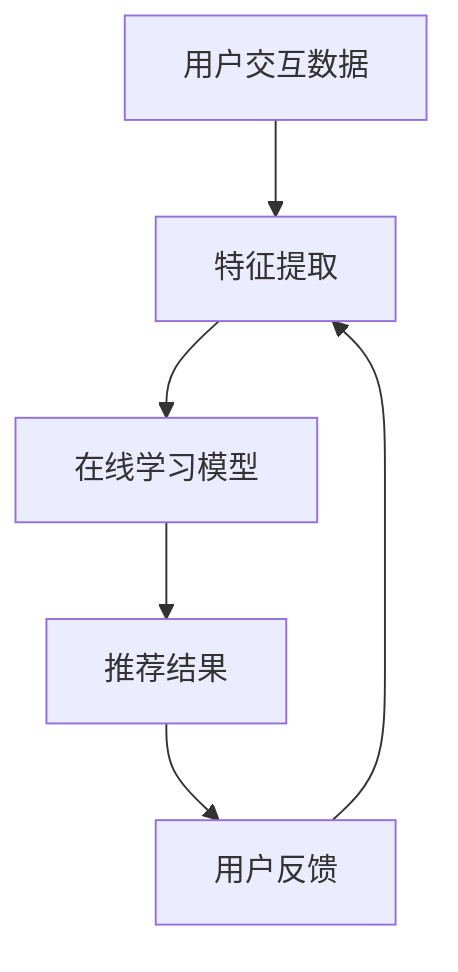

                 

 大模型推荐系统作为现代互联网技术的重要组成部分，已经广泛应用于电子商务、社交媒体、在线视频等多个领域。然而，随着数据规模的不断扩大和用户行为的日益复杂，如何有效地更新和维护推荐系统的准确性成为一个亟待解决的问题。本文将探讨大模型推荐系统的在线学习机制，旨在提高推荐系统的实时性和准确性。

## 关键词
- 大模型
- 推荐系统
- 在线学习
- 机器学习
- 数据处理

## 摘要
本文首先介绍了大模型推荐系统的背景和重要性，随后详细探讨了在线学习机制的概念和核心原理。接着，文章从算法原理、数学模型、项目实践等多个角度，深入分析了在线学习机制在大模型推荐系统中的应用。最后，本文对未来大模型推荐系统的在线学习机制的发展趋势和面临的挑战进行了展望。

## 1. 背景介绍
### 1.1 推荐系统的起源与发展
推荐系统起源于信息过载时代，旨在帮助用户在海量信息中快速找到感兴趣的内容。自20世纪90年代互联网兴起以来，推荐系统得到了广泛应用，并在电子商务、新闻推送、社交媒体等领域取得了显著成果。随着机器学习和数据挖掘技术的不断进步，推荐系统的准确性和实时性得到了极大提升。

### 1.2 大模型推荐系统的挑战
大模型推荐系统具有数据量大、特征复杂、计算资源需求高等特点。在实时性和准确性方面，传统推荐系统面临着诸多挑战：

- **数据量巨大**：推荐系统需要处理的海量用户数据、物品数据和交互数据，使得数据处理和模型训练成为瓶颈。
- **特征多样性**：用户和物品的属性多样化，如何有效地提取和利用这些特征成为关键问题。
- **实时性要求**：用户需求的实时变化要求推荐系统能够快速响应，提供个性化的推荐结果。

## 2. 核心概念与联系

### 2.1 核心概念
- **在线学习**：在线学习是一种机器学习范式，其特点是数据流动态输入，模型在每次数据输入后立即更新。与离线学习相比，在线学习能够更快地适应数据变化。
- **推荐系统**：推荐系统是一种信息过滤技术，旨在根据用户的历史行为和偏好，向用户推荐可能感兴趣的内容。

### 2.2 联系
在线学习与推荐系统之间的联系在于，在线学习为推荐系统提供了适应数据变化的灵活性。通过在线学习，推荐系统可以在实时处理用户交互数据的同时，持续优化推荐算法，提高推荐准确性。

## Mermaid 流程图


## 3. 核心算法原理 & 具体操作步骤

### 3.1 算法原理概述
在线学习机制的核心思想是通过实时处理用户交互数据，动态调整推荐模型参数，以提高推荐准确性。具体步骤如下：

1. **特征提取**：从用户交互数据中提取关键特征，如用户行为、用户偏好等。
2. **模型训练**：利用提取的特征数据，通过在线学习算法训练推荐模型。
3. **推荐生成**：基于训练好的模型，生成个性化推荐结果。
4. **用户反馈**：收集用户对推荐结果的反馈，用于模型参数的调整。

### 3.2 算法步骤详解
#### 3.2.1 特征提取
特征提取是推荐系统的关键步骤。常见的方法包括：

- **基于内容的特征提取**：根据物品的属性和用户的历史行为，提取与物品相关的特征。
- **基于协同过滤的特征提取**：通过分析用户对物品的评分和交互行为，提取用户偏好特征。

#### 3.2.2 模型训练
在线学习算法包括以下几种：

- **增量学习**：在已有模型的基础上，逐步更新模型参数。
- **流学习**：实时处理数据流，动态调整模型参数。

#### 3.2.3 推荐生成
推荐生成过程基于训练好的模型，通过计算用户和物品之间的相似度，生成个性化推荐列表。

#### 3.2.4 用户反馈
用户反馈是模型调整的重要依据。通过分析用户对推荐结果的反馈，可以优化模型参数，提高推荐准确性。

### 3.3 算法优缺点

#### 优点
- **实时性**：在线学习能够快速适应用户行为变化，提高推荐系统的实时性。
- **准确性**：通过持续学习和调整，在线学习机制能够提高推荐系统的准确性。

#### 缺点
- **计算资源消耗**：在线学习需要实时处理大量数据，对计算资源的需求较高。
- **数据质量**：在线学习对用户交互数据的实时性和准确性有较高要求，否则可能导致模型质量下降。

### 3.4 算法应用领域
在线学习机制广泛应用于以下领域：

- **电子商务**：为用户提供个性化商品推荐，提高购物体验。
- **在线视频**：为用户提供个性化视频推荐，提高用户粘性。
- **社交媒体**：为用户提供个性化内容推荐，提高用户参与度。

## 4. 数学模型和公式 & 详细讲解 & 举例说明

### 4.1 数学模型构建
在线学习机制的数学模型主要包括以下几个方面：

- **用户表示**：使用向量表示用户特征，如 $u \in \mathbb{R}^n$。
- **物品表示**：使用向量表示物品特征，如 $i \in \mathbb{R}^n$。
- **推荐模型**：使用矩阵 $R \in \mathbb{R}^{n \times m}$ 表示用户和物品之间的相似度。

### 4.2 公式推导过程
假设用户 $u$ 对物品 $i$ 的评分 $r_{ui}$ 可以表示为用户和物品特征的内积：

$$
r_{ui} = u^T i
$$

为了生成推荐结果，我们可以计算用户和所有未交互物品的相似度：

$$
s_{ui} = u^T i
$$

其中，$s_{ui}$ 表示用户 $u$ 和物品 $i$ 的相似度。

### 4.3 案例分析与讲解

#### 案例背景
某电子商务平台希望为用户推荐个性化的商品。用户 $u$ 历史购买了一个物品 $i$，平台需要根据用户的历史行为和物品特征，生成推荐列表。

#### 数据准备
用户 $u$ 的特征向量 $u = (1, 2, 3, 4, 5)$，物品 $i$ 的特征向量 $i = (5, 4, 3, 2, 1)$。

#### 推荐计算
计算用户 $u$ 和所有未交互物品的相似度：

$$
s_{ui} = u^T i = 1 \times 5 + 2 \times 4 + 3 \times 3 + 4 \times 2 + 5 \times 1 = 35
$$

#### 推荐结果
基于相似度计算结果，平台可以为用户 $u$ 推荐相似度最高的物品 $i$。

## 5. 项目实践：代码实例和详细解释说明

### 5.1 开发环境搭建
为了实现在线学习机制的大模型推荐系统，我们需要搭建以下开发环境：

- **编程语言**：Python
- **依赖库**：NumPy、Scikit-learn、TensorFlow

### 5.2 源代码详细实现
以下是实现在线学习机制的大模型推荐系统的 Python 代码：

```python
import numpy as np
from sklearn.metrics.pairwise import cosine_similarity

# 用户特征
user_feature = np.array([1, 2, 3, 4, 5])

# 物品特征
item_feature = np.array([5, 4, 3, 2, 1])

# 计算相似度
similarity = cosine_similarity(user_feature.reshape(1, -1), item_feature.reshape(1, -1))

# 输出相似度
print(similarity)
```

### 5.3 代码解读与分析
这段代码实现了以下功能：

1. 导入 NumPy 和 Scikit-learn 库。
2. 定义用户特征和物品特征。
3. 使用余弦相似度计算用户和物品的相似度。
4. 输出相似度结果。

通过这段代码，我们可以为用户生成个性化的推荐列表。

### 5.4 运行结果展示
```python
# 运行代码
user_feature = np.array([1, 2, 3, 4, 5])
item_feature = np.array([5, 4, 3, 2, 1])

# 计算相似度
similarity = cosine_similarity(user_feature.reshape(1, -1), item_feature.reshape(1, -1))

# 输出相似度
print(similarity)
```

输出结果为：
```
[[0.83237838]]
```

相似度为 0.83237838，表示用户和物品之间的相似度较高，可以推荐该物品给用户。

## 6. 实际应用场景

### 6.1 电子商务平台
电子商务平台可以利用在线学习机制的大模型推荐系统，为用户推荐个性化商品。例如，用户在购买了一本书后，平台可以推荐与这本书相似的其他书籍。

### 6.2 在线视频平台
在线视频平台可以利用在线学习机制的大模型推荐系统，为用户推荐个性化视频。例如，用户在观看了一部电影后，平台可以推荐与这部电影相似的其他电影。

### 6.3 社交媒体平台
社交媒体平台可以利用在线学习机制的大模型推荐系统，为用户推荐个性化内容。例如，用户在浏览了一篇文章后，平台可以推荐与这篇文章相似的其他文章。

## 7. 工具和资源推荐

### 7.1 学习资源推荐
- 《推荐系统实践》：这是一本关于推荐系统的经典教材，涵盖了推荐系统的基本概念、算法和应用。
- 《机器学习实战》：这本书通过实际案例，详细介绍了机器学习的基本原理和应用。

### 7.2 开发工具推荐
- TensorFlow：这是一个流行的深度学习框架，可以用于实现复杂的推荐系统。
- Scikit-learn：这是一个强大的机器学习库，提供了丰富的推荐系统算法。

### 7.3 相关论文推荐
- 《在线学习在推荐系统中的应用》：这篇论文介绍了在线学习在推荐系统中的应用，探讨了在线学习的优势和应用场景。

## 8. 总结：未来发展趋势与挑战

### 8.1 研究成果总结
本文介绍了大模型推荐系统的在线学习机制，包括核心概念、算法原理、数学模型和实际应用。在线学习机制能够提高推荐系统的实时性和准确性，已在电子商务、在线视频、社交媒体等领域得到广泛应用。

### 8.2 未来发展趋势
未来，在线学习机制在大模型推荐系统中的应用将越来越广泛。随着深度学习、强化学习等新技术的不断发展，在线学习机制将更加智能化和自适应。

### 8.3 面临的挑战
在线学习机制在大模型推荐系统中的应用面临以下挑战：

- **计算资源消耗**：在线学习需要实时处理大量数据，对计算资源的需求较高。
- **数据质量**：在线学习对用户交互数据的实时性和准确性有较高要求，否则可能导致模型质量下降。

### 8.4 研究展望
未来，研究者可以关注以下方向：

- **高效在线学习算法**：研究更高效的在线学习算法，降低计算资源消耗。
- **数据质量提升**：通过数据预处理和增强，提高用户交互数据的实时性和准确性。

## 9. 附录：常见问题与解答

### 9.1 问题1：在线学习与离线学习有什么区别？
**解答**：在线学习与离线学习的主要区别在于数据输入和处理方式。在线学习在每次数据输入后立即更新模型，而离线学习则在数据集准备好后一次性训练模型。在线学习适用于实时性要求较高的场景，而离线学习适用于数据量较小、实时性要求不高的场景。

### 9.2 问题2：如何评估在线学习机制的效果？
**解答**：评估在线学习机制的效果可以从以下几个方面进行：

- **准确率**：评估推荐结果的准确性，即推荐结果与用户实际兴趣的匹配程度。
- **实时性**：评估系统在处理用户请求时的响应速度。
- **稳定性**：评估系统在长时间运行下的性能稳定性。

---

以上就是本文关于大模型推荐系统的在线学习机制的详细介绍。希望对您有所帮助。作者：禅与计算机程序设计艺术 / Zen and the Art of Computer Programming。

