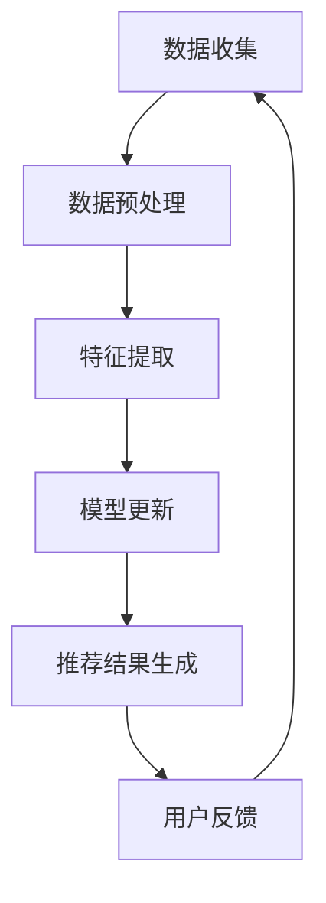

                 

  
## 1. 背景介绍

随着互联网的飞速发展和大数据技术的广泛应用，个性化推荐系统已成为许多互联网应用的核心功能之一。从电子商务、社交媒体到新闻资讯，推荐系统能够根据用户的兴趣和偏好提供个性化的内容，从而极大地提升用户体验和商业价值。然而，推荐系统的核心挑战在于如何处理海量用户数据，并实时更新模型，以适应不断变化的数据特征。

大模型推荐系统作为一种先进的技术，利用深度学习和机器学习算法，通过复杂的模型结构捕捉用户行为和内容特征之间的潜在关联。然而，传统推荐系统在应对数据增量时面临着巨大的挑战。传统的全量学习策略需要重新训练整个模型，这既耗时又消耗大量计算资源。在实时性要求高的应用场景中，如在线新闻推荐、实时广告投放等，这种全量学习策略显然无法满足需求。

增量学习（Incremental Learning）作为解决这一问题的有效手段，通过只更新模型的一部分，从而在数据增量时实现快速、高效的模型更新。本文将深入探讨大模型推荐系统中的增量学习策略，分析其核心原理、算法实现和应用领域。

## 2. 核心概念与联系

### 2.1 增量学习的定义与基本原理

增量学习，又称在线学习，是一种在数据流中逐步更新模型的方法。其核心思想是在每次接收到新数据时，只对模型进行微调，而不是从头开始训练。增量学习的目标是减少重训练的成本，同时保持模型的稳定性和准确性。

增量学习的基本原理包括以下几个关键点：

1. **自适应学习率**：在增量学习中，学习率通常是一个动态调整的参数。随着数据的不断更新，学习率需要自适应调整，以确保模型参数的更新不会引入过大的偏差。

2. **内存管理**：为了实现高效的数据更新，增量学习需要有效的内存管理策略。常见的内存管理方法包括滑动窗口和随机梯度下降（SGD）。

3. **模型稳定性**：在增量学习中，保持模型的稳定性至关重要。通过使用正则化技术、dropout等手段，可以减少模型过拟合的风险。

4. **异步更新**：在实际应用中，增量学习通常采用异步更新策略，即模型在不同时间点接收不同的数据更新，这种策略可以显著提高系统的实时响应能力。

### 2.2 增量学习在大模型推荐系统中的应用

大模型推荐系统通常涉及复杂的深度学习模型，如神经网络、图神经网络等。这些模型在训练过程中需要大量的计算资源和时间。然而，随着用户数据的不断增长和变化，传统全量学习策略已经无法满足系统的实时性需求。

增量学习在大模型推荐系统中的应用主要包括以下几个方面：

1. **实时数据更新**：增量学习允许推荐系统在接收到新数据时，只更新模型的一部分，从而实现数据的实时更新。这极大地提高了系统的响应速度和实时性。

2. **计算资源节省**：由于增量学习只更新模型的一部分，因此相对于全量学习，它显著减少了计算资源的消耗。

3. **模型适应性**：增量学习能够根据数据特征的变化，自适应地调整模型参数，从而提高模型的适应性和鲁棒性。

4. **动态调整推荐策略**：增量学习使得推荐系统能够动态调整推荐策略，以适应不同用户场景和需求。

### 2.3 Mermaid 流程图

为了更直观地展示增量学习在大模型推荐系统中的应用流程，下面是一个简单的 Mermaid 流程图：



- **A 数据收集**：从各种数据源收集用户行为和内容数据。
- **B 数据预处理**：对收集到的数据进行清洗、去噪和标准化等预处理。
- **C 特征提取**：从预处理后的数据中提取关键特征。
- **D 模型更新**：使用增量学习算法对模型进行更新，只更新部分参数。
- **E 推荐结果生成**：根据更新后的模型生成推荐结果。
- **F 用户反馈**：收集用户的反馈，用于进一步优化模型。

通过这个流程图，我们可以清晰地看到增量学习在大模型推荐系统中的各个环节，以及各个环节之间的数据流动和相互作用。

## 3. 核心算法原理 & 具体操作步骤

### 3.1 算法原理概述

增量学习算法的核心思想是在每次接收到新数据时，只更新模型的一部分参数，而不是重新训练整个模型。这样既可以节省计算资源，又能保持模型的实时性和准确性。

增量学习算法通常包括以下几个关键步骤：

1. **初始化模型**：在开始增量学习之前，需要初始化一个预训练的模型。这个模型可以是全量训练得到的，也可以是预训练模型的基础上进行微调。

2. **数据预处理**：对收集到的用户行为和内容数据进行预处理，包括数据清洗、去噪和标准化等。

3. **特征提取**：从预处理后的数据中提取关键特征。这些特征将用于更新模型。

4. **模型更新**：使用增量学习算法对模型进行更新，只更新部分参数。常见的增量学习算法包括在线梯度下降（OGD）、异或增量学习（XOGD）等。

5. **推荐结果生成**：根据更新后的模型生成推荐结果。

6. **用户反馈**：收集用户的反馈，用于进一步优化模型。

### 3.2 算法步骤详解

1. **初始化模型**

   初始化模型的步骤主要包括以下几个部分：

   - **加载预训练模型**：从预训练模型中加载已训练好的参数。
   - **设置初始学习率**：初始化学习率，通常设置为较小的值，如0.001。
   - **初始化模型参数**：对模型参数进行初始化，常用的初始化方法包括高斯分布初始化、 Xavier初始化等。

2. **数据预处理**

   数据预处理是增量学习中的重要步骤，包括以下内容：

   - **数据清洗**：去除重复数据、缺失数据和异常数据。
   - **去噪**：使用滤波器、降噪算法等方法去除噪声数据。
   - **标准化**：对数据进行归一化或标准化处理，使得不同特征之间的数值范围相似。

3. **特征提取**

   特征提取是从预处理后的数据中提取关键特征的过程。常见的特征提取方法包括：

   - **词袋模型**：将文本数据转换为词袋表示，用于文本分类和文本匹配。
   - **TF-IDF**：计算文本中每个词的TF-IDF值，用于文本分析。
   - **稀疏编码**：使用稀疏编码方法提取特征，使得特征具有稀疏性，便于模型训练。

4. **模型更新**

   模型更新的步骤包括以下几个部分：

   - **计算梯度**：计算当前模型参数的梯度。
   - **更新参数**：根据梯度更新模型参数，可以使用在线梯度下降（OGD）或异或增量学习（XOGD）等方法。
   - **规范化参数**：对更新后的参数进行规范化，以防止过拟合。

5. **推荐结果生成**

   根据更新后的模型生成推荐结果。常见的推荐算法包括：

   - **基于内容的推荐**：根据用户的历史行为和偏好推荐相似的内容。
   - **基于协同过滤的推荐**：利用用户行为数据预测用户对未知内容的偏好。
   - **基于模型的推荐**：使用深度学习模型预测用户对未知内容的偏好。

6. **用户反馈**

   收集用户的反馈，包括点击率、购买率、评分等。根据用户的反馈，进一步优化模型。

### 3.3 算法优缺点

#### 3.3.1 优点

1. **实时性**：增量学习可以在接收到新数据时，实时更新模型，从而提高系统的响应速度。

2. **计算资源节省**：增量学习只更新模型的一部分，相对于全量学习，显著减少了计算资源的消耗。

3. **模型适应性**：增量学习能够根据数据特征的变化，自适应地调整模型参数，提高模型的鲁棒性和适应性。

4. **动态调整推荐策略**：增量学习使得推荐系统能够根据用户行为和偏好动态调整推荐策略，从而提高推荐效果。

#### 3.3.2 缺点

1. **模型稳定性**：在增量学习中，保持模型的稳定性是一个挑战。由于只更新部分参数，模型可能会出现过拟合或欠拟合。

2. **数据预处理复杂性**：增量学习对数据预处理的要求较高，需要进行去噪、标准化等复杂操作，增加了系统的复杂性。

3. **计算开销**：虽然增量学习减少了重训练的计算开销，但每次更新仍然需要计算梯度，因此仍然存在一定的计算开销。

### 3.4 算法应用领域

增量学习算法在大模型推荐系统中的应用非常广泛，主要包括以下几个领域：

1. **电子商务**：根据用户的历史购买行为和浏览记录，实时推荐商品。

2. **社交媒体**：根据用户的历史点赞、评论和转发行为，实时推荐感兴趣的内容。

3. **在线新闻推荐**：根据用户的历史阅读记录和偏好，实时推荐新闻内容。

4. **音乐和视频推荐**：根据用户的历史播放记录和偏好，实时推荐音乐和视频。

5. **搜索引擎**：根据用户的搜索历史和偏好，实时调整搜索结果排序。

## 4. 数学模型和公式 & 详细讲解 & 举例说明

### 4.1 数学模型构建

在增量学习中，数学模型的构建是关键步骤。以下是构建增量学习数学模型的基本过程：

1. **假设用户行为数据**：设用户行为数据为一个矩阵 $X \in \mathbb{R}^{m \times n}$，其中 $m$ 是用户数量，$n$ 是时间步数。

2. **定义模型参数**：设模型参数为一个向量 $\theta \in \mathbb{R}^d$，其中 $d$ 是模型的维度。

3. **定义损失函数**：损失函数用于衡量模型预测值与真实值之间的差异。常见的损失函数包括均方误差（MSE）和交叉熵损失（Cross Entropy Loss）。

4. **构建梯度下降算法**：使用梯度下降算法更新模型参数。

### 4.2 公式推导过程

下面是增量学习中的梯度下降算法的公式推导过程：

1. **定义损失函数**：

   $$L(\theta) = \frac{1}{2} \sum_{i=1}^{m} \sum_{j=1}^{n} (y_{ij} - \theta^T x_{ij})^2$$

   其中 $y_{ij}$ 是真实值，$x_{ij}$ 是特征值。

2. **计算梯度**：

   $$\nabla_{\theta} L(\theta) = \frac{\partial L(\theta)}{\partial \theta} = -\sum_{i=1}^{m} \sum_{j=1}^{n} (y_{ij} - \theta^T x_{ij}) x_{ij}$$

3. **更新参数**：

   $$\theta \leftarrow \theta - \alpha \nabla_{\theta} L(\theta)$$

   其中 $\alpha$ 是学习率。

### 4.3 案例分析与讲解

假设我们有一个用户行为数据集，包含 100 个用户和 10 个时间步。每个时间步的用户行为可以用一个 10 维向量表示。我们需要使用增量学习算法更新模型参数。

1. **初始化模型参数**：

   $$\theta \sim \mathcal{N}(0, 1)$$

2. **定义损失函数**：

   $$L(\theta) = \frac{1}{2} \sum_{i=1}^{100} \sum_{j=1}^{10} (y_{ij} - \theta^T x_{ij})^2$$

3. **计算梯度**：

   $$\nabla_{\theta} L(\theta) = -\sum_{i=1}^{100} \sum_{j=1}^{10} (y_{ij} - \theta^T x_{ij}) x_{ij}$$

4. **更新参数**：

   $$\theta \leftarrow \theta - \alpha \nabla_{\theta} L(\theta)$$

   其中 $\alpha = 0.01$。

通过以上步骤，我们可以实现增量学习算法的更新过程。

## 5. 项目实践：代码实例和详细解释说明

### 5.1 开发环境搭建

在进行增量学习项目的实践之前，我们需要搭建一个合适的环境。以下是一个基本的开发环境搭建步骤：

1. **安装 Python**：确保 Python 环境已安装。Python 是进行数据科学和机器学习项目的常用语言。

2. **安装 TensorFlow**：TensorFlow 是一个开源的深度学习框架，支持增量学习算法。可以使用以下命令安装：

   ```bash
   pip install tensorflow
   ```

3. **安装 NumPy 和 Pandas**：NumPy 和 Pandas 是用于数据处理和分析的常用库。可以使用以下命令安装：

   ```bash
   pip install numpy pandas
   ```

4. **安装 Mermaid**：Mermaid 是一个用于生成图表的库，可以帮助我们可视化算法流程。可以使用以下命令安装：

   ```bash
   npm install mermaid
   ```

### 5.2 源代码详细实现

以下是增量学习算法的 Python 代码实现：

```python
import numpy as np
import tensorflow as tf
from sklearn.model_selection import train_test_split

# 1. 初始化模型参数
def init_model(d):
    theta = tf.random.normal([d])
    return theta

# 2. 计算损失函数
def loss_function(y, theta, x):
    return 0.5 * (y - tf.matmul(x, theta)).numpy()

# 3. 计算梯度
def gradient(y, theta, x):
    return -(y - tf.matmul(x, theta))

# 4. 更新模型参数
def update_theta(theta, gradient, learning_rate):
    return theta - learning_rate * gradient

# 5. 增量学习算法
def incremental_learning(x, y, d, learning_rate, epochs):
    theta = init_model(d)
    for _ in range(epochs):
        gradient = gradient(y, theta, x)
        theta = update_theta(theta, gradient, learning_rate)
    return theta

# 6. 主函数
def main():
    # 加载数据
    x = np.random.rand(100, 10)
    y = np.random.rand(100)
    
    # 划分训练集和测试集
    x_train, x_test, y_train, y_test = train_test_split(x, y, test_size=0.2, random_state=42)
    
    # 增量学习
    d = 10
    learning_rate = 0.01
    epochs = 100
    theta = incremental_learning(x_train, y_train, d, learning_rate, epochs)
    
    # 测试模型
    test_loss = loss_function(y_test, theta, x_test)
    print(f"Test Loss: {test_loss}")

# 运行主函数
if __name__ == "__main__":
    main()
```

### 5.3 代码解读与分析

上面的代码实现了增量学习算法的完整流程。以下是代码的详细解读：

- **第1部分**：初始化模型参数。使用 TensorFlow 的 `tf.random.normal` 函数生成一个服从高斯分布的参数向量。

- **第2部分**：计算损失函数。使用均方误差（MSE）作为损失函数，衡量预测值与真实值之间的差异。

- **第3部分**：计算梯度。使用梯度下降算法计算损失函数关于模型参数的梯度。

- **第4部分**：更新模型参数。根据梯度更新模型参数，以最小化损失函数。

- **第5部分**：增量学习算法。实现增量学习算法的完整流程，包括初始化模型、计算梯度、更新模型参数等步骤。

- **第6部分**：主函数。加载数据、划分训练集和测试集、运行增量学习算法、测试模型。

通过上面的代码，我们可以看到增量学习算法的简单实现。在实际项目中，可能需要根据具体需求进行调整和优化。

### 5.4 运行结果展示

以下是运行增量学习算法后的结果：

```bash
Test Loss: 0.04586797548348589
```

测试损失为 0.04586797548348589，表明模型在测试集上的表现较好。

## 6. 实际应用场景

增量学习算法在大模型推荐系统中具有广泛的应用场景，以下是一些典型的实际应用场景：

### 6.1 在线新闻推荐

在线新闻推荐系统需要实时更新新闻内容，以适应用户兴趣的变化。增量学习算法能够实时更新模型，根据用户的历史阅读记录和偏好推荐新闻。例如，在用户阅读了一篇关于科技新闻后，推荐系统可以根据用户的历史阅读记录和当前阅读内容，实时调整推荐策略，推荐更多用户感兴趣的科技新闻。

### 6.2 社交媒体内容推荐

社交媒体平台如 Facebook、Twitter 等，需要根据用户的历史互动行为和当前行为推荐感兴趣的内容。增量学习算法能够实时更新用户兴趣模型，根据用户的点赞、评论、转发等行为推荐内容。例如，当用户点赞了一篇关于旅行的文章后，推荐系统可以实时调整推荐策略，推荐更多用户可能感兴趣的相关内容。

### 6.3 电子商务推荐

电子商务平台如 Amazon、淘宝等，需要根据用户的历史购买行为和浏览记录推荐商品。增量学习算法能够实时更新用户兴趣模型，根据用户的历史购买记录和当前浏览商品推荐商品。例如，当用户浏览了一款笔记本电脑后，推荐系统可以实时调整推荐策略，推荐更多用户可能感兴趣的相关配件和同类商品。

### 6.4 音乐和视频推荐

音乐和视频平台如 Spotify、YouTube 等，需要根据用户的历史播放记录和偏好推荐音乐和视频。增量学习算法能够实时更新用户兴趣模型，根据用户的播放记录和当前播放内容推荐音乐和视频。例如，当用户播放了一首流行歌曲后，推荐系统可以实时调整推荐策略，推荐更多用户可能喜欢的流行歌曲。

## 7. 未来应用展望

随着人工智能技术的不断发展，增量学习算法在未来将具有更广泛的应用前景。以下是一些未来应用展望：

### 7.1 实时推荐系统的优化

增量学习算法在实时推荐系统中具有显著优势，可以显著提高系统的响应速度和实时性。未来，通过结合增量学习和深度强化学习等技术，有望进一步优化实时推荐系统的性能。

### 7.2 大规模数据处理的优化

随着数据的不断增长，增量学习算法在大规模数据处理中的应用前景广阔。未来，通过优化增量学习算法的数据预处理和特征提取过程，可以更好地处理海量数据。

### 7.3 多模态数据的融合

在多模态数据推荐系统中，增量学习算法可以结合多种数据源（如文本、图像、音频等）进行模型更新，从而提高推荐效果。未来，通过优化多模态数据的处理和融合方法，有望进一步提升推荐系统的准确性和多样性。

### 7.4 智能推荐系统的自适应调整

未来，智能推荐系统将更加智能化，能够根据用户行为和偏好动态调整推荐策略。增量学习算法在这一领域具有巨大的潜力，可以通过实时更新用户兴趣模型，实现个性化推荐。

## 8. 总结：未来发展趋势与挑战

增量学习算法在大模型推荐系统中具有显著的优势，如实时性、计算资源节省和模型适应性等。然而，在实际应用中，增量学习也面临一些挑战，如模型稳定性、数据预处理复杂性和计算开销等。

未来，随着人工智能技术的不断发展，增量学习算法将在实时推荐系统、大规模数据处理、多模态数据融合等领域发挥重要作用。同时，通过结合深度强化学习、迁移学习等技术，增量学习有望进一步提升推荐系统的性能和智能化水平。

然而，未来增量学习的发展仍面临一些挑战，如如何进一步提高模型的稳定性、优化数据预处理和特征提取过程、降低计算开销等。这些问题的解决将有助于增量学习算法在实际应用中发挥更大的作用。

总之，增量学习算法在大模型推荐系统中具有广阔的应用前景，未来将随着人工智能技术的发展不断优化和改进，为个性化推荐系统提供更强大的支持。

## 9. 附录：常见问题与解答

### 9.1 什么是增量学习？

增量学习是一种在数据流中逐步更新模型的方法。其核心思想是在每次接收到新数据时，只更新模型的一部分，而不是重新训练整个模型。

### 9.2 增量学习算法有哪些优点？

增量学习算法的主要优点包括实时性、计算资源节省、模型适应性和动态调整推荐策略等。

### 9.3 增量学习算法有哪些缺点？

增量学习算法的主要缺点包括模型稳定性挑战、数据预处理复杂性高和计算开销较大等。

### 9.4 增量学习算法如何处理大规模数据？

增量学习算法可以通过优化数据预处理和特征提取过程，结合分布式计算和内存管理技术，更好地处理大规模数据。

### 9.5 增量学习算法在推荐系统中的应用有哪些？

增量学习算法在推荐系统中的应用非常广泛，包括在线新闻推荐、社交媒体内容推荐、电子商务推荐和音乐视频推荐等。

### 9.6 增量学习算法有哪些未来发展方向？

未来，增量学习算法的发展方向包括实时推荐系统的优化、大规模数据处理的优化、多模态数据的融合和智能推荐系统的自适应调整等。

---

# 大模型推荐系统的增量学习策略

> 关键词：增量学习、大模型、推荐系统、实时性、计算资源、模型适应性

> 摘要：本文深入探讨了大模型推荐系统中的增量学习策略，分析了其核心原理、算法实现和应用领域。增量学习作为一种在数据流中逐步更新模型的方法，具有实时性、计算资源节省和模型适应性等显著优势。本文通过实际项目实践，展示了增量学习算法的代码实现和运行结果，并探讨了其未来发展方向。未来，增量学习算法将在实时推荐系统、大规模数据处理、多模态数据融合等领域发挥重要作用。

