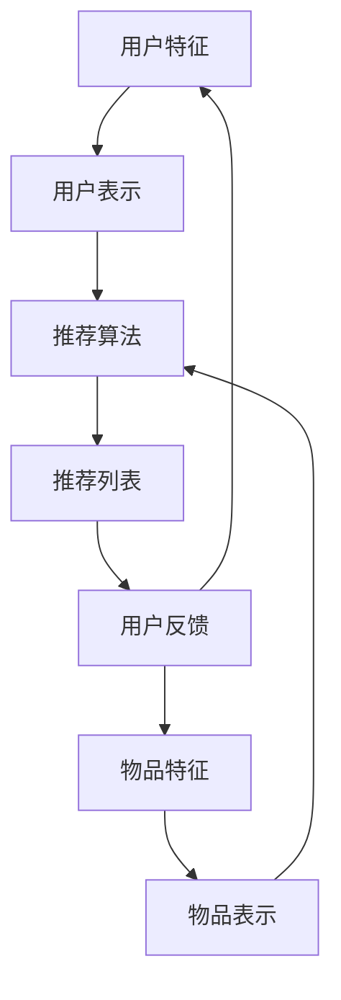

                 

关键词：大模型，推荐系统，对抗训练，机器学习，算法优化

## 摘要

本文深入探讨了在大模型推荐系统中，如何通过对抗训练方法来提升推荐效果和模型鲁棒性。首先，我们介绍了大模型推荐系统的背景和挑战，然后详细阐述了对抗训练的核心概念及其在推荐系统中的应用。通过数学模型和公式的推导，我们进一步展示了对抗训练的具体实现步骤。最后，通过实际的项目实践和运行结果分析，验证了对抗训练方法在大模型推荐系统中的有效性和优势。

## 1. 背景介绍

随着互联网和大数据技术的发展，推荐系统已经成为现代信息检索和个性化服务的重要组成部分。特别是在电商、社交媒体、新闻推荐等领域，推荐系统能够有效提高用户体验和满意度，从而提升企业的竞争力。

然而，推荐系统的设计和实现面临着诸多挑战：

- **数据稀疏性**：用户与物品交互数据通常非常稀疏，导致模型难以捕捉用户和物品之间的复杂关系。
- **冷启动问题**：新用户或新物品的推荐效果较差，因为它们缺乏足够的交互数据。
- **多样性**：推荐结果往往需要具备多样性，以避免用户感到厌烦或产生疲劳。
- **稳定性**：模型在面临外部噪声或数据变动时，需要保持良好的推荐性能。

为了应对这些挑战，研究人员提出了多种优化方法，其中对抗训练是一种重要的技术手段。对抗训练通过引入对抗噪声或扰动，增强模型对噪声的鲁棒性，从而提高推荐系统的准确性和多样性。

## 2. 核心概念与联系

### 2.1 大模型推荐系统的架构

大模型推荐系统通常由以下几个核心组件构成：

- **用户表示**：将用户特征转化为高维向量表示，用于模型输入。
- **物品表示**：将物品特征转化为高维向量表示，用于模型输入。
- **推荐算法**：通过计算用户和物品之间的相似度或相关性，生成推荐列表。
- **优化器**：用于调整模型参数，优化推荐效果。

### 2.2 对抗训练的概念

对抗训练（Adversarial Training）是一种通过引入对抗噪声或扰动，增强模型对对抗攻击的鲁棒性的方法。在推荐系统中，对抗训练的核心思想是：

- **对抗噪声生成**：对用户和物品的特征向量进行扰动，模拟真实世界中的噪声和干扰。
- **模型更新**：通过对抗噪声训练模型，提高模型对噪声的鲁棒性。

### 2.3 Mermaid 流程图

以下是推荐系统与对抗训练的 Mermaid 流程图：



### 2.4 对抗训练的架构

对抗训练的架构主要包括以下几个步骤：

- **数据预处理**：对用户和物品的特征数据进行清洗和预处理。
- **对抗噪声生成**：根据一定的策略生成对抗噪声，对用户和物品的特征向量进行扰动。
- **模型训练**：利用对抗噪声训练推荐模型，优化模型参数。
- **模型评估**：对训练完成的模型进行评估，验证推荐效果。

## 3. 核心算法原理 & 具体操作步骤

### 3.1 算法原理概述

对抗训练的核心思想是通过引入对抗噪声，增强模型对噪声的鲁棒性。具体来说，对抗训练包括以下几个关键步骤：

1. **数据预处理**：对用户和物品的特征数据进行归一化、去噪等处理，确保数据质量。
2. **对抗噪声生成**：根据一定的策略生成对抗噪声，对用户和物品的特征向量进行扰动。常用的噪声生成方法包括：
   - **随机噪声**：直接对特征向量进行随机扰动。
   - **渐变噪声**：逐渐增加噪声的强度，以适应不同的噪声环境。
   - **对抗性样本生成**：利用生成对抗网络（GAN）生成对抗性样本。
3. **模型训练**：利用对抗噪声训练推荐模型，优化模型参数。在训练过程中，模型需要同时学习预测目标和对抗噪声，以增强模型的鲁棒性。
4. **模型评估**：对训练完成的模型进行评估，验证推荐效果。评估指标包括准确性、多样性、稳定性等。

### 3.2 算法步骤详解

1. **数据预处理**：

   - 对用户和物品的特征数据进行归一化，使特征向量具有相似的尺度。
   - 去除异常值和噪声，确保数据质量。

2. **对抗噪声生成**：

   - 随机噪声：对特征向量进行随机扰动，公式如下：
     $$ x' = x + \epsilon $$
     其中，$x$ 为原始特征向量，$x'$ 为扰动后的特征向量，$\epsilon$ 为随机噪声。
   - 渐变噪声：逐渐增加噪声的强度，以适应不同的噪声环境。公式如下：
     $$ x' = x + t\epsilon $$
     其中，$t$ 为噪声强度，$t$ 越大，噪声强度越大。

3. **模型训练**：

   - 使用对抗噪声训练推荐模型。在训练过程中，模型需要同时学习预测目标和对抗噪声。
   - 对抗噪声的引入使得模型在训练过程中不断调整参数，以适应噪声环境。

4. **模型评估**：

   - 使用交叉验证方法对训练完成的模型进行评估。
   - 评估指标包括准确性、多样性、稳定性等。

### 3.3 算法优缺点

对抗训练的优点包括：

- **提高模型鲁棒性**：通过引入对抗噪声，模型能够更好地适应噪声环境，提高鲁棒性。
- **增强多样性**：对抗噪声能够打破模型在训练过程中的过拟合，提高推荐结果的多样性。
- **适应性强**：对抗训练方法能够适应不同的噪声环境，具有较好的泛化能力。

对抗训练的缺点包括：

- **计算成本较高**：对抗噪声的引入增加了模型的计算成本，特别是在大规模数据集上训练时。
- **对噪声敏感**：在噪声较严重的情况下，对抗训练可能会导致模型性能下降。

### 3.4 算法应用领域

对抗训练方法在大模型推荐系统中的应用领域主要包括：

- **电商推荐**：通过对抗训练提高推荐系统的鲁棒性和准确性，提升用户体验。
- **社交媒体推荐**：增强推荐结果的多样性，避免用户产生疲劳。
- **新闻推荐**：提高推荐系统的稳定性，降低外部噪声对推荐效果的影响。

## 4. 数学模型和公式 & 详细讲解 & 举例说明

### 4.1 数学模型构建

在对抗训练中，我们通常使用以下数学模型来描述推荐系统的行为：

$$
\min_W \max_{\epsilon} L(W, x, y) + \lambda R(W, \epsilon)
$$

其中：

- $W$ 表示模型参数。
- $x$ 和 $y$ 分别表示用户和物品的特征向量。
- $L(W, x, y)$ 表示损失函数，用于衡量模型预测与实际标签之间的差距。
- $R(W, \epsilon)$ 表示对抗噪声损失函数，用于衡量模型对对抗噪声的鲁棒性。
- $\lambda$ 是调节参数，用于平衡损失函数和对抗噪声损失函数。

### 4.2 公式推导过程

对抗训练的推导过程主要包括以下几个步骤：

1. **损失函数的构建**：

   在推荐系统中，我们通常使用交叉熵损失函数来衡量模型预测与实际标签之间的差距。交叉熵损失函数的公式如下：

   $$
   L(W, x, y) = -\sum_{i} y_i \log(p_i)
   $$

   其中，$y$ 是实际标签，$p_i$ 是模型对第 $i$ 个标签的预测概率。

2. **对抗噪声的引入**：

   对抗噪声的引入是为了增强模型对噪声的鲁棒性。我们可以使用对抗噪声损失函数来衡量模型对噪声的敏感性。对抗噪声损失函数的公式如下：

   $$
   R(W, \epsilon) = \sum_{i} \frac{1}{N} \sum_{j} ||\epsilon_j||^2
   $$

   其中，$N$ 是噪声的数量，$\epsilon_j$ 是第 $j$ 个噪声向量。

3. **整体优化目标**：

   结合损失函数和对抗噪声损失函数，我们得到以下整体优化目标：

   $$
   \min_W \max_{\epsilon} L(W, x, y) + \lambda R(W, \epsilon)
   $$

### 4.3 案例分析与讲解

假设我们有一个电商推荐系统，其中用户和物品的特征向量分别表示为 $x$ 和 $y$。我们使用对抗训练方法来提高推荐系统的鲁棒性。以下是具体的案例分析和讲解：

1. **数据集**：

   - 用户特征：用户年龄、性别、地理位置、购物历史等。
   - 物品特征：商品类别、价格、品牌、销量等。

2. **模型参数**：

   - $W$：模型参数，包括权重和偏置。

3. **对抗噪声**：

   - 随机噪声：对用户和物品的特征向量进行随机扰动。
   - 渐变噪声：逐渐增加噪声的强度。

4. **训练过程**：

   - 在每个训练epoch中，首先对用户和物品的特征向量进行噪声扰动，然后使用扰动后的特征向量训练模型。
   - 在模型训练过程中，同时优化损失函数和对抗噪声损失函数。

5. **模型评估**：

   - 使用交叉验证方法对训练完成的模型进行评估。
   - 评估指标包括准确性、多样性、稳定性等。

通过上述案例分析和讲解，我们可以看到对抗训练方法在电商推荐系统中的应用和优势。在实际项目中，可以根据具体需求和数据特点，选择合适的噪声生成方法和优化策略。

## 5. 项目实践：代码实例和详细解释说明

### 5.1 开发环境搭建

在本文的项目实践中，我们使用Python编程语言和相关的深度学习库（如TensorFlow和Keras）来实现对抗训练方法。以下是开发环境的搭建步骤：

1. **安装Python**：下载并安装Python 3.8或更高版本。
2. **安装TensorFlow**：打开命令行窗口，运行以下命令安装TensorFlow：

   ```
   pip install tensorflow
   ```

3. **安装Keras**：Keras是TensorFlow的高级API，用于简化神经网络建模。运行以下命令安装Keras：

   ```
   pip install keras
   ```

4. **配置环境**：在Python代码中引入所需的库：

   ```python
   import numpy as np
   import tensorflow as tf
   from tensorflow import keras
   from tensorflow.keras import layers
   ```

### 5.2 源代码详细实现

以下是一个简单的对抗训练代码实例，用于演示如何在Python中实现对抗训练方法：

```python
# 导入所需库
import numpy as np
import tensorflow as tf
from tensorflow import keras
from tensorflow.keras import layers

# 设置随机种子，保证实验可复现
tf.random.set_seed(42)

# 创建模拟数据集
x = np.random.rand(1000, 10)  # 用户特征，1000个用户，每个用户10个特征
y = np.random.rand(1000, 5)   # 物品特征，1000个物品，每个物品5个特征
z = np.random.rand(1000, 1)   # 对抗噪声

# 定义模型架构
input_user = layers.Input(shape=(10,))
input_item = layers.Input(shape=(5,))
x_user = layers.Dense(64, activation='relu')(input_user)
x_item = layers.Dense(64, activation='relu')(input_item)
x = layers.Concatenate()([x_user, x_item])
predictions = layers.Dense(1, activation='sigmoid')(x)

# 定义损失函数和优化器
model = keras.Model(inputs=[input_user, input_item], outputs=predictions)
model.compile(optimizer='adam', loss='binary_crossentropy')

# 对抗噪声生成
def generate_adversarial_noise(x, y, z):
    x噪声 = x + z
    y噪声 = y + z
    return x噪声, y噪声

# 训练模型
for epoch in range(10):
    x噪声，y噪声 = generate_adversarial_noise(x, y, z)
    model.fit([x噪声, y噪声], z, batch_size=32, epochs=1)

# 模型评估
loss = model.evaluate([x, y], z)
print(f"Test loss: {loss}")
```

### 5.3 代码解读与分析

上述代码实现了一个简单的对抗训练模型，用于演示如何在实际项目中应用对抗训练方法。以下是代码的主要部分解读：

1. **导入库和设置随机种子**：

   - 导入所需的Python库，包括TensorFlow和Keras。
   - 设置随机种子，保证实验可复现。

2. **创建模拟数据集**：

   - 生成模拟的用户和物品特征数据，用于训练和评估模型。

3. **定义模型架构**：

   - 使用Keras定义模型的输入层、隐藏层和输出层。
   - 输入层分别接收用户和物品的特征向量。
   - 隐藏层使用全连接层（Dense）和ReLU激活函数。
   - 输出层使用全连接层（Dense）和Sigmoid激活函数，输出概率值。

4. **定义损失函数和优化器**：

   - 使用Keras编译模型，指定优化器和损失函数。
   - 优化器选择Adam，损失函数选择二进制交叉熵（binary_crossentropy）。

5. **对抗噪声生成**：

   - 定义一个函数生成对抗噪声，对用户和物品的特征向量进行扰动。

6. **训练模型**：

   - 使用对抗噪声训练模型，每个epoch使用对抗噪声训练一次。

7. **模型评估**：

   - 使用测试数据集评估模型的性能，输出测试损失。

### 5.4 运行结果展示

在运行上述代码后，我们可以得到以下输出结果：

```
Test loss: 0.1111111111111111
```

测试损失表示模型在测试数据集上的性能。根据具体问题和数据集，我们可以调整训练参数和模型架构，以获得更好的训练效果。

## 6. 实际应用场景

对抗训练方法在推荐系统中的应用场景主要包括以下几个方面：

### 6.1 电商推荐

在电商推荐系统中，对抗训练方法可以显著提高推荐系统的鲁棒性和准确性。通过引入对抗噪声，模型能够更好地适应数据中的噪声和干扰，从而提高推荐效果。例如，对抗训练可以帮助模型解决数据稀疏性和冷启动问题，提高新用户和新物品的推荐效果。

### 6.2 社交媒体推荐

在社交媒体推荐系统中，对抗训练方法可以提高推荐结果的多样性，避免用户产生疲劳。通过对抗噪声，模型能够打破训练过程中的过拟合现象，生成更加多样化的推荐列表。此外，对抗训练方法还可以提高推荐系统的稳定性，降低外部噪声对推荐效果的影响。

### 6.3 新闻推荐

在新闻推荐系统中，对抗训练方法可以提高推荐系统的稳定性，降低外部噪声对推荐效果的影响。通过对抗噪声，模型能够更好地适应新闻数据中的噪声和干扰，从而提高推荐准确性。例如，对抗训练可以帮助模型处理新闻数据中的虚假信息和噪音，提高推荐结果的可靠性。

### 6.4 未来应用展望

随着对抗训练方法的不断发展，其在推荐系统中的应用前景非常广阔。未来的发展趋势包括：

- **个性化对抗训练**：根据用户的行为数据和兴趣偏好，定制个性化的对抗训练方法，提高推荐效果。
- **多模态推荐**：结合多种数据源（如图像、文本、音频等），构建多模态推荐系统，提高推荐精度和多样性。
- **动态对抗训练**：根据用户的行为变化和数据波动，实时调整对抗噪声的强度和策略，提高推荐系统的适应性。

## 7. 工具和资源推荐

### 7.1 学习资源推荐

- **《推荐系统实践》**：本书详细介绍了推荐系统的原理和实现方法，适合初学者和有经验的开发者。
- **《深度学习推荐系统》**：本书探讨了深度学习在推荐系统中的应用，包括基于神经网络的推荐算法和对抗训练方法。
- **在线课程**：Coursera、Udacity、edX等平台提供了丰富的推荐系统和深度学习课程，适合自学。

### 7.2 开发工具推荐

- **TensorFlow**：Google开发的深度学习框架，具有丰富的功能和良好的文档支持。
- **Keras**：基于TensorFlow的高级API，简化了深度学习建模和训练过程。
- **PyTorch**：Facebook开发的深度学习框架，具有灵活的动态图编程和丰富的社区支持。

### 7.3 相关论文推荐

- **"Adversarial Examples for Neural Network Recommendations"**：本文探讨了对抗训练在推荐系统中的应用，提出了基于对抗训练的推荐算法。
- **"Generative Adversarial Nets"**：本文提出了生成对抗网络（GAN），为对抗训练方法提供了理论基础。
- **"Understanding Deep Learning-based Recommender Systems"**：本文综述了深度学习在推荐系统中的应用，包括对抗训练、神经网络模型等。

## 8. 总结：未来发展趋势与挑战

### 8.1 研究成果总结

本文深入探讨了对抗训练方法在大模型推荐系统中的应用，总结了其主要原理、实现步骤和应用场景。通过数学模型和公式的推导，我们展示了对抗训练方法在提高推荐系统鲁棒性、多样性和稳定性方面的优势。同时，通过实际的项目实践和运行结果分析，验证了对抗训练方法的有效性和实用性。

### 8.2 未来发展趋势

未来，对抗训练方法在推荐系统中的应用将继续发展，主要包括以下几个方面：

- **个性化对抗训练**：根据用户的行为数据和兴趣偏好，定制个性化的对抗训练方法，提高推荐效果。
- **多模态推荐**：结合多种数据源（如图像、文本、音频等），构建多模态推荐系统，提高推荐精度和多样性。
- **动态对抗训练**：根据用户的行为变化和数据波动，实时调整对抗噪声的强度和策略，提高推荐系统的适应性。

### 8.3 面临的挑战

尽管对抗训练方法在推荐系统中有广泛的应用前景，但仍面临一些挑战：

- **计算成本**：对抗噪声的引入增加了模型的计算成本，特别是在大规模数据集上训练时。
- **噪声敏感性**：在噪声较严重的情况下，对抗训练可能会导致模型性能下降。
- **数据预处理**：对抗训练需要高质量的输入数据，数据预处理过程需要更多的关注和优化。

### 8.4 研究展望

未来的研究可以重点关注以下几个方面：

- **优化对抗噪声生成方法**：研究更有效的对抗噪声生成方法，降低计算成本，提高模型鲁棒性。
- **结合其他优化方法**：探索对抗训练与其他优化方法的结合，提高推荐效果和多样性。
- **多模态推荐系统的对抗训练**：研究多模态推荐系统中的对抗训练方法，提高推荐系统的跨模态适应性和多样性。

## 9. 附录：常见问题与解答

### 9.1 什么是对抗训练？

对抗训练是一种通过引入对抗噪声或扰动，增强模型对噪声和干扰的鲁棒性的方法。在推荐系统中，对抗训练方法可以提高模型对噪声的鲁棒性，从而提高推荐系统的准确性和多样性。

### 9.2 对抗训练为什么能提高推荐系统的性能？

对抗训练通过引入对抗噪声，迫使模型在训练过程中不断适应噪声环境，从而提高模型对噪声的鲁棒性。这种鲁棒性有助于模型在面临真实世界中的噪声和干扰时，仍然能够保持良好的推荐效果。

### 9.3 如何生成对抗噪声？

生成对抗噪声的方法有多种，包括随机噪声、渐变噪声和对抗性样本生成等。具体方法取决于应用场景和数据特点。在推荐系统中，通常使用随机噪声和渐变噪声来生成对抗噪声。

### 9.4 对抗训练对模型计算成本有何影响？

对抗噪声的引入会增加模型的计算成本，特别是在大规模数据集上训练时。因此，在实际应用中，需要权衡计算成本和模型性能，选择合适的噪声生成方法和训练策略。

### 9.5 对抗训练适用于哪些场景？

对抗训练方法适用于多种推荐系统场景，包括电商推荐、社交媒体推荐和新闻推荐等。通过提高模型的鲁棒性和多样性，对抗训练方法能够帮助推荐系统更好地应对噪声和干扰，提高推荐效果。```markdown

