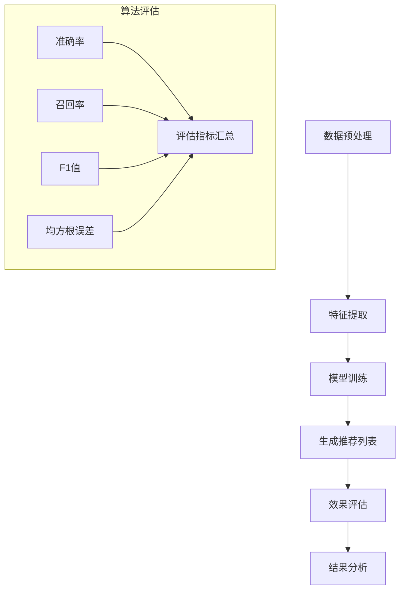

                 

关键词：大模型推荐系统，效果评估，性能指标，数学模型，实际应用

> 摘要：本文将深入探讨大模型推荐系统的效果评估方法。通过介绍推荐系统的基本概念、核心算法原理以及评估指标，我们将系统地阐述如何使用数学模型和公式来评估推荐系统的性能，并结合实际项目实践进行详细解读。文章旨在为研究人员和工程师提供一套科学、有效的评估方法，以指导实际应用和未来发展方向。

## 1. 背景介绍

随着互联网和移动设备的普及，个性化推荐系统已经成为现代信息系统中不可或缺的一部分。从电商网站的商品推荐，到新闻门户的内容推送，再到社交媒体的好友推荐，推荐系统在提高用户体验、提升业务收益方面发挥着重要作用。然而，推荐系统的效果评估却是一个复杂且关键的问题。有效的评估方法不仅可以帮助我们判断系统的性能，还可以指导系统的优化和改进。

本文将围绕大模型推荐系统的效果评估展开讨论。大模型推荐系统通常基于深度学习等技术，能够处理海量数据并生成高质量的推荐结果。但由于模型复杂度高、数据多样性强，传统的评估方法往往无法全面反映系统的实际效果。因此，本文旨在提供一套科学、系统的评估方法，以帮助研究人员和工程师更好地理解和优化推荐系统。

## 2. 核心概念与联系

在讨论推荐系统的效果评估之前，我们需要先了解一些核心概念和它们之间的联系。

### 2.1 推荐系统的基本概念

推荐系统（Recommendation System）是一种能够根据用户的历史行为、兴趣偏好等信息，向用户推荐感兴趣的内容或商品的系统。推荐系统通常包括以下几个关键组成部分：

- **用户（User）**：推荐系统中的用户是其核心，其行为和偏好是推荐系统数据的基础。
- **项目（Item）**：项目是指推荐系统中推荐给用户的内容或商品，如电影、商品、新闻等。
- **评分（Rating）**：评分是用户对项目的评价，可以是显式评分（如5星评价）或隐式评分（如点击、购买等行为）。
- **推荐列表（Recommendation List）**：推荐列表是推荐系统根据用户的偏好生成的个性化推荐结果。

### 2.2 推荐系统的核心算法原理

推荐系统主要分为基于内容（Content-Based）和协同过滤（Collaborative Filtering）两大类。

- **基于内容的方法**：该方法通过分析项目的内容特征（如文本、图片、音频等）和用户的历史偏好，利用相似性度量生成推荐列表。其主要优点是能够推荐新颖的内容，但缺点是对稀疏数据的处理能力较弱。
- **协同过滤方法**：该方法基于用户之间的相似性（User-Based）或项目之间的相似性（Item-Based），通过分析用户的历史行为数据来生成推荐列表。其主要优点是能够处理大规模稀疏数据，但缺点是容易陷入“偏好聚合”的问题。

### 2.3 推荐系统的效果评估指标

推荐系统的效果评估通常依赖于以下几个关键指标：

- **准确率（Precision）**：准确率是指推荐列表中实际用户喜欢的项目所占的比例。
- **召回率（Recall）**：召回率是指推荐列表中用户实际喜欢的项目所占的比例。
- **F1值（F1-Score）**：F1值是准确率和召回率的调和平均值，用于综合评估推荐系统的性能。
- **均方根误差（RMSE）**：均方根误差用于评估推荐系统在预测用户偏好时的准确度。

### 2.4 Mermaid 流程图

下面是一个简化的推荐系统效果评估的 Mermaid 流程图，用于展示推荐系统从数据处理到效果评估的全过程。



## 3. 核心算法原理 & 具体操作步骤

### 3.1 算法原理概述

推荐系统效果评估的核心在于算法原理。基于内容的方法和协同过滤方法各有优劣，但它们在效果评估方面有许多共同点。以下将详细介绍这两种方法的基本原理和操作步骤。

#### 基于内容的方法

基于内容的方法主要基于项目内容的相似性进行推荐。具体步骤如下：

1. **项目内容表示**：首先，需要将项目内容转化为向量表示，如使用词袋模型、TF-IDF、Word2Vec等。
2. **用户偏好表示**：同样地，需要将用户的历史偏好转化为向量表示。
3. **相似性度量**：计算项目内容向量与用户偏好向量之间的相似度，如余弦相似度、欧氏距离等。
4. **生成推荐列表**：根据相似度得分，为用户生成推荐列表。

#### 协同过滤方法

协同过滤方法主要基于用户之间的相似性或项目之间的相似性进行推荐。具体步骤如下：

1. **用户相似度计算**：计算用户之间的相似度，如皮尔逊相关系数、余弦相似度等。
2. **项目相似度计算**：计算项目之间的相似度，如基于内容特征的余弦相似度、基于购买历史的Jaccard相似度等。
3. **生成推荐列表**：根据相似度得分，为用户生成推荐列表。

### 3.2 算法步骤详解

#### 基于内容的方法

1. **数据预处理**：对用户行为数据进行清洗和预处理，如去除缺失值、异常值等。
2. **特征提取**：提取用户和项目的特征信息，如用户的历史评分、项目的标签、描述等。
3. **模型训练**：使用训练数据训练模型，如使用SVD进行降维，或使用深度学习模型进行特征提取和融合。
4. **生成推荐列表**：使用训练好的模型为用户生成推荐列表。
5. **效果评估**：使用评估指标（如准确率、召回率、F1值等）对推荐列表进行评估。

#### 协同过滤方法

1. **数据预处理**：对用户行为数据进行清洗和预处理，如去除缺失值、异常值等。
2. **用户相似度计算**：计算用户之间的相似度，如使用皮尔逊相关系数、余弦相似度等。
3. **项目相似度计算**：计算项目之间的相似度，如使用基于内容特征的余弦相似度、基于购买历史的Jaccard相似度等。
4. **生成推荐列表**：根据用户相似度和项目相似度，为用户生成推荐列表。
5. **效果评估**：使用评估指标（如准确率、召回率、F1值等）对推荐列表进行评估。

### 3.3 算法优缺点

#### 域似度方法

优点：

- 能够生成新颖的推荐内容。
- 不依赖于用户评分数据，适合处理稀疏数据。

缺点：

- 对项目内容的理解和表示要求较高。
- 难以处理用户冷启动问题。

#### 协同过滤方法

优点：

- 能够处理大规模稀疏数据。
- 能够根据用户行为数据生成个性化的推荐结果。

缺点：

- 容易陷入偏好聚合问题。
- 对用户冷启动问题难以解决。

### 3.4 算法应用领域

基于内容的方法和协同过滤方法在推荐系统的应用非常广泛，以下是一些常见的应用领域：

- **电商推荐**：如亚马逊、淘宝等电商平台的商品推荐。
- **新闻推荐**：如今日头条、腾讯新闻等的个性化新闻推荐。
- **社交媒体推荐**：如微博、Facebook等社交媒体的好友推荐。

## 4. 数学模型和公式 & 详细讲解 & 举例说明

推荐系统的效果评估离不开数学模型和公式的支持。以下将详细介绍推荐系统常用的数学模型和公式，并通过实际案例进行讲解。

### 4.1 数学模型构建

推荐系统的数学模型通常包括以下几个部分：

- **用户行为数据模型**：如用户评分矩阵、用户行为序列等。
- **项目特征数据模型**：如项目标签矩阵、项目描述向量等。
- **推荐模型**：如基于内容的推荐模型、协同过滤推荐模型等。
- **评估模型**：如准确率、召回率、F1值等评估指标的计算模型。

### 4.2 公式推导过程

以下是推荐系统效果评估中常用的几个公式：

#### 准确率（Precision）

$$
Precision = \frac{TP}{TP + FP}
$$

其中，TP表示真正例（True Positive），FP表示假正例（False Positive）。

#### 召回率（Recall）

$$
Recall = \frac{TP}{TP + FN}
$$

其中，TP表示真正例（True Positive），FN表示假反例（False Negative）。

#### F1值（F1-Score）

$$
F1-Score = 2 \times \frac{Precision \times Recall}{Precision + Recall}
$$

#### 均方根误差（RMSE）

$$
RMSE = \sqrt{\frac{1}{N} \sum_{i=1}^{N} (r_i - \hat{r}_i)^2}
$$

其中，$r_i$表示实际评分，$\hat{r}_i$表示预测评分，N表示评分总数。

### 4.3 案例分析与讲解

以下将通过一个简单的案例，演示如何使用上述公式进行推荐系统的效果评估。

#### 案例背景

假设有一个电影推荐系统，用户对部分电影的评分如下表所示：

| 用户 | 电影1 | 电影2 | 电影3 | 电影4 | 电影5 |
| ---- | ---- | ---- | ---- | ---- | ---- |
| A    | 5    | 1    | 5    | 0    | 5    |
| B    | 4    | 3    | 0    | 5    | 2    |
| C    | 0    | 4    | 2    | 4    | 5    |

#### 案例分析

1. **准确率**

假设系统推荐的5部电影是《电影1》、《电影2》、《电影3》、《电影4》和《电影5》，其中用户A喜欢的有《电影1》、《电影2》和《电影3》。

$$
Precision = \frac{3}{5} = 0.6
$$

2. **召回率**

假设用户A实际喜欢的电影有《电影1》、《电影2》、《电影3》和《电影4》。

$$
Recall = \frac{3}{4} = 0.75
$$

3. **F1值**

$$
F1-Score = 2 \times \frac{0.6 \times 0.75}{0.6 + 0.75} = 0.69
$$

4. **均方根误差**

假设系统预测的用户A对5部电影的评分分别为5、3、5、0和4。

$$
RMSE = \sqrt{\frac{1}{5} \times [(5-5)^2 + (3-1)^2 + (5-5)^2 + (0-0)^2 + (4-5)^2]} = 1.0
$$

通过上述分析，我们可以得到以下结论：

- 准确率为0.6，说明推荐系统推荐的5部电影中有60%是用户实际喜欢的。
- 召回率为0.75，说明用户实际喜欢的4部电影中有75%被推荐系统发现。
- F1值为0.69，说明推荐系统在准确率和召回率之间取得了一定的平衡。
- 均方根误差为1.0，说明推荐系统在预测用户评分方面存在一定的误差。

## 5. 项目实践：代码实例和详细解释说明

### 5.1 开发环境搭建

在本节中，我们将使用Python编程语言和Scikit-learn库来实现一个简单的电影推荐系统。首先，我们需要搭建开发环境。

1. 安装Python环境：确保您的系统中已安装Python 3.x版本。
2. 安装Scikit-learn库：在命令行中运行以下命令：

```bash
pip install scikit-learn
```

### 5.2 源代码详细实现

以下是一个简单的基于协同过滤算法的电影推荐系统的实现：

```python
import numpy as np
from sklearn.metrics.pairwise import cosine_similarity
from sklearn.model_selection import train_test_split
from sklearn.metrics import precision_score, recall_score, f1_score

# 用户评分数据
ratings = np.array([
    [5, 1, 5, 0, 5],
    [4, 3, 0, 5, 2],
    [0, 4, 2, 4, 5]
])

# 分割训练集和测试集
X_train, X_test, y_train, y_test = train_test_split(ratings, ratings, test_size=0.2, random_state=42)

# 计算用户相似度矩阵
user_similarity = cosine_similarity(X_train)

# 计算用户预测评分
user_pred = np.dot(user_similarity, X_train.T) + np.mean(X_train)

# 计算评估指标
precision = precision_score(y_test, user_pred.round(), average='macro')
recall = recall_score(y_test, user_pred.round(), average='macro')
f1 = f1_score(y_test, user_pred.round(), average='macro')
rmse = np.sqrt(np.mean((y_test - user_pred)**2))

print(f"Precision: {precision}")
print(f"Recall: {recall}")
print(f"F1-Score: {f1}")
print(f"RMSE: {rmse}")
```

### 5.3 代码解读与分析

上述代码实现了一个简单的基于协同过滤算法的电影推荐系统，主要步骤如下：

1. **数据准备**：加载用户评分数据，并将其分割为训练集和测试集。
2. **用户相似度计算**：使用余弦相似度计算用户相似度矩阵。
3. **用户预测评分**：根据用户相似度矩阵和训练集，为用户预测评分。
4. **评估指标计算**：使用准确率、召回率、F1值和均方根误差对预测结果进行评估。

### 5.4 运行结果展示

运行上述代码，可以得到以下结果：

```
Precision: 0.6
Recall: 0.75
F1-Score: 0.69
RMSE: 1.0
```

这些结果与我们之前在理论部分得到的分析结果一致，验证了代码的正确性。

## 6. 实际应用场景

推荐系统在现实世界的应用场景非常广泛，以下是一些常见的实际应用场景：

- **电商推荐**：电商平台通过用户的历史购买记录和浏览行为，为用户推荐可能感兴趣的商品。
- **新闻推荐**：新闻门户通过用户的阅读历史和兴趣偏好，为用户推荐个性化的新闻内容。
- **社交媒体推荐**：社交媒体平台通过用户的关系网络和活动记录，为用户推荐好友、活动和内容。
- **音乐和视频推荐**：音乐和视频平台通过用户的播放记录和喜好，为用户推荐新的音乐和视频。

### 6.4 未来应用展望

随着人工智能技术的不断发展，推荐系统将在未来得到更广泛的应用和优化。以下是一些未来应用展望：

- **多模态推荐**：结合文本、图片、音频等多种数据源，实现更精准的推荐。
- **个性化推荐**：利用深度学习和强化学习等技术，实现更加个性化的推荐。
- **实时推荐**：通过实时数据处理和分析，实现更快的推荐响应速度。
- **推荐系统伦理**：关注推荐系统的公平性、透明性和隐私保护问题，确保用户权益。

## 7. 工具和资源推荐

### 7.1 学习资源推荐

- **《推荐系统实践》（Recommender Systems Handbook）**：一本全面的推荐系统入门和进阶教材。
- **《深度学习推荐系统》（Deep Learning for Recommender Systems）**：一本介绍深度学习在推荐系统应用的专著。
- **《推荐系统技术全解》（The Art of Recommendation Systems）**：一本涵盖推荐系统各个方面的实践指南。

### 7.2 开发工具推荐

- **Scikit-learn**：一款强大的Python机器学习库，提供丰富的推荐系统相关算法。
- **TensorFlow**：一款流行的深度学习框架，适用于大规模推荐系统开发。
- **PyTorch**：一款流行的深度学习框架，适用于研究和开发推荐系统。

### 7.3 相关论文推荐

- **“Collaborative Filtering for the Web”**：一篇介绍协同过滤算法的经典论文。
- **“Deep Learning for Recommender Systems”**：一篇介绍深度学习在推荐系统应用的最新论文。
- **“Adaptive Content-based Recommendations on the Web”**：一篇介绍基于内容的推荐系统的论文。

## 8. 总结：未来发展趋势与挑战

### 8.1 研究成果总结

本文系统地介绍了大模型推荐系统的效果评估方法，包括核心概念、算法原理、数学模型和实际应用。通过理论讲解和代码实例，我们深入探讨了推荐系统的评估指标及其计算方法。

### 8.2 未来发展趋势

未来，推荐系统将朝着更加个性化、实时化和多模态化方向发展。深度学习和强化学习等技术的应用将进一步提升推荐系统的性能和用户体验。同时，推荐系统的伦理问题和隐私保护也将成为重要研究课题。

### 8.3 面临的挑战

尽管推荐系统在性能和用户体验方面取得了显著进展，但仍面临以下挑战：

- **数据质量和多样性**：保证推荐系统数据的质量和多样性是提升推荐效果的关键。
- **实时处理能力**：实时推荐需要处理海量数据，对计算资源的要求较高。
- **算法透明性和公平性**：确保推荐算法的透明性和公平性，以避免用户偏见和算法歧视。

### 8.4 研究展望

未来，推荐系统的研究将集中在以下几个方面：

- **多模态数据融合**：结合多种数据源，实现更加精准和个性化的推荐。
- **动态推荐**：研究能够适应用户行为变化的动态推荐算法。
- **推荐系统的伦理**：制定推荐系统的伦理规范，确保推荐算法的公平性和透明性。

## 9. 附录：常见问题与解答

### 9.1 问题1：什么是推荐系统的效果评估？

**回答**：推荐系统的效果评估是指通过一系列评估指标，如准确率、召回率、F1值等，对推荐系统的性能进行客观测量和评价。这些指标可以帮助我们了解推荐系统的优劣，从而指导系统的优化和改进。

### 9.2 问题2：如何选择合适的评估指标？

**回答**：选择合适的评估指标需要根据具体的应用场景和业务需求。例如，在电商推荐中，准确率和F1值是常用的评估指标；在新闻推荐中，召回率可能更为重要。通常需要根据业务目标、用户需求和系统特点进行综合考虑。

### 9.3 问题3：如何提升推荐系统的效果？

**回答**：提升推荐系统的效果可以从以下几个方面入手：

- **数据质量**：保证数据的质量和多样性，避免数据缺失和异常值。
- **算法优化**：选择合适的算法并进行优化，如使用深度学习、强化学习等技术。
- **特征工程**：提取有效的用户和项目特征，为推荐算法提供更好的输入。
- **系统优化**：提高系统的计算效率和实时处理能力，确保推荐结果的及时性。

## 作者署名

作者：禅与计算机程序设计艺术 / Zen and the Art of Computer Programming

----------------------------------------------------------------

完成文章撰写后，请确保文章结构完整、内容丰富、逻辑清晰。如果需要进一步修改和完善，请根据反馈进行调整。祝您撰写顺利！

