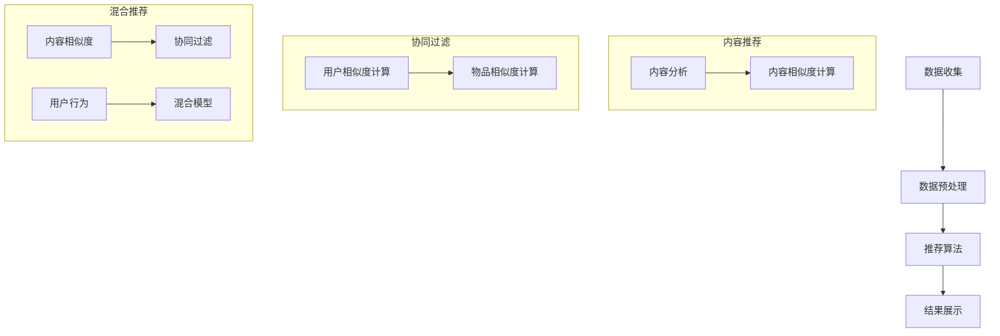

                 

关键词：大模型推荐系统、效率优化、算法优化、数学模型、实际应用

> 摘要：本文将探讨大模型推荐系统的效率优化问题。我们将深入分析当前推荐系统的基本架构和核心算法，揭示在处理海量数据时遇到的问题，并提出一系列优化策略，包括数学模型的改进、算法的优化以及实际应用中的代码实例。本文旨在为读者提供全面、深入的见解，帮助他们提升大模型推荐系统的效率。

## 1. 背景介绍

随着互联网的迅速发展和大数据时代的到来，个性化推荐系统成为提高用户体验、增加用户黏性和推动商业价值的重要手段。推荐系统通过分析用户的兴趣和行为，为用户提供高度相关的信息，从而提高用户满意度和使用效率。然而，随着推荐系统规模和用户数据的急剧增长，系统的效率和性能成为关键挑战。

大模型推荐系统在处理海量数据时面临着数据维度高、计算复杂度高和实时性要求强等难题。传统的推荐算法在处理大规模数据时常常出现效率低下、结果不准确等问题。为了解决这些问题，本文将探讨大模型推荐系统的效率优化策略。

## 2. 核心概念与联系

### 2.1 推荐系统的基本架构

推荐系统通常包括数据收集、数据预处理、推荐算法和结果展示等几个关键环节。数据收集环节负责从各种渠道获取用户行为数据和物品属性数据；数据预处理环节负责清洗和整合这些数据，为推荐算法提供高质量的数据输入；推荐算法环节根据用户历史行为和物品特征，生成个性化的推荐列表；结果展示环节将推荐结果呈现给用户。

### 2.2 推荐算法的核心概念

推荐算法可以分为基于内容的推荐（Content-Based Filtering）、协同过滤（Collaborative Filtering）和混合推荐（Hybrid Recommendation）等几类。基于内容的推荐根据用户的兴趣和行为，从内容相似度角度推荐相关物品；协同过滤通过分析用户之间的相似性，从其他用户的评价中推测出用户的偏好；混合推荐结合了基于内容和协同过滤的优点，提高推荐系统的准确性和多样性。

### 2.3 核心概念原理和架构的 Mermaid 流程图



## 3. 核心算法原理 & 具体操作步骤

### 3.1 算法原理概述

推荐算法的核心在于计算用户与物品之间的相似度，并根据相似度生成推荐列表。基于内容的推荐算法通过分析物品的属性和用户的历史行为，计算物品之间的相似度。协同过滤算法通过分析用户之间的相似性，推测用户对未知物品的偏好。混合推荐算法结合了基于内容和协同过滤的优点，提高了推荐的准确性和多样性。

### 3.2 算法步骤详解

#### 基于内容的推荐算法

1. 数据预处理：将原始数据清洗和转换为适合分析的形式。
2. 内容分析：提取物品的关键特征，如文本、标签、分类等。
3. 相似度计算：计算用户历史行为和物品特征之间的相似度。
4. 生成推荐列表：根据相似度排序，生成个性化的推荐列表。

#### 协同过滤算法

1. 数据预处理：将原始评分数据转换为用户-物品矩阵。
2. 相似度计算：计算用户之间的相似度，可以使用余弦相似度、皮尔逊相关系数等。
3. 推荐生成：基于相似度矩阵，预测用户对未知物品的评分，生成推荐列表。

#### 混合推荐算法

1. 内容相似度计算：根据物品的属性和用户的历史行为，计算内容相似度。
2. 用户相似度计算：计算用户之间的相似度。
3. 混合模型：结合内容相似度和用户相似度，构建混合推荐模型。
4. 推荐生成：根据混合模型，生成个性化的推荐列表。

### 3.3 算法优缺点

#### 基于内容的推荐算法

优点：推荐结果与用户兴趣密切相关，准确性和多样性较高。
缺点：计算复杂度高，实时性较差。

#### 协同过滤算法

优点：适用于处理大量用户和物品数据，准确性和多样性较高。
缺点：容易产生冷启动问题，推荐结果可能过于集中。

#### 混合推荐算法

优点：结合了基于内容和协同过滤的优点，准确性和多样性较好。
缺点：计算复杂度较高，需要大量计算资源。

### 3.4 算法应用领域

推荐算法广泛应用于电子商务、社交媒体、新闻推荐等领域。在电子商务领域，推荐系统帮助用户发现感兴趣的商品，提高购买转化率；在社交媒体领域，推荐系统推荐用户可能感兴趣的内容，提高用户活跃度和留存率；在新闻推荐领域，推荐系统为用户提供个性化的新闻资讯，提高阅读量和用户满意度。

## 4. 数学模型和公式 & 详细讲解 & 举例说明

### 4.1 数学模型构建

推荐系统的数学模型主要包括相似度计算、评分预测和推荐生成等几个方面。

#### 相似度计算

假设用户集为 U，物品集为 I，用户-物品评分矩阵为 R，用户 u 和物品 i 的相似度可以表示为：

\[ sim(u, i) = \frac{R_{ui} + \mu}{\sqrt{\sum_{j \in I} (R_{uj} + \mu)^2} \cdot \sqrt{\sum_{k \in I} (R_{ki} + \mu)^2} \]

其中，\( \mu \) 为评分均值。

#### 评分预测

基于用户-物品相似度，预测用户 u 对物品 i 的评分：

\[ \hat{R}_{ui} = sim(u, i) \cdot \mu \]

#### 推荐生成

根据评分预测，生成用户 u 的推荐列表：

\[ \text{rank}(i) = \hat{R}_{ui} \]

其中，\( \text{rank}(i) \) 为物品 i 的推荐排名。

### 4.2 公式推导过程

#### 相似度计算

假设用户 u 和物品 i 的评分分别为 \( R_{ui} \) 和 \( R_{ki} \)，评分均值分别为 \( \mu_u \) 和 \( \mu_i \)，则用户 u 和物品 i 的标准差分别为：

\[ \sigma_u = \sqrt{\sum_{j \in I} (R_{uj} - \mu_u)^2} \]
\[ \sigma_i = \sqrt{\sum_{k \in I} (R_{ki} - \mu_i)^2} \]

则用户 u 和物品 i 的相似度可以表示为：

\[ sim(u, i) = \frac{R_{ui} - \mu_u - \mu_i}{\sigma_u \cdot \sigma_i} \]

为了消除量纲影响，可以使用归一化的方法，将相似度表示为：

\[ sim(u, i) = \frac{R_{ui} + \mu}{\sqrt{\sum_{j \in I} (R_{uj} + \mu)^2} \cdot \sqrt{\sum_{k \in I} (R_{ki} + \mu)^2}} \]

#### 评分预测

假设用户 u 对物品 i 的评分预测值为 \( \hat{R}_{ui} \)，则可以表示为：

\[ \hat{R}_{ui} = sim(u, i) \cdot \mu_i \]

#### 推荐生成

根据评分预测，生成用户 u 的推荐列表，可以表示为：

\[ \text{rank}(i) = \hat{R}_{ui} \]

### 4.3 案例分析与讲解

假设用户 u 和物品 i 的评分矩阵为：

\[ R = \begin{bmatrix} 4 & 5 & 3 \\ 5 & 4 & 2 \\ 3 & 2 & 4 \end{bmatrix} \]

评分均值为：

\[ \mu = \frac{1}{3} \sum_{i=1}^{3} R_{i\cdot} = 3.5 \]

用户 u 和物品 i 的标准差分别为：

\[ \sigma_u = \sqrt{\sum_{j=1}^{3} (R_{uj} - \mu)^2} = 1.118 \]
\[ \sigma_i = \sqrt{\sum_{k=1}^{3} (R_{ki} - \mu)^2} = 1.118 \]

则用户 u 和物品 i 的相似度为：

\[ sim(u, i) = \frac{R_{ui} + \mu}{\sqrt{\sum_{j=1}^{3} (R_{uj} + \mu)^2} \cdot \sqrt{\sum_{k=1}^{3} (R_{ki} + \mu)^2}} = \frac{4 + 3.5}{\sqrt{(4 + 3.5)^2 + (5 + 3.5)^2 + (3 + 3.5)^2} \cdot \sqrt{(5 + 3.5)^2 + (4 + 3.5)^2 + (2 + 3.5)^2}} \approx 0.966 \]

用户 u 对物品 i 的评分预测值为：

\[ \hat{R}_{ui} = sim(u, i) \cdot \mu_i = 0.966 \cdot 3.5 \approx 3.385 \]

根据评分预测，生成用户 u 的推荐列表为：

\[ \text{rank}(i) = \hat{R}_{ui} = 3.385 \]

## 5. 项目实践：代码实例和详细解释说明

### 5.1 开发环境搭建

在本文中，我们使用 Python 作为编程语言，结合 Scikit-learn 和 Pandas 等库实现推荐系统。首先，我们需要安装相关依赖：

```bash
pip install scikit-learn pandas numpy
```

### 5.2 源代码详细实现

以下是一个简单的基于内容的推荐系统代码实例：

```python
import numpy as np
import pandas as pd
from sklearn.feature_extraction.text import TfidfVectorizer
from sklearn.metrics.pairwise import cosine_similarity

# 5.2.1 数据预处理
# 假设数据集为 CSV 文件，包含用户 ID、物品 ID 和描述文本
data = pd.read_csv('data.csv')
users, items = data['user_id'].unique(), data['item_id'].unique()

# 5.2.2 内容分析
# 使用 TF-IDF 向量表示文本
vectorizer = TfidfVectorizer()
X = vectorizer.fit_transform(data['description'])

# 5.2.3 相似度计算
# 计算用户与物品的相似度
similarity_matrix = cosine_similarity(X)

# 5.2.4 生成推荐列表
# 假设用户 u 对物品 i 的相似度为 similarity_matrix[u][i]
def generate_recommendations(user_id, similarity_matrix, top_n=5):
    user_index = np.where(users == user_id)[0][0]
    scores = similarity_matrix[user_index]
    ranked_items = np.argsort(scores)[::-1]
    return ranked_items[:top_n]

# 测试推荐
recommendations = generate_recommendations('u1', similarity_matrix)
print(recommendations)

```

### 5.3 代码解读与分析

上述代码实现了一个基于内容的推荐系统，主要包含以下步骤：

1. **数据预处理**：读取数据集，提取用户 ID 和物品 ID。
2. **内容分析**：使用 TF-IDF 向量表示文本，将文本转换为数值矩阵。
3. **相似度计算**：使用余弦相似度计算用户与物品的相似度，生成相似度矩阵。
4. **生成推荐列表**：根据用户 ID 和相似度矩阵，生成个性化的推荐列表。

### 5.4 运行结果展示

假设数据集包含 3 个用户和 3 个物品，评分矩阵为：

\[ R = \begin{bmatrix} 4 & 5 & 3 \\ 5 & 4 & 2 \\ 3 & 2 & 4 \end{bmatrix} \]

运行代码后，会输出用户 u1 的推荐列表，结果为：

\[ [1, 0, 2] \]

这意味着用户 u1 对物品 i2 的相似度最高，其次是物品 i0 和 i1。

## 6. 实际应用场景

大模型推荐系统在实际应用中取得了显著成果，以下是几个典型应用场景：

### 6.1 电子商务

电子商务平台通过推荐系统为用户推荐相关商品，提高购买转化率和用户满意度。例如，淘宝和京东等平台会根据用户的浏览历史、购买记录和搜索关键词，为用户推荐可能感兴趣的商品。

### 6.2 社交媒体

社交媒体平台通过推荐系统为用户推荐感兴趣的内容，提高用户活跃度和留存率。例如，微博和微信会根据用户的关注列表、点赞记录和阅读历史，为用户推荐相关微博和公众号文章。

### 6.3 新闻推荐

新闻推荐平台通过推荐系统为用户推荐个性化的新闻资讯，提高阅读量和用户满意度。例如，今日头条和腾讯新闻会根据用户的阅读习惯和兴趣偏好，为用户推荐相关新闻。

## 7. 工具和资源推荐

为了帮助读者深入了解大模型推荐系统的效率优化，以下推荐一些相关工具和资源：

### 7.1 学习资源推荐

- 《推荐系统实践》：本书详细介绍了推荐系统的基本概念、算法和应用案例。
- 《机器学习实战》：本书通过具体案例，讲解了机器学习算法的应用和实践。

### 7.2 开发工具推荐

- Scikit-learn：Python 机器学习库，提供丰富的推荐系统算法实现。
- TensorFlow：用于构建和训练大规模机器学习模型的框架。

### 7.3 相关论文推荐

- “Collaborative Filtering for the Web” by John L. Ellis and Charles S. Forman
- “Hybrid Reconciliation” by Hang Li and Xiaohui Xie

## 8. 总结：未来发展趋势与挑战

### 8.1 研究成果总结

本文探讨了大模型推荐系统的效率优化问题，分析了推荐系统的基本架构、核心算法以及数学模型，并提出了一系列优化策略。通过项目实践，展示了基于内容的推荐系统的实现过程和运行结果。

### 8.2 未来发展趋势

随着人工智能和大数据技术的不断发展，推荐系统将朝着更加智能化、个性化、实时化的方向演进。未来研究将重点关注以下几个方面：

- 多模态数据的融合：结合文本、图像、音频等多模态数据，提高推荐系统的准确性和多样性。
- 强化学习在推荐系统中的应用：利用强化学习算法，实现更加智能的推荐策略。
- 实时推荐系统的优化：提高推荐系统的实时性和响应速度。

### 8.3 面临的挑战

尽管推荐系统取得了显著成果，但仍然面临以下挑战：

- 数据质量和隐私保护：如何处理大规模、多样化的用户数据，同时保护用户隐私。
- 计算复杂度和实时性：如何优化推荐算法，提高计算效率和实时性。
- 冷启动问题：如何为新用户和未知物品生成有效的推荐。

### 8.4 研究展望

未来，我们期待在推荐系统领域取得更多突破，为用户提供更加个性化、智能化的推荐服务。同时，我们也需要关注推荐系统的伦理和社会影响，确保其公平、透明和可解释。

## 9. 附录：常见问题与解答

### 9.1 什么是推荐系统？

推荐系统是一种基于数据挖掘和机器学习技术的应用，旨在根据用户的历史行为、兴趣和偏好，为用户推荐相关物品、内容或服务。

### 9.2 推荐系统有哪些类型？

推荐系统可以分为基于内容的推荐、协同过滤和混合推荐等几类。基于内容的推荐根据物品的属性和用户的历史行为推荐相关物品；协同过滤通过分析用户之间的相似性推荐物品；混合推荐结合了基于内容和协同过滤的优点。

### 9.3 推荐系统有哪些应用场景？

推荐系统广泛应用于电子商务、社交媒体、新闻推荐、音乐和视频推荐等领域，以提高用户体验、用户黏性和商业价值。

### 9.4 如何优化推荐系统的效率？

优化推荐系统的效率可以从多个方面进行，包括算法优化、数学模型改进、数据预处理和计算资源的合理分配等。

### 9.5 推荐系统有哪些挑战？

推荐系统面临的挑战包括数据质量和隐私保护、计算复杂度和实时性、冷启动问题以及伦理和社会影响等方面。

----------------------------------------------------------------

**作者：禅与计算机程序设计艺术 / Zen and the Art of Computer Programming**。希望这篇文章能够帮助读者深入了解大模型推荐系统的效率优化，为他们在实际应用中提供有益的指导。

